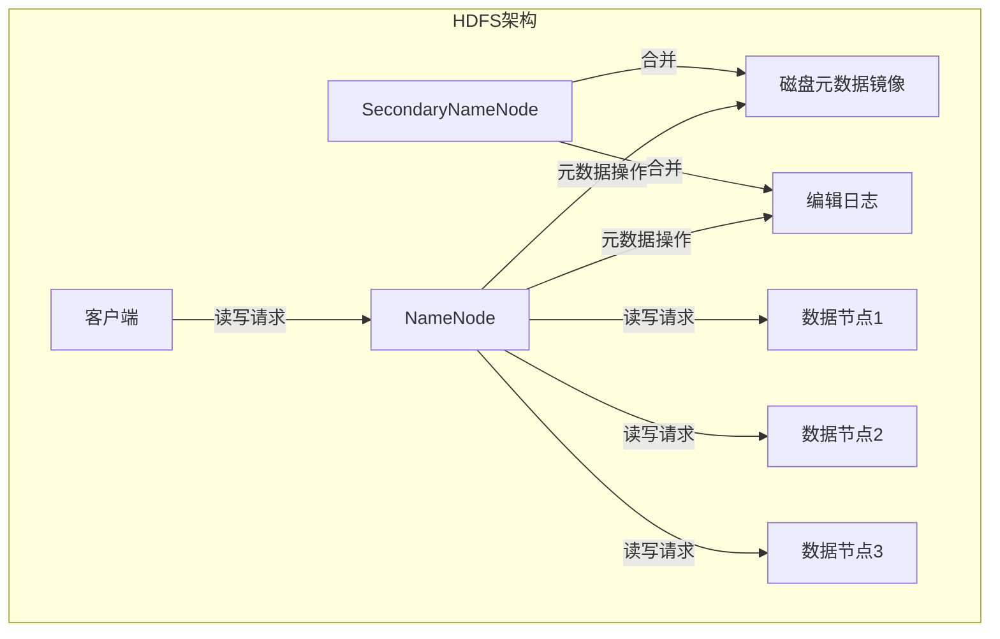
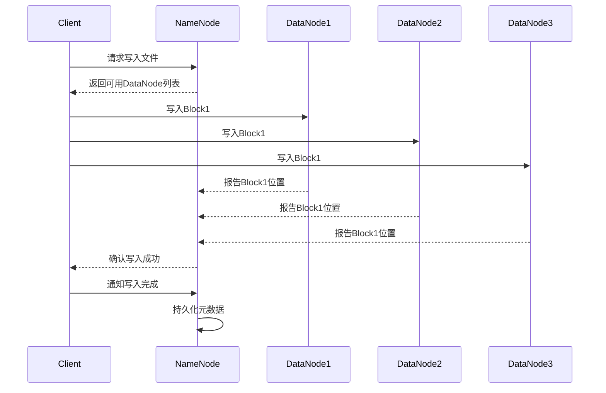
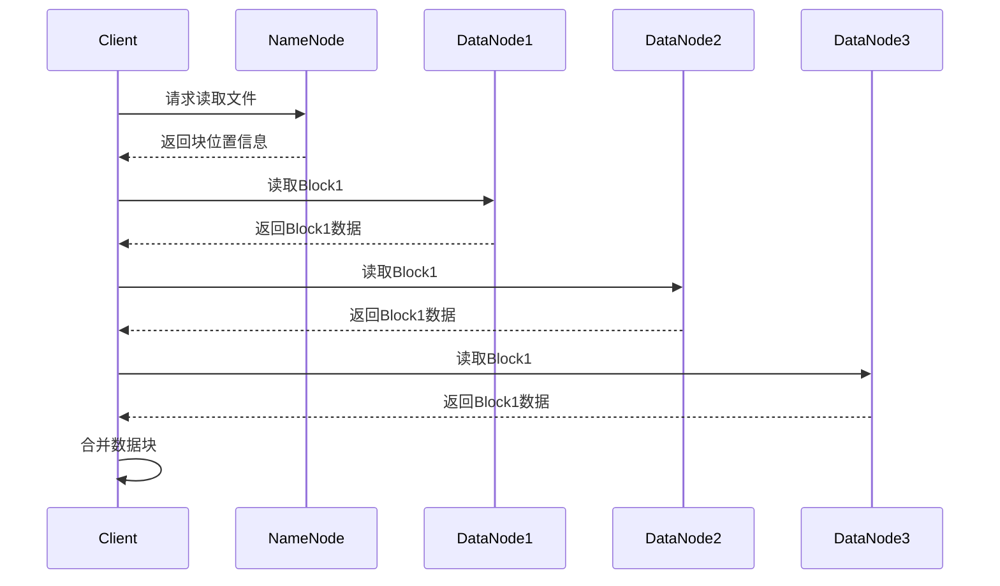

# HDFS原理与代码实例讲解

## 1.背景介绍

### 1.1 大数据时代的到来

随着互联网、物联网、云计算等技术的快速发展,海量的数据不断产生。传统的数据存储和处理系统已经无法满足当前大数据时代的需求。为了有效地存储和处理这些海量数据,分布式文件系统(Distributed File System)应运而生。

### 1.2 HDFS概述

Apache Hadoop分布式文件系统(HDFS)是Apache Hadoop项目的核心组件之一,是一种高可靠、高吞吐量的分布式文件系统。它旨在跨计算机集群存储大量数据,并为大型数据集提供高吞吐量的数据访问。HDFS采用主从架构,由一个NameNode(名称节点)和多个DataNode(数据节点)组成。

## 2.核心概念与联系

### 2.1 HDFS架构

HDFS采用主从架构,主要由以下几个组件组成:

- **NameNode(名称节点)**: 管理文件系统的命名空间和客户端对文件的访问操作。它是HDFS的主节点,负责维护文件系统的元数据。
- **DataNode(数据节点)**: 存储实际的文件数据块,并执行数据块的读写操作。
- **SecondaryNameNode(辅助名称节点)**: 定期合并NameNode的编辑日志,减轻NameNode的内存压力。
- **客户端**: 向HDFS发送读写请求。



### 2.2 HDFS文件块

HDFS将文件分割成一个或多个块(Block),并将这些块存储在一组DataNode上。默认情况下,每个块的大小为128MB。HDFS通过复制机制来实现数据的容错性,默认情况下,每个块会有3个副本,分别存储在不同的DataNode上。

## 3.核心算法原理具体操作步骤

### 3.1 文件写入流程

1. 客户端向NameNode发送写入请求,获取可用的DataNode列表。
2. 客户端将文件分割成一个或多个块,并将这些块分别写入DataNode。
3. DataNode在本地临时存储块数据,并向NameNode报告块存储位置。
4. NameNode记录块存储位置信息,并确认写入操作成功。
5. 客户端完成写入后,通知NameNode文件写入完成。
6. NameNode将文件元数据(文件名、副本位置等)持久化到磁盘。



### 3.2 文件读取流程

1. 客户端向NameNode发送读取请求,获取文件块位置信息。
2. NameNode返回文件块副本的位置信息。
3. 客户端根据副本位置信息,从最近的DataNode读取数据。
4. 客户端合并从多个DataNode读取的数据块,还原文件。



## 4.数学模型和公式详细讲解举例说明

### 4.1 数据块放置策略

HDFS采用机架感知策略来确定数据块的存储位置,以提高数据可靠性和读取性能。该策略的目标是:

- 在同一个机架内存储一个副本,以提高读取性能。
- 在不同机架存储其他副本,以提高容错性。

假设副本数量为 $N$,机架数量为 $R$,则数据块放置策略可以表示为:

$$
\begin{cases}
\text{在同一机架内存储 } \lfloor \frac{N}{R} \rfloor \text{ 个副本} \\
\text{在不同机架存储 } N - \lfloor \frac{N}{R} \rfloor \times R \text{ 个副本}
\end{cases}
$$

例如,假设副本数量为3,机架数量为2,则:

- 在同一机架内存储 $\lfloor \frac{3}{2} \rfloor = 1$ 个副本
- 在不同机架存储 $3 - 1 \times 2 = 1$ 个副本

### 4.2 数据块复制

HDFS通过复制机制来实现数据的容错性。当一个DataNode失效时,NameNode会自动复制缺失的副本到其他DataNode上,以保证数据的可用性。

假设文件大小为 $S$,块大小为 $B$,副本数量为 $N$,则该文件的存储空间开销为:

$$
\text{存储空间开销} = \frac{S}{B} \times B \times N = S \times N
$$

例如,假设文件大小为1GB,块大小为128MB,副本数量为3,则该文件的存储空间开销为:

$$
\text{存储空间开销} = \frac{1024MB}{128MB} \times 128MB \times 3 = 3072MB = 3GB
$$

## 5.项目实践:代码实例和详细解释说明

### 5.1 HDFS Java API

Apache Hadoop提供了Java API,用于与HDFS进行交互。以下是一些常用的API示例:

#### 5.1.1 创建HDFS文件系统实例

```java
Configuration conf = new Configuration();
conf.set("fs.defaultFS", "hdfs://namenode:9000");
FileSystem fs = FileSystem.get(conf);
```

#### 5.1.2 创建目录

```java
Path dir = new Path("/user/hadoop/dir");
fs.mkdirs(dir);
```

#### 5.1.3 上传文件

```java
Path src = new Path("/local/file.txt");
Path dst = new Path("/user/hadoop/file.txt");
fs.copyFromLocalFile(src, dst);
```

#### 5.1.4 读取文件

```java
Path file = new Path("/user/hadoop/file.txt");
FSDataInputStream in = fs.open(file);
// 读取文件内容
in.close();
```

#### 5.1.5 列出目录下的文件

```java
Path dir = new Path("/user/hadoop/dir");
FileStatus[] files = fs.listStatus(dir);
for (FileStatus file : files) {
    System.out.println(file.getPath());
}
```

### 5.2 HDFS命令行操作

HDFS还提供了命令行工具,用于管理和操作HDFS。以下是一些常用命令:

- `hadoop fs -ls /user/hadoop/dir` 列出目录下的文件
- `hadoop fs -mkdir /user/hadoop/dir` 创建目录
- `hadoop fs -put /local/file.txt /user/hadoop/file.txt` 上传文件
- `hadoop fs -get /user/hadoop/file.txt /local/file.txt` 下载文件
- `hadoop fs -rm /user/hadoop/file.txt` 删除文件
- `hadoop fs -rmdir /user/hadoop/dir` 删除空目录

## 6.实际应用场景

HDFS广泛应用于以下场景:

### 6.1 大数据处理

HDFS与Apache Hadoop生态系统紧密集成,为大数据处理框架(如Apache Spark、Apache Hive等)提供了可靠的数据存储和访问服务。

### 6.2 日志分析

由于HDFS能够存储海量数据,因此它非常适合用于存储和分析大规模的日志数据,如Web服务器日志、应用程序日志等。

### 6.3 内容存储

HDFS可用于存储大型文件,如视频、音频、图像等,并为内容分发网络(CDN)提供数据支持。

### 6.4 备份和归档

HDFS的高可靠性和低成本特性使其成为备份和归档数据的理想选择。

## 7.工具和资源推荐

### 7.1 HDFS Web UI

HDFS提供了一个基于Web的用户界面,用于监控和管理HDFS集群。可以通过访问 `http://namenode:9870` 来查看HDFS的状态和配置信息。

### 7.2 Apache Hadoop官网

Apache Hadoop官网(https://hadoop.apache.org/)提供了丰富的文档、教程和社区资源,是学习和使用HDFS的重要参考。

### 7.3 HDFS操作手册

Apache Hadoop官方提供了HDFS操作手册(https://hadoop.apache.org/docs/stable/hadoop-project-dist/hadoop-hdfs/HDFSCommands.html),详细介绍了HDFS命令行工具的使用方法。

## 8.总结:未来发展趋势与挑战

### 8.1 存储容量的扩展

随着数据量的不断增长,HDFS需要持续扩展存储容量。这需要在保持高可用性和高性能的同时,实现无缝扩展。

### 8.2 元数据管理优化

NameNode负责管理整个文件系统的元数据,随着文件数量和规模的增长,元数据管理将成为一个挑战。需要优化元数据管理策略,提高系统的可扩展性。

### 8.3 安全性和隐私保护

在大数据环境下,数据安全性和隐私保护越来越受到重视。HDFS需要提供更加强大的安全机制,如加密存储、访问控制等,以满足不同场景的安全需求。

### 8.4 异构存储支持

随着新型存储介质(如SSD、NVMe等)的出现,HDFS需要支持异构存储,以充分利用不同存储介质的特性,提高系统的性能和效率。

### 8.5 云原生支持

随着云计算的普及,HDFS需要更好地支持云原生环境,实现与Kubernetes等云原生技术的无缝集成,以满足云环境下的需求。

## 9.附录:常见问题与解答

### 9.1 什么是HDFS的优缺点?

**优点**:

- 高容错性:通过数据块复制机制,可以提供高可靠性。
- 高吞吐量:适合于大规模数据的批量读写操作。
- 可扩展性:可以通过添加新节点来线性扩展存储容量。

**缺点**:

- 不适合低延迟数据访问:HDFS的设计目标是高吞吐量,而非低延迟。
- 不支持多用户写入和任意修改文件:一旦文件被写入,就无法修改,只能追加。
- 元数据存储瓶颈:NameNode存储所有元数据,可能会成为性能瓶颈。

### 9.2 HDFS如何实现高可用性?

HDFS通过以下机制实现高可用性:

- 数据块复制:每个数据块默认有3个副本,存储在不同的DataNode上。
- 副本自动恢复:当某个DataNode失效时,NameNode会自动在其他DataNode上复制缺失的副本。
- NameNode高可用:通过配置多个NameNode,实现NameNode的热备份,避免单点故障。

### 9.3 如何选择HDFS数据块大小?

选择合适的数据块大小对于HDFS的性能至关重要。一般来说,较大的块大小有利于提高数据传输效率,但也会增加内存开销。反之,较小的块大小则会降低传输效率,但可以提高存储利用率。

通常情况下,HDFS的默认块大小(128MB)已经足够满足大多数场景。但在某些特殊情况下,可以根据具体需求调整块大小,例如:

- 对于大文件,可以适当增加块大小,以提高