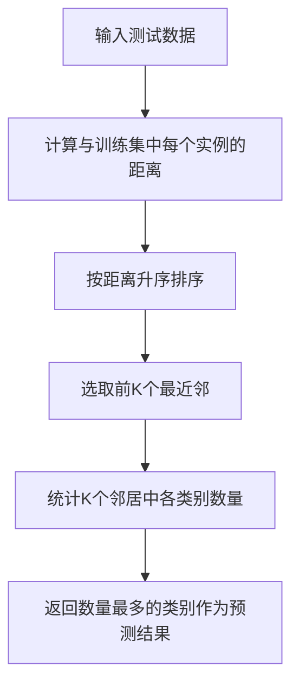

# K-最近邻KNN原理与代码实例讲解

## 1.背景介绍

在机器学习和数据挖掘领域中,K-最近邻(K-Nearest Neighbor,简称KNN)算法是一种非常基础且广泛使用的监督学习算法。它的工作原理是基于实例与实例之间的相似度,通过计算测试数据与训练集中所有实例的距离,选取距离最近的K个邻居,然后基于这K个邻居的多数类别对测试数据进行分类。KNN算法简单、易于理解,且对数据没有任何假设,同时在许多现实任务中表现出色。

## 2.核心概念与联系

### 2.1 距离度量

KNN算法的核心是计算测试数据与训练集中每个实例之间的距离,常用的距离度量有:

- **欧几里得距离(Euclidean Distance)**

$$
d(x,y) = \sqrt{\sum_{i=1}^{n}(x_i - y_i)^2}
$$

其中$x$和$y$是$n$维空间中的两个点。

- **曼哈顿距离(Manhattan Distance)**

$$
d(x,y) = \sum_{i=1}^{n}|x_i - y_i|
$$

- **明可夫斯基距离(Minkowski Distance)**

$$
d(x,y) = \left(\sum_{i=1}^{n}|x_i - y_i|^p\right)^{\frac{1}{p}}
$$

当$p=2$时,就是欧几里得距离;当$p=1$时,就是曼哈顿距离。

对于文本等非数值型数据,也可以使用编辑距离等其他距离度量。

### 2.2 K值的选择

K值的选择对算法性能有很大影响。K值太小,模型容易受噪声影响;K值太大,又会使模型变得不够局部。通常可以通过交叉验证等方法来选择最优K值。

### 2.3 分类决策规则

对于新的测试数据,根据它与训练集中所有实例的距离排序,选取前K个最近邻。然后根据这K个邻居的多数类别,为测试数据预测类别标签。

如果K=1,则直接选取与测试数据距离最近的训练实例的类别作为预测结果,这种特殊情况称为最近邻算法。

## 3.核心算法原理具体操作步骤 

KNN算法的核心步骤如下:

1. 计算测试数据与训练集中每个实例的距离
2. 按距离升序排序
3. 选取前K个最近邻
4. 统计这K个邻居中各类别的数量
5. 返回数量最多的类别作为测试数据的预测类别

算法伪代码:

```
对于每个测试数据x:
    计算x与训练集中每个实例的距离
    按距离排序,选取前K个最近邻实例
    统计这K个邻居中各类别的数量
    返回数量最多的类别作为x的预测类别
```

KNN算法的流程图:



## 4.数学模型和公式详细讲解举例说明

KNN算法没有显式的数学模型,其核心是基于实例与实例之间的距离。对于给定的测试数据$x$,我们需要计算它与训练集$D=\{(x_1,y_1),(x_2,y_2),...,(x_n,y_n)\}$中每个实例$(x_i,y_i)$的距离$d(x,x_i)$,其中$y_i$是实例$x_i$的类别标记。

常用的距离度量有欧几里得距离、曼哈顿距离和明可夫斯基距离等,前面已经给出了它们的公式定义。

以二维空间的欧几里得距离为例,给定两个点$x=(x_1,x_2)$和$y=(y_1,y_2)$,它们的欧几里得距离为:

$$
d(x,y) = \sqrt{(x_1 - y_1)^2 + (x_2 - y_2)^2}
$$

我们可以用Python代码来计算:

```python
import math

x = (1, 2)
y = (3, 4)

distance = math.sqrt((x[0] - y[0])**2 + (x[1] - y[1])**2)
print(distance) # 输出2.8284271247461903
```

对于高维数据,我们只需要将距离公式中的求和项扩展到n维即可。

## 5.项目实践:代码实例和详细解释说明

下面是使用Python和scikit-learn库实现KNN算法的代码示例:

```python
from sklearn.neighbors import KNeighborsClassifier
from sklearn.model_selection import train_test_split
from sklearn import datasets

# 加载iris数据集
iris = datasets.load_iris()
X, y = iris.data, iris.target

# 拆分训练集和测试集
X_train, X_test, y_train, y_test = train_test_split(X, y, test_size=0.3, random_state=42)

# 创建KNN分类器
knn = KNeighborsClassifier(n_neighbors=5)

# 训练模型
knn.fit(X_train, y_train)

# 预测测试集
y_pred = knn.predict(X_test)

# 计算准确率
accuracy = sum(y_pred == y_test) / len(y_test)
print(f"Accuracy: {accuracy * 100:.2f}%")
```

代码解释:

1. 导入相关库和数据集
2. 加载iris数据集,并拆分为训练集和测试集
3. 创建KNN分类器实例,设置K=5
4. 使用`fit()`方法在训练集上训练模型
5. 使用`predict()`方法对测试集进行预测
6. 计算预测准确率

你也可以尝试调整K值,观察对准确率的影响。

KNN算法还支持距离度量、权重等高级功能,可以通过设置相应参数来使用。

## 6.实际应用场景

KNN算法可以应用于以下场景:

- **图像分类**: 将图像表示为特征向量,基于与训练集图像的相似度进行分类。
- **文本分类**: 将文本表示为词袋或TF-IDF向量,基于与训练文本的相似度进行分类。
- **推荐系统**: 根据用户的历史行为,找到与该用户最相似的其他用户,并推荐这些相似用户喜欢的物品。
- **异常检测**: 测试实例与训练集的距离较远时,可以将其标记为异常值。

总的来说,对于无需建模的简单数据集,KNN算法可以作为一种基线方法,获得较好的性能。

## 7.工具和资源推荐

- **scikit-learn**: 机器学习的Python库,提供了KNN算法的实现。
- **Jupyter Notebook**: 交互式计算环境,适合数据分析和模型实验。
- **UCI机器学习数据集**: 提供了多种可用于测试的标准数据集。
- **《机器学习实战》**: 一本经典的机器学习入门书籍,对KNN等算法有详细介绍。
- **《模式分类》**: 专门介绍模式识别和分类算法的经典著作。

## 8.总结:未来发展趋势与挑战

KNN算法简单直观,但也存在一些缺陷和挑战:

- **计算开销大**: 对于大规模数据集,需要计算测试实例与所有训练实例的距离,计算量较大。
- **维数灾难**: 在高维空间中,由于维数的增加,数据变得越来越稀疏,距离计算也会失去意义。
- **数据不平衡**: 当某些类别的实例数量远多于其他类别时,KNN的性能会下降。

为了解决这些问题,研究人员提出了多种改进方法,如:

- **近似最近邻算法**: 使用空间划分树等数据结构,加速最近邻搜索。
- **基于实例的学习算法**: 通过选择代表性实例来减小训练集的规模。
- **改进的距离度量**: 设计更合理的距离度量函数,提高算法性能。

此外,结合其他机器学习技术,如集成学习、特征选择等,也是KNN算法发展的一个方向。

## 9.附录:常见问题与解答

1. **KNN算法适合什么样的数据?**

KNN算法适合于较小的训练数据集,并且特征的维度不太高。对于大规模高维数据集,KNN的计算开销会很大。

2. **如何选择最佳的K值?**

通常可以使用交叉验证等方法,在验证集上评估不同K值对应的模型性能,选择性能最优的K值。K值的选择需要权衡模型的偏差和方差。

3. **KNN算法能处理缺失值吗?**  

KNN本身无法直接处理缺失值。一种常见的做法是,对缺失的特征进行填充(如用中位数或均值填充),然后再应用KNN算法。

4. **KNN算法是否适用于回归问题?**

KNN算法同样可以用于回归问题。在这种情况下,我们选取K个最近邻实例,并计算它们目标值的均值或加权均值作为预测结果。

5. **KNN算法的时间复杂度和空间复杂度是多少?**

训练时间复杂度为O(n),其中n是训练集的大小。预测时间复杂度为O(n*d),其中d是特征维度。空间复杂度为O(n*d),需要存储整个训练集。

作者: 禅与计算机程序设计艺术 / Zen and the Art of Computer Programming