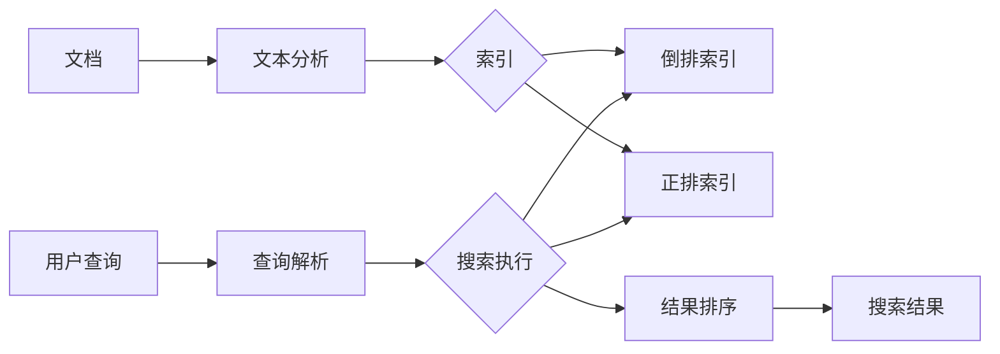

# Lucene搜索引擎原理与代码实例讲解

## 1.背景介绍
### 1.1 搜索引擎的发展历程
### 1.2 Lucene的起源与发展 
### 1.3 Lucene在搜索引擎领域的地位

## 2.核心概念与联系
### 2.1 Lucene的整体架构
#### 2.1.1 索引(Index)
#### 2.1.2 文档(Document) 
#### 2.1.3 域(Field)
#### 2.1.4 词(Term)
### 2.2 Lucene的索引过程
#### 2.2.1 文档收集
#### 2.2.2 文本分析
#### 2.2.3 索引创建
### 2.3 Lucene的搜索过程  
#### 2.3.1 用户查询
#### 2.3.2 查询解析
#### 2.3.3 搜索执行
#### 2.3.4 结果排序



## 3.核心算法原理具体操作步骤
### 3.1 文本分析算法
#### 3.1.1 分词(Tokenization)
#### 3.1.2 词根化(Stemming)
#### 3.1.3 词性标注(POS Tagging) 
#### 3.1.4 停用词过滤(Stop Words Filtering)
### 3.2 索引创建算法
#### 3.2.1 倒排索引(Inverted Index)
#### 3.2.2 压缩存储(Compression)
#### 3.2.3 增量更新(Incremental Update)
### 3.3 相关度排序算法
#### 3.3.1 TF-IDF
#### 3.3.2 BM25
#### 3.3.3 向量空间模型(VSM)

## 4.数学模型和公式详细讲解举例说明
### 4.1 布尔模型(Boolean Model) 
布尔模型是信息检索中使用的最简单的模型。它基于布尔逻辑将文档表示为布尔向量。给定查询 $q$，文档 $d$ 的相关性得分为：

$$ score(q,d) = \begin{cases}
1 & \text{如果 } d \text{ 满足 } q \\ 
0 & \text{否则}
\end{cases} $$

### 4.2 向量空间模型(Vector Space Model)
向量空间模型将文档和查询表示为 $t$ 维向量，其中 $t$ 是索引中的术语数。文档 $d_j$ 和查询 $q$ 之间的相似度可以用余弦相似度来计算：

$$ \cos(\vec{d_j},\vec{q}) = \frac{\vec{d_j} \cdot \vec{q}}{\|\vec{d_j}\| \|\vec{q}\|} = \frac{\sum_{i=1}^t w_{i,j} \cdot w_{i,q}}{\sqrt{\sum_{i=1}^t w_{i,j}^2} \sqrt{\sum_{i=1}^t w_{i,q}^2}} $$

其中 $w_{i,j}$ 和 $w_{i,q}$ 分别表示词项 $i$ 在文档 $d_j$ 和查询 $q$ 中的权重。

### 4.3 概率模型(Probabilistic Model)
概率模型试图估计给定文档与查询相关的概率。BM25就是一种广泛使用的概率模型，对于文档 $d$ 和查询 $q$，BM25得分定义为：

$$ score(q,d) = \sum_{i=1}^n IDF(q_i) \cdot \frac{f(q_i,d) \cdot (k_1+1)}{f(q_i,d) + k_1 \cdot (1-b+b \cdot \frac{|d|}{avgdl})} $$

其中 $IDF(q_i)$ 是 $q_i$ 的逆文档频率，$f(q_i,d)$ 是 $q_i$ 在 $d$ 中的词频，$|d|$ 是 $d$ 的长度，$avgdl$ 是文档平均长度，$k_1$ 和 $b$ 是调整参数。

## 5.项目实践：代码实例和详细解释说明
### 5.1 使用Lucene创建索引
```java
Directory directory = FSDirectory.open(Paths.get("index_dir"));
Analyzer analyzer = new StandardAnalyzer();
IndexWriterConfig config = new IndexWriterConfig(analyzer);
IndexWriter indexWriter = new IndexWriter(directory, config);

Document doc = new Document();
doc.add(new TextField("title", "Lucene in Action", Field.Store.YES));
doc.add(new TextField("content", "Lucene is a powerful search engine library.", Field.Store.YES));

indexWriter.addDocument(doc);
indexWriter.close();
```
上面的代码演示了如何使用Lucene创建一个简单的索引。首先打开一个索引目录，然后创建一个分析器(Analyzer)和索引写入器配置(IndexWriterConfig)。接着创建一个索引写入器(IndexWriter)，添加一个包含两个域(Field)的文档(Document)，最后关闭写入器。

### 5.2 使用Lucene进行搜索
```java
Directory directory = FSDirectory.open(Paths.get("index_dir"));
DirectoryReader reader = DirectoryReader.open(directory);
IndexSearcher searcher = new IndexSearcher(reader);

Analyzer analyzer = new StandardAnalyzer();
QueryParser parser = new QueryParser("content", analyzer);
Query query = parser.parse("powerful");

TopDocs results = searcher.search(query, 10);
for (ScoreDoc scoreDoc : results.scoreDocs) {
    Document doc = searcher.doc(scoreDoc.doc);
    System.out.println(doc.get("title"));
}

reader.close();
```
上面的代码演示了如何使用Lucene进行搜索。首先打开索引目录并创建一个目录读取器(DirectoryReader)，然后基于读取器创建一个索引搜索器(IndexSearcher)。接着使用查询解析器(QueryParser)解析用户输入的查询字符串，执行搜索并打印结果文档的标题域。最后关闭读取器。

## 6.实际应用场景
### 6.1 全文检索
Lucene最常见的应用场景就是全文检索。利用Lucene强大的索引和搜索能力，可以快速构建高效的全文搜索引擎，如论坛搜索、博客搜索、文档搜索等。
### 6.2 推荐系统
Lucene可以作为推荐系统的基础设施，利用其灵活的索引结构和相关度排序算法，实现基于内容的推荐和协同过滤推荐。
### 6.3 自然语言处理
Lucene提供了丰富的文本分析组件，如分词器、词干提取器等，可以作为自然语言处理管道的一部分，与其他NLP库如OpenNLP、Stanford NLP等集成，完成命名实体识别、情感分析等任务。

## 7.工具和资源推荐
- Luke：方便查看和调试Lucene索引的工具
- Elasticsearch：基于Lucene构建的开源分布式搜索引擎
- Solr：基于Lucene构建的开源企业搜索平台 
- Lucene官方网站：https://lucene.apache.org/
- Lucene官方文档：https://lucene.apache.org/core/documentation.html
- Lucene官方示例：https://lucene.apache.org/core/demos.html

## 8.总结：未来发展趋势与挑战
### 8.1 Lucene的发展趋势
- 云原生：适应云计算环境，提供更好的分布式支持
- 机器学习：融合最新的机器学习排序算法，提供语义搜索能力
- 图搜索：支持图数据的索引和查询，满足知识图谱等场景需求
- 实时索引：提供更低延迟的实时索引更新能力，满足实时搜索需求

### 8.2 Lucene面临的挑战
- 性能优化：在海量数据场景下，不断优化索引和查询性能
- 用户体验：提供更加智能和个性化的搜索体验，如查询推荐、结果多样性等
- 数据安全：在分布式环境下，提供数据加密、权限管理等安全保障
- 移动搜索：适配移动设备的特点，提供轻量级和低功耗的移动搜索方案

## 9.附录：常见问题与解答
### 9.1 Lucene与Elasticsearch和Solr的关系是什么？
Lucene是一个搜索引擎底层库，提供了索引和搜索的基本功能。Elasticsearch和Solr都是基于Lucene构建的开源搜索引擎，提供了更高层次的功能，如分布式部署、REST API等，使得Lucene更易于使用和集成。
### 9.2 Lucene的索引结构是怎样的？
Lucene的索引结构主要包括：

- 段(Segment)：索引的最小单位，包含多个文档
- 文档(Document)：搜索的基本单位，包含多个域
- 域(Field)：文档的一个属性，如标题、作者等
- 词(Term)：域中的一个关键词，搜索的最小单位

通过这种层次化的结构，Lucene可以快速定位到包含搜索关键词的文档，并根据相关度算法进行排序。

### 9.3 Lucene支持哪些查询类型？
Lucene支持多种查询类型，主要包括：

- TermQuery：基于词项的查询
- BooleanQuery：组合多个查询条件的布尔查询
- PhraseQuery：基于短语的查询
- WildcardQuery：通配符查询
- FuzzyQuery：模糊查询
- RangeQuery：范围查询
- PrefixQuery：前缀查询

通过组合使用这些查询类型，可以实现灵活多变的搜索需求。

### 9.4 Lucene如何实现分布式索引和搜索？
Lucene本身是一个单机的搜索引擎库，并没有提供分布式支持。但基于Lucene构建的Elasticsearch和Solr都提供了分布式能力。它们的基本思路是：

- 将索引划分为多个分片(Shard)，分布在不同的节点上
- 每个分片都是一个独立的Lucene索引，可以独立处理查询请求
- 查询时将请求发送到所有相关的分片，然后汇总结果
- 索引更新时同步到所有的副本分片，保证数据一致性

通过这种分布式架构，可以实现索引和查询的高可用和水平扩展。

### 9.5 Lucene的高亮显示是如何实现的？
Lucene提供了高亮显示搜索结果中关键词的能力，其基本原理是：

1. 对查询语句进行解析，提取出所有的关键词
2. 对要高亮的文本进行分词，得到词项流
3. 遍历词项流，匹配查询的关键词
4. 对匹配到的关键词进行标记，如添加HTML标签
5. 将标记后的词项流拼接为结果文本

Lucene提供了不同的高亮器实现，如`SimpleHTMLFormatter`、`GradientFormatter`等，可以根据需要进行选择和定制。

作者：禅与计算机程序设计艺术 / Zen and the Art of Computer Programming