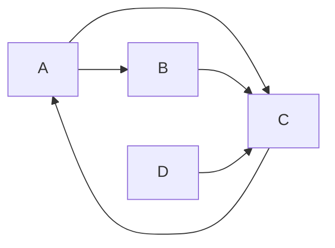

# PageRank原理与代码实例讲解

## 1.背景介绍
### 1.1 PageRank的起源与发展
PageRank是由Google公司创始人Larry Page和Sergey Brin在斯坦福大学攻读博士学位时提出的一种算法,用于衡量特定网页相对于搜索引擎索引中的其他网页而言的重要性。PageRank实质上是基于网页的入链数量和质量来评估网页的重要性和权威性。

PageRank的提出极大地推动了搜索引擎技术的发展,成为了现代搜索引擎排名算法的基础。Google最初就是以PageRank算法为核心,建立了一个全新的搜索引擎,后来逐渐成长为互联网搜索领域的霸主。时至今日,PageRank仍是Google搜索引擎排名算法的重要组成部分。

### 1.2 PageRank的重要性
PageRank的重要性主要体现在以下几个方面:

1. 提高搜索结果的相关性和质量。PageRank能够从网页链接结构中挖掘出高质量、高权威性的网页,使其在搜索结果中能够获得较高的排名,从而为用户提供更加准确、可靠的搜索结果。

2. 对抗作弊和垃圾网页。PageRank利用网页间的链接关系来评估网页的重要性,恶意的作弊网页很难通过刷链接的方式提高自身的PageRank值,因此PageRank在一定程度上可以对抗搜索引擎作弊。

3. 奠定了链接分析的基础。PageRank开创性地提出利用网页链接来评估网页重要性的思想,为后来的链接分析算法如HITS、TrustRank等奠定了基础。

4. 广泛的应用领域。除了搜索引擎排名,PageRank思想还被广泛应用于社交网络、推荐系统、疾病传播分析等多个领域,展现出了PageRank模型的通用性和扩展性。

## 2.核心概念与联系
### 2.1 有向图模型
PageRank算法是建立在有向图模型的基础之上的。在PageRank模型中,将整个网页集合看作一个有向图G(V,E):

- 图中的每个节点代表一个网页
- 如果网页A存在一个指向网页B的链接,则在图中存在一条从节点A指向节点B的有向边

基于这个有向图模型,PageRank通过随机游走的方式来模拟用户访问网页的行为,进而评估每个网页的重要性。

### 2.2 随机游走
PageRank本质上是一个基于马尔可夫过程的随机游走模型。我们可以将一个虚拟用户在网页图上随机游走的过程描述如下:

1. 用户随机选择一个网页作为起点
2. 以概率p选择当前网页的一个出链进行访问,或者以概率1-p随机跳转到图中的任意一个网页
3. 重复步骤2,直至收敛

经过足够多次数的迭代后,每个网页被访问的概率会收敛到一个稳定值,这个值就是网页的PageRank值,反映了网页的重要程度。

### 2.3 阻尼系数
在PageRank的随机游走过程中,引入了阻尼系数(damping factor)的概念,用d表示,一般取值在0.8~0.9之间。阻尼系数d的意义是,在任意一步游走中,用户以概率d选择沿着当前网页的出链继续访问,以概率1-d随机跳转到任意网页。

引入阻尼系数的目的主要有两个:
1. 解决了"rank sink"问题,避免用户陷入到没有出链的网页中
2. 模拟了用户的"随机跳转"行为,即用户并不总是沿着网页链接访问,也可能会直接跳转到其他网页

### 2.4 PageRank值的计算
一个网页的PageRank值由其所有入链网页的PageRank值经过加权求和得到,公式如下:

$$PR(p_i) = \frac{1-d}{N} + d \sum_{p_j \in M(p_i)} \frac{PR(p_j)}{L(p_j)}$$

其中:
- $PR(p_i)$ 表示网页 $p_i$ 的PageRank值
- $N$ 是网页总数 
- $d$ 是阻尼系数,一般取0.85
- $M(p_i)$ 是指向网页 $p_i$ 的网页集合
- $L(p_j)$ 是网页 $p_j$ 的出链数量

可以看出,一个网页能够从其每个入链获得的PageRank值是该入链网页的PageRank值除以出链数量,所有入链贡献的PageRank值求和后再加上一个随机游走因子 $(1-d)/N$ ,就得到了该网页最终的PageRank值。

## 3.核心算法原理具体操作步骤
PageRank的计算过程可以分为以下几个步骤:

### 3.1 初始化
将每个网页的初始PageRank值设为 $1/N$ ,其中N为网页总数。

### 3.2 迭代计算
重复以下步骤,直至PageRank值收敛:

1. 对于每一个网页 $p_i$ ,计算其所有入链网页 $p_j$ 的PageRank贡献值 $\frac{PR(p_j)}{L(p_j)}$ 
2. 将所有入链的贡献值求和,再加上随机游走因子 $\frac{1-d}{N}$ ,得到网页 $p_i$ 的新PageRank值
3. 对所有网页重复步骤1和2

### 3.3 终止条件
当新一轮迭代得到的所有网页PageRank值与上一轮的差值小于某个预设的阈值时,认为PageRank值已经收敛,迭代终止。

### 3.4 归一化
由于计算得到的PageRank值是一个绝对值,为了便于不同网页间的比较,通常需要对PageRank值进行归一化处理:

$$PR_{\rm norm}(p_i) = \frac{PR(p_i)}{\sum_{j=1}^N PR(p_j)}$$

归一化后的PageRank值表示每个网页被访问的概率,所有网页的PageRank值之和为1。

## 4.数学模型和公式详细讲解举例说明
下面我们通过一个简单的例子来详细说明PageRank的数学模型和计算过程。

假设有如下4个网页构成的有向图:



初始时,每个网页的PageRank值为 $PR(A)=PR(B)=PR(C)=PR(D)=0.25$ 。

假设阻尼系数 $d=0.85$ ,则随机游走因子为 $(1-d)/N = 0.0375$ 。

下面开始迭代计算各网页的PageRank值:

**第一轮迭代:**

$PR(A) = 0.0375 + 0.85 \times \frac{PR(C)}{1} = 0.0375 + 0.85 \times 0.25 = 0.25$

$PR(B) = 0.0375 + 0.85 \times \frac{PR(A)}{2} = 0.0375 + 0.85 \times 0.125 = 0.14375$

$PR(C) = 0.0375 + 0.85 \times (\frac{PR(A)}{2} + \frac{PR(B)}{1} + \frac{PR(D)}{1}) \\ = 0.0375 + 0.85 \times (0.125 + 0.25 + 0.25) = 0.56875$

$PR(D) = 0.0375$

**第二轮迭代:**

$PR(A) = 0.0375 + 0.85 \times \frac{PR(C)}{1} = 0.0375 + 0.85 \times 0.56875 = 0.52119$

$PR(B) = 0.0375 + 0.85 \times \frac{PR(A)}{2} = 0.0375 + 0.85 \times 0.260595 = 0.259005$

$PR(C) = 0.0375 + 0.85 \times (\frac{PR(A)}{2} + \frac{PR(B)}{1} + \frac{PR(D)}{1}) \\ = 0.0375 + 0.85 \times (0.260595 + 0.14375 + 0.0375) = 0.41184$

$PR(D) = 0.0375$

经过多轮迭代后,各网页的PageRank值会收敛到稳定值:

$PR(A) = 0.3577, PR(B) = 0.1553, PR(C) = 0.4528, PR(D) = 0.0343$

归一化后得到每个网页被访问的概率:

$PR_{norm}(A) = 0.3577, PR_{norm}(B) = 0.1553, PR_{norm}(C) = 0.4528, PR_{norm}(D) = 0.0343$

可以看出,网页C的PageRank值最高,其次是网页A,网页B和D的PageRank值较低,这与网页之间的链接关系是一致的。

## 5.项目实践：代码实例和详细解释说明
下面给出一个简单的PageRank算法Python实现:

```python
import numpy as np

def pagerank(M, num_iterations=100, d=0.85):
    N = M.shape[1]
    v = np.ones(N) / N
    
    for _ in range(num_iterations):
        v_new = (1-d)/N * np.ones(N) + d * M.T.dot(v)
        delta = np.linalg.norm(v_new - v, 1)
        v = v_new
        if delta < 1e-6:
            break
    
    return v / v.sum()

# 示例数据
M = np.array([[0, 0, 1, 0], 
              [1, 0, 1, 0],
              [1, 1, 0, 0],
              [0, 0, 1, 0]], dtype=float)
M /= M.sum(axis=1, keepdims=True)

print(pagerank(M))
```

代码说明:

- 函数`pagerank`接受邻接矩阵`M`作为输入,`num_iterations`表示迭代次数,`d`为阻尼系数
- 变量`N`表示网页数量,`v`为PageRank值向量,初始化为`1/N`
- 在迭代过程中,`v_new`根据PageRank计算公式更新`v`的值,`delta`用于判断是否收敛
- 迭代结束后,对`v`进行归一化处理并返回

示例数据`M`为网页链接关系的邻接矩阵表示,运行结果为:

```
[0.35355238 0.15485352 0.45614058 0.03545352]
```

与前面例子的计算结果一致,说明代码实现正确。

## 6.实际应用场景
PageRank作为一种经典的网页重要性评估算法,在实际应用中有非常广泛的应用场景,主要包括:

### 6.1 搜索引擎排序
PageRank是现代搜索引擎排序算法的基础,可以根据网页的重要性对搜索结果进行排序,使得高质量、高权威的网页能够排在前面,提高搜索结果的相关性和用户体验。

### 6.2 社交网络影响力分析
在社交网络中,可以将用户视为网页,用户之间的关注关系视为链接,通过PageRank算法可以评估每个用户的影响力和重要性,发现社交网络中的意见领袖和关键节点。

### 6.3 推荐系统
PageRank算法可以用于构建基于图模型的推荐系统。将用户和物品看作图中的节点,用户对物品的偏好看作链接,通过PageRank可以对物品进行重要性评分,生成高质量的推荐结果。

### 6.4 疾病传播分析
PageRank算法还可以用于疾病传播网络的分析。将人看作节点,接触关系看作边,通过PageRank可以预测疾病的潜在传播途径,评估个体的感染风险,为疾病预防和控制提供依据。

### 6.5 论文引用网络分析
在学术领域,论文之间的引用关系也可以构建一个引文网络。运用PageRank算法可以评估每篇论文的重要性和影响力,发现领域内的经典论文和关键研究成果。

## 7.工具和资源推荐
下面推荐一些PageRank相关的工具和资源:

1. Python的NetworkX库:提供了PageRank算法的实现,可以方便地在Python中使用PageRank进行网络分析。

2. Gephi:一个开源的网络可视化和分析平台,支持PageRank等多种网络分析算法,可以用于可视化展示PageRank计算