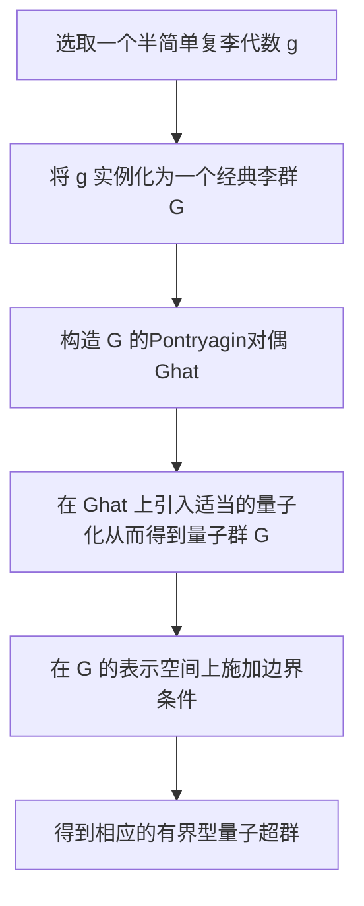

# Pontryagin对偶与代数量子超群：有界型量子超群

## 1.背景介绍

量子群和量子超群理论是近年来数学物理领域研究的一个重要热点。它们不仅在数学上具有丰富的代数和几何结构,而且在物理学中也有许多应用,例如量子反常统计力学、量子计算、量子场论和量子重力理论等。量子群和量子超群的研究为我们认识微观世界的本质提供了新的视角和工具。

有界型量子超群是量子超群理论中的一个重要分支,它是由Pontryagin对偶的观点出发构造的。Pontryagin对偶最初源于傅里叶分析,后来被推广到更一般的局部紧群和代数群的研究中。在量子群和量子超群的语境下,Pontryagin对偶为我们提供了一种将经典李群或李代数与量子群或量子超群联系起来的有力工具。

### 1.1 Pontryagin对偶的概念

对于任意一个局部紧拓扑群$G$,我们可以构造它的Pontryagin对偶群$\widehat{G}$,其元素是$G$上的连续同伦映射。$\widehat{G}$本身也是一个局部紧拓扑群,并且存在一个自然的同态$\kappa:G\rightarrow\widehat{\widehat{G}}$,将$G$嵌入到它的双对偶群中。当$\kappa$是一个同构时,我们称$G$是Pontryagin可对偶的。

### 1.2 有界型量子超群的构造

有界型量子超群的构造思路是:首先取一个半简单复李代数$\mathfrak{g}$,将其实例化为一个经典李群$G$。由于$G$是Pontryagin可对偶的,我们可以考虑它的Pontryagin对偶$\widehat{G}$,并在$\widehat{G}$上引入一个适当的量子化从而得到一个量子群$\mathbb{G}$。进一步,通过对$\mathbb{G}$的某些表示空间施加一些边界条件,我们就可以得到相应的有界型量子超群。

## 2.核心概念与联系

要理解有界型量子超群的本质,我们需要先了解以下几个核心概念:

### 2.1 李代数与量子群

李代数是研究连续无穷小变换的代数系统,是现代几何和物理学的基础。每一个李代数都可以对应唯一的一个连通的李群。量子群则是对经典李群进行去经典化的结果,它是一个非交换的代数,其生成元素满足某些关系多项式。

### 2.2 Pontryagin对偶

如前所述,Pontryagin对偶为我们提供了一种将经典李群或李代数与量子群或量子超群联系起来的桥梁。对于任意一个局部紧拓扑群$G$,我们可以构造它的Pontryagin对偶$\widehat{G}$,并在$\widehat{G}$上引入合适的量子化从而得到一个量子群。

### 2.3 有界型表示与有界型量子超群

量子群的表示通常是无界的,这给物理学应用带来了一些困难。有界型量子超群的思想就是在量子群的表示空间上施加合适的边界条件,使得表示变为有界的。这种有界性质对于研究相对论系统、低维系统等具有重要意义。

上述三个概念相互关联、相辅相成,共同构成了有界型量子超群理论的理论基础。

## 3.核心算法原理具体操作步骤

有界型量子超群的构造过程可以概括为以下几个核心步骤:



### 3.1 选取一个半简单复李代数$\mathfrak{g}$

这是整个构造的起点。我们通常选取某些具有好的代数和几何性质的半简单复李代数,如$\mathfrak{sl}(n,\mathbb{C})$、$\mathfrak{so}(n,\mathbb{C})$等。

### 3.2 将$\mathfrak{g}$实例化为一个经典李群$G$

利用李代数和李群之间的对应关系,我们可以从$\mathfrak{g}$出发构造出一个连通的李群$G$。

### 3.3 构造$G$的Pontryagin对偶$\widehat{G}$

这是关键的一步。由于$G$是Pontryagin可对偶的,我们可以构造出它的Pontryagin对偶$\widehat{G}$,其元素是$G$上的连续同伦映射。

### 3.4 在$\widehat{G}$上引入适当的量子化从而得到量子群$\mathbb{G}$

这一步需要利用量子群的构造方法,如FRT构造、Drinfeld双等。通过在$\widehat{G}$上引入合适的量子化,我们就得到了一个与$G$相关的量子群$\mathbb{G}$。

### 3.5 在$\mathbb{G}$的表示空间上施加边界条件

为了得到有界型量子超群,我们需要在$\mathbb{G}$的表示空间上施加合适的边界条件,使得表示变为有界的。这种边界条件的选取需要依赖于具体的物理背景。

### 3.6 得到相应的有界型量子超群

经过上述步骤,我们就成功构造出了一个与$\mathfrak{g}$相关的有界型量子超群。这个量子超群保留了$\mathfrak{g}$的代数和几何结构,同时还具有量子论的特性。

## 4.数学模型和公式详细讲解举例说明

为了更好地理解有界型量子超群的数学结构,我们来看一个具体的例子。

假设我们选取$\mathfrak{g}=\mathfrak{sl}(2,\mathbb{C})$,这是一个三维复半简单李代数,其基底可以取为$\{H,E^+,E^-\}$,它们满足如下交换关系:

$$
[H,E^\pm]=\pm2E^\pm,\qquad [E^+,E^-]=H
$$

我们可以从$\mathfrak{sl}(2,\mathbb{C})$出发构造出经典李群$SL(2,\mathbb{C})$,它是所有$2\times 2$复矩阵的特殊线性群。利用Pontryagin对偶,我们得到$\widehat{SL(2,\mathbb{C})}$,这是一个非平凡的无限连通李群。

接下来,我们在$\widehat{SL(2,\mathbb{C})}$上引入FRT构造,得到与之相关的量子群$\mathbb{G}$。$\mathbb{G}$由生成元$K,X^+,X^-$生成,它们满足如下交换关系:

$$
KX^\pm K^{-1}=q^{\pm2}X^\pm,\qquad [X^+,X^-]=\frac{K^2-K^{-2}}{q-q^{-1}}
$$

其中$q$是一个实数参数。当$q\rightarrow 1$时,$\mathbb{G}$就可以回到经典情形。

为了得到有界型量子超群,我们需要在$\mathbb{G}$的表示空间上施加边界条件。最简单的情况是考虑有限维不可约表示,它们自然就是有界的。我们可以对$\mathbb{G}$的有限维不可约表示空间$V_j$施加周期性边界条件:

$$
X^+(v)=0, \qquad \text{for } v\in V_j, \quad j=0,1,2,\ldots
$$

这种边界条件使得$V_j$中的向量只能由$X^-$作用生成,从而使表示成为有界的。这样,我们就得到了与$\mathfrak{sl}(2,\mathbb{C})$相关的一个有界型量子超群。

通过上面的例子,我们可以看到有界型量子超群是如何由经典李代数出发,利用Pontryagin对偶和量子化等一系列代数运算构造出来的。它保留了经典李代数的代数和几何结构,同时又具有量子论的特性,是一个丰富而有趣的数学对象。

## 5.项目实践:代码实例和详细解释说明

为了更好地理解有界型量子超群的计算实现,我们给出一个基于Python的代码示例,用于计算前面例子中$\mathfrak{sl}(2,\mathbb{C})$相关的有界型量子超群表示。

```python
import numpy as np

# 定义量子群生成元的矩阵表示
def K(j, q):
    return np.diag([q**(j-n) for n in range(2*j+1)])

def X_plus(j, q):
    data = []
    q_root = np.sqrt(q)
    for n in range(2*j):
        root = np.sqrt(float(n+1)*(2*j-n))
        data.append([0]*(n+1) + [root*q_root**(2*j-n-1)] + [0]*(2*j-n))
    return np.array(data)

def X_minus(j, q):
    return X_plus(j, q).T

# 计算有限维不可约表示
def rep(j, q):
    return np.array([K(j, q), X_plus(j, q), X_minus(j, q)])

# 边界条件
def boundary(j, rep):
    rep[1] = np.zeros_like(rep[1])
    return rep

# 主函数
if __name__ == "__main__":
    j = 2 # 选取 j=2 表示
    q = 0.9 # 量子参数
    
    rep_j = rep(j, q) # 计算 j 表示
    print("无边界条件时的表示矩阵:")
    print(rep_j)
    
    rep_bounded = boundary(j, rep_j) # 施加边界条件
    print("\n施加边界条件后的有界型表示矩阵:")
    print(rep_bounded)
```

上面的代码首先定义了量子群$\mathbb{G}$中生成元$K,X^+,X^-$的矩阵表示。`rep`函数用于计算$\mathbb{G}$的有限维不可约表示,其中`j`是表示的自旋量子数。`boundary`函数则对表示施加$X^+(v)=0$的边界条件,从而得到有界型量子超群表示。

在主函数中,我们选取了$j=2$的表示,并打印了有无边界条件时的矩阵形式。可以看到,在施加边界条件后,$X^+$的矩阵变为全零矩阵,从而使得表示成为有界的。

通过这个简单的例子,我们可以体会到有界型量子超群理论如何通过代数运算和数值计算相结合,为我们研究量子系统提供了一种新的数学工具。

## 6.实际应用场景

有界型量子超群理论不仅在数学上具有丰富的内涵,在物理学领域也有许多潜在的应用,尤其是在研究相对论系统、低维系统和强子物理等方面。

### 6.1 相对论系统

相对论中的许多系统都具有无穷多自由度,因此需要无穷维的表示。有界型量子超群为我们提供了一种研究这些系统的新视角。例如,AdS/CFT对应关系中出现的有界型表示就与相对论系统密切相关。

### 6.2 低维系统

在低维系统中,边界条件和拓扑效应扮演着重要角色。有界型量子超群的构造本身就是在表示空间上施加了边界条件,因此它们在研究低维量子系统时具有天然的优势,如低维量子重力、拓扑绝缘体等。

### 6.3 强子物理

强子物理是量子色动力学的研究对象。由于存在色阱夹的作用,强子的自由度是有限的,因此有界型量子超群可以为研究强子提供一种新的数学框架。

### 6.4 其他应用

除了上述领域外,有界型量子超群在量子计算、量子信息、凝聚态物理等领域也有潜在的应用前景,值得我们进一步探索。

## 7.工具和资源推荐

对于想要深入学习和研究有界型量子超群的读者,我们推荐以下一些工具和资源:

### 7.1 数学软件