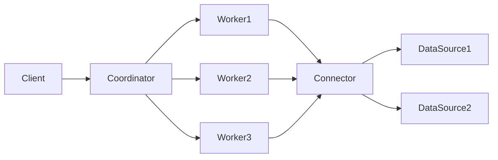

# Presto原理与代码实例讲解

## 1.背景介绍

### 1.1 大数据查询引擎的发展历程

随着大数据时代的到来,企业需要处理和分析的数据量呈爆炸式增长。传统的关系型数据库已经无法满足海量数据的实时查询和分析需求。因此,大数据查询引擎应运而生,如Hive、Impala、Drill、Presto等。它们建立在Hadoop生态之上,提供了类SQL的交互式查询能力,极大地提升了大数据的可访问性和易用性。

### 1.2 Presto的诞生

Presto由Facebook于2012年开发,旨在提供一个能够实时交互式查询PB级数据的分布式SQL查询引擎。Presto的设计理念是:

- 支持标准SQL,易于使用
- 通过pipeline和in-memory processing提供低延迟的交互式查询 
- 能够访问多种数据源,如HDFS、Hive、Cassandra、关系型数据库等
- 可扩展性好,可以通过增加节点线性提升查询性能

Presto经过多年发展,已成为最受欢迎的开源大数据查询引擎之一,被Netflix、Airbnb、LinkedIn等众多公司使用。

## 2.核心概念与联系

### 2.1 Presto架构

Presto采用了典型的Master-Slave架构,包含以下核心组件:

- Coordinator:负责接收用户查询、解析SQL、生成执行计划、协调任务调度执行。
- Worker:负责实际执行查询任务,从数据源读取数据并进行计算。 
- Connector:用于连接不同的数据源,如Hive、Kafka等。
- Client:用户通过Presto CLI、JDBC、RESTful API等方式提交查询。

它们之间的关系如下图所示:



### 2.2 SQL执行流程

Presto的SQL执行流程大致如下:

1. 用户提交SQL查询给Coordinator
2. Coordinator解析SQL,生成语法树和逻辑执行计划
3. Coordinator对执行计划进行优化,生成分布式物理执行计划
4. Coordinator将任务分配给Worker执行 
5. Worker通过Connector从数据源读取数据并计算
6. 各Worker将中间结果汇集给Coordinator
7. Coordinator返回最终结果给Client

### 2.3 数据模型

Presto定义了自己的数据模型,主要概念包括:

- Catalog:数据源的抽象,如hive、mysql等
- Schema:类似于命名空间,一个Catalog可包含多个Schema
- Table:数据表,包含多行数据
- View:逻辑上的表,本质是一条SQL
- Column:列,有名称和数据类型

## 3.核心算法原理具体操作步骤

### 3.1 查询解析与优化

Presto首先将SQL解析成抽象语法树(AST),然后经过一系列语义检查和转换,生成逻辑计划。接着对逻辑计划进行Rule Based优化,如谓词下推、列裁剪、常量合并等。优化后的逻辑计划会转换成分布式物理执行计划。

### 3.2 任务调度

Presto的任务调度采用了Pipeline和Stage的思想。一个查询被划分为多个Stage,每个Stage包含多个Task。Stage之间以Pipeline的方式并行执行,同一Stage的Task会分配到不同Worker执行。

调度的基本过程为:

1. 将逻辑计划转换为Pipeline物理执行计划
2. 将Pipeline拆分为多个Stage
3. 将Stage拆分为多个Task
4. 将Task分发给Worker执行
5. 监控每个Task的执行状态,收集结果

### 3.3 执行引擎

Presto的执行引擎是一个典型的Volcano-style模型。每个Operator实现了Next方法,用于获取下一行数据。Operator之间以流水线方式执行,数据以Page为单位在Operator之间传递。

常见的Operator包括:

- TableScan:从数据源读取数据
- Filter:根据条件过滤行
- Project:投影列
- Aggregate:分组聚合
- Join:两表Join
- TopN:取TopN结果
- Limit:限制返回行数

## 4.数学模型和公式详细讲解举例说明

Presto的许多核心算法都基于数学模型,如Join、Aggregate等。下面以Hash Join为例进行说明。

### 4.1 Hash Join原理

Hash Join用于计算两张表的Join结果,基本原理如下:

1. 对Join Key进行Hash,将左表(小表)的数据存入Hash Table
2. 扫描右表(大表),对Join Key进行Hash,到Hash Table中查找匹配的行
3. 找到匹配则根据Join类型(inner、left、right、full)输出结果

假设左表有M行,右表有N行,Hash Table的大小为S,碰撞概率为p,则Hash Join的时间复杂度为:

$$O(M+N*p)$$

当Hash Table足够大时,p接近0,时间复杂度趋近于:

$$O(M+N)$$

### 4.2 Hash函数选择

Hash Join的效率很大程度上取决于Hash函数的质量,一个好的Hash函数需要满足:

- 均匀性:对不同的输入,Hash值要尽量均匀分布
- 快速性:计算Hash值的速度要快
- 低碰撞:碰撞概率要低

Presto中常用的Hash函数有:

- Murmur3Hash:性能好,碰撞率低,适合用于Join、Aggregate等场景
- xxHash:比Murmur3更快,但碰撞率稍高一些
- SHA256:安全性好,但计算速度慢,不适合大规模使用

## 5.项目实践:代码实例和详细解释说明

下面通过一个具体的例子来说明如何使用Presto进行数据分析。

### 5.1 数据准备

假设我们有一张用户访问日志表,存储在Hive中,Schema如下:

```sql
CREATE TABLE user_logs (
  user_id int,
  url string, 
  access_time timestamp
) 
```

### 5.2 启动Presto CLI

```bash
presto --server localhost:8080 --catalog hive --schema default
```

### 5.3 数据分析

1. 统计总PV

```sql
SELECT count(*) AS pv 
FROM user_logs;
```

2. 统计总UV

```sql
SELECT count(DISTINCT user_id) AS uv
FROM user_logs;
```

3. 按天统计UV

```sql
SELECT date(access_time) AS dt, count(DISTINCT user_id) AS uv
FROM user_logs
GROUP BY date(access_time);
```

4. 查询Top10 访问量的URL

```sql
SELECT url, count(*) AS pv
FROM user_logs
GROUP BY url
ORDER BY pv DESC
LIMIT 10;
```

5. 漏斗分析

假设我们有三个页面:首页、商品页、下单页,我们要统计从首页进入,最终下单的转化率。

```sql
WITH 
view_home AS (
  SELECT DISTINCT user_id
  FROM user_logs 
  WHERE url = 'home'
),
view_product AS (
  SELECT DISTINCT user_id
  FROM user_logs
  WHERE url = 'product'  
),
view_order AS (
  SELECT DISTINCT user_id
  FROM user_logs
  WHERE url = 'order'
)
SELECT 
round(count(view_order.user_id) / count(view_home.user_id), 2) AS order_ratio
FROM view_home 
LEFT JOIN view_product ON view_home.user_id = view_product.user_id
LEFT JOIN view_order ON view_product.user_id = view_order.user_id;
```

## 6.实际应用场景

Presto目前已经被广泛应用于各种数据分析场景,主要包括:

### 6.1 离线数据分析

Presto可以直接查询HDFS、Hive等数据源,非常适合用于离线数据分析,如报表统计、数据挖掘等。

### 6.2 Ad-hoc查询

Presto提供了交互式的数据查询能力,用户可以根据自己的需求实时查询数据,而无需预先定义,非常适合探索性分析。

### 6.3 数据湖分析

Presto天然支持多数据源联邦查询,可以将HDFS、对象存储、RDBMS等异构数据源中的数据统一查询分析,是构建数据湖的理想工具。

### 6.4 用户行为分析

Presto可以实时分析海量的用户行为日志数据,支撑网站的流量统计、漏斗分析、异常检测等需求。

### 6.5 近实时数据分析

Presto对Kafka、Elasticsearch等数据源提供了良好的支持,可以实现秒级的流数据分析,广泛应用于监控告警、风控等场景。

## 7.工具和资源推荐

### 7.1 部署工具

- Ambari:大数据平台部署工具,提供了Presto的一键安装
- Terraform:基础架构即代码工具,可定义Presto集群并自动创建

### 7.2 监控工具

- Presto Web UI:Presto内置的监控页面,可查看查询、节点、JVM等信息 
- Grafana:开源Dashboard工具,可对Presto指标进行可视化展示
- Prometheus:开源监控告警系统,可收集Presto指标并设置告警

### 7.3 开发工具

- Presto CLI:Presto的命令行工具,适合交互式查询
- Yanagishima:开源的Presto Web查询工具,可以在Web页面执行查询
- Presto JDBC:Java连接Presto的API
- Presto Python Client:Python连接Presto的API

### 7.4 学习资源

- Presto官网:https://prestodb.io/
- Presto Github:https://github.com/prestodb/presto
- Presto文档:https://prestodb.io/docs/current/
- 《Presto技术内幕》:国内Presto技术专家撰写的书籍

## 8.总结:未来发展趋势与挑战

Presto经过多年发展,已经成为大数据查询引擎的佼佼者,但仍然存在一些挑战:

- 数据源支持:如何支持更多的数据源,如Druid、ClickHouse等
- 查询优化器:如何优化复杂Join、Subquery等查询的执行效率
- 资源管理:如何与Yarn、Kubernetes等资源管理系统更好地集成
- SQL兼容性:如何实现更完整的ANSI SQL支持

未来Presto将朝着以下方向发展:

- 联邦查询:无缝连接更多异构数据源,提供一站式数据湖分析能力
- 云原生:提供基于K8s的弹性部署方案,支持自动扩缩容
- 机器学习:提供AI算法的SQL集成,如线性回归、K-Means等
- 实时分析:与Flink等实时计算引擎集成,提供端到端的流批一体分析方案

## 9.附录:常见问题与解答

### 9.1 Presto与Hive有何区别?

Hive是基于MapReduce的批处理引擎,延迟高,不适合交互式查询;Presto是基于内存的分布式查询引擎,延迟低,适合交互式分析。

### 9.2 Presto支持update和delete吗?

Presto是一个只读的分析型查询引擎,只支持SELECT,不支持UPDATE和DELETE操作。

### 9.3 Presto查询为什么会失败?

常见原因包括:语法错误、数据源不可用、资源不足、Bug等,可以通过Presto Web UI或日志排查。

### 9.4 Presto如何选择Worker节点的数量?

Worker数量并不是越多越好,需要根据集群资源、数据量、查询并发数等因素权衡。通常Worker数量是数据量的0.5~2倍。

### 9.5 Presto可以作为Hadoop/Spark的替代品吗?

Hadoop生态包含计算、存储、调度等多个组件,Spark是通用的大数据处理引擎,Presto主要用于交互式查询,它们之间是互补而非替代的关系。

作者: 禅与计算机程序设计艺术 / Zen and the Art of Computer Programming