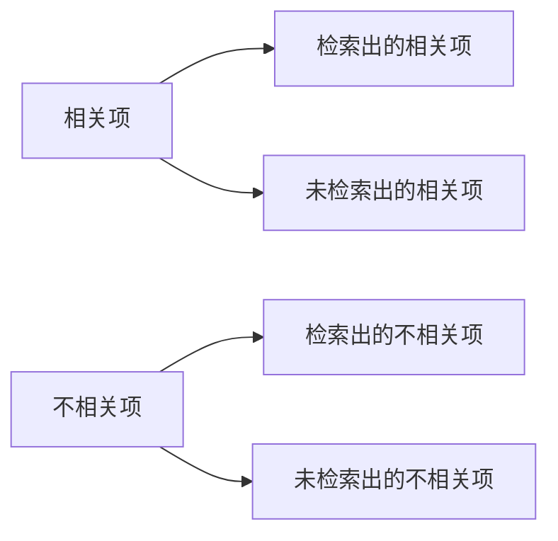

# Recall 原理与代码实战案例讲解

## 1. 背景介绍
### 1.1 Recall 的定义与意义
Recall（召回率）是信息检索和统计学分类领域的重要评估指标之一。它用于衡量检索系统或分类模型检索出的相关项占所有相关项的比例。在现实应用中，Recall 常常与 Precision（准确率）一起使用，以评估系统的整体性能。

### 1.2 Recall 在各领域的应用
Recall 在许多领域都有广泛应用，例如：
- 搜索引擎：衡量搜索结果的查全率
- 推荐系统：评估推荐算法的覆盖度
- 医疗诊断：评估诊断模型对疾病的检出率
- 垃圾邮件检测：衡量垃圾邮件过滤器的过滤能力

### 1.3 Recall 的重要性
在许多场景下，我们更关注系统的查全率而非查准率。例如在医疗诊断中，我们希望尽可能减少漏诊，哪怕代价是增加一些误诊。因此，Recall 指标的重要性不言而喻。

## 2. 核心概念与联系
### 2.1 Precision 与 Recall
- Precision（准确率）：检索出的相关项占检索出的所有项的比例。
- Recall（召回率）：检索出的相关项占所有相关项的比例。

它们分别回答了两个问题：
- Precision：检索结果中有多少是真正相关的？
- Recall：相关结果中有多少被检索出来了？

### 2.2 Precision-Recall 曲线
Precision-Recall 曲线展示了在不同阈值下，Precision 和 Recall 的变化情况。通过调整阈值，我们可以在 Precision 和 Recall 之间权衡。曲线下的面积（AUPRC）可以用来评估整体性能。

### 2.3 F1 Score
F1 Score 是 Precision 和 Recall 的调和平均数，同时兼顾了查准率和查全率。当 Precision 和 Recall 同等重要时，F1 Score 是一个均衡的评估指标。



## 3. 核心算法原理具体操作步骤
### 3.1 计算 Recall
1. 确定问题的相关项集合（Ground Truth）。
2. 对于给定的检索结果或分类结果，统计检索出的相关项数量。
3. 用检索出的相关项数量除以相关项总数，得到 Recall。

### 3.2 绘制 Precision-Recall 曲线
1. 选取一系列不同的阈值。
2. 对于每个阈值，计算对应的 Precision 和 Recall。
3. 以 Recall 为横坐标，Precision 为纵坐标，绘制曲线。
4. 计算曲线下面积（AUPRC）。

### 3.3 计算 F1 Score
1. 计算 Precision 和 Recall。
2. 用公式 $F1 = 2 * \frac{Precision * Recall}{Precision + Recall}$ 计算 F1 Score。

## 4. 数学模型和公式详细讲解举例说明
### 4.1 Recall 的数学定义
$$
Recall = \frac{TP}{TP + FN}
$$
其中，TP（True Positive）表示检索出的相关项，FN（False Negative）表示未检索出的相关项。

### 4.2 Precision 的数学定义
$$
Precision = \frac{TP}{TP + FP}
$$
其中，FP（False Positive）表示检索出的不相关项。

### 4.3 F1 Score 的数学定义
$$
F1 = 2 * \frac{Precision * Recall}{Precision + Recall}
$$

### 4.4 举例说明
假设一个图像分类系统，对于"猫"这一类别，Ground Truth 中有100张猫的图片。系统检索出了80张图片，其中70张是猫，10张不是猫。那么：
- TP = 70，FN = 30，FP = 10
- $Recall = \frac{70}{70 + 30} = 0.7$
- $Precision = \frac{70}{70 + 10} = 0.875$
- $F1 = 2 * \frac{0.875 * 0.7}{0.875 + 0.7} = 0.778$

## 5. 项目实践：代码实例和详细解释说明
下面是用 Python 计算 Recall、Precision 和 F1 Score 的示例代码：

```python
def recall(tp, fn):
    return tp / (tp + fn)

def precision(tp, fp):
    return tp / (tp + fp)

def f1_score(precision, recall):
    return 2 * precision * recall / (precision + recall)

# 示例数据
tp = 70
fn = 30
fp = 10

r = recall(tp, fn)
p = precision(tp, fp)
f1 = f1_score(p, r)

print(f"Recall: {r:.3f}")
print(f"Precision: {p:.3f}") 
print(f"F1 Score: {f1:.3f}")
```

输出结果：
```
Recall: 0.700
Precision: 0.875
F1 Score: 0.778
```

这段代码首先定义了计算 Recall、Precision 和 F1 Score 的函数。然后，我们设置示例数据，调用函数计算指标，并打印结果。

在实际项目中，我们通常会在验证集或测试集上评估模型的 Recall、Precision 和 F1 Score。通过分析这些指标，我们可以了解模型的性能，并进行相应的优化。

## 6. 实际应用场景
### 6.1 搜索引擎
在搜索引擎中，Recall 衡量了搜索结果对用户查询的覆盖程度。高 Recall 意味着用户想要的结果大部分都被检索到了。同时，搜索引擎也希望保持较高的 Precision，即尽量减少无关结果。因此，现代搜索引擎通常会在 Recall 和 Precision 之间取得平衡。

### 6.2 推荐系统
对于推荐系统而言，Recall 衡量了推荐结果对用户可能感兴趣的物品的覆盖程度。高 Recall 意味着用户可能喜欢的物品大部分都被推荐了。但同时，推荐系统也要注重 Precision，即推荐结果要尽量符合用户的实际兴趣。

### 6.3 医疗诊断
在医疗诊断中，Recall 衡量了诊断模型对患者的检出率。高 Recall 意味着尽可能减少漏诊。在这种场景下，我们通常更关注 Recall 而非 Precision。因为漏诊的后果通常比误诊更严重。

## 7. 工具和资源推荐
- scikit-learn：Python 机器学习库，提供了计算 Precision、Recall 和 F1 Score 的函数。
- TensorFlow：端到端开源机器学习平台，提供了计算 Precision、Recall 的 API。
- PyTorch：开源机器学习库，提供了计算 Precision、Recall 的函数。
- Google Scholar：学术搜索引擎，可以搜索 Recall 相关的论文和研究。

## 8. 总结：未来发展趋势与挑战
### 8.1 个性化与多样性的平衡
在搜索和推荐系统中，我们希望在提高 Recall 的同时，也要兼顾结果的个性化和多样性。未来的研究方向可能包括如何在 Recall 和其他指标之间取得更好的平衡。

### 8.2 大数据与实时计算
在大数据场景下，如何高效计算 Recall 是一个挑战。特别是在需要实时计算的场景，如何快速更新 Recall 值，需要进一步的研究。

### 8.3 多目标优化
在许多实际问题中，我们需要同时优化 Recall 和其他指标（如 Precision、Latency 等）。如何进行多目标优化，如何权衡不同指标之间的重要性，仍然是一个开放的研究问题。

## 9. 附录：常见问题与解答
### 9.1 Recall 和 Precision 有什么区别？
Recall 衡量的是检索出的相关项占所有相关项的比例，而 Precision 衡量的是检索出的相关项占检索出的所有项的比例。Recall 关注的是"查全"，Precision 关注的是"查准"。

### 9.2 什么情况下 Recall 更重要？
在漏报的代价很高的场景下，如医疗诊断、安全检测等，我们通常更关注 Recall。因为我们希望尽可能减少漏报，哪怕代价是增加一些误报。

### 9.3 Recall 值高就意味着模型好吗？
不一定。Recall 只是评估模型的一个维度。我们还需要同时考虑 Precision 等其他指标。一个好的模型通常需要在不同指标之间取得平衡。此外，Recall 值还需要结合具体的应用场景来解释。

### 9.4 如何权衡 Recall 和 Precision？
这取决于具体的应用场景。我们可以通过调整模型的阈值来权衡 Recall 和 Precision。提高阈值会提高 Precision 但降低 Recall，降低阈值则相反。在实践中，我们通常会参考 Precision-Recall 曲线，选取满足应用需求的最佳平衡点。

作者：禅与计算机程序设计艺术 / Zen and the Art of Computer Programming