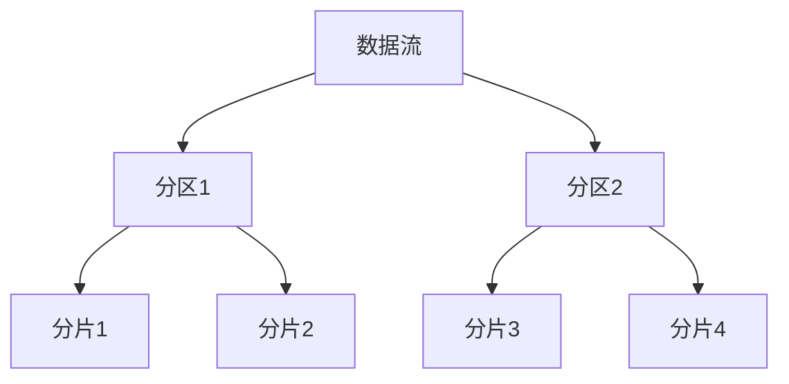

# Samza KV Store原理与代码实例讲解

## 1.背景介绍

Apache Samza 是一个分布式流处理框架，最初由 LinkedIn 开发并开源。它的设计目标是处理大规模的实时数据流，提供高吞吐量和低延迟的数据处理能力。Samza 的核心组件之一是其键值存储（KV Store），它允许开发者在流处理任务中高效地存储和检索数据。

KV Store 是 Samza 中的一个重要概念，它为流处理任务提供了持久化存储的能力，使得状态管理变得更加简单和高效。本文将深入探讨 Samza KV Store 的原理、核心算法、数学模型，并通过代码实例展示其实际应用。

## 2.核心概念与联系

### 2.1 Samza KV Store 概述

Samza KV Store 是一个键值存储系统，支持在流处理任务中存储和检索数据。它的设计目标是提供高效的读写操作，并支持分布式环境下的高可用性和容错性。

### 2.2 核心组件

- **Key**: 唯一标识存储在 KV Store 中的每一条记录。
- **Value**: 与 Key 关联的数据。
- **Store**: 存储 Key-Value 对的容器。
- **State**: 流处理任务的状态，通常存储在 KV Store 中。

### 2.3 KV Store 与流处理的联系

在流处理任务中，KV Store 通常用于存储中间状态和结果。例如，在一个实时计数任务中，KV Store 可以用来存储每个键的计数值。通过使用 KV Store，流处理任务可以在处理过程中高效地更新和查询状态。

## 3.核心算法原理具体操作步骤

### 3.1 数据分区与分片

Samza 使用分区和分片技术来管理数据的分布和存储。每个分区对应一个逻辑上的数据片段，分片则是物理上的存储单元。通过分区和分片，Samza 可以实现数据的水平扩展和负载均衡。



### 3.2 数据写入流程

1. **数据接收**: 数据流进入 Samza 系统。
2. **分区选择**: 根据数据的键选择对应的分区。
3. **分片选择**: 在分区内选择合适的分片进行存储。
4. **数据写入**: 将数据写入选定的分片。

### 3.3 数据读取流程

1. **键查询**: 根据键查询数据。
2. **分区定位**: 根据键定位到对应的分区。
3. **分片定位**: 在分区内定位到存储数据的分片。
4. **数据读取**: 从分片中读取数据。

## 4.数学模型和公式详细讲解举例说明

### 4.1 哈希函数

在 Samza 中，哈希函数用于将键映射到分区。假设有 $N$ 个分区，键 $k$ 的哈希值为 $h(k)$，则键 $k$ 对应的分区为：

$$
P(k) = h(k) \mod N
$$

### 4.2 数据分布

假设有 $M$ 个键，$N$ 个分区，每个分区的键数量为 $K_i$，则理想情况下，每个分区的键数量应接近 $M/N$。实际分布可能会有偏差，但通过合理的哈希函数设计，可以尽量减少偏差。

### 4.3 读写性能分析

假设每个分片的读写延迟为 $T_r$ 和 $T_w$，则总的读写延迟可以表示为：

$$
T_{total} = T_r + T_w
$$

通过优化分片和分区策略，可以有效降低读写延迟，提高系统性能。

## 5.项目实践：代码实例和详细解释说明

### 5.1 环境准备

首先，确保已经安装了 Samza 和相关依赖。可以通过以下命令安装：

```bash
# 安装 Samza
git clone https://github.com/apache/samza.git
cd samza
./gradlew clean build
```

### 5.2 创建 Samza 应用

创建一个简单的 Samza 应用，使用 KV Store 存储和检索数据。

```java
import org.apache.samza.config.Config;
import org.apache.samza.config.MapConfig;
import org.apache.samza.job.local.ThreadJobFactory;
import org.apache.samza.runtime.LocalApplicationRunner;
import org.apache.samza.storage.kv.KeyValueStore;
import org.apache.samza.task.StreamTask;
import org.apache.samza.task.TaskContext;
import org.apache.samza.task.TaskCoordinator;
import org.apache.samza.task.MessageCollector;
import org.apache.samza.task.IncomingMessageEnvelope;

import java.util.HashMap;
import java.util.Map;

public class KVStoreExample implements StreamTask {
    private KeyValueStore<String, String> store;

    @Override
    public void init(Config config, TaskContext context) {
        store = (KeyValueStore<String, String>) context.getStore("kv-store");
    }

    @Override
    public void process(IncomingMessageEnvelope envelope, MessageCollector collector, TaskCoordinator coordinator) {
        String key = (String) envelope.getKey();
        String value = (String) envelope.getMessage();
        store.put(key, value);
        String storedValue = store.get(key);
        System.out.println("Stored value for key " + key + ": " + storedValue);
    }

    public static void main(String[] args) {
        Map<String, String> configMap = new HashMap<>();
        configMap.put("job.name", "kv-store-example");
        configMap.put("job.factory.class", ThreadJobFactory.class.getName());
        configMap.put("task.class", KVStoreExample.class.getName());
        configMap.put("stores.kv-store.factory", "org.apache.samza.storage.kv.RocksDbKeyValueStorageEngineFactory");

        Config config = new MapConfig(configMap);
        LocalApplicationRunner runner = new LocalApplicationRunner(config);
        runner.run();
        runner.waitForFinish();
    }
}
```

### 5.3 代码解释

- **初始化**: 在 `init` 方法中初始化 KV Store。
- **数据处理**: 在 `process` 方法中处理数据，将键值对存储到 KV Store 中，并检索存储的值。
- **配置**: 在 `main` 方法中配置 Samza 应用，包括作业名称、任务类和存储引擎。

## 6.实际应用场景

### 6.1 实时数据分析

在实时数据分析场景中，KV Store 可以用于存储中间状态和结果。例如，在实时计数任务中，KV Store 可以用来存储每个键的计数值。

### 6.2 用户行为跟踪

在用户行为跟踪场景中，KV Store 可以用于存储用户的行为数据，并在流处理任务中实时更新和查询。例如，可以使用 KV Store 存储用户的点击记录，并在流处理任务中实时计算点击率。

### 6.3 广告投放系统

在广告投放系统中，KV Store 可以用于存储广告的投放数据，并在流处理任务中实时更新和查询。例如，可以使用 KV Store 存储广告的展示次数和点击次数，并在流处理任务中实时计算点击率和转化率。

## 7.工具和资源推荐

### 7.1 开发工具

- **IntelliJ IDEA**: 强大的 Java 开发工具，支持 Samza 开发。
- **Eclipse**: 另一款流行的 Java 开发工具，支持 Samza 开发。

### 7.2 资源推荐

- **Samza 官方文档**: [https://samza.apache.org/learn/documentation/](https://samza.apache.org/learn/documentation/)
- **Samza GitHub 仓库**: [https://github.com/apache/samza](https://github.com/apache/samza)
- **《Stream Processing with Apache Samza》**: 一本详细介绍 Samza 的书籍，适合深入学习。

## 8.总结：未来发展趋势与挑战

### 8.1 未来发展趋势

随着大数据和实时处理需求的不断增长，流处理框架将会越来越重要。Samza 作为一个强大的流处理框架，其 KV Store 组件在未来将会有更多的应用场景和优化空间。

### 8.2 挑战

- **性能优化**: 随着数据量的增加，如何进一步优化 KV Store 的读写性能是一个重要的挑战。
- **高可用性**: 在分布式环境下，如何保证 KV Store 的高可用性和容错性是另一个重要的挑战。
- **扩展性**: 随着业务需求的变化，如何保证 KV Store 的扩展性和灵活性也是一个需要解决的问题。

## 9.附录：常见问题与解答

### 9.1 如何选择合适的分区策略？

选择合适的分区策略需要考虑数据的分布和访问模式。通常可以使用哈希函数来均匀分布数据，但在某些特定场景下，可能需要自定义分区策略。

### 9.2 如何优化 KV Store 的读写性能？

可以通过优化分片和分区策略、使用高效的存储引擎（如 RocksDB）、调整缓存和索引策略等方法来优化 KV Store 的读写性能。

### 9.3 如何保证 KV Store 的高可用性？

可以通过数据复制、分布式一致性协议（如 Paxos、Raft）、故障检测和恢复机制等方法来保证 KV Store 的高可用性。

### 9.4 如何处理数据倾斜问题？

数据倾斜问题通常是由于某些键的访问频率过高导致的。可以通过调整哈希函数、使用一致性哈希、分片和分区策略等方法来缓解数据倾斜问题。

### 9.5 如何监控和调试 Samza 应用？

可以使用 Samza 提供的监控和调试工具，如 Samza Dashboard、日志分析工具等，来监控和调试 Samza 应用。

---

作者：禅与计算机程序设计艺术 / Zen and the Art of Computer Programming