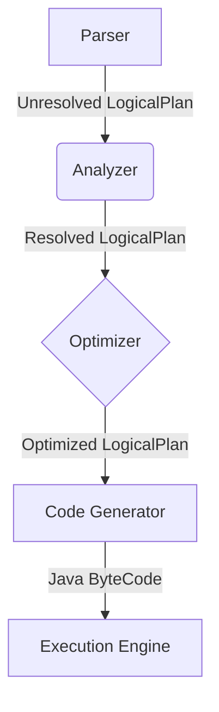

# Spark Catalyst 原理与代码实例讲解

## 1. 背景介绍

Apache Spark 是一个开源的大数据处理引擎,广泛应用于批处理、流处理、机器学习和图计算等场景。Spark 的核心组件之一是 Catalyst 优化器,它负责优化 Spark 作业的执行计划,提高查询性能。本文将深入探讨 Catalyst 的原理、架构和优化策略,并通过代码示例帮助读者更好地理解其工作机制。

## 2. 核心概念与联系

### 2.1 Catalyst 概述

Catalyst 是 Spark SQL 的查询优化器,主要由四个模块组成:

1. **Parser (解析器)**: 将 SQL 语句解析为未经优化的逻辑计划。
2. **Analyzer (分析器)**: 构建解析树,并进行语义检查。
3. **Optimizer (优化器)**: 应用一系列规则,优化逻辑计划。
4. **Code Generator (代码生成器)**: 将优化后的逻辑计划转换为可执行代码。

### 2.2 Catalyst 优化器

Catalyst 优化器采用基于规则的查询优化策略,包括以下几个阶段:

1. **分析阶段**: 进行语义检查,解析表达式和数据类型等。
2. **逻辑优化阶段**: 应用一系列等价规则,优化逻辑计划。
3. **物理优化阶段**: 根据代价模型选择最优的物理执行计划。

### 2.3 Catalyst 架构

Catalyst 的架构如下图所示:



## 3. 核心算法原理具体操作步骤

### 3.1 解析和分析阶段

1. Parser 将 SQL 语句解析为未经优化的逻辑计划 (Unresolved Logical Plan)。
2. Analyzer 构建解析树,进行语义检查并解析表达式和数据类型,生成已解析的逻辑计划 (Resolved Logical Plan)。

### 3.2 逻辑优化阶段

1. 应用一系列等价规则 (Equivalence Rules),优化逻辑计划。
2. 常见的优化规则包括:
   - 投影剪裁 (Projection Pruning)
   - 谓词下推 (Predicate Pushdown)
   - 常量折叠 (Constant Folding)
   - 代数重写 (Algebraic Rewrite)
   - ...

### 3.3 物理优化阶段

1. 根据代价模型 (Cost Model),为逻辑计划生成多个物理执行计划。
2. 选择代价最小的物理执行计划作为最终计划。

### 3.4 代码生成阶段

1. 将优化后的物理执行计划转换为 Java 字节码。
2. 执行引擎执行生成的字节码,并返回查询结果。

## 4. 数学模型和公式详细讲解举例说明

在 Catalyst 的物理优化阶段,代价模型 (Cost Model) 扮演着重要角色。代价模型用于估计每个物理执行计划的代价,从而选择最优的执行计划。

Spark 采用基于统计信息的代价模型,其核心思想是基于输入数据的统计信息 (如行数、数据大小等) 估计每个操作的代价。

### 4.1 行数估计

行数估计是代价模型的关键部分。对于每个关系算子 (如 Join、Filter 等),Spark 都会根据输入关系的统计信息,估计输出关系的行数。

以 Filter 操作为例,假设输入关系 R 的行数为 $N_R$,过滤条件的选择率为 $\theta$,则输出关系的行数估计为:

$$N_{output} = N_R \times \theta$$

### 4.2 代价函数

Spark 将每个物理操作的代价分为 CPU 代价和读写代价两部分。

CPU 代价主要取决于输入行数和每行的 CPU 开销:

$$Cost_{CPU} = N_{input} \times C_{CPU}$$

其中 $N_{input}$ 是输入行数, $C_{CPU}$ 是每行的 CPU 开销。

读写代价主要取决于输入和输出的数据大小:

$$Cost_{IO} = C_{read} \times S_{input} + C_{write} \times S_{output}$$

其中 $C_{read}$ 和 $C_{write}$ 分别是读写开销常数, $S_{input}$ 和 $S_{output}$ 分别是输入和输出的数据大小。

总代价为 CPU 代价和读写代价之和:

$$Cost_{total} = Cost_{CPU} + Cost_{IO}$$

通过估计每个物理执行计划的总代价,Catalyst 可以选择代价最小的执行计划作为最终计划。

## 5. 项目实践: 代码实例和详细解释说明

让我们通过一个示例来深入理解 Catalyst 的工作原理。假设我们有两个表 `orders` 和 `products`,分别存储订单和产品信息。我们希望查询每个产品类别的总销售额。

### 5.1 SQL 语句

```sql
SELECT p.category, SUM(o.amount) AS total_sales
FROM orders o
JOIN products p ON o.product_id = p.id
GROUP BY p.category;
```

### 5.2 解析和分析阶段

Parser 将 SQL 语句解析为未经优化的逻辑计划:

```scala
// Unresolved Logical Plan
'Project ['category, 'sum('amount) AS total_sales]
+- 'Filter 'true
   +- 'GlobalAggregation
      +- 'Join Inner, ('product_id = 'id)
         :- 'UnresolvedRelation `orders`
         +- 'UnresolvedRelation `products`
```

Analyzer 进行语义检查,解析表达式和数据类型,生成已解析的逻辑计划:

```scala
// Resolved Logical Plan
Project [category#28, sum(amount#20) AS total_sales#38]
+- GlobalAggregation [category#28]
   +- Join Inner, (product_id#19 = id#26)
      :- SubqueryAlias `orders`
      :  +- SubqueryAlias `orders`
      :     +- Filter isnotnull(product_id#19)
      :        +- Relation[order_id#17,product_id#19,amount#20] parquet
      +- SubqueryAlias `products`
         +- Relation[id#26,category#28] parquet
```

### 5.3 逻辑优化阶段

应用一系列等价规则优化逻辑计划,例如:

- 投影剪裁: 移除不需要的列
- 谓词下推: 将过滤条件下推到扫描操作
- 常量折叠: 预计算常量表达式

```scala
// Optimized Logical Plan
GlobalAggregation [category#28]
+- Project [category#28, amount#20]
   +- Join Inner, (product_id#19 = id#26)
      :- Project [product_id#19, amount#20]
      :  +- Filter isnotnull(product_id#19)
      :     +- Relation[order_id#17,product_id#19,amount#20] parquet
      +- Relation[id#26,category#28] parquet
```

### 5.4 物理优化阶段

根据代价模型,为逻辑计划生成多个物理执行计划,并选择代价最小的计划。例如,对于 Join 操作,可以选择 BroadcastHashJoin 或 ShuffledHashJoin。

```scala
// Chosen Physical Plan
GlobalAggregation [category#28]
+- BroadcastHashJoin [product_id#19], [id#26]
   :- Project [product_id#19, amount#20]
   :  +- Filter isnotnull(product_id#19)
   :     +- Relation[order_id#17,product_id#19,amount#20] parquet
   +- BroadcastExchange
      +- Relation[id#26,category#28] parquet
```

### 5.5 代码生成和执行

Catalyst 将优化后的物理执行计划转换为 Java 字节码,并由执行引擎执行。以下是简化的代码示例:

```scala
// Simplified Code Generation
object GeneratedIterator extends CodegenSupport {
  // ...
  def processData(): Iterator[InternalRow] = {
    // Load data from orders and products tables
    val orders = loadOrders()
    val products = loadProducts()

    // Join and aggregate
    val joined = orders.join(products, "product_id" === "id")
    val aggregated = joined.groupBy("category").sum("amount")

    // Return result iterator
    aggregated.iterator
  }
}
```

执行引擎执行生成的代码,并返回查询结果。

## 6. 实际应用场景

Catalyst 优化器在 Spark SQL 中发挥着关键作用,为各种数据分析和机器学习应用提供高性能的查询执行能力。以下是一些典型的应用场景:

1. **交互式数据分析**: 在交互式数据分析场景中,用户需要快速获取查询结果。Catalyst 通过优化查询执行计划,提高了查询性能,缩短了响应时间。

2. **ETL 工作流**: 在数据ETL (提取、转换、加载) 工作流中,Catalyst 可以优化复杂的数据转换操作,提高数据处理效率。

3. **机器学习管道**: 在机器学习管道中,Catalyst 可以优化特征工程和模型训练等步骤,加速模型训练和评估过程。

4. **流式处理**: 在流式处理场景中,Catalyst 可以优化增量查询和窗口操作,提高实时数据处理的性能和延迟。

## 7. 工具和资源推荐

如果您希望深入了解 Catalyst 优化器,以下是一些推荐的工具和资源:

1. **Apache Spark 官方文档**: Spark 官方文档提供了详细的 Catalyst 优化器介绍和相关概念解释。

2. **Spark UI**: Spark Web UI 提供了查看作业执行计划和查询计划的功能,有助于理解 Catalyst 的优化过程。

3. **Apache Spark 源代码**: 阅读 Spark 源代码,尤其是 `org.apache.spark.sql.catalyst` 包,可以深入了解 Catalyst 的实现细节。

4. **Spark 社区**: 加入 Spark 社区,参与讨论和分享经验,可以获得更多关于 Catalyst 优化器的见解和技巧。

## 8. 总结: 未来发展趋势与挑战

Catalyst 优化器为 Spark SQL 提供了强大的查询优化能力,但仍然面临一些挑战和未来发展方向:

1. **自适应查询优化**: 当前的查询优化基于静态的代价模型和统计信息,无法动态调整执行计划。自适应查询优化可以在运行时根据实际数据特征动态调整执行计划,进一步提高查询性能。

2. **机器学习工作负载优化**: 随着机器学习在 Spark 中的广泛应用,优化机器学习工作负载 (如特征工程、模型训练等) 将成为一个重要方向。

3. **流式处理优化**: 针对流式处理场景,优化增量查询和窗口操作的执行效率将是一个挑战。

4. **硬件加速**: 利用 GPU、FPGA 等硬件加速器,可以进一步提升 Catalyst 优化器的性能。

5. **成本模型改进**: 持续改进成本模型,提高代价估计的准确性,从而选择更优的执行计划。

总的来说,Catalyst 优化器为 Spark SQL 提供了强大的查询优化能力,但仍有许多值得探索和改进的空间,以满足未来更加复杂的数据处理需求。

## 9. 附录: 常见问题与解答

1. **什么是 Catalyst 优化器?**

   Catalyst 优化器是 Spark SQL 的查询优化器,负责优化 Spark 作业的执行计划,提高查询性能。它采用基于规则的查询优化策略,包括逻辑优化和物理优化两个阶段。

2. **Catalyst 优化器的主要组件有哪些?**

   Catalyst 优化器主要由四个模块组成:Parser、Analyzer、Optimizer 和 Code Generator。

3. **Catalyst 优化器采用什么样的优化策略?**

   Catalyst 优化器采用基于规则的查询优化策略,包括逻辑优化阶段和物理优化阶段。在逻辑优化阶段,应用一系列等价规则优化逻辑计划;在物理优化阶段,根据代价模型选择最优的物理执行计划。

4. **代价模型是如何工作的?**

   Catalyst 的代价模型基于输入数据的统计信息 (如行数、数据大小等) 估计每个操作的代价。代价分为 CPU 代价和读写代价两部分,通过估计总代价选择最优的执行计划。

5. **Catalyst 优化器如