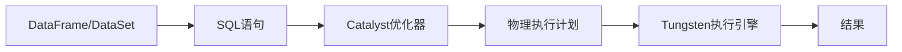

# Spark SQL原理与代码实例讲解

## 1.背景介绍
### 1.1 大数据处理的挑战
随着数据量的爆炸式增长,传统的数据处理方式已经无法满足实时性、高并发等需求。Hadoop等大数据处理框架应运而生,但其MapReduce编程模型较为复杂,且对结构化数据的支持不够友好。

### 1.2 Spark的诞生
Spark作为新一代大数据分析引擎,凭借其快速、通用、易用等特点,在众多大数据框架中脱颖而出。Spark基于RDD(弹性分布式数据集)模型,提供了丰富的API,大大简化了大规模数据处理的编程复杂度。

### 1.3 Spark SQL概述
Spark SQL是Spark生态系统中的重要组件之一,它将关系型数据处理引入了Spark。Spark SQL支持使用SQL或DataFrame API对结构化数据进行查询,并与Spark其他组件(如Streaming、MLlib等)无缝集成。

## 2.核心概念与联系
### 2.1 DataFrame
DataFrame是Spark SQL的核心抽象,它是一种以RDD为基础的分布式数据集合。与RDD不同,DataFrame带有schema信息,即数据的结构化信息,更类似传统数据库中的二维表格。

### 2.2 DataSet 
DataSet是Spark 1.6引入的新抽象,它集成了RDD和DataFrame的优点。DataFrame其实是DataSet的特例,即DataFrame=DataSet[Row]。DataSet支持编译时类型检查,可以在编译期发现错误。

### 2.3 SQL语句
Spark SQL允许开发者使用标准SQL语句对DataFrame进行查询,就像在关系型数据库上执行SQL一样。这极大降低了Spark的学习门槛,使得具备SQL知识的开发者也能轻松上手。

### 2.4 Catalyst优化器
Catalyst是Spark SQL的核心,负责将SQL语句或DataFrame操作转换为优化后的物理执行计划。Catalyst由一系列的优化规则(Rule)组成,会根据数据特征、查询模式等对执行计划进行优化。

### 2.5 Tungsten
Tungsten是Spark的第二代执行引擎,旨在通过低级别的内存管理和二进制计算,提升Spark的执行效率。Tungsten引入了内存列存储、代码生成等技术,可以大幅提升Spark SQL的性能。



## 3.核心算法原理具体操作步骤
### 3.1 Spark SQL执行流程
1. 用户通过DataFrame API或SQL语句提交查询
2. Spark SQL解析查询,生成未优化的逻辑计划
3. Catalyst优化器对逻辑计划进行优化,生成优化后的逻辑计划
4. Spark SQL将逻辑计划转换为物理计划(多个可选方案)
5. Spark SQL再次通过代价模型(Cost Model)对物理计划进行优化
6. 选择最优的物理计划,交给Tungsten引擎执行
7. Tungsten引擎执行物理计划,生成结果

### 3.2 Catalyst优化器规则
Catalyst优化器内置了大量的优化规则,常见的有:
- 谓词下推(Predicate Pushdown):将过滤条件尽可能下推到数据源
- 列剪枝(Column Pruning):去除查询中未使用到的列
- 常量累加(Constant Folding):预先计算常量表达式的值
- 投影(Projection):去除重复的投影操作

### 3.3 Tungsten引擎优化
Tungsten引擎在执行阶段会进行一系列的优化,主要有:
- 内存列存储:将数据按列而非按行存储,避免不必要的数据读取
- 代码生成:将查询编译为可执行的Java字节码,减少虚拟机开销
- 压缩编码:使用高效的压缩编码方式,减少内存占用和磁盘I/O

## 4.数学模型和公式详细讲解举例说明
### 4.1 TF-IDF
TF-IDF(Term Frequency-Inverse Document Frequency)是一种常用的文本特征提取方法。在Spark SQL中,可以使用DataFrame API和SQL来计算TF-IDF。

假设有如下的文本数据:
```
+---+--------------------+
| id|                text|
+---+--------------------+
|  0|Spark is a fast ...| 
|  1|Spark SQL provides..|
|  2|     Python is a ...|
+---+--------------------+
```

计算TF-IDF的步骤如下:
1. 分词,将文本拆分为单词
2. 计算每个文档中单词的频率TF
$$ TF(t,d) = \frac{f_{t,d}}{\sum_{t'\in d} f_{t',d}} $$
3. 计算单词的逆文档频率IDF 
$$ IDF(t,D) = \log \frac{N}{|\{d\in D:t\in d\}|} $$
4. 计算TF-IDF
$$ TFIDF(t,d,D) = TF(t,d) \times IDF(t,D) $$

用Spark SQL实现如下:

```scala
// 1.分词
val wordsData = textData.select(explode(split($"text", "\\s+")).alias("word"))
// 2.计算TF
val tfData = wordsData.groupBy("id", "word").count().withColumn("tf", $"count" / sum("count").over(Window.partitionBy("id")))
// 3.计算IDF
val idfData = tfData.groupBy("word").agg(countDistinct("id").alias("df")).withColumn("idf", log(lit(textData.count) / $"df"))  
// 4.计算TF-IDF
val tfidf = tfData.join(idfData, "word").withColumn("tfidf", $"tf" * $"idf")
```

### 4.2 ALS矩阵分解
ALS(Alternating Least Squares)是一种常用的矩阵分解算法,常用于推荐系统。在Spark MLlib中已经提供了ALS的实现,也可以使用Spark SQL来自定义实现。

假设有用户-物品的评分矩阵如下:
$$
R=
\begin{bmatrix} 
 &  I_1&  I_2&  I_3\\
U_1 & 5 & 3 & 0\\  
U_2 & 4 & 0 & ? \\
U_3 & 1 & 1 & ?
\end{bmatrix}
$$

ALS的目标是将 $R$ 矩阵分解为两个低秩矩阵 $U$ 和 $I$ 的乘积,即:
$$ R\approx U \times I^T$$

$U$ 和 $I$ 可以通过最小化平方误差得到:
$$\underset{U,I}{min} \sum_{r_{ui} \in R_{train}} (r_{ui} - u_i^T v_j)^2 + \lambda(\sum_{i}n_{u_i}\left\|u_i \right\|^2+\sum_{j}n_{v_j}\left\|v_j \right\|^2) $$

Spark SQL实现如下:

```scala
// 1.初始化U和I矩阵
val U = trainData.select($"user").distinct().withColumn("features", array(rand(seed), rand(seed)))  
val I = trainData.select($"item").distinct().withColumn("features", array(rand(seed), rand(seed)))

// 2.迭代计算U和I矩阵
for (i <- 0 until iterations) {
  // 2.1 固定U,更新I  
  val I1 = trainData.join(U, $"user" === $"user").select($"item", $"features".as("userFactors"), $"rating")
    .join(I, $"item" === $"item")
    .select($"item", als_update_I($"userFactors", $"features", $"rating", lit(rank), lit(regParam)).as("features"))
  // 2.2 固定I,更新U
  val U1 = trainData.join(I1, $"item" === $"item").select($"user", $"features".as("itemFactors"), $"rating")  
    .join(U, $"user" === $"user")
    .select($"user", als_update_U($"itemFactors", $"features", $"rating", lit(rank), lit(regParam)).as("features"))
  U = U1
  I = I1  
}
```

## 5.项目实践：代码实例和详细解释说明
下面通过一个完整的Spark SQL项目示例,演示如何使用DataFrame API和SQL进行数据分析。

### 5.1 数据准备
使用Kaggle上的Chicago Taxi Trips数据集,其中包含芝加哥出租车的行程信息。数据集字段说明:
- trip_id:行程ID
- taxi_id:出租车ID
- trip_start_timestamp:行程开始时间戳
- trip_end_timestamp:行程结束时间戳
- trip_seconds:行程持续时间(秒)
- trip_miles:行程距离(英里)
- fare:车费
- tips:小费
- tolls:过路费
- extras:其他费用
- trip_total:总费用
- payment_type:支付类型
- company:出租车公司
- pickup_latitude:上车纬度
- pickup_longitude:上车经度 
- dropoff_latitude:下车纬度
- dropoff_longitude:下车经度

### 5.2 数据读取和预处理

```scala
// 1.读取CSV数据
val taxiDF = spark.read
  .option("header", "true")
  .option("inferSchema", "true")
  .csv("taxi_trips.csv")

// 2.数据清洗
val cleanDF = taxiDF.filter($"trip_miles" > 0 && $"fare" > 0)
  .na.drop()

// 3.增加额外字段
val tripDF = cleanDF
  .withColumn("trip_start_timestamp", to_timestamp($"trip_start_timestamp")) 
  .withColumn("trip_end_timestamp", to_timestamp($"trip_end_timestamp"))
  .withColumn("trip_duration", ($"trip_end_timestamp".cast("long") - $"trip_start_timestamp".cast("long"))/60)
  .withColumn("trip_year", year($"trip_start_timestamp"))
```

### 5.3 数据分析
#### 5.3.1 使用DataFrame API分析

```scala
// 1.各出租车公司的载客量排名
val companyTrips = tripDF.groupBy("company").count().orderBy($"count".desc)

// 2.平均车费最高的10个出租车
val topAvgFare = tripDF.groupBy("taxi_id").avg("fare").orderBy($"avg(fare)".desc).limit(10)

// 3.每年总载客量变化趋势
val yearTrips = tripDF.groupBy("trip_year").count().orderBy("trip_year") 

// 4.小费占总费用比例Top 10的出租车
val tipRatio = tripDF.select($"taxi_id", ($"tips" / $"trip_total").alias("tip_ratio"))
val topTipRatio = tipRatio.groupBy("taxi_id").avg("tip_ratio").orderBy($"avg(tip_ratio)".desc).limit(10)
```

#### 5.3.2 使用SQL分析

```scala
// 1.注册临时表
tripDF.createOrReplaceTempView("trips")

// 2.各出租车公司的载客量排名  
spark.sql("""
  SELECT company, count(*) as trips
  FROM trips
  GROUP BY company
  ORDER BY trips DESC
""").show()

// 3.平均车费最高的10个出租车
spark.sql("""
  SELECT taxi_id, avg(fare) as avg_fare
  FROM trips  
  GROUP BY taxi_id
  ORDER BY avg_fare DESC
  LIMIT 10  
""").show()
  
// 4.每年总载客量变化趋势
spark.sql("""
  SELECT trip_year, count(*) as trips  
  FROM trips
  GROUP BY trip_year
  ORDER BY trip_year
""").show()

// 5.小费占总费用比例Top 10的出租车
spark.sql("""
  SELECT taxi_id, avg(tips / trip_total) as tip_ratio
  FROM trips
  GROUP BY taxi_id  
  ORDER BY tip_ratio DESC
  LIMIT 10
""").show()  
```

## 6.实际应用场景
Spark SQL在许多实际场景中得到广泛应用,如:
- 数据仓库:使用Spark SQL进行ETL,将数据从各个源系统中提取、清洗、转换,最终加载到数据仓库
- 用户行为分析:分析用户的点击、浏览、购买等行为数据,为个性化推荐、广告投放等提供决策支持
- 日志分析:对服务器日志、应用程序日志等进行分析,用于异常检测、性能优化等
- 交互式数据分析:借助Spark SQL交互式查询海量数据,快速验证假设,缩短数据分析周期

## 7.工具和资源推荐
- Databricks:提供基于Web的交互式Notebook,集成了Spark SQL,适合交互式数据分析
- Zeppelin:另一个基于Web的Notebook工具,也支持Spark SQL
- Spark SQL官方文档:提供了Spark SQL的概念介绍、API手册、性能优化指南等
- Spark Summit:Spark领域的顶级会议,包含许多关于Spark SQL的实践案例分享

## 8.总结：未来发展趋势与挑战
### 8.1 标准化
随着Spark SQL的不断