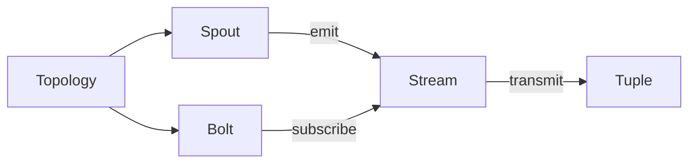

# Storm实时流处理框架原理与代码实例讲解

## 1.背景介绍
### 1.1 实时流处理的重要性
在当今数据爆炸式增长的时代,能够实时处理海量数据流并及时做出响应变得越来越重要。传统的批处理模式已经无法满足实时性要求,因此流处理框架应运而生。
### 1.2 Storm框架概述
Storm是一个开源的、分布式的实时计算系统,由Twitter开发并贡献给Apache基金会。它提供了一种可靠的方式来处理无界的数据流,具有低延迟、高吞吐、可扩展、容错等特点,适用于实时分析、在线机器学习、持续计算等场景。
### 1.3 Storm与其他流处理框架比较
相比于其他流处理框架如Spark Streaming、Flink等,Storm更加轻量级,适合低延迟的实时处理,但在吞吐量和容错性方面略有不足。不过Storm可以和其他框架很好地集成,发挥各自优势。

## 2.核心概念与联系
### 2.1 Topology（拓扑）
Topology定义了Storm中数据流的计算过程,由Spout和Bolt构成有向无环图(DAG)。一个运行中的Topology会持续处理数据,直到被显式终止。
### 2.2 Spout（数据源）  
Spout是数据流的源头,负责从外部数据源读取数据,并将数据以元组(tuple)的形式发射到下游的Bolt中。常见的Spout包括从Kafka读取数据、从Kestrel队列读取等。
### 2.3 Bolt（处理单元）
Bolt是实时计算的核心,它接收来自Spout或其他Bolt的数据流,执行处理逻辑,并可以将结果发送到下一个Bolt。Bolt可以执行过滤、聚合、函数操作、数据库存储等任何操作。
### 2.4 Stream（流）
Stream是Storm中的核心概念,它表示Spout/Bolt之间的数据传输通道。一个Stream由无数个顺序的Tuple组成,代表着一个无界的数据流。
### 2.5 Tuple（元组）
Tuple是Storm数据流中的基本单位,它是一个命名的值列表,支持任意的Java对象。每个Tuple都属于一个特定的Stream,并在Spout和Bolt之间传递。

下面是Storm核心概念之间的关系图:


## 3.核心算法原理具体操作步骤
### 3.1 并行度与数据分区
Storm通过在Spout和Bolt上设置并行度,将Topology划分为多个Task在集群的工作进程(Worker)中并行执行。每个Tuple根据指定的分区策略被发送到对应的Task,常见的分区策略包括随机分区、字段分组、全局分组等。
### 3.2 可靠性机制
为了保证数据处理的可靠性,Storm提供了Acker机制。Spout在发射一个Tuple时,会为其指定一个唯一的MessageID。Tuple在Topology中传输处理时,每个Bolt通过Ack方法确认完成。当Tuple树的所有Ack都收集完毕,Spout才会认为这个Tuple被完全处理。
### 3.3 容错与消息重放
如果在一定时间内没有收到Tuple树的所有Ack,Spout会认为该Tuple处理失败,会重新发射这个Tuple,确保数据不丢失。Storm会自动重启失败的Worker,并从发生错误的Tuple开始重新处理,保证Exactly-once语义。
### 3.4 反压机制(Backpressure)
当下游的Bolt处理速度跟不上上游Spout的数据发射速率时,会产生数据积压。Storm通过反压机制动态调节Spout的发射速率,避免数据过多而导致内存溢出。Bolt通过定期向Spout报告处理进度,使Spout能够控制数据流速。

## 4.数学模型和公式详细讲解举例说明
### 4.1 指数移动平均(Exponential Moving Average)
Storm可以用EMA来估计Bolt的处理延迟,动态调整数据流速。设$S_t$为$t$时刻的处理延迟估计值,$X_t$为$t$时刻的实际处理延迟,则EMA公式为:

$$S_t = \alpha X_t + (1 - \alpha) S_{t-1}$$

其中$\alpha \in (0,1)$是平滑系数,通常取0.8左右。Storm根据$S_t$与目标延迟阈值的差异,动态调节Spout的发射间隔。

### 4.2 线性回归(Linear Regression)
Storm可以用线性回归来预测Bolt的处理能力。设$y$为Bolt每秒能处理的Tuple数,$x$为Bolt分配的资源数(如CPU核数),则线性模型为:

$$y = \theta_0 + \theta_1 x$$

通过最小二乘法估计参数$\theta_0$和$\theta_1$:

$$\min_{\theta_0, \theta_1} \sum_{i=1}^n (y_i - \theta_0 - \theta_1 x_i)^2$$

Storm可以根据估计的处理能力,合理分配Bolt的并行度。

## 5.项目实践：代码实例和详细解释说明
下面我们通过一个简单的WordCount例子,演示如何使用Storm进行流处理。

### 5.1 Topology定义
```java
TopologyBuilder builder = new TopologyBuilder();
builder.setSpout("spout", new RandomSentenceSpout(), 2);
builder.setBolt("split", new SplitSentence(), 4).shuffleGrouping("spout");  
builder.setBolt("count", new WordCount(), 4).fieldsGrouping("split", new Fields("word"));
```
这里定义了一个包含一个Spout和两个Bolt的Topology。RandomSentenceSpout随机发射句子,并行度为2。SplitSentence将句子切分为单词,并行度为4,与Spout采用随机分组。WordCount统计单词数量,并行度为4,以单词字段为依据与SplitSentence采用字段分组。

### 5.2 Spout实现
```java
public class RandomSentenceSpout extends BaseRichSpout {
    private SpoutOutputCollector collector;
    private String[] sentences = {"the cow jumped over the moon", "an apple a day keeps the doctor away", "four score and seven years ago", "snow white and the seven dwarfs", "i am at two with nature"};
    
    public void open(Map conf, TopologyContext context, SpoutOutputCollector collector) {
        this.collector = collector;
    }
    
    public void nextTuple() {
        String sentence = sentences[new Random().nextInt(sentences.length)];
        collector.emit(new Values(sentence));
        Thread.sleep(1000);
    }
    
    public void declareOutputFields(OutputFieldsDeclarer declarer) {
        declarer.declare(new Fields("sentence"));
    }
}
```
RandomSentenceSpout在open方法中初始化了SpoutOutputCollector,nextTuple方法每隔1秒随机发射一个句子。declareOutputFields声明Spout输出的Tuple包含sentence字段。

### 5.3 SplitSentence Bolt实现  
```java
public class SplitSentence extends BaseBasicBolt {
    public void execute(Tuple tuple, BasicOutputCollector collector) {
        String sentence = tuple.getString(0);
        for(String word: sentence.split(" ")) {
            collector.emit(new Values(word));
        }
    }
    
    public void declareOutputFields(OutputFieldsDeclarer declarer) {
        declarer.declare(new Fields("word"));
    }
}
```
SplitSentence Bolt的execute方法从输入的Tuple中获取句子,将其切分为单词后发射。declareOutputFields声明Bolt输出的Tuple包含word字段。

### 5.4 WordCount Bolt实现
```java
public class WordCount extends BaseBasicBolt {
    private Map<String, Integer> counts = new HashMap<String, Integer>();
    
    public void execute(Tuple tuple, BasicOutputCollector collector) {
        String word = tuple.getString(0);
        Integer count = counts.get(word);
        if(count == null) count = 0;
        count++;
        counts.put(word, count);
        collector.emit(new Values(word, count));
    }
    
    public void declareOutputFields(OutputFieldsDeclarer declarer) {
        declarer.declare(new Fields("word", "count"));                
    }
}
```
WordCount Bolt在内存中维护了一个HashMap来存储每个单词的数量。execute方法从输入的Tuple中获取单词,增加其计数,并将单词和对应的数量发射出去。declareOutputFields声明Bolt输出的Tuple包含word和count两个字段。

## 6.实际应用场景
Storm在实际中有非常广泛的应用,下面列举几个典型场景:

- 实时推荐系统:通过Storm实时处理用户的浏览、点击、购买行为,更新用户画像,计算物品的相似度,实时推荐用户可能感兴趣的内容。
- 实时欺诈检测:Storm可以实时分析交易数据,如果发现异常交易(如大额、频繁、异地等),可以立即拦截,防范欺诈。
- 实时运维监控:Storm接收服务器、应用的各种指标数据,如CPU、内存、请求量、错误日志等,实时计算各监控指标,发现异常时立即报警。
- 社交网络数据分析:Storm可以实时处理社交网络的用户互动数据,包括关注、点赞、转发、评论等,进行实时的社交影响力分析、话题发现等。

## 7.工具和资源推荐
- Storm官网：http://storm.apache.org/
- Storm Github地址：https://github.com/apache/storm
- Storm Topology示例：https://github.com/apache/storm/tree/master/examples
- 《Storm分布式实时计算模式》一书
- Storm整合Kafka：https://github.com/apache/storm/tree/master/external/storm-kafka
- Storm整合HDFS：https://github.com/apache/storm/tree/master/external/storm-hdfs
- Storm整合HBase：https://github.com/apache/storm/tree/master/external/storm-hbase

## 8.总结：未来发展趋势与挑战
Storm作为流处理领域的先驱,已经被广泛应用于互联网、金融、电信、物联网等行业。未来随着实时数据的进一步爆发,流处理技术也将不断发展:

- 流批一体化:流处理与批处理的界限会逐渐模糊,统一的计算引擎可以同时提供低延迟和高吞吐的流批处理能力。
- 流式SQL:通过SQL来描述流计算逻辑将成为趋势,大大降低流处理应用的开发门槛。
- 机器学习:在流数据上应用机器学习算法,实现实时的异常检测、预测分析等智能应用场景。
- 无服务化:流计算平台将朝向无服务化方向发展,用户只需要提交计算逻辑,而无需关心底层资源调度。

同时,流处理技术也面临诸多挑战:

- 乱序数据:如何保证在数据乱序到达的情况下,计算结果的准确性和一致性。
- 状态管理:如何高效可靠地管理流计算中的状态数据,并能容错。
- 动态扩缩容:如何根据数据流量的变化,动态调整资源配置。
- 高可用:如何保证流计算应用7x24小时高可用。

## 9.附录：常见问题与解答
### 9.1 Storm适合哪些数据量级?
Storm对数据量没有限制,其吞吐量可以通过水平扩展集群规模来提升。Twitter的Storm集群可以每秒处理数百万的Tuple。
### 9.2 Storm的延迟如何?
Storm的端到端延迟一般在毫秒级别,即从Tuple进入Topology到输出结果,整个过程可以在毫秒内完成。实际延迟取决于具体的Topology复杂度。
### 9.3 Storm如何保证Exactly-once?
Storm通过Acker机制结合WAL(Write Ahead Log)可以做到端到端的Exactly-once。每个Spout和Bolt需要在状态变更前,将状态数据持久化到WAL中,失败时可以从WAL恢复。
### 9.4 Storm的容错是如何做的?
首先Storm会自动重启挂掉的Worker进程。其次Acker机制保证每个Tuple都会被重新处理直到成功。再次Spout和Bolt通过WAL可以恢复失败前的状态,保证Exactly-once。
### 9.5 Storm消息超时时间如何设置?
Storm中Tuple的超时时间可以通过`Config.TOPOLOGY_MESSAGE_TIMEOUT_SECS`参数设置,默认为30秒。如果Tuple在超时时间内未完成处理,Spout会重发该消息。

作者：禅与计算机程序设计艺术 / Zen and the Art of Computer Programming