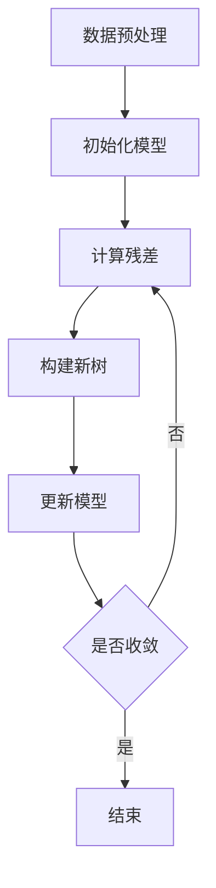

# XGBoost 原理与代码实战案例讲解

## 1.背景介绍

在机器学习领域，提升树（Boosting Trees）是一种非常有效的集成学习方法。XGBoost（Extreme Gradient Boosting）作为提升树的一个重要实现，因其高效、准确和灵活的特点，广泛应用于各类数据科学竞赛和实际项目中。XGBoost不仅在Kaggle等数据竞赛中屡获佳绩，还在金融、医疗、广告等多个领域得到了广泛应用。

## 2.核心概念与联系

### 2.1 提升树（Boosting Trees）

提升树是一种集成学习方法，通过将多个弱学习器（通常是决策树）组合成一个强学习器来提高模型的预测性能。每个新树的构建都是为了纠正前一棵树的错误。

### 2.2 梯度提升（Gradient Boosting）

梯度提升是一种提升树的实现方法，通过最小化损失函数来逐步改进模型。每一步都构建一个新的树来拟合当前模型的残差。

### 2.3 XGBoost的独特之处

XGBoost在传统梯度提升的基础上进行了多项改进，包括：
- 正则化：通过L1和L2正则化来防止过拟合。
- 并行处理：利用多线程加速训练过程。
- 树的剪枝：通过最大深度和最小样本分裂等参数控制树的复杂度。
- 缺失值处理：自动处理数据中的缺失值。

## 3.核心算法原理具体操作步骤

### 3.1 数据预处理

在进行XGBoost训练之前，首先需要对数据进行预处理，包括数据清洗、特征工程和数据分割。

### 3.2 初始化模型

初始模型通常是一个简单的常数模型，用于预测目标变量的均值。

### 3.3 计算残差

计算当前模型的预测值与实际值之间的差异，即残差。

### 3.4 构建新树

使用残差作为目标变量，构建一棵新的决策树。

### 3.5 更新模型

将新树的预测结果加到当前模型中，更新模型的预测值。

### 3.6 重复迭代

重复步骤3.3到3.5，直到达到预定的迭代次数或损失函数收敛。

以下是XGBoost算法的Mermaid流程图：



## 4.数学模型和公式详细讲解举例说明

### 4.1 损失函数

XGBoost的目标是最小化损失函数，常用的损失函数包括均方误差（MSE）和对数损失（Log Loss）。

$$
L(y, \hat{y}) = \sum_{i=1}^{n} l(y_i, \hat{y}_i)
$$

### 4.2 正则化项

为了防止过拟合，XGBoost在损失函数中加入了正则化项：

$$
\Omega(f) = \gamma T + \frac{1}{2} \lambda \sum_{j=1}^{T} w_j^2
$$

其中，$T$是树的叶子节点数，$w_j$是叶子节点的权重，$\gamma$和$\lambda$是正则化参数。

### 4.3 树的分裂

在构建新树时，XGBoost通过贪心算法选择最佳分裂点，最大化增益：

$$
Gain = \frac{1}{2} \left[ \frac{G_L^2}{H_L + \lambda} + \frac{G_R^2}{H_R + \lambda} - \frac{(G_L + G_R)^2}{H_L + H_R + \lambda} \right] - \gamma
$$

其中，$G_L$和$G_R$是左子树和右子树的梯度和，$H_L$和$H_R$是左子树和右子树的二阶导数和。

## 5.项目实践：代码实例和详细解释说明

### 5.1 安装XGBoost

首先，确保安装了XGBoost库：

```bash
pip install xgboost
```

### 5.2 导入必要的库

```python
import xgboost as xgb
from sklearn.model_selection import train_test_split
from sklearn.metrics import mean_squared_error
import pandas as pd
```

### 5.3 加载数据

```python
data = pd.read_csv('data.csv')
X = data.drop('target', axis=1)
y = data['target']
```

### 5.4 数据分割

```python
X_train, X_test, y_train, y_test = train_test_split(X, y, test_size=0.2, random_state=42)
```

### 5.5 训练模型

```python
dtrain = xgb.DMatrix(X_train, label=y_train)
dtest = xgb.DMatrix(X_test, label=y_test)

params = {
    'objective': 'reg:squarederror',
    'max_depth': 6,
    'eta': 0.1,
    'subsample': 0.8,
    'colsample_bytree': 0.8
}

num_rounds = 100
model = xgb.train(params, dtrain, num_rounds)
```

### 5.6 预测与评估

```python
preds = model.predict(dtest)
rmse = mean_squared_error(y_test, preds, squared=False)
print(f'RMSE: {rmse}')
```

## 6.实际应用场景

### 6.1 金融领域

在金融领域，XGBoost被广泛用于信用评分、风险评估和股票价格预测等任务。

### 6.2 医疗领域

在医疗领域，XGBoost用于疾病预测、患者分类和医疗图像分析等应用。

### 6.3 广告技术

在广告技术领域，XGBoost用于点击率预测、用户行为分析和广告投放优化。

## 7.工具和资源推荐

### 7.1 官方文档

XGBoost的官方文档提供了详细的API说明和使用示例，是学习XGBoost的最佳资源。

### 7.2 数据科学竞赛平台

Kaggle等数据科学竞赛平台上有大量的XGBoost实战案例和代码分享，可以帮助你更好地理解和应用XGBoost。

### 7.3 在线课程

Coursera、Udacity等平台上有许多关于XGBoost的在线课程，适合不同层次的学习者。

## 8.总结：未来发展趋势与挑战

XGBoost作为一种高效的集成学习方法，已经在多个领域取得了显著的成果。然而，随着数据规模的不断扩大和模型复杂度的增加，XGBoost也面临着一些挑战，如计算资源的消耗和模型解释性的不足。未来，如何在保证模型性能的同时，提高计算效率和模型可解释性，将是XGBoost发展的重要方向。

## 9.附录：常见问题与解答

### 9.1 如何处理缺失值？

XGBoost自动处理缺失值，无需额外的预处理步骤。

### 9.2 如何选择参数？

可以使用网格搜索（Grid Search）或贝叶斯优化（Bayesian Optimization）等方法来选择最佳参数。

### 9.3 如何防止过拟合？

可以通过调整正则化参数、增加数据量或使用交叉验证等方法来防止过拟合。

---

作者：禅与计算机程序设计艺术 / Zen and the Art of Computer Programming