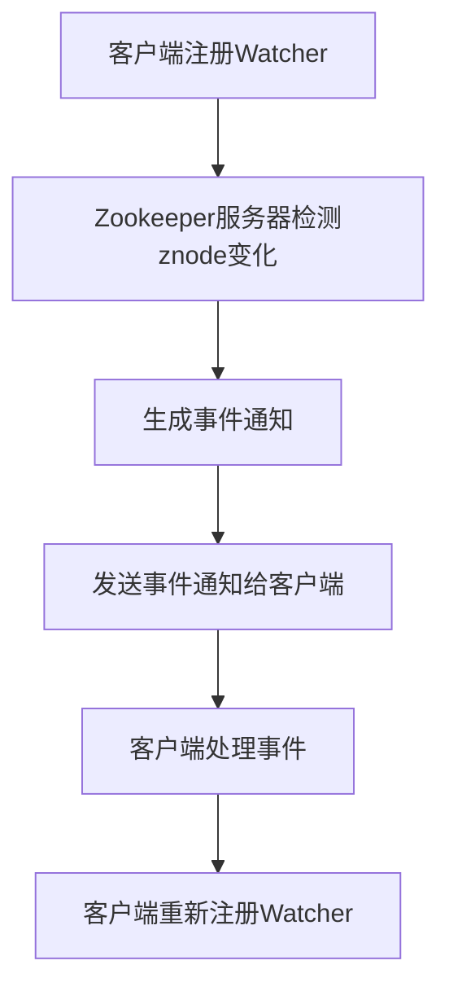

# Zookeeper Watcher机制原理与代码实例讲解

## 1.背景介绍

Zookeeper是一个分布式协调服务，广泛应用于分布式系统中，用于实现数据的同步、配置管理、命名服务等功能。Zookeeper的核心机制之一是Watcher机制，它允许客户端在Zookeeper节点上注册监听器，以便在节点数据或状态发生变化时接收通知。Watcher机制在分布式系统中具有重要意义，因为它提供了一种高效的方式来监控和响应数据变化。

## 2.核心概念与联系

### 2.1 Zookeeper节点

Zookeeper中的数据结构是一个树形结构，每个节点称为znode。znode可以存储数据，并且可以有子节点。znode有三种类型：持久节点、临时节点和顺序节点。

### 2.2 Watcher机制

Watcher机制是Zookeeper的一个重要特性，允许客户端在znode上注册监听器。当znode的数据或状态发生变化时，Zookeeper会通知相应的客户端。Watcher是一次性的，即一旦触发，客户端需要重新注册。

### 2.3 事件类型

Watcher机制支持多种事件类型，包括节点创建、节点删除、节点数据变化和子节点变化。每种事件类型对应不同的触发条件。

### 2.4 客户端与服务器的交互

客户端通过Zookeeper API与服务器交互，注册Watcher并接收事件通知。服务器在检测到znode变化时，会将事件通知发送给相应的客户端。

## 3.核心算法原理具体操作步骤

### 3.1 Watcher注册

客户端通过调用Zookeeper API中的`exists`、`getData`或`getChildren`方法来注册Watcher。例如，调用`exists`方法可以在指定znode上注册一个Watcher，以监控该znode的存在状态。

### 3.2 事件触发

当znode的状态或数据发生变化时，Zookeeper服务器会检测到这些变化，并生成相应的事件。服务器会将事件通知发送给注册了Watcher的客户端。

### 3.3 事件处理

客户端接收到事件通知后，会调用相应的回调函数来处理事件。回调函数可以执行各种操作，例如重新注册Watcher、更新本地缓存或触发其他业务逻辑。

### 3.4 Watcher重新注册

由于Watcher是一次性的，客户端在处理完事件后需要重新注册Watcher，以继续监控znode的变化。



## 4.数学模型和公式详细讲解举例说明

Watcher机制可以用数学模型来描述。设$Z$表示znode集合，$W$表示Watcher集合，$E$表示事件集合。

### 4.1 Watcher注册

Watcher注册可以表示为一个映射关系：
$$
R: Z \rightarrow W
$$
其中，$R(z)$表示在znode $z$上注册的Watcher集合。

### 4.2 事件触发

当znode $z$发生变化时，生成事件$e$，并通知所有在$z$上注册的Watcher：
$$
\forall w \in R(z), \text{通知}(w, e)
$$

### 4.3 事件处理

客户端接收到事件$e$后，调用回调函数$f$来处理事件：
$$
f(e)
$$

### 4.4 Watcher重新注册

处理完事件后，客户端需要重新注册Watcher：
$$
R'(z) = R(z) \cup \{w\}
$$

## 5.项目实践：代码实例和详细解释说明

### 5.1 环境准备

首先，确保已经安装了Zookeeper，并启动了Zookeeper服务器。可以使用以下命令启动Zookeeper服务器：

```sh
bin/zkServer.sh start
```

### 5.2 客户端代码示例

以下是一个使用Java编写的Zookeeper客户端代码示例，展示了如何注册Watcher并处理事件：

```java
import org.apache.zookeeper.*;
import org.apache.zookeeper.data.Stat;

public class ZookeeperWatcherExample {
    private static ZooKeeper zooKeeper;

    public static void main(String[] args) throws Exception {
        // 连接到Zookeeper服务器
        zooKeeper = new ZooKeeper("localhost:2181", 3000, new Watcher() {
            @Override
            public void process(WatchedEvent event) {
                System.out.println("收到事件通知: " + event);
                if (event.getType() == Event.EventType.NodeDataChanged) {
                    try {
                        // 重新注册Watcher
                        zooKeeper.getData("/example", true, null);
                    } catch (Exception e) {
                        e.printStackTrace();
                    }
                }
            }
        });

        // 创建znode
        String path = "/example";
        if (zooKeeper.exists(path, false) == null) {
            zooKeeper.create(path, "initial data".getBytes(), ZooDefs.Ids.OPEN_ACL_UNSAFE, CreateMode.PERSISTENT);
        }

        // 注册Watcher
        zooKeeper.getData(path, true, null);

        // 修改znode数据，触发Watcher
        zooKeeper.setData(path, "new data".getBytes(), -1);

        // 保持程序运行
        Thread.sleep(Long.MAX_VALUE);
    }
}
```

### 5.3 代码解释

1. **连接到Zookeeper服务器**：使用`ZooKeeper`类连接到Zookeeper服务器，并指定会话超时时间和默认的Watcher。
2. **创建znode**：检查znode是否存在，如果不存在则创建一个新的znode。
3. **注册Watcher**：使用`getData`方法在znode上注册Watcher。
4. **修改znode数据**：使用`setData`方法修改znode的数据，触发Watcher。
5. **处理事件**：在默认的Watcher中处理事件，并重新注册Watcher。

## 6.实际应用场景

### 6.1 配置管理

在分布式系统中，配置管理是一个常见的应用场景。通过Zookeeper的Watcher机制，可以实现配置的动态更新。当配置文件发生变化时，Zookeeper会通知所有注册了Watcher的客户端，客户端可以及时更新配置。

### 6.2 分布式锁

Zookeeper的Watcher机制可以用于实现分布式锁。通过在特定znode上注册Watcher，客户端可以监控锁的状态。当锁被释放时，Zookeeper会通知等待的客户端，客户端可以尝试获取锁。

### 6.3 服务发现

在微服务架构中，服务发现是一个重要的功能。通过Zookeeper的Watcher机制，可以实现服务的动态注册和发现。当服务实例上线或下线时，Zookeeper会通知所有注册了Watcher的客户端，客户端可以更新服务列表。

## 7.工具和资源推荐

### 7.1 Zookeeper官方文档

Zookeeper官方文档是学习和使用Zookeeper的最佳资源，提供了详细的API文档和使用指南。

### 7.2 Zookeeper客户端库

Zookeeper提供了多种编程语言的客户端库，包括Java、Python、C等。可以根据需要选择合适的客户端库。

### 7.3 开源项目

可以参考一些开源项目，了解Zookeeper在实际项目中的应用。例如，Apache Kafka和Hadoop都使用了Zookeeper进行协调和管理。

## 8.总结：未来发展趋势与挑战

Zookeeper的Watcher机制在分布式系统中具有重要意义，提供了一种高效的方式来监控和响应数据变化。随着分布式系统的不断发展，Watcher机制也面临一些挑战，例如高并发环境下的性能问题和复杂的事件处理逻辑。

未来，Zookeeper可能会进一步优化Watcher机制，提高性能和可靠性。同时，随着云计算和容器化技术的发展，Zookeeper在云原生环境中的应用也将越来越广泛。

## 9.附录：常见问题与解答

### 9.1 Watcher是持久的吗？

Watcher不是持久的。Watcher是一次性的，即一旦触发，客户端需要重新注册。

### 9.2 如何处理Watcher的高并发问题？

在高并发环境下，可以通过合理设计znode结构和使用异步API来提高性能。同时，可以使用缓存和批量处理技术来减少Zookeeper服务器的负载。

### 9.3 Watcher机制是否支持事务？

Watcher机制本身不支持事务，但可以结合Zookeeper的多操作事务（multi）API来实现复杂的事务逻辑。

### 9.4 如何调试Watcher机制？

可以通过日志和调试工具来调试Watcher机制。Zookeeper提供了详细的日志，可以帮助分析和定位问题。同时，可以使用Zookeeper CLI工具来查看znode的状态和数据。

### 9.5 Watcher机制的性能如何？

Watcher机制的性能取决于Zookeeper服务器的配置和客户端的实现。在高并发环境下，可能需要进行性能优化，例如使用异步API和批量处理技术。

---

作者：禅与计算机程序设计艺术 / Zen and the Art of Computer Programming