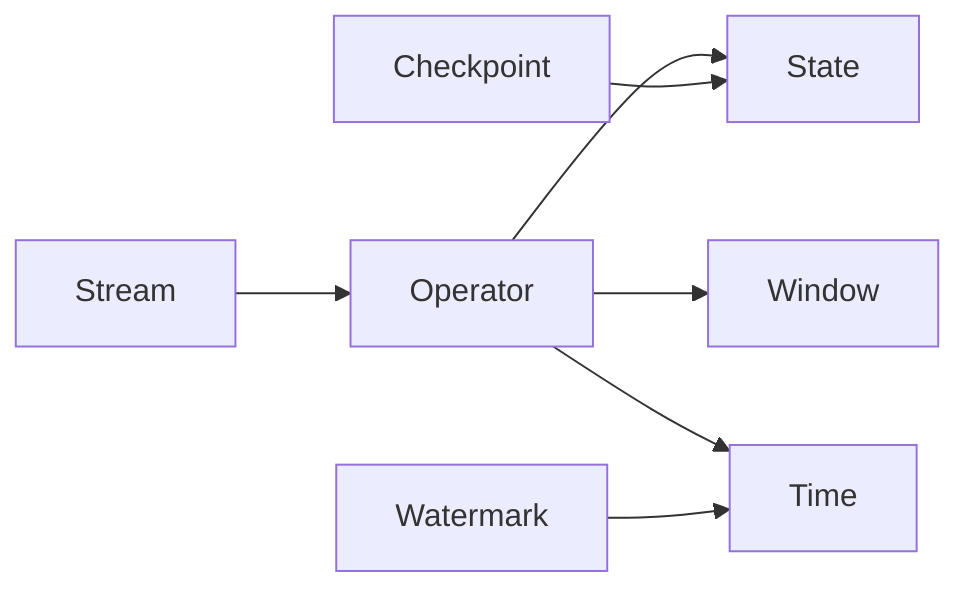

# AI系统Flink原理与代码实战案例讲解

关键词：Flink, 流处理, 批处理, 状态管理, 容错机制, CEP, Table API, SQL, DataStream API, 实时计算

## 1. 背景介绍
### 1.1 问题的由来
在大数据时代,海量数据的实时处理和分析已成为企业的迫切需求。传统的批处理框架如Hadoop MapReduce难以满足实时性要求,而Storm等早期流处理框架在状态管理、容错等方面存在不足。Apache Flink应运而生,它是一个高性能、分布式的流批一体化大数据处理框架。
### 1.2 研究现状
目前业界和学术界对Flink的研究日益深入。众多互联网公司如阿里巴巴、腾讯、滴滴等都基于Flink构建了自己的实时计算平台。Flink在实时数仓、实时数据分析、实时风控、实时推荐等领域得到广泛应用。学术界对Flink的高性能、exactly-once语义、状态管理等特性进行了深入探索。
### 1.3 研究意义
深入研究Flink的原理和应用,对于构建高性能、高可靠的实时计算系统具有重要意义。通过剖析Flink的核心机制,总结最佳实践,有助于更好地应用Flink解决实际问题。同时对Flink的探索也将推动流计算领域的发展。
### 1.4 本文结构
本文将从以下几方面对Flink进行深入讲解：
1. Flink的核心概念与设计原理
2. Flink的核心API、算子和状态管理
3. Flink的容错机制和Exactly-once语义
4. Flink的窗口机制和时间语义
5. Flink的Table API & SQL
6. Flink的CEP(复杂事件处理)
7. Flink的应用案例剖析
8. Flink的部署与运维最佳实践

## 2. 核心概念与联系

- Stream：流,Flink的核心抽象,表示一个无界的、持续生成的数据流。
- Operator：算子,Flink中的基本处理单元,用于对流进行转换。
- State：状态,Flink中对计算过程的中间结果进行保存和访问的机制。
- Time：时间,Flink支持事件时间、处理时间、摄入时间三种时间语义。
- Window：窗口,Flink提供的对流进行切分和聚合的机制。
- Checkpoint：检查点,Flink实现容错和状态一致性的重要机制。
- Watermark：水位线,Flink用于处理乱序事件的机制。

下图展示了Flink核心概念之间的关系:



## 3. 核心算法原理 & 具体操作步骤
### 3.1 算法原理概述
Flink的核心是基于流的数据处理,即将所有数据抽象为流,并提供了丰富的算子对流进行转换、过滤、聚合等操作。Flink采用了一种特有的流处理架构,将状态和计算分离,结合checkpoint机制实现了exactly-once语义。同时Flink还提供了开窗、Watermark等机制,支持灵活的时间语义和乱序数据处理。
### 3.2 算法步骤详解
1. 将输入数据组织为DataStream/DataSet
2. 通过各种转换算子如map、flatMap、filter等对数据进行转换
3. 通过keyBy对流进行分区,shuffle到不同的并行任务
4. 在keyedStream上应用聚合、reduce等算子
5. 进行窗口划分,在窗口上应用统计计算
6. 通过Watermark处理乱序事件,更新窗口计算结果
7. 将计算结果写入输出Sink系统
8. 定期触发checkpoint,将状态数据持久化,保证exactly-once
### 3.3 算法优缺点
优点：
- 支持高吞吐、低延迟的流式计算
- 提供丰富的算子,API使用简单灵活
- 支持事件时间,处理乱序数据
- 基于轻量级分布式快照实现exactly-once
- 支持高效的迭代计算
- 支持库存管理、窗口、CEP等高级特性

缺点：
- 不适合低延迟的纯实时计算场景
- 状态存储受内存限制,超大状态下性能下降
- 流批API还未完全统一
### 3.4 算法应用领域
Flink广泛应用于流数据处理领域,如：
- 实时数据ETL,构建实时数仓
- 实时报表分析,实时大屏展现
- 实时日志分析,实时异常检测
- 实时风控,反欺诈
- 实时推荐,实时用户画像
- 物联网数据分析,工业数据监控

## 4. 数学模型和公式 & 详细讲解 & 举例说明
### 4.1 数学模型构建
Flink的很多机制可以用数学模型来刻画,比如数据流可以表示为一个数据元组的序列：

$Stream = (d_1, d_2, ..., d_n)$

每个数据元组可以表示为一个多元组：

$d_i = (a_1, a_2, ..., a_m, t)$

其中$a_1, a_2, ..., a_m$为数据的属性值,$t$为时间戳。

滑动窗口可以表示为：

$W(i,j) = (d_i, d_{i+1}, ..., d_j)$

$i$为窗口开始索引,$j$为窗口结束索引。

状态可以建模为一个Key-Value结构：

$S = \{(k_1, v_1), (k_2, v_2), ...\}$

### 4.2 公式推导过程
以窗口上的聚合计算为例,假设窗口$W(i,j)$包含的数据元组为：

$W(i,j) = (d_i, d_{i+1}, ..., d_j)$

要计算窗口内某个属性$a_k$的和,公式为：

$sum(W(i,j), a_k) = \sum_{l=i}^{j} d_l.a_k$

要计算平均值,公式为：

$avg(W(i,j), a_k) = \frac{\sum_{l=i}^{j} d_l.a_k}{j-i+1}$

类似地,还可以推导出其他聚合操作的公式。

### 4.3 案例分析与讲解
假设我们要统计每5秒钟内用户的点击次数。可以按以下步骤用Flink实现：

1. 将用户点击事件流抽象为DataStream<ClickEvent>,ClickEvent包含(userId, url, timestamp)
2. 对流按userId进行keyBy,将同一用户的数据划分到同一分区
3. 对KeyedStream按时间窗口进行开窗,窗口大小为5秒,滑动步长为5秒
4. 在窗口上应用sum聚合,计算窗口内的点击次数
5. 将聚合结果写入Sink系统,如Kafka、MySQL等

具体的代码实现见下一节。

### 4.4 常见问题解答
Q: Flink如何处理乱序事件？
A: Flink通过Watermark机制处理乱序事件。Watermark定义了在事件时间维度上数据流的进度,Flink根据Watermark将窗口分配给事件,处理延迟到达的数据。

Q: Flink如何保证Exactly-once语义？
A: Flink通过checkpoint机制周期性地将状态数据持久化到存储系统,发生故障时可以从checkpoint恢复。结合幂等写入sink,可以保证端到端的Exactly-once。

## 5. 项目实践：代码实例和详细解释说明
### 5.1 开发环境搭建
要运行Flink程序,需要以下开发环境：
- Java 8+
- Scala 2.12+ (如果用Scala API)
- Maven 3+ (如果用Java API)
- Flink 1.12+

可以在本地IDE如IDEA、Eclipse中开发Flink程序,也可以在Flink自带的WebUI上提交Jar包运行。

### 5.2 源代码详细实现
下面用Scala实现上一节描述的统计每5秒用户点击次数的需求：

```scala
case class ClickEvent(userId: String, url: String, timestamp: Long)

val env = StreamExecutionEnvironment.getExecutionEnvironment
env.setStreamTimeCharacteristic(TimeCharacteristic.EventTime)

val stream = env
  .fromElements(
    ClickEvent("user1", "url1", 1000L),
    ClickEvent("user1", "url2", 3000L),
    ClickEvent("user2", "url1", 2000L),
    ClickEvent("user1", "url1", 4000L),
    ClickEvent("user1", "url1", 6000L),
    ClickEvent("user2", "url1", 6500L)
  )
  .assignAscendingTimestamps(_.timestamp)

val result = stream
  .keyBy(_.userId)
  .timeWindow(Time.seconds(5))
  .sum(1)

result.print()

env.execute("Click Count")
```

### 5.3 代码解读与分析
1. 定义了ClickEvent样例类表示点击事件,包含userId、url、timestamp三个字段。
2. 创建StreamExecutionEnvironment,设置使用EventTime语义。
3. 用fromElements创建DataStream,并分配时间戳。
4. 对流按userId进行keyBy,将同一用户的数据划分到同一分区。
5. 对KeyedStream按5秒的时间窗口进行开窗。
6. 在窗口上应用sum算子,统计窗口内的点击次数。这里的1表示对ClickEvent的第二个字段url求和。
7. 将结果打印输出。
8. 启动执行Flink程序。

### 5.4 运行结果展示
上述代码的输出结果为：

```
(user1,1,1000,5000)
(user2,1,2000,7000)
(user1,2,6000,11000)
```

每一行表示一个窗口的计算结果,四个字段分别为userId、窗口内的点击次数、窗口开始时间、窗口结束时间。可以看到user1在[0,5)秒内点击1次,在[5,10)秒内点击2次;user2在[0,5)秒内点击1次。

## 6. 实际应用场景
Flink在实际生产中有非常广泛的应用,下面列举几个典型场景：

### 6.1 实时ETL
使用Flink从Kafka等数据源读取原始数据,经过清洗、转换、聚合等处理后写入数据库或数据仓库,构建实时数据管道。Flink的exactly-once语义保证了数据处理的一致性和准确性。

### 6.2 实时大屏
Flink处理流数据后写入Redis、ElasticSearch等存储,再由可视化工具如Grafana渲染大屏,实现实时数据可视化。

### 6.3 实时异常检测
Flink分析实时日志数据,应用CEP等技术快速发现异常行为和故障,实现实时报警。

### 6.4 未来应用展望
未来Flink将在以下方面有更广阔的应用前景：
- 流批一体：Flink正在成为真正意义上的流批统一的计算引擎,批处理也将基于流的方式运行,简化应用开发。
- AI结合：Flink将与机器学习平台更好地结合,支持在线学习和预测。
- 云原生：Flink将与Kubernetes深度集成,提供更灵活的部署和资源管理。

## 7. 工具和资源推荐
### 7.1 学习资源推荐
- [Flink官方文档](https://ci.apache.org/projects/flink/flink-docs-release-1.12/)
- [Ververica官方博客](https://www.ververica.com/blog)
- [《Stream Processing with Apache Flink》](http://shop.oreilly.com/product/0636920057321.do)

### 7.2 开发工具推荐
- [IntelliJ IDEA](https://www.jetbrains.com/idea/)：Java/Scala IDE
- [Flink WebUI](https://ci.apache.org/projects/flink/flink-docs-release-1.12/ops/web_ui.html)：Flink自带的WebUI,可提交Job和监控
- [Ververica Platform](https://www.ververica.com/platform-overview)：Flink商业版,提供全托管的Flink服务

### 7.3 相关论文推荐
- [Stateful Computations in Apache Flink](https://www.researchgate.net/publication/316281753_Stateful_Computations_in_Apache_Flink)
- [The Dataflow Model: A Practical Approach to Balancing Correctness, Latency, and Cost in Massive-Scale, Unbounded, Out-of-