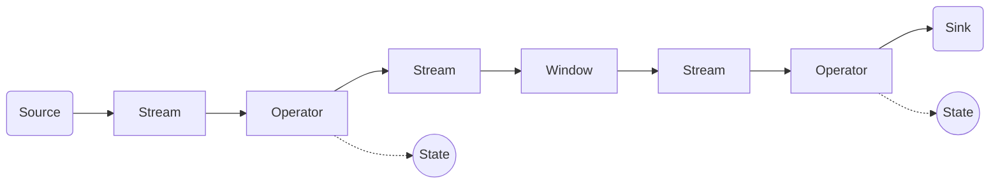

# Flink Stream原理与代码实例讲解

## 1. 背景介绍
### 1.1 问题的由来
在大数据处理领域,实时流式计算是一个非常重要的分支。相比于传统的批处理模式,流式计算可以实时地处理源源不断到来的数据,并及时产生结果,满足实时性要求较高的业务场景。Apache Flink是目前业界主流的开源大数据流式计算框架之一,其优秀的性能、灵活的API和稳定性受到了广泛的认可。然而,对于初学者来说,理解Flink Stream的内部原理和编写高效的Flink应用程序仍然存在一定的挑战。

### 1.2 研究现状
目前已经有不少研究探讨了Flink的原理和应用。一些论文[1][2]对Flink的整体架构、时间语义、状态管理等核心概念进行了深入分析。也有一些博客文章[3][4]通过实际的代码示例来演示如何使用Flink API构建流式应用。但是,将Flink原理与实践很好地结合起来,对关键技术点给出通俗易懂的讲解的文章还比较少见。

### 1.3 研究意义
通过深入研究Flink Stream的技术原理,并给出详细的代码示例讲解,可以帮助初学者更好地理解Flink的内部机制,掌握常见的Flink编程模式,提升开发Flink应用的效率。同时一些Flink的优化技巧和最佳实践,也可为从业者提供有益的参考。

### 1.4 本文结构
本文将从以下几方面展开对Flink Stream原理的讨论：
- 第2节介绍Flink Stream的核心概念与关键组件
- 第3节讲解Flink的核心编程模型和API
- 第4节对Flink的时间语义和窗口机制进行数学建模分析
- 第5节通过代码实例来演示Flink常见的编程模式
- 第6节总结Flink在实际场景中的应用案例
- 第7节推荐Flink学习和开发过程中常用的工具和资源
- 第8节对Flink技术的未来发展趋势和面临的挑战进行展望

## 2. 核心概念与联系
在正式介绍Flink Stream原理之前,我们先来了解一下Flink的几个核心概念：
- Stream:数据流,Flink面向的核心数据结构,由一系列的事件(Event)组成。
- Event:事件,Stream中的基本数据单元,通常带有时间戳信息。
- Operator:算子,Flink中的基本处理单元,用于对输入的数据流进行转换处理。
- Source:数据源,Flink作业的输入端,负责接入外部数据。
- Sink:数据汇,Flink作业的输出端,负责输出计算结果。
- Window:窗口,Flink处理无界数据流的核心机制,用于将Stream划分为有界的数据集进行处理。
- Time:时间语义,Flink支持事件时间(Event Time)和处理时间(Processing Time)两种时间语义。
- State:状态,Flink支持在算子中维护状态,用于保存计算过程中的中间结果。

下图展示了Flink Stream编程模型中各个组件的关系：



从图中可以看出,Flink程序从Source读取数据形成输入Stream,之后经过一系列的Operator转换处理,中间可以通过Window进行数据的聚合,Operator可以维护自己的State。最终处理后的数据通过Sink输出。

## 3. 核心算法原理 & 具体操作步骤
### 3.1 算法原理概述
Flink Stream的核心是基于事件驱动(Event-driven)的流式计算模型。输入的数据流被抽象为一系列的Event,每个Event都带有时间戳信息。Flink根据用户定义的Operator算子依次处理每个到来的Event,同时会维护算子的状态State。整个计算过程是基于事件触发的,即一个事件的到来会触发相应算子的计算。

### 3.2 算法步骤详解
对于一个典型的Flink Stream作业,其基本处理步骤如下:

1. 通过调用env.addSource()等API,将外部数据源接入到Flink程序,形成DataStream。
2. 对DataStream调用map、filter、flatMap等转换算子,进行数据转换处理。
3. 必要时调用keyBy对Stream进行分区,或调用window进行窗口划分。
4. 对转换后的Stream调用sink算子如writeAsText,将计算结果输出到外部系统。
5. 调用env.execute()触发Flink作业的执行。

在具体执行过程中,Flink会将用户定义的算子操作转换为一张逻辑上的拓扑图(Topology),图中的每个节点代表一个算子,边代表算子之间的数据传输。Flink的任务调度器会将拓扑图转换为物理执行计划,并分发到不同的TaskManager上执行。

### 3.3 算法优缺点
Flink Stream模型的主要优点包括:

- 支持高吞吐和低延迟的流式计算
- 支持事件时间语义,能处理乱序事件
- 支持exactly-once的状态一致性语义
- 基于JVM实现,具有较好的内存管理机制

但Flink也有一些局限性,例如:

- 不支持细粒度的事件级别的exactly-once语义
- 状态存储受限于内存大小,状态过大时需要借助外部存储
- 流式shuffle会占用较多网络资源

### 3.4 算法应用领域
Flink Stream广泛应用于一些需要实时处理海量数据的场景,例如:

- 实时数据分析,如实时大屏展示、实时报表生成等
- 实时数据聚合,如监控数据聚合、日志数据分析等
- 实时异常检测,如实时欺诈检测、故障实时预警等
- 实时数据整合,如跨平台数据实时同步等

## 4. 数学模型和公式 & 详细讲解 & 举例说明
### 4.1 数据模型构建
我们可以用数学语言来刻画Flink Stream中的核心数据结构。设输入数据流为一个事件序列 $E=\{e_1,e_2,...,e_n\}$,其中每个事件 $e_i$ 是一个二元组:

$$e_i = (t_i, d_i)$$

其中 $t_i$ 表示事件的时间戳, $d_i$ 表示事件携带的数据。

一个Flink算子可以看作是一个函数 $f$,它定义了事件的转换逻辑,即

$$f: E \rightarrow E'$$

其中 $E'=\{e'_1,e'_2,...,e'_m\}$ 为输出的事件序列。

### 4.2 窗口模型
Flink引入窗口机制来处理无界流数据。窗口可以将无界流切分成有界的数据集。设窗口 $W_j$ 是事件的一个子集,即

$$W_j \subset E$$

常见的窗口类型包括滚动窗口(Tumbling Window)、滑动窗口(Sliding Window)和会话窗口(Session Window)。以滑动窗口为例,它由窗口大小 $S$ 和滑动步长 $T$ 两个参数定义,每个窗口可表示为:

$$W_j = \{ e_i | t_i \in [t_j, t_j+S) \}$$

其中 $t_j=t_0+j*T$, $t_0$ 为初始的时间戳。

### 4.3 状态模型
Flink支持有状态的计算,即算子可以维护内部状态。设算子 $f$ 的状态为 $s$,则算子可以表示为:

$$e'_i = f(e_i, s)$$

$$s' = g(e_i, s)$$

其中 $g$ 为状态转移函数。常见的状态类型包括值状态(Value State)、列表状态(List State)、映射状态(Map State)等。

### 4.4 时间语义
Flink支持三种时间语义:Processing Time、Event Time和Ingestion Time。
- Processing Time:事件被算子处理的时间
- Event Time:事件在数据源产生的时间
- Ingestion Time:事件进入Flink的时间

设 $t_p$、$t_e$、$t_i$ 分别表示处理时间、事件时间和摄入时间,则有:

$$t_e \leq t_i \leq t_p$$

Flink默认使用Processing Time,但可以通过指定Event Time和Watermark机制来处理乱序事件。

## 5. 项目实践：代码实例和详细解释说明
下面我们通过一个实际的代码案例来演示Flink DataStream API的使用。该案例的需求是:实时统计每5秒中用户的点击次数。

### 5.1 开发环境搭建
首先需要搭建Flink开发环境,可以使用Maven引入Flink相关依赖:

```xml
<dependency>
  <groupId>org.apache.flink</groupId>
  <artifactId>flink-streaming-java_2.12</artifactId>
  <version>1.12.0</version>
</dependency>
```

### 5.2 源代码实现
具体的Flink程序如下:

```java
public class ClickCountExample {
    public static void main(String[] args) throws Exception {
        // 创建执行环境
        StreamExecutionEnvironment env = StreamExecutionEnvironment.getExecutionEnvironment();

        // 创建数据源
        DataStream<String> textStream = env.socketTextStream("localhost", 9999);

        // 转换计算
        DataStream<Tuple2<String, Long>> resultStream = textStream
                .flatMap(new ClickEventSplitter())
                .keyBy(r -> r.f0)
                .timeWindow(Time.seconds(5))
                .sum(1);

        // 打印输出
        resultStream.print();

        // 执行作业
        env.execute("Click Count Job");
    }

    // 自定义FlatMapFunction
    public static class ClickEventSplitter implements FlatMapFunction<String, Tuple2<String, Long>> {
        @Override
        public void flatMap(String line, Collector<Tuple2<String, Long>> out) {
            String[] fields = line.split(",");
            out.collect(Tuple2.of(fields[0], 1L));
        }
    }
}
```

### 5.3 代码解读
1. 首先通过`StreamExecutionEnvironment`创建Flink流式执行环境。
2. 通过`socketTextStream`创建一个Socket数据源,监听指定端口上的文本数据。
3. 对接收到的文本数据调用`flatMap`进行转换处理,这里我们自定义了一个`ClickEventSplitter`类,将每行数据按逗号分割,提取出用户ID,并以`(user_id, 1L)`的形式输出。
4. 然后调用`keyBy`按用户ID进行分区,再调用`timeWindow`按5秒的时间窗口进行划分,最后调用`sum`算子对窗口内的点击次数进行求和。
5. 通过`print`算子将结果打印输出。
6. 最后调用`execute`方法启动Flink作业执行。

### 5.4 运行展示
在本地启动一个Socket服务,作为数据源不断发送用户点击数据,数据格式为`user_id,timestamp`,例如:
```
user1,1612182211
user1,1612182213
user2,1612182214
user1,1612182216
...
```

启动Flink程序,可以看到控制台输出每5秒中各个用户的点击次数,例如:
```
(user1, 2)
(user2, 1)
(user1, 3)
...
```

## 6. 实际应用场景
Flink凭借其优秀的流式处理能力,在许多实际场景中得到了广泛应用,下面列举几个典型案例:

### 6.1 实时大屏统计
在电商大促、新闻直播等场景中,通常需要实时统计一些核心指标,如销售额、在线人数等,并在大屏上实时展示。Flink可以实时消费多个数据源的数据,如交易、点击、物流等,经过实时的统计聚合计算后,将结果推送到大屏展示系统。

### 6.2 实时日志分析
Web服务每天会产生大量的用户访问日志,如果能实时分析这些日志,及时发现一些异常行为,如恶意爬虫、刷单等,就可以快速做出反应。Flink可以对Nginx等系统的日