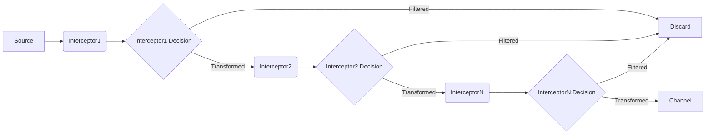

# Flume Interceptor原理与代码实例讲解

## 1. 背景介绍
### 1.1 问题的由来
在大数据时代,海量数据的实时采集和传输是一个巨大的挑战。Apache Flume作为分布式的、可靠的、高可用的海量日志采集、聚合和传输的工具,在业界得到了广泛应用。然而,在实际应用中,我们往往需要在数据传输过程中对数据进行自定义加工处理,如何实现这一功能成为了一个关键问题。

### 1.2 研究现状
Flume提供了拦截器(Interceptor)机制来实现数据的自定义处理。用户可以通过自定义拦截器,在事件(Event)进入Channel之前对其进行处理,实现诸如过滤、转换等各种操作。目前已有一些常用的拦截器实现,例如Timestamp Interceptor、Host Interceptor、Static Interceptor等,但对于拦截器的内部工作原理,以及如何进行自定义拦截器的开发,相关的系统性资料还比较匮乏。

### 1.3 研究意义
深入理解Flume Interceptor的工作原理,对于开发者灵活运用Flume处理数据具有重要意义。通过学习拦截器的开发,可以根据实际需求定制个性化的数据处理逻辑,提升Flume的可扩展性。同时,对拦截器机制的深入剖析,也有助于我们理解类似"责任链"设计模式的应用,拓展架构设计思路。

### 1.4 本文结构
本文将从Flume Interceptor的基本概念入手,分析其在整个数据流转过程中的作用。然后重点剖析拦截器的工作原理,给出典型的拦截器实现代码,并详细解读。同时,本文还将介绍拦截器的开发步骤,如何进行自定义拦截器的编码和配置。最后,总结拦截器的应用场景和注意事项,展望其未来的发展方向。

## 2. 核心概念与联系
在Flume的数据传输过程中,Interceptor位于Source和Channel之间,是一种可插拔的数据处理组件。多个Interceptor可以串联成一个Interceptor Chain,依次对Event进行处理。每个Interceptor的处理结果决定Event的去向,可以选择将Event传递给下一个Interceptor、直接发送到Channel或者丢弃。

Interceptor的接口定义如下:
```java
public interface Interceptor {

  void initialize();

  Event intercept(Event event);

  List<Event> intercept(List<Event> events);

  void close();
}
```

其中,`initialize`和`close`方法用于资源的初始化和清理,`intercept`方法则定义了具体的Event拦截处理逻辑,可以根据需求对Event的属性和内容进行修改。

Flume内置了一些常用的Interceptor实现,包括:
- Timestamp Interceptor:自动添加时间戳。
- Host Interceptor:自动添加主机名或IP。
- Static Interceptor:在Event Header中添加静态Key-Value对。
- Regex Filtering Interceptor:根据正则表达式过滤Event。
- Regex Extractor Interceptor:使用正则表达式从Event Body中抽取信息到Header中。

除了内置的Interceptor,Flume还支持自定义Interceptor。通过实现Interceptor接口,我们可以编写自己的数据处理逻辑,实现个性化的功能。

## 3. 核心算法原理 & 具体操作步骤
### 3.1 算法原理概述
Interceptor的核心原理可以概括为"责任链模式"。多个Interceptor首尾相连,形成一个处理链。每个Interceptor只需关注自己的处理逻辑,处理完成后将Event传递给下一个Interceptor。这种松耦合的设计使得Interceptor可以灵活组合,新的Interceptor也可以方便地添加。

### 3.2 算法步骤详解
Interceptor的处理步骤如下:

1. Source接收到Event后,将其交给Interceptor Chain处理。
2. 链中的第一个Interceptor调用`intercept`方法处理该Event。
3. 根据处理结果,Interceptor可以选择:
   - 返回null,表示丢弃该Event;
   - 返回修改后的Event,将其传递给下一个Interceptor;
   - 返回一个新的Event List,将其传递给下一个Interceptor。
4. 后续的Interceptor依次对Event进行处理,直到整个链处理完毕。
5. 处理完成的Event被发送到Channel中,等待Sink消费。

可以用下面的 Mermaid 流程图来表示:



### 3.3 算法优缺点
Interceptor机制的优点在于:
- 可扩展性强,新的处理逻辑可以方便地以Interceptor的形式添加。
- 职责分离,每个Interceptor只需专注自己的处理逻辑。
- 可维护性好,Interceptor之间没有直接依赖。

同时,Interceptor机制也有一些需要注意的地方:
- 过多的Interceptor会影响数据处理的性能。
- Interceptor的配置较为复杂,需要注意处理顺序。
- 异常处理需要考虑,防止一个Interceptor的异常影响整个处理链。

### 3.4 算法应用领域
Interceptor机制适用于各种数据处理场景,包括日志采集、数据清洗、数据脱敏等。通过定制Interceptor,可以灵活地实现各种数据中间件的功能。同时,Interceptor作为一种常见的设计模式,"责任链"的思想也可以用于其他需要逐步处理数据的场景。

## 4. 数学模型和公式 & 详细讲解 & 举例说明
### 4.1 数学模型构建
Interceptor机制可以用数学模型来表示。假设有n个Interceptor $I_1, I_2, ..., I_n$依次排列,每个Interceptor的处理函数为$f_i(x)$,其中x为输入的Event。那么整个Interceptor Chain的处理过程可以表示为:

$$E_0 \overset{f_1}{\rightarrow} E_1 \overset{f_2}{\rightarrow} E_2 \overset{f_3}{\rightarrow} ... \overset{f_n}{\rightarrow} E_n$$

其中,$E_0$为原始Event,$E_i$为第i个Interceptor处理后的Event,如果某个$f_i$返回null,则处理结束,Event被丢弃。

### 4.2 公式推导过程
对于第i个Interceptor,其处理函数$f_i$可以进一步分解为两部分:转换函数$t_i$和过滤函数$p_i$。$t_i$对Event进行转换处理,$p_i$判断Event是否需要丢弃。因此,$f_i$可以表示为:

$$f_i(x) = \begin{cases}
t_i(x) & p_i(x) = true \\
null & p_i(x) = false
\end{cases}$$

如果定义$T_i$为前i个Interceptor的累积转换函数,则有:

$$T_i(x) = f_i(f_{i-1}(...f_1(x)...)) = t_i(t_{i-1}(...t_1(x)...))$$

那么整个Interceptor Chain的处理过程可以用$T_n$表示:

$$E_n = T_n(E_0) = t_n(t_{n-1}(...t_1(E_0)...))$$

### 4.3 案例分析与讲解
举一个具体的例子,假设我们有三个Interceptor:

1. TimestampInterceptor:在Event Header中添加时间戳。
2. HostInterceptor:在Event Header中添加主机名。
3. FilterInterceptor:根据Event Body中是否包含"error"关键字过滤Event。

对于一个原始Event $E_0 = \{header: \{\}, body: "This is a test log."\}$,经过Interceptor Chain处理后,最终得到的Event为:

$$E_3 = \{header: \{timestamp: "1620620779", host: "localhost"\}, body: "This is a test log."\}$$

如果$E_0 = \{header: \{\}, body: "This is an error log."\}$,则最终Event会被FilterInterceptor丢弃。

### 4.4 常见问题解答
1. Q:Interceptor的调用顺序是如何确定的?
   A:Interceptor的调用顺序取决于配置文件中的顺序,先配置的Interceptor先调用。

2. Q:如果某个Interceptor抛出异常会怎样?
   A:如果Interceptor抛出异常,该Event将被丢弃,不会传递给下一个Interceptor。可以通过`try-catch`捕获异常避免影响处理链。

3. Q:Interceptor和Channel Selector有什么区别?
   A:Interceptor主要用于Event的转换和过滤,而Channel Selector用于决定Event发送到哪个Channel。它们的应用场景和目的不同。

## 5. 项目实践：代码实例和详细解释说明
### 5.1 开发环境搭建
开发Flume Interceptor需要准备以下环境:
- JDK 1.8+
- Apache Maven 3.x
- Flume 1.9.0

可以通过在pom.xml中添加以下依赖引入Flume相关类库:
```xml
<dependency>
  <groupId>org.apache.flume</groupId>
  <artifactId>flume-ng-core</artifactId>
  <version>1.9.0</version>
</dependency>
```

### 5.2 源代码详细实现
下面以一个简单的HostInterceptor为例,介绍自定义Interceptor的实现步骤。

```java
package com.example.flume.interceptor;

import org.apache.flume.Context;
import org.apache.flume.Event;
import org.apache.flume.interceptor.Interceptor;

import java.net.InetAddress;
import java.util.List;
import java.util.Map;

public class HostInterceptor implements Interceptor {

    private String hostName;

    @Override
    public void initialize() {
        try {
            this.hostName = InetAddress.getLocalHost().getHostName();
        } catch (Exception e) {
            this.hostName = "UNKNOWN";
        }
    }

    @Override
    public Event intercept(Event event) {
        Map<String, String> headers = event.getHeaders();
        headers.put("hostname", hostName);
        return event;
    }

    @Override
    public List<Event> intercept(List<Event> list) {
        for (Event event : list) {
            intercept(event);
        }
        return list;
    }

    @Override
    public void close() {
    }

    public static class Builder implements Interceptor.Builder {

        @Override
        public Interceptor build() {
            return new HostInterceptor();
        }

        @Override
        public void configure(Context context) {
        }
    }
}
```

### 5.3 代码解读与分析
- `initialize`方法在Interceptor初始化时调用,这里获取本机的主机名。
- `intercept(Event event)`方法定义了单个Event的处理逻辑,这里是在Event的Header中添加`hostname`字段。
- `intercept(List<Event> list)`方法用于批量处理Event,内部实际上是对每个Event调用`intercept(Event event)`方法。
- `close`方法用于资源清理,这个简单的Interceptor不需要。
- `Builder`内部类实现了`Interceptor.Builder`接口,用于创建Interceptor实例。

### 5.4 运行结果展示
将上述Interceptor打包后,在Flume的配置文件中添加如下配置:
```properties
a1.sources = s1
a1.channels = c1
a1.sources.s1.channels = c1
a1.sources.s1.interceptors = i1
a1.sources.s1.interceptors.i1.type = com.example.flume.interceptor.HostInterceptor$Builder
```

启动Flume后,可以看到Event的Header中多了一个`hostname`字段,表明Interceptor生效。

## 6. 实际应用场景
Flume Interceptor在实际的数据采集和处理中有广泛的应用,一些常见的场景包括:
- 日志脱敏:对采集到的日志进行脱敏处理,如替换敏感字段。
- 数据过滤:根据特定规则过滤掉不需要的数据,减少传输量。
- 数据富集:在采集数据的同时,添加一些额外的信息,如时间戳、主机名等。
- 数据分发:根据数据的特征,将其发送到不同的Channel或Sink。

### 6.4 未来应用展望
随着大数据和流式计算的发展,Flume Interceptor的应用场景还将不断拓展。一些值