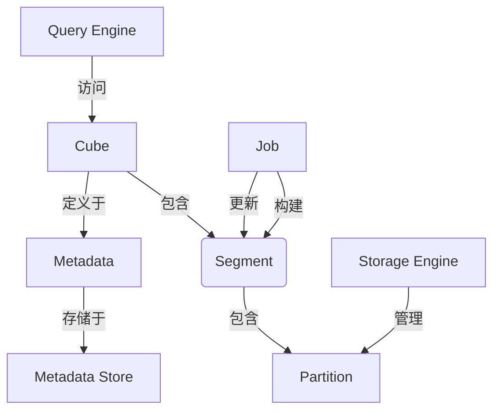

# Kylin原理与代码实例讲解

## 1. 背景介绍

### 1.1 问题的由来

在大数据时代,数据量的快速增长已经成为一个不可忽视的挑战。传统的数据处理和分析方式已经无法满足现代企业对实时数据洞察的需求。为了解决这一问题,Apache Kylin应运而生。

Apache Kylin是一个开源的分布式分析引擎,旨在提供SQL查询在超大规模数据集上的极致性能。它在Apache Hadoop之上构建了一个强大的OLAP(在线分析处理)引擎,支持超大规模的数据集和亚秒级的查询响应。

### 1.2 研究现状

目前,Apache Kylin已经被众多知名企业所采用,如易贝、思科、滴滴等。它在大数据分析领域展现出了卓越的性能和可扩展性。然而,由于Kylin的复杂性,许多开发人员和数据工程师对其原理和实现细节仍然缺乏深入的了解。

### 1.3 研究意义

深入探讨Apache Kylin的原理和实现细节,对于提高大数据分析的效率和质量具有重要意义。通过掌握Kylin的核心概念、算法和代码实现,开发人员可以更好地利用这一强大的分析引擎,从而加速数据驱动型决策的进程。

### 1.4 本文结构

本文将从以下几个方面全面剖析Apache Kylin:

1. 核心概念与联系
2. 核心算法原理与具体操作步骤
3. 数学模型和公式详细讲解与案例分析
4. 项目实践:代码实例和详细解释说明
5. 实际应用场景
6. 工具和资源推荐
7. 总结:未来发展趋势与挑战
8. 附录:常见问题与解答

## 2. 核心概念与联系

Apache Kylin的核心概念主要包括:

1. **Cube(多维数据集)**:Cube是Kylin中的核心数据结构,它是对原始数据的预计算和预聚合。Cube由多个Partition(数据分区)组成,每个Partition包含了一组预计算的数据。

2. **Job(作业)**:Job是Kylin中的基本执行单元,负责执行特定的任务,如构建Cube、更新Cube等。Job由多个Step(步骤)组成,每个Step执行一个特定的操作。

3. **Segment(数据段)**:Segment是Cube中的一个逻辑单元,由多个Partition组成。每个Segment对应一个Job,用于存储该Job的执行结果。

4. **Metadata(元数据)**:Metadata存储了Kylin中各种对象的定义和属性,如Cube、Model、Project等。它是Kylin运行的核心依赖。

5. **Query Engine(查询引擎)**:Query Engine是Kylin的核心组件之一,负责将SQL查询转换为对Cube的访问,并将查询结果返回给客户端。

6. **Storage Engine(存储引擎)**:Storage Engine负责管理Cube数据在HDFS上的存储和访问。它支持多种存储格式,如Parquet、ORC等。

7. **Metadata Store(元数据存储)**:Metadata Store用于持久化存储Kylin的元数据,通常使用HBase作为后端存储。

这些核心概念相互关联、相互依赖,共同构建了Kylin的分析引擎框架。下图展示了它们之间的关系:

## 3. 核心算法原理与具体操作步骤

### 3.1 算法原理概述

Apache Kylin的核心算法是基于数据立方体(Data Cube)技术的。数据立方体是一种将多维数据集进行预计算和预聚合的技术,旨在加速OLAP查询。Kylin采用了一种称为"Cubing"的算法,将原始数据转换为多维数据立方体。

Cubing算法的核心思想是:对原始数据进行多维度的分组、聚合和排列组合,生成包含所有可能查询路径的预计算数据集。这样,当执行OLAP查询时,Kylin可以直接从预计算的数据立方体中获取结果,而无需对原始数据进行实时计算。

### 3.2 算法步骤详解

Cubing算法的具体步骤如下:

1. **数据抽取(Extract)**:从原始数据源(如Hive表)中抽取所需的数据。

2. **数据转换(Transform)**:对抽取的数据进行清洗、转换和规范化处理。

3. **立方体设计(Cube Design)**:根据业务需求和查询模式,设计立方体的维度、度量和分层结构。

4. **数据分区(Partition)**:将原始数据按照指定的分区键(如时间、地区等)进行分区,以提高并行计算效率。

5. **立方体构建(Cube Build)**:对每个数据分区执行Cubing算法,生成对应的立方体分区。

6. **立方体合并(Cube Merge)**:将所有立方体分区合并为一个完整的立方体。

7. **索引构建(Index Build)**:为立方体构建索引,加速查询性能。

8. **立方体更新(Cube Refresh)**:当原始数据发生变化时,执行增量式或全量式的立方体更新。

在这个过程中,Cubing算法会根据设计的立方体结构,对原始数据进行多维度的分组、聚合和排列组合,生成包含所有可能查询路径的预计算数据集。这些预计算数据集就是Kylin中的立方体(Cube)。

### 3.3 算法优缺点

Cubing算法的主要优点是:

1. **查询性能卓越**:由于数据已经预计算和预聚合,查询可以直接从立方体中获取结果,无需对原始数据进行实时计算,因此查询性能极高。

2. **支持复杂查询**:立方体包含了所有可能的查询路径,因此可以支持各种复杂的OLAP查询,如滚动计算、层次计算等。

3. **可扩展性强**:由于采用了分区和并行计算技术,算法可以很好地扩展到大规模数据集。

但同时,Cubing算法也存在一些缺点:

1. **构建成本高**:构建立方体需要对原始数据进行大量的预计算和预聚合,计算成本很高。

2. **存储空间占用大**:预计算的立方体数据通常比原始数据的存储空间要大得多。

3. **更新延迟**:当原始数据发生变化时,需要重新构建或增量更新立方体,存在一定的延迟。

### 3.4 算法应用领域

Cubing算法及Apache Kylin主要应用于以下领域:

1. **商业智能(BI)**:为企业提供多维度的数据分析和决策支持。

2. **在线分析处理(OLAP)**:支持对海量数据进行多维度的分析和探索。

3. **大数据分析**:在Hadoop生态系统中提供高性能的大数据分析能力。

4. **数据可视化**:为数据可视化工具提供高效的查询支持。

5. **互联网广告**:分析用户行为数据,优化广告投放策略。

6. **电子商务**:分析用户购买行为,改进产品推荐和定价策略。

## 4. 数学模型和公式详细讲解与举例说明

### 4.1 数学模型构建

Apache Kylin的核心数学模型是基于多维数据模型(Multidimensional Data Model)构建的。多维数据模型将数据表示为一个由事实表(Fact Table)和多个维度表(Dimension Table)组成的立方体结构。

事实表存储了度量值(Measures),如销售额、成本等;而维度表则存储了描述事实的各种维度属性,如时间、地理位置、产品类别等。通过将事实表与维度表进行连接,可以获得多维度的数据视图。

在Kylin中,多维数据模型可以形式化地表示为:

$$
F = \{M_1, M_2, \ldots, M_n\}
$$

$$
D_i = \{A_{i1}, A_{i2}, \ldots, A_{im_i}\}, i = 1, 2, \ldots, k
$$

其中:

- $F$ 表示事实表,包含 $n$ 个度量值 $M_1, M_2, \ldots, M_n$
- $D_i$ 表示第 $i$ 个维度表,包含 $m_i$ 个属性 $A_{i1}, A_{i2}, \ldots, A_{im_i}$
- $k$ 表示维度表的数量

基于这个数学模型,Kylin可以构建出多维数据立方体,支持对数据进行多维度的分析和查询。

### 4.2 公式推导过程

在Cubing算法中,需要对原始数据进行多维度的分组、聚合和排列组合,以生成预计算的立方体数据。这个过程可以用数学公式来表示。

假设原始数据集为 $R$,包含 $n$ 个记录 $r_1, r_2, \ldots, r_n$,每个记录由 $k$ 个维度属性 $\{A_1, A_2, \ldots, A_k\}$ 和 $m$ 个度量值 $\{M_1, M_2, \ldots, M_m\}$ 组成。

则对于任意一个立方体单元 $C$,它的度量值可以通过以下公式计算:

$$
C.M_j = \operatorname{AGG}_{r_i \in R, \pi_{A_1, A_2, \ldots, A_k}(r_i) = C}(r_i.M_j), j = 1, 2, \ldots, m
$$

其中:

- $\pi_{A_1, A_2, \ldots, A_k}(r_i)$ 表示对记录 $r_i$ 进行 $\{A_1, A_2, \ldots, A_k\}$ 维度的投影
- $\operatorname{AGG}$ 表示聚合函数,如SUM、AVG等

也就是说,立方体单元 $C$ 的度量值 $M_j$ 是通过对原始数据集 $R$ 中所有投影到 $C$ 的记录的 $M_j$ 值进行聚合而得到的。

通过枚举所有可能的维度组合,就可以计算出完整的立方体数据。

### 4.3 案例分析与讲解

为了更好地理解数学模型和公式,我们来看一个具体的案例。

假设我们有一个销售数据集,包含以下字段:

- 时间维度:年、季度、月
- 产品维度:产品类别、产品名称
- 地理维度:国家、省份、城市
- 度量值:销售额、销售数量

我们希望构建一个立方体,支持按照时间、产品和地理位置进行多维度分析。

根据上述数学模型,我们可以定义:

- 事实表 $F = \{\text{销售额}, \text{销售数量}\}$
- 时间维度表 $D_1 = \{\text{年}, \text{季度}, \text{月}\}$
- 产品维度表 $D_2 = \{\text{产品类别}, \text{产品名称}\}$
- 地理维度表 $D_3 = \{\text{国家}, \text{省份}, \text{城市}\}$

然后,我们可以使用Cubing算法对原始数据进行预计算和预聚合,生成包含所有可能查询路径的立方体数据。

例如,对于立方体单元 $C = \{\text{年}=2022, \text{产品类别}=\text{电子产品}, \text{国家}=\text{美国}\}$,它的销售额可以通过以下公式计算:

$$
C.\text{销售额} = \sum_{r_i \in R, \pi_{\text{年}, \text{产品类别}, \text{国家}}(r_i) = C}(r_i.\text{销售额})
$$

也就是说,我们需要从原始数据集 $R$ 中找出所有年份为2022、产品类别为电子产品、国家为美国的记录,然后对它们的销售额进行求和,得到立方体单元 $C$ 的销售额值。

通过这种方式,我们可以预先计算出所有可能的立方体单元,从而加速后续的查询处理。

### 4.4 常见问题解答

**Q1: 为什么需要构建立方体?直接对原始数据进行查询不可以吗?**

A1: