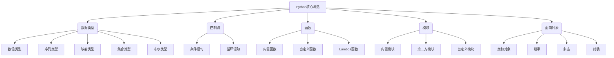

# Python语言基础原理与代码实战案例讲解

## 1. 背景介绍

### 1.1 问题的由来

在当今科技飞速发展的时代，编程语言无疑成为了推动创新和技术进步的核心动力。作为一种广泛应用的通用编程语言,Python凭借其简洁、优雅和高效的特性,在各个领域都有着广泛的应用。无论是Web开发、数据分析、人工智能还是系统自动化,Python都展现出了强大的实力。

然而,对于初学者而言,Python的学习曲线往往并不平坦。虽然Python语法相对简单,但要真正掌握其核心原理并运用自如,需要对编程范式、数据结构、算法等基础知识有深入的理解。同时,将理论知识转化为实际应用也是一个巨大的挑战。

### 1.2 研究现状

目前,Python语言的教学资源虽然丰富,但大多数资源要么过于理论化,缺乏实践案例;要么过于实践化,缺乏对底层原理的解释。这种知识碎片化严重影响了学习者对Python的系统性认知,也容易导致"会用但不会写"的困境。

此外,许多教程在讲解算法和数学模型时,往往过于抽象和晦涩,缺乏形象生动的案例说明,这无疑加大了学习者的理解难度。

### 1.3 研究意义

本文旨在为Python学习者提供一个全面、系统的学习资源,帮助他们从底层原理到实战应用,全方位掌握Python编程。通过深入浅出的讲解,结合大量实例和案例分析,读者可以更好地理解Python的核心概念和算法原理,并将所学知识应用到实际项目中。

同时,本文还将介绍Python在不同领域的应用场景,为读者打开更广阔的视野。此外,本文还将推荐一系列优秀的学习资源和开发工具,为读者的Python学习之路提供全方位的支持。

### 1.4 本文结构

本文将从以下几个方面全面讲解Python语言:

1. 核心概念与联系
2. 核心算法原理与具体操作步骤
3. 数学模型和公式详细讲解与案例分析
4. 项目实践:代码实例和详细解释说明
5. 实际应用场景
6. 工具和资源推荐
7. 总结:未来发展趋势与挑战
8. 附录:常见问题与解答

## 2. 核心概念与联系

Python作为一种解释型、面向对象的编程语言,其核心概念涵盖了广泛的领域,包括数据类型、控制流、函数、模块、面向对象编程等。这些概念相互关联,构成了Python语言的基础框架。



掌握这些核心概念是学习Python的基础,它们贯穿于Python编程的方方面面,是构建复杂应用程序的基石。在后续章节中,我们将逐一深入探讨这些概念,并通过实例说明它们的应用场景和实现方式。

## 3. 核心算法原理与具体操作步骤

算法是任何编程语言的核心,Python也不例外。掌握常见算法的原理和实现方式,对于提高编程能力至关重要。本章将重点介绍以下几种核心算法:

### 3.1 算法原理概述

1. **排序算法**:排序算法是计算机科学中最基本也是最重要的算法之一。常见的排序算法包括冒泡排序、选择排序、插入排序、快速排序、归并排序等。
2. **搜索算法**:搜索算法用于在数据集合中查找特定元素或满足特定条件的元素。常见的搜索算法包括线性搜索、二分搜索、深度优先搜索、广度优先搜索等。
3. **贪心算法**:贪心算法是一种在每一步选择中都采取在当前状态下最好或最优的选择,从而希望导致最后结果是最好或最优的算法。
4. **动态规划算法**:动态规划算法是一种将复杂问题分解为更小的子问题,并利用子问题的解来构建更大问题的解的算法。
5. **递归算法**:递归算法是一种解决问题的方法,它将问题分解为更小的子问题,直到子问题足够小可以直接求解,然后将子问题的解组合起来得到原问题的解。

### 3.2 算法步骤详解

以快速排序算法为例,我们将详细讲解其原理和实现步骤:

1. **原理**:快速排序算法是一种基于分治思想的排序算法。它的基本思想是:通过一趟排序将要排序的数据分割成独立的两部分,其中一部分的所有数据都比另外一部分的所有数据要小,然后再按此方法对这两部分数据分别进行快速排序,整个排序过程可以递归进行,以此达到整个数据变成有序序列。

2. **步骤**:
   1) 从数列中挑出一个元素作为基准(pivot)
   2) 重新排序数列,所有比基准值小的元素摆放在基准前面,所有比基准值大的元素摆在基准后面(相同的数可以到任一边)。在这个分区结束之后,该基准就处于数列的中间位置。
   3) 递归地把小于基准值元素的子数列和大于基准值元素的子数列排序。

```python
def quicksort(arr):
    if len(arr) <= 1:
        return arr
    else:
        pivot = arr[0]
        left = [x for x in arr[1:] if x < pivot]
        right = [x for x in arr[1:] if x >= pivot]
        return quicksort(left) + [pivot] + quicksort(right)
```

### 3.3 算法优缺点

每种算法都有其优缺点,快速排序算法也不例外:

**优点**:
- 性能好,时间复杂度为O(nlogn)
- 原地排序,不需要额外的存储空间
- 可以处理大量数据

**缺点**:
- 对于特殊的数据序列(如正序或逆序),性能会变差
- 不稳定排序,相等元素的相对位置可能会改变
- 递归调用导致空间复杂度为O(logn)

### 3.4 算法应用领域

排序算法在计算机科学中有着广泛的应用,例如:

- 对大量数据进行排序
- 作为其他算法的子过程(如搜索、合并等)
- 编写高效的查找算法
- 实现高效的数据压缩算法

除了排序算法,其他算法如搜索算法、贪心算法、动态规划算法等也有着广泛的应用场景,包括人工智能、图像处理、网络路由等领域。掌握这些核心算法有助于提高编程能力和解决问题的能力。

## 4. 数学模型和公式详细讲解与举例说明

在Python编程中,数学模型和公式扮演着重要的角色。本章将介绍一些常见的数学模型,并通过公式推导和案例分析,帮助读者深入理解它们的原理和应用。

### 4.1 数学模型构建

数学模型是用数学语言描述客观事物的一种方法。在Python编程中,我们常常需要构建数学模型来解决实际问题。以线性回归模型为例,它描述了自变量和因变量之间的线性关系:

$$y = \beta_0 + \beta_1x + \epsilon$$

其中:
- $y$是因变量
- $x$是自变量
- $\beta_0$是截距项
- $\beta_1$是斜率
- $\epsilon$是随机误差项

构建这个模型的目的是找到最佳的$\beta_0$和$\beta_1$,使得模型能够很好地拟合观测数据。

### 4.2 公式推导过程

在构建数学模型时,我们常常需要推导出一些公式。以求解二次方程为例,我们可以使用著名的一元二次方程求根公式:

$$x = \frac{-b \pm \sqrt{b^2 - 4ac}}{2a}$$

其推导过程如下:

1) 将二次方程$ax^2 + bx + c = 0$移项得到$ax^2 + bx = -c$
2) 将等式两边同时除以$a$,得到$x^2 + \frac{b}{a}x = -\frac{c}{a}$
3) 令$p = \frac{b}{a}$, $q = -\frac{c}{a}$,则$x^2 + px = q$
4) 将$x^2 + px + \frac{p^2}{4}$从等式两边同时减去,得到$(x + \frac{p}{2})^2 = q + \frac{p^2}{4}$
5) 对等式两边开平方,得到$x + \frac{p}{2} = \pm \sqrt{q + \frac{p^2}{4}}$
6) 将$x$单独移项,得到$x = -\frac{p}{2} \pm \sqrt{q + \frac{p^2}{4}}$
7) 将$p$和$q$代回原始变量,即可得到一元二次方程求根公式。

### 4.3 案例分析与讲解

数学模型和公式在实际应用中扮演着重要的角色。以下是一个基于线性回归模型的案例分析:

**案例背景**:某公司希望根据员工的工作年限来预测其薪资水平,以便制定合理的薪酬政策。

**数据集**:
| 工作年限(年) | 薪资(千美元) |
|--------------|--------------|
| 1            | 45           |
| 3            | 62           |
| 5            | 78           |
| 7            | 92           |
| ...          | ...          |

**建模过程**:
1) 将数据集导入Python
2) 使用scikit-learn库构建线性回归模型
3) 对模型进行训练和评估

```python
import numpy as np
from sklearn.linear_model import LinearRegression

# 数据
X = np.array([1, 3, 5, 7]).reshape(-1, 1)
y = np.array([45, 62, 78, 92])

# 建模与训练
model = LinearRegression()
model.fit(X, y)

# 模型评估
print(f'截距项: {model.intercept_}')
print(f'斜率: {model.coef_[0]}')
```

**结果分析**:
- 截距项(初始薪资)为30.94千美元
- 每多工作一年,薪资将增加9.19千美元
- 该模型可用于预测未来员工的薪资水平

通过这个案例,我们可以看到数学模型在解决实际问题中的应用。同时,也体现了Python强大的数据处理和建模能力。

### 4.4 常见问题解答

在学习数学模型和公式时,读者可能会遇到一些常见问题,例如:

**1. 如何选择合适的数学模型?**

选择合适的数学模型需要根据具体问题的特点和数据的性质。一般来说,可以先尝试一些简单的模型,如线性模型。如果效果不佳,再尝试一些更复杂的非线性模型。同时,也可以参考相关领域的研究成果,借鉴他人的模型选择经验。

**2. 如何评估模型的效果?**

评估模型效果的常用方法包括:
- 使用测试数据集评估模型在未知数据上的表现
- 计算模型的评估指标,如均方根误差(RMSE)、决定系数($R^2$)等
- 进行交叉验证,避免过拟合
- 可视化预测值与真实值的差异

**3. 如何处理异常数据?**

异常数据会严重影响模型的拟合效果。处理异常数据的常用方法包括:
- 删除异常