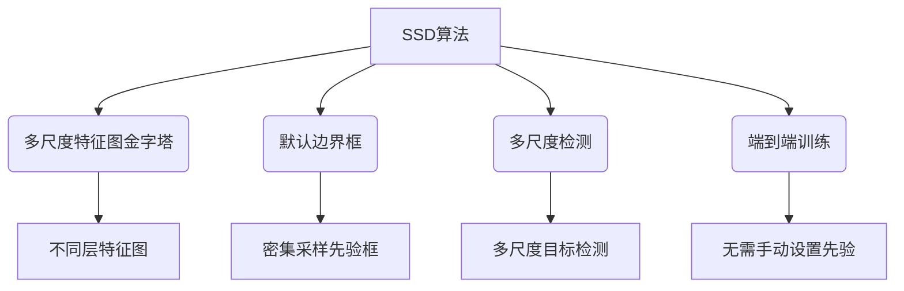

# SSD原理与代码实例讲解

## 1. 背景介绍

### 1.1 问题的由来

在计算机视觉领域中,对象检测是一项基础且重要的任务。传统的基于区域提议的目标检测算法如R-CNN系列算法,需要先生成候选区域,再对每个候选区域进行分类,存在着计算量大、速度慢的缺陷。为了解决这一问题,SSD(Single Shot MultiBox Detector)算法应运而生。

### 1.2 研究现状

SSD算法是由Wei Liu等人在2016年提出的,属于一种基于深度学习的单shot目标检测算法。与基于区域提议的算法不同,SSD算法不需要单独的区域提议网络,而是直接从密集采样的默认矩形框中回归目标边界框和类别,从而极大地提高了检测速度。

目前,SSD算法已被广泛应用于各种计算机视觉任务中,如目标跟踪、行人检测、车辆检测等,并在多个公开数据集上取得了优异的表现。

### 1.3 研究意义

SSD算法的提出解决了传统目标检测算法计算量大、速度慢的问题,使得实时目标检测在嵌入式设备和移动端等资源受限环境中成为可能。同时,SSD算法的高精度、高速度特性也使其在工业视觉、安防监控等领域有着广泛的应用前景。

### 1.4 本文结构

本文将全面介绍SSD算法的原理、实现细节和代码解析,内容包括:

1. 核心概念与联系
2. 核心算法原理及具体操作步骤
3. 数学模型和公式详细讲解与案例分析
4. 项目实践:代码实例和详细解释
5. 实际应用场景
6. 工具和资源推荐
7. 总结:未来发展趋势与挑战
8. 附录:常见问题与解答

## 2. 核心概念与联系

SSD算法的核心思想是利用端到端的神经网络直接从密集采样的默认矩形框中回归目标边界框和类别。其主要由以下几个核心概念组成:

1. **多尺度特征图金字塔(Feature Pyramid)**: 通过在不同网络层提取特征图,获得多尺度的特征表示,用于检测不同大小的目标。

2. **默认边界框(Default Boxes)**: 在特征图上密集采样一组默认边界框,作为目标检测的先验框。

3. **多尺度检测(Multi-Scale Predictions)**: 在不同尺度的特征图上进行目标检测,实现多尺度目标的有效检测。

4. **端到端训练(End-to-End Training)**: 整个网络可以端到端地进行训练,无需手动设置复杂的先验。

这些核心概念相互关联、环环相扣,共同构建了SSD算法的理论基础和实现框架。

## 3. 核心算法原理及具体操作步骤

### 3.1 算法原理概述

SSD算法的核心原理可以概括为以下几个步骤:

1. **特征提取**: 利用主干网络(如VGG、ResNet等)提取多尺度特征图金字塔。

2. **默认框生成**: 在每个特征图上密集采样一组默认边界框,作为目标检测的先验框。

3. **多尺度预测**: 对每个默认框进行目标分类和边界框回归,实现多尺度目标检测。

4. **非极大值抑制(NMS)**: 对检测结果进行非极大值抑制,去除重复的检测框。

### 3.2 算法步骤详解

1. **特征提取**

   SSD算法通常采用已经预训练好的主干网络(如VGG16、ResNet等)作为特征提取器。在不同层次的特征图上应用卷积层,生成多尺度的特征图金字塔,用于检测不同大小的目标。

2. **默认框生成**

   在每个特征图上,SSD算法会密集采样一组默认边界框,作为目标检测的先验框。这些默认框的尺寸和比例是预先设定的,通常采用不同的尺度和纵横比,以覆盖不同形状和大小的目标。

   默认框的生成过程如下:

   - 对于每个特征图像素点,设置一组默认框
   - 每个默认框有不同的尺度和纵横比
   - 默认框的中心位于该像素点
   - 默认框的宽高由特征图的步长决定

3. **多尺度预测**

   对于每个默认框,SSD算法会进行两个并行的预测:

   - 目标分类: 预测该默认框内是否包含目标,以及目标的类别。
   - 边界框回归: 预测该默认框需要调整的偏移量,以更精确地围绕目标。

   这两个预测由不同的卷积层完成,并在多个特征图上进行,实现对不同尺度目标的检测。

4. **非极大值抑制(NMS)**

   由于存在重叠的默认框,因此会产生多个检测结果指向同一目标。为了去除这些重复的检测框,SSD算法采用非极大值抑制(NMS)策略:

   - 根据每个检测框的置信度对所有检测框进行排序
   - 选取置信度最高的检测框,移除与之重叠程度较高的其他检测框
   - 重复上述过程,直到所有检测框都被处理

   通过NMS,可以得到最终的目标检测结果。

### 3.3 算法优缺点

**优点**:

- 端到端训练,无需手动设置复杂的先验
- 检测速度快,适合实时应用
- 通过多尺度特征图金字塔,能够有效检测不同大小的目标

**缺点**:

- 对小目标的检测效果相对较差
- 默认框设置对检测效果有一定影响
- 在密集场景下,检测精度可能会下降

### 3.4 算法应用领域

SSD算法凭借其高效、准确的特点,已被广泛应用于各种计算机视觉任务,如:

- 目标跟踪
- 行人检测
- 车辆检测
- 机器人视觉
- 无人机/自动驾驶
- 安防监控
- 机器视觉检测
- 增强现实(AR)等

## 4. 数学模型和公式及详细讲解与举例说明

### 4.1 数学模型构建

SSD算法的数学模型主要包括以下几个部分:

1. **默认框生成模型**

   默认框的生成可以通过以下公式描述:

   $$
   d_k^{cx} = (i + f_k^{cx}) / f_w \
   d_k^{cy} = (j + f_k^{cy}) / f_h \
   d_k^w = e^{f_k^w} \
   d_k^h = e^{f_k^h}
   $$

   其中:
   - $(i, j)$是特征图上的像素坐标
   - $(f_k^{cx}, f_k^{cy})$是默认框相对于像素坐标的偏移量
   - $(f_w, f_h)$是特征图的步长
   - $(f_k^w, f_k^h)$是默认框的宽高比例

2. **目标分类模型**

   对于每个默认框,SSD算法会预测该框内是否包含目标,以及目标的类别。这可以通过以下公式描述:

   $$
   p(c_i|O_k) = \frac{e^{t_i^k}}{\sum_{j}e^{t_j^k}}
   $$

   其中:
   - $c_i$表示第$i$个类别
   - $O_k$表示第$k$个默认框
   - $t_i^k$是对应于第$i$个类别和第$k$个默认框的分数

3. **边界框回归模型**

   对于每个默认框,SSD算法还需要预测该框需要调整的偏移量,以更精确地围绕目标。这可以通过以下公式描述:

   $$
   \begin{aligned}
   t_x &= (g_x - d_x) / d_w \
   t_y &= (g_y - d_y) / d_h \
   t_w &= \log(g_w / d_w) \
   t_h &= \log(g_h / d_h)
   \end{aligned}
   $$

   其中:
   - $(t_x, t_y, t_w, t_h)$是预测的边界框调整量
   - $(g_x, g_y, g_w, g_h)$是ground-truth边界框的坐标和宽高
   - $(d_x, d_y, d_w, d_h)$是默认框的坐标和宽高

通过上述数学模型,SSD算法可以有效地生成默认框、预测目标类别和调整边界框,从而实现准确的目标检测。

### 4.2 公式推导过程

1. **默认框生成公式推导**

   设特征图的宽高分别为$f_w$和$f_h$,像素坐标为$(i, j)$,默认框相对于像素坐标的偏移量为$(f_k^{cx}, f_k^{cy})$,默认框的宽高比例为$(f_k^w, f_k^h)$,则默认框的中心坐标$(d_k^{cx}, d_k^{cy})$和宽高$(d_k^w, d_k^h)$可以表示为:

   $$
   \begin{aligned}
   d_k^{cx} &= \frac{i + f_k^{cx}}{f_w} \
   d_k^{cy} &= \frac{j + f_k^{cy}}{f_h} \
   d_k^w &= f_w \cdot e^{f_k^w} \
   d_k^h &= f_h \cdot e^{f_k^h}
   \end{aligned}
   $$

   其中,中心坐标是将像素坐标和偏移量相加,再除以特征图的宽高;宽高是将比例参数做指数运算,再乘以特征图的步长。

2. **目标分类公式推导**

   SSD算法采用softmax函数对目标类别进行预测,即:

   $$
   p(c_i|O_k) = \frac{e^{t_i^k}}{\sum_{j}e^{t_j^k}}
   $$

   其中:
   - $c_i$表示第$i$个类别
   - $O_k$表示第$k$个默认框
   - $t_i^k$是对应于第$i$个类别和第$k$个默认框的分数

   这是softmax函数的标准形式,用于将分数转换为概率值,使得所有类别概率之和为1。

3. **边界框回归公式推导**

   SSD算法采用参数化的边界框表示,即通过预测一个调整量,将默认框调整为更精确的目标边界框。调整量的计算公式如下:

   $$
   \begin{aligned}
   t_x &= (g_x - d_x) / d_w \
   t_y &= (g_y - d_y) / d_h \
   t_w &= \log(g_w / d_w) \
   t_h &= \log(g_h / d_h)
   \end{aligned}
   $$

   其中:
   - $(t_x, t_y, t_w, t_h)$是预测的边界框调整量
   - $(g_x, g_y, g_w, g_h)$是ground-truth边界框的坐标和宽高
   - $(d_x, d_y, d_w, d_h)$是默认框的坐标和宽高

   这种参数化表示可以有效地捕获边界框的位置和形状变化,并通过回归的方式进行预测。

通过上述公式推导,我们可以更好地理解SSD算法中各个数学模型的构建过程和原理。

### 4.3 案例分析与讲解

为了更好地理解SSD算法的数学模型和公式,我们将通过一个具体的案例进行分析和讲解。

假设我们有一个$8\times8$的特征图,步长为4,需要生成默认框。我们设置3种不同的默认框尺度比例$(0.2, 0.5, 0.8)$,以及3种不同的纵横比$(1, 2, 0.5)$,那么总共会生成$3\times3=9$种不同形状和尺度的默认框。