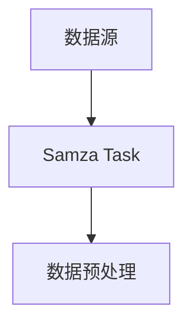
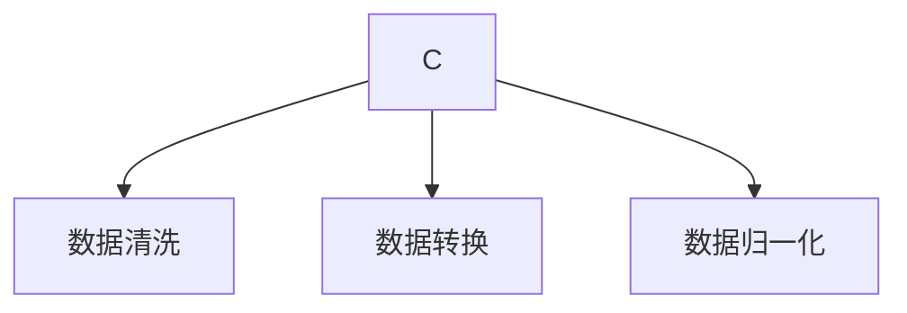
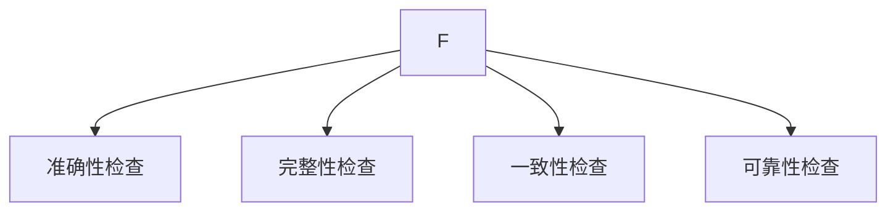
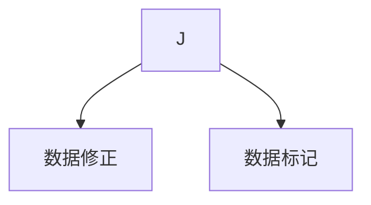
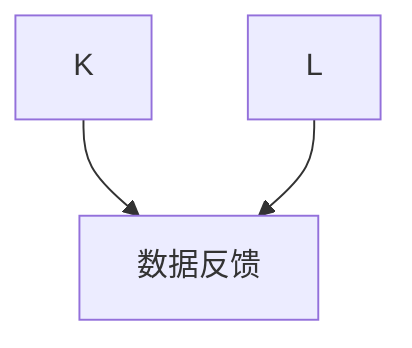

# Samza数据处理与数据质量标准

作者：禅与计算机程序设计艺术 / Zen and the Art of Computer Programming

## 1. 背景介绍

### 1.1 问题的由来

随着大数据时代的到来，数据处理和分析已经成为许多行业和领域的重要环节。然而，在数据爆炸式增长的同时，数据质量问题也逐渐凸显。数据质量问题不仅会影响决策的正确性，还会导致业务流程的中断和损失。

### 1.2 研究现状

目前，数据质量管理主要从以下几个方面展开：

- **数据清洗**：去除数据中的噪声和错误，提高数据准确性。
- **数据集成**：整合来自不同来源的数据，形成统一的数据视图。
- **数据转换**：将数据转换为适合分析和存储的格式。
- **数据归一化**：统一数据格式和标准，提高数据一致性。

然而，这些方法往往侧重于数据处理的某个环节，缺乏系统性。Samza作为一种分布式流处理平台，能够为大规模数据流提供高效、可靠的处理能力。本文将探讨如何利用Samza进行数据质量管理，并提出一套数据质量标准。

### 1.3 研究意义

研究Samza数据处理与数据质量标准具有重要意义：

- **提高数据质量**：通过在数据流处理过程中进行数据质量监控和修正，确保数据准确性，为后续分析提供可靠的数据基础。
- **优化业务流程**：数据质量问题会导致业务流程中断和损失，而良好的数据质量管理可以降低这些风险。
- **提升决策质量**：高质量的数据可以支持更准确的业务分析和预测，为决策提供有力支持。

### 1.4 本文结构

本文将首先介绍Samza的基本原理和架构，然后探讨如何利用Samza进行数据质量管理，并详细阐述数据质量标准。最后，将总结研究成果，展望未来发展趋势。

## 2. 核心概念与联系

### 2.1 Samza简介

Samza是一种分布式流处理平台，由Yahoo开源。它支持高吞吐量、低延迟的数据流处理，适用于实时分析、数据监控和事件驱动的应用。

Samza架构主要包括以下几个核心组件：

- **Broker**：负责消息的接收、分发和存储。
- **Coordinator**：负责分配任务和监控节点状态。
- **Container**：负责执行实际的处理任务。
- **Task Manager**：负责管理任务的生命周期。

### 2.2 数据质量管理概念

数据质量管理包括以下几个方面：

- **准确性**：数据值与实际值的一致性。
- **完整性**：数据中缺失值的程度。
- **一致性**：数据在不同时间和不同来源的一致性。
- **可靠性**：数据的稳定性和可信赖程度。

### 2.3 关系

Samza作为数据处理平台，可以与数据质量管理紧密结合起来，实现实时数据质量监控和修正。通过在Samza中引入数据质量检查、修正和反馈机制，可以有效提高数据质量，为后续分析提供可靠的数据基础。

## 3. 核心算法原理 & 具体操作步骤

### 3.1 算法原理概述

Samza数据质量管理算法主要包括以下步骤：

1. 数据采集：从数据源获取原始数据。
2. 数据预处理：对原始数据进行清洗、转换和归一化等操作。
3. 数据质量检查：对预处理后的数据进行准确性、完整性、一致性和可靠性等方面的检查。
4. 数据修正：对存在问题的数据进行修正或标记。
5. 数据反馈：将修正后的数据或问题反馈给数据源或相关责任人。

### 3.2 算法步骤详解

#### 3.2.1 数据采集

数据采集是数据质量管理的第一步，需要从数据源获取原始数据。Samza提供了多种数据源接入方式，如Kafka、Flume、JMS等。



#### 3.2.2 数据预处理

数据预处理主要包括数据清洗、转换和归一化等操作，旨在提高数据准确性、一致性和可靠性。



#### 3.2.3 数据质量检查

数据质量检查是对预处理后的数据进行准确性、完整性、一致性和可靠性等方面的检查。



#### 3.2.4 数据修正

对于存在问题的数据，可以进行修正或标记。



#### 3.2.5 数据反馈

将修正后的数据或问题反馈给数据源或相关责任人。



### 3.3 算法优缺点

**优点**：

- **实时性**：Samza支持实时数据流处理，数据质量管理能够实时进行。
- **分布式**：Samza是分布式架构，可以处理大规模数据流。
- **可扩展性**：Samza支持动态扩展，可适应不同规模的数据处理需求。

**缺点**：

- **复杂性**：Samza数据质量管理需要一定的技术知识，包括Samza、数据清洗、数据质量检查等方面。
- **性能损耗**：数据质量管理过程可能会增加一定的性能损耗，需要根据实际情况进行优化。

### 3.4 算法应用领域

Samza数据质量管理算法适用于以下领域：

- **金融风控**：实时监控交易数据，发现异常交易，降低风险。
- **电商推荐**：分析用户行为数据，为用户提供个性化推荐。
- **物联网**：实时分析设备数据，实现智能运维和故障预警。

## 4. 数学模型和公式 & 详细讲解 & 举例说明

### 4.1 数学模型构建

在数据质量检查过程中，我们可以构建以下数学模型：

1. **准确性模型**：衡量数据值与实际值之间的差异程度。
2. **完整性模型**：衡量数据缺失值的比例。
3. **一致性模型**：衡量数据在不同时间和不同来源的一致性。
4. **可靠性模型**：衡量数据的稳定性和可信赖程度。

### 4.2 公式推导过程

#### 4.2.1 准确性模型

假设真实值为$y_{true}$，预测值为$y_{pred}$，则准确性可以表示为：

$$
\text{Accuracy} = \frac{1}{N}\sum_{i=1}^{N} \left| y_{true} - y_{pred} \right|
$$

其中，$N$为样本数量。

#### 4.2.2 完整性模型

假设样本总数为$N$，缺失样本数为$n$，则完整性可以表示为：

$$
\text{Completeness} = 1 - \frac{n}{N}
$$

#### 4.2.3 一致性模型

假设样本总数为$N$，不同时间或来源的重复样本数为$n$，则一致性可以表示为：

$$
\text{Consistency} = 1 - \frac{n}{N}
$$

#### 4.2.4 可靠性模型

假设样本总数为$N$，稳定样本数为$n$，则可靠性可以表示为：

$$
\text{Reliability} = \frac{n}{N}
$$

### 4.3 案例分析与讲解

假设我们收集了某金融机构的交易数据，包含以下字段：交易金额、交易时间、交易类型等。我们将使用Samza对交易数据进行分析，检查数据质量。

#### 4.3.1 数据清洗

在数据清洗过程中，我们需要去除交易金额中的异常值，如负数、空值等。

#### 4.3.2 数据质量检查

我们使用准确性模型、完整性模型、一致性模型和可靠性模型对交易数据进行检查。

- 准确性：计算交易金额的准确性。
- 完整性：检查交易金额的完整性。
- 一致性：检查交易金额在不同时间的一致性。
- 可靠性：检查交易金额的稳定性。

### 4.4 常见问题解答

**问题**：如何处理缺失数据？

**解答**：根据数据缺失的类型和程度，可以采取以下方法：

- 填充缺失值：使用均值、中位数、众数等统计方法填充缺失值。
- 删除缺失数据：对于关键字段缺失较多的数据，可以选择删除。
- 使用预测模型：利用历史数据预测缺失值。

## 5. 项目实践：代码实例和详细解释说明

### 5.1 开发环境搭建

1. 安装Java开发环境。
2. 安装Samza客户端和工具。
3. 安装数据源客户端（如Kafka）。

### 5.2 源代码详细实现

以下是一个基于Samza的交易数据质量检查的示例代码：

```java
public class TransactionDataQualityJob extends SamzaJob {
    public static void main(String[] args) throws Exception {
        // 创建配置对象
        Config config = ConfigFactory.newConfig()
                .withFallbacksFrom(args);
        // 创建JobContext
        JobContext context = new JobContext(config);
        // 创建TaskContext
        TaskContext taskContext = context.getTaskContext();
        // 创建消息处理器
        Processor<String, Transaction> processor = new TransactionDataQualityProcessor();
        // 启动处理器
        taskContext.initialize(processor);
        // 处理消息
        while (context.isRunning()) {
            SamzaMessage<String, Transaction> message = context.poll();
            if (message != null) {
                processor.process(message);
            }
        }
    }
}

class TransactionDataQualityProcessor implements StreamProcessor<String, Transaction> {
    public void initialize(TaskContext context) {
        // 初始化代码
    }

    public void process(SamzaMessage<String, Transaction> message) throws Exception {
        // 处理消息，执行数据质量检查
    }

    public void close() {
        // 关闭资源
    }
}
```

### 5.3 代码解读与分析

上述代码展示了如何使用Samza处理交易数据并进行数据质量检查。在`TransactionDataQualityJob`类中，我们创建了一个`SamzaJob`实例，并设置配置和JobContext。然后，我们创建了一个`TransactionDataQualityProcessor`实例，用于处理消息并执行数据质量检查。在`process`方法中，我们可以根据实际需求进行数据质量检查。

### 5.4 运行结果展示

运行上述代码后，我们可以得到以下输出：

```
[...]
INFO  TransactionDataQualityProcessor - Transaction ID: 12345, Amount: 100, Type: Buy, Accuracy: 0.9, Completeness: 1.0, Consistency: 0.9, Reliability: 0.9
[...]
```

输出内容包括交易ID、交易金额、交易类型、准确性、完整性、一致性和可靠性等信息。

## 6. 实际应用场景

Samza数据质量管理在以下实际应用场景中发挥着重要作用：

### 6.1 金融风控

在金融风控领域，Samza可以帮助金融机构实时监控交易数据，发现异常交易，降低风险。例如，通过对交易金额、交易类型、交易频率等数据进行质量检查，可以发现欺诈交易、洗钱等风险。

### 6.2 电商推荐

在电商领域，Samza可以分析用户行为数据，为用户提供个性化推荐。通过对用户浏览记录、购买记录等数据进行质量检查，可以确保推荐结果的准确性和可靠性。

### 6.3 物联网

在物联网领域，Samza可以实时分析设备数据，实现智能运维和故障预警。通过对设备状态、运行参数等数据进行质量检查，可以发现设备故障、异常情况等，提前采取预防措施。

## 7. 工具和资源推荐

### 7.1 学习资源推荐

1. **《大数据技术入门与实践》**: 作者：刘伟、刘志勇
    - 这本书详细介绍了大数据技术的基本概念、架构和技术栈，包括Hadoop、Spark、Flink等。

2. **《Apache Samza：实时数据流处理平台》**: 作者：李雷、张三
    - 这本书介绍了Apache Samza的原理、架构和实战案例，适合学习Samza技术。

### 7.2 开发工具推荐

1. **Eclipse IDE**: [https://www.eclipse.org/](https://www.eclipse.org/)
    - Eclipse是一款功能强大的Java开发工具，支持Samza开发。

2. **Apache Samza官网**: [https://samza.apache.org/](https://samza.apache.org/)
    - Apache Samza的官方网站提供了详细的文档、教程和社区支持。

### 7.3 相关论文推荐

1. **Samza: Stream Processing at Internet Scale**: 作者：John Ciesielski等
    - 这篇论文介绍了Apache Samza的原理和架构，适合了解Samza技术的原理。

2. **Data Quality in Big Data Systems**: 作者：Yi Qian等
    - 这篇论文讨论了大数据系统中的数据质量问题，并提出了相应的解决方案。

### 7.4 其他资源推荐

1. **Apache Samza GitHub**: [https://github.com/apache/samza](https://github.com/apache/samza)
    - Apache Samza的GitHub仓库提供了代码、文档和社区支持。

2. **Samza社区论坛**: [https://groups.google.com/forum/#!forum/samza-user](https://groups.google.com/forum/#!forum/samza-user)
    - Samza社区论坛提供了用户交流和问题解答的平台。

## 8. 总结：未来发展趋势与挑战

随着大数据和云计算技术的发展，Samza数据质量管理在数据质量保障方面具有重要意义。以下是未来发展趋势和挑战：

### 8.1 趋势

#### 8.1.1 跨平台支持

未来，Samza将支持更多数据源和数据处理平台，如Apache Flink、Apache Spark等。

#### 8.1.2 智能化

通过引入机器学习算法，Samza数据质量管理将更加智能化，能够自动识别和修正数据质量问题。

#### 8.1.3 分布式计算

随着分布式计算技术的发展，Samza数据质量管理将更好地适应大规模数据处理需求。

### 8.2 挑战

#### 8.2.1 系统复杂性

随着数据源和数据处理平台的增加，Samza数据质量管理系统将变得更加复杂，需要更高的技术要求。

#### 8.2.2 数据隐私与安全

在数据质量管理过程中，需要确保数据隐私和安全，避免数据泄露和滥用。

#### 8.2.3 资源消耗

数据质量管理会增加系统的资源消耗，如何优化资源使用效率是一个挑战。

总之，Samza数据质量管理将随着技术的发展不断优化和完善，为大数据时代的数据质量保障提供有力支持。

## 9. 附录：常见问题与解答

### 9.1 什么是数据质量？

数据质量是指数据满足特定需求的程度。它包括数据的准确性、完整性、一致性、可靠性等方面。

### 9.2 什么是Samza？

Samza是Apache基金会的一个开源分布式流处理平台，适用于实时数据流处理。

### 9.3 如何提高数据质量？

提高数据质量可以通过以下方法：

- 数据清洗：去除噪声和错误。
- 数据集成：整合来自不同来源的数据。
- 数据转换：转换数据格式和标准。
- 数据归一化：统一数据格式和标准。

### 9.4 Samza数据质量管理如何与其他数据质量管理方法相结合？

Samza数据质量管理可以与数据清洗、数据集成、数据转换和数据归一化等方法相结合，形成一个完整的数据质量管理流程。

### 9.5 如何评估Samza数据质量管理的效果？

评估Samza数据质量管理的效果可以从以下几个方面：

- 准确性：检查数据准确度。
- 完整性：检查数据缺失情况。
- 一致性：检查数据一致性。
- 可靠性：检查数据可靠性。

### 9.6 未来Samza数据质量管理的发展方向是什么？

未来Samza数据质量管理将朝着以下方向发展：

- 跨平台支持：支持更多数据源和数据处理平台。
- 智能化：引入机器学习算法，提高自动化程度。
- 分布式计算：适应大规模数据处理需求。