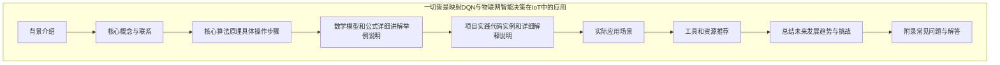
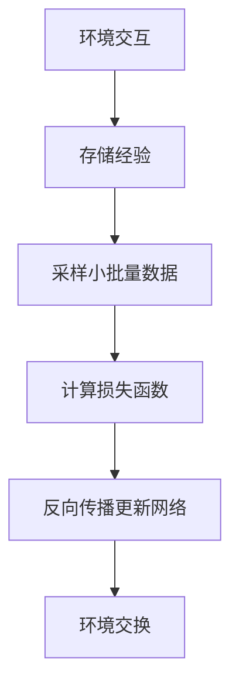

# 一切皆是映射：DQN与物联网：智能决策在IoT中的应用

## 1. 背景介绍

### 1.1 问题的由来

在当今快速发展的物联网(IoT)时代，海量的设备和传感器被广泛部署于各个领域,产生了大规模的数据流。如何高效地管理和控制这些设备,利用这些数据做出明智的决策,已经成为一个亟待解决的挑战。传统的基于规则的决策系统往往过于僵化,难以适应复杂多变的物联网环境。因此,我们需要一种更加智能、灵活的决策方式,以充分利用物联网大数据,提高系统的自主性和适应性。

### 1.2 研究现状

近年来,强化学习(Reinforcement Learning)作为一种有前景的机器学习范式,在智能决策领域引起了广泛关注。其中,深度Q网络(Deep Q-Network, DQN)作为强化学习的一种重要算法,已经在多个领域取得了卓越的成绩,如游戏AI、机器人控制等。DQN能够通过与环境的互动,学习一个最优的行为策略,从而做出明智的决策。

然而,将DQN应用于物联网决策场景还面临着诸多挑战:

1. **高维状态空间**:物联网系统涉及大量的设备和传感器,导致状态空间维度极高,给DQN的学习带来了巨大困难。
2. **连续动作空间**:许多物联网控制任务需要连续的动作空间(如调节温度),而DQN原本是针对离散动作空间设计的。
3. **在线决策**:物联网系统需要实时做出决策,而DQN的训练过程通常是离线的,两者之间存在着鸿沟。
4. **异构环境**:不同的物联网应用场景可能具有完全不同的状态、动作空间,使得需要为每个场景重新训练DQN模型。

### 1.3 研究意义

将DQN应用于物联网智能决策,可以带来诸多潜在的好处:

1. **自主决策**:通过学习最优策略,DQN可以自主做出明智的决策,减轻人工干预的需求。
2. **高效利用数据**:DQN能够从物联网大数据中挖掘出有价值的模式,做出基于数据的决策。
3. **适应环境变化**:DQN具有一定的泛化能力,能够适应物联网环境的动态变化。
4. **节省资源消耗**:合理的决策有助于优化资源利用,降低运营成本。

因此,研究DQN在物联网智能决策中的应用,对于构建智能化、自治化的物联网系统具有重要意义。

### 1.4 本文结构

本文将首先介绍DQN的核心概念和原理,然后重点探讨DQN在物联网智能决策中的应用,包括面临的挑战及相应的解决方案。此外,还将给出实际的代码实现示例,并讨论DQN在物联网领域的未来发展趋势和挑战。文章结构如下:



## 2. 核心概念与联系

在深入探讨DQN在物联网智能决策中的应用之前,我们先来回顾一下DQN的核心概念和原理。DQN是一种基于深度神经网络的强化学习算法,它试图学习一个最优的行为策略(Policy),即在给定状态下选择最佳的动作,以最大化未来的累积奖励。

DQN的核心思想是使用一个深度神经网络来近似最优的动作价值函数(Action-Value Function) $Q^*(s,a)$,该函数表示在状态 $s$ 下选择动作 $a$ 后能获得的最大期望奖励。通过与环境的互动,DQN不断更新神经网络的参数,使得网络输出的 $Q$ 值越来越接近真实的 $Q^*(s,a)$。

在传统的Q-Learning算法中,我们需要维护一个巨大的Q表来存储每个状态-动作对的Q值。而DQN通过使用神经网络来拟合Q函数,可以有效地解决维数灾难(Curse of Dimensionality)的问题,从而能够处理高维的状态和动作空间。

DQN算法的核心流程如下所示:



其中,关键步骤包括:

1. **与环境交互**:DQN的智能体在当前状态下选择一个动作,执行该动作并观察环境的反馈(下一状态和奖励)。
2. **存储经验**:将这个(状态,动作,奖励,下一状态)的四元组存储到经验回放池(Experience Replay Buffer)中。
3. **采样小批量数据**:从经验回放池中随机采样一个小批量的经验数据。
4. **计算损失函数**:使用深度神经网络预测当前状态下各个动作的Q值,并根据贝尔曼方程(Bellman Equation)计算目标Q值,二者的差即为损失函数。
5. **反向传播更新网络**:通过反向传播算法,minimizeQQ网络的损失函数,从而使网络输出的Q值逐渐逼近真实的Q*值。

通过上述流程的不断迭代,DQN最终能够学习到一个近似最优的行为策略。值得注意的是,DQN引入了两个关键技术:经验回放(Experience Replay)和目标网络(Target Network),以提高算法的稳定性和收敛性。

## 3. 核心算法原理 & 具体操作步骤

### 3.1 算法原理概述

DQN算法的核心原理可以概括为以下几个方面:

1. **价值函数逼近**:使用深度神经网络来逼近最优的动作价值函数 $Q^*(s,a)$,从而解决高维状态和动作空间的问题。
2. **Q-Learning**:基于Q-Learning的思想,通过与环境交互来更新Q网络的参数,使其输出的Q值逐渐逼近真实的Q*值。
3. **经验回放**:将智能体与环境交互时获得的经验存储在经验回放池中,并从中随机采样小批量数据进行训练,以打破相关性和提高数据利用效率。
4. **目标网络**:引入一个目标网络(Target Network)来计算目标Q值,其参数是主Q网络(主网络)的拷贝,但是更新频率较低,以提高算法的稳定性。

DQN算法的伪代码如下所示:

```python
初始化主Q网络和目标Q网络,使用相同的参数
初始化经验回放池
for episode in range(max_episodes):
    初始化环境状态s
    while not is_terminal(s):
        使用ϵ-贪婪策略从主Q网络选择动作a
        执行动作a,获得下一状态s'、奖励r和是否终止的标志done
        将(s,a,r,s',done)存入经验回放池
        从经验回放池中采样一个小批量的数据
        计算目标Q值y = r + γ * max_a'(目标Q网络(s',a'))
        计算损失函数Loss = (y - 主Q网络(s,a))^2
        通过反向传播算法更新主Q网络的参数
        每隔一定步数将主Q网络的参数赋值给目标Q网络
        s = s'
    end while
end for
```

上述伪代码描述了DQN算法的主要流程,包括与环境交互、存储经验、采样数据、计算目标Q值、更新主Q网络以及同步目标Q网络等关键步骤。

### 3.2 算法步骤详解

下面我们对DQN算法的具体步骤进行详细解释:

1. **初始化主Q网络和目标Q网络**

   我们使用两个相同的深度神经网络,一个作为主Q网络(用于预测Q值和更新参数),另一个作为目标Q网络(用于计算目标Q值)。初始时,两个网络的参数是完全相同的。

2. **初始化经验回放池**

   经验回放池是一个固定大小的缓冲区,用于存储智能体与环境交互时获得的经验(状态、动作、奖励、下一状态、是否终止)。

3. **与环境交互并存储经验**

   在每一个时间步,智能体根据当前状态 $s$ 和一定的探索策略(如ϵ-贪婪策略)从主Q网络中选择一个动作 $a$。执行该动作后,环境会转移到下一状态 $s'$,并返回一个即时奖励 $r$ 和是否终止的标志 $done$。然后将这个四元组经验 $(s,a,r,s',done)$ 存储到经验回放池中。

4. **从经验回放池中采样小批量数据**

   为了打破经验数据之间的相关性,并提高数据利用效率,我们从经验回放池中随机采样一个小批量的经验数据,用于训练主Q网络。

5. **计算目标Q值**

   对于采样的每个经验 $(s,a,r,s',done)$,我们需要计算其目标Q值 $y$。如果是终止状态,则 $y = r$;否则,根据贝尔曼方程:

   $$y = r + \gamma \max_{a'} Q(s', a'; \theta^-)$$

   其中, $\gamma$ 是折现因子, $Q(s', a'; \theta^-)$ 是目标Q网络在状态 $s'$ 下对所有动作 $a'$ 的Q值预测,我们取其最大值作为下一状态的最大期望奖励。

6. **计算损失函数并更新主Q网络**

   使用主Q网络在状态 $s$ 下对动作 $a$ 的Q值预测 $Q(s,a;\theta)$,其与目标Q值 $y$ 之间的均方差即为损失函数:

   $$\text{Loss} = \mathbb{E}_{(s,a,r,s')\sim D}\left[(y - Q(s,a;\theta))^2\right]$$

   其中, $D$ 表示从经验回放池中采样的小批量数据。我们通过反向传播算法,最小化上述损失函数,从而更新主Q网络的参数 $\theta$,使其输出的Q值逐渐逼近真实的 $Q^*$ 值。

7. **同步目标Q网络**

   为了提高算法的稳定性,我们每隔一定步数(如1000步)就将主Q网络的参数赋值给目标Q网络,即:

   $$\theta^- \leftarrow \theta$$

   这样可以确保目标Q值的计算是基于一个相对稳定的Q网络,而不会受到主Q网络频繁更新的影响。

8. **重复上述过程**

   重复执行步骤3~7,直到达到预设的最大训练回合数或者满足其他终止条件。在训练过程中,我们可以采用探索-利用权衡策略(如ϵ-贪婪策略)来平衡探索新的状态动作对和利用已学习的知识。

通过上述步骤的不断迭代,DQN算法最终能够学习到一个近似最优的行为策略,即在给定状态下选择能够最大化未来累积奖励的动作。

### 3.3 算法优缺点

DQN算法相比于传统的Q-Learning算法有以下优点:

1. **处理高维状态和动作空间**:通过使用深度神经网络来拟合Q函数,DQN能够有效解决维数灾难的问题,处理高维的状态和动作空间。
2. **数据利用效率高**:引入经验回放机制,可以充分利用过去的经验数据,提高