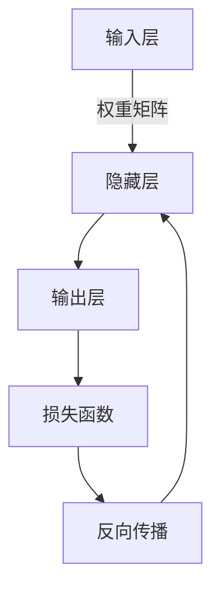
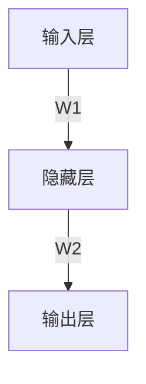

# 大语言模型应用指南：什么是神经网络

## 1. 背景介绍

### 1.1 问题的由来

在过去的几十年里，人工智能领域取得了长足的进步,尤其是在机器学习和深度学习方面。神经网络作为深度学习的核心模型,已经广泛应用于计算机视觉、自然语言处理、语音识别等各个领域,展现出了令人惊叹的能力。然而,对于神经网络的工作原理,很多人仍然存在一些模糊的认识。

### 1.2 研究现状

目前,神经网络已经成为深度学习的主流模型,并在各个领域取得了卓越的成绩。但是,由于神经网络的复杂性和黑箱性质,很多人对其内部原理缺乏深入的理解。虽然有一些优秀的教材和资源介绍了神经网络的基本概念,但是对于实际应用和高级主题的讨论还比较欠缺。

### 1.3 研究意义

深入理解神经网络的原理对于更好地应用和发展这一技术至关重要。只有真正掌握了神经网络的内在机制,我们才能更好地设计和优化模型,解决实际问题。同时,对神经网络原理的透彻理解也有助于我们探索新的研究方向,推动人工智能领域的进一步发展。

### 1.4 本文结构

本文将从以下几个方面全面介绍神经网络:

1. 核心概念与联系
2. 核心算法原理与具体操作步骤
3. 数学模型和公式详细讲解与案例分析
4. 项目实践:代码实例和详细解释说明
5. 实际应用场景
6. 工具和资源推荐
7. 总结:未来发展趋势与挑战
8. 附录:常见问题与解答

## 2. 核心概念与联系

神经网络是一种受生物神经系统启发而设计的计算模型,它由大量互连的节点(神经元)组成。每个神经元接收来自其他神经元的输入,并根据一定的规则(激活函数)产生输出,传递给下一层神经元。通过这种层层传递的方式,神经网络可以学习到输入和输出之间的映射关系。

上图展示了一个典型的前馈神经网络结构。输入层接收原始数据,隐藏层对数据进行非线性转换,输出层产生最终的预测结果。在训练过程中,通过反向传播算法调整神经网络中的权重参数,使得预测结果与真实值之间的差异(损失函数)最小化。

神经网络的核心概念包括:

- 神经元(Node)
- 权重(Weight)
- 激活函数(Activation Function)
- 损失函数(Loss Function)
- 前向传播(Forward Propagation)
- 反向传播(Backward Propagation)
- 优化算法(Optimization Algorithm)

这些概念相互关联,共同构成了神经网络的基本框架。掌握这些核心概念对于理解神经网络的工作原理至关重要。

## 3. 核心算法原理与具体操作步骤

### 3.1 算法原理概述

神经网络的核心算法是反向传播算法(Back Propagation),它是一种有监督的学习算法,用于训练多层前馈神经网络。反向传播算法的基本思想是:通过计算输出层与期望输出之间的误差,并沿着神经网络的反方向传播这个误差,从而调整每个神经元的权重和偏置,使得整个网络的误差最小化。

该算法主要包括两个阶段:前向传播(Forward Propagation)和反向传播(Backward Propagation)。

1. 前向传播阶段:输入数据从输入层开始,经过隐藏层的计算,最终到达输出层,得到网络的预测输出。
2. 反向传播阶段:计算输出层与期望输出之间的误差,并沿着网络的反方向传播,计算每个神经元的误差梯度,根据优化算法(如梯度下降)更新每个神经元的权重和偏置。

通过不断迭代这两个阶段,神经网络可以逐步减小预测误差,最终达到期望的精度。

### 3.2 算法步骤详解

反向传播算法的具体步骤如下:

1. 初始化网络权重和偏置,通常使用小的随机值。
2. 前向传播:
   - 输入层接收输入数据 $X$。
   - 隐藏层计算:$H = \sigma(W_hX + b_h)$,其中 $\sigma$ 是激活函数,如 ReLU、Sigmoid 等。
   - 输出层计算:$\hat{Y} = \sigma(W_oH + b_o)$,得到网络的预测输出 $\hat{Y}$。
3. 计算损失:$L = \text{Loss}(Y, \hat{Y})$,其中 $Y$ 是期望输出,Loss 是损失函数,如均方误差、交叉熵等。
4. 反向传播:
   - 计算输出层误差梯度:$\delta_o = \frac{\partial L}{\partial \hat{Y}} \odot \sigma'(W_oH + b_o)$。
   - 计算隐藏层误差梯度:$\delta_h = (W_o^T\delta_o) \odot \sigma'(W_hX + b_h)$。
   - 更新权重和偏置:
     $$
     W_o \leftarrow W_o - \eta \frac{\partial L}{\partial W_o} = W_o - \eta \delta_o H^T \
     b_o \leftarrow b_o - \eta \frac{\partial L}{\partial b_o} = b_o - \eta \delta_o \
     W_h \leftarrow W_h - \eta \frac{\partial L}{\partial W_h} = W_h - \eta \delta_h X^T \
     b_h \leftarrow b_h - \eta \frac{\partial L}{\partial b_h} = b_h - \eta \delta_h
     $$
     其中 $\eta$ 是学习率,决定了权重更新的步长。
5. 重复步骤 2-4,直到网络收敛或达到最大迭代次数。

### 3.3 算法优缺点

**优点:**

- 能够有效地学习复杂的非线性映射关系。
- 具有很强的泛化能力,可以对未见过的数据进行预测。
- 可以处理高维度的输入数据,如图像、语音等。
- 通过增加隐藏层和神经元数量,可以提高网络的表达能力。

**缺点:**

- 训练过程计算量大,对硬件要求较高。
- 存在过拟合问题,需要采取正则化等方法进行优化。
- 网络结构和超参数的选择需要大量的经验和调试。
- 神经网络是一个黑箱模型,缺乏可解释性。

### 3.4 算法应用领域

反向传播算法及其变体广泛应用于以下领域:

- 计算机视觉:图像分类、目标检测、语义分割等。
- 自然语言处理:机器翻译、文本生成、情感分析等。
- 语音识别:语音转文本、语音合成等。
- 推荐系统:个性化推荐、广告投放等。
- 金融:风险评估、欺诈检测等。
- 医疗:病理诊断、药物设计等。

## 4. 数学模型和公式详细讲解与举例说明

### 4.1 数学模型构建

神经网络的数学模型可以用一系列函数组合来表示。假设我们有一个具有 $L$ 层的前馈神经网络,其中第 $l$ 层有 $n_l$ 个神经元,输入层为 $l=0$,输出层为 $l=L$。

对于第 $l$ 层,我们定义:

- $a^{(l)}$:第 $l$ 层的激活值向量,大小为 $n_l \times 1$。
- $W^{(l)}$:第 $l$ 层的权重矩阵,大小为 $n_l \times n_{l-1}$。
- $b^{(l)}$:第 $l$ 层的偏置向量,大小为 $n_l \times 1$。
- $\sigma^{(l)}$:第 $l$ 层的激活函数。

则第 $l$ 层的前向传播可以表示为:

$$a^{(l)} = \sigma^{(l)}(W^{(l)}a^{(l-1)} + b^{(l)})$$

其中,对于输入层 $l=0$,我们有 $a^{(0)} = x$,即输入数据。

对于整个神经网络,我们可以将所有层的计算组合起来,得到最终的输出:

$$\hat{y} = a^{(L)} = \sigma^{(L)}(W^{(L)}\sigma^{(L-1)}(W^{(L-1)}\cdots\sigma^{(1)}(W^{(1)}x + b^{(1)}) + \cdots + b^{(L-1)}) + b^{(L)})$$

在训练过程中,我们需要最小化一个损失函数 $J(W, b)$,其中 $W$ 和 $b$ 分别表示所有层的权重和偏置参数。通过反向传播算法,我们可以计算出损失函数相对于每个参数的梯度,并使用优化算法(如梯度下降)不断更新参数值,直到损失函数达到最小。

### 4.2 公式推导过程

反向传播算法的核心是计算损失函数相对于每个参数的梯度。我们以单层神经网络为例,推导梯度的计算过程。

假设我们有一个单层神经网络,输入为 $x$,输出为 $\hat{y}$,真实标签为 $y$,损失函数为均方误差:

$$J(W, b) = \frac{1}{2}(\hat{y} - y)^2$$

我们需要计算 $\frac{\partial J}{\partial W}$ 和 $\frac{\partial J}{\partial b}$。

首先,根据链式法则,我们有:

$$
\frac{\partial J}{\partial W} = \frac{\partial J}{\partial \hat{y}} \cdot \frac{\partial \hat{y}}{\partial W} \
\frac{\partial J}{\partial b} = \frac{\partial J}{\partial \hat{y}} \cdot \frac{\partial \hat{y}}{\partial b}
$$

其中,

$$
\frac{\partial J}{\partial \hat{y}} = \hat{y} - y
$$

对于 $\frac{\partial \hat{y}}{\partial W}$ 和 $\frac{\partial \hat{y}}{\partial b}$,我们需要根据网络的结构进行计算。假设我们使用 sigmoid 激活函数,则:

$$
\hat{y} = \sigma(Wx + b) \
\frac{\partial \hat{y}}{\partial W} = \sigma'(Wx + b) \cdot x^T \
\frac{\partial \hat{y}}{\partial b} = \sigma'(Wx + b)
$$

其中,

$$\sigma'(z) = \sigma(z)(1 - \sigma(z))$$

将上述公式代入,我们可以得到:

$$
\frac{\partial J}{\partial W} = (\hat{y} - y) \cdot \sigma'(Wx + b) \cdot x^T \
\frac{\partial J}{\partial b} = (\hat{y} - y) \cdot \sigma'(Wx + b)
$$

这就是单层神经网络中梯度的计算过程。对于多层神经网络,我们需要使用反向传播算法,逐层计算每个参数的梯度。

### 4.3 案例分析与讲解

为了更好地理解神经网络的工作原理,我们来分析一个简单的二分类问题。假设我们有一个数据集,包含两个特征 $x_1$ 和 $x_2$,以及对应的二值标签 $y \in \{0, 1\}$。我们的目标是训练一个神经网络模型,对新的数据点进行分类预测。

我们构建一个单隐藏层的神经网络,其结构如下:

- 输入层有 2 个神经元,对应两个特征 $x_1$ 和 $x_2$。
- 隐藏层有 3 个神经元,使用 ReLU 激活函数。
- 输出层有 1 个神经元,使用 Sigmoid 激活函数,输出值介于 0 到 1 之间,作为二分类的概率值。

我们使用交叉熵作为损失函数:

$$J