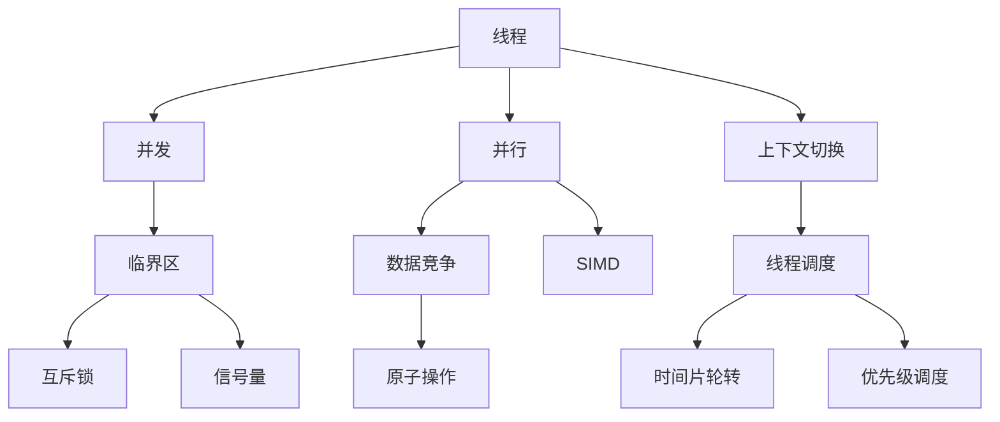
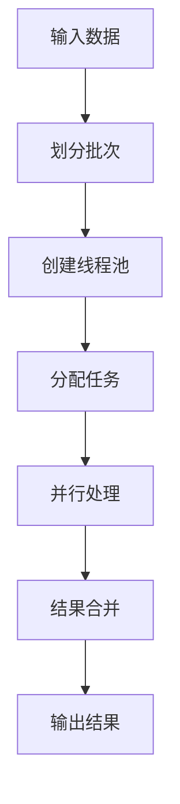
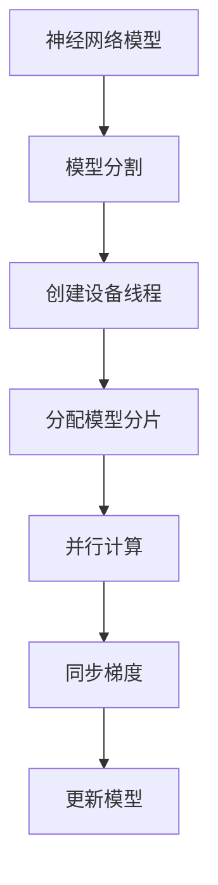
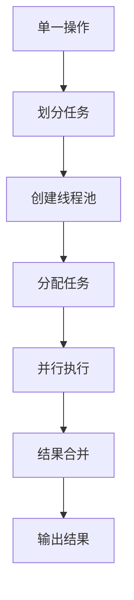
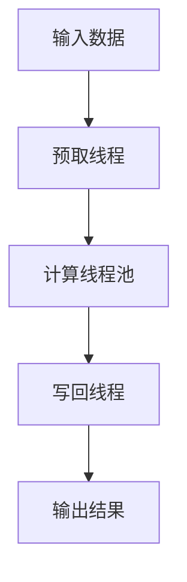

以下是根据您提供的要求和约束条件，撰写的技术博客文章正文部分：

# 大语言模型应用指南：线程

## 1. 背景介绍

### 1.1 问题的由来

随着深度学习和大型语言模型的兴起，自然语言处理(NLP)技术取得了长足进步。然而,训练和推理这些庞大的神经网络模型需要大量计算资源,这对于单机系统来说是一个巨大挑战。为了充分利用现代硬件的并行计算能力,有效管理和调度计算资源变得至关重要。线程作为一种轻量级的并发编程机制,在这一领域扮演着关键角色。

### 1.2 研究现状

目前,大多数深度学习框架(如TensorFlow、PyTorch)都提供了线程支持,以利用多核CPU和GPU的计算能力。然而,由于线程编程的复杂性和潜在的并发问题(如死锁、竞态条件等),开发人员在实现高效、可靠的线程化程序时仍面临诸多挑战。此外,针对大型语言模型的特殊需求,线程的使用方式和优化策略也有待进一步探索。

### 1.3 研究意义

本文旨在深入探讨线程在大型语言模型应用中的作用和最佳实践。通过全面分析线程的核心概念、算法原理、数学模型,并结合实际项目实践,我们将为读者提供一个清晰的理解和应用指南。这不仅有助于提高模型训练和推理的效率,还可以促进整个社区对线程技术的理解和发展。

### 1.4 本文结构

本文将从以下几个方面全面阐述线程在大型语言模型应用中的作用:

1. 核心概念与联系
2. 核心算法原理与具体操作步骤
3. 数学模型和公式详细讲解与案例分析
4. 项目实践:代码实例和详细解释说明
5. 实际应用场景
6. 工具和资源推荐
7. 总结:未来发展趋势与挑战
8. 附录:常见问题与解答

## 2. 核心概念与联系

在探讨线程在大型语言模型应用中的作用之前,我们需要先了解一些核心概念:

- **线程(Thread)**: 线程是操作系统能够进行运算调度的最小单位。它包含了指令寄存器、堆栈、程序计数器等运行所需的状态信息。
- **并发(Concurrency)**: 指两个或多个任务在同一时间间隔内执行。线程实现了任务级的并发。
- **并行(Parallelism)**: 指两个或多个任务在同一时刻同时执行。现代CPU和GPU通过多核心支持真正的并行计算。
- **上下文切换(Context Switch)**: 指CPU将控制权从一个线程切换到另一个线程的过程。上下文切换开销较大,因此需要合理调度。
- **临界区(Critical Section)**: 指对共享资源进行访问的代码片段,需要通过同步机制来防止多个线程同时执行。
- **互斥锁(Mutex)**: 一种用于实现临界区互斥访问的同步原语。
- **信号量(Semaphore)**: 一种用于实现进程或线程间同步与互斥的机制。
- **数据竞争(Data Race)**: 指两个或多个线程并发访问同一个共享资源且至少有一个访问是写操作,并且这些访问没有通过同步机制进行保护。
- **原子操作(Atomic Operation)**: 不可分割的操作,要么全部执行,要么完全不执行。原子操作可以避免数据竞争。
- **SIMD(Single Instruction Multiple Data)**: 一种利用CPU指令级并行性来加速多媒体和向量化计算的技术。
- **线程调度(Thread Scheduling)**: 操作系统管理线程执行顺序和时间片分配的过程。常见策略包括时间片轮转、优先级调度等。

这些概念相互关联,共同构建了线程编程的理论基础。掌握它们对于高效利用线程在大型语言模型应用中的潜力至关重要。

## 3. 核心算法原理 & 具体操作步骤

### 3.1 算法原理概述

在大型语言模型的训练和推理过程中,线程化算法主要用于以下几个方面:

1. **数据并行**: 利用多线程并行处理输入数据批次,提高吞吐量。
2. **模型并行**: 将神经网络模型分割到多个设备(如GPU)上,并通过线程协作完成前向和反向传播。
3. **操作并行**: 将单个操作(如矩阵乘法)划分为多个任务,利用线程级并行加速计算。
4. **异步执行**: 通过线程池等机制,实现预取数据、计算和结果写回的异步执行,提高效率。

这些算法原理的实现需要合理划分任务、管理线程生命周期、防止数据竞争等。下面我们将详细介绍其中的具体步骤。

### 3.2 算法步骤详解

#### 3.2.1 数据并行算法

1. 将输入数据划分为多个批次(batch)。
2. 根据硬件资源(如CPU核心数)创建固定大小的线程池。
3. 将批次任务按序分配给空闲线程。
4. 各线程并行处理分配的批次数据。
5. 主线程等待所有子线程完成,并合并中间结果。
6. 返回最终输出结果。

#### 3.2.2 模型并行算法

1. 根据硬件设备数量(如GPU数量),将神经网络模型分割为多个分片。
2. 为每个设备创建一个线程。
3. 将模型分片分配给各设备线程。
4. 各线程在对应设备上并行执行前向和反向传播。
5. 定期同步所有线程的梯度信息。
6. 主线程根据同步的梯度,更新整体模型参数。

#### 3.2.3 操作并行算法

1. 将单一操作(如矩阵乘法)划分为多个可并行的任务。
2. 根据硬件资源创建线程池。
3. 将任务按序分配给空闲线程。
4. 各线程并行执行分配的任务。
5. 主线程等待所有子线程完成,并合并中间结果。
6. 返回操作的最终输出结果。

#### 3.2.4 异步执行算法

1. 创建一个预取线程,负责从数据源异步读取输入数据。
2. 创建一个线程池,负责并行执行模型计算任务。
3. 创建一个写回线程,负责异步将计算结果写回输出目标。
4. 预取线程、计算线程池和写回线程协作完成整个数据处理流程。

### 3.3 算法优缺点

#### 优点

- **提高吞吐量**: 通过并行处理,可以充分利用现代硬件的多核计算能力,显著提高大型语言模型的训练和推理吞吐量。
- **灵活可扩展**: 线程化算法可以根据硬件资源动态调整并行度,具有良好的可扩展性。
- **异步高效**: 异步执行机制可以有效隐藏I/O等操作的延迟,提高整体效率。

#### 缺点

- **编程复杂度高**: 线程编程需要处理诸多并发问题,如死锁、竞态条件等,编程复杂度较高。
- **资源开销较大**: 线程创建、上下文切换和同步操作都会带来一定的资源开销。
- **调试和测试困难**: 由于线程执行的非确定性,调试和测试线程化程序更加困难。

### 3.4 算法应用领域

线程化算法在大型语言模型应用中有着广泛的应用前景:

- **模型训练加速**: 通过数据并行、模型并行和操作并行,可以显著提高大型模型的训练速度。
- **在线推理加速**: 利用异步执行和批处理机制,提升在线推理的吞吐量和响应能力。
- **分布式训练**: 在分布式训练场景下,线程可用于高效管理节点间的通信和同步。
- **服务器端推理**: 在服务器端部署语言模型时,线程池可用于高效处理大量并发请求。

总的来说,线程化算法为大型语言模型应用提供了高效的并行计算支持,是实现高性能和可扩展性的关键技术之一。

## 4. 数学模型和公式 & 详细讲解 & 举例说明

### 4.1 数学模型构建

在讨论线程相关的数学模型之前,我们先介绍一些基本概念:

- $n$: 系统中线程的总数
- $m$: 系统中CPU核心的总数
- $t_i$: 第$i$个线程的执行时间
- $s_i$: 第$i$个线程的启动时间
- $c_i$: 第$i$个线程的完成时间,即$c_i = s_i + t_i$

我们将系统视为一个$M/M/m$队列模型,其中任务(线程)以泊松流的方式到达,服务时间服从负指数分布。让$\lambda$表示任务到达率,即每单位时间到达的线程数。$\mu$表示每个CPU核心的服务率,即每单位时间可以完成的线程数。

根据队列论中的结果,如果$\rho = \lambda / (m\mu) < 1$,则该系统是稳定的,否则队列将无限延长。我们的目标是最小化系统的平均响应时间$T$,即线程从到达到完成的总时间。

### 4.2 公式推导过程

我们先考虑一个简单情况,即只有一个CPU核心($m=1$)。在这种情况下,线程将按先来先服务(FCFS)的顺序执行。第$i$个线程的响应时间为:

$$
T_i = \sum_{j=1}^{i} t_j
$$

对所有$n$个线程求平均,我们得到平均响应时间为:

$$
T = \frac{1}{n}\sum_{i=1}^{n}T_i = \frac{1}{n}\sum_{i=1}^{n}\sum_{j=1}^{i}t_j = \frac{1}{n}\sum_{j=1}^{n}t_j(n-j+1) = \frac{1}{2n}\sum_{j=1}^{n}2t_j(n-j+1)
$$

令$\overline{t} = \frac{1}{n}\sum_{j=1}^{n}t_j$为线程平均执行时间,我们得到:

$$
T = \frac{n+1}{2}\overline{t}
$$

当$m>1$时,情况会更加复杂。我们需要考虑线程调度策略(如时间片轮转、优先级调度等)对响应时间的影响。一般来说,平均响应时间$T$将依赖于$m$、$\lambda$、$\mu$以及调度策略等因素。

### 4.3 案例分析与讲解

为了直观理解上述数学模型,我们来分析一个具体案例。假设我们有5个线程,它们的