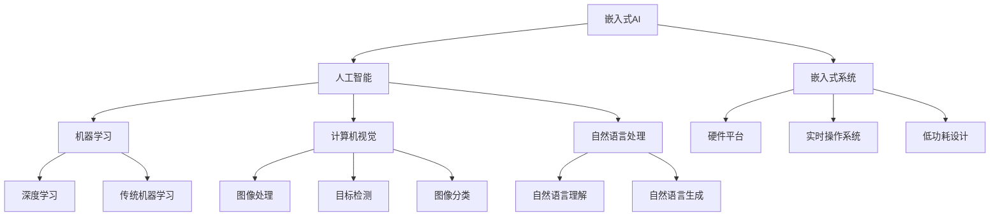
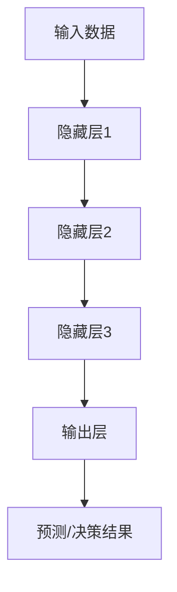
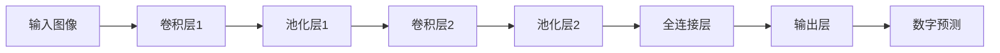

# 嵌入式AI的开发工具与平台

## 1. 背景介绍

### 1.1 问题的由来

随着人工智能(AI)技术的不断发展和应用领域的扩展,嵌入式系统也开始融入AI功能,以提供更智能化的解决方案。传统的嵌入式系统通常只能执行有限的任务,但通过集成AI算法,它们可以实现更复杂的功能,如模式识别、决策制定和自主学习等。

然而,将AI技术与嵌入式系统相结合并非一蹴而就。嵌入式系统通常具有有限的计算资源、内存和功耗约束,这对于运行复杂的AI模型来说是一个巨大的挑战。此外,不同的嵌入式硬件平台和操作系统也增加了开发和部署AI应用程序的复杂性。

### 1.2 研究现状

为了解决这些挑战,研究人员和开发人员一直在努力开发专门的工具和平台,以简化嵌入式AI应用程序的开发过程。这些工具和平台旨在提供优化的AI模型、高效的推理引擎、跨平台的部署支持,以及友好的开发环境。

目前,已有多家科技公司和开源社区推出了专门的嵌入式AI开发工具和平台,如TensorFlow Lite、NVIDIA TensorRT、Apache TVM、ARM Compute Library等。这些工具和平台提供了从模型训练到部署的端到端解决方案,支持多种硬件平台和操作系统。

### 1.3 研究意义

嵌入式AI的开发工具和平台对于推动AI技术在嵌入式系统中的应用具有重要意义。它们可以帮助开发人员更高效地开发和部署AI应用程序,缩短上市时间,并优化资源利用率。此外,这些工具和平台还可以促进AI技术在物联网(IoT)、机器人、自动驾驶、智能家居等领域的应用,推动智能化发展。

### 1.4 本文结构

本文将全面介绍嵌入式AI的开发工具和平台。首先,我们将探讨嵌入式AI的核心概念和与其他技术领域的关系。接下来,我们将详细阐述嵌入式AI的核心算法原理和具体操作步骤。然后,我们将介绍相关的数学模型和公式,并通过案例分析进行详细讲解。

此外,本文还将提供实际的项目实践,包括代码实例和详细解释说明。我们还将探讨嵌入式AI的实际应用场景,并对未来的应用前景进行展望。最后,我们将推荐一些有用的工具和资源,总结未来的发展趋势和面临的挑战,并回答一些常见问题。

## 2. 核心概念与联系

嵌入式AI是一个跨学科的领域,涉及多个技术领域,包括嵌入式系统、人工智能、机器学习、计算机视觉、自然语言处理等。为了更好地理解嵌入式AI,我们需要了解这些核心概念及其相互关系。

- **嵌入式系统**是指专门为特定应用而设计的计算机系统,通常具有有限的资源和实时性能要求。它们广泛应用于物联网设备、工业控制系统、消费电子产品等领域。

- **人工智能**是一个广泛的领域,旨在开发能够模拟人类智能行为的系统和算法。它包括机器学习、计算机视觉、自然语言处理等子领域。

- **机器学习**是人工智能的一个重要分支,它使用统计技术从数据中学习模式和规律,并对新数据进行预测或决策。常见的机器学习算法包括深度学习、支持向量机、决策树等。

- **计算机视觉**是人工智能的另一个重要分支,它专注于从数字图像或视频中获取高级信息,如物体识别、目标检测和跟踪、图像分类等。

- **自然语言处理**是人工智能的另一个关键领域,它研究如何使计算机能够理解和生成人类语言。常见的应用包括机器翻译、文本摘要、情感分析等。

嵌入式AI将这些技术领域结合起来,旨在在资源受限的嵌入式系统中实现智能功能。它需要考虑嵌入式系统的硬件平台、实时操作系统和低功耗设计等约束,同时利用机器学习、计算机视觉和自然语言处理等人工智能技术来实现智能化。

## 3. 核心算法原理与具体操作步骤

### 3.1 算法原理概述

嵌入式AI系统通常采用机器学习算法来实现智能功能。常见的算法包括深度神经网络、支持向量机、决策树等。这些算法通过从大量数据中学习模式和规律,可以对新数据进行预测或决策。

深度神经网络是当前最流行和最有效的机器学习算法之一。它由多层神经元组成,每层对输入数据进行非线性变换,最终输出预测或决策结果。常见的深度神经网络架构包括卷积神经网络(CNN)、递归神经网络(RNN)和transformer等。

### 3.2 算法步骤详解

嵌入式AI系统的算法流程通常包括以下几个主要步骤:

1. **数据收集和预处理**: 首先需要收集和准备训练数据,如图像、语音、传感器数据等。这些数据通常需要进行清理、标注和归一化等预处理步骤。

2. **模型选择和训练**: 根据应用场景和数据类型选择合适的机器学习模型,如CNN用于图像识别,RNN用于序列数据处理等。然后使用训练数据对模型进行训练,优化模型参数。

3. **模型优化和量化**: 为了在资源受限的嵌入式系统上高效运行,需要对训练好的模型进行优化和量化。这包括模型剪枝、权重量化、张量分解等技术,以减小模型大小和计算复杂度。

4. **模型转换和部署**: 将优化后的模型转换为适合嵌入式系统的格式,如TensorFlow Lite、ONNX等。然后将模型部署到目标嵌入式硬件平台上,并集成到应用程序中。

5. **模型推理和决策**: 在嵌入式系统上,模型可以对新的输入数据进行推理,并输出预测或决策结果。这个过程需要考虑实时性、能耗和精度等约束。

6. **模型更新和迁移学习**: 在某些应用场景中,可能需要使用新的数据来更新和改进模型。这可以通过迁移学习或在线学习等技术来实现,而无需从头开始训练新模型。

### 3.3 算法优缺点

嵌入式AI算法具有以下优点:

- 高精度和强大的预测能力,可以处理复杂的任务。
- 通过学习大量数据,可以发现隐藏的模式和规律。
- 具有一定的泛化能力,可以处理未见过的新数据。

但同时也存在一些缺点:

- 需要大量的训练数据和计算资源进行模型训练。
- 模型通常是黑箱,难以解释决策过程。
- 对噪声和异常数据敏感,可能导致错误的预测。
- 在资源受限的嵌入式系统上运行存在性能和能耗挑战。

### 3.4 算法应用领域

嵌入式AI算法可以应用于多个领域,包括但不限于:

- **计算机视觉**: 图像分类、目标检测、人脸识别、手势识别等。
- **自然语言处理**: 语音识别、机器翻译、文本分类、情感分析等。
- **预测维护**: 基于传感器数据预测设备故障和维护需求。
- **自动驾驶**: 环境感知、路径规划、决策控制等。
- **机器人**: 运动控制、导航、物体操作等。
- **物联网**: 智能家居、智能城市、工业自动化等。

## 4. 数学模型和公式详细讲解与举例说明

### 4.1 数学模型构建

嵌入式AI系统中常用的数学模型包括神经网络、支持向量机、决策树等。以神经网络为例,它的数学模型可以表示为:

$$
y = f(W^Tx + b)
$$

其中:

- $x$是输入向量
- $W$是权重矩阵
- $b$是偏置向量
- $f$是非线性激活函数,如Sigmoid、ReLU等

神经网络通过学习权重矩阵$W$和偏置向量$b$的值,来拟合输入数据$x$和期望输出$y$之间的映射关系。

### 4.2 公式推导过程

对于神经网络模型,我们通常使用梯度下降算法来优化权重和偏置参数。目标是最小化损失函数$L(y, \hat{y})$,其中$\hat{y}$是模型的预测输出。

根据链式法则,我们可以计算损失函数相对于权重$W$和偏置$b$的梯度:

$$
\begin{aligned}
\frac{\partial L}{\partial W} &= \frac{\partial L}{\partial \hat{y}} \cdot \frac{\partial \hat{y}}{\partial z} \cdot \frac{\partial z}{\partial W} \
\frac{\partial L}{\partial b} &= \frac{\partial L}{\partial \hat{y}} \cdot \frac{\partial \hat{y}}{\partial z} \cdot \frac{\partial z}{\partial b}
\end{aligned}
$$

其中$z = W^Tx + b$是神经元的加权输入。

然后,我们可以使用梯度下降法更新权重和偏置:

$$
\begin{aligned}
W &\leftarrow W - \eta \frac{\partial L}{\partial W} \
b &\leftarrow b - \eta \frac{\partial L}{\partial b}
\end{aligned}
$$

其中$\eta$是学习率,控制更新步长的大小。

通过不断迭代这个过程,神经网络可以逐步减小损失函数,从而学习到最优的权重和偏置参数。

### 4.3 案例分析与讲解

让我们以手写数字识别为例,分析嵌入式AI系统中的数学模型和公式应用。

在这个案例中,我们使用卷积神经网络(CNN)来识别手写数字图像。CNN由多个卷积层和池化层组成,用于从图像中提取特征。最后,这些特征被输入到全连接层,用于进行分类预测。

在卷积层中,我们使用卷积核对输入图像进行卷积操作,提取局部特征。卷积核的权重$W$需要通过训练来学习。卷积操作可以表示为:

$$
y_{ij} = \sum_{m} \sum_{n} W_{mn} \cdot x_{i+m, j+n} + b
$$

其中$x$是输入图像,$(i, j)$是输出特征图的位置,$(m, n)$是卷积核的大小,$b$是偏置项。

池化层用于降低特征图的分辨率,提高模型的鲁棒性和计算效率。常用的池化操作包括最大池化和平均池化。

全连接层将提取的特征映射到最终的分类输出。它的数学模型与普通的神经网络类似,使用权重矩阵$W$和偏置向量$b$对输入特征