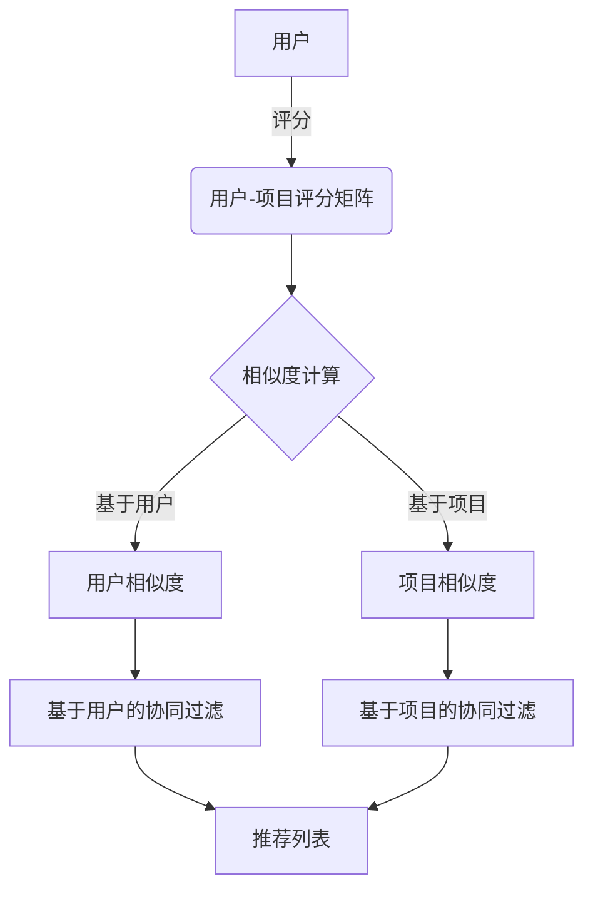

# 推荐系统实例:基于协同过滤的电影推荐

## 1. 背景介绍

### 1.1 问题的由来

在当今信息时代,随着互联网和移动设备的快速发展,我们面临着信息过载的困扰。大量的电影作品汹涌而来,给用户带来了选择的困难。传统的基于内容的推荐系统很难满足用户的个性化需求,因为它们只考虑了电影本身的特征,而忽视了用户的主观偏好。

为了解决这一问题,协同过滤(Collaborative Filtering)算法应运而生。它利用过去用户的行为数据来预测用户对新项目的可能喜好程度,从而为用户提供个性化的推荐。

### 1.2 研究现状

协同过滤算法主要分为两大类:基于用户的协同过滤(User-based Collaborative Filtering)和基于项目的协同过滤(Item-based Collaborative Filtering)。前者通过找到具有相似兴趣爱好的用户,并推荐这些相似用户喜欢的项目;后者则是通过发现相似的项目,并推荐给喜欢相似项目的用户。

目前,基于项目的协同过滤算法在推荐系统中得到了广泛应用,因为它可以有效地解决数据稀疏和冷启动问题,并且具有较高的可扩展性。然而,该算法也存在一些不足,例如对新上架项目的推荐效果较差,以及无法解释推荐结果的原因。

### 1.3 研究意义

本文旨在深入探讨基于项目的协同过滤算法在电影推荐系统中的应用,并提出一种改进的算法模型,以提高推荐的准确性和可解释性。通过对算法原理、数学模型、实现细节和实际案例的全面分析,我们希望能够为读者提供一个全面的理解,并为相关领域的研究和应用提供参考。

### 1.4 本文结构

本文共分为九个部分:

1. 背景介绍
2. 核心概念与联系
3. 核心算法原理与具体操作步骤
4. 数学模型和公式详细讲解与举例说明
5. 项目实践:代码实例和详细解释说明
6. 实际应用场景
7. 工具和资源推荐
8. 总结:未来发展趋势与挑战
9. 附录:常见问题与解答

## 2. 核心概念与联系

在深入探讨协同过滤算法之前,我们需要先了解一些核心概念和它们之间的联系。



1. **用户-项目评分矩阵(User-Item Rating Matrix)**: 一个二维矩阵,用于存储用户对不同项目的评分数据。矩阵的行表示用户,列表示项目,每个元素代表对应用户对该项目的评分值。

2. **相似度计算(Similarity Computation)**: 计算用户之间或项目之间的相似程度,是协同过滤算法的核心步骤。常用的相似度计算方法包括余弦相似度、皮尔逊相关系数等。

3. **用户相似度(User Similarity)**: 基于用户的协同过滤算法中,需要计算不同用户之间的相似度,找到具有相似兴趣爱好的用户群体。

4. **项目相似度(Item Similarity)**: 基于项目的协同过滤算法中,需要计算不同项目之间的相似度,找到相似特征的项目群组。

5. **基于用户的协同过滤(User-based Collaborative Filtering)**: 利用用户相似度,为目标用户推荐与其相似用户喜欢的项目。

6. **基于项目的协同过滤(Item-based Collaborative Filtering)**: 利用项目相似度,为目标用户推荐与其喜欢的项目相似的其他项目。

7. **推荐列表(Recommendation List)**: 算法最终输出的,针对目标用户的个性化推荐项目列表。

## 3. 核心算法原理与具体操作步骤

### 3.1 算法原理概述

基于项目的协同过滤算法的核心思想是:对于目标用户,找到与其已评分项目相似的其他项目,并将这些相似项目推荐给目标用户。算法主要包括以下几个步骤:

1. 构建用户-项目评分矩阵
2. 计算项目之间的相似度
3. 为目标用户生成推荐列表

### 3.2 算法步骤详解

#### 3.2.1 构建用户-项目评分矩阵

用户-项目评分矩阵是协同过滤算法的基础数据结构,它存储了所有用户对不同项目的评分数据。矩阵的行表示用户,列表示项目,每个元素代表对应用户对该项目的评分值(通常使用1-5分制)。如果某个用户没有对某个项目进行评分,则该元素的值为空或0。

例如,对于一个包含4个用户和5部电影的数据集,用户-项目评分矩阵可能如下所示:

```
       电影1 电影2 电影3 电影4 电影5
用户A    5     3     0     4     0
用户B    0     0     0     3     4
用户C    4     0     5     4     0
用户D    0     5     4     0     3
```

#### 3.2.2 计算项目之间的相似度

计算项目之间的相似度是算法的核心步骤。常用的相似度计算方法包括:

1. **余弦相似度(Cosine Similarity)**

   余弦相似度用于计算两个向量之间的夹角余弦值,取值范围为[-1,1]。两个向量越相似,余弦值越接近1。在协同过滤算法中,我们将每个项目的评分数据视为一个向量,然后计算不同项目向量之间的余弦相似度。

   设有两个项目 $i$ 和 $j$,它们的评分向量分别为 $\vec{r_i}$ 和 $\vec{r_j}$,则它们的余弦相似度定义为:

   $$\text{sim}(i,j) = \cos(\vec{r_i},\vec{r_j}) = \frac{\vec{r_i} \cdot \vec{r_j}}{|\vec{r_i}||\vec{r_j}|}$$

2. **皮尔逊相关系数(Pearson Correlation Coefficient)**

   皮尔逊相关系数用于测量两个变量之间的线性相关程度,取值范围为[-1,1]。两个变量越相关,绝对值越接近1。在协同过滤算法中,我们将每个项目的评分数据视为一个变量,然后计算不同项目变量之间的皮尔逊相关系数。

   设有两个项目 $i$ 和 $j$,它们的评分向量分别为 $\vec{r_i}$ 和 $\vec{r_j}$,则它们的皮尔逊相关系数定义为:

   $$\text{sim}(i,j) = \frac{\sum_{u \in U}(r_{ui} - \overline{r_i})(r_{uj} - \overline{r_j})}{\sqrt{\sum_{u \in U}(r_{ui} - \overline{r_i})^2}\sqrt{\sum_{u \in U}(r_{uj} - \overline{r_j})^2}}$$

   其中 $U$ 表示所有评分过项目 $i$ 和 $j$ 的用户集合, $\overline{r_i}$ 和 $\overline{r_j}$ 分别表示项目 $i$ 和 $j$ 的平均评分。

计算出所有项目对之间的相似度后,我们可以构建一个项目相似度矩阵,用于后续的推荐计算。

#### 3.2.3 为目标用户生成推荐列表

对于目标用户 $u$,我们首先找到其已评分的项目集合 $I_u$。然后,对于每个未评分的项目 $j$,我们计算其与已评分项目集合 $I_u$ 中项目的加权平均相似度,作为该项目的预测评分 $\hat{r}_{uj}$:

$$\hat{r}_{uj} = \overline{r_u} + \frac{\sum_{i \in I_u}\text{sim}(i,j)(r_{ui} - \overline{r_u})}{\sum_{i \in I_u}|\text{sim}(i,j)|}$$

其中 $\overline{r_u}$ 表示用户 $u$ 的平均评分, $r_{ui}$ 表示用户 $u$ 对项目 $i$ 的评分。

计算出所有未评分项目的预测评分后,我们将这些项目按照预测评分从高到低排序,取前 $N$ 个作为推荐列表返回给目标用户。

### 3.3 算法优缺点

优点:

1. **个性化推荐**: 通过分析用户的历史行为数据,为每个用户提供个性化的推荐结果。
2. **无需明确的内容信息**: 算法只需要用户的评分数据,无需了解项目的具体内容信息。
3. **可解释性**: 推荐结果可以通过相似度解释,用户可以了解为什么会被推荐某些项目。
4. **高效性**: 一旦计算出项目相似度矩阵,推荐过程就可以高效进行。

缺点:

1. **冷启动问题**: 对于新用户或新项目,由于缺乏历史数据,难以进行准确推荐。
2. **稀疏数据问题**: 当用户-项目评分矩阵较为稀疏时,相似度计算的准确性会下降。
3. **隐性反馈问题**: 算法只考虑了用户的显性反馈(评分),忽略了隐性反馈(浏览记录、购买记录等)。
4. **推荐多样性问题**: 算法倾向于推荐与用户已评分项目相似的项目,导致推荐结果缺乏多样性。

### 3.4 算法应用领域

基于项目的协同过滤算法广泛应用于以下领域:

1. **电子商务**: 为用户推荐感兴趣的商品。
2. **在线视频**: 为用户推荐感兴趣的电影、电视剧等。
3. **音乐推荐**: 为用户推荐感兴趣的音乐作品。
4. **新闻推荐**: 为用户推荐感兴趣的新闻资讯。
5. **社交网络**: 为用户推荐感兴趣的好友、话题等。

## 4. 数学模型和公式详细讲解与举例说明

### 4.1 数学模型构建

在基于项目的协同过滤算法中,我们需要构建一个数学模型来表示用户对项目的评分数据,并计算项目之间的相似度。

假设我们有 $m$ 个用户和 $n$ 个项目,用 $r_{ui}$ 表示用户 $u$ 对项目 $i$ 的评分,则用户-项目评分矩阵可以表示为:

$$R = \begin{bmatrix}
r_{11} & r_{12} & \cdots & r_{1n} \
r_{21} & r_{22} & \cdots & r_{2n} \
\vdots & \vdots & \ddots & \vdots \
r_{m1} & r_{m2} & \cdots & r_{mn}
\end{bmatrix}$$

对于任意两个项目 $i$ 和 $j$,我们可以将它们的评分数据表示为向量:

$$\vec{r_i} = \begin{bmatrix}
r_{1i} \
r_{2i} \
\vdots \
r_{mi}
\end{bmatrix}, \vec{r_j} = \begin{bmatrix}
r_{1j} \
r_{2j} \
\vdots \
r_{mj}
\end{bmatrix}$$

然后,我们可以使用余弦相似度或皮尔逊相关系数等方法计算这两个向量之间的相似度,作为项目 $i$ 和 $j$ 的相似度 $\text{sim}(i,j)$。

### 4.2 公式推导过程

#### 4.2.1 余弦相似度

设有两个项目 $i$ 和 $j$,它们的评分向量分别为 $\vec{r_i}$ 和 $\vec{r_j}$,则它们的余弦相似度定义为:

$$\text{sim}(i,