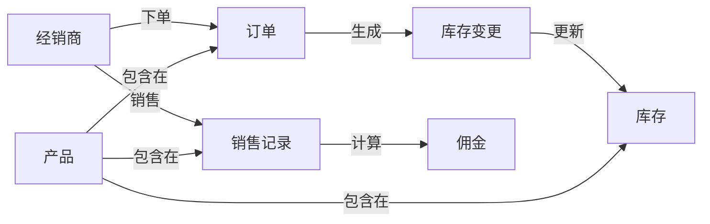

# 经销商管理系统架构设计方案

## 1. 背景介绍

### 1.1 问题的由来

在当今快节奏的商业环境中，有效管理经销商网络对于企业的成功至关重要。传统的手工管理方式已经无法满足现代企业对于高效、准确和实时管理经销商的需求。因此,构建一个先进的经销商管理系统(DMS)成为当务之急。

### 1.2 研究现状

目前市面上存在一些经销商管理系统,但大多数系统功能单一、扩展性差、与企业其他系统整合能力弱。它们无法全面满足企业对经销商管理的复杂需求,如实时库存监控、订单处理、销售分析等。

### 1.3 研究意义

设计一套高效、可扩展、可集成的经销商管理系统架构,可以帮助企业更好地管理经销商网络,提高运营效率,降低管理成本,增强市场竞争力。该系统还可以为企业提供宝贵的销售数据和分析,支持企业制定更明智的业务决策。

### 1.4 本文结构

本文首先介绍经销商管理系统的核心概念和模块,然后深入探讨系统架构设计的关键技术,包括分布式系统、微服务、消息队列等。接下来,详细阐述系统的数学模型和算法原理。最后,介绍系统的实际应用场景、推荐的工具和资源,并对未来发展趋势和挑战进行展望。

## 2. 核心概念与联系

经销商管理系统的核心概念包括:

1. **经销商(Distributor)**: 代表企业销售产品的独立商家。
2. **产品(Product)**: 企业生产和销售的商品。
3. **订单(Order)**: 经销商向企业下达的采购订单。
4. **库存(Inventory)**: 企业和经销商手头的产品库存量。
5. **销售(Sales)**: 经销商实现的产品销售记录。
6. **佣金(Commission)**: 企业根据经销商销售情况支付的佣金。

这些核心概念之间存在着密切的关系,如下所示:



## 3. 核心算法原理 & 具体操作步骤

### 3.1 算法原理概述

经销商管理系统的核心算法包括订单处理算法、库存管理算法和佣金计算算法。

1. **订单处理算法**:
   - 接收经销商的订单请求
   - 验证订单信息的合法性和完整性
   - 检查库存是否足够
   - 生成订单记录并更新库存

2. **库存管理算法**:
   - 实时监控企业和经销商的库存水平
   - 根据预设的库存阈值,自动触发补货流程
   - 支持多仓库的库存管理

3. **佣金计算算法**:
   - 收集经销商的销售记录
   - 根据预先设定的佣金策略计算应付佣金
   - 生成佣金结算单

### 3.2 算法步骤详解

#### 订单处理算法步骤

1. 接收经销商的订单请求,解析请求数据
2. 验证订单信息的合法性和完整性
   - 检查经销商ID是否存在
   - 检查订单中的产品ID是否存在
   - 检查订单数量是否合理
3. 查询库存,检查库存是否足够
4. 如果库存足够
   - 生成订单记录,保存到数据库
   - 更新库存数量
   - 返回订单确认信息
5. 如果库存不足
   - 返回库存不足的错误信息

#### 库存管理算法步骤

1. 定期扫描企业和经销商的库存数据
2. 对每个产品和仓库,计算当前库存量
3. 如果库存量低于预设阈值
   - 触发补货流程
   - 根据补货策略,计算所需补货量
   - 向供应商下达补货订单
4. 更新库存记录

#### 佣金计算算法步骤

1. 收集经销商的销售记录
2. 根据预先设定的佣金策略,计算每笔销售的应付佣金
   - 佣金 = 销售金额 * 佣金比例
   - 佣金比例可以根据产品类型、销量等因素动态调整
3. 汇总每个经销商的佣金总额
4. 生成佣金结算单,发送给经销商

### 3.3 算法优缺点

**优点**:

1. 高效:通过自动化流程,提高了订单处理、库存管理和佣金计算的效率。
2. 准确性:减少了人工操作的错误,提高了数据的准确性。
3. 可扩展性:算法可以轻松地适应业务规模的增长。
4. 灵活性:佣金计算策略可以根据实际需求进行动态调整。

**缺点**:

1. 复杂度:算法涉及多个模块,实现和维护较为复杂。
2. 数据质量依赖:算法的准确性依赖于输入数据的质量。
3. 性能瓶颈:在高并发场景下,可能会出现性能瓶颈。

### 3.4 算法应用领域

经销商管理系统的核心算法不仅可以应用于制造业和贸易行业,还可以扩展到其他涉及供应链管理的领域,如电子商务、物流等。此外,订单处理和库存管理算法也可以应用于其他需要处理大量订单和管理库存的场景。

## 4. 数学模型和公式 & 详细讲解 & 举例说明

### 4.1 数学模型构建

为了优化经销商管理系统的库存管理策略,我们构建了一个基于时间序列分析的数学模型。

假设某产品的需求量服从平稳时间序列过程,用 $D_t$ 表示第 t 时间段的需求量,则有:

$$D_t = \mu + \epsilon_t$$

其中:
- $\mu$ 为需求量的均值
- $\epsilon_t$ 为白噪声过程,服从均值为 0、方差为 $\sigma^2$ 的正态分布

我们的目标是确定一个最优库存水平 $I^*$,使得:

$$\min E(C(I))$$

其中 $C(I)$ 为给定库存水平 I 时的总成本,包括库存成本和缺货成本。

### 4.2 公式推导过程

根据经典库存理论,总成本公式可以表示为:

$$C(I) = C_h \cdot E(I-D_t)^+ + C_p \cdot E(D_t-I)^+$$

其中:
- $C_h$ 为每单位产品的库存成本
- $C_p$ 为每单位产品的缺货成本
- $E(I-D_t)^+$ 为期望剩余库存量
- $E(D_t-I)^+$ 为期望缺货量

由于 $D_t$ 服从正态分布,我们可以进一步推导出:

$$E(I-D_t)^+ = \int_{-\infty}^I (I-x)f(x)dx = \sigma\phi\left(\frac{I-\mu}{\sigma}\right) + (I-\mu)\Phi\left(\frac{I-\mu}{\sigma}\right)$$

$$E(D_t-I)^+ = \int_I^{\infty} (x-I)f(x)dx = \sigma\phi\left(\frac{\mu-I}{\sigma}\right) + (\mu-I)\Phi\left(\frac{\mu-I}{\sigma}\right)$$

其中 $\phi(\cdot)$ 和 $\Phi(\cdot)$ 分别是标准正态分布的概率密度函数和累积分布函数。

将这些公式代入总成本公式,我们可以得到一个只有一个变量 $I$ 的函数,通过求导并令导数等于 0,即可求出最优库存水平 $I^*$。

### 4.3 案例分析与讲解

假设某产品的需求量服从正态分布,均值 $\mu = 100$,标准差 $\sigma = 20$。库存成本 $C_h = 1$,缺货成本 $C_p = 10$。我们需要确定最优库存水平 $I^*$。

根据上述公式,我们可以计算出:

$$E(I-D_t)^+ = 20\phi\left(\frac{I-100}{20}\right) + (I-100)\Phi\left(\frac{I-100}{20}\right)$$

$$E(D_t-I)^+ = 20\phi\left(\frac{100-I}{20}\right) + (100-I)\Phi\left(\frac{100-I}{20}\right)$$

$$C(I) = E(I-D_t)^+ + 10E(D_t-I)^+$$

将这些公式代入数值,我们可以绘制出总成本函数的曲线:

```python
import numpy as np
import matplotlib.pyplot as plt

mu = 100
sigma = 20
Ch = 1
Cp = 10

def E_excess(I):
    return sigma * np.exp(-(I-mu)**2/(2*sigma**2)) / np.sqrt(2*np.pi) + (I-mu) * (1 - 0.5 * (1 + erf((I-mu)/(sigma*np.sqrt(2)))))

def E_shortage(I):
    return sigma * np.exp(-(mu-I)**2/(2*sigma**2)) / np.sqrt(2*np.pi) + (mu-I) * (0.5 * (1 + erf((mu-I)/(sigma*np.sqrt(2)))))

def C(I):
    return Ch * E_excess(I) + Cp * E_shortage(I)

I_range = np.arange(50, 200)
cost = [C(I) for I in I_range]

plt.plot(I_range, cost)
plt.xlabel('Inventory Level')
plt.ylabel('Total Cost')
plt.show()
```

从图中可以看出,当库存水平 $I^* \approx 120$ 时,总成本达到最小值。

因此,在给定的参数下,最优库存水平为 120。企业可以根据这个结果,制定合理的库存策略,既能满足客户需求,又能控制库存成本。

### 4.4 常见问题解答

1. **如何处理需求量不服从正态分布的情况?**

   对于非正态分布的情况,我们可以尝试使用其他概率分布模型,如泊松分布、指数分布等。或者使用非参数方法,如Bootstrap等,来估计期望剩余库存量和期望缺货量。

2. **如何考虑多个产品的情况?**

   对于多个产品,我们可以将每个产品的库存成本和缺货成本分别求和,然后再求解最优库存水平。或者根据产品的重要性给予不同的权重,构建加权总成本函数。

3. **如何处理库存成本和缺货成本动态变化的情况?**

   我们可以定期更新库存成本和缺货成本的参数,重新求解最优库存水平。另外,也可以引入动态规划等方法,在成本参数变化时自动调整库存策略。

4. **如何将供应商的供货周期考虑进来?**

   我们可以将供货周期作为一个额外的参数,构建一个多周期的库存模型。在每个周期内,根据当前库存水平和预测需求量,决定是否需要补货及补货量。

## 5. 项目实践:代码实例和详细解释说明

### 5.1 开发环境搭建

本项目使用 Python 作为编程语言,采用流行的 Web 框架 Django 和 Django REST 框架构建 RESTful API。数据库使用 PostgreSQL。

以下是环境搭建的步骤:

1. 安装 Python 3.8 及以上版本
2. 创建虚拟环境:
   ```
   python -m venv env
   source env/bin/activate  # Windows: \env\Scripts\activate
   ```
3. 安装依赖包:
   ```
   pip install django djangorestframework psycopg2
   ```
4. 创建 Django 项目和应用:
   ```
   django-admin startproject dms
   cd dms
   django-admin startapp api
   ```
5. 配置数据库:
   - 在 `dms/settings.py` 中设置数据库连接
     ```python
     DATABASES = {
         'default': {
             'ENGINE': 'django.db.backends.postgresql',
             'NAME': 'dms',
             'USER': 'postgres',
             'PASSWORD': '你的密码',
             'HOST': 'localhost',
             'PORT': '5432',
         }
     }
     ```
   - 在