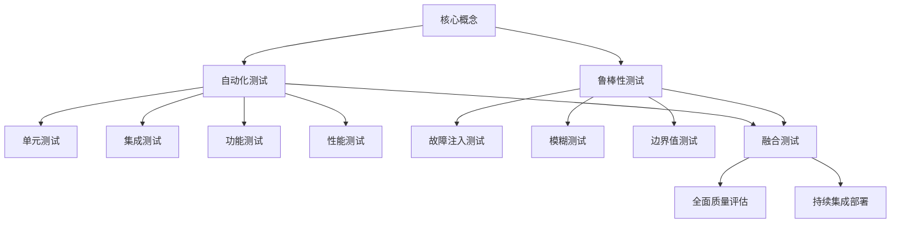

# 《自动化测试与鲁棒性：确保质量与稳定》

## 1. 背景介绍

### 1.1 问题的由来

在当今软件开发的快节奏时代，确保应用程序的质量和稳定性是一个持续的挑战。随着系统复杂性的不断增加和用户需求的日益多样化,手动测试已经无法满足快速迭代交付的需求。因此,自动化测试应运而生,旨在提高测试效率、减少人工错误,并确保软件质量。

然而,仅依赖自动化测试是不够的。鲁棒性(Robustness)作为一种软件质量属性,也变得越来越重要。鲁棒性是指系统在面临意外输入、硬件故障、恶劣环境等异常情况下,能够保持部分功能正常运行、优雅降级或安全退出的能力。

### 1.2 研究现状

目前,自动化测试已经成为软件开发生命周期中不可或缺的一部分。单元测试、集成测试、功能测试、性能测试等不同层次的自动化测试框架和工具层出不穷。但是,大多数自动化测试框架都侧重于验证功能正确性,而忽视了鲁棒性测试。

另一方面,鲁棒性测试通常被视为一种高级测试技术,需要专门的工具和深入的领域知识。常见的鲁棒性测试方法包括故障注入测试(Fault Injection Testing)、模糊测试(Fuzzing)、边界值测试(Boundary Value Testing)等。然而,这些测试方法往往被孤立地应用,缺乏与自动化测试框架的紧密集成。

### 1.3 研究意义

将自动化测试与鲁棒性测试相结合,可以显著提高软件的质量和稳定性。自动化测试可以确保功能的正确实现,而鲁棒性测试可以验证系统在异常情况下的表现。通过综合运用这两种测试方法,我们可以全面评估软件的质量,从而提高用户满意度和系统的可靠性。

此外,在DevOps和持续交付的背景下,自动化测试与鲁棒性测试的融合也变得更加迫切。持续集成和持续部署要求在每个版本迭代中都进行彻底的测试,以确保新功能的正确性和系统的稳定性。

### 1.4 本文结构

本文将深入探讨自动化测试与鲁棒性测试的融合,旨在为读者提供一个全面的视角。我们将首先介绍自动化测试和鲁棒性测试的核心概念,然后阐述它们之间的联系。接下来,我们将详细解释相关算法原理和数学模型,并通过实际案例进行说明。此外,我们还将分享项目实践经验,包括代码示例和开发环境搭建。最后,我们将探讨实际应用场景、未来发展趋势和面临的挑战。

## 2. 核心概念与联系

自动化测试和鲁棒性测试是软件质量保证的两个关键概念。

**自动化测试**旨在通过编写可重复执行的测试用例,自动化验证软件功能的正确性。它包括不同层次的测试,如单元测试、集成测试、功能测试和性能测试等。自动化测试可以提高测试效率,减少人工错误,并确保测试的一致性。

**鲁棒性测试**则关注系统在异常情况下的表现,如意外输入、硬件故障、恶劣环境等。它采用特殊的测试技术,如故障注入测试、模糊测试和边界值测试等,以评估系统的容错能力、降级策略和安全性。鲁棒性测试可以帮助发现潜在的缺陷,提高系统的可靠性和稳定性。

虽然自动化测试和鲁棒性测试侧重点不同,但它们是相辅相成的。自动化测试确保功能的正确实现,而鲁棒性测试验证系统在异常情况下的表现。只有将两者结合起来,才能全面评估软件的质量。

在DevOps和持续交付的背景下,自动化测试与鲁棒性测试的融合变得更加重要。持续集成和持续部署要求在每个版本迭代中都进行彻底的测试,以确保新功能的正确性和系统的稳定性。通过融合自动化测试和鲁棒性测试,我们可以实现全面的质量评估,从而支持高效的持续交付流程。

## 3. 核心算法原理 & 具体操作步骤

### 3.1 算法原理概述

在自动化测试与鲁棒性测试的融合过程中,核心算法原理包括以下几个方面:

1. **测试用例生成算法**: 根据代码覆盖率、边界值分析、异常场景等策略,自动生成测试用例,包括功能测试用例和鲁棒性测试用例。

2. **测试执行调度算法**: 根据测试用例的优先级、依赖关系和资源约束,调度和执行测试用例,实现测试的并行化和优化。

3. **测试结果分析算法**: 分析测试执行的结果,包括功能正确性验证、异常检测和根因分析,生成测试报告和反馈。

4. **测试反馈机制**: 根据测试结果,自动生成缺陷报告,并将反馈信息回馈到开发和测试流程中,实现持续改进。

这些算法的核心思想是通过自动化和智能化的方式,实现测试过程的高效性和全面性,从而提高软件质量和稳定性。

### 3.2 算法步骤详解

以下是核心算法的具体步骤:

1. **测试用例生成**:
   - 代码覆盖率分析: 通过静态和动态代码分析,识别未覆盖的代码路径,生成相应的测试用例。
   - 边界值分析: 根据输入参数的边界值,生成边界测试用例。
   - 异常场景分析: 基于已知的异常场景和故障模式,生成鲁棒性测试用例。

2. **测试执行调度**:
   - 测试用例优先级排序: 根据测试用例的重要性、风险级别和依赖关系,对测试用例进行优先级排序。
   - 资源分配: 根据可用的测试环境和硬件资源,分配测试执行资源。
   - 并行执行: 并行执行独立的测试用例,提高测试效率。
   - 依赖管理: 识别和处理测试用例之间的依赖关系,确保正确的执行顺序。

3. **测试结果分析**:
   - 功能正确性验证: 比对实际输出与预期输出,验证功能的正确性。
   - 异常检测: 监控系统日志、内存使用、CPU负载等指标,检测异常情况。
   - 根因分析: 对发现的缺陷进行根因分析,确定导致缺陷的代码路径和场景。
   - 报告生成: 生成详细的测试报告,包括测试覆盖率、通过率、失败用例和缺陷描述等信息。

4. **测试反馈机制**:
   - 缺陷报告生成: 自动生成包含缺陷描述、重现步骤和相关信息的缺陷报告。
   - 反馈集成: 将缺陷报告和测试反馈信息集成到问题跟踪系统和持续集成流程中。
   - 持续改进: 根据测试反馈,调整测试策略、优化测试用例和改进代码质量。

这些步骤通过自动化和智能化的方式,实现了测试过程的高效性和全面性,从而提高软件质量和稳定性。

### 3.3 算法优缺点

**优点**:

1. **高效性**: 通过自动化测试用例生成、执行调度和结果分析,可以显著提高测试效率,节省人力和时间成本。

2. **全面性**: 融合自动化测试和鲁棒性测试,可以全面评估软件的功能正确性和异常情况下的表现,确保软件质量和稳定性。

3. **可扩展性**: 算法可以适应不同的测试策略和场景,通过调整参数和规则,满足不同项目的测试需求。

4. **持续改进**: 通过测试反馈机制,可以持续优化测试策略和代码质量,实现持续集成和持续交付。

**缺点**:

1. **算法复杂性**: 融合自动化测试和鲁棒性测试涉及多个算法模块,算法实现和优化较为复杂。

2. **依赖性**: 算法的有效性依赖于代码质量、测试用例设计和测试环境的准确性。

3. **资源消耗**: 全面的测试覆盖和并行执行可能会消耗大量的计算资源和测试环境资源。

4. **误报问题**: 在异常检测和根因分析过程中,可能会产生一定程度的误报或漏报。

### 3.4 算法应用领域

自动化测试与鲁棒性测试融合算法可以广泛应用于以下领域:

1. **Web应用程序测试**: 用于测试Web应用程序的功能正确性、性能和安全性。

2. **移动应用程序测试**: 用于测试移动应用程序在不同设备、操作系统和网络环境下的表现。

3. **嵌入式系统测试**: 用于测试嵌入式系统在各种硬件条件和环境条件下的稳定性和可靠性。

4. **云计算和微服务测试**: 用于测试分布式系统、微服务架构和云环境下的应用程序。

5. **物联网和边缘计算测试**: 用于测试物联网设备和边缘计算系统在各种网络条件和资源约束下的性能和鲁棒性。

6. **人工智能和机器学习测试**: 用于测试人工智能和机器学习模型在各种输入和环境条件下的准确性和稳定性。

这些领域都需要确保软件系统的质量和稳定性,因此自动化测试与鲁棒性测试的融合算法可以发挥重要作用。

## 4. 数学模型和公式 & 详细讲解 & 举例说明

### 4.1 数学模型构建

在自动化测试与鲁棒性测试的融合过程中,我们可以构建数学模型来描述和优化测试过程。以下是一些常见的数学模型:

1. **代码覆盖率模型**:

   代码覆盖率是衡量测试用例质量的重要指标。我们可以使用以下公式计算代码覆盖率:

   $$覆盖率 = \frac{已覆盖的代码块数量}{总代码块数量}$$

   其中,代码块可以是语句、分支、路径或其他粒度级别。我们的目标是最大化代码覆盖率,以确保测试用例的全面性。

2. **测试用例优先级模型**:

   为了优化测试执行顺序,我们可以为每个测试用例分配优先级。优先级可以基于测试用例的重要性、风险级别、执行时间等因素计算。一种常见的优先级模型是加权求和模型:

   $$优先级 = w_1 \times 重要性 + w_2 \times 风险级别 + w_3 \times 执行时间 + \cdots$$

   其中,$ w_i $是对应因素的权重,可以根据项目需求进行调整。

3. **测试执行调度模型**:

   测试执行调度旨在最大化测试效率,同时满足资源约束和依赖关系。我们可以将其建模为一个约束优化问题:

   $$\max \sum_{i=1}^{n} p_i x_i$$
   $$\text{s.t.} \sum_{i=1}^{n} r_i x_i \leq R$$
   $$x_i \in \{0, 1\}, i = 1,