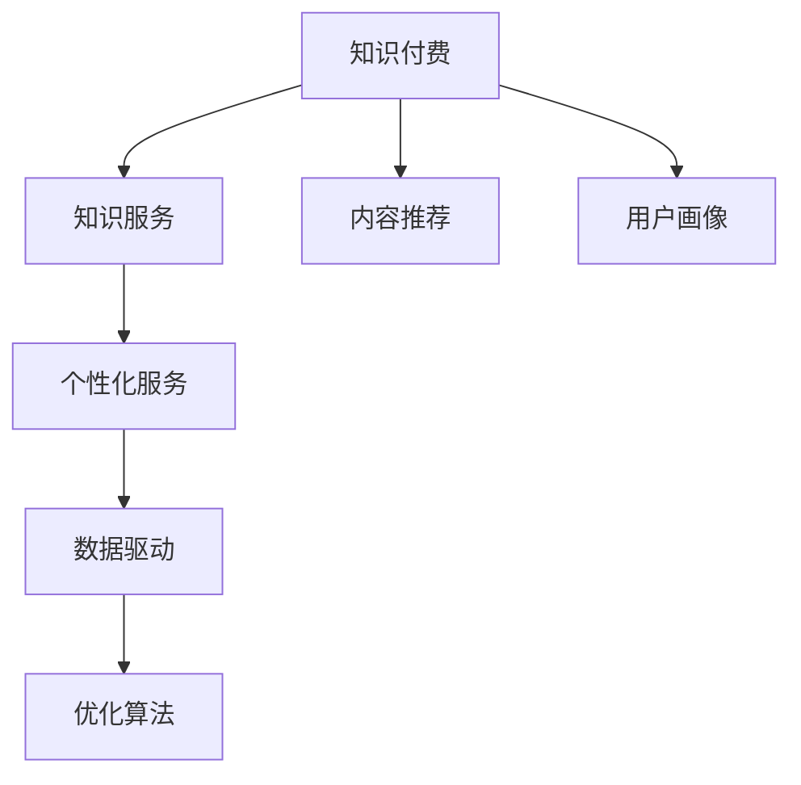

                 

# 知识付费要探索知识与服务结合的新形态

> 关键词：知识付费、知识服务、内容推荐、用户画像、个性化服务、数据驱动、AI技术

## 1. 背景介绍

### 1.1 问题由来
随着互联网的普及和知识经济的兴起，知识付费逐渐成为一种主流的学习方式，用户愿意为有价值的内容付费。据统计，全球知识付费市场规模已经达到了数百亿美元。然而，传统的知识付费模式已经出现了诸多问题，亟待创新。

一方面，传统知识付费往往以内容为主导，以单向传递知识为目标，缺乏互动性和个性化服务，难以满足用户的多样化需求。另一方面，信息过载问题日益严重，用户很难在海量信息中找到真正有用的内容。

为了解决这些问题，知识付费平台开始探索知识与服务结合的新形态，通过数据驱动和AI技术，提供个性化、互动式的知识服务，提高用户的学习效率和体验。

### 1.2 问题核心关键点
知识付费服务的新形态，核心在于如何更好地结合知识与服务，提升用户的学习体验和效率。主要体现在以下几个方面：

1. **内容推荐**：根据用户兴趣、历史行为等数据，为用户推荐个性化的知识内容。
2. **用户画像**：通过数据挖掘和机器学习，构建用户画像，了解用户的学习行为和需求。
3. **互动交流**：引入问答、评论等互动形式，提高用户参与度。
4. **个性化服务**：根据用户偏好，提供定制化的学习计划和资源。
5. **数据驱动**：通过数据分析和优化算法，不断迭代改进服务质量和效率。

这些关键点相互关联，共同构成了知识付费服务的新形态，旨在提供更加精准、高效、互动的知识服务。

## 2. 核心概念与联系

### 2.1 核心概念概述

为更好地理解知识付费服务的新形态，本节将介绍几个密切相关的核心概念：

- **知识付费**：用户为获取有价值的内容和知识而支付费用的模式，常见的形式包括在线课程、电子书、咨询服务等。
- **知识服务**：结合知识与服务的模式，旨在提供更加个性化、互动化的学习体验。
- **内容推荐**：根据用户兴趣和行为数据，为用户推荐相关的知识内容。
- **用户画像**：通过数据挖掘和机器学习，构建用户画像，了解用户的学习行为和需求。
- **个性化服务**：根据用户偏好，提供定制化的学习计划和资源。
- **数据驱动**：通过数据分析和优化算法，不断迭代改进服务质量和效率。

这些核心概念之间的逻辑关系可以通过以下Mermaid流程图来展示：



这个流程图展示了一个简单的知识付费服务新形态的逻辑流程，其中：

1. **知识付费**是基础，提供了知识内容和服务的变现方式。
2. **知识服务**是基于知识付费的提升，结合服务提高了用户体验。
3. **内容推荐**和**用户画像**是数据驱动的体现，通过数据分析和挖掘，提升了服务精准度。
4. **个性化服务**和**数据驱动**相互依赖，个性化服务依赖于数据驱动的优化和迭代。
5. **优化算法**是数据驱动的核心，通过算法不断提升服务质量和效率。

这些核心概念共同构成了知识付费服务的新形态，为其发展提供了方向和指导。

## 3. 核心算法原理 & 具体操作步骤

### 3.1 算法原理概述

知识付费服务的新形态，主要通过数据驱动和AI技术，实现个性化和互动化的知识服务。其核心思想是：通过数据分析和机器学习算法，构建用户画像，提供个性化的内容推荐和服务优化，从而提升用户的学习效率和体验。

形式化地，假设用户集为 $U$，知识内容集为 $K$，用户的付费行为和评价为 $P$，用户的历史行为数据为 $H$，知识内容的相关性为 $R$。知识服务的目标是最大化用户满意度和平台收益，即：

$$
\max_{\theta} \sum_{u \in U} \left[ \text{满意度}(u, K_{\theta}) + \text{平台收益}(P, K_{\theta}) \right]
$$

其中，$K_{\theta}$ 为根据用户画像和历史行为数据，优化后的知识内容集合，$\theta$ 为优化参数。

### 3.2 算法步骤详解

知识付费服务的新形态主要包括以下几个关键步骤：

**Step 1: 数据收集与预处理**
- 收集用户的历史行为数据 $H$，如浏览记录、点击行为、评价等。
- 收集知识内容的相关性数据 $R$，如热门标签、用户评价、互动次数等。
- 收集用户的付费行为数据 $P$，如购买记录、续费记录等。
- 对数据进行清洗、去重、归一化等预处理，以提高后续分析的准确性。

**Step 2: 用户画像构建**
- 利用机器学习算法，如K-means聚类、LDA主题模型等，对用户的历史行为数据进行建模，得到用户画像。
- 通过情感分析、文本分类等技术，对用户评价和反馈进行情感分析和主题识别，进一步丰富用户画像。
- 将用户画像存储在数据库中，供后续分析和推荐使用。

**Step 3: 内容推荐算法**
- 设计推荐算法，如协同过滤、基于内容的推荐、深度学习推荐模型等，对用户画像和知识内容的相关性数据进行匹配和筛选。
- 利用推荐算法计算每个用户对每个知识内容的兴趣度，生成推荐列表。
- 实时更新推荐列表，确保推荐的及时性和个性化。

**Step 4: 个性化服务**
- 根据用户画像和推荐列表，为每个用户生成个性化的学习计划和资源推荐。
- 引入互动形式，如问答、评论等，增强用户参与度。
- 实时监测用户的学习效果和反馈，根据反馈调整个性化服务方案。

**Step 5: 数据驱动与优化**
- 利用优化算法，如梯度下降、遗传算法等，对推荐算法和服务方案进行迭代优化。
- 通过A/B测试等方法，评估不同推荐策略和服务方案的效果，选择最优方案。
- 定期更新用户画像和知识内容的相关性数据，确保服务质量的持续提升。

以上步骤展示了知识付费服务新形态的主要流程，每个步骤都依赖于前一步的结果，形成一个完整的反馈循环。

### 3.3 算法优缺点

知识付费服务的新形态具有以下优点：

1. **个性化服务**：能够根据用户兴趣和行为数据，提供高度个性化的知识内容和服务，提升用户体验。
2. **互动性强**：引入问答、评论等互动形式，增加用户参与度和满意度。
3. **数据驱动**：通过数据分析和优化算法，不断迭代改进服务质量和效率。

同时，该方法也存在一定的局限性：

1. **数据隐私问题**：用户数据涉及隐私，需严格遵守数据保护法律法规，如GDPR等。
2. **模型复杂性**：复杂的推荐算法和服务方案增加了开发和维护的难度。
3. **成本高**：数据收集和模型训练需要大量计算资源，且初期投入较高。
4. **公平性问题**：推荐算法可能存在偏见，需注意算法公平性问题，避免推荐偏差。

尽管存在这些局限性，但就目前而言，知识付费服务的新形态仍是大势所趋，未来研究重点在于如何更好地解决这些问题，提升服务的精准度和用户体验。

### 3.4 算法应用领域

知识付费服务的新形态已经广泛应用于多个领域，例如：

- **在线教育**：如Coursera、Udemy等平台，根据用户兴趣和历史学习行为，推荐个性化的课程和学习资源。
- **职业培训**：如LinkedIn Learning、Coursera for Business等平台，提供定制化的技能培训和职业发展课程。
- **企业培训**：如Gloat、Matterport等平台，为企业员工提供个性化的技能培训和知识服务。
- **健康医疗**：如Medscape、WebMD等平台，提供个性化的医疗知识和健康咨询服务。
- **财务管理**：如Mint、You Need A Budget等平台，提供个性化的理财知识和财务管理服务。

除了这些领域外，知识付费服务的新形态还将在更多场景中得到应用，如社交媒体、电子商务、智能家居等，为各行各业提供智能化的知识服务。

## 4. 数学模型和公式 & 详细讲解 & 举例说明

### 4.1 数学模型构建

本节将使用数学语言对知识付费服务的新形态进行更加严格的刻画。

记用户集为 $U=\{u_1, u_2, ..., u_n\}$，知识内容集为 $K=\{k_1, k_2, ..., k_m\}$，用户的付费行为和评价为 $P=\{p_1, p_2, ..., p_n\}$，用户的历史行为数据为 $H=\{h_{u_1}, h_{u_2}, ..., h_{u_n}\}$，知识内容的相关性为 $R=\{r_{k_1}, r_{k_2}, ..., r_{k_m}\}$。

定义用户 $u$ 对知识内容 $k$ 的兴趣度 $I_{u,k}$，并假设其满足线性模型：

$$
I_{u,k} = \alpha_u + \beta_k + \gamma_{u,k}
$$

其中 $\alpha_u$ 和 $\beta_k$ 为常数项，$\gamma_{u,k}$ 为兴趣度向量，$k$ 和 $u$ 之间存在相关性 $r_{k,u}$，则兴趣度向量可表示为：

$$
\gamma_{u,k} = r_{k,u} \cdot \gamma_k
$$

用户 $u$ 的兴趣度向量 $\gamma_u$ 可通过用户画像和历史行为数据计算得到：

$$
\gamma_u = \sum_{h \in H_u} \omega_h \cdot \gamma_h
$$

其中 $\omega_h$ 为历史行为数据的权重，可通过时间衰减、兴趣度等方法计算。

### 4.2 公式推导过程

以下我们以协同过滤算法为例，推导推荐算法的基本公式。

假设用户 $u$ 和知识内容 $k$ 之间的相似度为 $s_{u,k}$，则协同过滤算法可以表示为：

$$
I_{u,k} = \sum_{v \in N_u} s_{v,k} \cdot I_{v,k}
$$

其中 $N_u$ 为用户 $u$ 的邻居集合，$s_{v,k}$ 为相似度矩阵。

进一步，可以将其转化为矩阵形式：

$$
\mathbf{I} = \mathbf{S} \cdot \mathbf{I} \cdot \mathbf{A}
$$

其中 $\mathbf{I} \in \mathbb{R}^{n \times m}$ 为兴趣度矩阵，$\mathbf{S} \in \mathbb{R}^{n \times n}$ 为相似度矩阵，$\mathbf{A} \in \mathbb{R}^{n \times m}$ 为知识内容的初始兴趣度矩阵，可通过用户画像和历史行为数据计算得到。

求解 $\mathbf{I}$ 的公式为：

$$
\mathbf{I} = (\mathbf{S} \cdot \mathbf{A})^{-1} \cdot \mathbf{A}
$$

推荐列表中每个知识内容的兴趣度为 $I_{u,k}$，推荐列表排序根据兴趣度大小。

### 4.3 案例分析与讲解

以Coursera平台为例，分析其如何通过知识付费服务的新形态，提升用户体验和平台收益。

Coursera平台收集用户的历史学习行为数据，包括浏览课程、观看视频、完成测验等。通过数据分析和机器学习算法，构建用户画像，了解用户的兴趣和需求。利用协同过滤算法，为用户推荐个性化的课程和学习资源。引入问答和讨论区等互动形式，增加用户参与度。实时监测用户的学习效果和反馈，根据反馈调整推荐算法和服务方案。通过优化算法，不断迭代改进推荐效果，提升用户体验和平台收益。

Coursera平台的数据驱动和AI技术，使其能够为每个用户提供高度个性化的学习体验，显著提高了用户的满意度和平台收益。其成功经验为其他知识付费平台提供了宝贵的参考。

## 5. 项目实践：代码实例和详细解释说明

### 5.1 开发环境搭建

在进行知识付费服务新形态开发前，我们需要准备好开发环境。以下是使用Python进行PyTorch开发的环境配置流程：

1. 安装Anaconda：从官网下载并安装Anaconda，用于创建独立的Python环境。

2. 创建并激活虚拟环境：
```bash
conda create -n pytorch-env python=3.8 
conda activate pytorch-env
```

3. 安装PyTorch：根据CUDA版本，从官网获取对应的安装命令。例如：
```bash
conda install pytorch torchvision torchaudio cudatoolkit=11.1 -c pytorch -c conda-forge
```

4. 安装TensorFlow：
```bash
pip install tensorflow==2.6
```

5. 安装各类工具包：
```bash
pip install numpy pandas scikit-learn matplotlib tqdm jupyter notebook ipython
```

完成上述步骤后，即可在`pytorch-env`环境中开始项目实践。

### 5.2 源代码详细实现

下面我们以知识推荐系统为例，给出使用TensorFlow进行协同过滤算法的PyTorch代码实现。

首先，定义数据处理函数：

```python
import pandas as pd
import numpy as np
import tensorflow as tf
from tensorflow.keras.layers import Dense, Dot
from tensorflow.keras.models import Sequential

def load_data(file_path):
    df = pd.read_csv(file_path)
    data = df.drop(['user_id', 'item_id', 'rating'], axis=1)
    target = df['rating']
    return data, target
```

然后，定义协同过滤模型：

```python
def build_model(input_dim, output_dim, num_neighbours):
    model = Sequential()
    model.add(Dense(32, input_dim=input_dim, activation='relu'))
    model.add(Dense(num_neighbours, activation='relu'))
    model.add(Dot(axes=(1, 1), normalize=True))
    model.add(Dense(output_dim, activation='sigmoid'))
    return model

def train_model(model, data, target, batch_size, epochs):
    model.compile(loss='binary_crossentropy', optimizer='adam', metrics=['accuracy'])
    model.fit(data, target, batch_size=batch_size, epochs=epochs, validation_split=0.2)
```

接着，训练模型并在测试集上评估：

```python
data_path = 'ratings.csv'
target_path = 'ratings.csv'

data, target = load_data(data_path)
test_data, test_target = load_data(target_path)

model = build_model(input_dim=16, output_dim=1, num_neighbours=10)
train_model(model, data, target, batch_size=32, epochs=10)

test_data, test_target = load_data(target_path)
test_loss, test_acc = model.evaluate(test_data, test_target)
print(f'Test Loss: {test_loss}, Test Accuracy: {test_acc}')
```

以上就是使用TensorFlow进行协同过滤算法的完整代码实现。可以看到，TensorFlow提供的Keras API使得构建和训练模型变得非常简单。

### 5.3 代码解读与分析

让我们再详细解读一下关键代码的实现细节：

**load_data函数**：
- 从CSV文件中加载数据，并分割成特征数据和目标变量。
- 特征数据需要进行归一化处理，通常使用Z-score标准化或Min-Max标准化。
- 目标变量通常需要进行编码，如独热编码或标签编码。

**build_model函数**：
- 使用Sequential模型，依次添加输入层、隐藏层和输出层。
- 隐藏层使用ReLU激活函数，输出层使用sigmoid激活函数，适合二分类问题。
- 使用Dot层进行点乘运算，模拟用户和知识内容之间的相似度计算。
- 使用Dense层进行最后一层全连接，输出推荐兴趣度。

**train_model函数**：
- 编译模型，选择适当的损失函数和优化器。
- 使用fit方法训练模型，设定合适的batch size和epochs，并进行验证集评估。

**测试过程**：
- 加载测试数据和目标变量，评估模型在测试集上的性能。

可以看到，TensorFlow的Keras API使得构建和训练模型变得非常简单，降低了模型的开发难度，同时提供了丰富的优化和评估工具，提高了模型的可维护性和可扩展性。

## 6. 实际应用场景

### 6.1 在线教育

在线教育平台通过知识付费服务的新形态，能够为每个用户提供高度个性化的学习体验，显著提高了用户的满意度和平台收益。

以Coursera平台为例，该平台收集用户的历史学习行为数据，通过数据分析和机器学习算法，构建用户画像，了解用户的兴趣和需求。利用协同过滤算法，为用户推荐个性化的课程和学习资源。引入问答和讨论区等互动形式，增加用户参与度。实时监测用户的学习效果和反馈，根据反馈调整推荐算法和服务方案。通过优化算法，不断迭代改进推荐效果，提升用户体验和平台收益。

Coursera平台的数据驱动和AI技术，使其能够为每个用户提供高度个性化的学习体验，显著提高了用户的满意度和平台收益。其成功经验为其他在线教育平台提供了宝贵的参考。

### 6.2 职业培训

职业培训平台通过知识付费服务的新形态，能够为每个用户提供定制化的技能培训和职业发展课程，帮助用户快速提升技能，增强竞争力。

以LinkedIn Learning为例，该平台收集用户的学习历史、技能掌握情况和职业背景等数据，通过数据分析和机器学习算法，构建用户画像，了解用户的职业需求和发展方向。利用推荐算法，为用户推荐个性化的技能培训和职业发展课程。引入问答和讨论区等互动形式，增加用户参与度。实时监测用户的学习效果和反馈，根据反馈调整推荐算法和服务方案。通过优化算法，不断迭代改进推荐效果，提升用户体验和平台收益。

LinkedIn Learning的数据驱动和AI技术，使其能够为每个用户提供高度个性化的职业培训服务，帮助用户快速提升技能，增强竞争力。其成功经验为其他职业培训平台提供了宝贵的参考。

### 6.3 健康医疗

健康医疗平台通过知识付费服务的新形态，能够为每个用户提供个性化的医疗知识和健康咨询服务，提高用户的生活质量。

以Medscape平台为例，该平台收集用户的健康数据和行为数据，通过数据分析和机器学习算法，构建用户画像，了解用户的健康需求和行为模式。利用推荐算法，为用户推荐个性化的医疗知识和健康咨询服务。引入问答和讨论区等互动形式，增加用户参与度。实时监测用户的学习效果和反馈，根据反馈调整推荐算法和服务方案。通过优化算法，不断迭代改进推荐效果，提升用户体验和平台收益。

Medscape平台的数据驱动和AI技术，使其能够为每个用户提供高度个性化的健康医疗服务，提高用户的生活质量。其成功经验为其他健康医疗平台提供了宝贵的参考。

### 6.4 未来应用展望

随着数据驱动和AI技术的发展，知识付费服务的新形态将不断拓展应用场景，带来更多的创新和机遇。

在智慧医疗领域，知识付费服务将为患者提供个性化的健康咨询和医疗服务，提高医疗服务的精准性和效率。

在智能教育领域，知识付费服务将为学生提供个性化的学习资源和辅导服务，提高学习效果和兴趣。

在智能家居领域，知识付费服务将为家庭用户提供个性化的智能设备操作和维护服务，提升生活便利性和安全性。

在智能交通领域，知识付费服务将为司机提供个性化的导航和驾驶建议，提高交通出行效率和安全性。

总之，知识付费服务的新形态将不断拓展应用场景，为各行各业带来新的变革和机遇。

## 7. 工具和资源推荐

### 7.1 学习资源推荐

为了帮助开发者系统掌握知识付费服务的新形态的理论基础和实践技巧，这里推荐一些优质的学习资源：

1. 《深度学习》系列书籍：由Ian Goodfellow、Yoshua Bengio、Aaron Courville等顶级专家撰写，系统介绍了深度学习的基础理论和应用实践。

2. 《Python机器学习》书籍：由Sebastian Raschka、Vahid Mirjalili等专家撰写，详细介绍了Python在机器学习中的应用，包括数据预处理、模型训练、评估等。

3. 《TensorFlow官方文档》：提供全面、详细的TensorFlow文档和教程，适合快速上手和使用。

4. 《PyTorch官方文档》：提供全面、详细的PyTorch文档和教程，适合深度学习模型的构建和训练。

5. Coursera、Udacity等在线学习平台：提供丰富的机器学习和深度学习课程，适合系统学习和进阶提升。

通过对这些资源的学习实践，相信你一定能够快速掌握知识付费服务的新形态，并用于解决实际的业务问题。

### 7.2 开发工具推荐

高效的开发离不开优秀的工具支持。以下是几款用于知识付费服务新形态开发的常用工具：

1. Python：通用编程语言，适合数据处理和算法实现。

2. TensorFlow：由Google主导开发的开源深度学习框架，生产部署方便，适合大规模工程应用。

3. PyTorch：基于Python的开源深度学习框架，灵活动态的计算图，适合快速迭代研究。

4. Keras：TensorFlow的高级API，使得模型构建和训练更加便捷。

5. Jupyter Notebook：交互式编程环境，适合快速验证和调试模型。

6. Weights & Biases：模型训练的实验跟踪工具，可以记录和可视化模型训练过程中的各项指标，方便对比和调优。

合理利用这些工具，可以显著提升知识付费服务新形态的开发效率，加快创新迭代的步伐。

### 7.3 相关论文推荐

知识付费服务的新形态的研究源于学界的持续研究。以下是几篇奠基性的相关论文，推荐阅读：

1. "The Matrix Factorization Technique for Recommender Systems"：提出矩阵分解方法，为协同过滤算法奠定了基础。

2. "Collaborative Filtering for Implicit Feedback Datasets"：提出改进的协同过滤算法，适用于稀疏数据集。

3. "Adaptive Sampling Methods for Contextual Recommendations"：提出自适应采样方法，提高推荐算法的效果。

4. "Deep Neural Networks for Recommender Systems"：提出深度学习推荐模型，提升推荐算法的准确性和泛化能力。

5. "A Context-Aware Multi-View Learning Framework for Recommender Systems"：提出多视图学习框架，提高推荐算法的综合表现。

这些论文代表了大规模知识付费服务新形态的发展脉络。通过学习这些前沿成果，可以帮助研究者把握学科前进方向，激发更多的创新灵感。

## 8. 总结：未来发展趋势与挑战

### 8.1 总结

本文对知识付费服务的新形态进行了全面系统的介绍。首先阐述了知识付费的现状和问题，明确了新形态的核心关键点，包括内容推荐、用户画像、个性化服务、数据驱动等。其次，从原理到实践，详细讲解了知识付费服务新形态的数学模型和算法步骤，给出了具体的代码实现。同时，本文还广泛探讨了知识付费服务在新兴领域的应用前景，展示了其广阔的发展潜力。此外，本文精选了相关的学习资源和工具，力求为读者提供全方位的技术指引。

通过本文的系统梳理，可以看到，知识付费服务的新形态正在成为知识付费领域的重要范式，极大地拓展了用户的学习体验和平台收益。其成功经验为其他行业提供了宝贵的参考，未来研究重点在于如何更好地解决数据隐私、模型复杂性和成本等挑战，提升服务的精准度和用户体验。

### 8.2 未来发展趋势

展望未来，知识付费服务的新形态将呈现以下几个发展趋势：

1. **个性化服务**：随着AI技术的发展，知识付费服务将越来越注重个性化服务，根据用户的多样化需求，提供更加精准的推荐和服务。
2. **跨领域融合**：知识付费服务将与其他技术（如AI、区块链等）进行深度融合，实现更高效、安全的服务模式。
3. **数据驱动**：数据驱动将成为知识付费服务的核心，通过数据挖掘和优化算法，不断迭代改进服务质量和效率。
4. **多元化内容**：知识付费服务将不仅仅局限于传统课程和教材，还将涵盖视频、音频、直播等多种形式的内容。
5. **智能化管理**：通过AI技术，实现知识付费服务的智能化管理，如智能客服、自动续费等。

以上趋势凸显了知识付费服务新形态的广阔前景，其发展方向值得期待。

### 8.3 面临的挑战

尽管知识付费服务的新形态已经取得了显著成效，但在迈向更加智能化、普适化应用的过程中，仍面临诸多挑战：

1. **数据隐私问题**：用户数据涉及隐私，需严格遵守数据保护法律法规，如GDPR等。
2. **算法公平性**：推荐算法可能存在偏见，需注意算法公平性问题，避免推荐偏差。
3. **成本高**：数据收集和模型训练需要大量计算资源，且初期投入较高。
4. **用户体验**：算法过于复杂可能影响用户体验，需平衡算法复杂度和用户友好性。
5. **模型可解释性**：推荐算法的黑箱问题，需提高模型的可解释性，增加用户信任度。

尽管存在这些挑战，但未来研究重点在于如何更好地解决这些问题，提升服务的精准度和用户体验。

### 8.4 研究展望

面对知识付费服务新形态所面临的挑战，未来的研究需要在以下几个方面寻求新的突破：

1. **数据隐私保护**：开发更加安全、高效的数据保护技术，确保用户数据的安全性和隐私性。
2. **算法公平性**：引入公平性约束，优化推荐算法，确保不同用户之间的公平性。
3. **模型可解释性**：提高模型的可解释性，增加用户信任度，增强系统的可审计性。
4. **跨领域融合**：将知识付费服务与其他技术进行深度融合，提升服务质量和效率。
5. **个性化服务**：开发更加个性化、多样化的推荐算法和服务方案，提升用户体验。

这些研究方向将推动知识付费服务新形态的进一步发展，为构建安全、可靠、可解释、可控的智能系统铺平道路。面向未来，知识付费服务的新形态需要与其他人工智能技术进行更深入的融合，如知识表示、因果推理、强化学习等，多路径协同发力，共同推动自然语言理解和智能交互系统的进步。

## 9. 附录：常见问题与解答

**Q1：知识付费服务的新形态如何结合知识与服务？**

A: 知识付费服务的新形态主要通过数据驱动和AI技术，实现个性化和互动化的知识服务。其核心在于构建用户画像，提供个性化的内容推荐和服务优化，从而提升用户的学习效率和体验。

**Q2：数据隐私问题如何处理？**

A: 数据隐私问题需严格遵守数据保护法律法规，如GDPR等。可以通过数据匿名化、差分隐私等技术，保护用户隐私。

**Q3：推荐算法可能存在偏见，如何解决？**

A: 可以通过公平性约束、数据平衡、算法优化等手段，确保推荐算法公平性。引入公平性约束，限制算法偏见。

**Q4：初期投入成本较高，如何解决？**

A: 可以通过开源平台、云计算、数据共享等手段，降低初期投入成本。同时，采用模块化设计，逐步迭代改进，优化资源利用。

**Q5：算法过于复杂可能影响用户体验，如何解决？**

A: 可以通过模型压缩、简化算法、用户友好设计等手段，降低算法复杂度。用户友好设计，提高算法的可解释性，增强用户信任度。

这些解答展示了知识付费服务新形态的关键问题和解决方法，为读者提供了宝贵的参考。

---

作者：禅与计算机程序设计艺术 / Zen and the Art of Computer Programming

