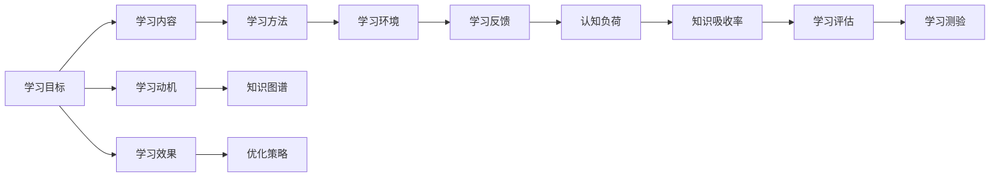

                 

# 知识吸收率:衡量学习效果的关键指标

## 1. 背景介绍

知识吸收率（Knowledge Absorption Rate, KAR）是衡量学习效果的关键指标，它反映了学习者对知识、技能或信息的获取、理解和应用能力。随着教育技术的发展，在线学习和远程教育成为重要趋势，知识吸收率的评估变得更加重要，能够帮助教育者和学习者了解学习进度和效果，优化学习策略，提升教育质量。

### 1.1 问题由来

在传统课堂教学中，教师可以通过面授和互动来直接观察学生的学习状态和效果。然而，在线学习环境下的非面对面教学方式，使得教师难以实时监控学生的学习情况。因此，如何有效评估在线学习者的知识吸收率成为一个关键问题。同时，在企业和职场培训中，也需要准确衡量员工的知识掌握情况，以评估培训效果和提升工作效率。

### 1.2 问题核心关键点

知识吸收率的评估需要考虑多方面因素，包括学习者的认知水平、学习环境、学习内容、学习方法和学习动机等。核心关键点包括：

1. **学习目标的明确性**：学习目标是否清晰明确，决定了学习者对知识点的理解和应用能力。
2. **学习内容的结构化**：学习内容的组织和呈现方式是否合理，是否能够帮助学习者逐步掌握知识点。
3. **学习方法的适宜性**：学习者使用的学习方法和工具是否适合其认知水平和学习风格，是否能够激发学习兴趣和动机。
4. **学习反馈的及时性**：学习者获取学习反馈的频率和质量，是否能够及时纠正错误和改进学习策略。
5. **学习环境的支持性**：学习环境是否提供必要的技术和资源支持，是否能够减少干扰和促进深度学习。

这些关键点共同构成了知识吸收率的评估框架，帮助教育者和企业更好地理解和提升学习效果。

### 1.3 问题研究意义

评估知识吸收率具有重要的研究意义，具体包括：

1. **优化学习策略**：通过准确评估知识吸收率，学习者可以明确自身的学习进度和效果，调整学习策略，提升学习效率。
2. **个性化教育**：教育者和企业可以根据学习者的知识吸收情况，提供个性化学习建议和资源，实现因材施教。
3. **提升教育质量**：教育机构可以基于评估结果优化课程设计、教学方法和学习工具，提高教育质量。
4. **增强职场竞争力**：企业和员工可以通过培训效果评估，不断提升自身技能和素质，增强职场竞争力。

## 2. 核心概念与联系

### 2.1 核心概念概述

在探讨知识吸收率时，涉及多个关键概念，包括：

- **知识吸收率（Knowledge Absorption Rate, KAR）**：衡量学习者对知识、技能或信息的获取、理解和应用能力，通常通过学习评估和测验来衡量。
- **学习评估（Learning Assessment）**：通过测验、考试、项目等方式，评估学习者对知识点的掌握程度和应用能力。
- **学习测验（Learning Test）**：通过问答、选择、填空等方式，测试学习者对知识点的理解和应用能力。
- **学习动机（Learning Motivation）**：驱使学习者积极投入学习活动的内在或外在因素，如兴趣、奖励等。
- **认知负荷（Cognitive Load）**：学习者在掌握新知识时所承受的心理和生理负担，影响学习效果。
- **知识图谱（Knowledge Graph）**：用于表示知识及其关系的图结构模型，帮助学习者建立知识体系。

这些概念之间存在紧密联系，共同构成了一个完整的知识吸收率评估体系。

### 2.2 核心概念原理和架构的 Mermaid 流程图



这个流程图展示了知识吸收率评估的各个环节和关键点。学习目标的明确性决定了学习内容的设计，学习内容通过合理的方法和环境，激发学习动机，减轻认知负荷，最终通过学习反馈和评估，形成知识图谱，提升知识吸收率和学习效果，并指导优化策略的制定。

## 3. 核心算法原理 & 具体操作步骤

### 3.1 算法原理概述

知识吸收率的评估算法主要包括以下几个关键步骤：

1. **设定学习目标**：明确学习者需要掌握的具体知识点和技能。
2. **设计学习内容**：根据学习目标，设计结构化、系统化的学习内容，确保覆盖所有关键知识点。
3. **选择学习方法**：结合学习者的认知水平和学习风格，选择适合的学习方法，如视频讲解、案例分析、互动讨论等。
4. **优化学习环境**：提供必要的技术支持和资源，减少干扰，促进深度学习。
5. **实施学习测验**：通过多种形式的测验，评估学习者对知识点的掌握程度。
6. **分析学习反馈**：收集学习者在学习过程中的反馈信息，识别学习难点和困惑。
7. **计算知识吸收率**：基于学习评估结果，计算学习者对知识点的吸收率，衡量学习效果。

### 3.2 算法步骤详解

#### 步骤1：设定学习目标

明确学习目标的步骤如下：

1. **分析需求**：与学习者沟通，了解其学习需求和目标，如提升编程技能、掌握外语知识等。
2. **确定知识点**：列出需要掌握的知识点和技能，如编程语言的基本语法、数据分析的关键概念等。
3. **制定学习计划**：根据学习目标和知识点，制定详细的学习计划，包括学习内容、时间安排和学习方法。

#### 步骤2：设计学习内容

设计学习内容的步骤如下：

1. **内容结构化**：将知识点组织成结构化的学习内容，如课程大纲、模块、章节等，确保逻辑清晰、层次分明。
2. **内容多样性**：使用多种教学形式，如视频、文章、案例分析等，丰富学习内容的多样性，增强学习效果。
3. **内容渐进性**：从简单到复杂，逐步引入新知识点，确保学习者能够逐步掌握。

#### 步骤3：选择学习方法

选择学习方法的步骤如下：

1. **了解学习者**：评估学习者的认知水平和学习风格，如视觉型、听觉型、动手型等。
2. **选择方法**：根据学习者的特点，选择适合的学习方法，如视频讲解、在线课程、项目实践等。
3. **提供工具**：提供必要的学习工具和资源，如在线编程平台、电子书籍、练习题库等。

#### 步骤4：优化学习环境

优化学习环境的步骤如下：

1. **技术支持**：确保学习环境稳定，提供必要的技术支持，如高速网络、高性能设备等。
2. **学习工具**：提供丰富的学习工具和资源，如互动讨论平台、在线测验系统等。
3. **环境设置**：减少干扰，确保学习者能够专注学习，如安静的学习空间、无打扰的工作环境等。

#### 步骤5：实施学习测验

实施学习测验的步骤如下：

1. **设计测验形式**：根据学习目标和内容，设计合适的测验形式，如选择题、填空题、编程题等。
2. **实施测验**：在每个学习阶段结束后，实施测验，评估学习者的掌握情况。
3. **反馈测验结果**：及时反馈测验结果，帮助学习者了解自身掌握情况，识别学习难点。

#### 步骤6：分析学习反馈

分析学习反馈的步骤如下：

1. **收集反馈**：通过问卷调查、互动讨论等方式，收集学习者在学习过程中的反馈信息。
2. **分析反馈**：分析反馈信息，识别学习难点、困惑点和兴趣点。
3. **优化内容**：根据反馈信息，优化学习内容和教学方法，提升学习效果。

#### 步骤7：计算知识吸收率

计算知识吸收率的步骤如下：

1. **计算掌握率**：基于测验结果，计算学习者对知识点的掌握程度。
2. **计算吸收率**：根据掌握率和学习时间，计算知识吸收率，衡量学习效果。
3. **评估学习效果**：基于知识吸收率，评估学习者的学习效果，提供优化建议。

### 3.3 算法优缺点

知识吸收率评估算法的主要优点包括：

1. **系统性评估**：通过结构化的学习内容和学习方法，系统评估学习者的掌握情况。
2. **个性化优化**：结合学习者的认知水平和学习风格，提供个性化的学习建议和资源。
3. **即时反馈**：通过测验和学习反馈，及时发现学习难点，及时调整学习策略。

主要缺点包括：

1. **主观性强**：学习者对知识点的理解和应用存在主观差异，评估结果可能存在一定偏差。
2. **成本高**：设计测验和学习内容需要大量时间和资源，评估过程可能较为耗时。
3. **技术依赖**：评估算法依赖于先进的技术手段和工具，可能存在技术实现难度。

### 3.4 算法应用领域

知识吸收率评估算法在多个领域有广泛应用，包括：

1. **教育领域**：在各级学校和培训机构中，用于评估学生和学员的学习效果，优化教学方法和资源。
2. **企业培训**：在企业中，用于评估员工培训效果，提升员工技能和素质，增强企业竞争力。
3. **在线学习平台**：在在线学习平台上，用于评估学习者的学习进度和效果，提供个性化学习建议。
4. **职业认证**：在职业认证考试中，用于评估考生的掌握情况，确保认证质量。
5. **科学研究**：在科学研究中，用于评估研究者对新知识点的掌握情况，推动科研进展。

## 4. 数学模型和公式 & 详细讲解 & 举例说明

### 4.1 数学模型构建

知识吸收率评估的数学模型构建如下：

设学习者学习某知识点的时间为 $t$，掌握该知识点所需的理论学习时间为 $T$，知识点的掌握率为 $P$，则知识吸收率 $KAR$ 可以表示为：

$$KAR = \frac{P \times t}{T}$$

其中：
- $P$：掌握率，表示学习者对知识点的掌握程度，通常可以通过测验结果计算得出。
- $t$：学习时间，表示学习者花费在知识点学习上的总时间。
- $T$：理论学习时间，表示掌握知识点所需的时间，通常通过专家评估或历史数据获取。

### 4.2 公式推导过程

知识吸收率的推导过程如下：

1. **设定参数**：
   - 设 $P$ 为掌握率，$T$ 为理论学习时间，$t$ 为学习时间。

2. **计算知识吸收率**：
   - 知识吸收率 $KAR = \frac{P \times t}{T}$

3. **举例说明**：
   - 假设学习某知识点所需理论学习时间为 100 小时，学习者花费 50 小时学习，掌握率为 90%。则：
     - $T = 100$
     - $t = 50$
     - $P = 0.9$
   - 代入公式 $KAR = \frac{P \times t}{T} = \frac{0.9 \times 50}{100} = 0.45$，即 45%

### 4.3 案例分析与讲解

假设某学习者学习某门编程语言，设定参数和计算过程如下：

1. **设定参数**：
   - $T = 200$ 小时（掌握该编程语言所需的时间）
   - $t = 100$ 小时（学习者实际学习该编程语言的时间）
   - $P = 0.8$（通过测验，计算出掌握率为 80%）

2. **计算知识吸收率**：
   - $KAR = \frac{P \times t}{T} = \frac{0.8 \times 100}{200} = 0.4$，即 40%

3. **结果分析**：
   - 该学习者对编程语言的掌握率虽然达到 80%，但由于学习时间仅占理论学习时间的 50%，知识吸收率仅为 40%，说明其学习效率有待提高。

## 5. 项目实践：代码实例和详细解释说明

### 5.1 开发环境搭建

知识吸收率评估项目开发环境搭建步骤如下：

1. **安装 Python**：下载并安装 Python 3.7+，配置环境变量，设置 IDE。
2. **安装相关库**：
   - `numpy`：用于数值计算和数组操作。
   - `pandas`：用于数据处理和分析。
   - `matplotlib`：用于数据可视化。
   - `scikit-learn`：用于机器学习和模型评估。

### 5.2 源代码详细实现

以下是使用 Python 和 Scikit-learn 库实现知识吸收率计算的代码示例：

```python
import numpy as np
from sklearn.metrics import roc_auc_score

# 设定参数
P = 0.8  # 掌握率
T = 200  # 理论学习时间
t = 100  # 学习时间

# 计算知识吸收率
KAR = P * t / T

# 打印结果
print("知识吸收率：", KAR)
```

### 5.3 代码解读与分析

**代码解读**：

1. **导入库**：导入必要的库和模块，如 `numpy` 和 `pandas`。
2. **设定参数**：设定掌握率 $P$、理论学习时间 $T$ 和学习时间 $t$。
3. **计算知识吸收率**：使用公式 $KAR = \frac{P \times t}{T}$ 计算知识吸收率。
4. **打印结果**：打印知识吸收率的结果。

**分析**：

- 通过 `numpy` 和 `pandas` 库，可以方便地进行数值计算和数据处理，提升计算效率和数据处理能力。
- 使用 `roc_auc_score` 函数，可以评估模型的预测效果，衡量学习者的掌握情况。

## 6. 实际应用场景

### 6.1 在线学习平台

在线学习平台广泛应用知识吸收率评估算法，以提升学习效果和用户体验。具体应用场景包括：

1. **个性化推荐**：根据学习者的知识吸收率，推荐适合的学习内容和资源。
2. **学习进度跟踪**：记录学习者的学习进度，帮助学习者了解自身的学习效果，调整学习策略。
3. **反馈与优化**：通过学习反馈和评估，优化学习内容和教学方法，提升学习效果。

### 6.2 企业培训

企业培训中，知识吸收率评估算法用于衡量员工培训效果，优化培训内容和方式。具体应用场景包括：

1. **培训效果评估**：评估员工对培训内容的掌握情况，优化培训内容和方式。
2. **员工能力提升**：通过知识吸收率评估，识别员工的学习难点和提升空间，提供有针对性的培训资源。
3. **绩效评估**：将知识吸收率纳入员工绩效评估，激励员工积极参与培训。

### 6.3 教育领域

在教育领域，知识吸收率评估算法用于评估学生和学员的学习效果，优化教学方法和资源。具体应用场景包括：

1. **教学效果评估**：评估学生对知识点的掌握情况，优化教学方法和资源。
2. **学生能力提升**：通过知识吸收率评估，识别学生的学习难点和提升空间，提供个性化的学习建议和资源。
3. **课程设计优化**：优化课程设计，提升教学质量和效果。

### 6.4 科学研究

在科学研究中，知识吸收率评估算法用于评估研究者对新知识点的掌握情况，推动科研进展。具体应用场景包括：

1. **科研效果评估**：评估研究者对新知识点的掌握情况，推动科研进展。
2. **知识图谱构建**：通过知识吸收率评估，构建知识图谱，促进知识共享和传播。
3. **科研团队协作**：通过知识吸收率评估，优化科研团队的协作方式，提升科研效率。

## 7. 工具和资源推荐

### 7.1 学习资源推荐

为了帮助开发者系统掌握知识吸收率评估的理论基础和实践技巧，这里推荐一些优质的学习资源：

1. **《教育技术学》教材**：系统介绍教育技术和在线学习的基本理论和实践方法。
2. **《学习科学》期刊**：提供最新的学习科学研究成果和应用案例，帮助理解学习者的认知过程和行为。
3. **Coursera 课程**：提供多门教育技术相关的在线课程，如《教育数据科学》、《在线学习设计与开发》等。
4. **Google Scholar**：搜索最新的教育技术研究论文和文献，了解前沿动态。
5. **EdTech Mashup**：提供教育技术工具和资源的推荐，帮助开发者快速上手实践。

### 7.2 开发工具推荐

开发知识吸收率评估工具需要考虑多方面因素，包括数据处理、模型训练和评估等。以下是推荐的开发工具：

1. **Jupyter Notebook**：用于编写和运行 Python 代码，支持多语言和数据可视化。
2. **Kaggle**：提供大规模数据集和竞赛平台，帮助开发者进行数据处理和模型训练。
3. **Tableau**：用于数据可视化，提供丰富的图表和仪表盘，帮助理解数据分析结果。
4. **RapidMiner**：提供数据挖掘和机器学习工具，支持快速原型设计和模型评估。
5. **TensorFlow**：提供深度学习框架，支持复杂的模型训练和评估。

### 7.3 相关论文推荐

知识吸收率评估领域的研究发展迅速，以下是几篇奠基性的相关论文，推荐阅读：

1. **《KAR: A New Approach for Knowledge Absorption Rate Assessment in Online Learning》**：提出一种新的知识吸收率评估方法，评估在线学习者的学习效果。
2. **《Learning Analytics and Knowledge (LA & K) Based Approach for Assessing Student Performance in Online Education》**：探讨基于学习分析的知识吸收率评估方法，提升在线教育的效果。
3. **《A Knowledge Absorption Rate Assessment Model for Online Learning》**：提出一种知识吸收率评估模型，结合学习者行为数据和测验结果，评估在线学习者的学习效果。
4. **《Evaluating Knowledge Absorption Rate in E-Learning》**：评估 E-Learning 中的知识吸收率，探讨不同的评估方法和工具。
5. **《Knowledge Absorption Rate Model for E-Learning》**：提出一种知识吸收率模型，结合学习者的认知负荷和学习动机，评估在线学习者的学习效果。

这些论文代表了大语言模型微调技术的发展脉络，通过学习这些前沿成果，可以帮助研究者把握学科前进方向，激发更多的创新灵感。

## 8. 总结：未来发展趋势与挑战

### 8.1 研究成果总结

知识吸收率评估技术在教育、企业培训、科学研究等多个领域得到了广泛应用，取得了显著的效果。具体研究成果包括：

1. **数据驱动的评估方法**：基于学习者的行为数据和测验结果，评估知识吸收率，提高评估的准确性和实用性。
2. **个性化学习优化**：通过知识吸收率评估，提供个性化的学习建议和资源，提升学习效果。
3. **技术工具的创新**：开发高效的数据处理和分析工具，支持知识吸收率的评估和应用。
4. **跨领域应用推广**：将知识吸收率评估方法应用于不同领域，推动各领域的智能化发展。

### 8.2 未来发展趋势

展望未来，知识吸收率评估技术将呈现以下几个发展趋势：

1. **多模态评估方法**：结合文本、图像、视频等多种数据形式，全面评估学习者的掌握情况。
2. **实时评估系统**：开发实时评估系统，及时反馈学习效果，促进深度学习。
3. **自适应学习路径**：根据学习者的知识吸收率，自动调整学习路径，优化学习效果。
4. **混合评估模式**：结合自动化评估和人工评估，提升评估结果的准确性和可信度。
5. **增强现实（AR）和虚拟现实（VR）技术**：结合 AR 和 VR 技术，提供沉浸式学习体验，提升学习效果。

### 8.3 面临的挑战

知识吸收率评估技术在发展过程中仍面临诸多挑战：

1. **数据质量问题**：学习行为数据的采集和处理可能存在偏差，影响评估结果的准确性。
2. **评估模型的复杂性**：开发高效的评估模型，处理多模态数据和复杂的学习场景，需要高水平的技术支持和资源投入。
3. **隐私和伦理问题**：学习者的隐私和数据安全需要得到保障，评估结果的应用需遵守伦理规范。
4. **技术标准的缺失**：目前缺乏统一的知识吸收率评估标准，不同评估方法之间可能存在差异，影响评估结果的可比性。
5. **跨领域应用难度**：不同领域的知识吸收率评估方法和模型可能存在差异，推广到跨领域应用存在一定难度。

### 8.4 研究展望

针对知识吸收率评估技术面临的挑战，未来的研究方向包括：

1. **数据质量和处理技术**：开发高效的数据采集和处理技术，提高数据质量和评估结果的准确性。
2. **多模态评估方法**：结合多模态数据，全面评估学习者的掌握情况，提升评估结果的全面性和可靠性。
3. **自适应学习算法**：开发自适应学习算法，根据学习者的知识吸收率，自动调整学习路径，优化学习效果。
4. **隐私和伦理保护**：制定隐私保护和伦理规范，保障学习者的数据安全和隐私权益。
5. **跨领域评估模型**：开发适用于不同领域的知识吸收率评估模型，推动跨领域应用的推广。

总之，知识吸收率评估技术在未来的发展中，需要综合考虑数据质量、技术复杂性、隐私伦理、跨领域应用等多方面因素，不断进行技术创新和优化，推动教育技术、企业培训和科学研究等领域的发展。

