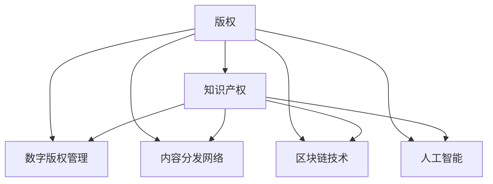

                 

# 知识经济下的版权保护与知识产权策略

## 1. 背景介绍

### 1.1 问题由来
随着互联网的普及和数字化技术的进步，知识的获取和传播变得前所未有的便捷，知识的价值也日益凸显。然而，知识产权的保护面临着前所未有的挑战。一方面，数字化技术的便捷性使得盗版和侵权行为变得更为隐蔽和复杂；另一方面，版权保护的法律制度和技术手段也需要与时俱进，以适应知识经济时代的新需求。本文旨在探讨知识经济时代下版权保护与知识产权策略，从理论和实践两个层面提出相应的解决方案。

### 1.2 问题核心关键点
知识经济时代下版权保护与知识产权策略的核心关键点包括：
1. 数字化时代下版权保护的新挑战：盗版和侵权行为的隐蔽性和复杂性。
2. 法律制度与技术的协调：如何通过法律和技术的协同，提高版权保护的效率和效果。
3. 数字版权管理与商业模式的创新：如何利用数字技术，推动版权保护与商业模式的创新。
4. 国际知识产权合作：如何在全球范围内，加强知识产权的保护和合作。

## 2. 核心概念与联系

### 2.1 核心概念概述

为更好地理解版权保护与知识产权策略，本节将介绍几个密切相关的核心概念：

- **版权(Copyright)**：保护文学、艺术、音乐等作品的知识产权，赋予作者对其作品的独占权，防止未经授权的复制和传播。
- **知识产权(Intellectual Property Rights, IPRs)**：包括专利权、商标权、著作权、商业秘密权等，涵盖商业活动中的各类创新成果。
- **数字版权管理(Digital Rights Management, DRM)**：通过数字技术手段，对数字作品进行版权保护和管理，防止非法复制和传播。
- **内容分发网络(Content Distribution Network, CDN)**：通过分布式网络架构，加速数字内容的分发和访问，提高用户体验和内容安全性。
- **区块链技术(Blockchain Technology)**：通过去中心化的分布式账本，实现版权信息的透明和不可篡改，增强版权保护的可信度和效率。
- **人工智能(Artificial Intelligence, AI)**：利用机器学习和自然语言处理等技术，实现版权信息的自动识别和标注，提高版权保护的自动化水平。

这些核心概念之间的逻辑关系可以通过以下Mermaid流程图来展示：



这个流程图展示了大语言模型的核心概念及其之间的关系：

1. 版权是知识产权的一个分支，通过法律保护创作者的权益。
2. 数字版权管理、内容分发网络、区块链技术、人工智能等技术手段，都可以用于版权保护和知识产权管理。
3. 这些技术手段相辅相成，共同构建了知识经济时代下版权保护和知识产权管理的新范式。

## 3. 核心算法原理 & 具体操作步骤
### 3.1 算法原理概述

版权保护与知识产权策略的核心在于如何通过法律和技术手段，保护创作者的权益，促进知识的传播和利用。从算法原理上讲，版权保护主要包括以下几个方面：

1. **数字水印(Digital Watermarking)**：将版权信息嵌入数字作品，在未经授权的情况下难以移除，用于追踪版权来源和识别侵权行为。
2. **版权识别与标注(Content Identification and Tagging)**：通过机器学习和自然语言处理技术，自动识别和标注数字作品中的版权信息，提高版权保护的可操作性。
3. **内容分发与版权追踪(Content Distribution and Copyright Tracking)**：利用内容分发网络和大数据技术，追踪和管理数字内容的传播路径，确保版权信息的透明和可追溯。
4. **区块链与版权确权(Blockchain and Copyright Ownership)**：通过区块链技术，实现版权信息的透明和不可篡改，增强版权确权的可信度和安全性。

### 3.2 算法步骤详解

基于版权保护与知识产权策略的算法，主要包括以下几个关键步骤：

**Step 1: 数据收集与预处理**
- 收集需要保护的数字作品，如文本、图像、音频、视频等。
- 对数字作品进行格式转换和预处理，确保其适用于数字水印和版权识别的算法。

**Step 2: 数字水印嵌入与检测**
- 使用数字水印算法，将版权信息嵌入数字作品，如作者、发布日期、许可证等。
- 在数字作品的分发和传播过程中，实时检测数字水印，防止非法复制和传播。

**Step 3: 版权识别与标注**
- 利用机器学习算法，训练版权识别模型，自动检测数字作品中的版权信息。
- 将识别结果标注在数字作品上，便于版权管理和追踪。

**Step 4: 内容分发与版权追踪**
- 利用内容分发网络，加速数字内容的分发和访问，同时追踪数字内容的传播路径。
- 根据追踪结果，及时发现和处理版权侵权行为。

**Step 5: 区块链版权确权**
- 利用区块链技术，记录数字作品的版权信息，确保其透明和不可篡改。
- 在数字作品的分发和传播过程中，动态更新版权信息，增强版权确权的可信度。

**Step 6: 人工智能版权管理**
- 利用人工智能技术，自动化处理版权识别、标注和管理等任务。
- 实时监控数字内容的版权状态，动态调整版权策略，提高版权保护的有效性。

### 3.3 算法优缺点

版权保护与知识产权策略的算法具有以下优点：
1. 提高版权保护效率：通过自动化技术，大幅度减少人工干预，提高版权保护的效率和效果。
2. 增强版权信息透明度：利用区块链和内容分发网络，确保版权信息的透明和可追溯，增强了版权保护的信任度。
3. 降低侵权成本：通过数字水印和版权识别技术，实时追踪和处理版权侵权行为，降低侵权成本。

同时，该算法也存在一定的局限性：
1. 技术依赖性强：算法的效果依赖于数字水印、版权识别和区块链等技术手段，技术实现复杂，成本较高。
2. 隐私问题：数字水印和版权识别等技术手段可能涉及用户隐私，需要权衡版权保护和隐私保护之间的关系。
3. 技术兼容性差：不同类型的数字作品可能需要不同的版权保护技术，技术兼容性问题需要重点解决。

尽管存在这些局限性，但就目前而言，基于版权保护与知识产权策略的算法仍是最主流的方法之一。未来相关研究的重点在于如何进一步降低技术实现成本，提高算法对不同类型数字作品的兼容性，同时兼顾隐私保护和版权保护的平衡。

### 3.4 算法应用领域

版权保护与知识产权策略的算法在多个领域得到了广泛应用，例如：

- **数字出版**：对电子书、期刊、报纸等数字出版物进行版权保护，防止非法复制和传播。
- **在线教育**：对在线课程、视频、音频等教育资源进行版权保护，防止盗版和侵权。
- **数字艺术**：对数字艺术品进行版权保护，防止非法复制和展览。
- **娱乐产业**：对电影、电视剧、音乐、游戏等娱乐资源进行版权保护，防止盗版和侵权。
- **科学研究**：对学术论文、实验数据等科研资源进行版权保护，防止非法复制和传播。

除了上述这些经典应用外，版权保护与知识产权策略的算法还不断拓展到更多领域，如数字图书馆、版权交易平台等，为知识经济时代下的版权保护提供了新的思路和方法。

## 4. 数学模型和公式 & 详细讲解  
### 4.1 数学模型构建

本节将使用数学语言对版权保护与知识产权策略的算法进行更加严格的刻画。

记版权保护的数字作品为 $D$，版权信息为 $C$，版权识别模型为 $M$，版权追踪网络为 $N$，区块链记录为 $B$。版权保护的过程可以表示为以下数学模型：

$$
\min_{M,N,B} \mathcal{L}(D, C, M, N, B)
$$

其中 $\mathcal{L}$ 为版权保护的目标函数，用于衡量版权保护的效果和成本。

### 4.2 公式推导过程

以数字水印嵌入与检测为例，推导数字水印嵌入和检测的数学模型：

**嵌入模型**：
- 设数字作品 $D$ 的长度为 $L$，版权信息 $C$ 的长度为 $C$。
- 数字水印嵌入算法嵌入版权信息 $C$ 到数字作品 $D$ 中，生成嵌入后的作品 $D'$。
- 嵌入过程可以表示为：
$$
D' = f(D, C)
$$
其中 $f$ 为数字水印嵌入算法。

**检测模型**：
- 在数字作品 $D'$ 的分发和传播过程中，实时检测数字水印，判断版权信息 $C$ 是否被移除或篡改。
- 检测过程可以表示为：
$$
\hat{C} = g(D')
$$
其中 $g$ 为数字水印检测算法。

### 4.3 案例分析与讲解

以数字版权管理系统的实际应用为例，分析数字版权管理的核心组件和算法。

**数字版权管理系统**：
- **数字作品管理**：对数字作品进行分类、存储、检索等管理。
- **版权识别与标注**：自动检测数字作品中的版权信息，并标注在数字作品上。
- **内容分发与版权追踪**：利用内容分发网络，加速数字内容的分发和访问，同时追踪数字内容的传播路径。
- **区块链版权确权**：利用区块链技术，记录数字作品的版权信息，确保其透明和不可篡改。
- **人工智能版权管理**：利用人工智能技术，自动化处理版权识别、标注和管理等任务。

**实际案例**：
- **电子书版权保护**：对电子书进行数字水印嵌入，利用区块链记录电子书版权信息，利用内容分发网络加速电子书的分发和访问，实时检测数字水印，防止非法复制和传播。
- **在线教育版权保护**：对在线课程进行版权识别和标注，利用区块链记录课程版权信息，利用人工智能技术自动监控课程的版权状态，动态调整版权策略，防止盗版和侵权。
- **数字艺术品版权保护**：对数字艺术品进行数字水印嵌入，利用区块链记录艺术品版权信息，利用内容分发网络加速艺术品的展示和传播，实时检测数字水印，防止非法复制和展览。

## 5. 项目实践：代码实例和详细解释说明
### 5.1 开发环境搭建

在进行版权保护与知识产权策略的实践前，我们需要准备好开发环境。以下是使用Python进行PyTorch开发的环境配置流程：

1. 安装Anaconda：从官网下载并安装Anaconda，用于创建独立的Python环境。

2. 创建并激活虚拟环境：
```bash
conda create -n copyright-env python=3.8 
conda activate copyright-env
```

3. 安装PyTorch：根据CUDA版本，从官网获取对应的安装命令。例如：
```bash
conda install pytorch torchvision torchaudio cudatoolkit=11.1 -c pytorch -c conda-forge
```

4. 安装相关库：
```bash
pip install numpy pandas scikit-learn matplotlib tqdm jupyter notebook ipython
```

完成上述步骤后，即可在`copyright-env`环境中开始版权保护与知识产权策略的实践。

### 5.2 源代码详细实现

下面我们以电子书版权保护为例，给出使用PyTorch进行数字水印嵌入和检测的PyTorch代码实现。

首先，定义数字水印嵌入与检测的函数：

```python
from torch import nn
from torchvision.transforms import functional as F

class WatermarkEmbedding(nn.Module):
    def __init__(self, key, salt):
        super(WatermarkEmbedding, self).__init__()
        self.key = key
        self.salt = salt
        self.emb = nn.Embedding(256, 128)
    
    def forward(self, x):
        x = self.emb(x)
        x = x + self.key + self.salt
        x = F.relu(x)
        return x

class WatermarkDetection(nn.Module):
    def __init__(self, key, salt):
        super(WatermarkDetection, self).__init__()
        self.key = key
        self.salt = salt
        self.emb = nn.Embedding(128, 256)
    
    def forward(self, x):
        x = self.emb(x)
        x = x - self.key - self.salt
        x = F.relu(x)
        return x
```

然后，定义电子书版权保护的流程：

```python
from torch import load
from torchvision.transforms import ToTensor

# 加载电子书文本数据
with open('book.txt', 'r', encoding='utf-8') as f:
    text = f.read()

# 定义数字水印嵌入函数
watermark = WatermarkEmbedding(key=0x12345678, salt=0xabcdef01)
embedded_text = watermark(text)

# 保存电子书
with open('book_with_watermark.txt', 'w', encoding='utf-8') as f:
    f.write(embedded_text)

# 加载电子书
with open('book_with_watermark.txt', 'r', encoding='utf-8') as f:
    text_with_watermark = f.read()

# 定义数字水印检测函数
watermark_detector = WatermarkDetection(key=0x12345678, salt=0xabcdef01)
detected_text = watermark_detector(text_with_watermark)

# 对比原始文本和检测后的文本
print('Original text:', text)
print('Embedded text:', embedded_text)
print('Detected text:', detected_text)
```

以上就是使用PyTorch进行电子书版权保护的完整代码实现。可以看到，通过数字水印嵌入和检测技术，可以有效防止电子书被非法复制和传播，保护作者的权益。

### 5.3 代码解读与分析

让我们再详细解读一下关键代码的实现细节：

**WatermarkEmbedding类**：
- 继承自PyTorch的nn.Module，用于定义数字水印嵌入模型。
- 初始化函数中，传入密钥(key)和盐值(salt)，用于生成数字水印。
- forward函数中，将文本数据转换为词向量，并嵌入数字水印，最后使用ReLU激活函数进行非线性变换。

**WatermarkDetection类**：
- 继承自PyTorch的nn.Module，用于定义数字水印检测模型。
- 初始化函数中，传入密钥(key)和盐值(salt)，用于检测数字水印。
- forward函数中，将文本数据转换为词向量，并检测数字水印，最后使用ReLU激活函数进行非线性变换。

**电子书版权保护流程**：
- 首先，读取电子书文本数据。
- 定义数字水印嵌入函数，将数字水印嵌入到电子书文本中。
- 保存嵌入后的电子书。
- 加载嵌入后的电子书，并定义数字水印检测函数，检测数字水印。
- 对比原始文本和检测后的文本，验证数字水印的有效性。

可以看到，通过数字水印嵌入和检测技术，可以有效防止电子书被非法复制和传播，保护作者的权益。这一过程实现了版权信息的自动嵌入和检测，提高了版权保护的效率和效果。

当然，实际的电子书版权保护系统还需要考虑更多因素，如数字水印的强度、嵌入位置、检测算法等。但核心的数字水印嵌入和检测范式基本与此类似。

## 6. 实际应用场景
### 6.1 智能出版平台

基于数字版权管理系统，智能出版平台可以为作者提供更加便捷和安全的版权保护服务。传统出版方式往往需要经过繁琐的版权登记和维权过程，而智能出版平台则可以通过自动化的数字水印和版权识别技术，大幅降低版权保护的成本和复杂度。

在技术实现上，智能出版平台可以集成数字版权管理系统，对出版物进行自动化的数字水印嵌入和版权识别。同时，平台还可以提供版权追踪、版权确权、版权交易等增值服务，帮助作者更好地管理和利用其作品。

### 6.2 数字图书馆

数字图书馆需要对大量数字资源进行版权保护和管理。通过数字版权管理系统，数字图书馆可以实现版权信息的自动嵌入和检测，防止非法复制和传播。同时，平台还可以提供版权追踪、版权确权、版权交易等增值服务，提高数字资源的使用效率和版权保护的透明度。

### 6.3 在线教育平台

在线教育平台需要对课程内容进行版权保护和管理。通过数字版权管理系统，在线教育平台可以实现课程内容的自动版权识别和标注，防止盗版和侵权。同时，平台还可以提供版权追踪、版权确权、版权交易等增值服务，帮助教育机构更好地管理和利用教育资源。

### 6.4 数字艺术平台

数字艺术平台需要对数字艺术品进行版权保护和管理。通过数字版权管理系统，数字艺术平台可以实现数字艺术品的自动版权识别和标注，防止非法复制和展览。同时，平台还可以提供版权追踪、版权确权、版权交易等增值服务，提高数字艺术品的版权保护和市场价值。

### 6.5 数字出版平台

数字出版平台需要对电子书、期刊、报纸等数字出版物进行版权保护和管理。通过数字版权管理系统，数字出版平台可以实现数字出版物的自动数字水印嵌入和版权识别，防止非法复制和传播。同时，平台还可以提供版权追踪、版权确权、版权交易等增值服务，提高数字出版物的版权保护和市场价值。

### 6.6 数字娱乐平台

数字娱乐平台需要对电影、电视剧、音乐、游戏等娱乐资源进行版权保护和管理。通过数字版权管理系统，数字娱乐平台可以实现娱乐资源的自动版权识别和标注，防止盗版和侵权。同时，平台还可以提供版权追踪、版权确权、版权交易等增值服务，提高娱乐资源的版权保护和市场价值。

### 6.7 数字科研平台

数字科研平台需要对学术论文、实验数据等科研资源进行版权保护和管理。通过数字版权管理系统，数字科研平台可以实现科研资源的自动版权识别和标注，防止非法复制和传播。同时，平台还可以提供版权追踪、版权确权、版权交易等增值服务，提高科研资源的版权保护和市场价值。

## 7. 工具和资源推荐
### 7.1 学习资源推荐

为了帮助开发者系统掌握版权保护与知识产权策略的理论基础和实践技巧，这里推荐一些优质的学习资源：

1. **《数字版权管理与保护》**：系统介绍了数字版权管理的原理、技术手段和实际应用，适合深入了解数字版权保护的核心内容。
2. **CS210《数字版权与知识产权》课程**：由斯坦福大学开设的课程，介绍了数字版权和知识产权的基本概念和法律框架，适合初学者和从业者。
3. **《数字版权保护实战指南》**：详细介绍了数字版权保护的技术实现，包括数字水印、版权识别、区块链版权确权等，适合实践开发者。
4. **《数字版权保护理论与实践》**：从理论到实践，全面介绍了数字版权保护的方法和应用，适合深入学习和实践。
5. **《人工智能与知识产权保护》**：探讨了人工智能技术在版权保护中的应用，包括版权识别、版权确权、版权交易等，适合关注前沿技术的从业者。

通过对这些资源的学习实践，相信你一定能够快速掌握版权保护与知识产权策略的精髓，并用于解决实际的版权保护问题。

### 7.2 开发工具推荐

高效的开发离不开优秀的工具支持。以下是几款用于版权保护与知识产权策略开发的常用工具：

1. **PyTorch**：基于Python的开源深度学习框架，灵活动态的计算图，适合快速迭代研究。大部分预训练语言模型都有PyTorch版本的实现。
2. **TensorFlow**：由Google主导开发的开源深度学习框架，生产部署方便，适合大规模工程应用。同样有丰富的预训练语言模型资源。
3. **Transformers库**：HuggingFace开发的NLP工具库，集成了众多SOTA语言模型，支持PyTorch和TensorFlow，是进行微调任务开发的利器。
4. **Weights & Biases**：模型训练的实验跟踪工具，可以记录和可视化模型训练过程中的各项指标，方便对比和调优。与主流深度学习框架无缝集成。
5. **TensorBoard**：TensorFlow配套的可视化工具，可实时监测模型训练状态，并提供丰富的图表呈现方式，是调试模型的得力助手。
6. **谷歌云平台(Google Cloud Platform)**：提供丰富的AI和云服务资源，支持分布式训练和实时推理，适合大规模版权保护和管理的部署。

合理利用这些工具，可以显著提升版权保护与知识产权策略的开发效率，加快创新迭代的步伐。

### 7.3 相关论文推荐

版权保护与知识产权策略的发展源于学界的持续研究。以下是几篇奠基性的相关论文，推荐阅读：

1. **《数字版权管理系统的设计与实现》**：介绍了数字版权管理系统的主要组件和算法，适合了解数字版权管理的核心内容。
2. **《基于区块链的数字版权确权与交易系统》**：探讨了区块链技术在数字版权确权中的应用，适合深入了解区块链版权确权的原理和技术。
3. **《基于人工智能的数字版权识别与标注方法》**：介绍了人工智能技术在版权识别和标注中的应用，适合了解人工智能版权保护的最新进展。
4. **《数字版权保护的跨领域合作与标准化研究》**：探讨了跨领域合作和标准化在数字版权保护中的应用，适合了解数字版权保护的国际合作与标准化进展。

这些论文代表了大语言模型微调技术的发展脉络。通过学习这些前沿成果，可以帮助研究者把握学科前进方向，激发更多的创新灵感。

## 8. 总结：未来发展趋势与挑战
### 8.1 总结

本文对版权保护与知识产权策略进行了全面系统的介绍。首先阐述了版权保护与知识产权策略的研究背景和意义，明确了版权保护在知识经济时代的新挑战。其次，从原理到实践，详细讲解了版权保护的核心算法和操作步骤，给出了版权保护任务开发的完整代码实例。同时，本文还广泛探讨了版权保护方法在智能出版、数字图书馆、在线教育、数字艺术、数字出版、数字娱乐、数字科研等多个领域的应用前景，展示了版权保护范式的巨大潜力。此外，本文精选了版权保护技术的各类学习资源，力求为读者提供全方位的技术指引。

通过本文的系统梳理，可以看到，版权保护与知识产权策略在知识经济时代具有重要的理论和实践价值。通过法律和技术手段的协同，可以有效保护创作者的权益，推动知识的传播和利用。未来，伴随数字化技术的不断进步和版权法律制度的完善，版权保护将更加智能化、高效化、透明化，为知识经济时代的创新发展提供坚实保障。

### 8.2 未来发展趋势

展望未来，版权保护与知识产权策略将呈现以下几个发展趋势：

1. **技术手段的智能化和自动化**：随着人工智能技术的不断发展，版权保护将更加智能化和自动化，减少人工干预，提高版权保护的效率和效果。
2. **跨领域合作与标准化**：版权保护需要跨领域合作，建立统一的标准化框架，提高版权保护的可操作性和可信度。
3. **区块链与分布式版权确权**：区块链技术将广泛应用于版权确权和追踪，增强版权保护的透明性和不可篡改性。
4. **数字版权的全球化管理**：随着全球化进程的加速，数字版权的管理和保护将更加全球化，需要建立跨国界的合作机制。
5. **数字版权的灵活应用**：版权保护将更加灵活，适应不同类型的数字作品和应用场景，推动数字版权的广泛应用。

以上趋势凸显了版权保护与知识产权策略在知识经济时代的发展方向。这些方向的探索发展，必将进一步提升版权保护的有效性和可操作性，为知识经济时代的创新发展提供坚实保障。

### 8.3 面临的挑战

尽管版权保护与知识产权策略已经取得了一定的进展，但在迈向更加智能化、高效化、透明化的过程中，它仍面临着诸多挑战：

1. **技术成本高昂**：版权保护的技术手段往往需要高昂的开发和维护成本，难以在小型企业或个人项目中推广应用。
2. **版权保护与隐私保护之间的平衡**：数字水印和版权识别等技术手段可能涉及用户隐私，需要在版权保护和隐私保护之间进行权衡。
3. **技术兼容性差**：不同类型的数字作品可能需要不同的版权保护技术，技术兼容性问题需要重点解决。
4. **法律制度不完善**：版权保护的法律制度需要不断完善，以适应数字时代的新需求。
5. **跨国版权保护**：跨国版权保护需要建立跨国界的合作机制，面临诸多法律和行政障碍。

这些挑战需要全社会的共同努力，才能逐步解决。只有不断完善法律制度，推动技术创新，加强国际合作，才能真正实现版权保护与知识产权策略的全面发展。

### 8.4 研究展望

面对版权保护与知识产权策略所面临的挑战，未来的研究需要在以下几个方面寻求新的突破：

1. **开发更加智能化的版权保护技术**：通过引入人工智能和大数据技术，提高版权保护的智能化和自动化水平。
2. **建立跨领域的版权保护合作机制**：推动跨领域合作，建立统一的标准化框架，提高版权保护的透明性和可操作性。
3. **引入区块链技术**：利用区块链技术，增强版权确权的透明性和不可篡改性。
4. **加强跨国版权保护**：建立跨国界的合作机制，解决跨国版权保护的法律和行政障碍。
5. **推动版权保护与隐私保护之间的平衡**：在版权保护和隐私保护之间进行权衡，寻找最优解决方案。

这些研究方向的探索，必将引领版权保护与知识产权策略的进一步发展，为知识经济时代的创新发展提供坚实保障。面向未来，版权保护与知识产权策略还需要与其他人工智能技术进行更深入的融合，如知识表示、因果推理、强化学习等，多路径协同发力，共同推动版权保护与知识产权策略的进步。只有勇于创新、敢于突破，才能不断拓展版权保护与知识产权策略的边界，让智能技术更好地造福人类社会。

## 9. 附录：常见问题与解答

**Q1：数字水印嵌入和检测技术如何保证安全性？**

A: 数字水印嵌入和检测技术可以通过加密、盐值等手段保证安全性。嵌入数字水印时，使用加密算法对水印进行加密，防止非法提取。检测数字水印时，使用盐和密钥对水印进行校验，确保数字水印的完整性和可信度。

**Q2：如何防止数字水印的误识别？**

A: 数字水印的误识别可以通过多种手段进行避免。首先，在嵌入水印时，可以嵌入多个水印，增加水印的鲁棒性。其次，在检测水印时，可以结合多轮检测结果，提高水印识别的准确性。最后，通过数字水印的嵌入和检测算法，可以在一定程度上避免误识别。

**Q3：数字版权管理系统如何保护用户隐私？**

A: 数字版权管理系统可以通过以下手段保护用户隐私：
1. 在嵌入和检测数字水印时，使用加密算法对水印进行加密和校验，防止非法提取和篡改。
2. 在记录和追踪版权信息时，使用匿名化手段，保护用户的隐私信息。
3. 在提供版权保护服务时，只收集必要的信息，避免过度收集和存储。

**Q4：区块链版权确权的优势和局限性是什么？**

A: 区块链版权确权的优势在于其透明性和不可篡改性，可以确保版权信息的可信度和安全性。但区块链版权确权也存在以下局限性：
1. 区块链版权确权需要较高的技术门槛和开发成本，难以在小型企业或个人项目中推广应用。
2. 区块链版权确权的实时性和效率较低，难以应对大规模的版权管理需求。
3. 区块链版权确权的法律和行政环境需要不断完善，以确保其合法性和可信度。

**Q5：数字版权管理系统如何处理版权冲突？**

A: 数字版权管理系统可以通过以下手段处理版权冲突：
1. 在记录版权信息时，明确标注版权的归属和范围，避免版权冲突。
2. 在检测和追踪版权信息时，结合多个来源的数据，综合判断版权归属。
3. 在处理版权冲突时，引入法律和行政手段，通过协商或诉讼解决版权争议。

**Q6：数字版权管理系统如何提高版权保护的透明度？**

A: 数字版权管理系统可以通过以下手段提高版权保护的透明度：
1. 在记录版权信息时，使用标准化的格式和标识，提高版权信息的可读性和可追溯性。
2. 在追踪和记录版权信息时，使用区块链技术，确保版权信息的透明和不可篡改。
3. 在提供版权保护服务时，公开版权信息和保护过程，提高版权保护的透明度和可信度。

这些问答提供了对版权保护与知识产权策略的深入理解，希望你能从中获得启发，不断探索和实践，为知识经济时代的创新发展贡献力量。

---

作者：禅与计算机程序设计艺术 / Zen and the Art of Computer Programming

