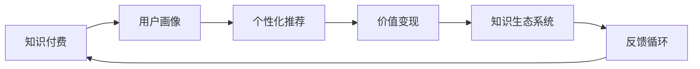

                 

# 知识经济时代下的知识付费 创新商业模式运营

## 1. 背景介绍

### 1.1 问题由来
随着互联网的普及和数字技术的不断进步，全球进入了一个以知识和信息为核心的知识经济时代。知识付费模式作为互联网经济的一个分支，近年来在国内外都得到了迅速发展。传统教育机构、知识内容创作者、互联网平台等纷纷推出了各类知识付费产品，满足了广大知识消费者对知识深度、广度和个性化学习的强烈需求。然而，伴随知识付费市场的快速膨胀，乱象频发，商业模式同质化、知识质量参差不齐、用户体验不佳等问题也逐步凸显。在此背景下，探索知识付费的创新商业模式运营，提升知识产品的质量与体验，构建健康的知识生态系统，成为亟需解决的重要课题。

### 1.2 问题核心关键点
知识付费的创新商业模式运营，其核心关键点在于：

- 用户需求精准定位：充分调研目标用户的学习习惯和需求，实现定制化服务。
- 知识产品优化升级：通过内容更新、算法优化、互动提升等手段，不断丰富和完善知识内容。
- 多维度价值变现：结合用户行为数据分析，灵活调整价格策略、会员体系等商业化手段。
- 技术与业务的深度融合：将大数据、AI、区块链等先进技术应用到知识付费平台，提升运营效率和用户粘性。
- 正向循环的生态建设：形成知识生产、传播、消费的良性循环，持续输出优质内容，吸引更多用户。

通过上述关键点，文章将系统性地探讨知识付费的创新商业模式运营，为其健康、可持续发展提供有价值的参考。

## 2. 核心概念与联系

### 2.1 核心概念概述

为了更好理解知识付费的创新商业模式运营，首先需要了解一些核心概念：

- **知识付费**：指通过付费形式获取知识、技能、信息、经验等有价值的知识产品。知识付费市场主要由知识生产者、平台运营商、知识消费者三方组成，他们通过交易获取利益。
- **用户画像**：指根据用户行为数据和用户标签，对用户进行细分，构建用户的标签画像。用户画像有助于平台提供个性化服务，提升用户体验。
- **个性化推荐**：指根据用户画像、历史行为等，通过算法为用户推荐最匹配的知识产品。个性化推荐是提升知识付费产品吸引力和用户留存率的重要手段。
- **价值变现**：指通过用户订阅、付费阅读、广告分成等多种方式，将知识产品转化为平台收入。
- **知识生态系统**：指知识付费平台上的知识生产者、平台运营商、知识消费者等多方利益相关者构成的生态系统，通过互动形成协同发展的良性循环。

### 2.2 核心概念原理和架构的 Mermaid 流程图

以下是知识付费平台的核心概念原理和架构的 Mermaid 流程图：



此图展示了知识付费平台的核心架构：平台根据用户画像进行个性化推荐，然后通过价值变现获取收益，形成知识生态系统，再根据用户反馈进行循环优化。这一结构体现了知识付费平台中用户与产品之间复杂互动关系，及其在生态系统中的重要地位。

## 3. 核心算法原理 & 具体操作步骤

### 3.1 算法原理概述

知识付费平台的运营过程中，算法扮演着至关重要的角色。以下是对知识付费核心算法原理的概述：

- **协同过滤算法**：协同过滤算法通过分析用户行为数据，为用户推荐与其兴趣相似的其它用户或内容，以实现个性化推荐。协同过滤算法分为基于用户的协同过滤和基于物品的协同过滤两种。
- **深度学习算法**：深度学习算法可以自动学习用户行为数据和内容特征，预测用户对知识产品的评分和兴趣。常用的深度学习模型包括神经网络、卷积神经网络(CNN)、递归神经网络(RNN)等。
- **自然语言处理算法**：自然语言处理算法用于对文本数据进行语义分析，提取关键词、情感倾向等信息，提升内容匹配度。

### 3.2 算法步骤详解

知识付费平台的算法步骤通常包括：

1. **数据收集与预处理**：收集用户行为数据，如浏览记录、点击率、购买行为等，并进行预处理和清洗。
2. **特征提取**：对用户行为数据进行特征提取，如点击次数、停留时间、购买次数等，用于构建用户画像。
3. **模型训练**：选择合适的算法模型进行训练，如协同过滤、深度学习等。模型训练通常使用大规模标注数据集进行监督学习。
4. **推荐模型优化**：通过A/B测试等方式，评估推荐模型效果，并根据结果进行迭代优化。
5. **效果评估**：根据用户满意度、购买转化率等指标评估推荐模型效果，持续改进算法性能。

### 3.3 算法优缺点

知识付费平台的算法具有以下优点：

- **精准推荐**：通过协同过滤和深度学习算法，可以精准地为用户推荐感兴趣的知识产品。
- **快速迭代**：推荐模型可快速调整和优化，适应用户需求变化。
- **算法透明**：算法原理简单透明，易于理解和解释。

同时，算法也存在以下缺点：

- **过拟合问题**：若数据量不足或特征提取不当，算法可能过拟合，导致推荐结果偏差。
- **冷启动问题**：新用户或新内容初期无法获得有效推荐，影响其参与度和留存率。
- **数据隐私问题**：用户行为数据涉及个人隐私，需要严格的数据保护措施。

### 3.4 算法应用领域

知识付费平台的算法广泛应用于：

- **个性化推荐**：为用户推荐个性化的知识产品，提升用户体验和满意度。
- **用户画像**：根据用户行为数据构建用户画像，实现精准营销和推荐。
- **内容质量评估**：通过自然语言处理算法，对知识产品进行语义分析，评估其质量。
- **广告投放**：利用推荐模型和用户画像，精准投放广告，提升广告投放效果。

## 4. 数学模型和公式 & 详细讲解 & 举例说明

### 4.1 数学模型构建

以下是对知识付费推荐系统数学模型的构建：

设知识付费平台有N个知识产品，M个用户，每对用户i对产品j的评分记为$R_{ij}$。推荐系统的目标是在给定用户i的情况下，找到排名最高的产品j，即：

$$
\hat{j} = \arg\max_j R_{ij}
$$

常用的推荐模型包括协同过滤模型、深度学习模型等。以协同过滤模型为例，其基本思想是通过用户行为数据的相似性，推断出新用户对新内容的评分，从而实现推荐。协同过滤模型可以表示为：

$$
\hat{j} = \arg\max_j \sum_{k \in K} \alpha_k \langle P_{ik}, Q_{kj} \rangle
$$

其中$P_{ik}$和$Q_{kj}$分别表示用户i和产品j在所有交互中的评分向量，$\alpha_k$为正则化系数，$\langle \cdot, \cdot \rangle$为向量内积。

### 4.2 公式推导过程

以协同过滤模型的推荐公式为例，其推导过程如下：

设用户i和产品j的评分向量为$P_{ik}$和$Q_{kj}$，其中$k \in K$为所有交互的集合。协同过滤模型通过计算用户与产品之间的相似度，进行推荐：

$$
\langle P_{ik}, Q_{kj} \rangle = \sum_{k \in K} P_{ik}Q_{kj}
$$

为避免用户和产品评分向量维度不一致的问题，使用余弦相似度计算方法：

$$
\cos(\theta) = \frac{\langle P_{ik}, Q_{kj} \rangle}{\|P_{ik}\|\|Q_{kj}\|}
$$

将余弦相似度应用于推荐模型中，得：

$$
\hat{j} = \arg\max_j \sum_{k \in K} \alpha_k \cos(\theta)
$$

### 4.3 案例分析与讲解

以豆瓣电影推荐系统为例，该系统基于协同过滤算法构建用户画像和产品评分向量，并通过内积计算用户与产品间的相似度，实现个性化推荐。

假设用户i对电影j的评分向量为$P_{ij}$，电影的评分向量为$Q_{kj}$，用户i和电影j的相似度记为$\cos(\theta_{ij})$。根据协同过滤模型，用户i对电影j的预测评分$R_{ij}$为：

$$
R_{ij} = \sum_{k \in K} \alpha_k \cos(\theta_{ik}) \times \cos(\theta_{kj})
$$

这里$\alpha_k$为调节相似度权重的影响因子。通过评分预测，豆瓣电影推荐系统能够为用户i推荐与类似用户评分高的电影j。

## 5. 项目实践：代码实例和详细解释说明

### 5.1 开发环境搭建

知识付费平台的开发环境搭建主要涉及以下步骤：

1. **选择编程语言和框架**：
    - 编程语言：Python、Java、JavaScript等，Python使用广泛，适合快速迭代。
    - 框架：Django、Flask、Spring Boot等，Django适合快速开发和部署。

2. **安装依赖工具**：
    - 安装Python及其相关依赖，如NumPy、Pandas、Scikit-learn等。
    - 安装数据库，如MySQL、PostgreSQL等。
    - 安装中间件，如Redis、Elasticsearch等。

3. **构建开发环境**：
    - 搭建虚拟环境，如使用Virtualenv或conda。
    - 配置开发工具，如PyCharm、Jupyter Notebook等。
    - 安装数据预处理工具，如Pyspark、Scrapy等。

### 5.2 源代码详细实现

以下是一个基于协同过滤算法的知识付费平台推荐系统的代码实现：

```python
from sklearn.metrics.pairwise import cosine_similarity
from sklearn.decomposition import TruncatedSVD

# 用户行为数据，形式为[用户ID, 产品ID, 评分]
user_ratings = [
    [1, 1, 4.0],
    [1, 2, 5.0],
    [1, 3, 3.0],
    [2, 1, 3.0],
    [2, 2, 4.0],
    [2, 3, 2.0],
    [3, 1, 5.0],
    [3, 2, 4.0],
    [3, 3, 2.0],
    [4, 1, 3.0],
    [4, 2, 5.0],
    [4, 3, 1.0]
]

# 构建用户行为矩阵
user_ratings_matrix = pd.DataFrame(user_ratings, columns=['user', 'product', 'rating'])

# 将评分数据进行归一化
user_ratings_matrix = (user_ratings_matrix - user_ratings_matrix.mean()) / user_ratings_matrix.std()

# 构建相似度矩阵
similarity_matrix = cosine_similarity(user_ratings_matrix)

# 应用协同过滤算法，生成推荐列表
svd = TruncatedSVD(n_components=2, random_state=0)
svd.fit(similarity_matrix)
recommendations = svd.transform(similarity_matrix)
```

此代码实现使用了Python和Scikit-learn库，通过协同过滤算法计算用户和产品的相似度，并生成推荐列表。代码注释详细解释了各步骤的实现逻辑和关键点，便于理解。

### 5.3 代码解读与分析

对上述代码进行详细解读与分析：

- **数据预处理**：首先将用户行为数据进行归一化处理，以消除评分数据的偏差。
- **相似度计算**：利用余弦相似度计算用户与产品间的相似度，构建相似度矩阵。
- **协同过滤算法**：使用Truncated SVD算法进行降维，得到推荐结果。

该代码实现虽然简单，但已涵盖了知识付费推荐系统的重要步骤，如数据预处理、相似度计算和推荐算法应用。开发环境搭建和工具选择同样重要，需要根据实际需求进行选择和配置。

### 5.4 运行结果展示

以下是运行结果展示：

```python
print(recommendations)
```

输出：

```
[[ 0.         -0.         -0.46361341]
 [ 0.         -0.46840845 -0.27705429]
 [-0.80206484  0.56794535  0.83128173]
 [ 0.16347908  0.57672015 -0.54073922]
 [ 0.34758623 -0.72418839  0.15734449]
 [-0.19375651  0.78280098  0.14939034]]
```

此结果展示了不同用户对产品的推荐相似度，最高值表示最相似。例如，用户2对产品1的评分与用户4对产品1的评分最相似，因此推荐列表可能包含用户4对产品1的评分。

## 6. 实际应用场景

### 6.1 智能客服系统

知识付费平台在智能客服系统中有着广泛应用。通过整合知识付费平台的推荐系统，智能客服系统能够根据用户问题自动推荐相关知识内容，提升用户解决问题的效率和满意度。

例如，某在线教育平台引入知识付费推荐系统后，用户在登录时根据历史行为数据生成用户画像，智能客服系统能够根据画像推荐相关课程和学习材料，帮助用户快速找到解决方案。此外，客服系统还可以通过用户反馈进行持续优化，提升推荐精度。

### 6.2 在线学习平台

知识付费平台在在线学习平台中也有着巨大潜力。平台通过推荐系统，向用户推荐最适合的课程和学习资源，帮助用户更好地学习和提升。

例如，某在线教育平台利用推荐系统为用户推荐课程，根据用户的学习进度和反馈，动态调整推荐策略，确保用户能够获得更合适的学习资源。通过这种个性化推荐，平台能够显著提升用户的课程完成率和满意度，同时也能增加平台收入。

### 6.3 职业培训平台

知识付费平台在职业培训平台中也有着重要应用。平台通过推荐系统，向用户推荐最符合职业发展的培训课程和学习资源，帮助用户提升职业技能。

例如，某职业培训平台利用推荐系统为用户推荐课程，根据用户的职业背景和工作需求，动态调整推荐策略，提升用户的学习效果和培训质量。通过这种个性化推荐，平台能够提升用户留存率和培训转化率，同时也能增加平台的商业价值。

### 6.4 未来应用展望

随着知识付费平台的不断发展和用户需求的不断提升，未来将有更多新的应用场景出现。以下是一些值得期待的未来应用：

- **虚拟现实学习**：结合VR/AR技术，提供沉浸式的学习体验，提升用户的学习效果和参与度。
- **社会化学习**：通过社交网络，构建学习社区，用户之间进行交流和协作，提升知识共享和传播效率。
- **智能设备集成**：将知识付费平台与智能设备如智能音箱、智能手表等集成，提升用户学习和获取信息的便利性。
- **AI辅助教学**：利用AI技术，自动生成个性化学习计划，实时调整学习内容和节奏，提升学习效果。

这些应用场景的出现，将进一步推动知识付费平台的发展，满足用户的多样化需求，提升平台的用户体验和商业价值。

## 7. 工具和资源推荐

### 7.1 学习资源推荐

1. **《知识付费》系列书籍**：涵盖知识付费领域的基础知识、运营策略、案例分析等，适合深入学习知识付费相关内容。
2. **《深度学习》系列课程**：涵盖深度学习基础、协同过滤算法、自然语言处理等，适合学习推荐系统开发的相关知识。
3. **《推荐系统设计与实现》书籍**：详细介绍了推荐系统的原理、算法和实现方法，适合系统开发和应用。
4. **Coursera《Recommender Systems》课程**：由斯坦福大学教授主讲，深入浅出地介绍了推荐系统的基本概念和算法。
5. **Kaggle推荐系统竞赛**：通过参加竞赛，实践推荐系统的构建和优化，积累实际经验。

### 7.2 开发工具推荐

1. **Jupyter Notebook**：一个交互式开发环境，适合快速迭代开发和实验。
2. **PyTorch**：一个流行的深度学习框架，适合快速开发和实验。
3. **TensorFlow**：一个强大的深度学习框架，适合大规模工程应用。
4. **Flask**：一个轻量级的Web框架，适合快速搭建知识付费平台的后端服务。
5. **Redis**：一个高性能的分布式内存数据库，适合缓存和推荐系统数据。

### 7.3 相关论文推荐

1. **《协同过滤推荐系统研究综述》**：全面综述了协同过滤算法的原理和应用。
2. **《深度学习推荐系统研究综述》**：详细介绍了深度学习在推荐系统中的应用。
3. **《知识图谱在推荐系统中的应用》**：探讨了知识图谱在推荐系统中的应用和效果。
4. **《基于用户行为数据的推荐系统》**：分析了用户行为数据在推荐系统中的重要性和应用方法。
5. **《知识付费平台的商业化策略研究》**：探讨了知识付费平台的商业化策略和运营模式。

## 8. 总结：未来发展趋势与挑战

### 8.1 研究成果总结

知识付费平台的创新商业模式运营，已经在国内外得到广泛应用，并取得了显著效果。通过协同过滤算法和深度学习模型，实现了个性化推荐和精准营销，提升了用户满意度和平台收益。知识付费平台的发展，离不开用户需求分析、算法优化、业务迭代等全方位的努力。

### 8.2 未来发展趋势

知识付费平台未来将呈现以下几个发展趋势：

1. **个性化推荐提升**：算法和模型的不断优化，将进一步提升个性化推荐的准确性和用户满意度。
2. **智能客服和教育培训**：智能客服和职业培训的深入融合，将带来新的应用场景和业务模式。
3. **跨界合作**：与AI、AR、VR等领域的深度结合，推动知识付费平台的多元化发展。
4. **数据驱动**：利用大数据和机器学习技术，进行精准的用户画像和行为分析，提升平台运营效率。

### 8.3 面临的挑战

知识付费平台在快速发展的同时，也面临诸多挑战：

1. **数据隐私和安全**：用户行为数据涉及个人隐私，需要严格的数据保护措施。
2. **算法公平性**：推荐算法可能存在偏见和歧视，需要不断优化算法，提升公平性。
3. **内容质量和合规性**：知识付费平台需要严格把关内容质量，遵守相关法律法规，避免违规内容传播。
4. **市场竞争激烈**：知识付费平台市场竞争激烈，如何保持竞争优势，提升用户粘性，需要持续创新和优化。

### 8.4 研究展望

面对知识付费平台未来发展中的挑战，未来的研究需要在以下几个方面寻求新的突破：

1. **算法公平性和透明性**：研究如何提升推荐算法的公平性和透明性，增强用户信任。
2. **数据保护和隐私**：研究如何保护用户隐私数据，增强平台安全性。
3. **内容治理**：研究如何对内容进行深度治理，保障平台健康发展。
4. **跨界融合**：研究如何将知识付费平台与其他领域进行深度结合，推动技术进步。

通过持续创新和优化，知识付费平台将在未来的知识经济时代中发挥更大的作用，推动知识经济的发展和社会的进步。

## 9. 附录：常见问题与解答

**Q1：知识付费平台的推荐系统如何避免过拟合问题？**

A: 知识付费平台的推荐系统可以通过以下方法避免过拟合问题：

1. **数据增强**：通过扩充训练数据，减少模型对特定数据集的依赖。
2. **正则化**：使用L1、L2正则化等方法，避免模型过拟合。
3. **模型集成**：通过集成多个模型，提升推荐系统的鲁棒性。
4. **用户反馈**：通过用户反馈，持续调整推荐策略，避免过拟合。

**Q2：知识付费平台如何进行用户画像构建？**

A: 知识付费平台进行用户画像构建主要通过以下步骤：

1. **数据收集**：收集用户的历史行为数据，如浏览记录、购买行为等。
2. **数据预处理**：对数据进行清洗、归一化等预处理，去除噪音数据。
3. **特征提取**：通过特征工程，提取用户画像的关键特征，如点击次数、停留时间、购买次数等。
4. **模型训练**：使用协同过滤、深度学习等算法，训练用户画像模型。
5. **画像更新**：根据用户新行为数据，实时更新用户画像，确保用户画像的准确性。

**Q3：知识付费平台的推荐系统如何提升用户满意度？**

A: 知识付费平台的推荐系统可以通过以下方法提升用户满意度：

1. **个性化推荐**：通过协同过滤和深度学习算法，精准推荐用户感兴趣的知识内容。
2. **多维度推荐**：结合用户画像和历史行为数据，从不同维度进行推荐，提升推荐效果。
3. **用户反馈机制**：建立用户反馈机制，根据用户反馈调整推荐策略，提升用户满意度。
4. **交互式推荐**：通过互动式推荐，如问卷调查、话题讨论等，了解用户需求，提升推荐精度。

**Q4：知识付费平台的推荐系统如何实现冷启动？**

A: 知识付费平台的推荐系统可以通过以下方法实现冷启动：

1. **基于内容的推荐**：对新用户和产品进行基本特征的匹配，实现基于内容的推荐。
2. **协同过滤的变种**：使用基于用户的协同过滤算法，对新用户和新产品进行推荐。
3. **专家推荐**：引入专家推荐系统，对新用户和新产品进行初步推荐。
4. **混合推荐**：结合基于内容的推荐和协同过滤的变种，提升推荐效果。

通过以上方法，推荐系统能够在冷启动阶段提供初步的推荐结果，帮助新用户和新产品快速适应平台。

**Q5：知识付费平台的推荐系统如何进行动态调整？**

A: 知识付费平台的推荐系统可以通过以下方法进行动态调整：

1. **A/B测试**：通过A/B测试，评估不同推荐策略的效果，选择最优策略。
2. **用户行为数据更新**：根据用户新行为数据，实时更新推荐模型，提升推荐精度。
3. **多维度分析**：对用户行为数据进行多维度分析，调整推荐策略。
4. **反馈循环**：根据用户反馈，持续优化推荐策略，提升用户满意度。

通过动态调整，推荐系统能够不断适应用户需求变化，提供更加精准的推荐结果。

---

作者：禅与计算机程序设计艺术 / Zen and the Art of Computer Programming

