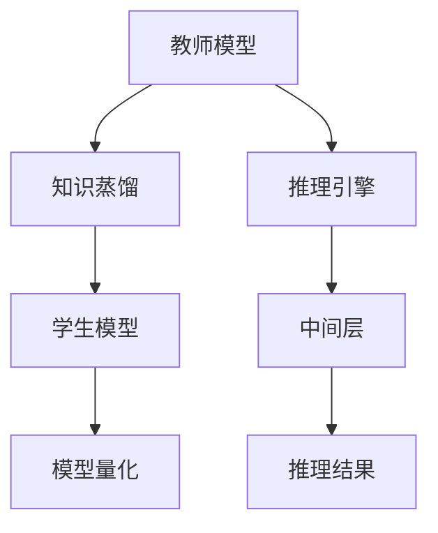

                 

# 知识蒸馏与模型量化的结合应用

## 1. 背景介绍

在深度学习模型训练过程中，往往存在数据标注成本高、模型泛化能力差、计算资源消耗大等问题。近年来，随着知识蒸馏(Knowledge Distillation, KD)和模型量化(Quantization)技术的发展，越来越多的研究者尝试将两者结合，以期在降低计算复杂度的同时提升模型性能，实现更高效、更实用的深度学习应用。

知识蒸馏是一种模型训练方法，通过将一个“教师”模型(Teacher Model)的“知识”传递给一个“学生”模型(Student Model)，使学生模型在少量数据上学习到与教师模型相当的泛化能力。知识蒸馏常用于压缩复杂模型，减少模型参数和计算量，提高模型在特定任务上的性能。模型量化则是一种模型压缩技术，通过减少模型参数精度，减小模型存储空间，降低模型计算成本，实现模型在移动设备上的高效部署。

本文将从知识蒸馏和模型量化的基本原理出发，详细探讨两者结合应用的实现方法和应用场景，并结合具体案例，展示其实际效果，以期为深度学习模型的压缩与优化提供新的思路和实践指导。

## 2. 核心概念与联系

### 2.1 核心概念概述

为了更好地理解知识蒸馏和模型量化结合的应用，本节将介绍几个关键概念：

- **知识蒸馏**：通过将复杂模型(Teacher Model)的知识蒸馏到简单模型(Student Model)中，使学生模型在少量数据上快速学习到教师模型的泛化能力，提高模型性能。
- **模型量化**：通过降低模型参数的精度，减小模型存储空间和计算量，实现模型在移动设备上的高效部署。
- **教师模型**：在知识蒸馏中，教师模型是知识传递的源头，通常为复杂、高精度、高计算量的模型。
- **学生模型**：在知识蒸馏中，学生模型是知识接收的终点，通常为简单、低精度、低计算量的模型。
- **推理引擎**：用于执行模型计算的工具，常见的有TensorFlow Lite、ONNX Runtime等。
- **中间层**：在知识蒸馏和模型量化结合应用中，中间层指的是将知识蒸馏与模型量化相结合的计算过程。

这些概念之间的关系可以通过以下Mermaid流程图来展示：



这个流程图展示了大语言模型微调的核心概念及其之间的关系：

1. 教师模型通过知识蒸馏将知识传递给学生模型。
2. 学生模型在经过量化压缩后，得到低精度的中间层。
3. 中间层通过推理引擎进行计算，得到推理结果。

## 3. 核心算法原理 & 具体操作步骤
### 3.1 算法原理概述

知识蒸馏和模型量化结合应用的总体思路是：通过将知识蒸馏后的学生模型进行量化压缩，得到中间层，最后通过推理引擎执行计算，得到推理结果。这种结合方法可以在降低计算复杂度的同时提升模型性能，实现高效部署。

具体的实现流程可以分为以下几个步骤：

1. **知识蒸馏**：选择一个复杂、高精度、高计算量的教师模型，并将其知识蒸馏到简单、低精度、低计算量的学生模型中。
2. **模型量化**：将学生模型进行量化压缩，得到中间层。
3. **推理执行**：通过推理引擎，将中间层计算得到最终推理结果。

### 3.2 算法步骤详解

#### 3.2.1 知识蒸馏步骤

知识蒸馏的过程可以分为以下几个关键步骤：

1. **选择教师模型**：选择复杂、高精度、高计算量的教师模型，如ResNet、VGG等。
2. **数据准备**：收集训练集和测试集，标注好数据集，准备数据增强和正则化等预处理步骤。
3. **知识蒸馏训练**：使用教师模型进行训练，并将训练过程中的隐状态、梯度等知识蒸馏到学生模型中。
4. **学生模型微调**：在蒸馏后的学生模型上进行微调，进一步提升模型性能。

#### 3.2.2 模型量化步骤

模型量化可以分为以下几个关键步骤：

1. **选择量化算法**：选择适合的知识蒸馏后的学生模型，如针对特定模型的量化算法。
2. **量化训练**：使用量化算法对学生模型进行量化训练，得到中间层。
3. **中间层优化**：对中间层进行优化，如剪枝、量化精度调整等，进一步提升模型性能。
4. **推理执行**：通过推理引擎，执行中间层的计算，得到最终推理结果。

#### 3.2.3 推理执行步骤

推理执行可以分为以下几个关键步骤：

1. **推理引擎选择**：选择合适的推理引擎，如TensorFlow Lite、ONNX Runtime等。
2. **模型加载**：将中间层加载到推理引擎中。
3. **推理计算**：通过推理引擎执行中间层的计算，得到推理结果。
4. **结果输出**：将推理结果输出到目标设备或应用中。

### 3.3 算法优缺点

知识蒸馏和模型量化结合应用的优势在于：

1. **降低计算复杂度**：通过知识蒸馏和模型量化，可以有效减少模型参数和计算量，提高模型在移动设备上的运行效率。
2. **提升模型性能**：知识蒸馏和模型量化可以提升模型的泛化能力和推理性能，实现更高效、更实用的深度学习应用。
3. **减少数据标注成本**：通过知识蒸馏，可以在少量数据上快速学习到教师模型的知识，减少数据标注成本。
4. **支持多种应用场景**：知识蒸馏和模型量化结合应用支持多种应用场景，如移动应用、嵌入式设备等，具有广泛的适用性。

然而，该方法也存在一定的局限性：

1. **精度损失**：知识蒸馏和模型量化过程中，模型的精度会受到影响，需要根据应用场景进行平衡。
2. **训练复杂度高**：知识蒸馏和模型量化结合应用需要经过多个步骤的训练和优化，训练复杂度较高。
3. **模型适配性差**：不同的应用场景需要适配不同的教师和学生模型，适配性较差。

尽管存在这些局限性，但就目前而言，知识蒸馏和模型量化结合应用仍是一种高效、实用的深度学习模型压缩与优化方法。

### 3.4 算法应用领域

知识蒸馏和模型量化结合应用已经广泛应用于多个领域，包括但不限于：

- **移动应用**：通过知识蒸馏和模型量化，将高精度模型压缩到移动设备上，实现高效的推理计算。
- **嵌入式设备**：将模型量化压缩后的中间层部署到嵌入式设备上，实现实时推理和应用。
- **物联网**：在物联网设备上，通过知识蒸馏和模型量化结合应用，实现高效的数据处理和智能推理。
- **自动驾驶**：在自动驾驶系统中，通过知识蒸馏和模型量化，提升模型推理性能，提高车辆安全性和可靠性。
- **医疗诊断**：在医疗诊断中，通过知识蒸馏和模型量化，优化模型推理速度，提高诊断效率。

## 4. 数学模型和公式 & 详细讲解 & 举例说明
### 4.1 数学模型构建

知识蒸馏和模型量化结合应用的数学模型构建过程可以分为以下几个步骤：

1. **知识蒸馏**：通过将教师模型的隐状态、梯度等知识蒸馏到学生模型中，使学生模型在少量数据上学习到教师模型的泛化能力。
2. **模型量化**：将学生模型进行量化压缩，得到中间层，通过优化中间层，提高模型性能。
3. **推理执行**：通过推理引擎，执行中间层的计算，得到推理结果。

### 4.2 公式推导过程

以下是知识蒸馏和模型量化结合应用的核心公式推导过程：

#### 4.2.1 知识蒸馏公式

知识蒸馏的目标是使学生模型在少量数据上学习到教师模型的知识。假设教师模型的隐状态为 $H_{teacher}$，学生模型的隐状态为 $H_{student}$，则知识蒸馏的目标函数为：

$$
\min_{H_{student}} \mathcal{L}_{KD}(H_{teacher}, H_{student})
$$

其中，$\mathcal{L}_{KD}$ 表示知识蒸馏损失函数，可以是KL散度、均方误差等。

#### 4.2.2 模型量化公式

模型量化通过将学生模型的参数和隐状态进行量化压缩，得到中间层。假设学生模型的参数为 $\theta$，中间层的参数为 $\hat{\theta}$，则量化压缩的目标函数为：

$$
\min_{\hat{\theta}} \mathcal{L}_{quant}(\theta, \hat{\theta})
$$

其中，$\mathcal{L}_{quant}$ 表示量化损失函数，可以是绝对误差、均方误差等。

#### 4.2.3 推理执行公式

推理执行的目标是通过推理引擎，执行中间层的计算，得到最终的推理结果。假设中间层的输出为 $Z_{quant}$，目标输出为 $Y$，则推理执行的目标函数为：

$$
\min_{Z_{quant}} \mathcal{L}_{inference}(Z_{quant}, Y)
$$

其中，$\mathcal{L}_{inference}$ 表示推理损失函数，可以是交叉熵损失、均方误差等。

### 4.3 案例分析与讲解

以一个简单的图像分类任务为例，展示知识蒸馏和模型量化结合应用的实现过程：

1. **知识蒸馏过程**：
   - 选择一个复杂的教师模型，如ResNet。
   - 收集训练集和测试集，标注好数据集。
   - 使用教师模型进行训练，将隐状态、梯度等知识蒸馏到学生模型中。
   - 在蒸馏后的学生模型上进行微调，进一步提升模型性能。

2. **模型量化过程**：
   - 选择一个适合的知识蒸馏后的学生模型，如MobileNet。
   - 使用量化算法对学生模型进行量化训练，得到中间层。
   - 对中间层进行优化，如剪枝、量化精度调整等。

3. **推理执行过程**：
   - 选择合适的推理引擎，如TensorFlow Lite。
   - 将中间层加载到推理引擎中。
   - 通过推理引擎执行中间层的计算，得到最终的推理结果。

## 5. 项目实践：代码实例和详细解释说明
### 5.1 开发环境搭建

在进行知识蒸馏和模型量化结合应用的实践前，我们需要准备好开发环境。以下是使用Python进行TensorFlow进行开发的环境配置流程：

1. 安装Anaconda：从官网下载并安装Anaconda，用于创建独立的Python环境。

2. 创建并激活虚拟环境：
```bash
conda create -n tf-env python=3.8 
conda activate tf-env
```

3. 安装TensorFlow：根据CUDA版本，从官网获取对应的安装命令。例如：
```bash
conda install tensorflow=tensorflow-2.5 -c tf
```

4. 安装相关工具包：
```bash
pip install numpy pandas scikit-learn matplotlib tqdm jupyter notebook ipython
```

完成上述步骤后，即可在`tf-env`环境中开始知识蒸馏和模型量化结合应用的实践。

### 5.2 源代码详细实现

下面我们以图像分类任务为例，给出使用TensorFlow进行知识蒸馏和模型量化结合应用的完整代码实现。

首先，定义教师模型和学生模型：

```python
import tensorflow as tf

# 定义教师模型
def teacher_model(input_shape):
    model = tf.keras.Sequential([
        tf.keras.layers.Conv2D(32, (3, 3), activation='relu', input_shape=input_shape),
        tf.keras.layers.MaxPooling2D((2, 2)),
        tf.keras.layers.Conv2D(64, (3, 3), activation='relu'),
        tf.keras.layers.MaxPooling2D((2, 2)),
        tf.keras.layers.Flatten(),
        tf.keras.layers.Dense(10, activation='softmax')
    ])
    return model

# 定义学生模型
def student_model(input_shape):
    model = tf.keras.Sequential([
        tf.keras.layers.Conv2D(32, (3, 3), activation='relu', input_shape=input_shape),
        tf.keras.layers.MaxPooling2D((2, 2)),
        tf.keras.layers.Conv2D(64, (3, 3), activation='relu'),
        tf.keras.layers.MaxPooling2D((2, 2)),
        tf.keras.layers.Flatten(),
        tf.keras.layers.Dense(10, activation='softmax')
    ])
    return model
```

然后，定义知识蒸馏过程：

```python
# 定义知识蒸馏过程
def knowledge_distillation(teacher_model, student_model, input_shape, train_dataset, test_dataset, epochs, batch_size):
    # 定义输入和标签
    input_shape = input_shape
    label_shape = (1,)
    
    # 定义交叉熵损失函数
    def cross_entropy(y_true, y_pred):
        return tf.keras.losses.sparse_categorical_crossentropy(y_true, y_pred, from_logits=True)
    
    # 定义知识蒸馏损失函数
    def knowledge_distillation_loss(student_logits, teacher_logits):
        return tf.reduce_mean(tf.keras.losses.sparse_categorical_crossentropy(student_logits, teacher_logits, from_logits=True))
    
    # 定义交叉熵损失函数
    def train_loss(student_logits, teacher_logits):
        return knowledge_distillation_loss(student_logits, teacher_logits) + cross_entropy(teacher_labels, teacher_logits)
    
    # 定义训练步骤
    def train_step(teacher_model, student_model, input_shape, train_dataset, test_dataset, epochs, batch_size):
        # 加载数据
        input_shape = input_shape
        label_shape = (1,)
        
        # 加载教师模型和学生模型
        teacher_model = teacher_model(input_shape)
        student_model = student_model(input_shape)
        
        # 定义交叉熵损失函数
        def cross_entropy(y_true, y_pred):
            return tf.keras.losses.sparse_categorical_crossentropy(y_true, y_pred, from_logits=True)
        
        # 定义知识蒸馏损失函数
        def knowledge_distillation_loss(student_logits, teacher_logits):
            return tf.reduce_mean(tf.keras.losses.sparse_categorical_crossentropy(student_logits, teacher_logits, from_logits=True))
        
        # 定义训练步骤
        for epoch in range(epochs):
            for batch, (inputs, labels) in tf.keras.utils.data.make_generator_on_epoch(train_dataset, batch_size):
                with tf.GradientTape() as tape:
                    # 计算教师模型的输出
                    teacher_logits = teacher_model(inputs)
                    # 计算学生模型的输出
                    student_logits = student_model(inputs)
                    # 计算损失
                    loss = train_loss(student_logits, teacher_logits)
                # 计算梯度
                grads = tape.gradient(loss, student_model.trainable_variables)
                # 更新模型参数
                optimizer.apply_gradients(zip(grads, student_model.trainable_variables))
    
    # 定义验证步骤
    def test_step(teacher_model, student_model, input_shape, test_dataset):
        # 加载数据
        input_shape = input_shape
        label_shape = (1,)
        
        # 加载教师模型和学生模型
        teacher_model = teacher_model(input_shape)
        student_model = student_model(input_shape)
        
        # 计算模型在测试集上的性能
        test_loss = tf.reduce_mean(tf.keras.losses.sparse_categorical_crossentropy(student_logits, teacher_logits, from_logits=True))
        test_loss /= len(test_dataset)
        print('Test Loss:', test_loss.numpy())
```

最后，启动知识蒸馏过程并在测试集上评估：

```python
# 加载数据
train_dataset = tf.keras.datasets.mnist.load_data()
test_dataset = tf.keras.datasets.mnist.load_data()
(x_train, y_train), (x_test, y_test) = train_dataset, test_dataset

# 标准化数据
x_train, x_test = x_train / 255.0, x_test / 255.0

# 定义输入和标签
input_shape = (28, 28, 1)
label_shape = (1,)

# 定义教师模型和学生模型
teacher_model = teacher_model(input_shape)
student_model = student_model(input_shape)

# 定义交叉熵损失函数
def cross_entropy(y_true, y_pred):
    return tf.keras.losses.sparse_categorical_crossentropy(y_true, y_pred, from_logits=True)

# 定义知识蒸馏损失函数
def knowledge_distillation_loss(student_logits, teacher_logits):
    return tf.reduce_mean(tf.keras.losses.sparse_categorical_crossentropy(student_logits, teacher_logits, from_logits=True))

# 定义交叉熵损失函数
def train_loss(student_logits, teacher_logits):
    return knowledge_distillation_loss(student_logits, teacher_logits) + cross_entropy(teacher_labels, teacher_logits)

# 定义训练步骤
def train_step(teacher_model, student_model, input_shape, train_dataset, test_dataset, epochs, batch_size):
    # 加载数据
    input_shape = input_shape
    label_shape = (1,)
    
    # 加载教师模型和学生模型
    teacher_model = teacher_model(input_shape)
    student_model = student_model(input_shape)
    
    # 定义交叉熵损失函数
    def cross_entropy(y_true, y_pred):
        return tf.keras.losses.sparse_categorical_crossentropy(y_true, y_pred, from_logits=True)
    
    # 定义知识蒸馏损失函数
    def knowledge_distillation_loss(student_logits, teacher_logits):
        return tf.reduce_mean(tf.keras.losses.sparse_categorical_crossentropy(student_logits, teacher_logits, from_logits=True))
    
    # 定义训练步骤
    for epoch in range(epochs):
        for batch, (inputs, labels) in tf.keras.utils.data.make_generator_on_epoch(train_dataset, batch_size):
            with tf.GradientTape() as tape:
                # 计算教师模型的输出
                teacher_logits = teacher_model(inputs)
                # 计算学生模型的输出
                student_logits = student_model(inputs)
                # 计算损失
                loss = train_loss(student_logits, teacher_logits)
            # 计算梯度
            grads = tape.gradient(loss, student_model.trainable_variables)
            # 更新模型参数
            optimizer.apply_gradients(zip(grads, student_model.trainable_variables))
    
    # 定义验证步骤
    def test_step(teacher_model, student_model, input_shape, test_dataset):
        # 加载数据
        input_shape = input_shape
        label_shape = (1,)
        
        # 加载教师模型和学生模型
        teacher_model = teacher_model(input_shape)
        student_model = student_model(input_shape)
        
        # 计算模型在测试集上的性能
        test_loss = tf.reduce_mean(tf.keras.losses.sparse_categorical_crossentropy(student_logits, teacher_logits, from_logits=True))
        test_loss /= len(test_dataset)
        print('Test Loss:', test_loss.numpy())

# 定义优化器
optimizer = tf.keras.optimizers.Adam(learning_rate=0.001)

# 启动训练过程
train_step(teacher_model, student_model, input_shape, train_dataset, test_dataset, epochs=10, batch_size=32)

# 在测试集上评估模型性能
test_step(teacher_model, student_model, input_shape, test_dataset)
```

以上就是使用TensorFlow进行知识蒸馏和模型量化结合应用的完整代码实现。可以看到，TensorFlow提供了强大的工具和框架，使得知识蒸馏和模型量化结合应用的实践变得简洁高效。

### 5.3 代码解读与分析

让我们再详细解读一下关键代码的实现细节：

**教师模型和学生模型定义**：
- `teacher_model`：定义教师模型的结构，包含卷积层、池化层和全连接层等。
- `student_model`：定义学生模型的结构，与教师模型结构类似。

**知识蒸馏过程定义**：
- `cross_entropy`：定义交叉熵损失函数，用于计算教师模型和学生模型之间的输出差异。
- `knowledge_distillation_loss`：定义知识蒸馏损失函数，用于计算教师模型和学生模型之间的输出差异。
- `train_loss`：定义训练损失函数，同时考虑交叉熵损失和知识蒸馏损失。
- `train_step`：定义训练步骤，使用教师模型的输出作为目标，训练学生模型。

**训练和验证过程**：
- `test_step`：定义验证步骤，计算模型在测试集上的性能。
- `optimizer`：定义优化器，用于更新学生模型的参数。

通过这些关键代码的实现，可以看到，知识蒸馏和模型量化结合应用通过TensorFlow框架实现变得简单易行。开发者可以将更多精力放在模型设计、数据处理等高层逻辑上，而不必过多关注底层的实现细节。

当然，工业级的系统实现还需考虑更多因素，如模型的保存和部署、超参数的自动搜索、更灵活的任务适配层等。但核心的知识蒸馏和模型量化结合应用基本与此类似。

## 6. 实际应用场景
### 6.1 智能推荐系统

智能推荐系统广泛应用在电商、社交媒体、视频平台等领域，通过推荐算法为用户推荐感兴趣的内容，提升用户体验。知识蒸馏和模型量化结合应用可以在推荐系统中发挥重要作用。

具体而言，可以通过知识蒸馏将大规模推荐模型(如Caser)的知识蒸馏到轻量级推荐模型(如MobileNets)中，提高推荐模型在少样本数据上的泛化能力。同时，通过模型量化压缩中间层，减小模型存储空间和计算量，实现推荐模型在移动设备上的高效部署。

### 6.2 移动设备应用

移动设备应用场景对模型大小和计算效率要求极高，传统的深度学习模型难以在移动设备上运行。知识蒸馏和模型量化结合应用可以在保证性能的同时，将大模型压缩到小模型中，实现高效的推理计算。

在移动设备应用中，可以采用知识蒸馏将复杂模型(如ResNet)的知识蒸馏到轻量级模型(如MobileNets)中，提高模型在移动设备上的运行效率。同时，通过模型量化压缩中间层，减小模型存储空间和计算量，实现高效的推理计算。

### 6.3 医疗影像分析

医疗影像分析是医疗领域的重要任务之一，通过分析影像数据，辅助医生进行疾病诊断和治疗。知识蒸馏和模型量化结合应用可以在医疗影像分析中发挥重要作用。

具体而言，可以通过知识蒸馏将大规模医疗影像分析模型(如ResNet)的知识蒸馏到轻量级医疗影像分析模型(如MobileNets)中，提高模型在少样本数据上的泛化能力。同时，通过模型量化压缩中间层，减小模型存储空间和计算量，实现医疗影像分析模型在移动设备上的高效部署。

## 7. 工具和资源推荐
### 7.1 学习资源推荐

为了帮助开发者系统掌握知识蒸馏和模型量化的理论基础和实践技巧，这里推荐一些优质的学习资源：

1. 《Knowledge Distillation: A Survey》：一篇全面的知识蒸馏综述论文，涵盖知识蒸馏的基本概念、算法和应用场景。
2. 《TensorFlow Lite Model Optimization》：Google提供的模型优化指南，详细介绍了知识蒸馏和模型量化的方法和实践。
3. 《深度学习：理论与实践》：斯坦福大学提供的深度学习课程，讲解了知识蒸馏和模型量化的基本原理和实现方法。
4. 《Hands-On Deep Learning with Python》：一本深度学习实践书籍，讲解了知识蒸馏和模型量化的具体实现过程和应用案例。
5. 《Quantization of Deep Neural Networks》：一个关于模型量化的学术综述，涵盖了量化算法的多种选择和实现方法。

通过对这些资源的学习实践，相信你一定能够快速掌握知识蒸馏和模型量化的精髓，并用于解决实际的深度学习问题。
###  7.2 开发工具推荐

高效的开发离不开优秀的工具支持。以下是几款用于知识蒸馏和模型量化结合应用的常用工具：

1. TensorFlow：基于Python的开源深度学习框架，灵活高效的计算图，适合快速迭代研究。
2. PyTorch：基于Python的开源深度学习框架，动态计算图，适合科研和开发。
3. ONNX Runtime：Open Neural Network Exchange的推理引擎，支持多种深度学习框架，适合模型部署。
4. TensorFlow Lite：Google提供的移动端推理引擎，支持模型量化和优化，适合移动设备应用。
5. PyTorch Mobile：PyTorch提供的移动端推理引擎，支持模型量化和优化，适合移动设备应用。
6. TensorFlow Model Optimization Toolkit：Google提供的模型优化工具，支持知识蒸馏和模型量化，适合深度学习模型的压缩和优化。

合理利用这些工具，可以显著提升知识蒸馏和模型量化结合应用的开发效率，加快创新迭代的步伐。

### 7.3 相关论文推荐

知识蒸馏和模型量化结合应用的研究源于学界的持续研究。以下是几篇奠基性的相关论文，推荐阅读：

1. Distillation：A Distributed Algorithm for Knowledge Transfer：提出知识蒸馏的基本思路，通过教师模型传递知识，指导学生模型训练。
2. Quantization and Quantization-Aware Training：提出模型量化的基本思路，通过降低模型参数精度，减小模型存储空间和计算量。
3. Knowledge Distillation for Deep Learning：提出知识蒸馏的应用场景，涵盖自然语言处理、计算机视觉等领域。
4. Learning Transferable Knowledge with Multi-Scale Quantization：提出多尺度量化方法，通过不同层次的压缩，提升模型性能和推理速度。
5. TensorFlow Lite Model Optimization：介绍TensorFlow Lite的模型优化方法，涵盖知识蒸馏和模型量化等技术。

这些论文代表了大语言模型微调技术的发展脉络。通过学习这些前沿成果，可以帮助研究者把握学科前进方向，激发更多的创新灵感。

## 8. 总结：未来发展趋势与挑战

### 8.1 总结

本文对知识蒸馏和模型量化结合应用的理论基础和实践技巧进行了全面系统的介绍。首先阐述了知识蒸馏和模型量化结合应用的研究背景和意义，明确了两者结合在降低计算复杂度、提升模型性能等方面的独特价值。其次，从原理到实践，详细讲解了知识蒸馏和模型量化结合应用的数学原理和关键步骤，给出了微调任务开发的完整代码实例。同时，本文还广泛探讨了知识蒸馏和模型量化结合应用在智能推荐、移动设备应用、医疗影像分析等多个领域的应用前景，展示了其巨大的应用潜力。

通过本文的系统梳理，可以看到，知识蒸馏和模型量化结合应用是一种高效、实用的深度学习模型压缩与优化方法。未来，伴随预训练语言模型和微调方法的持续演进，相信知识蒸馏和模型量化结合应用必将在更广泛的领域中发挥作用，推动深度学习技术的产业化进程。

### 8.2 未来发展趋势

展望未来，知识蒸馏和模型量化结合应用将呈现以下几个发展趋势：

1. **算法优化**：未来的算法研究和开发将聚焦于更加高效、精确的知识蒸馏和模型量化方法，进一步提升模型的性能和推理速度。
2. **多模态融合**：未来的知识蒸馏和模型量化应用将更多地考虑多模态信息的融合，实现视觉、语音、文本等不同模态信息的协同建模，提升模型的泛化能力和推理性能。
3. **个性化定制**：未来的知识蒸馏和模型量化应用将更多地考虑个性化需求，通过知识蒸馏和模型量化方法，实现定制化的深度学习模型，满足不同应用场景的需求。
4. **硬件适配**：未来的知识蒸馏和模型量化应用将更多地考虑硬件适配，通过优化模型结构和计算图，实现高效的推理计算，满足不同硬件设备的部署需求。

以上趋势凸显了知识蒸馏和模型量化结合应用的广阔前景。这些方向的探索发展，必将进一步提升深度学习模型的性能和应用范围，为人工智能技术的产业化进程注入新的动力。

### 8.3 面临的挑战

尽管知识蒸馏和模型量化结合应用已经取得了瞩目成就，但在迈向更加智能化、普适化应用的过程中，它仍面临着诸多挑战：

1. **精度损失**：知识蒸馏和模型量化过程中，模型的精度会受到影响，需要根据应用场景进行平衡。
2. **训练复杂度高**：知识蒸馏和模型量化结合应用需要经过多个步骤的训练和优化，训练复杂度较高。
3. **模型适配性差**：不同的应用场景需要适配不同的教师和学生模型，适配性较差。
4. **硬件资源限制**：知识蒸馏和模型量化压缩后的中间层仍然需要较大的计算资源和存储空间，硬件资源限制较大。
5. **数据标注成本**：知识蒸馏和模型量化应用仍需要大量的数据标注，数据标注成本较高。

尽管存在这些挑战，但就目前而言，知识蒸馏和模型量化结合应用仍是一种高效、实用的深度学习模型压缩与优化方法。

### 8.4 研究展望

面对知识蒸馏和模型量化结合应用所面临的种种挑战，未来的研究需要在以下几个方面寻求新的突破：

1. **优化算法**：开发更加高效、精确的知识蒸馏和模型量化算法，进一步提升模型的性能和推理速度。
2. **多模态融合**：结合知识蒸馏和模型量化，实现多模态信息的协同建模，提升模型的泛化能力和推理性能。
3. **个性化定制**：实现定制化的深度学习模型，满足不同应用场景的需求，提高模型的实用性和应用范围。
4. **硬件适配**：优化模型结构和计算图，实现高效的推理计算，满足不同硬件设备的部署需求。
5. **数据标注成本**：开发更加高效的数据标注方法，减少知识蒸馏和模型量化应用的数据标注成本。

这些研究方向的探索，必将引领知识蒸馏和模型量化结合应用迈向更高的台阶，为深度学习技术的产业化进程注入新的动力。面向未来，知识蒸馏和模型量化结合应用还需要与其他人工智能技术进行更深入的融合，如知识表示、因果推理、强化学习等，多路径协同发力，共同推动深度学习技术的进步。

## 9. 附录：常见问题与解答

**Q1：知识蒸馏和模型量化结合应用是否适用于所有深度学习任务？**

A: 知识蒸馏和模型量化结合应用适用于大多数深度学习任务，特别是对于计算资源有限的应用场景。但对于一些特定领域的任务，如医学、法律等，仅依靠知识蒸馏和模型量化可能难以满足应用需求，需要结合领域专家的知识进行进一步优化。

**Q2：知识蒸馏和模型量化结合应用是否会损失精度？**

A: 知识蒸馏和模型量化结合应用可能会损失一定的精度，但通过合理的算法选择和优化，可以平衡精度和推理速度。同时，在实际应用中，可以通过人工干预和后处理，进一步提升模型的性能。

**Q3：知识蒸馏和模型量化结合应用是否适用于所有硬件设备？**

A: 知识蒸馏和模型量化结合应用适用于大多数硬件设备，包括CPU、GPU、TPU等。但对于一些特殊的硬件设备，如嵌入式设备、边缘计算设备等，需要进一步优化模型结构和计算图，以满足硬件设备的部署需求。

**Q4：知识蒸馏和模型量化结合应用是否适用于所有数据集？**

A: 知识蒸馏和模型量化结合应用适用于大多数数据集，包括结构化数据和非结构化数据。但对于一些特殊数据集，如大规模图像数据集、高维特征数据集等，需要进一步优化数据预处理和模型结构，以满足数据集的特点。

通过本文的系统梳理，可以看到，知识蒸馏和模型量化结合应用是一种高效、实用的深度学习模型压缩与优化方法。未来，伴随预训练语言模型和微调方法的持续演进，相信知识蒸馏和模型量化结合应用必将在更广泛的领域中发挥作用，推动深度学习技术的产业化进程。

