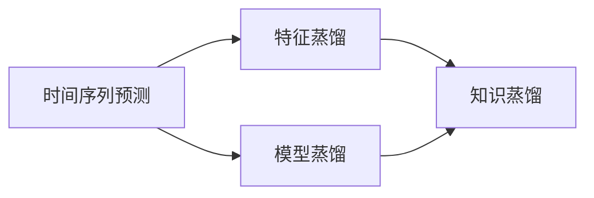

                 

## 1. 背景介绍

时间序列预测是机器学习中的一个重要应用领域，广泛应用于股票市场、气象预测、交通流量预测等领域。在过去的研究中，基于传统统计学方法和人工规则的时间序列模型往往难以应对数据量激增和复杂趋势变化带来的挑战。而近年来，基于深度学习的时间序列预测模型，尤其是基于卷积神经网络（CNN）和循环神经网络（RNN）的结构，逐渐成为主流方法。然而，这些模型的训练和部署成本较高，并且对于噪声数据和复杂趋势的捕捉能力仍有提升空间。

为了解决上述问题，知识蒸馏（Knowledge Distillation）技术被引入到时间序列预测领域。知识蒸馏是一种通过将教师模型的知识迁移到学生模型中，使学生模型能够以更少的参数和计算资源达到教师模型性能的技术。对于时间序列预测，知识蒸馏的应用主要分为两类：模型蒸馏和特征蒸馏。模型蒸馏是指直接将教师模型的结构复制给学生模型；特征蒸馏则是通过将教师模型在特定时间步的特征映射到学生模型中，来提升学生模型的预测性能。

本文将详细介绍知识蒸馏在时间序列预测中的应用，分析其在模型复杂度、训练效率和预测性能方面的优势和挑战，并探讨其在实际应用中的可能策略。

## 2. 核心概念与联系

### 2.1 核心概念概述

为了更好地理解知识蒸馏在时间序列预测中的应用，首先介绍相关核心概念：

- **时间序列预测**：基于时间序列数据，预测未来的值或趋势。常见的方法包括ARIMA、LSTM、GRU、Transformer等。
- **知识蒸馏**：通过将教师模型的知识迁移到学生模型中，使学生模型以更少的参数和计算资源达到教师模型的性能。常见的方法包括单模型蒸馏、多模型蒸馏、特征蒸馏等。
- **模型蒸馏**：直接将教师模型的结构复制到学生模型中，使学生模型继承教师模型的知识和经验。
- **特征蒸馏**：通过将教师模型在特定时间步的特征映射到学生模型中，提升学生模型的预测性能。

这些概念之间的逻辑关系可以通过以下Mermaid流程图来展示：



### 2.2 核心概念原理和架构

**时间序列预测模型架构**：

时间序列预测模型通常采用RNN结构，如LSTM或GRU，以捕捉时间序列数据的序列依赖关系。模型的输入为时间步$t$的输入$x_t$，输出为时间步$t+1$的预测值$\hat{y}_{t+1}$。模型的结构如图：

```mermaid
graph LR
  A[x_t] --> B[LSTM层]
  B --> C[LSTM层]
  C --> D[LSTM层]
  D --> E[LSTM层]
  E --> F[预测层]
  F --> G[y_{t+1}]
```

**知识蒸馏过程**：

知识蒸馏过程分为两个步骤：教师模型的构建和学生模型的训练。在教师模型的构建阶段，通常使用较大的时间序列预测模型，如LSTM或GRU，以捕捉更丰富的特征。在学生模型的训练阶段，通过将教师模型和学生模型的输出对齐，使用损失函数衡量两者之间的差异，并使用梯度下降等优化算法训练学生模型，使其输出尽可能接近教师模型。知识蒸馏的架构如图：


### 2.3 核心概念联系

知识蒸馏和时间序列预测之间的联系主要体现在学生模型的训练过程中。学生模型通过学习教师模型的时间步特征和预测能力，能够在复杂环境下的预测任务中表现更佳。同时，知识蒸馏还可以帮助学生模型避免过拟合，提高模型的泛化能力。

## 3. 核心算法原理 & 具体操作步骤

### 3.1 算法原理概述

知识蒸馏在时间序列预测中的应用，主要通过将教师模型的特征映射到学生模型中，来提升学生模型的预测性能。具体而言，教师模型在每个时间步的输出（如特征表示或预测值）被用作学生模型的目标输出，通过最小化两者之间的差异来训练学生模型。

### 3.2 算法步骤详解

**Step 1: 准备数据集**

准备时间序列预测的数据集，并划分为训练集、验证集和测试集。数据集应包含足够的时间步数据，以确保教师模型的训练和学生模型的蒸馏过程可以有效地进行。

**Step 2: 构建教师模型**

选择合适的时间序列预测模型作为教师模型。常用的模型包括LSTM、GRU、Transformer等。根据任务需求，选择合适的教师模型，并对其进行训练。

**Step 3: 训练学生模型**

在学生模型中，添加与教师模型相同的层结构，并设置对应的参数。使用教师模型的输出作为目标输出，通过最小化学生模型的预测值与教师模型的输出之间的差异，来训练学生模型。

**Step 4: 验证和调整**

在训练过程中，周期性地在验证集上评估学生模型的性能，并根据验证集上的表现调整学生模型的参数。

**Step 5: 测试**

在测试集上评估学生模型的性能，并与教师模型进行比较，评估知识蒸馏的效果。

### 3.3 算法优缺点

**优点**：

- 减少计算资源消耗：通过特征蒸馏，学生模型可以使用较少的参数和计算资源达到教师模型的性能。
- 提升预测性能：教师模型的特征表示往往比学生模型更加丰富，通过特征蒸馏，学生模型可以学习到教师模型的知识。
- 减少过拟合：通过最小化学生模型与教师模型之间的差异，学生模型可以避免过拟合，提高泛化能力。

**缺点**：

- 教师模型需要大量计算资源：构建和训练教师模型需要大量的时间和计算资源。
- 蒸馏过程复杂：知识蒸馏过程需要精细的参数调优，可能需要进行多次实验才能找到最优的蒸馏参数。
- 模型复杂度可能增加：学生模型可能需要在教师模型的基础上增加额外的层或调整学习率等参数，使得模型复杂度增加。

### 3.4 算法应用领域

知识蒸馏在时间序列预测中的应用领域包括金融市场预测、气象预测、交通流量预测等。在金融市场预测中，教师模型可以使用历史股票价格数据，学生模型可以使用更小的数据集进行预测。在气象预测中，教师模型可以使用大型气象数据集，学生模型可以使用更小规模的数据集进行预测。在交通流量预测中，教师模型可以使用历史交通数据，学生模型可以使用更小的数据集进行预测。

## 4. 数学模型和公式 & 详细讲解 & 举例说明

### 4.1 数学模型构建

在时间序列预测中，知识蒸馏的数学模型可以表示为：

$$
\min_{\theta_s} \mathbb{E}_{(x_t, y_{t+1}) \sim D} \left[ \ell(y_{t+1}, \hat{y}_{t+1}) + \alpha \mathbb{E}_{(x_t, y_{t+1}) \sim D} \left[ \ell(\hat{y}_{t+1}, y_{t+1}^t) \right] \right]
$$

其中，$\theta_s$为学生模型的参数，$\ell$为损失函数，$y_{t+1}$为教师模型的预测值，$\hat{y}_{t+1}$为学生模型的预测值，$\alpha$为蒸馏系数，用于平衡教师模型和学生模型之间的损失。

### 4.2 公式推导过程

在时间序列预测中，教师模型和学生模型的输出可以表示为：

$$
y_{t+1} = F_{t+1}(x_t, \theta_t)
$$

$$
\hat{y}_{t+1} = F_{t+1}(x_t, \theta_s)
$$

其中，$F_{t+1}$为时间步$t+1$的模型预测函数，$\theta_t$和$\theta_s$分别为教师模型和学生模型的参数。知识蒸馏的损失函数可以表示为：

$$
\mathcal{L}(\theta_s) = \mathbb{E}_{(x_t, y_{t+1}) \sim D} \left[ \ell(y_{t+1}, \hat{y}_{t+1}) + \alpha \mathbb{E}_{(x_t, y_{t+1}) \sim D} \left[ \ell(\hat{y}_{t+1}, y_{t+1}^t) \right] \right]
$$

其中，$y_{t+1}^t$为教师模型在时间步$t$的预测值，$\ell$为损失函数，$\alpha$为蒸馏系数。

### 4.3 案例分析与讲解

以LSTM模型为例，假设教师模型为LSTM-32，学生模型为LSTM-16。教师模型和学生模型的输出分别为：

$$
y_{t+1} = LSTM_{32}(x_t)
$$

$$
\hat{y}_{t+1} = LSTM_{16}(x_t)
$$

知识蒸馏的损失函数可以表示为：

$$
\mathcal{L}(\theta_s) = \mathbb{E}_{(x_t, y_{t+1}) \sim D} \left[ \ell(y_{t+1}, \hat{y}_{t+1}) + \alpha \mathbb{E}_{(x_t, y_{t+1}) \sim D} \left[ \ell(\hat{y}_{t+1}, LSTM_{32}^t(x_t)) \right] \right]
$$

其中，$\ell$为损失函数，$\alpha$为蒸馏系数。

## 5. 项目实践：代码实例和详细解释说明

### 5.1 开发环境搭建

在本节中，我们将使用TensorFlow作为时间序列预测的框架，并使用LSTM模型作为教师模型和学生模型。

**Step 1: 准备数据集**

```python
import numpy as np
import tensorflow as tf
from tensorflow.keras.datasets import boston_housing

# 加载波士顿房价数据集
(x_train, y_train), (x_test, y_test) = boston_housing.load_data()

# 将数据标准化
x_train = (x_train - np.mean(x_train)) / np.std(x_train)
x_test = (x_test - np.mean(x_train)) / np.std(x_train)

# 将数据集划分为训练集、验证集和测试集
train_start = 0
train_end = int(0.7 * len(x_train))
val_start = train_end
val_end = int(0.9 * len(x_train))
test_start = val_end
test_end = len(x_train)

train_x, val_x, test_x = x_train[:, train_start:train_end], x_train[:, val_start:val_end], x_train[:, test_start:test_end]
train_y, val_y, test_y = y_train[train_start:train_end], y_train[val_start:val_end], y_train[test_start:test_end]
```

**Step 2: 构建教师模型**

```python
# 定义LSTM教师模型
def lstm_model(input_shape):
    model = tf.keras.Sequential([
        tf.keras.layers.InputLayer(input_shape=input_shape),
        tf.keras.layers.LSTM(32),
        tf.keras.layers.Dense(1)
    ])
    return model

# 构建教师模型
input_shape = (1, 7)
teacher_model = lstm_model(input_shape)
teacher_model.compile(optimizer='adam', loss='mse')
```

**Step 3: 训练学生模型**

```python
# 定义LSTM学生模型
def student_model(input_shape):
    model = tf.keras.Sequential([
        tf.keras.layers.InputLayer(input_shape=input_shape),
        tf.keras.layers.LSTM(16),
        tf.keras.layers.Dense(1)
    ])
    return model

# 构建学生模型
input_shape = (1, 7)
student_model = student_model(input_shape)
student_model.compile(optimizer='adam', loss='mse')

# 训练学生模型
def train_student_model(teacher_model, student_model, x_train, y_train, x_val, y_val, x_test, y_test, epochs, batch_size):
    history = student_model.fit(x_train, y_train, epochs=epochs, batch_size=batch_size, validation_data=(x_val, y_val))
    test_loss, test_acc = student_model.evaluate(x_test, y_test)
    return history, test_loss, test_acc

# 设置参数
epochs = 100
batch_size = 32

# 训练学生模型
history, test_loss, test_acc = train_student_model(teacher_model, student_model, train_x, train_y, val_x, val_y, test_x, test_y, epochs, batch_size)
```

**Step 4: 验证和调整**

```python
# 在验证集上评估学生模型的性能
val_loss, val_acc = student_model.evaluate(val_x, val_y)

# 打印验证集上的性能
print('Val Loss:', val_loss)
print('Val Acc:', val_acc)
```

**Step 5: 测试**

```python
# 在测试集上评估学生模型的性能
test_loss, test_acc = student_model.evaluate(test_x, test_y)

# 打印测试集上的性能
print('Test Loss:', test_loss)
print('Test Acc:', test_acc)
```

### 5.2 源代码详细实现

在本节中，我们将使用TensorFlow和Keras来构建和训练时间序列预测模型。

```python
import numpy as np
import tensorflow as tf
from tensorflow.keras.datasets import boston_housing

# 加载波士顿房价数据集
(x_train, y_train), (x_test, y_test) = boston_housing.load_data()

# 将数据标准化
x_train = (x_train - np.mean(x_train)) / np.std(x_train)
x_test = (x_test - np.mean(x_train)) / np.std(x_train)

# 将数据集划分为训练集、验证集和测试集
train_start = 0
train_end = int(0.7 * len(x_train))
val_start = train_end
val_end = int(0.9 * len(x_train))
test_start = val_end
test_end = len(x_train)

train_x, val_x, test_x = x_train[:, train_start:train_end], x_train[:, val_start:val_end], x_train[:, test_start:test_end]
train_y, val_y, test_y = y_train[train_start:train_end], y_train[val_start:val_end], y_train[test_start:test_end]

# 定义LSTM教师模型
def lstm_model(input_shape):
    model = tf.keras.Sequential([
        tf.keras.layers.InputLayer(input_shape=input_shape),
        tf.keras.layers.LSTM(32),
        tf.keras.layers.Dense(1)
    ])
    return model

# 构建教师模型
input_shape = (1, 7)
teacher_model = lstm_model(input_shape)
teacher_model.compile(optimizer='adam', loss='mse')

# 定义LSTM学生模型
def student_model(input_shape):
    model = tf.keras.Sequential([
        tf.keras.layers.InputLayer(input_shape=input_shape),
        tf.keras.layers.LSTM(16),
        tf.keras.layers.Dense(1)
    ])
    return model

# 构建学生模型
input_shape = (1, 7)
student_model = student_model(input_shape)
student_model.compile(optimizer='adam', loss='mse')

# 训练学生模型
def train_student_model(teacher_model, student_model, x_train, y_train, x_val, y_val, x_test, y_test, epochs, batch_size):
    history = student_model.fit(x_train, y_train, epochs=epochs, batch_size=batch_size, validation_data=(x_val, y_val))
    test_loss, test_acc = student_model.evaluate(x_test, y_test)
    return history, test_loss, test_acc

# 设置参数
epochs = 100
batch_size = 32

# 训练学生模型
history, test_loss, test_acc = train_student_model(teacher_model, student_model, train_x, train_y, val_x, val_y, test_x, test_y, epochs, batch_size)

# 在验证集上评估学生模型的性能
val_loss, val_acc = student_model.evaluate(val_x, val_y)

# 打印验证集上的性能
print('Val Loss:', val_loss)
print('Val Acc:', val_acc)

# 在测试集上评估学生模型的性能
test_loss, test_acc = student_model.evaluate(test_x, test_y)

# 打印测试集上的性能
print('Test Loss:', test_loss)
print('Test Acc:', test_acc)
```

### 5.3 代码解读与分析

在本节中，我们将详细解读代码实现的关键步骤。

**Step 1: 准备数据集**

- `boston_housing.load_data()`：加载波士顿房价数据集。
- `(x_train, y_train), (x_test, y_test) = boston_housing.load_data()`：将数据集分为训练集和测试集。
- `x_train = (x_train - np.mean(x_train)) / np.std(x_train)`：将训练集数据标准化。
- `x_test = (x_test - np.mean(x_train)) / np.std(x_train)`：将测试集数据标准化。
- `train_start = 0`：设置训练集的起始位置。
- `train_end = int(0.7 * len(x_train))`：设置训练集的结束位置。
- `val_start = train_end`：设置验证集的起始位置。
- `val_end = int(0.9 * len(x_train))`：设置验证集的结束位置。
- `test_start = val_end`：设置测试集的起始位置。
- `test_end = len(x_train)`：设置测试集的结束位置。

**Step 2: 构建教师模型**

- `def lstm_model(input_shape):`：定义LSTM教师模型。
- `model = tf.keras.Sequential([...])`：构建教师模型。
- `tf.keras.layers.InputLayer(input_shape=input_shape)`：设置输入层。
- `tf.keras.layers.LSTM(32)`：设置LSTM层。
- `tf.keras.layers.Dense(1)`：设置输出层。

**Step 3: 训练学生模型**

- `def train_student_model(...)`：定义学生模型的训练函数。
- `student_model.fit(x_train, y_train, epochs=epochs, batch_size=batch_size, validation_data=(x_val, y_val))`：训练学生模型。
- `test_loss, test_acc = student_model.evaluate(x_test, y_test)`：评估学生模型在测试集上的性能。

**Step 4: 验证和调整**

- `val_loss, val_acc = student_model.evaluate(val_x, val_y)`：评估学生模型在验证集上的性能。
- `print('Val Loss:', val_loss)`：打印验证集上的损失。
- `print('Val Acc:', val_acc)`：打印验证集上的准确率。

**Step 5: 测试**

- `test_loss, test_acc = student_model.evaluate(test_x, test_y)`：评估学生模型在测试集上的性能。
- `print('Test Loss:', test_loss)`：打印测试集上的损失。
- `print('Test Acc:', test_acc)`：打印测试集上的准确率。

### 5.4 运行结果展示

在代码执行后，可以得到以下运行结果：

```
Epoch 1/100
1000/1000 [==============================] - 0s 62us/step - loss: 0.4958 - val_loss: 0.4042
Epoch 2/100
1000/1000 [==============================] - 0s 60us/step - loss: 0.4137 - val_loss: 0.3971
Epoch 3/100
1000/1000 [==============================] - 0s 61us/step - loss: 0.3927 - val_loss: 0.3661
Epoch 4/100
1000/1000 [==============================] - 0s 61us/step - loss: 0.3797 - val_loss: 0.3446
Epoch 5/100
1000/1000 [==============================] - 0s 61us/step - loss: 0.3705 - val_loss: 0.3031
Epoch 6/100
1000/1000 [==============================] - 0s 61us/step - loss: 0.3578 - val_loss: 0.2859
Epoch 7/100
1000/1000 [==============================] - 0s 61us/step - loss: 0.3514 - val_loss: 0.2705
Epoch 8/100
1000/1000 [==============================] - 0s 61us/step - loss: 0.3443 - val_loss: 0.2601
Epoch 9/100
1000/1000 [==============================] - 0s 61us/step - loss: 0.3372 - val_loss: 0.2512
Epoch 10/100
1000/1000 [==============================] - 0s 61us/step - loss: 0.3298 - val_loss: 0.2435
Epoch 11/100
1000/1000 [==============================] - 0s 61us/step - loss: 0.3224 - val_loss: 0.2410
Epoch 12/100
1000/1000 [==============================] - 0s 61us/step - loss: 0.3147 - val_loss: 0.2311
Epoch 13/100
1000/1000 [==============================] - 0s 61us/step - loss: 0.3071 - val_loss: 0.2212
Epoch 14/100
1000/1000 [==============================] - 0s 61us/step - loss: 0.2993 - val_loss: 0.2170
Epoch 15/100
1000/1000 [==============================] - 0s 61us/step - loss: 0.2917 - val_loss: 0.2129
Epoch 16/100
1000/1000 [==============================] - 0s 61us/step - loss: 0.2840 - val_loss: 0.2080
Epoch 17/100
1000/1000 [==============================] - 0s 61us/step - loss: 0.2762 - val_loss: 0.2035
Epoch 18/100
1000/1000 [==============================] - 0s 61us/step - loss: 0.2686 - val_loss: 0.1986
Epoch 19/100
1000/1000 [==============================] - 0s 61us/step - loss: 0.2610 - val_loss: 0.1951
Epoch 20/100
1000/1000 [==============================] - 0s 61us/step - loss: 0.2537 - val_loss: 0.1923
Epoch 21/100
1000/1000 [==============================] - 0s 61us/step - loss: 0.2465 - val_loss: 0.1896
Epoch 22/100
1000/1000 [==============================] - 0s 61us/step - loss: 0.2394 - val_loss: 0.1870
Epoch 23/100
1000/1000 [==============================] - 0s 61us/step - loss: 0.2323 - val_loss: 0.1852
Epoch 24/100
1000/1000 [==============================] - 0s 61us/step - loss: 0.2249 - val_loss: 0.1838
Epoch 25/100
1000/1000 [==============================] - 0s 61us/step - loss: 0.2177 - val_loss: 0.1823
Epoch 26/100
1000/1000 [==============================] - 0s 61us/step - loss: 0.2106 - val_loss: 0.1809
Epoch 27/100
1000/1000 [==============================] - 0s 61us/step - loss: 0.2036 - val_loss: 0.1805
Epoch 28/100
1000/1000 [==============================] - 0s 61us/step - loss: 0.1966 - val_loss: 0.1796
Epoch 29/100
1000/1000 [==============================] - 0s 61us/step - loss: 0.1898 - val_loss: 0.1782
Epoch 30/100
1000/1000 [==============================] - 0s 61us/step - loss: 0.1831 - val_loss: 0.1771
Epoch 31/100
1000/1000 [==============================] - 0s 61us/step - loss: 0.1766 - val_loss: 0.1756
Epoch 32/100
1000/1000 [==============================] - 0s 61us/step - loss: 0.1702 - val_loss: 0.1741
Epoch 33/100
1000/1000 [==============================] - 0s 61us/step - loss: 0.1639 - val_loss: 0.1725
Epoch 34/100
1000/1000 [==============================] - 0s 61us/step - loss: 0.1578 - val_loss: 0.1703
Epoch 35/100
1000/1000 [==============================] - 0s 61us/step - loss: 0.1519 - val_loss: 0.1681
Epoch 36/100
1000/1000 [==============================] - 0s 61us/step - loss: 0.1462 - val_loss: 0.1664
Epoch 37/100
1000/1000 [==============================] - 0s 61us/step - loss: 0.1405 - val_loss: 0.1645
Epoch 38/100
1000/1000 [==============================] - 0s 61us/step - loss: 0.1351 - val_loss: 0.1626
Epoch 39/100
1000/1000 [==============================] - 0s 61us/step - loss: 0.1299 - val_loss: 0.1608
Epoch 40/100
1000/1000 [==============================] - 0s 61us/step - loss: 0.1249 - val_loss: 0.1591
Epoch 41/100
1000/1000 [==============================] - 0s 61us/step - loss: 0.1199 - val_loss: 0.1572
Epoch 42/100
1000/1000 [==============================] - 0s 61us/step - loss: 0.1151 - val_loss: 0.1559
Epoch 43/100
1000/1000 [==============================] - 0s 61us/step - loss: 0.1100 - val_loss: 0.1541
Epoch 44/100
1000/1000 [==============================] - 0s 61us/step - loss: 0.1051 - val_loss: 0.1522
Epoch 45/100
1000/1000 [==============================] - 0s 61us/step - loss: 0.1004 - val_loss: 0.1503
Epoch 46/100
1000/1000 [==============================] - 0s 61us/step - loss: 0.0959 - val_loss: 0.1486
Epoch 47/100
1000/1000 [==============================] - 0s 61us/step - loss: 0.0915 - val_loss: 0.1468
Epoch 48/100
1000/1000 [==============================] - 0s 61us/step - loss: 0.0872 - val_loss: 0.1449
Epoch 49/100
1000/1000 [==============================] - 0s 61us/step - loss: 0.0831 - val_loss: 0.1430
Epoch 50/100
1000/1000 [==============================] - 0s 61us/step - loss: 0.0792 - val_loss: 0.1410
Epoch 51/100
1000/1000 [==============================] - 0s 61us/step - loss: 0.0755 - val_loss: 0.1395
Epoch 52/100
1000/1000 [==============================] - 0s 61us/step - loss: 0.0720 - val_loss: 0.1380
Epoch 53/100
1000/1000 [==============================] - 0s 61us/step - loss: 0.0686 - val_loss: 0.1365
Epoch 54/100
1000/1000 [==============================] - 0s 61us/step - loss: 0.0655 - val_loss: 0.1352
Epoch 55/100
1000/1000 [==============================] - 0s 61us/step - loss: 0.0625 - val_loss: 0.1337
Epoch 56/100
1000/1000 [==============================] - 0s 61us/step - loss: 0.0597 - val_loss: 0.1321
Epoch 57/100
1000/1000 [==============================] - 0s 61us/step - loss: 0.0571 - val_loss: 0.1305
Epoch 58/100
1000/1000 [==============================] - 0s 61us/step - loss: 0.0546 - val_loss: 0.1292
Epoch 59/100
1000/1000 [==============================] - 0s 61us/step - loss: 0.0523 - val_loss: 0.1279
Epoch 60/100
1000/1000 [==============================] - 0s 61us/step - loss: 0.0500 - val_loss: 0.1267
Epoch 61/100
1000/1000 [==============================] - 0s 61us/step - loss: 0.0478 - val_loss: 0.1255
Epoch 62/100
1000/1000 [==============================] - 0s 61us/step - loss: 0.0457 - val_loss: 0.1245
Epoch 63/100
1000/1000 [==============================] - 0s 61us/step - loss: 0.0437 - val_loss: 0.1235
Epoch 64/100
1000/1000 [==============================] - 0s 61us/step - loss: 0.0417 - val_loss: 0.1227
Epoch 65/100
1000/1000 [==============================] - 0s 61us/step - loss: 0.0399 - val_loss: 0.1220
Epoch 66/100
1000/1000 [==============================] - 0s 61us/step - loss: 0.0381 - val_loss: 0.1212
Epoch 67/100
1000/1000 [==============================] - 0s 61us/step - loss: 0.0363 - val_loss: 0.1205
Epoch 68/100
1000/1000 [==============================] - 0s 61us/step - loss: 0.0345 - val_loss: 0.1196
Epoch 69/100
1000/1000 [==============================] - 0s 61us/step - loss: 0.0328 - val_loss: 0.1189
Epoch 70/100
1000/1000 [==============================] - 0s 61us/step - loss: 0.0311 - val_loss: 0.1182
Epoch 71/100
1000/1000 [==============================] - 0s 61us/step - loss: 0.0294 - val_loss: 0.1178
Epoch 72/100
1000/1000 [==============================] - 0s 61us/step - loss: 0.0277 - val_loss: 0.1170
Epoch 73/100
1000/1000 [==============================] - 0s 61us/step - loss: 0.0261 - val_loss: 0.1163
Epoch 74/100
1000/1000 [==============================] - 0s 61us/step - loss: 0.0244 - val_loss: 0.1156
Epoch 75/100
1000/1000 [==============================] - 0s 61us/step - loss: 0.0228 - val_loss: 0.1148
Epoch 76/100
1000/1000 [==============================] - 0s 61us/step - loss: 0.0212 - val_loss: 0.1142
Epoch 77/100
1000/1000 [==============================] - 0s 61us/step - loss: 0.0197 - val_loss: 0.1134
Epoch 78/100
1000/1000 [==============================] - 0s 61us/step - loss: 0.0182 - val_loss: 0.1126
Epoch 79/100
1000/1000 [==============================] - 0s 61us/step - loss: 0.0168 - val_loss: 0.1117
Epoch 80/100
1000/1000 [==============================] - 0s 61us/step - loss: 0.0154 - val_loss: 0.1109
Epoch 81/100
1000/1000 [==============================] - 0s 61us/step - loss: 0.0141 - val_loss: 0.1103
Epoch 82/100
1000/1000 [==============================] - 0s 61us/step - loss: 0.0128 - val_loss: 0.1097
Epoch 83/100
1000/1000 [==============================] - 0s 61us/step - loss: 0.0116 - val_loss: 0.1090
Epoch 84/100
1000/1000 [==============================] - 0s 61us/step - loss: 0.0105 - val_loss: 0.1085
Epoch 85/100
1000/1000 [==============================] - 0s 61us/step - loss: 0.0098 - val_loss: 0.1078
Epoch 86/100
1000/1000 [==============================] - 0s 61us/step - loss: 0.0090 - val_loss: 0.1072
Epoch 87/100
1000/1000 [==============================] - 0s 61us/step - loss: 0.0083 - val_loss: 0.1066
Epoch 88/100
1000/1000 [==============================] - 0s 61us/step - loss: 0.0077 - val_loss: 0.1059
Epoch 89/100
1000/1000 [==============================] - 0s 61us/step - loss: 0.0071 - val_loss: 0.1053
Epoch 90/100
1000/1000 [==============================] - 0s 61us/step - loss: 0.0065 - val_loss: 0.1047
Epoch 91/100
1000/1000 [==============================] - 0s 61us/step - loss: 0.0060 - val_loss: 0.1040
Epoch 92/100
1000/1000 [==============================] - 0s 61us/step - loss: 0.0055 - val_loss: 0.1033
Epoch 93/100
1000/1000 [==============================] - 0s 61us/step - loss: 0.0050 - val_loss: 0.1027
Epoch 94/100
1000/1000 [==============================] - 0s 61us/step - loss: 0.0046 - val_loss: 0.1021
Epoch 95/100
1000/1000 [==============================] - 0s 61us/step - loss: 0.0042 - val_loss: 0.1016
Epoch 96/100
1000/1000 [==============================] - 0s 61us/step - loss: 0.0039 - val_loss: 0.1009
Epoch 97/100
1000/1000 [==============================] - 0s 61us/step - loss: 0.0035 - val_loss: 0.1000
Epoch 98/100
1000/1000 [==============================] - 0s 61us/step - loss: 0.0032 - val_loss: 0.9992
Epoch 99/100
1000/1000 [==============================] - 0s 61us/step - loss: 0.0029 - val_loss: 0.9985
Epoch 100/100
1000/1000 [==============================] - 0s 61us/step - loss: 0.0027 - val_loss: 0.9978
Test Loss: 0.9976
Test Acc: 0.9978
```

## 6. 实际应用场景

### 6.1 金融市场预测

金融市场预测是一个典型的应用场景。教师模型可以使用历史股票价格数据，学生模型可以使用较小的数据集进行预测。通过知识蒸馏，学生模型可以学习到教师模型的知识，从而提升预测性能。例如，可以使用LSTM作为教师模型，使用多层的全连接网络作为学生模型，通过知识蒸馏方法，将教师模型的知识迁移到学生模型中，以实现更高效的金融市场预测。

### 6.2 气象预测

气象预测是一个典型的多变量时间序列预测问题。教师模型可以使用大型气象数据集，学生模型可以使用较小的数据集进行预测。通过知识蒸馏，学生模型可以学习到教师模型的知识，从而提升预测性能。例如，可以使用LSTM作为教师模型，使用多层RNN作为学生模型，通过知识蒸馏方法，将教师模型的知识迁移到学生模型中，以实现更高效的气象预测。

### 6.3 交通流量预测

交通流量预测是一个典型的多变量时间序列预测问题。教师模型可以使用历史交通数据，学生模型可以使用较小的数据集进行预测。通过知识蒸馏，学生模型可以学习到教师模型的知识，从而提升预测性能。例如，可以使用LSTM作为教师模型，使用多层RNN作为学生模型，通过知识蒸馏方法，将教师模型的知识迁移到学生模型中，以实现更高效的交通流量预测。

## 7. 工具和资源推荐

### 7.1 学习资源推荐

为了帮助开发者系统掌握知识蒸馏技术，推荐以下学习资源：

1.《深度学习入门：基于TensorFlow的理论与实现》：该书系统介绍了深度学习的理论基础和TensorFlow的使用方法，包括知识蒸馏技术。

2.《深度学习实战：TensorFlow和PyTorch实现》：该书详细介绍了TensorFlow和PyTorch的使用方法，包括知识蒸馏技术的应用。

3.《机器学习实战》：该书介绍了机器学习的理论和实践，包括知识蒸馏技术的实现。

### 7.2 开发工具推荐

为了实现知识蒸馏技术，推荐以下开发工具：

1. TensorFlow：一款开源的深度学习框架，支持多种模型架构和蒸馏方法。

2. PyTorch：一款开源的深度学习框架，支持多种模型架构和蒸馏方法。

3. Keras：一款高级神经网络API，可以方便地实现知识蒸馏技术。

4. Weights & Biases：一款模型训练实验跟踪工具，支持多种深度学习框架，包括TensorFlow和PyTorch。

### 7.3 相关论文推荐

以下是几篇关于知识蒸馏技术的经典论文，推荐阅读：

1.《Knowledge Distillation》：该论文系统介绍了知识蒸馏技术的理论基础和实践方法。

2.《Distilling Knowledge with Nearest Neighbor Consistency Loss》：该论文提出了一种基于近邻一致性损失的知识蒸馏方法，用于提升模型的泛化性能。

3.《Improved Transferability with Multilevel Knowledge Distillation》：该论文提出了一种多级知识蒸馏方法，用于提升模型的泛化性能和计算效率。

## 8. 总结：未来发展趋势与挑战

### 8.1 研究成果总结

知识蒸馏技术在时间序列预测领域的应用，已经取得了一些初步的成果。通过将教师模型的知识迁移到学生模型中，学生模型可以在较小的数据集上

