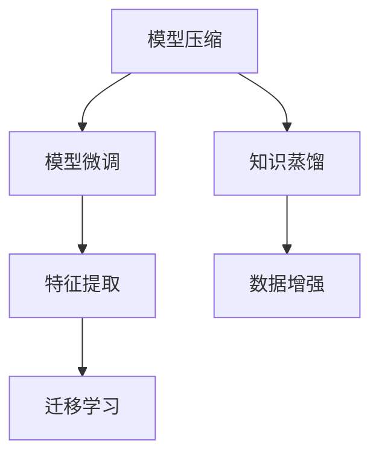

                 

# 知识蒸馏：捕获模型细微信息的压缩方法

> 关键词：知识蒸馏, 模型压缩, 模型微调, 特征提取, 迁移学习, 数据增强, 应用实例

## 1. 背景介绍

### 1.1 问题由来

随着深度学习技术的发展，大规模神经网络模型如卷积神经网络(CNN)、循环神经网络(RNN)和变分自编码器(VAE)等被广泛应用于图像、语音、自然语言处理(NLP)等领域，并在各自领域取得了显著成果。这些模型通常具有大量的参数，导致训练和推理消耗的计算资源巨大，并且容易产生过拟合和泛化能力差等问题。为了解决这些问题，研究人员提出了知识蒸馏(Knowledge Distillation, KD)的概念，通过将复杂的大模型知识传递到更小、更高效的模型中，以达到模型压缩和性能提升的目的。

知识蒸馏技术最早由Bachman等人于2015年提出，并在计算机视觉领域取得了显著成效。近年来，知识蒸馏逐渐扩展到其他领域，如自然语言处理和推荐系统等，成为深度学习领域的一大研究热点。知识蒸馏技术不仅可以优化模型结构，提升模型效率，还能改善模型的泛化能力和鲁棒性，具有重要的理论意义和实用价值。

### 1.2 问题核心关键点

知识蒸馏的本质是通过教师模型(通常为复杂大模型)将知识传递到学生模型(通常是更小、更高效的模型)，以提升学生模型的性能。其核心关键点包括：

- 教师模型：作为知识来源的复杂大模型，通常为预训练模型或经过微调的模型。
- 学生模型：通过学习教师模型知识而提升性能的模型。
- 知识蒸馏过程：通过计算损失函数，教师模型和学生模型之间的相互作用，将知识从教师模型传递到学生模型。
- 损失函数设计：知识蒸馏效果的好坏很大程度上取决于损失函数的设计。

知识蒸馏技术在模型压缩、模型微调和特征提取等领域有广泛应用。在模型压缩方面，知识蒸馏可以大大减小模型参数，降低计算资源消耗；在模型微调方面，知识蒸馏可以提高微调效率和微调效果；在特征提取方面，知识蒸馏可以提升特征提取的准确性和鲁棒性。

## 2. 核心概念与联系

### 2.1 核心概念概述

为更好地理解知识蒸馏的原理和应用，本节将介绍几个密切相关的核心概念：

- 模型压缩：通过减少模型参数量、降低计算复杂度，提升模型运行效率和可部署性。
- 模型微调：在预训练模型的基础上，通过有监督学习进一步优化模型，以适应特定任务。
- 特征提取：从原始数据中提取出最具代表性的特征，供下游任务使用。
- 迁移学习：将一个领域学习到的知识迁移到另一个领域的学习过程，通过微调实现迁移学习。
- 数据增强：通过随机扰动训练数据，丰富数据集，提升模型泛化能力。

这些核心概念之间的逻辑关系可以通过以下Mermaid流程图来展示：



这个流程图展示了几类与知识蒸馏相关的核心概念及其之间的关系：

1. 模型压缩：通过知识蒸馏技术，减小模型参数量，提升模型效率。
2. 模型微调：利用知识蒸馏技术，提高微调效果和效率。
3. 特征提取：利用知识蒸馏技术，提升特征提取的准确性和鲁棒性。
4. 迁移学习：通过知识蒸馏技术，实现领域间的知识迁移。
5. 数据增强：通过知识蒸馏技术，丰富数据集，提升模型泛化能力。

这些概念共同构成了知识蒸馏的应用框架，使其能够在各种场景下发挥作用。通过理解这些核心概念，我们可以更好地把握知识蒸馏的原理和应用方向。

## 3. 核心算法原理 & 具体操作步骤
### 3.1 算法原理概述

知识蒸馏是一种迁移学习方法，通过将教师模型的知识传递到学生模型中，提升学生模型的性能。其核心思想是：通过计算教师模型和学生模型在相同输入下的输出差异，设计损失函数，引导学生模型学习教师模型的知识。

知识蒸馏的目标是使得学生模型在特定任务上能够匹配教师模型的输出，同时保持学生模型的高效性。知识蒸馏方法通常分为两类：特征级知识蒸馏和决策级知识蒸馏。

- 特征级知识蒸馏：直接从教师模型和学生模型的中间表示中提取特征，通过计算特征差异来设计损失函数。
- 决策级知识蒸馏：直接比较教师模型和学生模型在输出层的概率分布，通过计算概率差异来设计损失函数。

决策级知识蒸馏是当前最主流的蒸馏方法，它通过比较教师模型和学生模型在输出层上的概率分布，指导学生模型学习教师模型的决策能力。

### 3.2 算法步骤详解

知识蒸馏的实现一般包括以下几个关键步骤：

**Step 1: 准备教师模型和学生模型**
- 选择合适的教师模型(通常为复杂大模型)和学生模型(通常是更小、更高效的模型)，如 ResNet、VGG、BERT 等。
- 加载预训练或微调好的模型权重。

**Step 2: 设计损失函数**
- 选择蒸馏任务，如分类、回归、生成等。
- 设计损失函数，将教师模型和学生模型在特定输入上的输出差异作为蒸馏目标。

**Step 3: 训练学生模型**
- 使用学生模型在蒸馏任务上训练，最小化蒸馏损失函数。
- 调整学习率、批大小、迭代轮数等超参数。
- 使用数据增强技术丰富训练集。

**Step 4: 评估和优化**
- 在测试集上评估学生模型的性能。
- 根据评估结果，调整蒸馏过程的参数设置，如教师模型选择、损失函数设计等。
- 重复训练和评估，直到满足预设的性能指标。

### 3.3 算法优缺点

知识蒸馏技术具有以下优点：
1. 提升模型效率：通过模型压缩，减小模型参数量，降低计算资源消耗。
2. 提高泛化能力：通过迁移学习，提升模型在新数据上的泛化能力。
3. 增强鲁棒性：通过知识蒸馏，提升模型的鲁棒性和鲁棒性。
4. 优化模型结构：通过蒸馏，可以优化模型的结构，使其更具有可解释性和可控性。

同时，该技术也存在一些局限性：
1. 依赖高质量教师模型：知识蒸馏效果的好坏很大程度上取决于教师模型的质量。
2. 训练复杂度较高：蒸馏过程需要大量计算资源和时间。
3. 模型可解释性不足：蒸馏模型难以解释其内部工作机制和决策逻辑。
4. 潜在的信息丢失：在特征级蒸馏中，可能会丢失部分教师模型的知识。

尽管存在这些局限性，但就目前而言，知识蒸馏技术仍是大规模模型压缩和微调的重要手段。未来相关研究的重点在于如何进一步优化蒸馏过程，提高蒸馏效果，同时兼顾可解释性和计算效率等因素。

### 3.4 算法应用领域

知识蒸馏技术在计算机视觉、自然语言处理、推荐系统等多个领域有广泛应用。

- 计算机视觉：通过知识蒸馏，将复杂模型如 ResNet、Inception 压缩为更小的模型，提升模型的运行效率和可部署性。
- 自然语言处理：利用知识蒸馏，将复杂模型如 BERT、GPT 压缩为更高效的模型，提升模型的推理速度和可解释性。
- 推荐系统：通过知识蒸馏，将复杂模型如 DNN、SVM 压缩为更轻量级的模型，提升系统的响应速度和可扩展性。
- 信号处理：利用知识蒸馏，将复杂模型如 CNN、RNN 压缩为更小的模型，提升信号处理的效率和精度。

除了上述这些经典应用外，知识蒸馏还被创新性地应用于更多场景中，如智能问答、智能推荐、智能客服等，为深度学习技术带来了新的突破。随着知识蒸馏方法的不断进步，相信深度学习技术将在更广阔的应用领域大放异彩。

## 4. 数学模型和公式 & 详细讲解  
### 4.1 数学模型构建

知识蒸馏的数学模型主要分为决策级蒸馏和特征级蒸馏两种。本节将分别介绍这两种蒸馏方法及其数学模型。

### 4.2 公式推导过程

#### 4.2.1 决策级蒸馏

假设教师模型和学生模型的输入为 $x$，教师模型的输出为 $y_t$，学生模型的输出为 $y_s$，则决策级蒸馏的目标是使学生模型在特定输入上的输出尽可能接近教师模型的输出。常用的决策级蒸馏损失函数包括：

1. KL散度损失函数
$$
L_{KD} = \frac{1}{N}\sum_{i=1}^N D_{KL}(y_t \| y_s) + \lambda \frac{1}{N}\sum_{i=1}^N D_{KL}(y_s \| y_t)
$$
其中 $D_{KL}$ 为KL散度，$N$ 为样本数，$\lambda$ 为平衡系数。

2. 均方误差损失函数
$$
L_{MSE} = \frac{1}{N}\sum_{i=1}^N ||y_t - y_s||^2
$$

3. Hinge损失函数
$$
L_{Hinge} = \frac{1}{N}\sum_{i=1}^N \max(0, y_t - y_s + \delta) + \lambda \frac{1}{N}\sum_{i=1}^N \max(0, y_s - y_t + \delta)
$$
其中 $\delta$ 为边界值。

这些损失函数都通过计算教师模型和学生模型的输出差异，指导学生模型学习教师模型的决策能力。

#### 4.2.2 特征级蒸馏

特征级蒸馏通过比较教师模型和学生模型在特征表示上的差异，设计损失函数，引导学生模型学习教师模型的特征表示。常用的特征级蒸馏损失函数包括：

1. 均方误差损失函数
$$
L_{MSE} = \frac{1}{N}\sum_{i=1}^N ||h_t - h_s||^2
$$
其中 $h_t$ 和 $h_s$ 分别为教师模型和学生模型在输入 $x$ 上的特征表示。

2. 余弦相似度损失函数
$$
L_{Cos} = \frac{1}{N}\sum_{i=1}^N ||h_t - h_s||^2 + \lambda ||h_s - h_t||^2
$$
其中 $\lambda$ 为平衡系数。

3. 余弦角损失函数
$$
L_{CosAngle} = \frac{1}{N}\sum_{i=1}^N ||h_t - h_s||^2 + \lambda (1 - \cos \theta)
$$
其中 $\theta$ 为教师模型和学生模型特征表示之间的夹角。

这些损失函数都通过计算教师模型和学生模型在特征表示上的差异，指导学生模型学习教师模型的特征表示。

### 4.3 案例分析与讲解

以一个简单的图像分类任务为例，展示知识蒸馏的实现过程。假设教师模型为ResNet，学生模型为MobileNet。

首先，将ResNet加载为教师模型，MobileNet加载为学生模型，并将预训练权重赋值给学生模型。

然后，设计蒸馏损失函数，如KL散度损失函数，将ResNet和MobileNet在相同输入上的输出差异作为蒸馏目标。

接着，使用MobileNet在蒸馏任务上训练，最小化蒸馏损失函数。通过调整学习率、批大小等超参数，优化蒸馏过程。

最后，在测试集上评估MobileNet的性能，调整蒸馏过程的参数设置，如教师模型选择、损失函数设计等，重复训练和评估，直到满足预设的性能指标。

## 5. 项目实践：代码实例和详细解释说明
### 5.1 开发环境搭建

在进行知识蒸馏实践前，我们需要准备好开发环境。以下是使用Python进行TensorFlow开发的环境配置流程：

1. 安装Anaconda：从官网下载并安装Anaconda，用于创建独立的Python环境。

2. 创建并激活虚拟环境：
```bash
conda create -n tf-env python=3.8 
conda activate tf-env
```

3. 安装TensorFlow：根据CUDA版本，从官网获取对应的安装命令。例如：
```bash
conda install tensorflow -c tensorflow
```

4. 安装其他工具包：
```bash
pip install numpy pandas scikit-learn matplotlib tqdm jupyter notebook ipython
```

完成上述步骤后，即可在`tf-env`环境中开始知识蒸馏实践。

### 5.2 源代码详细实现

下面我们以一个简单的图像分类任务为例，给出使用TensorFlow实现知识蒸馏的代码实现。

```python
import tensorflow as tf
from tensorflow.keras import layers
from tensorflow.keras.models import Model
from tensorflow.keras.losses import KLDivergence

# 定义教师模型和学生模型
def teacher_model():
    inputs = tf.keras.Input(shape=(32, 32, 3))
    x = layers.Conv2D(32, 3, activation='relu')(inputs)
    x = layers.MaxPooling2D(pool_size=(2, 2))(x)
    x = layers.Conv2D(64, 3, activation='relu')(x)
    x = layers.MaxPooling2D(pool_size=(2, 2))(x)
    x = layers.Flatten()(x)
    outputs = layers.Dense(10, activation='softmax')(x)
    return tf.keras.Model(inputs, outputs)

def student_model():
    inputs = tf.keras.Input(shape=(32, 32, 3))
    x = layers.Conv2D(32, 3, activation='relu')(inputs)
    x = layers.MaxPooling2D(pool_size=(2, 2))(x)
    x = layers.Conv2D(64, 3, activation='relu')(x)
    x = layers.MaxPooling2D(pool_size=(2, 2))(x)
    x = layers.Flatten()(x)
    outputs = layers.Dense(10, activation='softmax')(x)
    return tf.keras.Model(inputs, outputs)

# 加载教师模型和学生模型
teacher = teacher_model()
student = student_model()

# 设置蒸馏损失函数
kl_loss = KLDivergence()
loss = kl_loss(teacher.get_output_at(0), student.get_output_at(0))

# 编译学生模型
student.compile(optimizer='adam', loss=loss)

# 训练学生模型
train_data = ...
val_data = ...
epochs = 10
batch_size = 32

student.fit(train_data, epochs=epochs, batch_size=batch_size, validation_data=val_data)

# 评估学生模型
test_data = ...
test_loss = student.evaluate(test_data)
print("Test Loss: ", test_loss)
```

以上代码展示了使用TensorFlow实现知识蒸馏的完整过程。通过加载教师模型和学生模型，定义蒸馏损失函数，编译和训练学生模型，并在测试集上评估学生模型的性能。

### 5.3 代码解读与分析

让我们再详细解读一下关键代码的实现细节：

**teacher_model和student_model函数**：
- `teacher_model`函数定义教师模型，采用ResNet的架构，包括卷积层、池化层、全连接层等。
- `student_model`函数定义学生模型，采用MobileNet的架构，包括卷积层、池化层、全连接层等。

**KLDivergence函数**：
- 定义了KL散度损失函数，用于计算教师模型和学生模型在输出层上的概率差异。

**编译和训练学生模型**：
- 使用`student.compile`函数编译学生模型，并使用KL散度损失函数作为蒸馏损失。
- 使用`student.fit`函数在训练集上训练学生模型，设定训练轮数和批大小。

**评估学生模型**：
- 使用`student.evaluate`函数在测试集上评估学生模型的性能，输出测试损失。

可以看到，TensorFlow提供了强大的模型定义和编译功能，使得知识蒸馏的代码实现变得简洁高效。开发者可以将更多精力放在数据处理、模型改进等高层逻辑上，而不必过多关注底层的实现细节。

当然，工业级的系统实现还需考虑更多因素，如模型保存和部署、超参数的自动搜索、更灵活的任务适配层等。但核心的蒸馏范式基本与此类似。

## 6. 实际应用场景
### 6.1 智能问答系统

基于知识蒸馏的智能问答系统可以广泛应用于智能客服、智能助手等场景。传统的问答系统往往需要大量的知识库和人工干预，难以满足用户需求。而使用知识蒸馏方法，可以充分利用现有知识库和模型，快速构建高效率、高精度的智能问答系统。

在技术实现上，可以将知识库中的问题-答案对作为蒸馏样本，将学生模型作为问答系统，通过知识蒸馏技术，将教师模型中的知识传递到学生模型中。蒸馏后的学生模型能够自动理解用户问题，匹配最合适的答案，实现智能问答。

### 6.2 图像识别系统

知识蒸馏在图像识别系统中的应用也很广泛。传统的图像识别系统往往需要大量的标注数据和复杂的模型结构，训练和推理消耗大量计算资源。而使用知识蒸馏方法，可以大大减小模型参数，降低计算资源消耗，提升模型的可部署性。

在技术实现上，可以将预训练的复杂模型如ResNet、Inception作为教师模型，将小型的轻量级模型如MobileNet作为学生模型，通过知识蒸馏技术，将复杂模型中的知识传递到轻量级模型中。蒸馏后的学生模型能够快速识别图像，提升识别精度和推理速度。

### 6.3 推荐系统

推荐系统通常需要大量的用户行为数据和复杂的模型结构，训练和推理消耗大量计算资源。而使用知识蒸馏方法，可以大大减小模型参数，降低计算资源消耗，提升系统的响应速度和可扩展性。

在技术实现上，可以将复杂的推荐模型如DNN、SVM作为教师模型，将轻量级的推荐模型如MobileNet作为学生模型，通过知识蒸馏技术，将复杂模型中的知识传递到轻量级模型中。蒸馏后的学生模型能够快速推荐商品，提升推荐效果和用户体验。

### 6.4 未来应用展望

随着知识蒸馏方法的不断进步，未来基于知识蒸馏的深度学习系统将在更多领域得到应用，为各行各业带来新的技术突破。

在智慧医疗领域，知识蒸馏可以用于医疗影像分析、疾病诊断等任务，提升医疗系统的智能化水平。

在智能教育领域，知识蒸馏可以用于作业批改、智能推荐等任务，提升教育系统的效率和公平性。

在智能城市治理中，知识蒸馏可以用于城市事件监测、交通管理等任务，提升城市治理的智能化水平。

此外，在金融、农业、制造业等多个领域，基于知识蒸馏的深度学习系统也将不断涌现，为各行各业提供新的技术解决方案。相信随着知识蒸馏技术的不断发展，深度学习系统将在更多领域发挥重要作用，促进社会进步和人类福祉。

## 7. 工具和资源推荐
### 7.1 学习资源推荐

为了帮助开发者系统掌握知识蒸馏的原理和实践技巧，这里推荐一些优质的学习资源：

1. 《深度学习实战》系列博文：由大模型技术专家撰写，深入浅出地介绍了知识蒸馏的基本原理和应用场景。

2. CS231n《计算机视觉：卷积神经网络》课程：斯坦福大学开设的深度学习经典课程，涵盖深度学习基础和知识蒸馏等内容。

3. 《Knowledge Distillation》论文集：收录了近年来知识蒸馏领域的重要研究成果，从理论上阐述了知识蒸馏的本质和方法。

4. PyTorch官方文档：PyTorch官方文档提供了丰富的蒸馏模型和代码示例，是上手实践的必备资料。

5. HuggingFace官方文档：HuggingFace官方文档介绍了多种预训练模型和蒸馏技术，是进行NLP任务开发的利器。

通过对这些资源的学习实践，相信你一定能够快速掌握知识蒸馏的精髓，并用于解决实际的深度学习问题。
### 7.2 开发工具推荐

高效的开发离不开优秀的工具支持。以下是几款用于知识蒸馏开发的常用工具：

1. PyTorch：基于Python的开源深度学习框架，灵活动态的计算图，适合快速迭代研究。大部分深度学习模型都有PyTorch版本的实现。

2. TensorFlow：由Google主导开发的开源深度学习框架，生产部署方便，适合大规模工程应用。同样有丰富的预训练模型资源。

3. Keras：高层次的深度学习框架，适合快速构建和训练模型。

4. Weights & Biases：模型训练的实验跟踪工具，可以记录和可视化模型训练过程中的各项指标，方便对比和调优。与主流深度学习框架无缝集成。

5. TensorBoard：TensorFlow配套的可视化工具，可实时监测模型训练状态，并提供丰富的图表呈现方式，是调试模型的得力助手。

6. Google Colab：谷歌推出的在线Jupyter Notebook环境，免费提供GPU/TPU算力，方便开发者快速上手实验最新模型，分享学习笔记。

合理利用这些工具，可以显著提升知识蒸馏任务的开发效率，加快创新迭代的步伐。

### 7.3 相关论文推荐

知识蒸馏技术的发展源于学界的持续研究。以下是几篇奠基性的相关论文，推荐阅读：

1. Distillation（知识蒸馏原论文）：提出了知识蒸馏的基本方法，展示了知识蒸馏在图像分类和语音识别中的应用。

2. Neural Architecture Search with Knowledge Distillation：结合知识蒸馏和神经架构搜索，提出了新的模型压缩方法，提高了模型压缩的效率和效果。

3. Compressing Deep Neural Networks using Knowledge Distillation：详细介绍了知识蒸馏在模型压缩中的应用，展示了知识蒸馏在多个领域的效果。

4. Don't Stop Pruning After Training：提出了在蒸馏过程中进行剪枝的方法，进一步减小了模型参数量。

5. Mixing Knowledge Distillation and Prompt Engineering for Language Models：将知识蒸馏和提示学习结合起来，提高了语言模型的零样本学习能力和泛化能力。

这些论文代表了大模型压缩和知识蒸馏技术的发展脉络。通过学习这些前沿成果，可以帮助研究者把握学科前进方向，激发更多的创新灵感。

## 8. 总结：未来发展趋势与挑战
### 8.1 总结

本文对知识蒸馏技术进行了全面系统的介绍。首先阐述了知识蒸馏技术的研究背景和意义，明确了知识蒸馏在模型压缩、模型微调和特征提取等领域的重要作用。其次，从原理到实践，详细讲解了知识蒸馏的数学原理和关键步骤，给出了知识蒸馏任务开发的完整代码实例。同时，本文还广泛探讨了知识蒸馏方法在智能问答、图像识别、推荐系统等多个行业领域的应用前景，展示了知识蒸馏技术的广阔前景。

通过本文的系统梳理，可以看到，知识蒸馏技术在深度学习领域具有重要的理论和实践意义。它不仅能够优化模型结构，提升模型效率，还能改善模型的泛化能力和鲁棒性，具有重要的应用价值。未来，随着知识蒸馏技术的不断进步，基于知识蒸馏的深度学习系统将在更多领域得到应用，为各行各业带来新的技术突破。

### 8.2 未来发展趋势

展望未来，知识蒸馏技术将呈现以下几个发展趋势：

1. 模型压缩规模持续增大：随着算力成本的下降和数据规模的扩张，知识蒸馏方法可以进一步优化模型结构，减小模型参数量，提升模型效率。

2. 蒸馏过程自动化：未来的知识蒸馏方法将结合自动化的蒸馏策略，自动选择最优教师模型和蒸馏方法，提高蒸馏效果。

3. 模型迁移能力增强：知识蒸馏技术将进一步提升模型的迁移能力，使其能够在不同领域和任务上实现知识迁移和泛化。

4. 知识蒸馏范式多样化：除了传统的蒸馏方法外，未来将涌现更多高效的蒸馏方法，如稀疏蒸馏、对抗蒸馏等，提升蒸馏效果。

5. 蒸馏与数据增强结合：知识蒸馏将与数据增强技术结合，进一步提升模型的泛化能力和鲁棒性。

6. 蒸馏与因果推理结合：知识蒸馏将结合因果推理技术，增强模型的因果推理能力和可解释性。

这些趋势凸显了知识蒸馏技术的广阔前景。这些方向的探索发展，必将进一步提升深度学习系统的性能和应用范围，为人类认知智能的进化带来深远影响。

### 8.3 面临的挑战

尽管知识蒸馏技术已经取得了显著成果，但在迈向更加智能化、普适化应用的过程中，它仍面临诸多挑战：

1. 高质量教师模型的获取：知识蒸馏效果很大程度上取决于教师模型的质量，高质量教师模型的获取和维护成本较高。

2. 计算资源消耗大：知识蒸馏过程需要大量的计算资源和时间，无法适应实际应用中快速响应的需求。

3. 模型可解释性不足：蒸馏模型难以解释其内部工作机制和决策逻辑，对于高风险应用如医疗、金融等，模型的可解释性和可控性尤为重要。

4. 信息传递损耗：在特征级蒸馏中，可能会丢失部分教师模型的知识，导致蒸馏效果不理想。

5. 对抗样本影响：蒸馏模型容易受到对抗样本的攻击，导致模型泛化能力下降。

尽管存在这些挑战，但随着知识蒸馏技术的不断进步，这些问题终将逐步得到解决。未来，研究者需要在这些方向上进行深入研究，寻求新的突破。

### 8.4 研究展望

面对知识蒸馏所面临的种种挑战，未来的研究需要在以下几个方面寻求新的突破：

1. 探索高效的知识蒸馏方法：结合自动蒸馏策略、稀疏蒸馏、对抗蒸馏等方法，提升蒸馏效果。

2. 设计更灵活的蒸馏框架：构建灵活可扩展的蒸馏框架，适应更多任务和数据类型。

3. 引入多任务蒸馏：结合多任务学习，提升模型的泛化能力和鲁棒性。

4. 结合因果推理和对抗学习：引入因果推理和对抗学习技术，增强模型的可解释性和鲁棒性。

5. 结合知识图谱和先验知识：将知识图谱和先验知识与蒸馏模型结合，提升模型的知识整合能力和推理能力。

这些研究方向的探索，必将引领知识蒸馏技术迈向更高的台阶，为构建安全、可靠、可解释、可控的智能系统铺平道路。面向未来，知识蒸馏技术还需要与其他人工智能技术进行更深入的融合，如知识表示、因果推理、强化学习等，多路径协同发力，共同推动深度学习技术的发展。只有勇于创新、敢于突破，才能不断拓展深度学习技术的边界，让智能技术更好地造福人类社会。

## 9. 附录：常见问题与解答

**Q1：知识蒸馏和模型微调有什么区别？**

A: 知识蒸馏和模型微调都是深度学习中的重要技术，但它们的主要区别在于目标和应用场景不同。

知识蒸馏的目标是通过将复杂大模型的知识传递到小模型中，提升小模型的性能和泛化能力，主要应用于模型压缩、特征提取等领域。

模型微调的目标是通过在预训练模型的基础上，通过有监督学习优化模型，适应特定任务，主要应用于模型微调和迁移学习等领域。

**Q2：知识蒸馏是否适用于所有深度学习任务？**

A: 知识蒸馏在大部分深度学习任务上都能取得不错的效果，特别是在数据量较小的任务上，通过知识蒸馏可以大大提升模型的泛化能力和鲁棒性。但对于一些特定的任务，如文本生成、序列预测等，可能需要结合其他技术才能获得更好的性能。

**Q3：知识蒸馏和数据增强是否互斥？**

A: 知识蒸馏和数据增强并不互斥，实际上可以结合使用，共同提升模型的泛化能力和鲁棒性。通过数据增强丰富训练集，可以提升模型的泛化能力；通过知识蒸馏传递教师模型的知识，可以进一步提升模型的鲁棒性。

**Q4：知识蒸馏和迁移学习有什么区别？**

A: 知识蒸馏和迁移学习都是深度学习中的重要技术，但它们的主要区别在于目标和应用场景不同。

知识蒸馏的目标是通过将复杂大模型的知识传递到小模型中，提升小模型的性能和泛化能力，主要应用于模型压缩、特征提取等领域。

迁移学习的目标是通过将一个领域学习到的知识迁移到另一个领域，提升新领域模型的性能，主要应用于多领域任务、零样本学习等领域。

**Q5：知识蒸馏是否需要大量的标注数据？**

A: 知识蒸馏通常需要一定量的标注数据，但标注数据量相对于传统的从头训练模型要少得多。通过知识蒸馏，可以在较少的标注数据下，快速提升模型的性能和泛化能力。

总之，知识蒸馏技术在深度学习领域具有重要的理论和实践意义。通过本文的系统梳理，可以看到，知识蒸馏技术在模型压缩、模型微调和特征提取等领域具有广泛的应用前景。未来，随着知识蒸馏技术的不断进步，基于知识蒸馏的深度学习系统将在更多领域得到应用，为各行各业带来新的技术突破。面向未来，知识蒸馏技术还需要与其他人工智能技术进行更深入的融合，如知识表示、因果推理、强化学习等，多路径协同发力，共同推动深度学习技术的发展。只有勇于创新、敢于突破，才能不断拓展深度学习技术的边界，让智能技术更好地造福人类社会。

---

作者：禅与计算机程序设计艺术 / Zen and the Art of Computer Programming

