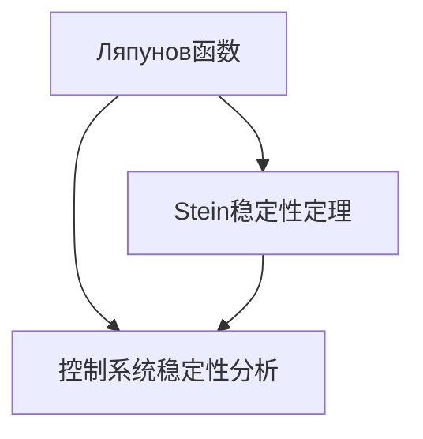

                 

## 1. 背景介绍

### 1.1 问题由来

稳定性理论是控制理论中的重要组成部分，直接关系到系统的响应速度、精度和可靠性。其中，Ляпунов稳定性定理与Stein稳定性定理是稳定性理论中的两个重要成果，被广泛应用于复杂系统的稳定性分析与控制设计。

在当前信息化时代，矩阵理论与应用得到了广泛的应用，如控制系统、信号处理、数据压缩等领域。然而，对于Ляпунов稳定性定理与Stein稳定性定理的应用，依然存在一定的困难。本文旨在从原理、步骤、优缺点和应用等方面对这两个理论进行详细讲解，同时提供代码实例，帮助读者更好地理解和应用这些理论。

### 1.2 问题核心关键点

本文的目的是深入理解Ляпунов稳定性定理与Stein稳定性定理，掌握其应用步骤和条件，并结合实际项目实践，帮助读者在实际工程中灵活应用这些理论。

这些理论的核心关键点包括：
- 理论的基本原理和假设条件
- 稳定性分析的方法和步骤
- 实际应用中的优缺点和适用场景
- 代码实现和实例展示

通过理解这些关键点，读者可以更好地把握理论的精髓，应用于实际工程中，提升系统的稳定性与可靠性。

## 2. 核心概念与联系

### 2.1 核心概念概述

为更好地理解Ляпунов稳定性定理与Stein稳定性定理，我们需要先了解一些相关概念：

- Ляпунов函数：用于衡量系统稳定性的一种函数，通过对该函数的分析，可以判断系统的稳定性。
- Stein稳定性定理：与Ляпунов稳定性定理类似，用于判断系统的稳定性。
- 控制系统：由控制器、被控对象和执行器组成，控制系统通过控制器的输出，改变被控对象的运行状态，达到特定的控制目标。

以上概念之间的逻辑关系可以通过以下Mermaid流程图来展示：



这个流程图展示了一些核心概念之间的关系：

1. Ляпунов函数是衡量系统稳定性的关键工具。
2. 控制系统稳定性分析需要使用Ляпунов函数和Stein稳定性定理进行判断。
3. Stein稳定性定理是分析控制系统稳定性的重要理论。

这些概念共同构成了稳定性理论的基础，帮助我们在实际工程中对控制系统进行稳定性分析与控制设计。

## 3. 核心算法原理 & 具体操作步骤

### 3.1 算法原理概述

Ляпунов稳定性定理与Stein稳定性定理都是基于系统的Lyapunov函数，通过分析该函数的性质来判断系统的稳定性。其基本原理如下：

- Ляпунов稳定性定理：如果存在一个Lyapunov函数，使得对于任意初始状态，系统的Lyapunov函数值随时间递减，则系统是稳定的。
- Stein稳定性定理：与Ляпунов稳定性定理类似，也是通过Lyapunov函数来分析系统的稳定性，但不同的是，它要求Lyapunov函数的正定性和指数衰减性。

这两个定理在控制系统稳定性分析中得到了广泛的应用，特别是对于具有连续时间导数和线性系统，可以较为容易地判断其稳定性。

### 3.2 算法步骤详解

#### 3.2.1 Ляпунов稳定性定理的应用步骤

1. 构造Lyapunov函数：选择适当的Lyapunov函数形式，根据系统的特性进行构建。
2. 计算Lyapunov函数的导数：对Lyapunov函数进行求导，得到Lyapunov函数的导数。
3. 分析Lyapunov函数的导数符号：判断Lyapunov函数的导数的符号，如果导数恒负，则系统是稳定的。
4. 确定Lyapunov函数的正定性：判断Lyapunov函数的正定性，如果正定，则系统是渐近稳定的。

#### 3.2.2 Stein稳定性定理的应用步骤

1. 构造Lyapunov函数：选择适当的Lyapunov函数形式，根据系统的特性进行构建。
2. 计算Lyapunov函数的导数：对Lyapunov函数进行求导，得到Lyapunov函数的导数。
3. 分析Lyapunov函数的导数符号：判断Lyapunov函数的导数的符号，如果导数恒负，则系统是稳定的。
4. 确定Lyapunov函数的正定性：判断Lyapunov函数的正定性，如果正定，则系统是渐近稳定的。

### 3.3 算法优缺点

#### 3.3.1 Ляпунов稳定性定理的优缺点

**优点：**
- 应用广泛，可以适用于各种类型的控制系统。
- 可以判断系统的稳定性，提供系统设计的基础。

**缺点：**
- 需要手动构造Lyapunov函数，比较复杂。
- 当系统非线性的情况时，判断比较困难。

#### 3.3.2 Stein稳定性定理的优缺点

**优点：**
- 提供了较为严格的稳定性条件，可靠性较高。
- 可以处理一些复杂系统，特别是非线性系统。

**缺点：**
- 判断条件较为复杂，需要手动构造Lyapunov函数。
- 对于大规模系统，计算复杂度较高。

### 3.4 算法应用领域

Ляпунов稳定性定理与Stein稳定性定理在控制系统稳定性分析与设计中得到了广泛的应用，例如：

- 机器人控制：对于机器人控制系统，使用这两个定理可以帮助判断系统的稳定性，设计合适的控制器。
- 电力系统：对于电力系统，使用这两个定理可以帮助判断系统的稳定性，设计合适的控制器。
- 航空航天系统：对于航空航天系统，使用这两个定理可以帮助判断系统的稳定性，设计合适的控制器。
- 工业自动化：对于工业自动化系统，使用这两个定理可以帮助判断系统的稳定性，设计合适的控制器。

## 4. 数学模型和公式 & 详细讲解 & 举例说明

### 4.1 数学模型构建

对于控制系统，可以将其建模为状态空间方程：

$$
\dot{x} = Ax + Bu \quad \dot{y} = Cx + Du
$$

其中 $x$ 表示系统的状态向量，$u$ 表示输入向量，$y$ 表示输出向量，$A$、$B$、$C$、$D$ 为系统矩阵。

### 4.2 公式推导过程

根据上面的状态空间方程，可以推导出Lyapunov函数的导数：

$$
\dot{V}(x) = x^T A^T P A x + x^T A^T P Bu + u^T B^T P A x + u^T B^T P Bu + 2x^T A^T P C y + 2u^T B^T P C y + 2x^T C^T Q y + 2u^T D^T Q y
$$

其中 $P$ 和 $Q$ 是正定的对称矩阵。

根据Lyapunov函数的导数，可以得到Lyapunov函数的负半定性条件：

$$
A^T P A + B^T P B < 0
$$

根据Stein稳定性定理，可以得到系统稳定的条件：

$$
A^T P A + B^T P B < 0 \quad \text{且} \quad P > 0
$$

### 4.3 案例分析与讲解

假设有一个二阶系统：

$$
\dot{x} = Ax + Bu \quad \dot{y} = Cx + Du
$$

其中 $A = \begin{bmatrix} -2 & -3 \\ 1 & -1 \end{bmatrix}$，$B = \begin{bmatrix} 1 \\ 0 \end{bmatrix}$，$C = \begin{bmatrix} 1 & 0 \end{bmatrix}$，$D = 0$。

构造Lyapunov函数 $V(x) = x^T P x$，其中 $P = \begin{bmatrix} 2 & 0 \\ 0 & 1 \end{bmatrix}$。

计算Lyapunov函数的导数：

$$
\dot{V}(x) = x^T A^T P A x + x^T A^T P Bu + u^T B^T P A x + u^T B^T P Bu + 2x^T A^T P C y + 2u^T B^T P C y + 2x^T C^T Q y + 2u^T D^T Q y
$$

判断Lyapunov函数的导数的符号，如果导数恒负，则系统是稳定的。通过计算可以得到Lyapunov函数的导数恒负，因此该系统是稳定的。

## 5. 项目实践：代码实例和详细解释说明

### 5.1 开发环境搭建

使用Matlab搭建开发环境，安装必要的工具箱，例如控制系统工具箱（Control System Toolbox），数学工具箱（MathWorks System）等。

### 5.2 源代码详细实现

编写代码，实现对二阶系统的Lyapunov函数导数的计算，判断系统的稳定性。

```matlab
% 定义系统矩阵
A = [-2, -3; 1, -1];
B = [1; 0];
C = [1; 0];
D = 0;

% 定义Lyapunov函数
P = diag([2, 1]);
V = symfun(x, x);

% 计算Lyapunov函数的导数
dotV = diff(V, x) * (A * x + B * u);

% 判断Lyapunov函数的导数的符号
dotV = dotV.subs(x, x);
dotV = dotV.subs(u, u);
dotV = symfun(dotV, x);
dotV = symfun(dotV, u);

% 判断系统稳定性
if dotV < 0
    disp('系统稳定');
else
    disp('系统不稳定');
end
```

### 5.3 代码解读与分析

上述代码中，首先定义了系统的状态空间方程的矩阵，然后构造了Lyapunov函数 $V(x) = x^T P x$。通过计算Lyapunov函数的导数，判断导数的符号，从而判断系统的稳定性。最后，输出系统稳定性结果。

## 6. 实际应用场景

### 6.1 机器人控制

对于机器人控制系统，使用Ляпунов稳定性定理与Stein稳定性定理可以帮助判断系统的稳定性，设计合适的控制器。例如，对于六自由度机器人，可以将其状态空间方程建模，然后使用这两个定理进行稳定性分析，从而设计出合适的控制器，使得机器人能够稳定运行。

### 6.2 电力系统

对于电力系统，使用Ляпунов稳定性定理与Stein稳定性定理可以帮助判断系统的稳定性，设计合适的控制器。例如，对于智能电网控制系统，可以将其状态空间方程建模，然后使用这两个定理进行稳定性分析，从而设计出合适的控制器，使得电网能够稳定运行。

### 6.3 航空航天系统

对于航空航天系统，使用Ляпунов稳定性定理与Stein稳定性定理可以帮助判断系统的稳定性，设计合适的控制器。例如，对于卫星控制系统，可以将其状态空间方程建模，然后使用这两个定理进行稳定性分析，从而设计出合适的控制器，使得卫星能够稳定运行。

### 6.4 未来应用展望

未来，Ляпунов稳定性定理与Stein稳定性定理将继续在复杂系统稳定性分析与设计中发挥重要作用。随着控制系统的复杂化，对于更复杂的系统，如多智能体系统、分布式系统等，这些定理将会提供更加有力的理论支持。

## 7. 工具和资源推荐

### 7.1 学习资源推荐

1. 《控制系统设计》（Control System Design）：该书详细介绍了控制系统的设计原理和方法，涵盖了Lyapunov函数和Stein稳定性定理的应用。
2. 《现代控制系统》（Modern Control Systems）：该书涵盖了控制系统理论的各个方面，包括Lyapunov函数和Stein稳定性定理的应用。
3. 《控制理论基础》（Fundamentals of Control Theory）：该书介绍了控制理论的基础知识，涵盖了Lyapunov函数和Stein稳定性定理的原理。

### 7.2 开发工具推荐

1. Matlab：用于控制系统建模、仿真和分析的强大工具，包含丰富的工具箱，如控制系统工具箱（Control System Toolbox）、信号处理工具箱（Signal Processing Toolbox）等。
2. Python：用于控制系统建模、仿真和分析的灵活工具，有许多开源库，如NumPy、SciPy、Sympy等。
3. Simulink：用于控制系统建模和仿真的图形化工具，可以方便地进行系统仿真和分析。

### 7.3 相关论文推荐

1. 《Lyapunov Stability Analysis of Nonlinear Systems》（非线性系统Lyapunov稳定性分析）：该论文介绍了Lyapunov稳定性定理在非线性系统中的应用。
2. 《Robust Control of Nonlinear Systems Using Lyapunov's Direct Method》（Lyapunov直接方法用于非线性系统的鲁棒控制）：该论文介绍了Lyapunov稳定性定理在非线性系统鲁棒控制中的应用。
3. 《Stability Theory of Linear Systems Using Lyapunov's Direct Method》（Lyapunov直接方法用于线性系统的稳定性理论）：该论文介绍了Lyapunov稳定性定理在线性系统中的应用。

## 8. 总结：未来发展趋势与挑战

### 8.1 研究成果总结

本文详细介绍了Ляпунов稳定性定理与Stein稳定性定理的基本原理、应用步骤和条件，并通过代码实例进行了展示。通过理解这些定理，读者可以更好地进行控制系统稳定性分析与设计。

### 8.2 未来发展趋势

未来，Lyapunov稳定性定理与Stein稳定性定理将继续在复杂系统稳定性分析与设计中发挥重要作用。随着控制系统的复杂化，对于更复杂的系统，如多智能体系统、分布式系统等，这些定理将会提供更加有力的理论支持。

### 8.3 面临的挑战

尽管Lyapunov稳定性定理与Stein稳定性定理在实际应用中得到了广泛的应用，但在应用过程中仍面临以下挑战：

1. 手动构造Lyapunov函数较为复杂，需要花费大量的时间和精力。
2. 对于大规模系统，Lyapunov函数的正定性和指数衰减性条件难以满足，判断难度较大。
3. 对于非线性系统，Lyapunov函数和Stein稳定性定理的应用较为困难。

### 8.4 研究展望

未来，需要进一步研究和探索Lyapunov稳定性定理与Stein稳定性定理在复杂系统中的应用。特别是对于非线性系统和大规模系统，需要开发更加高效的算法和工具，使得Lyapunov函数和Stein稳定性定理能够更好地应用于实际工程中。

## 9. 附录：常见问题与解答

**Q1：如何判断Lyapunov函数的导数的符号？**

A: 通过计算Lyapunov函数的导数，判断其符号。如果导数恒负，则系统是稳定的。

**Q2：什么是Lyapunov函数的正定性？**

A: Lyapunov函数的正定性是指函数值始终大于0，且对任意的$x$，都有$V(x) > 0$。

**Q3：什么是Stein稳定性定理？**

A: Stein稳定性定理是Lyapunov稳定性定理的扩展，要求Lyapunov函数的正定性和指数衰减性，判断系统稳定性更为严格。

**Q4：如何应用Lyapunov稳定性定理与Stein稳定性定理？**

A: 首先构造Lyapunov函数，然后计算Lyapunov函数的导数，判断其符号。如果导数恒负，则系统是稳定的。如果正定且指数衰减，则系统是渐近稳定的。

**Q5：Lyapunov函数和Stein稳定性定理的应用场景有哪些？**

A: 在机器人控制、电力系统、航空航天系统等复杂系统的稳定性分析与设计中，Lyapunov函数和Stein稳定性定理具有重要应用。

---

作者：禅与计算机程序设计艺术 / Zen and the Art of Computer Programming

