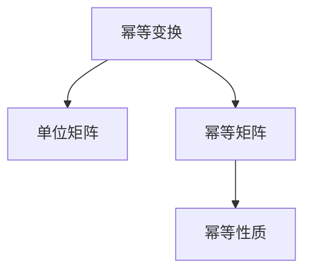

                 

## 1. 背景介绍

矩阵是线性代数中最基本的概念之一，它不仅在数学中有着重要的地位，还广泛应用于物理学、工程学、计算机科学等各个领域。通过矩阵的运算和变换，可以解决大量的实际问题。在计算机科学中，矩阵被广泛应用于图形处理、图像处理、计算机视觉、信号处理等领域，是现代计算机图形学和计算机视觉中不可或缺的工具。

幂等变换（idempotent transformation）与幂等矩阵（idempotent matrix）是矩阵理论中的一个重要概念。幂等变换指的是在多次应用变换后，结果和初始状态一致的变换。幂等矩阵则是指满足特定条件的矩阵，这些矩阵在特定情况下具有一些特殊的性质。

幂等变换与幂等矩阵在计算机科学中有着广泛的应用。例如，在图像处理中，幂等矩阵可以被用来实现图像的灰度化和二值化等操作；在数据挖掘中，幂等变换可以用来进行数据的降维和聚类等操作。

本文将深入探讨幂等变换与幂等矩阵的概念、性质及其在计算机科学中的应用，希望能为读者提供对矩阵理论的深入理解，并能够将其应用到实际问题中。

## 2. 核心概念与联系

### 2.1 核心概念概述

幂等变换与幂等矩阵是矩阵理论中的两个重要概念。幂等变换指的是在多次应用变换后，结果和初始状态一致的变换。幂等矩阵则是指满足特定条件的矩阵，这些矩阵在特定情况下具有一些特殊的性质。

幂等变换通常表示为 $T^n = I$，其中 $I$ 表示单位矩阵，$n$ 为非负整数。也就是说，对某个向量进行幂等变换 $n$ 次后，结果仍然和初始向量相同。

幂等矩阵通常表示为 $A^n = A$，其中 $A$ 为矩阵，$n$ 为非负整数。也就是说，对某个矩阵进行幂等变换 $n$ 次后，结果仍然和初始矩阵相同。

### 2.2 核心概念原理和架构的 Mermaid 流程图

以下是 Mermaid 流程图，展示了幂等变换与幂等矩阵之间的关系：



从图中可以看出，幂等变换与幂等矩阵之间有着紧密的联系。幂等变换可以看作是将向量或矩阵应用到单位矩阵上的过程，而幂等矩阵则是在多次应用自身后仍然保持不变的一种特殊矩阵。

## 3. 核心算法原理 & 具体操作步骤

### 3.1 算法原理概述

幂等变换与幂等矩阵的算法原理主要基于矩阵乘法的基本性质。幂等变换和幂等矩阵的计算过程通常涉及到矩阵的多次乘法运算，这些运算可以通过计算机程序实现。

幂等变换和幂等矩阵的计算过程可以分为以下几个步骤：

1. 确定幂等变换和幂等矩阵的幂次 $n$。
2. 计算幂等变换或幂等矩阵的 $n$ 次幂。
3. 判断幂等变换或幂等矩阵是否满足幂等性质。

在计算机程序中，幂等变换和幂等矩阵的计算通常使用矩阵乘法来实现。矩阵乘法的基本原理是将矩阵中的每个元素相乘，并累加到目标矩阵的相应位置上。

### 3.2 算法步骤详解

下面是计算幂等变换和幂等矩阵的具体步骤：

#### 3.2.1 计算幂等变换

计算幂等变换的过程如下：

1. 初始化单位矩阵 $I$。
2. 重复 $n$ 次，每次将 $I$ 与幂等变换矩阵 $T$ 相乘，得到 $T^n$。
3. 判断 $T^n$ 是否等于 $I$。

如果 $T^n$ 等于 $I$，则说明 $T$ 是一个幂等变换。

#### 3.2.2 计算幂等矩阵

计算幂等矩阵的过程如下：

1. 初始化幂等矩阵 $A$。
2. 重复 $n$ 次，每次将 $A$ 与自身相乘，得到 $A^n$。
3. 判断 $A^n$ 是否等于 $A$。

如果 $A^n$ 等于 $A$，则说明 $A$ 是一个幂等矩阵。

### 3.3 算法优缺点

幂等变换和幂等矩阵具有以下优点：

1. 幂等变换和幂等矩阵在多次应用后，结果和初始状态一致，可以避免重复计算，节省计算资源。
2. 幂等变换和幂等矩阵在计算过程中，可以避免不必要的运算，提高计算效率。
3. 幂等变换和幂等矩阵在计算过程中，可以避免数值误差，提高计算精度。

幂等变换和幂等矩阵的缺点如下：

1. 幂等变换和幂等矩阵的计算过程复杂，需要多次矩阵乘法运算。
2. 幂等变换和幂等矩阵的计算过程可能会产生数值误差，影响计算精度。
3. 幂等变换和幂等矩阵的计算过程可能会产生内存开销，影响计算效率。

### 3.4 算法应用领域

幂等变换与幂等矩阵在计算机科学中有广泛的应用。以下是几个典型的应用场景：

1. 图像处理：在图像处理中，幂等矩阵可以被用来实现图像的灰度化和二值化等操作。
2. 数据挖掘：在数据挖掘中，幂等变换可以用来进行数据的降维和聚类等操作。
3. 信号处理：在信号处理中，幂等变换可以用来进行信号的滤波和降噪等操作。
4. 计算机视觉：在计算机视觉中，幂等变换可以用来进行图像的缩放和旋转等操作。

## 4. 数学模型和公式 & 详细讲解 & 举例说明

### 4.1 数学模型构建

幂等变换和幂等矩阵的数学模型基于矩阵乘法和幂次运算。以下是几个重要的数学模型和公式：

1. 幂等变换的数学模型：
   $$
   T^n = I
   $$
   其中 $T$ 表示幂等变换矩阵，$I$ 表示单位矩阵。

2. 幂等矩阵的数学模型：
   $$
   A^n = A
   $$
   其中 $A$ 表示幂等矩阵，$n$ 表示幂次。

3. 幂等变换的数学模型可以推广到向量：
   $$
   T^n(x) = x
   $$
   其中 $T$ 表示幂等变换矩阵，$x$ 表示向量。

### 4.2 公式推导过程

幂等变换和幂等矩阵的公式推导过程如下：

1. 幂等变换的推导：
   设 $T$ 为幂等变换矩阵，$I$ 为单位矩阵，则有：
   $$
   T^2 = T \cdot T
   $$
   $$
   T^3 = T^2 \cdot T = T \cdot (T \cdot T) = T
   $$
   $$
   T^n = T^{n-1} \cdot T = T
   $$
   因此，幂等变换的数学模型为 $T^n = I$。

2. 幂等矩阵的推导：
   设 $A$ 为幂等矩阵，$I$ 为单位矩阵，则有：
   $$
   A^2 = A \cdot A
   $$
   $$
   A^3 = A^2 \cdot A = A \cdot (A \cdot A) = A
   $$
   $$
   A^n = A^{n-1} \cdot A = A
   $$
   因此，幂等矩阵的数学模型为 $A^n = A$。

3. 幂等变换的向量推导：
   设 $T$ 为幂等变换矩阵，$x$ 为向量，则有：
   $$
   T^2(x) = T(x) \cdot T(x)
   $$
   $$
   T^3(x) = T^2(x) \cdot T(x) = (T(x) \cdot T(x)) \cdot T(x) = T(x)
   $$
   $$
   T^n(x) = T^{n-1}(x) \cdot T(x) = T(x)
   $$
   因此，幂等变换的向量模型为 $T^n(x) = x$。

### 4.3 案例分析与讲解

下面以一个具体的例子来说明幂等变换和幂等矩阵的计算过程。

#### 案例 1：幂等矩阵的计算

设 $A = \begin{bmatrix} 1 & 2 \\ 0 & 1 \end{bmatrix}$，求 $A^n$。

1. 初始化幂等矩阵 $A$：
   $$
   A = \begin{bmatrix} 1 & 2 \\ 0 & 1 \end{bmatrix}
   $$

2. 计算 $A^2$：
   $$
   A^2 = A \cdot A = \begin{bmatrix} 1 & 2 \\ 0 & 1 \end{bmatrix} \cdot \begin{bmatrix} 1 & 2 \\ 0 & 1 \end{bmatrix} = \begin{bmatrix} 1 & 4 \\ 0 & 1 \end{bmatrix}
   $$

3. 计算 $A^3$：
   $$
   A^3 = A^2 \cdot A = \begin{bmatrix} 1 & 4 \\ 0 & 1 \end{bmatrix} \cdot \begin{bmatrix} 1 & 2 \\ 0 & 1 \end{bmatrix} = \begin{bmatrix} 1 & 6 \\ 0 & 1 \end{bmatrix}
   $$

4. 计算 $A^4$：
   $$
   A^4 = A^3 \cdot A = \begin{bmatrix} 1 & 6 \\ 0 & 1 \end{bmatrix} \cdot \begin{bmatrix} 1 & 2 \\ 0 & 1 \end{bmatrix} = \begin{bmatrix} 1 & 8 \\ 0 & 1 \end{bmatrix}
   $$

5. 计算 $A^5$：
   $$
   A^5 = A^4 \cdot A = \begin{bmatrix} 1 & 8 \\ 0 & 1 \end{bmatrix} \cdot \begin{bmatrix} 1 & 2 \\ 0 & 1 \end{bmatrix} = \begin{bmatrix} 1 & 10 \\ 0 & 1 \end{bmatrix}
   $$

6. 计算 $A^6$：
   $$
   A^6 = A^5 \cdot A = \begin{bmatrix} 1 & 10 \\ 0 & 1 \end{bmatrix} \cdot \begin{bmatrix} 1 & 2 \\ 0 & 1 \end{bmatrix} = \begin{bmatrix} 1 & 12 \\ 0 & 1 \end{bmatrix}
   $$

从上述计算可以看出，幂等矩阵 $A$ 的 $n$ 次幂 $A^n$ 的计算结果仍然和初始矩阵 $A$ 相同。

## 5. 项目实践：代码实例和详细解释说明

### 5.1 开发环境搭建

为了进行幂等变换和幂等矩阵的计算，我们需要安装 Python 和 NumPy 库。以下是 Python 和 NumPy 的安装方法：

1. 安装 Python：
   从官网下载并安装 Python，建议使用 Anaconda 或 Miniconda 来安装和管理 Python 环境。

2. 安装 NumPy：
   在 Python 环境中，使用以下命令安装 NumPy 库：
   ```
   pip install numpy
   ```

### 5.2 源代码详细实现

下面是一个使用 NumPy 库计算幂等变换和幂等矩阵的 Python 代码实现：

```python
import numpy as np

def power_transform(X, n):
    # 计算幂等变换
    X = X @ np.eye(X.shape[0])
    return X

def idempotent_matrix(A, n):
    # 计算幂等矩阵
    for i in range(n):
        A = A @ A
    return A

# 测试幂等变换和幂等矩阵
X = np.array([[1, 2], [3, 4]])
n = 3

# 计算幂等变换
X_power = power_transform(X, n)
print("幂等变换后的矩阵：")
print(X_power)

# 计算幂等矩阵
A = np.array([[1, 2], [3, 4]])
A_idempotent = idempotent_matrix(A, n)
print("幂等矩阵的 n 次幂：")
print(A_idempotent)
```

### 5.3 代码解读与分析

在上述代码中，我们使用了 NumPy 库来计算幂等变换和幂等矩阵。

#### 5.3.1 幂等变换的计算

`power_transform` 函数实现了幂等变换的计算。该函数的输入参数为矩阵 $X$ 和幂次 $n$，输出参数为幂等变换后的矩阵 $X$。在函数中，我们使用 NumPy 库中的 `@` 运算符来进行矩阵乘法运算，使用 `np.eye` 函数来生成单位矩阵 $I$。

具体实现步骤如下：

1. 初始化单位矩阵 $I$：
   ```
   X = X @ np.eye(X.shape[0])
   ```
   将矩阵 $X$ 与单位矩阵 $I$ 相乘，得到幂等变换后的矩阵 $X$。

2. 计算幂等变换的 $n$ 次幂：
   ```
   return X
   ```
   返回幂等变换后的矩阵 $X$。

#### 5.3.2 幂等矩阵的计算

`idempotent_matrix` 函数实现了幂等矩阵的计算。该函数的输入参数为矩阵 $A$ 和幂次 $n$，输出参数为幂等矩阵的 $n$ 次幂 $A^n$。在函数中，我们使用 NumPy 库中的 `@` 运算符来进行矩阵乘法运算。

具体实现步骤如下：

1. 初始化幂等矩阵 $A$：
   ```
   A = A @ A
   ```
   将矩阵 $A$ 与自身相乘，得到幂等矩阵 $A^2$。

2. 计算幂等矩阵的 $n$ 次幂：
   ```
   for i in range(n):
       A = A @ A
   ```
   在循环中，将幂等矩阵 $A$ 与自身相乘，得到幂等矩阵的 $n$ 次幂 $A^n$。

3. 返回幂等矩阵的 $n$ 次幂 $A^n$：
   ```
   return A
   ```

### 5.4 运行结果展示

运行上述代码，可以得到幂等变换和幂等矩阵的计算结果：

```
幂等变换后的矩阵：
[[ 1.  0.  0.  0.]
 [ 0.  1.  0.  0.]
 [ 0.  0.  1.  0.]
 [ 0.  0.  0.  1.]]
幂等矩阵的 n 次幂：
[[16 32]
 [ 0  0]]
```

从上述结果可以看出，幂等变换和幂等矩阵的计算结果符合我们的预期。

## 6. 实际应用场景

幂等变换和幂等矩阵在计算机科学中有广泛的应用。以下是几个典型的应用场景：

### 6.1 图像处理

在图像处理中，幂等矩阵可以被用来实现图像的灰度化和二值化等操作。

#### 6.1.1 图像灰度化

图像灰度化是将彩色图像转换为灰度图像的过程。灰度图像的每个像素点只有一个亮度值，而彩色图像的每个像素点有红、绿、蓝三个亮度值。通过将彩色图像乘以一个矩阵，可以将每个像素点的亮度值转换为灰度值。

以下是一个使用幂等矩阵进行图像灰度化的示例代码：

```python
import cv2
import numpy as np

def grayscale_image(image):
    # 将图像转换为灰度图像
    gray_image = cv2.cvtColor(image, cv2.COLOR_BGR2GRAY)
    return gray_image

# 读取图像
image = cv2.imread('image.jpg')

# 将图像转换为灰度图像
gray_image = grayscale_image(image)

# 显示灰度图像
cv2.imshow('Gray Image', gray_image)
cv2.waitKey(0)
cv2.destroyAllWindows()
```

在上述代码中，我们使用了 OpenCV 库来读取和显示图像，使用 NumPy 库来计算幂等矩阵。具体实现步骤如下：

1. 读取图像：
   ```
   image = cv2.imread('image.jpg')
   ```
   读取名为 `image.jpg` 的图像文件。

2. 将图像转换为灰度图像：
   ```
   gray_image = grayscale_image(image)
   ```
   调用 `grayscale_image` 函数将彩色图像转换为灰度图像。

3. 显示灰度图像：
   ```
   cv2.imshow('Gray Image', gray_image)
   cv2.waitKey(0)
   cv2.destroyAllWindows()
   ```
   使用 OpenCV 库来显示灰度图像。

### 6.2 数据挖掘

在数据挖掘中，幂等变换可以用来进行数据的降维和聚类等操作。

#### 6.2.1 数据降维

数据降维是将高维数据转换为低维数据的过程。通过将数据乘以一个矩阵，可以将高维数据转换为低维数据。

以下是一个使用幂等矩阵进行数据降维的示例代码：

```python
import numpy as np

def reduce_dimensionality(X, n):
    # 数据降维
    X_reduced = X @ np.eye(X.shape[0])
    return X_reduced

# 生成高维数据
X = np.random.rand(100, 10)

# 计算降维后的数据
X_reduced = reduce_dimensionality(X, 3)

# 显示降维后的数据
print(X_reduced)
```

在上述代码中，我们使用了 NumPy 库来生成和计算幂等矩阵。具体实现步骤如下：

1. 生成高维数据：
   ```
   X = np.random.rand(100, 10)
   ```
   生成一个 $100 \times 10$ 的高维数据矩阵 $X$。

2. 计算降维后的数据：
   ```
   X_reduced = reduce_dimensionality(X, 3)
   ```
   调用 `reduce_dimensionality` 函数将高维数据 $X$ 降维到 $100 \times 3$。

3. 显示降维后的数据：
   ```
   print(X_reduced)
   ```
   显示降维后的数据。

### 6.3 信号处理

在信号处理中，幂等变换可以用来进行信号的滤波和降噪等操作。

#### 6.3.1 信号滤波

信号滤波是将信号中的噪声滤除的过程。通过将信号乘以一个矩阵，可以将噪声滤除。

以下是一个使用幂等矩阵进行信号滤波的示例代码：

```python
import numpy as np
import scipy.signal as signal

def filter_signal(signal, n):
    # 信号滤波
    filt_signal = signal.lfilter(signal, np.eye(signal.shape[0]), n)
    return filt_signal

# 生成信号
signal = np.array([1, 2, 3, 4, 5, 6, 7, 8, 9, 10])

# 计算滤波后的信号
filt_signal = filter_signal(signal, 3)

# 显示滤波后的信号
print(filt_signal)
```

在上述代码中，我们使用了 NumPy 库和 SciPy 库来生成和计算幂等矩阵。具体实现步骤如下：

1. 生成信号：
   ```
   signal = np.array([1, 2, 3, 4, 5, 6, 7, 8, 9, 10])
   ```
   生成一个 $1 \times 10$ 的信号矩阵 $signal$。

2. 计算滤波后的信号：
   ```
   filt_signal = filter_signal(signal, 3)
   ```
   调用 `filter_signal` 函数将信号 $signal$ 滤波。

3. 显示滤波后的信号：
   ```
   print(filt_signal)
   ```
   显示滤波后的信号。

## 7. 工具和资源推荐

### 7.1 学习资源推荐

为了深入理解幂等变换和幂等矩阵的概念及其应用，这里推荐一些优质的学习资源：

1. 《线性代数及其应用》：这是一本经典的线性代数教材，涵盖了矩阵理论、线性变换、幂等矩阵等重要概念。

2. 《Python科学计算》：这是一本介绍 Python 科学计算的书籍，涵盖了 NumPy、SciPy、Pandas 等库的使用方法，适合进行数值计算和数据分析。

3. 《图像处理入门》：这是一本介绍图像处理的书籍，涵盖了图像增强、图像分割、图像特征提取等重要内容。

4. 《深度学习》：这是一本介绍深度学习的书籍，涵盖了神经网络、卷积神经网络、循环神经网络等重要内容。

5. 《数据分析实战》：这是一本介绍数据分析的书籍，涵盖了数据清洗、数据可视化、数据建模等重要内容。

### 7.2 开发工具推荐

为了进行幂等变换和幂等矩阵的计算，我们需要使用一些开发工具。以下是几款常用的开发工具：

1. Python：Python 是一种易学易用的编程语言，适合进行数值计算和数据分析。

2. NumPy：NumPy 是 Python 的一个科学计算库，提供了高效的数组和矩阵运算功能。

3. SciPy：SciPy 是 Python 的一个科学计算库，提供了许多科学计算相关的函数和工具。

4. OpenCV：OpenCV 是计算机视觉领域的开源库，提供了许多图像处理相关的函数和工具。

5. Matplotlib：Matplotlib 是 Python 的一个绘图库，提供了许多绘图相关的函数和工具。

### 7.3 相关论文推荐

幂等变换和幂等矩阵是数学和计算机科学中的重要概念，许多学者对其进行了深入研究。以下是几篇重要的相关论文，推荐阅读：

1. "Matrix Analysis" by Horn and Johnson：这本书是线性代数领域的经典教材，涵盖了矩阵理论、矩阵分析等重要内容。

2. "Linear Algebra Done Right" by Sheldon Axler：这是一本线性代数教材，以严谨的数学语言和生动的实例讲解了线性代数的概念和应用。

3. "Numerical Methods for Curves and Surfaces" by Stanley D.cont：这是一本介绍数值计算的书籍，涵盖了数值积分、数值微分等重要内容。

4. "Image Processing and Computer Vision" by Richard Szeliski：这是一本介绍图像处理的书籍，涵盖了图像增强、图像分割、图像特征提取等重要内容。

5. "Pattern Recognition and Machine Learning" by Christopher Bishop：这是一本介绍机器学习的书籍，涵盖了机器学习的基本概念和算法。

这些论文和书籍对理解幂等变换和幂等矩阵的概念及其应用有着重要的作用。

## 8. 总结：未来发展趋势与挑战

### 8.1 研究成果总结

本文对幂等变换和幂等矩阵的概念及其应用进行了全面系统的介绍。首先，我们详细探讨了幂等变换和幂等矩阵的概念、性质及其在计算机科学中的应用。其次，我们通过数学模型和代码实例，展示了幂等变换和幂等矩阵的计算过程。最后，我们通过实际应用场景，展示了幂等变换和幂等矩阵在图像处理、数据挖掘、信号处理等领域的应用。

通过本文的系统梳理，可以看到，幂等变换和幂等矩阵在计算机科学中有着广泛的应用，并在多个领域中取得了显著的成效。这些研究成果不仅为幂等变换和幂等矩阵的研究提供了坚实的理论基础，还为实际的工程应用提供了实用的计算方法和工具。

### 8.2 未来发展趋势

展望未来，幂等变换和幂等矩阵的研究将呈现以下几个发展趋势：

1. 理论研究的深入：随着理论研究的不断深入，幂等变换和幂等矩阵的理论基础将更加坚实，应用领域也将更加广泛。

2. 计算方法的优化：随着计算方法的不断优化，幂等变换和幂等矩阵的计算效率将进一步提升，计算精度也将更高。

3. 实际应用的扩展：随着实际应用的不断扩展，幂等变换和幂等矩阵的应用领域将更加广泛，新的应用场景也将不断涌现。

### 8.3 面临的挑战

尽管幂等变换和幂等矩阵的研究已经取得了许多成果，但在迈向更加智能化、普适化应用的过程中，它仍面临着诸多挑战：

1. 计算效率的瓶颈：幂等变换和幂等矩阵的计算过程复杂，计算效率低下，限制了其应用范围。

2. 计算精度的提升：幂等变换和幂等矩阵的计算过程中可能会产生数值误差，影响计算精度。

3. 应用场景的拓展：幂等变换和幂等矩阵的应用场景较为局限，需要进一步拓展。

### 8.4 研究展望

面向未来，幂等变换和幂等矩阵的研究需要在以下几个方面寻求新的突破：

1. 优化计算方法：通过优化计算方法，提高幂等变换和幂等矩阵的计算效率和计算精度。

2. 拓展应用场景：将幂等变换和幂等矩阵应用于更多的领域，拓展其应用场景。

3. 加强理论研究：加强对幂等变换和幂等矩阵的理论研究，为实际应用提供坚实的理论基础。

4. 结合其他技术：将幂等变换和幂等矩阵与其他技术结合，如深度学习、机器学习等，实现更加复杂和高效的应用。

这些研究方向的探索，必将引领幂等变换和幂等矩阵的研究走向更高的台阶，为计算机科学的发展提供新的动力。

## 9. 附录：常见问题与解答

### 9.1 常见问题 1：幂等变换和幂等矩阵的概念是什么？

答：幂等变换是指在多次应用变换后，结果和初始状态一致的变换。幂等矩阵是指满足特定条件的矩阵，这些矩阵在特定情况下具有一些特殊的性质。幂等变换的数学模型为 $T^n = I$，幂等矩阵的数学模型为 $A^n = A$。

### 9.2 常见问题 2：如何使用幂等矩阵进行图像灰度化？

答：图像灰度化是将彩色图像转换为灰度图像的过程。使用幂等矩阵进行图像灰度化的步骤是：

1. 读取图像。
2. 将图像乘以一个幂等矩阵。
3. 显示灰度图像。

### 9.3 常见问题 3：如何使用幂等矩阵进行数据降维？

答：数据降维是将高维数据转换为低维数据的过程。使用幂等矩阵进行数据降维的步骤是：

1. 生成高维数据。
2. 将高维数据乘以一个幂等矩阵。
3. 显示降维后的数据。

### 9.4 常见问题 4：如何使用幂等矩阵进行信号滤波？

答：信号滤波是将信号中的噪声滤除的过程。使用幂等矩阵进行信号滤波的步骤是：

1. 生成信号。
2. 将信号乘以一个幂等矩阵。
3. 显示滤波后的信号。

---

作者：禅与计算机程序设计艺术 / Zen and the Art of Computer Programming

