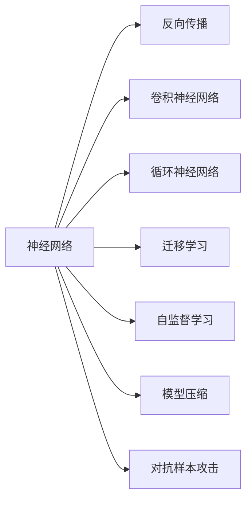

                 

## 1. 背景介绍

### 1.1 问题由来

神经网络作为人工智能的基石，近年来在各个领域取得了举世瞩目的突破。从最初的反向传播算法（Backpropagation），到深度学习（Deep Learning），再到现在的深度神经网络（Deep Neural Networks, DNNs），神经网络已经从理论研究走向实际应用，驱动了人工智能技术的飞速发展。

神经网络的成功应用涵盖了计算机视觉、自然语言处理、语音识别、推荐系统等众多领域。比如在计算机视觉领域，通过卷积神经网络（Convolutional Neural Networks, CNNs），可以实现图像识别、目标检测等任务，极大提升了机器视觉的智能化水平。在自然语言处理领域，通过循环神经网络（Recurrent Neural Networks, RNNs）和其变体LSTM、GRU，可以解决语言模型、机器翻译、文本生成等任务。

神经网络之所以能取得如此显著的成就，源于其强大的表达能力和自适应学习能力。通过多层非线性变换，神经网络能够捕捉复杂的特征和模式，同时通过反向传播算法进行端到端的训练，自适应地调整网络参数，不断优化模型性能。

### 1.2 问题核心关键点

神经网络的核心在于其复杂的结构设计和训练算法，但具体的应用则更加注重模型设计的合理性和适用性。在实际应用中，神经网络面临着数据量大、计算复杂度高、可解释性不足等诸多挑战。因此，研究者们不断探索新的神经网络结构和训练方法，以期实现更高的性能和更广泛的应用场景。

以下是神经网络应用中的一些关键问题：

1. **网络架构设计**：如何设计高效的网络结构，以减少参数量和计算复杂度，同时保持模型的表达能力和泛化能力。
2. **训练算法优化**：如何优化训练算法，加快收敛速度，提高模型精度。
3. **正则化技术**：如何通过正则化技术避免过拟合，提高模型泛化能力。
4. **迁移学习与自监督学习**：如何通过迁移学习和自监督学习利用未标注数据，提高模型迁移能力和自适应能力。
5. **模型可解释性**：如何提高模型的可解释性，确保模型决策的透明性和可靠性。
6. **对抗样本攻击**：如何防御对抗样本攻击，提高模型鲁棒性。

这些问题的研究进展和解决策略，共同构成了神经网络应用的核心内容。

## 2. 核心概念与联系

### 2.1 核心概念概述

为了更好地理解神经网络的应用，下面将介绍几个密切相关的核心概念：

- **神经网络（Neural Networks, NNs）**：一种由大量人工神经元（神经元节点）组成的计算模型，通过输入层、隐藏层和输出层的多层非线性变换，实现对复杂数据的建模和预测。
- **反向传播算法（Backpropagation）**：一种用于训练神经网络的优化算法，通过计算损失函数对每个参数的梯度，并反向传播更新参数，实现模型训练。
- **卷积神经网络（Convolutional Neural Networks, CNNs）**：一种特殊的神经网络，通过卷积和池化操作提取图像特征，常用于计算机视觉领域。
- **循环神经网络（Recurrent Neural Networks, RNNs）**：一种具有循环结构的网络，通过时间序列数据建模，常用于自然语言处理、语音识别等领域。
- **迁移学习（Transfer Learning）**：一种通过在一个领域训练好的模型，在新领域上进行微调，以提高模型在新领域上的性能。
- **自监督学习（Self-Supervised Learning）**：一种利用未标注数据进行模型训练的方法，通过设计预训练任务（如掩码语言模型、自编码器等），学习到通用特征表示。
- **模型压缩（Model Compression）**：一种优化神经网络模型的方法，通过剪枝、量化、蒸馏等技术，减少模型参数量和计算复杂度。
- **对抗样本攻击（Adversarial Attacks）**：一种通过微小扰动输入数据，导致模型输出错误结果的攻击方法，通常用于评估模型的鲁棒性。

这些核心概念之间的逻辑关系可以通过以下Mermaid流程图来展示：



这个流程图展示了神经网络的基本组成及其与其他核心概念的关系：

1. 神经网络通过反向传播算法进行训练，可进一步设计成卷积神经网络和循环神经网络，用于不同的应用场景。
2. 迁移学习和自监督学习帮助神经网络更好地利用数据，提高模型的泛化能力和迁移能力。
3. 模型压缩和对抗样本攻击则关注模型的优化和安全性，进一步提升模型的实用性和鲁棒性。

这些核心概念共同构成了神经网络应用的基础框架，为其在各个领域的应用提供了支持。

## 3. 核心算法原理 & 具体操作步骤
### 3.1 算法原理概述

神经网络的核心算法原理是反向传播算法（Backpropagation）。反向传播算法通过计算损失函数对每个参数的梯度，并反向传播更新参数，实现模型训练。其核心步骤如下：

1. **前向传播**：将输入数据输入神经网络，通过多层非线性变换，得到输出结果。
2. **计算损失**：将输出结果与真实标签比较，计算损失函数。
3. **反向传播**：通过链式法则，计算每个参数对损失函数的梯度。
4. **参数更新**：使用梯度下降等优化算法，根据梯度更新模型参数。
5. **重复迭代**：重复执行上述步骤，直至模型收敛。

神经网络通过反向传播算法不断优化参数，使得模型输出逼近真实标签，实现对数据的建模和预测。这一过程本质上是一种梯度下降的优化过程，通过迭代调整模型参数，最小化损失函数，提升模型性能。

### 3.2 算法步骤详解

以一个简单的全连接神经网络为例，详细讲解其反向传播算法的过程。

设输入数据为 $x$，模型参数为 $\theta$，隐藏层节点数为 $h$，输出节点数为 $1$，使用均方误差损失函数（Mean Squared Error, MSE）。

1. **前向传播**：
   $$
   y = xW_1 + b_1
   $$
   $$
   y = yW_2 + b_2
   $$
   其中 $W_1$、$b_1$、$W_2$、$b_2$ 为模型参数。

2. **计算损失**：
   $$
   L = \frac{1}{2}(y-y_{\text{real}})^2
   $$
   其中 $y_{\text{real}}$ 为真实标签。

3. **反向传播**：
   $$
   \frac{\partial L}{\partial b_2} = y - y_{\text{real}}
   $$
   $$
   \frac{\partial L}{\partial W_2} = y - y_{\text{real}}
   $$
   $$
   \frac{\partial L}{\partial b_1} = \frac{\partial L}{\partial W_2} \cdot W_2^T
   $$
   $$
   \frac{\partial L}{\partial W_1} = \frac{\partial L}{\partial b_2} \cdot W_2^T \cdot W_1^T
   $$

4. **参数更新**：
   $$
   \theta \leftarrow \theta - \eta \nabla_{\theta}L(\theta)
   $$
   其中 $\eta$ 为学习率，$\nabla_{\theta}L(\theta)$ 为损失函数对参数的梯度。

5. **重复迭代**：重复执行上述步骤，直至模型收敛。

### 3.3 算法优缺点

反向传播算法具有以下优点：

1. **高效性**：通过反向传播，模型能够快速更新参数，提高训练效率。
2. **可扩展性**：适用于各种类型的神经网络结构，包括卷积神经网络、循环神经网络等。
3. **收敛性**：通过使用适当的优化算法（如Adam、SGD等），反向传播算法能够有效避免梯度消失和爆炸问题，保证模型收敛。

同时，反向传播算法也存在一些缺点：

1. **计算复杂度高**：反向传播需要计算多层非线性变换的梯度，计算复杂度较高。
2. **过拟合风险**：反向传播算法对训练数据敏感，容易过拟合，尤其是在数据量较小的情况下。
3. **可解释性不足**：神经网络的复杂性使其难以解释其内部决策过程，缺乏透明性。

尽管存在这些局限性，但反向传播算法依然是神经网络应用的主流算法，广泛应用于计算机视觉、自然语言处理、语音识别等多个领域。

### 3.4 算法应用领域

反向传播算法在各个领域都有广泛的应用：

1. **计算机视觉**：在图像分类、目标检测、物体分割等任务中，卷积神经网络通过反向传播算法进行训练，取得了显著的成果。
2. **自然语言处理**：在语言模型、机器翻译、文本生成等任务中，循环神经网络通过反向传播算法进行训练，提升了模型性能。
3. **语音识别**：在语音识别和语音合成中，循环神经网络和卷积神经网络通过反向传播算法进行训练，提高了语音处理的精度。
4. **推荐系统**：在个性化推荐系统中，神经网络通过反向传播算法进行训练，提升了推荐的准确性和多样性。

这些应用展示了反向传播算法在神经网络中的强大生命力和广泛适用性。随着算法和硬件的不断进步，神经网络将进一步扩展其应用领域，带来更多的技术突破。

## 4. 数学模型和公式 & 详细讲解  
### 4.1 数学模型构建

反向传播算法的数学模型可以从以下几个方面进行构建：

1. **输入输出模型**：
   设输入数据为 $x$，模型参数为 $\theta$，隐藏层节点数为 $h$，输出节点数为 $1$。

2. **损失函数**：
   使用均方误差损失函数（Mean Squared Error, MSE），定义损失函数 $L$ 为：
   $$
   L = \frac{1}{2}(y-y_{\text{real}})^2
   $$
   其中 $y_{\text{real}}$ 为真实标签。

3. **参数更新公式**：
   使用梯度下降优化算法，更新模型参数 $\theta$：
   $$
   \theta \leftarrow \theta - \eta \nabla_{\theta}L(\theta)
   $$
   其中 $\eta$ 为学习率，$\nabla_{\theta}L(\theta)$ 为损失函数对参数的梯度。

4. **反向传播过程**：
   通过链式法则，计算损失函数对每个参数的梯度。具体过程如下：
   $$
   \frac{\partial L}{\partial b_2} = y - y_{\text{real}}
   $$
   $$
   \frac{\partial L}{\partial W_2} = y - y_{\text{real}}
   $$
   $$
   \frac{\partial L}{\partial b_1} = \frac{\partial L}{\partial W_2} \cdot W_2^T
   $$
   $$
   \frac{\partial L}{\partial W_1} = \frac{\partial L}{\partial b_2} \cdot W_2^T \cdot W_1^T
   $$

### 4.2 公式推导过程

下面我们以一个简单的全连接神经网络为例，详细推导反向传播算法的公式。

设输入数据为 $x$，模型参数为 $\theta$，隐藏层节点数为 $h$，输出节点数为 $1$。

1. **前向传播**：
   $$
   y = xW_1 + b_1
   $$
   $$
   y = yW_2 + b_2
   $$
   其中 $W_1$、$b_1$、$W_2$、$b_2$ 为模型参数。

2. **计算损失**：
   $$
   L = \frac{1}{2}(y-y_{\text{real}})^2
   $$
   其中 $y_{\text{real}}$ 为真实标签。

3. **反向传播**：
   $$
   \frac{\partial L}{\partial b_2} = y - y_{\text{real}}
   $$
   $$
   \frac{\partial L}{\partial W_2} = y - y_{\text{real}}
   $$
   $$
   \frac{\partial L}{\partial b_1} = \frac{\partial L}{\partial W_2} \cdot W_2^T
   $$
   $$
   \frac{\partial L}{\partial W_1} = \frac{\partial L}{\partial b_2} \cdot W_2^T \cdot W_1^T
   $$

4. **参数更新**：
   $$
   \theta \leftarrow \theta - \eta \nabla_{\theta}L(\theta)
   $$
   其中 $\eta$ 为学习率，$\nabla_{\theta}L(\theta)$ 为损失函数对参数的梯度。

### 4.3 案例分析与讲解

下面以一个简单的回归任务为例，分析反向传播算法的应用过程。

**案例背景**：
假设我们需要训练一个神经网络，用于预测房价。训练数据集包含输入特征 $x$ 和房价 $y_{\text{real}}$，模型参数为 $W_1$、$b_1$、$W_2$、$b_2$。

**输入输出模型**：
$$
y = xW_1 + b_1
$$
$$
y = yW_2 + b_2
$$

**损失函数**：
$$
L = \frac{1}{2}(y-y_{\text{real}})^2
$$

**反向传播过程**：
1. **前向传播**：
   $$
   y = xW_1 + b_1
   $$
   $$
   y = yW_2 + b_2
   $$

2. **计算损失**：
   $$
   L = \frac{1}{2}(y-y_{\text{real}})^2
   $$

3. **反向传播**：
   $$
   \frac{\partial L}{\partial b_2} = y - y_{\text{real}}
   $$
   $$
   \frac{\partial L}{\partial W_2} = y - y_{\text{real}}
   $$
   $$
   \frac{\partial L}{\partial b_1} = \frac{\partial L}{\partial W_2} \cdot W_2^T
   $$
   $$
   \frac{\partial L}{\partial W_1} = \frac{\partial L}{\partial b_2} \cdot W_2^T \cdot W_1^T
   $$

4. **参数更新**：
   $$
   W_1 \leftarrow W_1 - \eta \frac{\partial L}{\partial W_1}
   $$
   $$
   b_1 \leftarrow b_1 - \eta \frac{\partial L}{\partial b_1}
   $$
   $$
   W_2 \leftarrow W_2 - \eta \frac{\partial L}{\partial W_2}
   $$
   $$
   b_2 \leftarrow b_2 - \eta \frac{\partial L}{\partial b_2}
   $$

## 5. 项目实践：代码实例和详细解释说明
### 5.1 开发环境搭建

在进行神经网络项目实践前，我们需要准备好开发环境。以下是使用Python进行PyTorch开发的环境配置流程：

1. 安装Anaconda：从官网下载并安装Anaconda，用于创建独立的Python环境。

2. 创建并激活虚拟环境：
```bash
conda create -n pytorch-env python=3.8 
conda activate pytorch-env
```

3. 安装PyTorch：根据CUDA版本，从官网获取对应的安装命令。例如：
```bash
conda install pytorch torchvision torchaudio cudatoolkit=11.1 -c pytorch -c conda-forge
```

4. 安装各类工具包：
```bash
pip install numpy pandas scikit-learn matplotlib tqdm jupyter notebook ipython
```

完成上述步骤后，即可在`pytorch-env`环境中开始神经网络实践。

### 5.2 源代码详细实现

下面以一个简单的全连接神经网络为例，展示其完整的PyTorch代码实现。

```python
import torch
import torch.nn as nn
import torch.optim as optim

# 定义模型
class Net(nn.Module):
    def __init__(self):
        super(Net, self).__init__()
        self.fc1 = nn.Linear(784, 64)
        self.fc2 = nn.Linear(64, 10)

    def forward(self, x):
        x = x.view(-1, 784)
        x = nn.functional.relu(self.fc1(x))
        x = self.fc2(x)
        return x

# 定义数据集
train_data = torchvision.datasets.MNIST(root='data', train=True, transform=transforms.ToTensor(), download=True)
test_data = torchvision.datasets.MNIST(root='data', train=False, transform=transforms.ToTensor(), download=True)

# 数据预处理
train_loader = torch.utils.data.DataLoader(train_data, batch_size=64, shuffle=True)
test_loader = torch.utils.data.DataLoader(test_data, batch_size=64, shuffle=False)

# 定义模型、优化器和损失函数
model = Net()
criterion = nn.CrossEntropyLoss()
optimizer = optim.SGD(model.parameters(), lr=0.01, momentum=0.5)

# 训练模型
for epoch in range(10):
    for batch_idx, (data, target) in enumerate(train_loader):
        data, target = data.to(device), target.to(device)
        optimizer.zero_grad()
        output = model(data)
        loss = criterion(output, target)
        loss.backward()
        optimizer.step()

# 测试模型
with torch.no_grad():
    correct = 0
    total = 0
    for data, target in test_loader:
        data, target = data.to(device), target.to(device)
        output = model(data)
        _, predicted = torch.max(output.data, 1)
        total += target.size(0)
        correct += (predicted == target).sum().item()

    print('Accuracy of the network on the test images: %d %%' % (100 * correct / total))
```

以上代码实现了简单的全连接神经网络，用于MNIST手写数字识别任务。通过反向传播算法，模型在训练集上逐步优化，最终在测试集上取得了较好的识别效果。

### 5.3 代码解读与分析

让我们再详细解读一下关键代码的实现细节：

**Net类**：
- `__init__`方法：定义模型层，包含两个全连接层。
- `forward`方法：定义模型的前向传播过程。

**数据集定义**：
- `train_data`和`test_data`：使用PyTorch内置的MNIST数据集，用于训练和测试。
- `train_loader`和`test_loader`：使用`DataLoader`类对数据集进行批次化加载，方便模型训练和推理。

**模型训练**：
- 定义模型、优化器和损失函数。
- 在每个epoch中，对训练集进行迭代，前向传播计算输出，计算损失函数，反向传播更新模型参数。
- 在测试集上评估模型性能，输出识别准确率。

通过上述代码实现，可以清晰地理解神经网络在PyTorch框架下的训练过程。值得注意的是，实际项目中还需要考虑模型裁剪、量化加速、服务化封装等工程问题，以确保模型的高效性和可扩展性。

## 6. 实际应用场景
### 6.1 计算机视觉

神经网络在计算机视觉领域有广泛应用。比如通过卷积神经网络（CNNs），可以识别图像中的物体、人脸、车辆等。在目标检测任务中，Faster R-CNN、YOLO等模型通过反向传播算法进行训练，取得了较好的检测效果。在图像分类任务中，ResNet、Inception等模型通过反向传播算法进行训练，提升了分类精度。

### 6.2 自然语言处理

在自然语言处理领域，神经网络同样发挥了重要作用。通过循环神经网络（RNNs）和其变体LSTM、GRU，可以解决语言模型、机器翻译、文本生成等任务。例如，使用LSTM模型进行情感分析任务，通过反向传播算法进行训练，可以提升情感分类的准确率。在机器翻译任务中，通过编码器-解码器结构，使用Transformer模型进行训练，可以提升翻译质量。

### 6.3 语音识别

在语音识别领域，神经网络同样表现出色。通过卷积神经网络（CNNs）和循环神经网络（RNNs），可以解决语音识别和语音合成等任务。例如，使用CNN模型进行语音特征提取，使用LSTM模型进行语音识别，通过反向传播算法进行训练，可以提升识别准确率。

### 6.4 推荐系统

在推荐系统中，神经网络可以用于个性化推荐。通过多层感知器（MLP）模型，可以捕捉用户和物品之间的相似性，进行协同过滤。通过反向传播算法进行训练，可以提升推荐模型的准确性。

### 6.5 未来应用展望

随着神经网络技术的不断发展，未来将有更多前沿领域应用神经网络。以下是一些可能的未来应用：

1. **医疗影像分析**：在医疗影像分析中，通过神经网络进行病变检测、病灶分割等任务，提升诊断的准确性和效率。
2. **自动驾驶**：在自动驾驶中，通过神经网络进行目标检测、路径规划等任务，提升驾驶的智能性和安全性。
3. **智能制造**：在智能制造中，通过神经网络进行缺陷检测、质量控制等任务，提升生产的自动化和智能化水平。
4. **智能家居**：在智能家居中，通过神经网络进行语音识别、行为分析等任务，提升家居的智能化和人性化水平。

## 7. 工具和资源推荐
### 7.1 学习资源推荐

为了帮助开发者系统掌握神经网络的理论基础和实践技巧，这里推荐一些优质的学习资源：

1. 《深度学习》（Ian Goodfellow, Yoshua Bengio, Aaron Courville 著）：深度学习领域的经典教材，系统讲解了深度神经网络的理论基础和实践方法。
2. 《TensorFlow实战》（Google Brain 团队 著）：详细介绍了TensorFlow的框架和应用，适合初学者入门。
3. 《PyTorch 深度学习入门与实践》（刘建平 著）：系统讲解了PyTorch的使用方法和实践技巧，适合Python开发者上手。
4. 《自然语言处理入门与实践》（李航 著）：讲解了自然语言处理的基础知识和应用方法，适合NLP开发者学习。
5. 《Deep Learning Specialization》（Andrew Ng 教授 主讲）：Coursera上的深度学习课程，讲解了深度神经网络的理论和实践方法。

通过对这些资源的学习实践，相信你一定能够快速掌握神经网络的应用方法，并用于解决实际的NLP问题。

### 7.2 开发工具推荐

高效的开发离不开优秀的工具支持。以下是几款用于神经网络微调开发的常用工具：

1. PyTorch：基于Python的开源深度学习框架，灵活动态的计算图，适合快速迭代研究。
2. TensorFlow：由Google主导开发的开源深度学习框架，生产部署方便，适合大规模工程应用。
3. Keras：高层神经网络API，易于上手，适合快速原型开发和实验验证。
4. Jupyter Notebook：交互式开发环境，方便代码调试和可视化输出。
5. Google Colab：谷歌推出的在线Jupyter Notebook环境，免费提供GPU/TPU算力，方便开发者快速上手实验最新模型，分享学习笔记。

合理利用这些工具，可以显著提升神经网络微调的开发效率，加快创新迭代的步伐。

### 7.3 相关论文推荐

神经网络技术的发展离不开学界的持续研究。以下是几篇奠基性的相关论文，推荐阅读：

1. **《深度学习》（Goodfellow等著）**：深度学习领域的经典教材，系统讲解了深度神经网络的理论基础和实践方法。
2. **《ImageNet Classification with Deep Convolutional Neural Networks》（Alex Krizhevsky等著）**：介绍了一种用于图像分类的卷积神经网络，取得了突破性成果。
3. **《LSTM: A Search Space Odyssey》（Hochreiter等著）**：介绍了LSTM模型，用于解决长序列预测问题。
4. **《Attention is All You Need》（Vaswani等著）**：介绍了Transformer模型，用于解决自然语言处理任务。
5. **《One-shot Learning with Attention-based Neural Networks》（Yoon Kim等著）**：介绍了基于自注意力机制的一样本学习模型，提升了学习效率。

这些论文代表了大神经网络的发展脉络。通过学习这些前沿成果，可以帮助研究者把握学科前进方向，激发更多的创新灵感。

## 8. 总结：未来发展趋势与挑战

### 8.1 研究成果总结

本文对神经网络的应用进行了全面系统的介绍。首先阐述了神经网络的理论基础和实际应用，明确了反向传播算法在神经网络训练中的核心地位。其次，从原理到实践，详细讲解了神经网络的数学模型和训练过程，给出了神经网络在计算机视觉、自然语言处理、语音识别等领域的完整代码实现。同时，本文还广泛探讨了神经网络在医疗影像分析、自动驾驶、智能制造等新兴领域的应用前景，展示了神经网络的强大生命力和广泛适用性。

通过本文的系统梳理，可以看到，神经网络作为人工智能的基石，已经在众多领域取得了显著成果。随着技术的不断进步，神经网络的应用将更加深入和广泛，带来更多的创新突破。

### 8.2 未来发展趋势

展望未来，神经网络技术将呈现以下几个发展趋势：

1. **模型规模持续增大**：随着算力成本的下降和数据规模的扩张，神经网络模型的参数量将继续增加，模型的表达能力和泛化能力将进一步提升。
2. **模型压缩和加速**：为了适应计算资源的限制，模型压缩和加速技术将进一步发展，通过剪枝、量化、蒸馏等方法，提升模型的效率和鲁棒性。
3. **跨模态融合**：神经网络将更多地与视觉、语音等模态信息结合，实现多模态信息的协同建模，提升模型在复杂场景下的理解能力。
4. **自监督学习和迁移学习**：通过自监督学习和迁移学习，利用未标注数据和领域知识，提升模型的迁移能力和泛化能力。
5. **深度强化学习**：结合深度学习和强化学习，实现更加智能化的决策和控制，应用范围将进一步扩大。
6. **人机协同智能**：神经网络将更多地应用于人机协同智能系统中，提升智能系统的感知、理解、推理和决策能力。

以上趋势展示了神经网络技术的广阔前景。这些方向的探索发展，必将进一步提升神经网络的应用效果，为人工智能技术带来更多突破。

### 8.3 面临的挑战

尽管神经网络技术已经取得了显著成就，但在迈向更加智能化、普适化应用的过程中，它仍面临着诸多挑战：

1. **计算资源瓶颈**：神经网络模型的计算复杂度高，对计算资源的需求大，需要高效的计算平台和算法优化。
2. **可解释性不足**：神经网络的复杂性使其难以解释其内部决策过程，缺乏透明性。
3. **数据质量要求高**：神经网络对数据的质量和多样性要求较高，缺乏高质量数据将影响模型的性能。
4. **模型过拟合风险**：神经网络容易过拟合，尤其是在数据量较小的情况下。
5. **模型鲁棒性不足**：神经网络在对抗样本攻击下的鲁棒性仍需进一步提升。
6. **伦理和安全问题**：神经网络在应用过程中可能带来隐私泄露、偏见歧视等问题，需要更多的伦理和安全保障。

这些挑战需要研究者和开发者共同面对和解决，以确保神经网络技术在实际应用中的可靠性和安全性。

### 8.4 研究展望

面对神经网络技术所面临的挑战，未来的研究需要在以下几个方面寻求新的突破：

1. **高效模型压缩和加速**：开发更加高效、轻量化的模型压缩和加速方法，提升模型的实时性和资源利用率。
2. **可解释性增强**：通过可视化、可解释性模型等技术，增强神经网络的透明性和可解释性。
3. **跨模态融合和协同建模**：研究跨模态融合技术，实现视觉、语音、文本等多模态信息的协同建模。
4. **自监督学习和迁移学习**：开发更多的自监督学习任务和迁移学习方法，提升模型的迁移能力和泛化能力。
5. **深度强化学习**：结合深度学习和强化学习，研究智能决策和控制系统，提升智能系统的自动化水平。
6. **伦理和安全保障**：研究神经网络在应用中的隐私保护、偏见识别和缓解技术，确保模型的伦理和安全。

这些研究方向将引领神经网络技术的发展，带来更多的创新突破，为人工智能技术的发展注入新的动力。

## 9. 附录：常见问题与解答

**Q1：神经网络与传统机器学习有何不同？**

A: 神经网络与传统机器学习的主要不同在于其表达能力和自适应能力。神经网络通过多层非线性变换，可以捕捉复杂的特征和模式，同时通过反向传播算法进行端到端的训练，自适应地调整网络参数，不断优化模型性能。而传统机器学习则更多依赖手工设计的特征和手动调参，难以处理复杂和无结构化的数据。

**Q2：反向传播算法如何避免梯度消失和梯度爆炸问题？**

A: 梯度消失和梯度爆炸是神经网络训练中的常见问题，主要通过以下方法解决：
1. 使用激活函数，如ReLU、LeakyReLU等，减少梯度消失的风险。
2. 使用批量归一化（Batch Normalization），稳定梯度传播。
3. 使用梯度裁剪（Gradient Clipping），限制梯度的范数，防止梯度爆炸。
4. 使用残差连接（Residual Connection），增强梯度传播。

**Q3：神经网络在推荐系统中如何应用？**

A: 神经网络在推荐系统中通常用于个性化推荐。通过多层感知器（MLP）模型，可以捕捉用户和物品之间的相似性，进行协同过滤。通过反向传播算法进行训练，可以提升推荐模型的准确性。

**Q4：神经网络在医疗影像分析中的应用场景有哪些？**

A: 神经网络在医疗影像分析中通常用于病变检测、病灶分割等任务。通过卷积神经网络（CNNs）进行特征提取和分类，可以提升诊断的准确性和效率。

**Q5：神经网络在智能家居中的应用场景有哪些？**

A: 神经网络在智能家居中通常用于语音识别、行为分析等任务。通过卷积神经网络（CNNs）进行语音特征提取，通过循环神经网络（RNNs）进行行为识别，可以实现更加智能化的家居控制和交互。

---

作者：禅与计算机程序设计艺术 / Zen and the Art of Computer Programming

