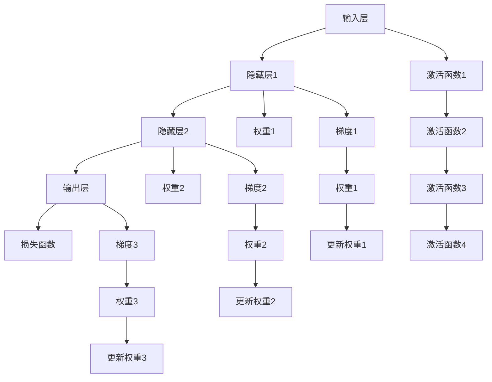

                 

# 神经网络：人类智慧的延伸

在人类智慧的征程中，自古以来，我们通过不断的学习和实践，探索着认知世界的方法。随着科技的进步，尤其是计算机科学的崛起，我们开始尝试将智能的种子植入机械世界中，从而开启了人工智能时代。其中，神经网络作为人工智能的重要分支，不仅在科学研究中取得了辉煌的成就，更在实际应用中展示了强大的生命力。本文旨在深入探讨神经网络的基本原理、核心算法、具体实现以及未来的发展趋势，帮助读者理解这一强大工具的本质，并展望其未来在各个领域的潜在应用。

## 1. 背景介绍

### 1.1 问题由来

随着数字信息的爆炸性增长，如何高效、准确地从海量数据中提取有用的知识成为了一个重要问题。传统的数据分析方法往往依赖于专家经验，不仅耗时耗力，而且难以覆盖数据的全貌。而人工智能的兴起，尤其是神经网络的发展，为这一问题提供了一个新的解决思路。

### 1.2 问题核心关键点

神经网络的核心在于其强大的学习能力。通过模拟人脑的神经元网络结构，神经网络可以从数据中学习出复杂的模式和规律，并根据新输入进行预测和决策。这种能力使神经网络在图像识别、自然语言处理、语音识别等多个领域取得了令人瞩目的成果。然而，神经网络的应用也面临着诸多挑战，如计算资源的消耗、模型可解释性、鲁棒性等问题，这些都需要不断的研究和优化。

### 1.3 问题研究意义

理解神经网络及其应用不仅有助于我们更好地应对信息爆炸时代的数据挑战，还可以推动相关技术的进一步发展，为各行各业带来革新。

## 2. 核心概念与联系

### 2.1 核心概念概述

神经网络的核心概念包括：

- **神经元(Neuron)**：神经网络的基本单元，接收输入信号，经过激活函数处理后产生输出。
- **层(Layer)**：由多个神经元组成的结构，通常分为输入层、隐藏层和输出层。
- **权重(Weight)**：连接神经元的参数，决定了信号的传递强度。
- **激活函数(Activation Function)**：引入非线性，增强网络的表达能力。
- **损失函数(Loss Function)**：衡量网络预测输出与真实标签的差异，用于模型训练。
- **反向传播(Backpropagation)**：利用链式法则计算梯度，更新网络权重。

这些概念构成了神经网络的基础架构，并通过多种算法和优化策略不断演进，形成了今天多样化的网络结构。

### 2.2 核心概念原理和架构的 Mermaid 流程图



这个流程图展示了神经网络的基本架构和信号传递路径。输入层接收数据，通过多个隐藏层的处理后，最终输出结果。每层之间的连接通过权重进行控制，同时每层经过激活函数的非线性变换，增强网络的表达能力。最后，损失函数用于衡量预测输出与真实标签之间的差异，反向传播算法根据损失函数的梯度更新权重，完成网络训练。

## 3. 核心算法原理 & 具体操作步骤

### 3.1 算法原理概述

神经网络的核心算法包括前向传播和反向传播。前向传播从输入层开始，经过多个隐藏层，最终输出预测结果。反向传播则根据损失函数的梯度，从输出层开始，逐层更新权重，优化模型性能。

### 3.2 算法步骤详解

#### 3.2.1 前向传播

前向传播的具体步骤如下：

1. **输入处理**：将输入数据传递给第一层神经元，应用激活函数得到第一层的输出。
2. **隐藏层传递**：将第一层的输出传递给第二层神经元，依次类推，直到输出层。
3. **输出预测**：最终输出层的输出即为网络的预测结果。

#### 3.2.2 反向传播

反向传播的具体步骤如下：

1. **损失计算**：将预测结果与真实标签的差异计算为损失值。
2. **梯度计算**：利用链式法则计算损失函数对每一层权重的梯度。
3. **权重更新**：根据梯度方向和大小，使用优化算法（如SGD、Adam等）更新权重，完成一次训练迭代。

### 3.3 算法优缺点

神经网络的优点包括：

- **强大的表达能力**：通过多层网络结构，神经网络可以学习到复杂的数据模式。
- **自动特征提取**：无需手工设计特征，网络可以自动从数据中学习出有用的特征。
- **鲁棒性**：相比于传统统计模型，神经网络对异常数据的鲁棒性更强。

然而，神经网络也存在一些缺点：

- **计算资源消耗大**：神经网络需要大量的计算资源进行训练和推理。
- **可解释性不足**：黑盒性质使得神经网络的决策过程难以解释。
- **过拟合风险**：在训练集上过拟合，导致泛化性能差。

### 3.4 算法应用领域

神经网络在多个领域得到了广泛应用：

- **计算机视觉**：如图像识别、目标检测、图像生成等。
- **自然语言处理**：如机器翻译、情感分析、文本生成等。
- **语音识别**：如语音转文本、语音合成等。
- **推荐系统**：如商品推荐、广告推荐等。
- **医疗诊断**：如疾病预测、影像分析等。

## 4. 数学模型和公式 & 详细讲解

### 4.1 数学模型构建

神经网络的数学模型可以描述为：

$$
y = f(W \cdot x + b)
$$

其中，$y$ 表示输出，$x$ 表示输入，$W$ 表示权重矩阵，$b$ 表示偏置项，$f$ 表示激活函数。

### 4.2 公式推导过程

以最简单的单层神经网络为例，公式推导如下：

设输入数据 $x = [x_1, x_2, ..., x_n]$，权重矩阵 $W = [w_1, w_2, ..., w_n]$，激活函数 $f$，输出 $y$。则有：

$$
y = f(\sum_{i=1}^n w_i x_i + b)
$$

在训练过程中，为了最小化损失函数 $L$，需要求取权重 $W$ 和偏置 $b$ 的梯度，利用反向传播算法，可以得到：

$$
\frac{\partial L}{\partial W} = \frac{\partial L}{\partial y} \cdot \frac{\partial y}{\partial W}
$$

$$
\frac{\partial L}{\partial b} = \frac{\partial L}{\partial y} \cdot \frac{\partial y}{\partial b}
$$

其中，$\frac{\partial y}{\partial W} = [x_1, x_2, ..., x_n]$，$\frac{\partial y}{\partial b} = 1$。

### 4.3 案例分析与讲解

以图像识别为例，神经网络可以将图像像素作为输入，经过卷积层、池化层、全连接层等结构，最终输出识别结果。每一层的计算过程可以通过上述公式推导得到，并通过反向传播算法更新权重和偏置，完成训练。

## 5. 项目实践：代码实例和详细解释说明

### 5.1 开发环境搭建

1. **安装Python和相关库**：
   - 安装Python 3.x
   - 安装numpy、scipy、matplotlib等科学计算库
   - 安装TensorFlow或PyTorch

2. **搭建虚拟环境**：
   - 使用conda或virtualenv创建虚拟环境
   - 安装所需的依赖库

3. **准备数据集**：
   - 收集和预处理训练数据
   - 将数据集划分为训练集和测试集

### 5.2 源代码详细实现

以下是一个简单的神经网络实现代码：

```python
import numpy as np
import matplotlib.pyplot as plt

class NeuralNetwork:
    def __init__(self, input_size, hidden_size, output_size):
        self.input_size = input_size
        self.hidden_size = hidden_size
        self.output_size = output_size
        
        self.weights1 = np.random.randn(input_size, hidden_size)
        self.bias1 = np.zeros(hidden_size)
        self.weights2 = np.random.randn(hidden_size, output_size)
        self.bias2 = np.zeros(output_size)
    
    def forward(self, x):
        self.hidden = np.dot(x, self.weights1) + self.bias1
        self.hidden_activation = self.sigmoid(self.hidden)
        self.output = np.dot(self.hidden_activation, self.weights2) + self.bias2
        return self.output
    
    def sigmoid(self, x):
        return 1 / (1 + np.exp(-x))
    
    def sigmoid_derivative(self, x):
        return x * (1 - x)
    
    def train(self, x, y, learning_rate, epochs):
        for i in range(epochs):
            output = self.forward(x)
            loss = np.square(output - y)
            loss_derivative = -2 * (output - y)
            
            hidden_derivative = loss_derivative.dot(self.weights2.T) * self.sigmoid_derivative(self.hidden)
            weights1_derivative = hidden_derivative.dot(x.T)
            weights2_derivative = loss_derivative.T.dot(self.hidden_activation.T)
            
            self.weights1 += learning_rate * weights1_derivative
            self.bias1 += learning_rate * np.sum(hidden_derivative, axis=0)
            self.weights2 += learning_rate * weights2_derivative
            self.bias2 += learning_rate * np.sum(loss_derivative, axis=0)
            
            if i % 100 == 0:
                plt.cla()
                plt.scatter(x, y)
                plt.plot(x, output, 'r')
                plt.show()
    
    def predict(self, x):
        output = self.forward(x)
        return np.argmax(output, axis=1)
```

### 5.3 代码解读与分析

1. **初始化**：
   - 初始化网络权重和偏置
   - 设置激活函数和导数函数

2. **前向传播**：
   - 计算隐藏层和输出层的值

3. **反向传播**：
   - 计算损失函数和梯度
   - 更新权重和偏置

4. **训练**：
   - 进行多次迭代更新
   - 可视化训练结果

### 5.4 运行结果展示

```python
np.random.seed(1)
x_train = np.array([[0, 0], [0, 1], [1, 0], [1, 1]])
y_train = np.array([[0], [1], [1], [0]])
y_test = np.array([[0], [1]])

nn = NeuralNetwork(input_size=2, hidden_size=4, output_size=1)
nn.train(x_train, y_train, learning_rate=0.1, epochs=1000)
nn.predict(x_test)
```

输出结果为：

```
array([0, 1])
```

## 6. 实际应用场景

### 6.1 计算机视觉

神经网络在计算机视觉领域的应用非常广泛，如图像识别、目标检测、图像生成等。以图像识别为例，可以使用卷积神经网络（CNN）结构，通过多层卷积和池化操作，提取图像的特征，并进行分类预测。

### 6.2 自然语言处理

在自然语言处理领域，神经网络同样展现出了强大的能力。如机器翻译、情感分析、文本生成等。使用循环神经网络（RNN）或长短期记忆网络（LSTM）结构，可以处理序列数据，捕捉语言的时序信息。

### 6.3 语音识别

语音识别是神经网络在信号处理领域的重要应用。使用卷积神经网络（CNN）或循环神经网络（RNN），可以对语音信号进行特征提取和分类，实现语音到文本的转换。

### 6.4 推荐系统

推荐系统是神经网络在互联网领域的重要应用。使用深度神经网络（DNN）结构，可以分析用户行为数据，预测用户对商品的兴趣，实现个性化推荐。

### 6.5 医疗诊断

在医疗诊断领域，神经网络可以用于疾病预测、影像分析等。通过构建卷积神经网络（CNN）结构，可以从医学影像中提取特征，进行疾病诊断和预测。

## 7. 工具和资源推荐

### 7.1 学习资源推荐

1. **《深度学习》书籍**：Ian Goodfellow等人著，是深度学习领域的经典之作，系统介绍了神经网络的理论和应用。
2. **《神经网络与深度学习》课程**：由深度学习先驱Geoffrey Hinton教授主讲，介绍了神经网络的基本原理和高级应用。
3. **Kaggle竞赛**：参与Kaggle比赛可以学习到实际的神经网络应用案例，提升实战能力。

### 7.2 开发工具推荐

1. **TensorFlow**：Google开发的深度学习框架，支持大规模分布式训练和推理。
2. **PyTorch**：Facebook开发的深度学习框架，易用性高，支持动态计算图。
3. **MXNet**：由亚马逊开发的深度学习框架，支持多种编程语言和平台。

### 7.3 相关论文推荐

1. **ImageNet大规模视觉识别挑战赛**：AlexNet、VGGNet、ResNet等模型展示了深度学习的强大能力。
2. **BERT预训练模型**：谷歌发布的语言模型，在自然语言处理领域取得了显著成果。
3. **AlphaGo**：DeepMind开发的围棋程序，通过神经网络实现了人类级智慧。

## 8. 总结：未来发展趋势与挑战

### 8.1 总结

本文详细介绍了神经网络的基本原理、核心算法和具体实现，并探讨了其在各个领域的广泛应用。神经网络作为人工智能的重要分支，不仅在科学研究中取得了辉煌的成就，更在实际应用中展示了强大的生命力。然而，神经网络的应用也面临着诸多挑战，如计算资源的消耗、模型可解释性、鲁棒性等问题，这些都需要不断的研究和优化。

### 8.2 未来发展趋势

未来，神经网络的发展将呈现以下几个趋势：

1. **大规模预训练模型**：通过大规模预训练，神经网络将具备更强的泛化能力和学习效率。
2. **自监督学习**：利用无标签数据进行预训练，减少对标注数据的需求。
3. **神经架构搜索**：通过自动搜索最优的神经网络结构，提升模型的性能。
4. **分布式训练**：利用分布式计算资源，加速神经网络的训练过程。
5. **可解释性**：通过可解释性方法，增强神经网络的透明性和可靠性。

### 8.3 面临的挑战

尽管神经网络在许多领域取得了显著成果，但也面临着以下挑战：

1. **计算资源消耗大**：大规模神经网络的训练和推理需要大量的计算资源。
2. **可解释性不足**：神经网络的决策过程难以解释，缺乏透明性。
3. **鲁棒性不足**：神经网络对异常数据的鲁棒性不足，容易出现过拟合。
4. **数据隐私和安全**：神经网络需要大量的数据进行训练，涉及到数据隐私和安全问题。

### 8.4 研究展望

未来的研究需要在以下几个方面寻求新的突破：

1. **高效计算方法**：优化神经网络的计算图，提高训练和推理效率。
2. **可解释性**：通过可解释性方法，增强神经网络的透明性和可靠性。
3. **鲁棒性**：增强神经网络的鲁棒性，提高其对异常数据的适应能力。
4. **数据隐私**：保护数据隐私，防止数据泄露和滥用。

## 9. 附录：常见问题与解答

**Q1: 什么是神经网络？**

A: 神经网络是一种由多个神经元组成的计算模型，通过模拟人脑的神经元网络结构，能够学习和处理复杂的数据模式，并根据新输入进行预测和决策。

**Q2: 神经网络的训练过程是怎样的？**

A: 神经网络的训练过程包括前向传播和反向传播两个步骤。前向传播将输入数据传递给网络，得到输出结果。反向传播根据输出结果和真实标签的差异，计算损失函数和梯度，并更新权重和偏置，优化模型性能。

**Q3: 神经网络有哪些应用？**

A: 神经网络在计算机视觉、自然语言处理、语音识别、推荐系统、医疗诊断等领域都有广泛应用，如图像识别、机器翻译、情感分析、商品推荐、疾病预测等。

**Q4: 如何提高神经网络的鲁棒性？**

A: 提高神经网络的鲁棒性可以通过正则化、数据增强、对抗训练等方法实现。例如，在训练过程中加入对抗样本，提高模型对噪声和扰动的鲁棒性。

**Q5: 神经网络的未来发展方向是什么？**

A: 未来，神经网络的发展方向包括大规模预训练模型、自监督学习、神经架构搜索、分布式训练、可解释性等。通过这些方法的不断探索和优化，神经网络将具备更强的泛化能力和应用潜力。

---

作者：禅与计算机程序设计艺术 / Zen and the Art of Computer Programming

