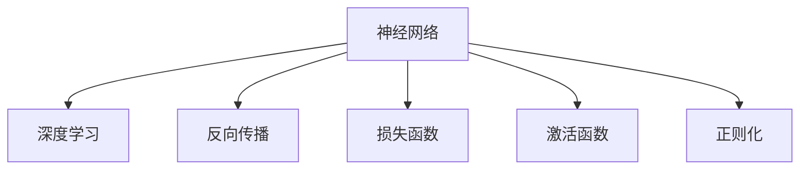

                 

# 神经网络：开启智能新纪元

> 关键词：神经网络,深度学习,机器学习,智能算法,图像识别,自然语言处理

## 1. 背景介绍

### 1.1 问题由来
神经网络是当今最前沿的人工智能技术之一，以其强大的学习能力和泛化能力，被广泛应用于图像识别、自然语言处理、语音识别等众多领域。自1980年代以来，神经网络经过几十年的发展，从简单的感知机网络逐渐演变成复杂的深度神经网络，在深度学习技术的推动下，神经网络已经从科学研究走入工程实践，成为人工智能时代的重要支柱。

### 1.2 问题核心关键点
神经网络的核心思想是通过多层非线性变换，从原始数据中提取特征，然后利用特征进行分类、回归等任务。其关键点包括：
- 层次结构：神经网络通过多层线性变换和非线性激活函数，能够学习复杂的多层次特征表示。
- 反向传播算法：用于计算损失函数的梯度，使得网络可以自适应地调整权重，优化模型性能。
- 损失函数：用于衡量模型预测结果与真实标签之间的差异，常用的包括交叉熵、均方误差等。
- 正则化技术：如L2正则、Dropout、Early Stopping等，用于防止过拟合。
- 激活函数：如ReLU、Sigmoid、Tanh等，用于引入非线性变换。

这些核心点构成了神经网络的理论基础和实践指南，使得神经网络能够在多个领域取得令人瞩目的效果。

### 1.3 问题研究意义
神经网络在图像识别、自然语言处理、语音识别等领域的应用，正在全面改变人类的生产生活方式。神经网络技术的应用场景包括：
- 自动驾驶：通过视觉、雷达等传感器，学习道路、车辆、行人等交通要素的特征，辅助驾驶决策。
- 医疗诊断：通过医学影像、基因数据等，学习疾病特征，辅助医生诊断和治疗。
- 智能客服：通过自然语言处理技术，学习用户意图和情感，提供个性化客服服务。
- 推荐系统：通过用户行为数据，学习用户兴趣和偏好，提供个性化推荐。

神经网络技术的成功应用，为各行各业带来了新的机遇和挑战。如何优化神经网络结构，提升其性能，减少计算和存储成本，仍然是当前研究的热点问题。

## 2. 核心概念与联系

### 2.1 核心概念概述

为更好地理解神经网络的工作原理，本节将介绍几个密切相关的核心概念：

- 神经网络(Neural Network)：一种由节点(神经元)和边(连接)组成的网络，通过多层非线性变换学习数据特征。
- 深度学习(Deep Learning)：一种基于多层神经网络的机器学习技术，通过训练网络从数据中提取复杂的特征表示。
- 反向传播(Backpropagation)：用于计算网络参数梯度的算法，通过链式法则反向传播误差信号，调整网络权重。
- 损失函数(Loss Function)：用于衡量模型预测结果与真实标签之间的差异，常用的有交叉熵、均方误差等。
- 激活函数(Activation Function)：如ReLU、Sigmoid、Tanh等，用于引入非线性变换，增强网络学习能力。
- 正则化(Regularization)：如L2正则、Dropout、Early Stopping等，用于防止过拟合，提升模型泛化能力。

这些核心概念之间的逻辑关系可以通过以下Mermaid流程图来展示：



这个流程图展示了大语言模型的核心概念及其之间的关系：

1. 神经网络通过多层非线性变换，学习数据的特征表示。
2. 深度学习利用多层神经网络，从数据中提取复杂的特征表示。
3. 反向传播算法用于计算网络参数梯度，通过误差反向传播调整权重。
4. 损失函数用于衡量预测结果与真实标签之间的差异，指导模型优化。
5. 激活函数用于引入非线性变换，增强网络学习能力。
6. 正则化技术用于防止过拟合，提升模型泛化能力。

这些概念共同构成了神经网络的学习和应用框架，使其能够在各种场景下发挥强大的特征学习和决策能力。通过理解这些核心概念，我们可以更好地把握神经网络的工作原理和优化方向。

## 3. 核心算法原理 & 具体操作步骤
### 3.1 算法原理概述

神经网络的核心思想是通过多层非线性变换，从原始数据中提取特征，然后利用特征进行分类、回归等任务。其关键点包括：

- 层次结构：神经网络通过多层线性变换和非线性激活函数，能够学习复杂的多层次特征表示。
- 反向传播算法：用于计算损失函数的梯度，使得网络可以自适应地调整权重，优化模型性能。
- 损失函数：用于衡量模型预测结果与真实标签之间的差异，常用的包括交叉熵、均方误差等。
- 正则化技术：如L2正则、Dropout、Early Stopping等，用于防止过拟合。
- 激活函数：如ReLU、Sigmoid、Tanh等，用于引入非线性变换。

基于神经网络的机器学习算法流程如下：

1. 数据准备：收集数据集，进行数据预处理和特征提取。
2. 网络设计：选择合适的网络结构，如卷积神经网络(CNN)、循环神经网络(RNN)、深度神经网络(DNN)等。
3. 参数初始化：为网络中的所有权重和偏置进行随机初始化。
4. 前向传播：将输入数据输入网络，通过多层非线性变换计算输出。
5. 损失计算：计算模型输出与真实标签之间的损失函数值。
6. 反向传播：通过链式法则计算损失函数对参数的梯度。
7. 权重更新：使用梯度下降等优化算法，根据梯度更新网络参数。
8. 参数裁剪：对网络参数进行裁剪，保持模型复杂度在合理范围内。
9. 模型评估：在验证集或测试集上评估模型性能，选择最优模型。

### 3.2 算法步骤详解

基于神经网络的机器学习算法流程如下：

**Step 1: 数据准备**
- 收集数据集，并进行预处理，如归一化、标准化、数据增强等。
- 进行特征提取，如卷积、池化、嵌入等，将原始数据转化为特征表示。

**Step 2: 网络设计**
- 选择合适的网络结构，如卷积神经网络(CNN)、循环神经网络(RNN)、深度神经网络(DNN)等。
- 设计网络层次结构，确定隐藏层的数量、激活函数、正则化技术等超参数。

**Step 3: 参数初始化**
- 为网络中的所有权重和偏置进行随机初始化，常用的方法有Xavier初始化、He初始化等。
- 设置学习率、批量大小等训练参数，定义优化算法。

**Step 4: 前向传播**
- 将输入数据输入网络，通过多层非线性变换计算输出。
- 在网络中进行前向传播，将输入数据逐层传递，计算每个神经元的输出。

**Step 5: 损失计算**
- 计算模型输出与真实标签之间的损失函数值，常用的损失函数包括交叉熵、均方误差等。
- 将损失函数值传播到每个神经元，计算每个参数的梯度。

**Step 6: 反向传播**
- 通过链式法则计算损失函数对参数的梯度，更新网络参数。
- 使用梯度下降等优化算法，根据梯度更新网络参数，最小化损失函数。

**Step 7: 权重更新**
- 对网络参数进行裁剪，保持模型复杂度在合理范围内，避免过拟合。
- 对模型进行评估，选择最优模型，用于后续的预测或决策。

### 3.3 算法优缺点

神经网络的优点包括：
- 强大的非线性建模能力：通过多层非线性变换，能够学习复杂的特征表示。
- 自动特征学习：通过学习网络参数，自动提取数据中的特征。
- 泛化能力强：在训练集上进行训练后，能够在新数据上取得不错的性能。

神经网络的缺点包括：
- 训练复杂度高：网络结构复杂，参数多，训练时间长。
- 容易过拟合：由于模型复杂度较高，容易出现过拟合现象。
- 数据需求量大：训练神经网络需要大量的标注数据，标注成本较高。

尽管存在这些缺点，但神经网络仍然是目前最成功的机器学习技术之一。其强大的学习能力和泛化能力，使其在图像识别、自然语言处理、语音识别等领域取得了令人瞩目的成就。

### 3.4 算法应用领域

神经网络在多个领域得到了广泛的应用，包括：

- 计算机视觉：用于图像分类、物体检测、人脸识别等任务。
- 自然语言处理：用于机器翻译、文本分类、情感分析等任务。
- 语音识别：用于语音转文本、情感识别、语音合成等任务。
- 推荐系统：用于用户行为分析、商品推荐等任务。
- 金融风控：用于信用评估、风险预测等任务。
- 医疗诊断：用于医学影像分析、疾病预测等任务。

此外，神经网络还被广泛应用于机器人、自动驾驶、智能家居等领域，推动了智能技术的发展和普及。

## 4. 数学模型和公式 & 详细讲解 & 举例说明

### 4.1 数学模型构建

神经网络的数学模型主要包括以下几个组成部分：
- 输入层：将原始数据转换为特征表示。
- 隐藏层：通过非线性变换提取特征。
- 输出层：根据任务类型，输出预测结果或分类标签。

以一个简单的深度神经网络为例，其数学模型可以表示为：

$$
f(x; \theta) = W^L \cdot a^L \cdot W^{L-1} \cdot a^{L-1} \cdot \ldots \cdot W^1 \cdot a^1
$$

其中，$x$ 表示输入数据，$\theta$ 表示网络参数，$W^l$ 表示第 $l$ 层的权重矩阵，$a^l$ 表示第 $l$ 层的激活函数输出。

### 4.2 公式推导过程

神经网络的损失函数通常采用交叉熵损失函数，其公式如下：

$$
\mathcal{L}(y, \hat{y}) = -\frac{1}{N}\sum_{i=1}^N y_i \log \hat{y}_i + (1-y_i) \log (1-\hat{y}_i)
$$

其中，$y$ 表示真实标签，$\hat{y}$ 表示模型预测结果。

神经网络的反向传播算法通过链式法则计算损失函数对参数的梯度，其公式如下：

$$
\frac{\partial \mathcal{L}}{\partial \theta} = \frac{\partial \mathcal{L}}{\partial z^{L-1}} \cdot \frac{\partial z^{L-1}}{\partial \theta} + \ldots + \frac{\partial \mathcal{L}}{\partial z^1} \cdot \frac{\partial z^1}{\partial \theta}
$$

其中，$z^l$ 表示第 $l$ 层的输出。

### 4.3 案例分析与讲解

以一个简单的二分类任务为例，假设输入数据为 $x$，网络输出为 $\hat{y}$，真实标签为 $y$。

首先，将输入数据 $x$ 输入网络，通过多层非线性变换得到输出结果 $\hat{y}$：

$$
z^L = W^L \cdot a^L(z^{L-1}) + b^L
$$

$$
z^{L-1} = W^{L-1} \cdot a^{L-1}(z^{L-2}) + b^{L-1}
$$

$$
\ldots
$$

$$
z^1 = W^1 \cdot a^1(x) + b^1
$$

其中，$W^l$ 表示第 $l$ 层的权重矩阵，$a^l$ 表示第 $l$ 层的激活函数，$b^l$ 表示第 $l$ 层的偏置。

然后，计算交叉熵损失函数 $\mathcal{L}$：

$$
\mathcal{L}(y, \hat{y}) = -\frac{1}{N}\sum_{i=1}^N y_i \log \hat{y}_i + (1-y_i) \log (1-\hat{y}_i)
$$

接着，通过链式法则计算损失函数对每个参数的梯度：

$$
\frac{\partial \mathcal{L}}{\partial z^{L-1}} = \frac{\partial \mathcal{L}}{\partial \hat{y}} \cdot \frac{\partial \hat{y}}{\partial z^{L-1}}
$$

$$
\frac{\partial \mathcal{L}}{\partial z^L} = \frac{\partial \mathcal{L}}{\partial \hat{y}} \cdot \frac{\partial \hat{y}}{\partial z^L}
$$

$$
\frac{\partial \mathcal{L}}{\partial z^{L-2}} = \frac{\partial \mathcal{L}}{\partial z^{L-1}} \cdot \frac{\partial z^{L-1}}{\partial z^{L-2}}
$$

$$
\frac{\partial \mathcal{L}}{\partial z^1} = \frac{\partial \mathcal{L}}{\partial z^2} \cdot \frac{\partial z^2}{\partial z^1}
$$

最后，根据梯度更新网络参数，最小化损失函数。

## 5. 项目实践：代码实例和详细解释说明

### 5.1 开发环境搭建

在进行神经网络项目开发前，我们需要准备好开发环境。以下是使用Python进行TensorFlow开发的Python环境配置流程：

1. 安装Anaconda：从官网下载并安装Anaconda，用于创建独立的Python环境。

2. 创建并激活虚拟环境：
```bash
conda create -n tf-env python=3.8 
conda activate tf-env
```

3. 安装TensorFlow：根据CUDA版本，从官网获取对应的安装命令。例如：
```bash
pip install tensorflow
```

4. 安装各类工具包：
```bash
pip install numpy pandas scikit-learn matplotlib tqdm jupyter notebook ipython
```

完成上述步骤后，即可在`tf-env`环境中开始神经网络实践。

### 5.2 源代码详细实现

下面我们以图像分类任务为例，给出使用TensorFlow对神经网络进行训练的PyTorch代码实现。

首先，定义神经网络模型：

```python
import tensorflow as tf
from tensorflow.keras.layers import Dense, Flatten, Conv2D, MaxPooling2D
from tensorflow.keras.models import Sequential

model = Sequential([
    Conv2D(32, (3, 3), activation='relu', input_shape=(28, 28, 1)),
    MaxPooling2D((2, 2)),
    Conv2D(64, (3, 3), activation='relu'),
    MaxPooling2D((2, 2)),
    Flatten(),
    Dense(64, activation='relu'),
    Dense(10, activation='softmax')
])
```

然后，定义损失函数和优化器：

```python
model.compile(optimizer='adam', loss='categorical_crossentropy', metrics=['accuracy'])
```

接着，加载和预处理数据集：

```python
from tensorflow.keras.datasets import mnist
from tensorflow.keras.utils import to_categorical

(x_train, y_train), (x_test, y_test) = mnist.load_data()
x_train = x_train.reshape(-1, 28, 28, 1) / 255.0
x_test = x_test.reshape(-1, 28, 28, 1) / 255.0
y_train = to_categorical(y_train, num_classes=10)
y_test = to_categorical(y_test, num_classes=10)
```

最后，启动模型训练和评估：

```python
model.fit(x_train, y_train, epochs=10, batch_size=64, validation_data=(x_test, y_test))
model.evaluate(x_test, y_test)
```

以上就是使用TensorFlow对神经网络进行图像分类任务训练的完整代码实现。可以看到，TensorFlow的高级API使得神经网络的开发变得简单高效，开发者可以将更多精力放在网络设计、数据处理等核心任务上。

### 5.3 代码解读与分析

让我们再详细解读一下关键代码的实现细节：

**神经网络模型定义**：
- 首先定义了神经网络的结构，包括卷积层、池化层、全连接层等。
- 通过`Sequential`模型类，将这些层按顺序组合起来。
- 定义了激活函数和损失函数，指定了优化器。

**数据集加载和预处理**：
- 使用`mnist.load_data()`加载MNIST数据集。
- 将图像数据转换为4D张量，并进行归一化处理。
- 将标签转换为one-hot编码形式。

**模型训练和评估**：
- 使用`model.fit()`方法进行模型训练，指定训练集、验证集、训练轮数、批量大小等参数。
- 使用`model.evaluate()`方法进行模型评估，输出测试集上的准确率等指标。

可以看到，TensorFlow的高级API使得神经网络的开发变得简单高效。开发者可以将更多精力放在网络设计、数据处理等核心任务上，而不必过多关注底层的实现细节。

当然，工业级的系统实现还需考虑更多因素，如模型的保存和部署、超参数的自动搜索、模型的可解释性等。但核心的神经网络微调范式基本与此类似。

## 6. 实际应用场景

### 6.1 智能推荐系统

神经网络在推荐系统中的应用非常广泛，通过分析用户行为数据，学习用户兴趣和偏好，推荐符合用户期望的商品或内容。推荐系统可以应用于电商、视频、社交媒体等领域，提高用户的满意度和留存率。

在实践中，可以使用神经网络进行协同过滤、基于内容的推荐、混合推荐等多种方式的推荐。协同过滤方式通过分析用户和物品之间的关联，推荐与用户已喜欢物品类似的新物品；基于内容的方式通过分析物品的属性，推荐与用户喜欢的物品类似的新物品；混合推荐方式通过综合考虑多种推荐方式，提供更加精准的推荐结果。

### 6.2 医疗影像分析

神经网络在医疗影像分析中的应用也非常重要。通过分析医学影像数据，学习疾病的特征表示，辅助医生进行诊断和治疗。医疗影像分析可以应用于癌症检测、X光片分析、眼底图像分析等任务。

在实践中，可以使用神经网络进行图像分类、目标检测、图像分割等多种方式的分析。图像分类方式通过将医学影像分为正常和异常两类，帮助医生进行初步诊断；目标检测方式通过识别影像中的关键部位，辅助医生进行手术定位；图像分割方式通过将影像分割成不同的区域，辅助医生进行病理分析。

### 6.3 金融风控

神经网络在金融风控中的应用也逐渐增多。通过分析用户的历史交易数据，学习用户的信用特征，进行信用评估和风险预测。金融风控可以应用于贷款审批、信用评分、风险预警等任务。

在实践中，可以使用神经网络进行分类、回归等多种方式的预测。分类方式通过将用户分为高风险和低风险两类，帮助金融机构进行贷款审批；回归方式通过预测用户的信用评分，帮助金融机构进行风险评估；风险预警方式通过分析交易数据，预测潜在的风险事件。

### 6.4 未来应用展望

随着神经网络技术的发展，其在未来将有更广阔的应用前景。以下是几个未来应用的展望：

- 自动驾驶：通过神经网络对传感器数据进行实时处理，辅助驾驶决策，实现自动驾驶。
- 机器人：通过神经网络对环境进行感知和决策，实现智能机器人。
- 自然语言处理：通过神经网络进行机器翻译、文本生成、语音识别等任务。
- 金融风控：通过神经网络进行信用评估、风险预测、异常检测等任务。
- 医疗影像分析：通过神经网络进行疾病诊断、影像分割、辅助手术等任务。
- 智能家居：通过神经网络对家庭环境进行感知和决策，实现智能家居系统。

总之，神经网络技术将在未来各个领域发挥更大的作用，推动人工智能技术的发展和普及。

## 7. 工具和资源推荐
### 7.1 学习资源推荐

为了帮助开发者系统掌握神经网络的理论基础和实践技巧，这里推荐一些优质的学习资源：

1. 《深度学习》课程：斯坦福大学开设的深度学习课程，系统讲解了深度学习的基本概念和算法。

2. 《Deep Learning with Python》书籍：使用Python实现深度学习模型的教程，适合初学者入门。

3. 《神经网络与深度学习》书籍：使用数学和物理方法解释神经网络原理的书籍，适合有一定数学基础的读者。

4. 《Hands-On Machine Learning with Scikit-Learn and TensorFlow》书籍：使用Scikit-Learn和TensorFlow实现机器学习模型的教程，适合实战练习。

5. Coursera《深度学习专项课程》：由深度学习领域专家讲授的课程，涵盖深度学习的基本概念和算法。

通过对这些资源的学习实践，相信你一定能够快速掌握神经网络的核心原理和实际应用技巧。

### 7.2 开发工具推荐

高效的开发离不开优秀的工具支持。以下是几款用于神经网络开发的常用工具：

1. PyTorch：基于Python的开源深度学习框架，灵活的动态计算图，适合快速迭代研究。大部分神经网络模型都有PyTorch版本的实现。

2. TensorFlow：由Google主导开发的开源深度学习框架，生产部署方便，适合大规模工程应用。同样有丰富的神经网络资源。

3. Keras：高层次的深度学习API，简洁易用，适合快速原型设计和模型训练。

4. MXNet：由亚马逊开发的深度学习框架，支持分布式计算和多种编程语言，适合工业应用。

5. Caffe：由Berkeley大学开发的深度学习框架，适合图像处理和计算机视觉任务。

合理利用这些工具，可以显著提升神经网络模型的开发效率，加快创新迭代的步伐。

### 7.3 相关论文推荐

神经网络技术的发展源于学界的持续研究。以下是几篇奠基性的相关论文，推荐阅读：

1. Deep Blue：使用神经网络进行国际象棋对弈，展示了神经网络的强大能力。

2. AlexNet：使用神经网络进行图像分类，开创了深度学习在计算机视觉领域的应用。

3. RNNs for Sequence Modeling：使用循环神经网络进行序列建模，展示了神经网络在自然语言处理领域的应用。

4. ImageNet Classification with Deep Convolutional Neural Networks：使用卷积神经网络进行图像分类，展示了神经网络在图像处理领域的高效性。

5. Understanding the difficulty of training deep feedforward neural networks：分析了深度神经网络训练的困难性，提出了Dropout等正则化技术。

这些论文代表了大神经网络技术的进展，帮助研究者把握学科前进方向，激发更多的创新灵感。

## 8. 总结：未来发展趋势与挑战

### 8.1 总结

本文对神经网络的工作原理和实际应用进行了全面系统的介绍。首先阐述了神经网络的基本概念和算法流程，明确了神经网络在图像识别、自然语言处理、语音识别等领域的强大应用潜力。其次，从原理到实践，详细讲解了神经网络的数学模型和优化算法，给出了神经网络训练的完整代码实现。同时，本文还广泛探讨了神经网络在推荐系统、医疗影像分析、金融风控等众多领域的应用前景，展示了神经网络技术的广泛影响。此外，本文精选了神经网络技术的各类学习资源，力求为读者提供全方位的技术指引。

通过本文的系统梳理，可以看到，神经网络技术正在全面改变人类的生产生活方式，其强大的学习和泛化能力使其在各个领域发挥了重要的作用。未来，随着深度学习技术的不断发展，神经网络将在更多领域得到应用，为人工智能技术的发展和普及带来新的机遇和挑战。

### 8.2 未来发展趋势

展望未来，神经网络技术将呈现以下几个发展趋势：

1. 模型规模持续增大。随着算力成本的下降和数据规模的扩张，神经网络模型的参数量还将持续增长。超大规模神经网络蕴含的丰富特征表示，有望支撑更加复杂多变的下游任务。

2. 模型复杂度提升。未来的神经网络模型将更加复杂，通过增加层数、神经元数等方式，增强模型的表达能力。同时，将引入更多先进的网络结构和激活函数，提升模型的性能。

3. 自动化设计。随着神经网络设计工具的发展，未来的神经网络将更加自动化，通过算法优化和自动搜索，快速设计出高性能的神经网络模型。

4. 多模态融合。未来的神经网络将更多地融合多种模态数据，如图像、语音、文本等，构建多模态的智能系统。

5. 元学习技术。未来的神经网络将引入元学习技术，能够快速适应新任务，提升模型的泛化能力。

6. 联邦学习。未来的神经网络将更多地采用联邦学习方式，分布式协同训练，保护用户隐私。

以上趋势凸显了神经网络技术的广阔前景。这些方向的探索发展，必将进一步提升神经网络模型的性能和应用范围，为构建智能系统提供新的技术路径。

### 8.3 面临的挑战

尽管神经网络技术已经取得了巨大的成功，但在迈向更加智能化、普适化应用的过程中，仍面临诸多挑战：

1. 训练成本高昂。目前大规模神经网络模型的训练需要大量的计算资源和存储资源，高昂的训练成本限制了其广泛应用。

2. 过拟合风险大。神经网络模型的复杂度高，容易出现过拟合现象，尤其是数据量较小的情况下。

3. 可解释性不足。当前神经网络模型通常被视为“黑盒”系统，难以解释其内部工作机制和决策逻辑，不利于实际应用中的调试和优化。

4. 数据需求量大。训练神经网络模型需要大量的标注数据，获取高质量标注数据的成本较高。

5. 计算效率低。神经网络模型的大规模计算和存储需求，使得其在实际应用中的计算效率较低。

6. 伦理和安全问题。神经网络模型可能会学习到有害信息，甚至产生误导性输出，给实际应用带来安全隐患。

正视神经网络面临的这些挑战，积极应对并寻求突破，将使神经网络技术在迈向成熟的道路上不断前进。

### 8.4 研究展望

面对神经网络面临的这些挑战，未来的研究需要在以下几个方面寻求新的突破：

1. 无监督和半监督学习。摆脱对大规模标注数据的依赖，利用自监督学习、主动学习等无监督和半监督范式，最大限度利用非结构化数据，实现更加灵活高效的神经网络模型。

2. 低秩适应的参数高效神经网络。开发更加参数高效的神经网络模型，在固定大部分网络参数的情况下，只更新极少量的任务相关参数，减小训练成本。

3. 模型压缩与加速。通过模型裁剪、量化加速等技术，减小神经网络模型的计算和存储需求，提升模型的推理速度和计算效率。

4. 可解释性和透明性。引入可解释性技术和透明性技术，增强神经网络模型的可解释性和可审计性，保障其在实际应用中的安全性。

5. 伦理与道德约束。在模型训练目标中引入伦理导向的评估指标，过滤和惩罚有害的输出倾向，确保神经网络模型的伦理与安全。

6. 跨模态融合。将神经网络与知识图谱、逻辑规则等专家知识结合，构建多模态的智能系统，提升模型的泛化能力和决策能力。

这些研究方向的探索，必将引领神经网络技术迈向更高的台阶，为构建安全、可靠、可解释、可控的智能系统铺平道路。面向未来，神经网络技术还需要与其他人工智能技术进行更深入的融合，如因果推理、强化学习等，多路径协同发力，共同推动神经网络技术的进步。

## 9. 附录：常见问题与解答

**Q1：神经网络在训练过程中容易出现过拟合，如何解决？**

A: 过拟合是神经网络训练中常见的问题，解决方法包括：

1. 数据增强：通过对训练数据进行增强，如旋转、缩放、翻转等，增加训练数据的多样性，避免模型过拟合。

2. 正则化技术：使用L2正则、Dropout等技术，限制模型参数的复杂度，防止过拟合。

3. 早停策略：在验证集上监控模型性能，一旦模型性能不再提升，停止训练，避免过拟合。

4. 权重裁剪：通过裁剪网络参数，控制模型的复杂度，避免过拟合。

5. 模型集成：通过集成多个模型的预测结果，减小单个模型的过拟合风险。

这些方法可以单独或组合使用，根据具体任务和数据特点进行灵活选择。

**Q2：神经网络在实际应用中如何保证可解释性？**

A: 神经网络的可解释性问题一直是一个热门话题，解决方法包括：

1. 可解释性模型：使用可解释性模型，如线性模型、决策树等，代替复杂的神经网络模型，提高模型的可解释性。

2. 可解释性技术：使用可解释性技术，如Shapley值、LIME等，分析神经网络模型的内部工作机制，解释模型的预测结果。

3. 可解释性评估：使用可解释性评估指标，如困惑度、可解释性得分等，衡量模型的可解释性。

4. 可解释性开源工具：使用可解释性开源工具，如OpenAI的LIME、IBM的KDD等，进行模型解释和可视化。

这些方法可以帮助研究者更好地理解神经网络模型的决策逻辑，保障模型在实际应用中的可解释性和可审计性。

**Q3：神经网络在实际应用中如何保证安全性？**

A: 神经网络的安全性问题需要从数据和算法两个层面进行考虑，解决方法包括：

1. 数据安全：使用数据加密、数据匿名等技术，保护用户隐私。

2. 模型安全：使用对抗样本训练技术，提高模型对对抗攻击的鲁棒性。

3. 算法透明：使用可解释性技术和透明性技术，提高模型的可审计性，防止模型被滥用。

4. 安全评估：使用安全评估工具和技术，检测模型中的漏洞和安全隐患，保障模型的安全性。

5. 安全标准：制定和遵循安全标准，如ISO 27001等，保障模型的安全性和合规性。

这些方法可以组合使用，根据具体应用场景进行灵活选择，保障神经网络模型在实际应用中的安全性。

**Q4：神经网络在实际应用中如何保证鲁棒性？**

A: 神经网络的鲁棒性问题需要从模型设计和训练两个层面进行考虑，解决方法包括：

1. 鲁棒性设计：使用鲁棒性设计技术，如鲁棒性优化、鲁棒性正则化等，提高模型的鲁棒性。

2. 鲁棒性训练：使用对抗训练、自适应训练等技术，提高模型对输入扰动的鲁棒性。

3. 鲁棒性评估：使用鲁棒性评估工具和技术，检测模型对输入扰动的鲁棒性。

4. 鲁棒性开源工具：使用鲁棒性开源工具，如OpenAI的AdvAT等，进行模型鲁棒性测试和分析。

这些方法可以组合使用，根据具体应用场景进行灵活选择，提高神经网络模型的鲁棒性。

**Q5：神经网络在实际应用中如何保证计算效率？**

A: 神经网络的计算效率问题需要从模型设计和优化两个层面进行考虑，解决方法包括：

1. 模型优化：使用模型优化技术，如模型裁剪、量化加速等，减小模型的计算和存储需求，提升计算效率。

2. 优化算法：使用优化算法，如Adam、SGD等，提高模型的训练和推理效率。

3. 硬件加速：使用硬件加速技术，如GPU、TPU等，加速模型的计算和推理。

4. 分布式计算：使用分布式计算技术，将大规模计算任务分配到多个计算节点上，提升计算效率。

这些方法可以组合使用，根据具体应用场景进行灵活选择，提高神经网络模型的计算效率。

---

作者：禅与计算机程序设计艺术 / Zen and the Art of Computer Programming

