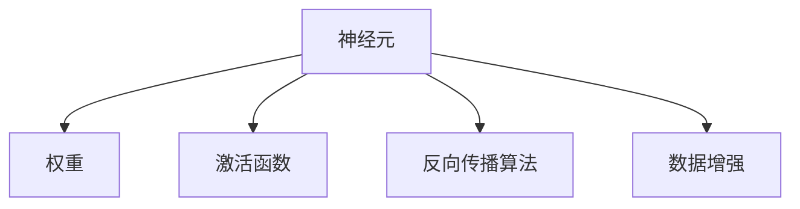

                 

## 1. 背景介绍

### 1.1 问题由来
随着人工智能技术的不断进步，机器学习已成为众多领域的重要工具。然而，传统机器学习算法如线性回归、决策树、支持向量机等在处理大规模复杂数据时，往往显得力不从心。神经网络作为一种新型的机器学习范式，通过模拟人脑神经元的工作原理，成功解决了这一难题，在计算机视觉、自然语言处理、语音识别等多个领域取得了显著成果。

### 1.2 问题核心关键点
神经网络之所以能够成为机器学习的新范式，关键在于其独特的结构和工作原理：

- **结构复杂性**：神经网络由多个层次的神经元（或称为节点）构成，每一层均与下一层相连，形成了一个复杂的非线性映射网络。
- **权重共享**：每层神经元共享同一组权重，减少了模型的参数数量，避免了过拟合。
- **反向传播算法**：通过反向传播算法，利用链式法则对每一层进行梯度更新，实现模型参数的自动优化。
- **激活函数**：神经元通过激活函数实现非线性映射，引入非线性特征，提升了模型表达能力。
- **数据增强**：通过数据增强技术，扩充训练数据集，提高模型的鲁棒性和泛化能力。

这些特性使得神经网络在大规模数据上能够进行高效训练，并在各种任务中展现出了强大的表现能力。神经网络的普及与应用，极大地推动了人工智能技术的进步。

### 1.3 问题研究意义
神经网络的研究与应用，对于推动人工智能技术的进步、促进跨学科研究具有重要意义：

1. **数据驱动**：神经网络通过大规模数据训练，能够自动发现数据中的模式和规律，提高了机器学习算法的效率和效果。
2. **跨学科应用**：神经网络的应用已经从计算机视觉、自然语言处理等传统领域扩展到医疗、金融、交通等新兴领域，为各行业的智能化改造提供了新的技术手段。
3. **科学发现**：神经网络的原理和结构启发人们重新思考认知科学和计算理论，促进了人工智能与认知科学的交叉研究。
4. **计算资源需求**：神经网络的高效训练和推理依赖于高性能计算资源，推动了硬件技术的发展和应用。

## 2. 核心概念与联系

### 2.1 核心概念概述

神经网络的核心概念包括多个层次的神经元、权重、激活函数、反向传播算法和数据增强。这些概念之间相互关联，共同构成了神经网络的工作原理和训练方法。

- **神经元**：神经网络的基层单位，通过输入权重和偏置进行计算，并将结果通过激活函数输出。
- **权重**：连接两个神经元的权重参数，用于控制信息流动的强度和方向。
- **激活函数**：对神经元的输出进行非线性变换，引入非线性特征，提升模型表达能力。
- **反向传播算法**：通过链式法则计算梯度，用于模型参数的优化。
- **数据增强**：通过随机变换、扩充数据集等方法，提升模型的鲁棒性和泛化能力。

这些核心概念之间的逻辑关系可以通过以下Mermaid流程图来展示：



这个流程图展示了神经网络的基本工作流程和主要组成部分，每个部分都至关重要，共同保证了神经网络的强大表现能力。

## 3. 核心算法原理 & 具体操作步骤
### 3.1 算法原理概述

神经网络的训练过程是通过反向传播算法实现的。训练过程中，神经网络接收一个输入样本，并经过多个层次的变换，最终输出一个预测结果。训练目标是通过调整每一层神经元的权重，使得输出结果尽可能接近真实标签。

形式化地，假设神经网络模型为 $M_{\theta}$，其中 $\theta$ 为所有参数的集合。给定训练数据集 $D=\{(x_i, y_i)\}_{i=1}^N$，训练目标是最小化经验损失函数 $\mathcal{L}(M_{\theta},D)$，其中 $\mathcal{L}$ 为损失函数，用于衡量模型预测与真实标签之间的差异。

神经网络常用的损失函数包括交叉熵损失、均方误差损失等。通过反向传播算法，神经网络能够高效计算损失函数的梯度，并通过梯度下降等优化算法更新模型参数，不断迭代直至收敛。

### 3.2 算法步骤详解

神经网络的训练过程通常包括以下几个关键步骤：

**Step 1: 准备数据集**
- 收集并处理训练数据集，包括数据清洗、归一化等预处理步骤。
- 将数据划分为训练集、验证集和测试集，通常比例为70%、15%和15%。

**Step 2: 定义模型结构**
- 设计神经网络的结构，包括输入层、隐藏层和输出层。
- 确定每层神经元的数量、激活函数和连接方式。
- 设置模型的超参数，如学习率、批大小、迭代轮数等。

**Step 3: 初始化模型参数**
- 随机初始化模型的权重和偏置参数。
- 通常使用正态分布或均匀分布进行初始化。

**Step 4: 前向传播**
- 将训练数据输入模型，进行正向传播，计算输出结果。
- 在每一层计算神经元的输出，最终得到模型的预测结果。

**Step 5: 计算损失函数**
- 将预测结果与真实标签进行比较，计算损失函数。
- 常用的损失函数包括交叉熵损失、均方误差损失等。

**Step 6: 反向传播**
- 通过链式法则计算损失函数对每一层参数的梯度。
- 利用反向传播算法更新模型参数。

**Step 7: 模型评估**
- 在验证集上评估模型的性能，使用精度、召回率等指标。
- 如果模型表现不佳，调整模型结构或超参数，重新训练。

**Step 8: 模型测试**
- 在测试集上评估模型的泛化能力，使用准确率、精确率等指标。
- 记录模型的最终性能，用于后续应用。

以上步骤展示了神经网络训练的一般流程。在实际应用中，还需要根据具体任务的特点进行优化设计，如改进模型结构、选择适当的损失函数、调整学习率等。

### 3.3 算法优缺点

神经网络作为一种机器学习范式，具有以下优点：

1. **高表达能力**：神经网络通过多层非线性变换，能够处理复杂的非线性关系，适应各种复杂的数据模式。
2. **自适应性**：神经网络通过反向传播算法，自动调整模型参数，具有较强的自适应学习能力。
3. **鲁棒性**：神经网络具有较强的泛化能力，能够对训练数据中的噪声和异常值进行有效处理。
4. **并行计算**：神经网络的结构适合并行计算，能够利用GPU、TPU等高性能设备进行高效训练和推理。

同时，神经网络也存在一些局限性：

1. **参数量大**：神经网络的参数数量通常很大，需要大量的计算资源进行训练和推理。
2. **过拟合风险**：神经网络容易出现过拟合现象，特别是在训练数据不足的情况下。
3. **模型复杂性**：神经网络的设计和训练过程较为复杂，需要丰富的经验和知识。
4. **可解释性不足**：神经网络的决策过程较为复杂，难以进行直观的解释和理解。

尽管存在这些局限性，但就目前而言，神经网络仍是最为有效的机器学习范式之一。未来相关研究的方向在于如何进一步降低过拟合风险、提高模型的可解释性和计算效率。

### 3.4 算法应用领域

神经网络在多个领域得到了广泛的应用，以下是几个典型的应用场景：

1. **计算机视觉**：图像分类、目标检测、图像分割等任务，通过卷积神经网络（CNN）进行处理。
2. **自然语言处理**：语言模型、文本分类、机器翻译等任务，通过循环神经网络（RNN）和Transformer进行处理。
3. **语音识别**：语音识别、情感分析、自动摘要等任务，通过卷积神经网络和循环神经网络进行处理。
4. **游戏AI**：游戏策略、强化学习等任务，通过深度强化学习进行处理。
5. **机器人控制**：机器人路径规划、动作识别等任务，通过深度学习进行处理。

这些应用场景展示了神经网络在多个领域的高效表现，为人工智能技术的产业化提供了重要支持。

## 4. 数学模型和公式 & 详细讲解 & 举例说明

### 4.1 数学模型构建

神经网络的数学模型可以形式化地表示为：

$$
M_{\theta}(x) = f_W \circ g \circ f_W \circ \cdots \circ f_W(x)
$$

其中 $x$ 为输入向量，$f_W$ 为带有权重 $W$ 的线性变换，$g$ 为激活函数，$\theta$ 为所有参数的集合。

以一个简单的全连接神经网络为例，其数学模型可以表示为：

$$
M_{\theta}(x) = \sum_{i=1}^{d_1} w_i a_j^{(l-1)} + b_j^{(l)} \quad \text{for} \quad j=1,\ldots,n_l
$$

其中 $d_1$ 为输入向量的维度，$n_l$ 为第 $l$ 层的神经元数量，$w_i$ 为连接第 $l-1$ 层到第 $l$ 层的权重，$b_j^{(l)}$ 为第 $l$ 层的偏置项，$a_j^{(l-1)}$ 为第 $l-1$ 层的神经元输出。

### 4.2 公式推导过程

以一个简单的全连接神经网络为例，推导其前向传播和反向传播的公式。

假设有一个包含 $n_l$ 个神经元的第 $l$ 层，其输入为 $a_{l-1}$，权重为 $w_l$，偏置为 $b_l$。则该层的输出为：

$$
a_l = g(\sum_{i=1}^{d_1} w_i a_{l-1} + b_l)
$$

其中 $g$ 为激活函数，如ReLU、Sigmoid等。

在反向传播过程中，需要计算损失函数对每个权重的梯度，用于更新模型参数。假设损失函数为交叉熵损失，其梯度为：

$$
\frac{\partial \mathcal{L}}{\partial w_i} = -\frac{\partial \mathcal{L}}{\partial a_i} \frac{\partial a_i}{\partial z_i} \frac{\partial z_i}{\partial w_i}
$$

其中 $z_i$ 为第 $l$ 层的输入，$a_i$ 为第 $l$ 层的神经元输出。通过链式法则，可以逐步计算出所有权重参数的梯度，并利用梯度下降等优化算法进行更新。

### 4.3 案例分析与讲解

以图像分类任务为例，介绍神经网络的应用。

假设有一个包含多个卷积层和池化层的卷积神经网络（CNN），用于对图像进行分类。输入图像 $x$ 通过多个卷积层和池化层，逐步提取特征，最终输出一个概率向量 $p$，表示输入图像属于每个类别的概率。训练目标是最小化交叉熵损失：

$$
\mathcal{L}(p,y) = -\sum_{i=1}^C y_i \log p_i
$$

其中 $y$ 为真实标签向量，$C$ 为类别数量。通过反向传播算法，神经网络能够高效计算梯度，更新模型参数，不断优化分类性能。

## 5. 项目实践：代码实例和详细解释说明

### 5.1 开发环境搭建

在进行神经网络开发前，我们需要准备好开发环境。以下是使用Python进行PyTorch开发的环境配置流程：

1. 安装Anaconda：从官网下载并安装Anaconda，用于创建独立的Python环境。

2. 创建并激活虚拟环境：
```bash
conda create -n pytorch-env python=3.8 
conda activate pytorch-env
```

3. 安装PyTorch：根据CUDA版本，从官网获取对应的安装命令。例如：
```bash
conda install pytorch torchvision torchaudio cudatoolkit=11.1 -c pytorch -c conda-forge
```

4. 安装各类工具包：
```bash
pip install numpy pandas scikit-learn matplotlib tqdm jupyter notebook ipython
```

完成上述步骤后，即可在`pytorch-env`环境中开始神经网络开发。

### 5.2 源代码详细实现

下面我们以一个简单的全连接神经网络为例，给出使用PyTorch进行训练的代码实现。

首先，定义神经网络的类：

```python
import torch.nn as nn
import torch.optim as optim
import torch

class Net(nn.Module):
    def __init__(self):
        super(Net, self).__init__()
        self.fc1 = nn.Linear(784, 500)
        self.fc2 = nn.Linear(500, 10)
        self.relu = nn.ReLU()

    def forward(self, x):
        x = x.view(-1, 784)
        x = self.fc1(x)
        x = self.relu(x)
        x = self.fc2(x)
        return x

# 定义模型、损失函数和优化器
net = Net()
criterion = nn.CrossEntropyLoss()
optimizer = optim.SGD(net.parameters(), lr=0.01, momentum=0.9)
```

然后，定义训练函数：

```python
def train(net, train_loader, criterion, optimizer, n_epochs):
    for epoch in range(n_epochs):
        running_loss = 0.0
        for i, data in enumerate(train_loader, 0):
            inputs, labels = data
            optimizer.zero_grad()
            outputs = net(inputs)
            loss = criterion(outputs, labels)
            loss.backward()
            optimizer.step()

        running_loss += loss.item()
        if i % 100 == 99:
            print('[%d, %5d] loss: %.3f' % (epoch + 1, i + 1, running_loss / 100))
            running_loss = 0.0
```

最后，启动训练流程并在测试集上评估：

```python
# 加载训练数据
train_loader = torch.utils.data.DataLoader(train_data, batch_size=64, shuffle=True)

# 定义训练参数
n_epochs = 10

# 开始训练
train(net, train_loader, criterion, optimizer, n_epochs)

# 加载测试数据
test_loader = torch.utils.data.DataLoader(test_data, batch_size=64, shuffle=False)

# 评估模型性能
correct = 0
total = 0
with torch.no_grad():
    for data in test_loader:
        images, labels = data
        outputs = net(images)
        _, predicted = torch.max(outputs.data, 1)
        total += labels.size(0)
        correct += (predicted == labels).sum().item()

print('Accuracy of the network on the 10000 test images: %d %%' % (100 * correct / total))
```

以上就是使用PyTorch进行简单全连接神经网络训练的完整代码实现。可以看到，PyTorch的高级API使得神经网络的开发变得更加简洁高效。

### 5.3 代码解读与分析

让我们再详细解读一下关键代码的实现细节：

**Net类**：
- `__init__`方法：初始化模型参数。
- `forward`方法：定义前向传播过程，将输入数据通过多个线性变换和激活函数，得到输出结果。

**训练函数**：
- 使用SGD优化器，通过反向传播算法更新模型参数。
- 每一轮迭代中，计算训练数据的损失函数，并更新模型参数。
- 记录训练过程中的损失，并在100个样本后输出一次，便于监控训练效果。

**测试函数**：
- 在测试集上评估模型性能，计算准确率。
- 使用torch.no_grad()函数，禁用梯度计算，提高测试效率。

可以看到，PyTorch的API设计简洁易用，极大地方便了神经网络的开发和调试。

## 6. 实际应用场景

### 6.1 图像分类

神经网络在图像分类任务上表现出色，已经被广泛应用于自动驾驶、医疗影像、安防监控等领域。以自动驾驶为例，通过神经网络对摄像头采集的图像进行分类和识别，系统可以实时判断车辆周围的交通状况，做出安全决策。

在技术实现上，可以使用卷积神经网络（CNN）进行处理。首先收集大量带标签的车辆图像数据，将其划分为训练集、验证集和测试集。然后使用CNN模型对图像进行特征提取，并通过分类器进行分类，得到车辆的类别标签。

### 6.2 语音识别

语音识别是神经网络的另一个重要应用场景，已经被广泛应用于智能助手、语音翻译、语音输入等领域。以智能助手为例，通过神经网络对用户的语音输入进行识别和理解，系统可以提供智能回答和交互。

在技术实现上，可以使用循环神经网络（RNN）或Transformer进行处理。首先收集大量带标签的语音数据，将其划分为训练集、验证集和测试集。然后使用RNN或Transformer模型对语音进行特征提取，并通过分类器进行识别，得到用户的意图标签。

### 6.3 自然语言处理

自然语言处理（NLP）是神经网络的一个重要应用领域，已经被广泛应用于机器翻译、情感分析、问答系统等领域。以机器翻译为例，通过神经网络对源语言和目标语言进行映射，系统可以自动翻译文本。

在技术实现上，可以使用Transformer进行处理。首先收集大量带标签的文本数据，将其划分为训练集、验证集和测试集。然后使用Transformer模型对文本进行特征提取，并通过翻译器进行翻译，得到目标语言的文本。

### 6.4 未来应用展望

随着神经网络的不断发展，未来的应用场景将更加多样和广泛。以下是几个可能的未来应用方向：

1. **自动生成**：神经网络可以用于文本、图像、音频等内容的自动生成，提升创作效率和创新能力。
2. **智能推荐**：神经网络可以用于推荐系统，通过分析用户行为和偏好，提供个性化的推荐服务。
3. **自适应学习**：神经网络可以用于自适应学习系统，根据学习者的反馈和表现，动态调整教学内容和学习路径。
4. **安全检测**：神经网络可以用于安全检测系统，通过分析异常行为和数据，识别和防止安全威胁。
5. **交互式AI**：神经网络可以用于交互式AI系统，通过自然语言理解和人机交互，提供更加智能和高效的服务。

这些应用方向展示了神经网络的强大潜力和广泛前景，相信未来随着技术的进一步发展，神经网络将带来更多创新和变革。

## 7. 工具和资源推荐

### 7.1 学习资源推荐

为了帮助开发者系统掌握神经网络的理论基础和实践技巧，这里推荐一些优质的学习资源：

1. 《深度学习》系列课程：由斯坦福大学李飞飞教授主讲，涵盖了深度学习的基本原理和实现方法。
2. 《Python深度学习》书籍：由Francois Chollet编写，系统介绍了使用Keras和TensorFlow进行深度学习开发的实践方法。
3. 《神经网络与深度学习》课程：由吴恩达教授主讲，涵盖了神经网络的基本原理和实现方法，适合初学者入门。
4. arXiv和IEEE Xplore：收录了大量深度学习和神经网络的学术论文，适合深入学习和研究。
5. GitHub上的深度学习项目：GitHub上有很多高质量的深度学习项目，可以从中学习实践。

通过对这些资源的学习实践，相信你一定能够快速掌握神经网络的精髓，并用于解决实际的机器学习问题。

### 7.2 开发工具推荐

高效的开发离不开优秀的工具支持。以下是几款用于神经网络开发常用的工具：

1. PyTorch：基于Python的开源深度学习框架，灵活动态的计算图，适合快速迭代研究。大部分深度学习模型都有PyTorch版本的实现。
2. TensorFlow：由Google主导开发的开源深度学习框架，生产部署方便，适合大规模工程应用。同样有丰富的深度学习模型资源。
3. Keras：高层次的深度学习API，能够快速搭建和训练神经网络模型，适合初学者和快速原型开发。
4. Weights & Biases：模型训练的实验跟踪工具，可以记录和可视化模型训练过程中的各项指标，方便对比和调优。与主流深度学习框架无缝集成。
5. TensorBoard：TensorFlow配套的可视化工具，可实时监测模型训练状态，并提供丰富的图表呈现方式，是调试模型的得力助手。

合理利用这些工具，可以显著提升神经网络的开发效率，加快创新迭代的步伐。

### 7.3 相关论文推荐

神经网络的研究源于学界的持续研究。以下是几篇奠基性的相关论文，推荐阅读：

1. Deep Blue Book（《深度学习》）：Ian Goodfellow等人所著，全面介绍了深度学习的基本原理和实现方法。
2. ImageNet Classification with Deep Convolutional Neural Networks（ImageNet大规模视觉识别挑战赛论文）：Alex Krizhevsky等人所著，介绍了卷积神经网络的经典实现。
3. Language Models are Unsupervised Multitask Learners（GPT-2论文）：OpenAI所著，展示了深度学习模型在自然语言处理任务上的强大表现。
4. Advances in Neural Information Processing Systems（NIPS论文）：每年发布的顶级会议论文集，涵盖了深度学习和神经网络的最新研究成果。
5. The Unreasonable Effectiveness of Transfer Learning（《迁移学习》）：Andrej Karpathy等人所著，介绍了迁移学习的基本原理和实践方法。

这些论文代表了大神经网络的研究进展，通过学习这些前沿成果，可以帮助研究者把握学科前进方向，激发更多的创新灵感。

## 8. 总结：未来发展趋势与挑战

### 8.1 研究成果总结

本文对神经网络的工作原理和训练方法进行了全面系统的介绍。首先阐述了神经网络作为一种新型的机器学习范式的背景和意义，明确了神经网络在机器学习中的重要地位。其次，从原理到实践，详细讲解了神经网络的数学模型、损失函数和优化算法，给出了神经网络训练的完整代码实例。同时，本文还广泛探讨了神经网络在图像分类、语音识别、自然语言处理等多个领域的应用前景，展示了神经网络在多个领域的高效表现。最后，本文精选了神经网络的学习资源、开发工具和相关论文，力求为读者提供全方位的技术指引。

通过本文的系统梳理，可以看到，神经网络作为一种机器学习范式，已经在多个领域展现出了强大的表现能力。未来，神经网络的研究将进一步深入，更多的新技术、新方法将被探索和应用，推动人工智能技术的不断进步。

### 8.2 未来发展趋势

展望未来，神经网络的研究与应用将呈现以下几个发展趋势：

1. **自适应学习**：神经网络将进一步融合自适应学习机制，提高模型的泛化能力和学习效率。
2. **跨模态融合**：神经网络将进一步拓展到多模态数据融合领域，提升系统的感知能力和表达能力。
3. **可解释性增强**：神经网络的决策过程将逐步实现可解释性，增强系统的透明性和可信度。
4. **鲁棒性提升**：神经网络将进一步提升模型的鲁棒性和稳定性，避免数据和攻击的影响。
5. **智能协作**：神经网络将与强化学习、因果推理等技术结合，提升系统的智能协作和决策能力。
6. **社会化计算**：神经网络将进一步融入社会化计算平台，提升系统的交互能力和协同能力。

这些趋势展示了神经网络未来的广阔前景，相信随着技术的进一步发展，神经网络将带来更多的创新和变革。

### 8.3 面临的挑战

尽管神经网络的研究与应用已经取得了显著成果，但在迈向更加智能化、普适化应用的过程中，仍面临着诸多挑战：

1. **计算资源需求**：神经网络的高效训练和推理需要高性能计算资源，硬件资源瓶颈仍然存在。
2. **可解释性不足**：神经网络的决策过程较为复杂，难以进行直观的解释和理解。
3. **数据依赖性**：神经网络的训练效果高度依赖于数据质量，高质量标注数据的获取成本较高。
4. **鲁棒性不足**：神经网络面对噪声和异常数据时，泛化性能和鲁棒性仍需提升。
5. **安全性问题**：神经网络在处理敏感数据时，可能存在数据泄露和隐私侵犯的风险。

这些挑战需要学界和产业界的共同努力，通过进一步的研究和技术创新，逐步解决这些问题，推动神经网络向更高的台阶迈进。

### 8.4 研究展望

面对神经网络面临的挑战，未来的研究需要在以下几个方面寻求新的突破：

1. **参数高效模型**：开发更加参数高效的神经网络模型，减少对计算资源的需求，提升模型的可部署性。
2. **模型压缩技术**：研究模型压缩和量化技术，进一步降低模型的存储和推理开销，提升系统的实时性。
3. **自适应学习机制**：引入自适应学习机制，提高神经网络的泛化能力和学习效率。
4. **多模态融合技术**：研究多模态数据的融合和表示方法，提升系统的感知能力和表达能力。
5. **可解释性增强**：研究神经网络的可解释性增强技术，提高系统的透明性和可信度。
6. **鲁棒性提升**：研究神经网络的鲁棒性提升技术，提高系统的鲁棒性和稳定性。
7. **隐私保护技术**：研究隐私保护技术，保护数据隐私和安全。

这些研究方向将引领神经网络技术的进一步发展，推动神经网络在各个领域的应用和落地。

## 9. 附录：常见问题与解答

**Q1：神经网络是否适用于所有机器学习任务？**

A: 神经网络在处理复杂的非线性关系和模式识别方面表现出色，适用于各种机器学习任务。但对于一些线性关系明显的任务，如线性回归、逻辑回归等，神经网络可能不如线性模型高效。

**Q2：神经网络是否容易被过拟合？**

A: 神经网络容易出现过拟合现象，特别是在训练数据不足的情况下。过拟合可以通过正则化技术（如L2正则、Dropout等）进行缓解，也可以通过增加数据量和提升模型泛化能力来避免。

**Q3：神经网络在训练过程中如何优化参数？**

A: 神经网络通过反向传播算法计算损失函数对每一层参数的梯度，并利用梯度下降等优化算法进行参数更新。常用的优化算法包括SGD、Adam等，需要根据具体任务和模型调整学习率和动量等超参数。

**Q4：神经网络在实际应用中如何处理噪声和异常数据？**

A: 神经网络可以通过引入噪声和数据增强技术来处理噪声和异常数据，提升模型的鲁棒性和泛化能力。同时，正则化技术也可以用于抑制过拟合，提升模型的稳定性和鲁棒性。

**Q5：神经网络在处理大规模数据时需要注意哪些问题？**

A: 神经网络在处理大规模数据时，需要注意计算资源和内存的限制。可以通过分布式训练、模型压缩和量化等技术来优化资源消耗，提高训练和推理效率。

总之，神经网络作为一种新型的机器学习范式，已经展示了其在多个领域的高效表现。未来随着技术的进一步发展，神经网络将带来更多创新和变革，推动人工智能技术的不断进步。

