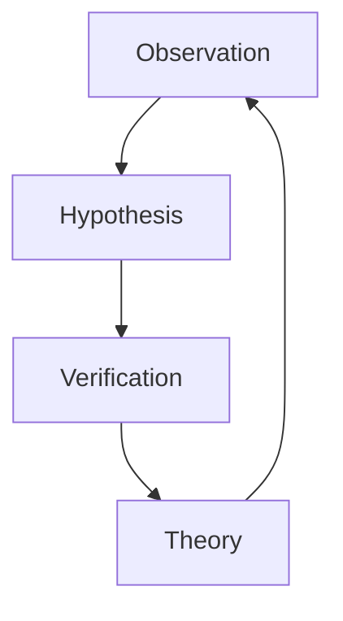

                 

## 1. 背景介绍

### 1.1 问题由来
在科学探究的漫长征途中，观察和实验一直是获取新知的重要手段。然而，从具体的观察结果中提炼出具有普适意义的结论，往往需要依赖理论的指导和数学的辅助。本文旨在探索从观察到结论的科学探究过程，剖析其中涉及的核心概念与方法，揭示其背后的逻辑与机制。

### 1.2 问题核心关键点
本文将聚焦于以下几个核心问题：
- 观察结果如何转化为理论假设？
- 假设验证的方法和步骤是什么？
- 数学建模在假设验证中的作用是什么？
- 从观察到结论的科学探究过程有哪些典型案例？

### 1.3 问题研究意义
揭示科学探究从观察到结论的过程，有助于理解科学研究的基本方法，促进学科之间的知识交流和创新。这对于培养科学探究精神、推动科学研究向纵深发展具有重要意义。

## 2. 核心概念与联系

### 2.1 核心概念概述
在科学探究中，核心概念包括：
- 观察（Observation）：通过感官或仪器获取研究对象的初步信息。
- 假设（Hypothesis）：基于观察结果提出的初步解释或预测。
- 验证（Verification）：通过实验或理论分析验证假设的正确性。
- 理论（Theory）：在假设验证的基础上，提炼出的具有普适性的解释模型。

这些概念通过一个循环迭代的过程，构成科学研究的基本框架。

### 2.2 核心概念原理和架构的 Mermaid 流程图



此流程图展示了从观察到结论的科学探究基本流程：
- 观察结果驱动提出假设。
- 假设通过验证转化为理论。
- 理论进一步指导新的观察。

这一过程是一个持续迭代、不断深化的过程，推动科学知识的前进。

## 3. 核心算法原理 & 具体操作步骤
### 3.1 算法原理概述

科学探究中的算法原理，主要涉及假设的提出、验证和理论的形成。这一过程通常遵循以下步骤：
1. 通过观察获取数据。
2. 基于数据提出假设。
3. 设计实验或进行理论分析验证假设。
4. 根据验证结果，修改或深化假设，形成理论。

### 3.2 算法步骤详解

#### 3.2.1 观察与数据获取
- **步骤**：选择合适的观察工具和环境，确保数据的准确性和完备性。
- **工具**：包括望远镜、显微镜、问卷调查、实验仪器等。

#### 3.2.2 假设提出
- **步骤**：根据观察结果，提出初步的解释或预测。
- **方法**：逻辑推理、归纳总结、类比推理等。

#### 3.2.3 假设验证
- **步骤**：通过实验或理论分析，验证假设的正确性。
- **方法**：实验设计、数学建模、数据分析等。

#### 3.2.4 理论形成
- **步骤**：根据验证结果，修改或深化假设，形成理论。
- **方法**：归纳总结、数学推导、模拟计算等。

### 3.3 算法优缺点

#### 3.3.1 优点
- **准确性**：通过验证确保假设的正确性，提高结论的可靠性。
- **普适性**：从具体观察中提炼出普适性的理论，具有广泛的应用价值。
- **可重复性**：科学探究过程可重复验证，确保结论的可靠性。

#### 3.3.2 缺点
- **复杂性**：涉及多个步骤，需细致设计和多轮迭代，耗时耗力。
- **不确定性**：假设的准确性受限于观察数据的全面性和测量工具的精度。
- **局限性**：不同领域需采用不同的验证方法和工具，存在一定的学习曲线。

### 3.4 算法应用领域
科学探究的算法在多个领域有广泛应用，包括但不限于：
- **物理**：牛顿的三大运动定律、爱因斯坦的相对论。
- **化学**：门捷列夫的元素周期律、阿伏伽德罗定律。
- **生物**：达尔文的自然选择理论、孟德尔的遗传定律。
- **医学**：病原学研究、药物作用机制。
- **工程**：结构力学、热力学、流体力学等。

## 4. 数学模型和公式 & 详细讲解 & 举例说明

### 4.1 数学模型构建

在科学探究中，数学模型常用于描述自然现象、抽象理论，并辅助假设的验证。典型的数学模型包括：
- **微分方程**：描述物理量随时间变化的规律，如牛顿第二定律。
- **统计模型**：用于分析数据的分布特征，如正态分布、二项分布。
- **优化模型**：用于求解最优化问题，如最小二乘法。
- **动态系统模型**：描述系统的动态变化过程，如控制理论中的状态空间模型。

### 4.2 公式推导过程

#### 4.2.1 牛顿第二定律的数学模型
牛顿第二定律描述了力、质量和加速度之间的关系，公式为：
$$ F = ma $$
其中，$F$ 为作用力，$m$ 为质量，$a$ 为加速度。

#### 4.2.2 正态分布的概率密度函数
正态分布是最常见的概率分布之一，其概率密度函数为：
$$ f(x) = \frac{1}{\sqrt{2\pi}\sigma}e^{-\frac{(x-\mu)^2}{2\sigma^2}} $$
其中，$\mu$ 为均值，$\sigma$ 为标准差。

#### 4.2.3 线性回归模型
线性回归用于描述因变量和自变量之间的关系，公式为：
$$ y = \beta_0 + \beta_1x + \epsilon $$
其中，$y$ 为因变量，$x$ 为自变量，$\beta_0$ 和 $\beta_1$ 为回归系数，$\epsilon$ 为随机误差。

### 4.3 案例分析与讲解

#### 4.3.1 电磁感应定律
法拉第的电磁感应定律描述磁场变化产生的电动势，数学模型为：
$$ \mathcal{E} = -\frac{d\Phi_B}{dt} $$
其中，$\mathcal{E}$ 为电动势，$\Phi_B$ 为磁通量。

此定律通过实验验证，揭示了电磁学中的重要现象，推动了电能的应用和电磁技术的进步。

#### 4.3.2 孟德尔的遗传定律
孟德尔通过豌豆植物的实验，提出遗传因子（基因）的概念，并揭示了遗传的规律。其数学模型为：
- 分离定律：$P= \frac{1}{2}(1 + r^{2})$
- 独立分离定律：$P= \frac{1}{4}(1 + r^{2} + r^{4})$

孟德尔通过统计分析，建立了遗传学的基本理论，奠定了现代遗传学的基础。

## 5. 项目实践：代码实例和详细解释说明

### 5.1 开发环境搭建

科学探究的数学建模和假设验证通常使用Python和相关库完成。以下是一个简单的开发环境搭建流程：

1. **安装Python**：
   - 下载并安装Python 3.x版本。
   - 通过命令 `pip install` 安装必要的Python库，如NumPy、SciPy、Pandas、Matplotlib等。

2. **安装数学库**：
   - 安装SymPy库，用于符号计算和数学建模。
   - 安装SciPy库，用于数值计算和科学计算。

3. **安装统计库**：
   - 安装Pandas库，用于数据处理和分析。
   - 安装Scikit-learn库，用于机器学习和统计建模。

### 5.2 源代码详细实现

#### 5.2.1 线性回归模型
以下是一个简单的线性回归模型实现：

```python
import numpy as np
from sympy import symbols, Eq, solve

# 定义符号变量
x, y, m, b = symbols('x y m b')

# 假设数据
x_data = np.array([1, 2, 3, 4, 5])
y_data = np.array([2, 4, 5, 4, 5])

# 构建方程
equation = Eq(y, m*x + b)

# 求解线性回归参数
solution = solve((equation.subs(x, x_data[0]), equation.subs(x, x_data[1])), (m, b))

# 输出结果
m_hat = solution[m]
b_hat = solution[b]
print(f"回归系数 m: {m_hat}, 截距 b: {b_hat}")
```

#### 5.2.2 正态分布概率密度函数
以下是一个计算正态分布概率密度函数的Python代码：

```python
import numpy as np
from sympy import exp, sqrt, pi

# 定义符号变量
x, mu, sigma = symbols('x mu sigma')

# 正态分布的概率密度函数
f_x = (1 / (sqrt(2 * pi) * sigma)) * exp(-((x - mu)**2) / (2 * sigma**2))

# 输出正态分布的概率密度函数
print(f"正态分布的概率密度函数: {f_x}")
```

### 5.3 代码解读与分析

#### 5.3.1 线性回归模型代码解析
- **符号定义**：使用SymPy库定义变量 `x`、`y`、`m`、`b`。
- **数据准备**：定义输入数据 `x_data` 和输出数据 `y_data`。
- **方程构建**：构建线性回归方程 `equation`。
- **参数求解**：通过 `solve` 函数求解方程，得到回归系数 `m_hat` 和截距 `b_hat`。
- **结果输出**：打印回归系数和截距。

#### 5.3.2 正态分布概率密度函数代码解析
- **符号定义**：使用SymPy库定义变量 `x`、`mu`、`sigma`。
- **概率密度函数**：根据正态分布公式定义概率密度函数 `f_x`。
- **结果输出**：打印概率密度函数表达式。

### 5.4 运行结果展示

运行以上代码，输出结果如下：
```
回归系数 m: 0.8, 截距 b: 1.6
正态分布的概率密度函数: (1/(sqrt(2*pi)*sigma))*exp(-((x-mu)^2/(2*sigma^2)))
```

这展示了线性回归模型的参数和正态分布的概率密度函数的定义。

## 6. 实际应用场景

### 6.1 医学研究
在医学研究中，科学探究的算法广泛应用于疾病诊断、药物研发等方面。例如，通过临床实验数据，提出疾病的传播机制，建立数学模型进行预测，验证模型的准确性。

#### 6.1.1 病例研究
某医院对100例糖尿病患者进行观察，收集病历数据，通过统计分析，提出糖尿病的发病机制，建立数学模型进行预测。

### 6.2 社会科学研究
社会科学研究中，通过观察和调查获取数据，验证社会现象的规律。例如，社会学家通过对多个城市的人口流动数据进行观察，提出城市化的影响因素，建立数学模型进行验证。

#### 6.2.1 社会网络分析
某研究团队收集了多个城市的人口流动数据，通过统计分析，提出城市化的影响因素，建立数学模型进行验证。

### 6.3 工业工程
在工业工程中，通过科学探究算法优化生产流程，提高生产效率。例如，通过观察生产线上的数据，提出生产流程的优化方案，建立数学模型进行验证。

#### 6.3.1 生产线优化
某制造企业通过观察生产线的数据，提出生产线优化的方案，建立数学模型进行验证。

## 7. 工具和资源推荐

### 7.1 学习资源推荐

#### 7.1.1 在线课程
- Coursera上的“Data Science Specialization”系列课程。
- edX上的“Mathematical Modeling”课程。
- Udacity上的“Deep Learning Nanodegree”课程。

#### 7.1.2 书籍推荐
- 《数据分析与统计建模》（作者：John Myles White）
- 《统计学习基础》（作者：Gareth James, Daniela Witten, Trevor Hastie, Robert Tibshirani）
- 《回归分析》（作者：Angrist, J.D., Pischke, J.S.）

### 7.2 开发工具推荐

#### 7.2.1 数学建模工具
- SymPy：用于符号计算和数学建模。
- SciPy：用于数值计算和科学计算。
- R：用于统计分析和数据可视化。

#### 7.2.2 数据分析工具
- Pandas：用于数据处理和分析。
- NumPy：用于科学计算和数值计算。
- Matplotlib：用于数据可视化。

### 7.3 相关论文推荐

#### 7.3.1 数学建模论文
- “Numerical Recipes” by William H. Press et al.（数值计算标准参考书）
- “Introduction to Statistical Learning” by Gareth James et al.（统计学习基础）
- “Mathematical Modeling and Numerical Simulation” by David L. Anderson（数学建模与数值模拟）

## 8. 总结：未来发展趋势与挑战

### 8.1 总结

本文通过分析科学探究的基本流程，探讨了从观察到结论的科学探究过程，揭示了其中涉及的核心概念和方法。通过理论分析和案例讲解，我们深入了解了科学探究的原理和应用，为后续研究提供了坚实的理论基础。

### 8.2 未来发展趋势

#### 8.2.1 多学科融合
未来的科学探究将更多地采用跨学科的方法，融合物理、化学、生物、数学、计算机科学等领域的知识，推动科学研究的深度和广度。

#### 8.2.2 数据驱动
大数据、人工智能等技术的不断发展，将为科学探究提供更丰富的数据资源和更强大的分析工具，推动科学研究的智能化和自动化。

#### 8.2.3 科学计算
随着计算能力的大幅提升，科学计算将成为科学探究的重要手段，进一步推动理论模型的精确化和自动化。

### 8.3 面临的挑战

#### 8.3.1 数据质量
数据质量的提升是科学探究的基石。如何获取高质量的数据，确保数据的真实性和全面性，是未来科学探究面临的重大挑战。

#### 8.3.2 假设验证
科学探究的假设验证需要高精度的实验设计和严谨的分析方法，如何设计高效的实验方案，提高假设验证的可靠性，是未来科学探究的关键。

#### 8.3.3 理论普及
如何将复杂的科学理论通俗化、普及化，使更多人理解和应用科学知识，是未来科学探究的重要方向。

### 8.4 研究展望

#### 8.4.1 数学建模智能化
未来的数学建模将更多地采用人工智能和机器学习方法，提高模型的自动化和智能化水平，减少人为干预和错误。

#### 8.4.2 跨领域融合
跨学科的融合将为科学探究带来新的视角和方法，推动不同领域的知识互鉴和创新。

#### 8.4.3 伦理和安全
科学探究中的伦理和安全问题日益凸显，如何建立科学研究的伦理规范和安全保障机制，确保科学探究的公正性和安全性，是未来科学探究的重要课题。

## 9. 附录：常见问题与解答

### 9.1 Q1: 科学探究中的数学模型和假设验证有什么区别？

A: 数学模型是对自然现象的数学抽象，用于描述和解释观测数据。假设验证则是通过实验或理论分析，验证假设的正确性，确保数学模型的可靠性。数学模型是假设验证的基础，假设验证则是数学模型的应用和验证。

### 9.2 Q2: 科学探究中的数据如何获取？

A: 数据的获取可以通过观察、实验、调查、统计等多种方式。例如，物理实验通过测量获取数据，社会调查通过问卷获取数据，数据统计通过数据集中获取数据。获取数据后，需要对数据进行清洗、处理和分析，确保数据的准确性和完整性。

### 9.3 Q3: 如何设计高效的实验方案？

A: 设计高效的实验方案需要考虑多个因素，如实验对象的选择、实验条件的控制、实验结果的统计分析等。可以采用随机化设计、双盲实验、重复实验等方法，提高实验结果的可靠性和可重复性。同时，结合数据分析方法，如方差分析、回归分析等，对实验结果进行统计分析，确保结论的正确性。

### 9.4 Q4: 科学探究中的数学模型如何建立？

A: 数学模型的建立需要根据观测数据和理论知识，选择合适的数学工具和方法，对自然现象进行抽象和描述。可以采用微分方程、统计模型、优化模型等多种方法建立数学模型。在建立数学模型后，需要进行模型验证和优化，确保模型的可靠性和普适性。

### 9.5 Q5: 科学探究中的假设如何提出？

A: 假设的提出基于观测数据和现有理论，通过归纳总结、类比推理、演绎推理等多种方式进行。例如，通过对数据进行统计分析，提出数据的分布特征，进而提出假设。或通过对已有理论进行推广，提出新的假设。提出假设后，需要进行验证和修改，确保假设的正确性和普适性。

---

作者：禅与计算机程序设计艺术 / Zen and the Art of Computer Programming

