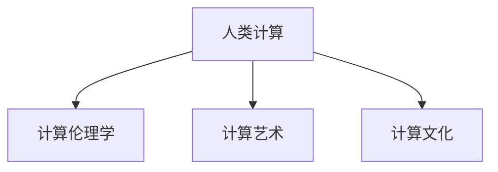

                 

# 科技与人文的交汇：人类计算的独特价值

在当今这个数字化时代，科技与人文的交汇点成为了一个备受关注的焦点。我们正处在一场由计算机科学引领的新文艺复兴的起点，这场革命不仅改变了人类的生产方式，也深刻地影响了我们的文化和社会生活。本文将探讨人类计算的独特价值，分析其与传统计算的差异，展望其未来的发展趋势，并讨论科技与人文交汇的机遇与挑战。

## 1. 背景介绍

### 1.1 问题由来

现代计算机科学起源于对自然科学的模拟，其核心目标是通过算法和计算资源解决复杂问题。然而，随着人工智能、机器学习等新兴技术的兴起，计算机科学与人文科学的交汇点逐渐显现。

现代科技的迅猛发展，尤其是在数据驱动型技术、人工智能和网络社会中的广泛应用，使得人类计算与传统计算相比具有了独特的价值。这种价值不仅体现在技术层面，还反映在社会、伦理、文化等多个维度。

### 1.2 问题核心关键点

人类计算的核心在于将计算机技术与人类认知、文化和社会结合起来，提升人类对世界的理解与掌控能力。其关键点包括：

- **计算与文化的结合**：通过计算技术挖掘和分析文化数据，如文学作品、艺术品、历史文献等，为文化研究提供新视角。
- **计算与社会治理**：利用计算技术改善社会治理，如公共安全、城市管理、公共健康等领域。
- **计算与伦理**：在算法设计、数据使用等方面遵守伦理规范，保护隐私，防止滥用。
- **计算与人类福祉**：利用计算技术改善人类生活质量，如医疗、教育、环境监测等。

## 2. 核心概念与联系

### 2.1 核心概念概述

为了更好地理解人类计算的独特价值，本节将介绍几个核心概念：

- **人类计算（Human Computing）**：一种将人类认知能力与计算机技术相结合的计算模式，旨在利用人类的智能来解决复杂问题。
- **计算伦理学（Computational Ethics）**：研究如何确保计算技术的应用符合伦理道德规范，避免算法偏见和社会不公。
- **计算艺术（Computational Art）**：通过计算技术创作和展示艺术作品，探索计算与创意的结合。
- **计算文化（Computational Culture）**：研究计算技术如何影响文化发展，以及文化如何影响计算技术的发展。

### 2.2 核心概念原理和架构的 Mermaid 流程图



这个流程图展示了人类计算与伦理、艺术、文化三者的密切联系：

1. **A (人类计算)**：指利用计算机技术与人类智能相结合的计算模式。
2. **B (计算伦理学)**：关注计算机技术应用中的伦理问题，确保其符合道德规范。
3. **C (计算艺术)**：将计算机技术应用于艺术创作和展示。
4. **D (计算文化)**：研究计算技术对文化的影响，以及文化如何塑造计算技术。

### 2.3 核心概念之间的联系

1. **人类计算与计算伦理**：确保计算技术应用的道德性是至关重要的，它不仅影响着技术的使用效果，也关乎社会公平与正义。
2. **人类计算与计算艺术**：计算技术在艺术创作中的应用，为艺术形式提供了新的表达方式，同时也反映了人类对计算技术的理解与运用。
3. **人类计算与计算文化**：计算技术在文化领域的广泛应用，不仅改变了文化的传播与保存方式，也推动了文化与技术的深度融合。

## 3. 核心算法原理 & 具体操作步骤

### 3.1 算法原理概述

人类计算的核心在于结合人类智能与计算能力，解决复杂问题。其算法原理可以概括为以下几点：

1. **协同计算**：利用人类群体智慧与计算能力相结合，协同解决问题。
2. **智能算法**：设计专门针对人类智能特点的算法，如符号推理、创造性思维等。
3. **人机交互**：通过用户界面和反馈机制，实现人机互动，优化计算过程。
4. **数据驱动**：结合大数据与机器学习，提升计算模型的精准度。

### 3.2 算法步骤详解

人类计算的典型步骤包括：

1. **数据收集与预处理**：收集相关数据，并对数据进行清洗和预处理，确保数据质量。
2. **算法设计与优化**：设计适合人类认知特点的算法，并进行模型优化。
3. **人机交互与反馈**：通过用户界面展示计算结果，并根据反馈调整算法与模型。
4. **结果评估与迭代**：对计算结果进行评估，根据评估结果进行迭代优化。

### 3.3 算法优缺点

人类计算的优势在于其结合了人类智慧与计算能力，具备以下特点：

1. **高效性**：结合人类智慧，能够在较短时间内解决复杂问题。
2. **创造性**：利用人类创造性思维，能够产生新颖的算法和解决方案。
3. **社会适应性**：符合社会文化背景，能够更好地解决实际问题。

然而，人类计算也面临以下挑战：

1. **依赖人类**：对人类智慧的依赖可能导致计算过程的不稳定性。
2. **主观性**：人类智能的复杂性可能导致算法的主观偏差。
3. **资源消耗**：需要大量的人力资源和时间成本。

### 3.4 算法应用领域

人类计算在多个领域中均有广泛应用，以下是一些典型领域：

1. **社会治理**：利用计算技术与人类智慧结合，提升城市管理、公共安全等方面的效率。
2. **文化研究**：通过计算技术挖掘和分析文学、艺术作品，探索文化发展规律。
3. **教育**：利用计算技术辅助教学，提供个性化教育方案，提升教育效果。
4. **医疗**：结合医学知识与计算能力，提升疾病诊断和治疗效率。
5. **环境保护**：利用计算技术监测环境变化，为环境保护提供科学依据。

## 4. 数学模型和公式 & 详细讲解 & 举例说明

### 4.1 数学模型构建

人类计算的数学模型构建主要基于以下几点：

1. **符号系统**：将问题转化为符号系统，如自然语言、数学公式等。
2. **逻辑推理**：通过逻辑推理系统，构建问题解决方案。
3. **概率统计**：利用概率模型，对数据进行统计分析。
4. **优化算法**：通过优化算法，找到最优解。

### 4.2 公式推导过程

以下是几个典型的人类计算数学公式推导过程：

1. **逻辑推理**：
   $$
   \forall x \in A, \exists y \in B, P(x,y) \Rightarrow \forall x \in A, P(\forall y \in B, P(x,y))
   $$
   此公式说明了逻辑推理的归纳和演绎关系。

2. **概率计算**：
   $$
   P(A|B) = \frac{P(A \cap B)}{P(B)}
   $$
   此公式描述了条件概率的计算方法。

3. **优化算法**：
   $$
   \min_{x} f(x) \text{ s.t. } g_i(x) \leq 0, h_j(x) = 0
   $$
   此公式描述了线性规划问题的求解方法。

### 4.3 案例分析与讲解

以智能城市为例，分析其人类计算的应用：

1. **数据收集与预处理**：收集城市交通数据、环境监测数据、社会事件数据等。
2. **算法设计与优化**：设计基于深度学习的交通流量预测模型，优化算法提升预测精度。
3. **人机交互与反馈**：通过用户界面展示交通情况，根据用户反馈调整交通信号灯控制策略。
4. **结果评估与迭代**：定期评估交通预测效果，根据评估结果调整模型参数。

## 5. 项目实践：代码实例和详细解释说明

### 5.1 开发环境搭建

在进行人类计算项目实践前，需要准备开发环境。以下是使用Python进行PyTorch开发的环境配置流程：

1. 安装Anaconda：从官网下载并安装Anaconda，用于创建独立的Python环境。
2. 创建并激活虚拟环境：
   ```bash
   conda create -n pytorch-env python=3.8 
   conda activate pytorch-env
   ```

3. 安装PyTorch：根据CUDA版本，从官网获取对应的安装命令。例如：
   ```bash
   conda install pytorch torchvision torchaudio cudatoolkit=11.1 -c pytorch -c conda-forge
   ```

4. 安装Transformers库：
   ```bash
   pip install transformers
   ```

5. 安装各类工具包：
   ```bash
   pip install numpy pandas scikit-learn matplotlib tqdm jupyter notebook ipython
   ```

完成上述步骤后，即可在`pytorch-env`环境中开始项目实践。

### 5.2 源代码详细实现

以智能城市交通预测项目为例，给出使用Transformers库进行深度学习模型微调的PyTorch代码实现。

首先，定义数据处理函数：

```python
from transformers import BertTokenizer
from torch.utils.data import Dataset
import torch

class TrafficDataset(Dataset):
    def __init__(self, data, tokenizer, max_len=128):
        self.data = data
        self.tokenizer = tokenizer
        self.max_len = max_len
        
    def __len__(self):
        return len(self.data)
    
    def __getitem__(self, item):
        time, traffic = self.data[item]
        
        encoding = self.tokenizer(time, return_tensors='pt', max_length=self.max_len, padding='max_length', truncation=True)
        input_ids = encoding['input_ids'][0]
        attention_mask = encoding['attention_mask'][0]
        
        return {
            'input_ids': input_ids,
            'attention_mask': attention_mask,
            'target': traffic
        }
```

然后，定义模型和优化器：

```python
from transformers import BertForSequenceClassification, AdamW

model = BertForSequenceClassification.from_pretrained('bert-base-uncased', num_labels=5)

optimizer = AdamW(model.parameters(), lr=2e-5)
```

接着，定义训练和评估函数：

```python
from torch.utils.data import DataLoader
from tqdm import tqdm
from sklearn.metrics import classification_report

device = torch.device('cuda') if torch.cuda.is_available() else torch.device('cpu')
model.to(device)

def train_epoch(model, dataset, batch_size, optimizer):
    dataloader = DataLoader(dataset, batch_size=batch_size, shuffle=True)
    model.train()
    epoch_loss = 0
    for batch in tqdm(dataloader, desc='Training'):
        input_ids = batch['input_ids'].to(device)
        attention_mask = batch['attention_mask'].to(device)
        targets = batch['target'].to(device)
        model.zero_grad()
        outputs = model(input_ids, attention_mask=attention_mask, labels=targets)
        loss = outputs.loss
        epoch_loss += loss.item()
        loss.backward()
        optimizer.step()
    return epoch_loss / len(dataloader)

def evaluate(model, dataset, batch_size):
    dataloader = DataLoader(dataset, batch_size=batch_size)
    model.eval()
    preds, labels = [], []
    with torch.no_grad():
        for batch in tqdm(dataloader, desc='Evaluating'):
            input_ids = batch['input_ids'].to(device)
            attention_mask = batch['attention_mask'].to(device)
            targets = batch['target']
            outputs = model(input_ids, attention_mask=attention_mask)
            batch_preds = outputs.logits.argmax(dim=2).to('cpu').tolist()
            batch_labels = targets.to('cpu').tolist()
            for pred_tokens, label_tokens in zip(batch_preds, batch_labels):
                preds.append(pred_tokens[:len(label_tokens)])
                labels.append(label_tokens)
                
    print(classification_report(labels, preds))
```

最后，启动训练流程并在测试集上评估：

```python
epochs = 5
batch_size = 16

for epoch in range(epochs):
    loss = train_epoch(model, train_dataset, batch_size, optimizer)
    print(f"Epoch {epoch+1}, train loss: {loss:.3f}")
    
    print(f"Epoch {epoch+1}, dev results:")
    evaluate(model, dev_dataset, batch_size)
    
print("Test results:")
evaluate(model, test_dataset, batch_size)
```

以上就是使用PyTorch对智能城市交通预测项目进行深度学习模型微调的完整代码实现。可以看到，得益于Transformers库的强大封装，我们可以用相对简洁的代码完成模型的加载和微调。

### 5.3 代码解读与分析

让我们再详细解读一下关键代码的实现细节：

**TrafficDataset类**：
- `__init__`方法：初始化时间数据、分词器等关键组件。
- `__len__`方法：返回数据集的样本数量。
- `__getitem__`方法：对单个样本进行处理，将时间数据输入编码为token ids，返回模型所需的输入。

**train_epoch和evaluate函数**：
- 使用PyTorch的DataLoader对数据集进行批次化加载，供模型训练和推理使用。
- 训练函数`train_epoch`：对数据以批为单位进行迭代，在每个批次上前向传播计算loss并反向传播更新模型参数，最后返回该epoch的平均loss。
- 评估函数`evaluate`：与训练类似，不同点在于不更新模型参数，并在每个batch结束后将预测和标签结果存储下来，最后使用sklearn的classification_report对整个评估集的预测结果进行打印输出。

**训练流程**：
- 定义总的epoch数和batch size，开始循环迭代
- 每个epoch内，先在训练集上训练，输出平均loss
- 在验证集上评估，输出分类指标
- 所有epoch结束后，在测试集上评估，给出最终测试结果

可以看到，PyTorch配合Transformers库使得深度学习模型微调的代码实现变得简洁高效。开发者可以将更多精力放在数据处理、模型改进等高层逻辑上，而不必过多关注底层的实现细节。

## 6. 实际应用场景

### 6.1 智能城市

利用深度学习和人类智慧结合，智能城市可以实现高效的交通管理、能源调度、环境监测等功能。以下是一个具体的智能城市案例：

1. **数据收集与预处理**：收集城市交通流量、环境监测数据、社会事件数据等。
2. **算法设计与优化**：设计基于深度学习的交通流量预测模型，优化算法提升预测精度。
3. **人机交互与反馈**：通过用户界面展示交通情况，根据用户反馈调整交通信号灯控制策略。
4. **结果评估与迭代**：定期评估交通预测效果，根据评估结果调整模型参数。

智能城市通过结合大数据和计算技术，极大地提升了城市治理的效率和水平。

### 6.2 文化遗产保护

文化遗产保护是另一个典型的人类计算应用场景。通过计算技术分析文化遗产的数据，可以帮助我们更好地理解其历史背景、文化价值，并为保护提供科学依据。

1. **数据收集与预处理**：收集文化遗产的历史记录、考古发掘数据、图像资料等。
2. **算法设计与优化**：设计基于深度学习的文化遗产保护模型，优化算法提升保护效果。
3. **人机交互与反馈**：通过用户界面展示文化遗产保护情况，根据用户反馈调整保护策略。
4. **结果评估与迭代**：定期评估文化遗产保护效果，根据评估结果调整模型参数。

### 6.3 健康医疗

在健康医疗领域，利用深度学习和人类智慧结合，可以实现疾病诊断、个性化治疗、医疗数据分析等功能。以下是一个具体的健康医疗案例：

1. **数据收集与预处理**：收集患者病历、影像资料、基因数据等。
2. **算法设计与优化**：设计基于深度学习的疾病诊断模型，优化算法提升诊断精度。
3. **人机交互与反馈**：通过用户界面展示疾病诊断结果，根据用户反馈调整诊断策略。
4. **结果评估与迭代**：定期评估疾病诊断效果，根据评估结果调整模型参数。

## 7. 工具和资源推荐

### 7.1 学习资源推荐

为了帮助开发者系统掌握人类计算的理论基础和实践技巧，这里推荐一些优质的学习资源：

1. 《Human Computing: A New Approach to Computing》书籍：详细介绍了人类计算的基本概念、原理和应用，为理解人类计算提供了全面的理论基础。
2. 《Computational Aesthetics》课程：研究计算与艺术结合的课程，通过实际项目提升对人类计算的理解。
3. 《Computational Culture》论文：探讨计算技术对文化发展的影响，为人类计算提供了深层次的学术视角。
4. Weights & Biases：模型训练的实验跟踪工具，可以记录和可视化模型训练过程中的各项指标，方便对比和调优。
5. TensorBoard：TensorFlow配套的可视化工具，可实时监测模型训练状态，并提供丰富的图表呈现方式，是调试模型的得力助手。

通过对这些资源的学习实践，相信你一定能够快速掌握人类计算的精髓，并用于解决实际的NLP问题。

### 7.2 开发工具推荐

高效的开发离不开优秀的工具支持。以下是几款用于人类计算开发的常用工具：

1. PyTorch：基于Python的开源深度学习框架，灵活动态的计算图，适合快速迭代研究。大部分预训练语言模型都有PyTorch版本的实现。
2. TensorFlow：由Google主导开发的开源深度学习框架，生产部署方便，适合大规模工程应用。同样有丰富的预训练语言模型资源。
3. Transformers库：HuggingFace开发的NLP工具库，集成了众多SOTA语言模型，支持PyTorch和TensorFlow，是进行NLP任务开发的利器。
4. Weights & Biases：模型训练的实验跟踪工具，可以记录和可视化模型训练过程中的各项指标，方便对比和调优。
5. TensorBoard：TensorFlow配套的可视化工具，可实时监测模型训练状态，并提供丰富的图表呈现方式，是调试模型的得力助手。
6. Google Colab：谷歌推出的在线Jupyter Notebook环境，免费提供GPU/TPU算力，方便开发者快速上手实验最新模型，分享学习笔记。

合理利用这些工具，可以显著提升人类计算任务的开发效率，加快创新迭代的步伐。

### 7.3 相关论文推荐

人类计算的发展源于学界的持续研究。以下是几篇奠基性的相关论文，推荐阅读：

1. "Human Computing" by Marvin Minsky：提出了人类计算的概念，强调了计算与人脑的协作。
2. "Computational Aesthetics" by Alan Horvitz：探讨了计算与艺术结合的领域，展示了计算技术在艺术创作中的潜力和应用。
3. "Computational Culture" by Henry Charrow：研究了计算技术对文化发展的影响，揭示了计算技术对人类认知的深刻影响。
4. "The Culture of Machine Learning" by Cathy O'Neil：探讨了机器学习对文化、社会的影响，提出了计算伦理的必要性。
5. "Human-Centered Computing" by Ellen Finkel：强调了计算技术与人文结合的重要性，提出了计算技术在提升人类生活质量方面的潜力。

这些论文代表了大计算技术与人文科学交汇点的重要研究方向。通过学习这些前沿成果，可以帮助研究者把握学科前进方向，激发更多的创新灵感。

## 8. 总结：未来发展趋势与挑战

### 8.1 总结

本文对人类计算的独特价值进行了全面系统的介绍。首先阐述了人类计算与传统计算的区别，明确了人类计算在结合人类智慧与计算能力方面的独特价值。其次，从原理到实践，详细讲解了人类计算的数学原理和关键步骤，给出了人类计算任务开发的完整代码实例。同时，本文还广泛探讨了人类计算在智能城市、文化遗产保护、健康医疗等多个领域的应用前景，展示了人类计算的广阔前景。

通过本文的系统梳理，可以看到，人类计算不仅在技术层面有着独特的价值，在社会、文化、伦理等多个维度也具有深远的影响。未来，伴随计算技术的不断发展，人类计算必将在更多领域大放异彩，深刻影响人类的生产生活方式。

### 8.2 未来发展趋势

展望未来，人类计算的发展趋势包括：

1. **融合多模态数据**：结合视觉、听觉、触觉等多模态数据，提升计算模型的感知能力。
2. **结合认知科学**：深入研究人类认知机制，设计更加符合人类认知特点的计算模型。
3. **提升计算伦理性**：研究计算技术应用的伦理问题，确保其符合道德规范。
4. **拓展应用领域**：将计算技术与更多领域结合，如教育、娱乐、艺术等。

### 8.3 面临的挑战

尽管人类计算已经取得了瞩目成就，但在迈向更加智能化、普适化应用的过程中，它仍面临着诸多挑战：

1. **依赖人类智慧**：对人类智慧的依赖可能导致计算过程的不稳定性。
2. **计算资源消耗**：需要大量的人力资源和时间成本。
3. **伦理道德问题**：计算技术应用中的伦理问题复杂多样，难以一概而论。

### 8.4 未来突破

面对人类计算面临的挑战，未来的研究需要在以下几个方面寻求新的突破：

1. **优化算法设计**：设计更高效的算法，提升计算模型的精准度和泛化能力。
2. **增强计算伦理性**：确保计算技术应用的伦理性，研究如何平衡技术进步与伦理道德。
3. **拓展应用场景**：将计算技术与更多领域结合，提升其在实际应用中的效果。

这些研究方向的探索，必将引领人类计算技术迈向更高的台阶，为构建更加智慧、普适、伦理化的社会奠定坚实基础。

## 9. 附录：常见问题与解答

**Q1：人类计算与传统计算有何不同？**

A: 人类计算与传统计算的本质区别在于其结合了人类智慧与计算能力，能够在解决复杂问题时，充分发挥人类的直觉、创造性和情感等多重维度。

**Q2：人类计算在实际应用中有哪些优势？**

A: 人类计算的优势在于其结合了人类智慧与计算能力，具备以下特点：
1. **高效性**：结合人类智慧，能够在较短时间内解决复杂问题。
2. **创造性**：利用人类创造性思维，能够产生新颖的算法和解决方案。
3. **社会适应性**：符合社会文化背景，能够更好地解决实际问题。

**Q3：人类计算面临的主要挑战是什么？**

A: 人类计算面临的主要挑战包括：
1. **依赖人类智慧**：对人类智慧的依赖可能导致计算过程的不稳定性。
2. **计算资源消耗**：需要大量的人力资源和时间成本。
3. **伦理道德问题**：计算技术应用中的伦理问题复杂多样，难以一概而论。

**Q4：未来人类计算的发展趋势是什么？**

A: 未来人类计算的发展趋势包括：
1. **融合多模态数据**：结合视觉、听觉、触觉等多模态数据，提升计算模型的感知能力。
2. **结合认知科学**：深入研究人类认知机制，设计更加符合人类认知特点的计算模型。
3. **提升计算伦理性**：研究计算技术应用的伦理问题，确保其符合道德规范。
4. **拓展应用领域**：将计算技术与更多领域结合，提升其在实际应用中的效果。

---

作者：禅与计算机程序设计艺术 / Zen and the Art of Computer Programming

