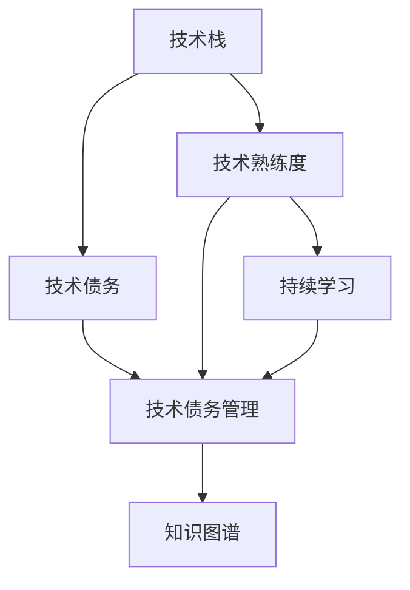

                 

# 程序员如何应对技术更新

## 1. 背景介绍

在现代软件开发中，技术更新换代的速度令人目不暇接。一方面，新兴的技术和工具不断涌现，为开发效率和产品功能带来巨大的提升；另一方面，技术的快速迭代也使得旧的技术和工具逐渐被淘汰。作为程序员，如何在不断变化的技术环境中保持竞争力，实现职业生涯的持续发展，成为一个亟待解决的问题。

本文旨在探讨程序员应对技术更新的方法和策略，通过深入分析技术演进的规律，帮助程序员构建持续学习、快速适应的能力。我们希望通过系统性的方法和实用的技术手段，使程序员能够跟上技术潮流，把握未来发展趋势，实现职业的长期稳定增长。

## 2. 核心概念与联系

### 2.1 核心概念概述

为更好地理解程序员应对技术更新的方法和策略，本节将介绍几个密切相关的核心概念：

- **技术栈**：指项目或团队所使用的所有技术工具和框架的总称。包括编程语言、数据库、前端框架、后端框架、构建工具、版本控制系统、容器化工具等。

- **技术债务**：指在软件开发过程中，为了快速交付或解决某些问题而采取的临时措施或简化的解决方案，这些措施可能会在未来增加代码维护的难度或成本。

- **技术熟练度**：指程序员对某个技术工具或框架的掌握程度，包括理论知识、实践经验、使用频率等。

- **持续学习**：指在职业生涯中不断获取新知识、新技能，以适应技术变化的能力。

- **知识图谱**：指将个人、团队或组织的知识结构化、系统化的表示方法，有助于理解和传播知识。

这些核心概念之间的逻辑关系可以通过以下Mermaid流程图来展示：



这个流程图展示了一系列核心概念及其之间的关系：

1. 技术栈的构建和维护需要不断进行技术债务管理，以避免系统复杂化。
2. 技术熟练度是持续学习的基础，只有不断学习和实践，才能保持技术栈的活跃度。
3. 持续学习可以帮助程序员识别和解决技术债务，避免技术债务积累。
4. 知识图谱可以帮助程序员系统化地管理知识和技能，提升技术熟练度。

## 3. 核心算法原理 & 具体操作步骤

### 3.1 算法原理概述

技术更新的本质是新的技术工具或框架替代旧的技术工具或框架，使得开发效率或系统性能得到提升。在这个过程中，程序员需要掌握新技术，更新自己的技术栈，并应用新技术解决旧问题。

技术更新的过程可以分为以下三个阶段：

1. **识别新技术**：通过学习、交流、社区反馈等方式，识别出新技术的优势和适用场景。
2. **评估新技术**：根据项目需求、技术成熟度、迁移成本等因素，评估新技术的价值和可行性。
3. **应用新技术**：制定详细的技术迁移计划，逐步将新技术应用到项目中，同时管理技术债务。

### 3.2 算法步骤详解

#### 3.2.1 识别新技术

1. **技术社区**：关注国内外知名的技术社区（如Stack Overflow、GitHub、Hacker News等），获取最新的技术动态和讨论。
2. **技术博客**：阅读顶尖技术公司（如Google、Microsoft、Amazon等）的技术博客，了解最新的技术趋势和创新点。
3. **技术会议**：参加国内外知名的技术会议（如SIGGRAPH、NeurIPS、Google I/O等），了解前沿技术和发展方向。
4. **同行交流**：参与技术沙龙、Meetup、线上线下的技术交流活动，与同行交流最新的技术经验和方法。

#### 3.2.2 评估新技术

1. **项目匹配度**：评估新技术与项目需求的匹配度，考虑其是否能够提升开发效率或系统性能。
2. **技术成熟度**：评估新技术的技术成熟度和稳定性，了解其社区支持和文档资料是否充足。
3. **迁移成本**：评估新技术的迁移成本，包括学习成本、代码重构成本、兼容性成本等。

#### 3.2.3 应用新技术

1. **技术验证**：在开发环境的沙箱中，使用新技术进行小规模的验证实验，验证其可行性和性能。
2. **技术迁移计划**：制定详细的技术迁移计划，包括技术选型、项目架构、代码重构等步骤。
3. **技术债务管理**：在迁移过程中，定期评估技术债务，逐步解决历史债务，确保系统稳定。
4. **持续迭代**：在应用新技术后，持续监控系统性能，进行必要的优化和调整。

### 3.3 算法优缺点

#### 3.3.1 优点

1. **提高效率**：应用新技术可以大幅提升开发效率，减少代码维护和调试的成本。
2. **改善性能**：新技术往往能带来更好的性能表现，如更快的运行速度、更低的资源消耗。
3. **扩展能力**：新技术能够支持更复杂的系统架构和更丰富的功能模块，提升系统的可扩展性。
4. **吸引人才**：掌握前沿技术可以增加程序员的吸引力，吸引更多优秀人才加入团队。

#### 3.3.2 缺点

1. **学习成本高**：新技术的学习曲线较陡，需要投入大量时间和精力进行学习和实践。
2. **技术债务风险**：新技术的引入可能会引入新的技术债务，增加系统复杂性。
3. **迁移成本高**：新技术的应用可能需要较大的代码重构和系统调整，带来较高的迁移成本。
4. **兼容性问题**：新技术与现有系统之间的兼容性问题可能影响系统的稳定性和性能。

### 3.4 算法应用领域

新技术的引入和应用适用于各种软件开发场景，包括但不限于：

- **Web开发**：如使用React或Vue.js替代旧的前端框架，提升用户体验和开发效率。
- **移动开发**：如使用Flutter或Kotlin替代旧的技术栈，提升跨平台开发能力和应用性能。
- **数据科学**：如使用TensorFlow或PyTorch进行机器学习模型的训练和部署，提升数据处理和分析能力。
- **云计算**：如使用AWS或Azure进行云服务迁移，提升系统的可伸缩性和弹性。
- **容器化**：如使用Docker和Kubernetes进行容器化部署，提升系统管理和部署效率。

## 4. 数学模型和公式 & 详细讲解 & 举例说明

### 4.1 数学模型构建

假设某开发团队在考虑引入一种名为X的新技术，并将其应用到项目A中。设技术债务为 $D_A$，技术熟练度为 $S_A$，项目匹配度为 $M_A$，技术成熟度为 $M_X$，迁移成本为 $C_X$。模型构建如下：

1. **技术债务**： $D_A$
2. **技术熟练度**： $S_A$
3. **项目匹配度**： $M_A$
4. **技术成熟度**： $M_X$
5. **迁移成本**： $C_X$

总评分 $S_{total}$ 为：

$$ S_{total} = M_A \times S_A \times M_X \times (1 - D_A) - C_X $$

### 4.2 公式推导过程

1. **技术债务管理**： $D_{new} = D_A - \alpha S_A \times M_A \times M_X$，其中 $\alpha$ 为技术债务管理系数。
2. **技术熟练度提升**： $S_{new} = S_A + \beta M_A \times M_X$，其中 $\beta$ 为技术熟练度提升系数。
3. **评分计算**： $S_{total_{new}} = M_A \times S_{new} \times M_X \times (1 - D_{new}) - C_X$。

### 4.3 案例分析与讲解

#### 案例分析

某开发团队正在考虑引入TensorFlow进行机器学习模型的训练和部署，并评估其对现有项目的影响。

- **技术债务**： $D_A = 0.5$
- **技术熟练度**： $S_A = 0.8$
- **项目匹配度**： $M_A = 0.9$
- **技术成熟度**： $M_X = 0.95$
- **迁移成本**： $C_X = 0.2$

代入公式计算：

1. **技术债务管理**： $D_{new} = 0.5 - 0.8 \times 0.9 \times 0.95 = 0.03$。
2. **技术熟练度提升**： $S_{new} = 0.8 + 0.9 \times 0.95 = 1.37$。
3. **评分计算**： $S_{total_{new}} = 0.9 \times 1.37 \times 0.95 \times (1 - 0.03) - 0.2 = 0.947$。

评估结果显示，引入TensorFlow能够提升技术熟练度并降低技术债务，总评分明显提高，说明该技术值得引入。

## 5. 项目实践：代码实例和详细解释说明

### 5.1 开发环境搭建

为了进行新技术的引入和应用，首先需要搭建一个开发环境，包括以下几个步骤：

1. **安装开发工具**：如安装Python、JDK、Git等开发工具。
2. **配置开发环境**：如配置IDE、版本控制系统等开发环境。
3. **搭建依赖库**：如安装项目依赖的第三方库和框架。
4. **搭建测试环境**：如配置单元测试、集成测试环境。
5. **搭建持续集成工具**：如配置Jenkins、GitLab CI等持续集成工具。

### 5.2 源代码详细实现

以引入React进行Web前端开发为例，具体代码实现步骤如下：

1. **创建项目**：使用`create-react-app`创建React项目。
2. **配置路由**：使用React Router配置路由。
3. **引入组件**：引入React组件和样式文件。
4. **开发组件**：编写React组件的代码。
5. **测试组件**：编写单元测试和集成测试代码。

### 5.3 代码解读与分析

React的核心原理包括组件化和虚拟DOM，其代码实现如下：

```javascript
// React组件
class MyComponent extends React.Component {
    render() {
        return <div>{this.props.children}</div>;
    }
}

// React Router配置
function Route() {
    return <Route component={MyComponent} path="/" />;
}

// 单元测试
describe('MyComponent', () => {
    it('renders correctly', () => {
        const wrapper = shallow(<MyComponent />);
        expect(wrapper.text()).toBe('div');
    });
});

// 集成测试
describe('MyComponent', () => {
    let wrapper;
    beforeEach(() => {
        wrapper = shallow(<MyComponent />);
    });
    it('renders children correctly', () => {
        expect(wrapper.children().length).toBe(1);
    });
});

// React Router配置
function Route() {
    return <Route component={MyComponent} path="/" />;
}
```

以上代码实现了React组件的基本功能，包括组件定义、路由配置、组件渲染和测试等。

### 5.4 运行结果展示

通过上述代码实现，可以运行React项目，访问`http://localhost:3000`查看效果。运行结果应为React组件的输出内容。

## 6. 实际应用场景

### 6.1 大型企业技术栈更新

#### 场景描述

某大型企业正在考虑引入Kubernetes进行容器化部署，以提升系统的可伸缩性和管理效率。

#### 应用步骤

1. **评估新技术**：评估Kubernetes与现有系统的匹配度，考虑其是否能够提升系统性能和稳定性。
2. **技术验证**：在测试环境中搭建Kubernetes集群，进行小规模的验证实验。
3. **技术迁移计划**：制定详细的技术迁移计划，逐步将应用容器化部署。
4. **技术债务管理**：在迁移过程中，定期评估技术债务，逐步解决历史债务，确保系统稳定。
5. **持续迭代**：在应用Kubernetes后，持续监控系统性能，进行必要的优化和调整。

### 6.2 创业公司快速开发

#### 场景描述

某创业公司正在考虑引入Flutter进行移动开发，以加速应用开发和市场响应。

#### 应用步骤

1. **评估新技术**：评估Flutter与现有开发环境的匹配度，考虑其是否能够提升开发效率和应用性能。
2. **技术验证**：在开发环境中搭建Flutter应用，进行小规模的验证实验。
3. **技术迁移计划**：制定详细的技术迁移计划，逐步将应用迁移到Flutter平台。
4. **技术债务管理**：在迁移过程中，定期评估技术债务，逐步解决历史债务，确保系统稳定。
5. **持续迭代**：在应用Flutter后，持续监控应用性能，进行必要的优化和调整。

### 6.3 传统企业数字化转型

#### 场景描述

某传统企业正在考虑引入TensorFlow进行数据科学项目，以提升数据处理和分析能力。

#### 应用步骤

1. **评估新技术**：评估TensorFlow与现有数据平台和工具的匹配度，考虑其是否能够提升数据处理效率和分析精度。
2. **技术验证**：在测试环境中搭建TensorFlow模型，进行小规模的验证实验。
3. **技术迁移计划**：制定详细的技术迁移计划，逐步将数据处理和分析任务迁移到TensorFlow平台。
4. **技术债务管理**：在迁移过程中，定期评估技术债务，逐步解决历史债务，确保系统稳定。
5. **持续迭代**：在应用TensorFlow后，持续监控数据处理和分析结果，进行必要的优化和调整。

## 7. 工具和资源推荐

### 7.1 学习资源推荐

为帮助程序员系统掌握新技术的引入和应用方法，以下是推荐的几类学习资源：

1. **在线课程**：如Udemy、Coursera等平台提供的大量技术课程，涵盖从基础到高级的各类技术。
2. **官方文档**：各大技术公司的官方文档，如TensorFlow、React、Kubernetes等，提供详细的API和用法说明。
3. **技术博客**：如Stack Overflow、Medium等平台上的技术博客，提供丰富的案例和经验分享。
4. **开源项目**：如GitHub上的开源项目，提供大量的代码示例和实践经验。
5. **技术社区**：如Stack Overflow、Reddit等社区，提供快速的技术交流和问题解答。

### 7.2 开发工具推荐

为提高新技术的引入和应用效率，以下是推荐的几款开发工具：

1. **IDE**：如IntelliJ IDEA、Visual Studio Code等，提供强大的代码编辑和调试功能。
2. **版本控制系统**：如Git、SVN等，提供版本控制和协作开发功能。
3. **容器化工具**：如Docker、Kubernetes等，提供容器化部署和管理功能。
4. **测试工具**：如JUnit、Selenium等，提供测试自动化和质量保障功能。
5. **持续集成工具**：如Jenkins、GitLab CI等，提供持续集成和自动化测试功能。

### 7.3 相关论文推荐

为深入了解新技术的原理和应用方法，以下是推荐的几篇相关论文：

1. **《数据驱动的Web前端开发演进》**：探讨了Web前端技术栈的演进过程，介绍了React、Vue.js等新技术的引入方法。
2. **《机器学习在云计算中的应用》**：介绍了TensorFlow等机器学习工具在云计算中的实践应用，探讨了其技术优势和优化方法。
3. **《Kubernetes：容器编排的未来》**：介绍了Kubernetes的原理和应用方法，探讨了其在企业中的应用场景和实践经验。
4. **《Flutter：移动开发的新范式》**：介绍了Flutter的技术优势和应用方法，探讨了其跨平台开发和性能优化方法。

## 8. 总结：未来发展趋势与挑战

### 8.1 研究成果总结

本文探讨了程序员如何应对技术更新，通过系统性方法和实用技术手段，帮助程序员构建持续学习、快速适应的能力。

主要研究结论包括：

1. **技术栈管理**：构建和维护一个高效的技术栈，及时识别和评估新技术。
2. **技术债务管理**：避免技术债务积累，定期评估和解决历史债务。
3. **持续学习**：保持持续学习状态，提升技术熟练度。
4. **技术熟练度评估**：使用评分模型评估新技术的引入和应用效果。
5. **工具和资源推荐**：推荐各类学习资源和开发工具，提高引入新技术的效率。

### 8.2 未来发展趋势

技术更新将继续加速，未来可能出现以下发展趋势：

1. **自动化工具普及**：自动化工具（如自动生成代码、自动化测试、自动化部署等）将普及，大幅提升开发效率。
2. **开源社区活跃**：开源社区将更加活跃，共享更多技术经验和实践成果。
3. **跨领域技术融合**：更多跨领域技术融合，如云计算、大数据、人工智能等。
4. **持续学习文化**：持续学习成为企业文化，培养更多的技术专家和全栈工程师。
5. **技术工具智能化**：技术工具将更加智能化，提供更多智能化的辅助功能。

### 8.3 面临的挑战

尽管技术更新带来了诸多便利，但也面临以下挑战：

1. **学习成本高**：新技术的学习曲线较陡，需要投入大量时间和精力进行学习和实践。
2. **技术债务积累**：新技术的引入可能会引入新的技术债务，增加系统复杂性。
3. **迁移成本高**：新技术的应用可能需要较大的代码重构和系统调整，带来较高的迁移成本。
4. **兼容性问题**：新技术与现有系统之间的兼容性问题可能影响系统的稳定性和性能。

### 8.4 研究展望

未来需要进一步探索和解决以下几个问题：

1. **高效学习工具**：开发高效的技术学习工具，帮助程序员更快掌握新技术。
2. **技术债务管理**：研究有效的技术债务管理方法，避免技术债务积累。
3. **自动化测试**：研究自动化测试技术，提高测试效率和系统稳定性。
4. **跨领域技术融合**：探索跨领域技术融合的方法，提升系统性能和功能。
5. **技术债务评估**：研究技术债务评估方法，及时发现和解决系统问题。

总之，技术更新是软件开发中不可避免的过程，程序员需要具备持续学习的能力，掌握高效的技术引入方法，以应对技术变化，实现职业生涯的长期发展。只有不断创新和突破，才能在不断变化的技术环境中保持竞争力和创造力。

## 9. 附录：常见问题与解答

**Q1：如何选择合适的技术栈？**

A: 选择技术栈时需要考虑以下几个方面：

1. **项目需求**：评估项目需求和业务场景，选择最合适的技术栈。
2. **技术成熟度**：选择技术成熟度高的技术栈，避免引入高风险的技术。
3. **团队技术水平**：选择与团队技术水平相匹配的技术栈，避免引入过难的技术。
4. **社区支持**：选择社区支持良好的技术栈，便于获取技术支持和文档资料。
5. **成本投入**：评估技术栈的成本投入，包括学习成本、迁移成本等。

**Q2：如何管理技术债务？**

A: 管理技术债务需要定期评估和解决历史债务，避免系统复杂化。

具体步骤包括：

1. **评估技术债务**：定期评估系统中的技术债务，识别出需要解决的债务点。
2. **制定债务管理计划**：制定详细的技术债务管理计划，逐步解决债务问题。
3. **优先解决高风险债务**：优先解决高风险债务，避免系统出现不稳定问题。
4. **引入新技术**：引入新技术，提升系统性能和稳定性，同时减少新债务的产生。
5. **持续监控**：持续监控系统性能和稳定性，及时发现和解决新的债务问题。

**Q3：如何提高持续学习效率？**

A: 提高持续学习效率需要制定详细的学习计划，充分利用各类学习资源。

具体步骤包括：

1. **制定学习计划**：制定详细的学习计划，包括学习目标、学习内容、学习时间等。
2. **利用学习资源**：利用各类学习资源，如在线课程、官方文档、技术博客、开源项目等。
3. **参加学习活动**：参加技术社区、Meetup、线上线下的技术交流活动，与同行交流学习经验。
4. **实践应用**：通过实践应用巩固所学知识，提升技术熟练度。
5. **定期总结**：定期总结学习成果，评估学习效果，及时调整学习计划。

**Q4：如何评估新技术的引入效果？**

A: 评估新技术的引入效果需要综合考虑多个因素，如技术熟练度、项目匹配度、技术债务等。

具体步骤包括：

1. **技术评分**：使用评分模型评估新技术的引入效果，如技术评分公式所示。
2. **技术债务管理**：评估新技术引入后技术债务的变化，确保系统稳定。
3. **技术熟练度提升**：评估新技术引入后技术熟练度的提升情况，如技术债务管理公式所示。
4. **持续监控**：持续监控系统性能和稳定性，及时发现和解决新的问题。

总之，评估新技术的引入效果需要多角度综合考虑，使用系统化的方法进行评估和管理。

---

作者：禅与计算机程序设计艺术 / Zen and the Art of Computer Programming

