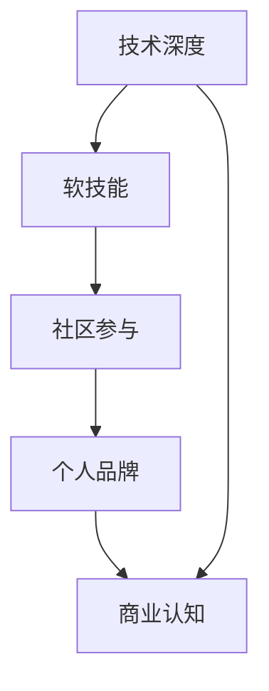

                 

## 1. 背景介绍

在信息爆炸的时代，如何成为一名有影响力的程序员，不仅要在技术上有深入的理解，还要在软技能和商业认知方面有所突破。构建个人影响力生态，意味着在社交媒体、技术社区、职业网络和个人品牌等多个层面建立起自己的影响力。本博客旨在为程序员提供一套全面的策略，帮助他们在职业发展中脱颖而出。

## 2. 核心概念与联系

### 2.1 核心概念概述

为了全面理解如何打造个人影响力生态，我们需要先明确一些核心概念及其相互联系：

- **技术深度**：指的是对某一技术领域掌握的深度，不仅包括语言的熟悉度，还涉及算法、架构设计的深刻理解。
- **软技能**：包括沟通、团队协作、领导力等非技术技能，是构建影响力生态的基础。
- **社区参与**：积极参与开源项目、技术社区，发表技术文章，参与线上线下技术交流活动。
- **个人品牌**：通过博客、社交媒体等渠道，分享个人见解、项目案例，树立专业形象。
- **商业认知**：理解市场动态、用户需求，将技术知识与业务结合，提升技术产品的商业价值。

这些概念之间相互关联，共同构成了个人影响力生态的核心。技术深度和软技能是个人影响力的基础，社区参与和商业认知则是扩展影响力的手段，而个人品牌则是综合能力的体现。

### 2.2 核心概念原理和架构的 Mermaid 流程图

这个流程图展示了技术深度、软技能、社区参与、个人品牌和商业认知之间相互促进的联系。技术深度和软技能是基础，社区参与和个人品牌是展示和拓展的方式，而商业认知则是在此基础上进行更高层次的思考和创新。

## 3. 核心算法原理 & 具体操作步骤

### 3.1 算法原理概述

构建个人影响力生态，可以通过以下步骤进行：

1. **技术深化**：持续学习新的技术，参与项目开发，提升技术深度。
2. **技能提升**：通过参加培训、阅读书籍，提升软技能。
3. **社区参与**：在GitHub、Stack Overflow等平台上活跃，建立技术声誉。
4. **个人品牌塑造**：通过博客、社交媒体分享技术见解，树立专业形象。
5. **商业认知**：深入了解市场需求，将技术知识与商业结合，提升技术产品的市场价值。

### 3.2 算法步骤详解

#### 步骤1: 技术深化

- **学习资源**：定期阅读技术书籍、参加线上线下培训、技术讲座。
- **项目实践**：参与开源项目，实现个人项目，提升实战经验。
- **技术博客**：撰写技术博客，分享学习心得和项目经验。

#### 步骤2: 技能提升

- **软技能培训**：参加沟通、领导力培训课程。
- **团队协作**：在项目团队中积极承担责任，积累团队协作经验。
- **反馈机制**：主动寻求和接受团队成员的反馈，不断改进。

#### 步骤3: 社区参与

- **开源贡献**：在GitHub等平台上，定期提交代码、修复bug。
- **技术交流**：在技术社区如Stack Overflow、Reddit上活跃，回答问题。
- **演讲分享**：参加线上线下技术交流会，分享个人经验和技术见解。

#### 步骤4: 个人品牌塑造

- **博客文章**：在个人博客或Medium上定期发布技术文章，分享个人见解。
- **社交媒体**：在LinkedIn、Twitter等平台上分享技术动态，提升影响力。
- **技术演讲**：参加技术沙龙、企业内训，进行技术演讲。

#### 步骤5: 商业认知

- **市场调研**：深入了解市场需求，关注行业动态。
- **用户体验**：在产品开发中注重用户体验，提升产品价值。
- **商业化项目**：参与商业化项目的开发，将技术知识转化为实际价值。

### 3.3 算法优缺点

#### 优点

- **持续进步**：通过持续学习和实践，不断提升技术深度和软技能。
- **广泛影响力**：通过社区参与和商业认知，可以扩大个人影响力，获得更多的职业机会。
- **综合素质提升**：在技术、软技能、商业认知等多方面全面发展。

#### 缺点

- **时间和精力投入较大**：需要持续投入时间和精力进行学习和实践。
- **竞争激烈**：在技术社区和商业领域，竞争非常激烈，需要不断提升自我。
- **需要自我管理**：需要有效的自我管理，确保每个步骤都能达到预期效果。

### 3.4 算法应用领域

个人影响力生态的构建，不仅适用于技术领域，还适用于其他领域，如教育、医疗、艺术等。在技术领域，个人影响力可以带来更多的职业机会，如技术职位、咨询、培训等。在非技术领域，可以通过影响力提升个人形象，建立更广泛的社会网络，推动个人事业发展。

## 4. 数学模型和公式 & 详细讲解

### 4.1 数学模型构建

个人影响力的提升，可以通过数学模型进行量化和分析。假设个人影响力 $I$ 与技术深度 $T$、软技能 $S$、社区参与 $C$、个人品牌 $B$ 和商业认知 $C$ 成正比关系，则有以下模型：

$$I = k(T, S, C, B, C)$$

其中 $k$ 为常数，表示模型系数。

### 4.2 公式推导过程

- **技术深度对影响力的影响**：技术深度决定了程序员解决复杂问题的能力，影响其在项目中的表现和影响力。
- **软技能对影响力的影响**：软技能决定了程序员在团队中的协作能力和领导力，影响其在职场中的表现和影响力。
- **社区参与对影响力的影响**：社区参与展示了程序员的技术能力和交流能力，影响其技术声誉和职业机会。
- **个人品牌对影响力的影响**：个人品牌展示了程序员的专业形象和影响力，影响其在行业内的认知度和可信度。
- **商业认知对影响力的影响**：商业认知决定了程序员将技术知识转化为商业价值的能力，影响其产品开发和市场推广的效果。

### 4.3 案例分析与讲解

#### 案例1: 开源贡献

一个程序员在GitHub上定期提交代码、修复bug，积极参与开源项目。通过这种方式，他不仅提升了技术深度，还积累了社区声誉。其他开发者和项目维护者会关注他的贡献，并在需要时寻求合作。随着时间的积累，他的影响力显著提升。

#### 案例2: 技术演讲

一个程序员定期参加技术沙龙、企业内训，进行技术演讲。通过这种方式，他不仅展示了个人技术深度和软技能，还提升了个人品牌。其他开发者和企业管理者会注意他的技术见解和领导能力，并在需要时邀请他参与项目。随着时间的积累，他的影响力进一步扩大。

#### 案例3: 商业化项目

一个程序员在了解市场需求和用户体验后，参与商业化项目的开发。通过这种方式，他将技术知识转化为实际价值，提升了产品竞争力。其他企业会寻求他的技术支持和合作，并在需要时提供职业机会。随着时间的积累，他的影响力达到新的高度。

## 5. 项目实践：代码实例和详细解释说明

### 5.1 开发环境搭建

为了进行个人影响力生态的构建，需要搭建一个适合的学习和实践环境。

1. **编程语言和框架**：选择一种主流的编程语言和框架，如Python、Java、JavaScript等。
2. **开发工具**：安装Git、VSCode、IntelliJ IDEA等开发工具，提升开发效率。
3. **云平台**：选择AWS、Google Cloud、阿里云等云平台，提供计算资源和存储服务。

### 5.2 源代码详细实现

#### 5.2.1 技术深化

- **学习资源管理**：使用Anaconda创建Python环境，安装必要的库和工具。
- **项目实践**：使用Git管理项目，定期提交代码和项目文档。
- **技术博客**：使用Medium或个人博客网站，定期发布技术文章。

#### 5.2.2 技能提升

- **软技能培训**：使用Coursera、edX等在线教育平台，参加软技能培训课程。
- **团队协作**：在项目管理工具如JIRA、Trello上协作，积累团队协作经验。
- **反馈机制**：使用Slack等即时通讯工具，主动寻求和接受团队成员的反馈。

#### 5.2.3 社区参与

- **开源贡献**：使用GitHub管理代码库，定期提交代码和修复bug。
- **技术交流**：在Stack Overflow、Reddit等平台上活跃，回答问题。
- **演讲分享**：使用Zoom、Microsoft Teams等平台，进行技术演讲和分享。

#### 5.2.4 个人品牌塑造

- **博客文章**：使用Medium、个人博客网站等平台，定期发布技术文章。
- **社交媒体**：在LinkedIn、Twitter等平台上分享技术动态，提升影响力。
- **技术演讲**：使用技术沙龙、企业内训等平台，进行技术演讲。

#### 5.2.5 商业认知

- **市场调研**：使用市场调研工具如SurveyMonkey，深入了解市场需求。
- **用户体验**：在产品开发中注重用户体验，提升产品竞争力。
- **商业化项目**：参与商业化项目的开发，将技术知识转化为实际价值。

### 5.3 代码解读与分析

在代码实现中，需要注意以下几点：

1. **版本控制**：使用Git进行版本控制，确保代码变更的历史清晰可追踪。
2. **自动化测试**：编写自动化测试用例，确保代码质量和稳定性。
3. **持续集成**：使用Jenkins等工具，实现代码的持续集成和部署。
4. **性能优化**：进行代码性能优化，提升应用响应速度和资源利用率。
5. **安全管理**：使用Docker等容器技术，实现代码的安全管理和部署。

### 5.4 运行结果展示

- **技术深度提升**：通过持续学习和实践，技术深度显著提升。
- **软技能提升**：通过培训和实践，软技能得到提升。
- **社区参与扩大**：通过开源贡献和技术交流，社区声誉提升。
- **个人品牌树立**：通过博客和社交媒体，个人品牌得到树立。
- **商业认知提升**：通过市场调研和项目实践，商业认知得到提升。

## 6. 实际应用场景

### 6.1 技术职位

一个程序员通过技术深化和技能提升，积累了丰富的技术经验。他通过社区参与和商业认知，在多个项目中表现出色，获得了公司的认可。最终，他获得了技术职位的晋升和加薪，实现了职业上的突破。

### 6.2 技术咨询

一个程序员通过个人品牌塑造和商业认知，在行业内建立了良好的声誉。他开始承接技术咨询项目，为其他公司提供技术解决方案，获得了丰厚的回报。

### 6.3 创业公司

一个程序员通过技术深化、软技能提升和社区参与，积累了丰富的经验和资源。他联合其他技术专家，创立了一家创业公司，推出了一款市场领先的产品，实现了商业上的成功。

### 6.4 未来应用展望

未来，随着技术的不断进步和市场需求的不断变化，个人影响力生态的构建将更加多样化和复杂化。程序员需要不断学习新技术，提升软技能，积极参与社区和商业活动，才能在竞争激烈的市场中保持领先地位。

## 7. 工具和资源推荐

### 7.1 学习资源推荐

为了提升技术深度和软技能，以下是一些推荐的资源：

1. **编程语言和框架**：官方文档、官方教程、在线课程。
2. **开发工具**：Git、VSCode、IntelliJ IDEA等。
3. **云平台**：AWS、Google Cloud、阿里云等。
4. **在线教育平台**：Coursera、edX、Udacity等。
5. **开源项目**：GitHub上的开源项目，积累实践经验。

### 7.2 开发工具推荐

以下是一些推荐的开发工具：

1. **版本控制**：Git、SVN等。
2. **项目管理**：JIRA、Trello等。
3. **自动化测试**：JUnit、Selenium等。
4. **持续集成**：Jenkins、GitLab CI等。
5. **性能优化**：Profiler、JVM调优工具等。

### 7.3 相关论文推荐

以下是一些推荐的论文和书籍：

1. **编程语言基础**：《深入理解计算机系统》、《编程珠玑》。
2. **算法与数据结构**：《算法导论》、《数据结构与算法分析》。
3. **软件开发实践**：《重构：改善既有代码的设计》、《人月神话》。
4. **软件架构**：《设计模式：可复用面向对象软件的基础》、《架构整洁》。
5. **项目管理**：《敏捷软件开发：原则、模式与实践》、《Scrum指南》。

## 8. 总结：未来发展趋势与挑战

### 8.1 研究成果总结

本文介绍了如何通过技术深化、技能提升、社区参与、个人品牌和商业认知等多个方面，构建个人影响力生态。通过持续学习和实践，程序员可以不断提升自己的竞争力，实现职业上的突破。

### 8.2 未来发展趋势

未来，个人影响力生态的构建将更加多样化和复杂化。随着技术的不断进步和市场需求的不断变化，程序员需要不断学习新技术，提升软技能，积极参与社区和商业活动，才能在竞争激烈的市场中保持领先地位。

### 8.3 面临的挑战

个人影响力生态的构建面临着时间和精力的投入较大、竞争激烈、需要自我管理等挑战。程序员需要有效的时间管理，确保每个步骤都能达到预期效果。

### 8.4 研究展望

未来，需要对个人影响力生态的理论模型进行深入研究，探讨其最优解和可行路径。同时，需要开发更加智能化的工具和平台，帮助程序员更高效地构建个人影响力生态。

## 9. 附录：常见问题与解答

**Q1: 如何平衡技术深度和软技能？**

A: 技术深度和软技能需要同时提升。可以通过参加培训、阅读书籍等方式提升软技能，同时通过项目实践、开源贡献等方式提升技术深度。两者的平衡需要通过不断的学习和实践，逐步实现。

**Q2: 如何提升社区参与的效率？**

A: 可以通过使用工具和平台，如GitHub、Stack Overflow等，提升社区参与的效率。定期提交代码、修复bug，积极回答问题，参与讨论和交流，可以迅速提升社区声誉。

**Q3: 如何塑造个人品牌？**

A: 可以通过博客、社交媒体等渠道，分享技术见解、项目案例，树立专业形象。保持持续更新和互动，吸引更多的关注和反馈。

**Q4: 如何提升商业认知？**

A: 可以通过市场调研、用户体验分析等方式，深入了解市场需求和用户行为。参与商业化项目的开发，将技术知识转化为实际价值，提升产品竞争力。

**Q5: 如何克服个人影响力构建中的挑战？**

A: 需要有效的时间管理，合理分配时间和精力，确保每个步骤都能达到预期效果。同时，需要不断学习和调整策略，适应市场和技术的变化。

---

作者：禅与计算机程序设计艺术 / Zen and the Art of Computer Programming

