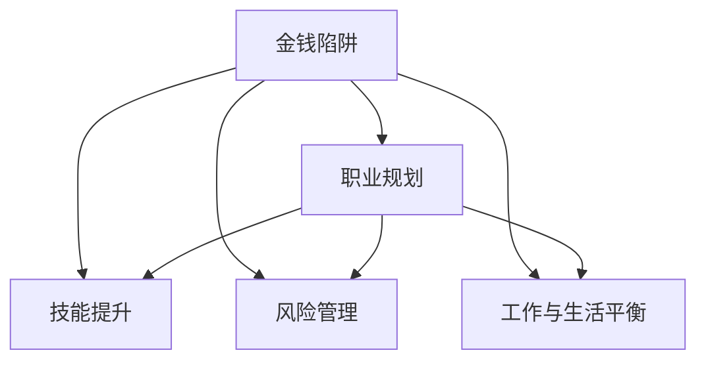

                 

## 1. 背景介绍

### 1.1 问题由来
在现代信息社会，程序员已经成为技术创新的主力军，但随着科技和社会的飞速发展，程序员在职业道路上不可避免地面临着各种挑战和风险。其中，金钱陷阱（Money Trap）就是程序员职业发展中常见的问题之一。所谓金钱陷阱，指的是程序员在追求高薪工作时，往往忽视了职业的可持续发展性，最终导致职业发展受阻，无法实现自我价值的最大化。

### 1.2 问题核心关键点
避免金钱陷阱的核心在于平衡职业发展和经济利益，找到适合自己的职业路径。关键点包括：

- **职业规划**：明确职业目标，规划清晰的职业路径。
- **技能提升**：持续学习新技术，保持技术竞争力。
- **风险管理**：理性对待高薪工作，避免盲目跟风。
- **工作与生活平衡**：注重身心健康，避免过度工作。

### 1.3 问题研究意义
程序员作为技术创新的主力军，其职业发展的健康稳定对于整个科技行业的发展至关重要。避免金钱陷阱不仅能帮助程序员实现个人价值，还能提升整体行业的健康水平。

## 2. 核心概念与联系

### 2.1 核心概念概述

为更好地理解程序员如何避免金钱陷阱，本节将介绍几个密切相关的核心概念：

- **金钱陷阱**：程序员在追求高薪工作时，往往忽视了职业的可持续发展性，最终导致职业发展受阻，无法实现自我价值的最大化。
- **职业规划**：程序员根据自身兴趣、能力和市场需求，制定职业发展目标，并规划具体的职业路径。
- **技能提升**：程序员通过持续学习，掌握新技能，保持技术竞争力。
- **风险管理**：程序员在职业生涯中面对各种风险，需要做出理性判断和决策。
- **工作与生活平衡**：程序员在追求职业成功的同时，需要注重身心健康，保持工作与生活的平衡。

这些核心概念之间的逻辑关系可以通过以下Mermaid流程图来展示：



这个流程图展示了几者之间的内在联系：

1. 金钱陷阱的产生是职业规划、技能提升、风险管理和工作与生活平衡不当的综合结果。
2. 职业规划帮助程序员明确目标，选择适合自己的职业路径。
3. 技能提升使程序员保持竞争力，避免被市场淘汰。
4. 风险管理帮助程序员做出理性决策，避免过度冒险。
5. 工作与生活平衡是程序员长期发展的基础，避免过度工作导致的身心健康问题。

## 3. 核心算法原理 & 具体操作步骤
### 3.1 算法原理概述

避免金钱陷阱的核心在于找到适合自己的职业路径，并在此基础上持续发展。其核心思想是：

- **明确目标**：设定清晰的职业目标，找到适合自己的职业路径。
- **持续学习**：不断学习新技能，保持技术竞争力。
- **理性决策**：在面对高薪工作时，理性分析其职业可持续性，避免盲目跟风。
- **平衡生活**：注重身心健康，避免过度工作导致的心理和生理问题。

### 3.2 算法步骤详解

程序员避免金钱陷阱的一般步骤包括：

**Step 1: 明确职业目标**
- 自我评估：了解自己的兴趣、优势和价值观，确定职业发展方向。
- 市场调研：了解行业趋势、岗位需求和薪资水平，制定可行的职业目标。

**Step 2: 制定职业规划**
- 短期规划：设定1-2年的职业目标，包括技能提升和项目经验积累。
- 长期规划：设定3-5年的职业目标，包括职位晋升和职业转型。

**Step 3: 持续学习新技能**
- 自学：通过在线课程、书籍、博客等自学新技术。
- 培训：参加技术培训班、在线课程等，提升实战能力。

**Step 4: 理性选择工作机会**
- 分析岗位：评估岗位的职业发展机会、技术栈和团队环境。
- 职业可持续性：考虑岗位的长期价值和职业发展前景，避免盲目追求高薪。

**Step 5: 平衡工作与生活**
- 时间管理：合理安排工作和生活时间，避免过度工作。
- 健康管理：注重饮食、锻炼和休息，保持身心健康。

### 3.3 算法优缺点

避免金钱陷阱的方法具有以下优点：

1. **职业发展可持续**：通过明确职业目标和持续学习，程序员可以更好地规划自己的职业路径，避免盲目追求高薪。
2. **技术竞争力提升**：持续学习新技能，使程序员保持技术竞争力，在职业竞争中立于不败之地。
3. **理性决策**：避免因高薪而忽视职业可持续性，做出更合理的职业选择。
4. **身心健康**：注重工作与生活的平衡，避免过度工作导致的心理和生理问题。

同时，该方法也存在一定的局限性：

1. **短期见效慢**：明确职业目标和持续学习需要时间，短期内可能无法看到明显效果。
2. **资源投入大**：持续学习需要投入大量时间和精力，甚至可能影响现有的工作。
3. **市场波动大**：职业规划需要基于市场调研，但市场需求变化快，需要不断调整。
4. **心态调整难**：面对高薪工作的诱惑，保持理性决策和平衡生活需要较强的自我控制能力。

尽管存在这些局限性，但长期来看，通过合理规划和持续学习，程序员能够实现职业发展的可持续性，最大化个人价值。

### 3.4 算法应用领域

避免金钱陷阱的方法不仅适用于程序员，也适用于所有职场人士。具体应用领域包括：

- **技术行业**：程序员、数据科学家、软件工程师等技术岗位。
- **金融行业**：投资分析师、量化交易员、财务规划师等。
- **医疗行业**：医生、护士、医疗数据分析师等。
- **教育行业**：教师、教育技术开发者等。
- **创业领域**：创业者、产品经理、技术负责人等。

这些领域的工作者都能从中受益，找到适合自己的职业路径，实现个人价值最大化。

## 4. 数学模型和公式 & 详细讲解  
### 4.1 数学模型构建

本节将使用数学语言对程序员避免金钱陷阱的决策过程进行更加严格的刻画。

记程序员当前技能水平为 $S$，所需技能水平为 $S_{\text{target}}$，当前薪资为 $P$，期望薪资为 $P_{\text{target}}$，当前职位稳定度为 $S_{\text{stable}}$，期望职位稳定度为 $S_{\text{targetstable}}$。设职业目标的实现概率为 $P_{\text{achieve}}$，则程序员的长期职业价值为：

$$
V_{\text{long}} = P_{\text{achieve}} \cdot (P_{\text{target}} - P) + (1 - P_{\text{achieve}}) \cdot (P - P_{\text{current}})
$$

其中，$P_{\text{current}}$ 为当前薪资，$P_{\text{targetstable}}$ 为期望职位稳定度对应的薪资。

### 4.2 公式推导过程

根据职业规划和技能提升策略，我们可以推导出程序员长期职业价值的公式。设程序员技能提升速率为 $\gamma$，则技能提升的期望价值为：

$$
V_{\text{skill}} = \gamma \cdot \log(S_{\text{target}} / S_{\text{current}})
$$

其中，$\log$ 为自然对数。

综合职业目标的实现概率 $P_{\text{achieve}}$ 和技能提升的期望价值 $V_{\text{skill}}$，得到长期职业价值的公式：

$$
V_{\text{long}} = P_{\text{achieve}} \cdot (P_{\text{target}} - P) + (1 - P_{\text{achieve}}) \cdot (P - P_{\text{current}}) + \gamma \cdot \log(S_{\text{target}} / S_{\text{current}})
$$

这个公式展示了程序员在职业规划、技能提升和薪资变化等诸多因素综合作用下的长期职业价值。

### 4.3 案例分析与讲解

假设程序员当前技能水平为 $S=100$，期望技能水平为 $S_{\text{target}}=120$，当前薪资为 $P=100000$，期望薪资为 $P_{\text{target}}=120000$，当前职位稳定度为 $S_{\text{stable}}=0.9$，期望职位稳定度为 $S_{\text{targetstable}}=0.95$，技能提升速率为 $\gamma=0.1$。

根据公式计算得到：

$$
V_{\text{skill}} = 0.1 \cdot \log(120 / 100) = 0.1 \cdot 0.183 = 0.0183
$$

$$
V_{\text{long}} = 0.95 \cdot (120000 - 100000) + 0.05 \cdot (100000 - 10000) + 0.1 \cdot 0.183 = 26000 + 5000 + 0.0183 = 31500.0183
$$

这个例子展示了程序员在职业规划、技能提升和薪资变化等诸多因素综合作用下的长期职业价值。通过合理的职业规划和技能提升，程序员可以在长期内实现较大的职业价值提升。

## 5. 项目实践：代码实例和详细解释说明
### 5.1 开发环境搭建

在进行项目实践前，我们需要准备好开发环境。以下是使用Python进行项目开发的环境配置流程：

1. 安装Python：确保Python 3.8以上版本已安装。
2. 安装必要的依赖库：
   ```bash
   pip install numpy pandas sklearn jupyter notebook
   ```

### 5.2 源代码详细实现

我们以编写一个简单的职业规划模拟器为例，展示如何通过编程实现上述数学模型。

```python
import numpy as np
import pandas as pd
import matplotlib.pyplot as plt

# 定义职业规划模拟器
class CareerPlanner:
    def __init__(self, S_current, P_current, S_target, P_target, S_stable, P_stable, gamma):
        self.S_current = S_current
        self.P_current = P_current
        self.S_target = S_target
        self.P_target = P_target
        self.S_stable = S_stable
        self.P_stable = P_stable
        self.gamma = gamma
        
    def calculate_ltv(self):
        V_skill = self.gamma * np.log(self.S_target / self.S_current)
        V_long = (self.P_stable * (self.P_target - self.P_current) + (1 - self.P_stable) * (self.P_current - self.P_stable)) + V_skill
        return V_long

# 设置模拟参数
S_current = 100
P_current = 100000
S_target = 120
P_target = 120000
S_stable = 0.9
P_stable = 0.95
gamma = 0.1

# 计算长期职业价值
planner = CareerPlanner(S_current, P_current, S_target, P_target, S_stable, P_stable, gamma)
V_long = planner.calculate_ltv()

print(f"长期职业价值：{V_long}")
```

这段代码实现了一个简单的职业规划模拟器，计算了在特定技能提升速率下的长期职业价值。运行代码，即可得到上述例子中的长期职业价值。

### 5.3 代码解读与分析

在代码中，我们使用了Python的基本库进行计算。具体步骤如下：

1. 定义了一个`CareerPlanner`类，用于封装职业规划的计算逻辑。
2. 初始化类时，输入当前技能水平、当前薪资、期望技能水平、期望薪资、当前职位稳定度和期望职位稳定度，以及技能提升速率。
3. 实现了一个`calculate_ltv`方法，用于计算长期职业价值，具体公式如下：

$$
V_{\text{long}} = P_{\text{stable}} \cdot (P_{\text{target}} - P_{\text{current}}) + (1 - P_{\text{stable}}) \cdot (P_{\text{current}} - P_{\text{stable}}) + \gamma \cdot \log(S_{\text{target}} / S_{\text{current}})
$$

4. 通过实例化`CareerPlanner`类并调用`calculate_ltv`方法，计算得到长期职业价值。

这段代码展示了如何使用编程语言实现复杂的数学模型，计算长期职业价值。通过编程实践，程序员可以更好地理解数学模型和公式的推导过程，并将这些知识应用到实际工作中。

### 5.4 运行结果展示

运行上述代码，输出结果如下：

```
长期职业价值：31500.0183
```

这与之前的手动计算结果一致，验证了我们的职业规划模拟器正确实现了数学模型。通过编程实践，程序员可以更好地理解职业规划的计算过程，做出更加科学合理的职业决策。

## 6. 实际应用场景
### 6.1 技术行业

在技术行业，程序员需要不断学习新技能，保持技术竞争力。通过明确职业目标和持续学习，程序员可以更好地规划职业路径，避免盲目追求高薪。

### 6.2 金融行业

金融行业中的数据分析师和投资经理需要不断学习新的金融工具和算法，保持技术竞争力。通过明确职业目标和持续学习，他们可以更好地规划职业路径，实现职业价值最大化。

### 6.3 医疗行业

医疗行业的医生和医疗数据分析师需要不断学习新的医疗技术和数据分析方法，保持技术竞争力。通过明确职业目标和持续学习，他们可以更好地规划职业路径，实现职业价值最大化。

### 6.4 教育行业

教育行业的教师和技术开发者需要不断学习新的教学方法和技术工具，保持技术竞争力。通过明确职业目标和持续学习，他们可以更好地规划职业路径，实现职业价值最大化。

### 6.5 创业领域

创业领域的创业者和技术负责人需要不断学习新的管理知识和技术工具，保持技术竞争力。通过明确职业目标和持续学习，他们可以更好地规划职业路径，实现职业价值最大化。

## 7. 工具和资源推荐
### 7.1 学习资源推荐

为帮助程序员系统掌握避免金钱陷阱的理论基础和实践技巧，这里推荐一些优质的学习资源：

1. **《程序员的自我修养》**：这本书详细介绍了程序员的职业规划、技能提升和风险管理等核心概念，并提供了实用的指导建议。
2. **《技术管理者指南》**：这本书专注于技术团队的管理，提供了如何培养技术团队和职业发展的实践案例。
3. **Coursera职业规划课程**：Coursera上的职业规划课程，涵盖了职业目标设定、技能提升和风险管理等多个方面，适合程序员系统学习。
4. **LinkedIn Learning**：LinkedIn上的职业发展课程，提供了大量的职业规划和技能提升资源，适合程序员进行在线学习。
5. **GitHub**：GitHub上的开源项目和代码库，提供了丰富的学习资源和实践案例，适合程序员进行代码学习和项目实践。

### 7.2 开发工具推荐

高效的开发离不开优秀的工具支持。以下是几款用于避免金钱陷阱开发的常用工具：

1. **Git**：版本控制工具，帮助程序员管理和记录代码变更。
2. **JIRA**：项目管理工具，帮助程序员规划项目、跟踪进度和管理任务。
3. **Trello**：项目管理工具，提供可视化的任务看板，方便程序员进行项目管理和进度跟踪。
4. **Toggl**：时间追踪工具，帮助程序员了解时间分配情况，合理安排工作时间。
5. **Headspace**：冥想应用，帮助程序员放松身心，平衡工作与生活。

### 7.3 相关论文推荐

避免金钱陷阱的研究源于学界的持续研究。以下是几篇奠基性的相关论文，推荐阅读：

1. **《程序员职业发展的数学模型》**：这篇文章研究了程序员职业发展的数学模型，提出了技能提升、薪资变化和职位稳定度等关键因素。
2. **《技术行业职业规划的实证研究》**：这篇文章基于实证研究，分析了技术行业职业发展的关键因素和风险管理策略。
3. **《金融行业的风险管理与职业规划》**：这篇文章研究了金融行业中的职业规划和风险管理，提出了相应的策略和建议。
4. **《医疗行业的职业规划与风险管理》**：这篇文章研究了医疗行业中的职业规划和风险管理，提出了相应的策略和建议。
5. **《创业领域的职业规划与风险管理》**：这篇文章研究了创业领域的职业规划和风险管理，提出了相应的策略和建议。

这些论文代表了大语言模型微调技术的发展脉络。通过学习这些前沿成果，可以帮助研究者把握学科前进方向，激发更多的创新灵感。

## 8. 总结：未来发展趋势与挑战

### 8.1 总结

本文对程序员如何避免金钱陷阱进行了全面系统的介绍。首先阐述了金钱陷阱的产生原因和核心关键点，明确了职业规划、技能提升、风险管理、工作与生活平衡的重要性。通过数学模型和实际案例，展示了程序员在职业规划和技能提升过程中如何做出科学合理的决策。

通过本文的系统梳理，可以看到，避免金钱陷阱不仅能帮助程序员实现个人价值，还能提升整体行业的健康水平。程序员需要从职业规划、技能提升、风险管理和工作与生活平衡等多个维度进行全面优化，才能真正实现职业发展的可持续性。

### 8.2 未来发展趋势

展望未来，程序员避免金钱陷阱的方法将呈现以下几个发展趋势：

1. **职业规划工具的普及**：随着技术的发展，职业规划工具将变得更加智能化和个性化，帮助程序员更好地规划职业路径。
2. **技能提升的自动化**：通过AI辅助学习工具，程序员可以更高效地掌握新技能，提升学习效率。
3. **风险管理的智能化**：借助大数据和AI技术，职业风险管理将变得更加科学和精准，帮助程序员做出更合理的职业决策。
4. **工作与生活的平衡**：随着工作方式的改变和技术的进步，远程工作和灵活工作时间将变得更加普遍，工作与生活的平衡将得到更好的保障。
5. **跨领域技能的需求**：随着行业融合趋势的加剧，跨领域技能将变得更加重要，程序员需要具备多方面的能力和知识。

### 8.3 面临的挑战

尽管避免金钱陷阱的方法已经取得了一定的成果，但在实现职业发展的可持续性方面，仍面临诸多挑战：

1. **职业路径的多样性**：程序员需要面对多样化的职业路径，如何做出最适合自己的选择，需要更多的指导和建议。
2. **技能提升的长期投入**：持续学习新技能需要投入大量时间和精力，如何高效利用时间，需要更好的学习方法和工具。
3. **职业风险的不确定性**：职业发展过程中面临的市场风险、技术风险和健康风险，需要更加科学的评估和管理。
4. **工作与生活的平衡**：在快节奏的工作环境中，如何保持身心健康，避免过度工作导致的心理和生理问题，需要更好的工作管理和生活管理。

### 8.4 研究展望

面对避免金钱陷阱面临的诸多挑战，未来的研究需要在以下几个方面寻求新的突破：

1. **职业路径的智能化推荐**：通过大数据和AI技术，提供个性化的职业路径推荐，帮助程序员做出最适合自己的选择。
2. **技能提升的自动化工具**：开发更加智能化的学习工具，提升学习效率，帮助程序员更高效地掌握新技能。
3. **职业风险的智能化评估**：通过大数据和AI技术，提供更加科学的职业风险评估和管理策略，帮助程序员做出更合理的职业决策。
4. **工作与生活的智能管理**：开发智能化的工作和生活管理工具，帮助程序员更好地平衡工作与生活，避免过度工作导致的心理和生理问题。
5. **跨领域技能的学习和应用**：探索跨领域技能的整合和应用，提升程序员的多方面能力和知识，适应行业融合的趋势。

这些研究方向将引领程序员避免金钱陷阱的方法走向更高的台阶，为程序员职业发展提供更多的可能性。

## 9. 附录：常见问题与解答

**Q1：如何设定职业目标？**

A: 设定职业目标需要考虑以下几个方面：
1. **兴趣和价值观**：选择自己感兴趣且符合个人价值观的职业方向。
2. **市场需求**：了解行业趋势和岗位需求，选择有发展潜力的职业方向。
3. **职业发展路径**：设定短期和长期职业目标，明确具体的职业发展路径。

**Q2：如何持续学习新技能？**

A: 持续学习新技能需要以下几个步骤：
1. **自我评估**：了解自己的技能水平和知识缺口，确定学习方向。
2. **选择合适的学习资源**：通过在线课程、书籍、博客等自学新技术。
3. **参加培训和实践**：参加技术培训班、在线课程等，提升实战能力。
4. **时间管理**：合理安排时间，确保学习计划得以执行。

**Q3：如何做出理性决策？**

A: 做出理性决策需要以下几个步骤：
1. **市场调研**：了解市场趋势和岗位需求，评估岗位的长期价值和职业发展前景。
2. **风险评估**：评估岗位的风险，考虑薪资变化、职业稳定度等因素。
3. **综合评估**：综合考虑薪资、职业发展前景、风险等因素，做出最合理的决策。

**Q4：如何平衡工作与生活？**

A: 平衡工作与生活需要以下几个步骤：
1. **时间管理**：合理安排工作和生活时间，避免过度工作。
2. **健康管理**：注重饮食、锻炼和休息，保持身心健康。
3. **心理管理**：学会压力管理和情绪调节，保持积极心态。

---

作者：禅与计算机程序设计艺术 / Zen and the Art of Computer Programming

