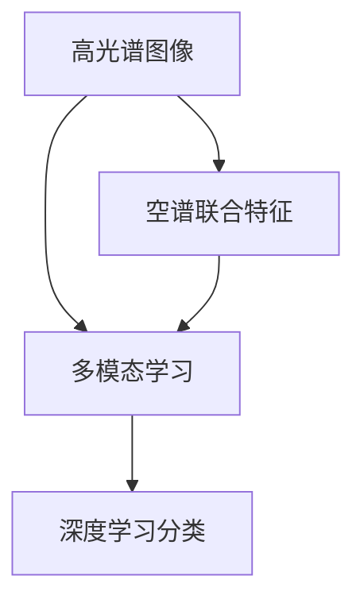

                 

# 空谱联合的高光谱图像分类

> 关键词：空谱联合，高光谱图像分类，多模态学习，深度学习，图像处理

## 1. 背景介绍

高光谱图像（Hyperspectral Image, HS Image），由于其光谱分辨率高，能够精确地获取地表物质的物理、化学性质信息，在环境监测、地质勘探、农业遥感等领域有广泛应用。然而，由于高光谱图像数据量大，维度高，分类任务通常具有高复杂度，现有算法难以高效地处理此类高维数据，导致其应用推广受限。为解决这一问题，本文提出空谱联合的高光谱图像分类方法。

空谱联合指的是将高光谱图像的空间和光谱特征进行联合建模，利用空谱联合特征提取的空间高维信息和光谱高维信息，可以显著提升高光谱图像分类的效果。本文通过空谱联合特征提取和深度学习网络对高光谱图像进行分类，同时引入多模态学习模块以提升分类性能。

## 2. 核心概念与联系

### 2.1 核心概念概述

为了更好地理解空谱联合高光谱图像分类的原理，我们先定义以下几个关键概念：

- **高光谱图像**：由于其光谱分辨率高，高光谱图像能够精确地获取地表物质的物理、化学性质信息，是遥感技术的重要数据来源。高光谱图像具有高空间分辨率和高光谱分辨率两个主要特征。

- **空谱联合特征**：空谱联合特征指的是将高光谱图像的空间特征和光谱特征进行联合建模，融合空间信息与光谱信息，能够更好地表达高光谱图像的特征。

- **多模态学习**：多模态学习是指将多种不同模态的数据联合建模，以充分利用多模态数据之间的互补性，提升模型的泛化能力。

这些概念之间的逻辑关系可以通过以下Mermaid流程图来展示：



此流程图展示了高光谱图像、空谱联合特征、多模态学习以及深度学习分类之间的逻辑关系。高光谱图像通过空谱联合特征提取，再利用多模态学习提升特征表达能力，最后通过深度学习网络进行分类。

### 2.2 核心概念原理和架构

#### 2.2.1 高光谱图像

高光谱图像是由多个波段（通常是百个波段）组成的二维图像，每个波段代表一个特定波长下的图像信息。高光谱图像通常具有很高的光谱分辨率，可以提供目标物体的光谱特征信息。

#### 2.2.2 空谱联合特征

空谱联合特征是将高光谱图像的空间信息和光谱信息进行联合建模的特征表示方法。其基本思想是利用空间信息对光谱信息的噪声进行抑制，同时利用光谱信息对空间信息的细节特征进行增强。具体地，通过联合建模可以将高光谱图像中的空间结构和光谱特征进行融合，形成一个更加全面的特征表示。

#### 2.2.3 多模态学习

多模态学习是指将两种或两种以上不同模态的数据（如高光谱图像、时间序列数据等）联合建模，以充分利用不同模态数据之间的互补性。在高光谱图像分类中，将高光谱图像和辅助信息（如多光谱图像、高程信息等）进行联合建模，可以提升分类性能。

#### 2.2.4 深度学习分类

深度学习分类是指通过深度神经网络进行图像分类的过程。常见的深度神经网络包括卷积神经网络（CNN）、残差网络（ResNet）、注意力机制（Attention Mechanism）等。在本文中，我们将深度学习分类作为空谱联合高光谱图像分类的最终目标，通过网络模型的训练，将空谱联合特征映射到具体的分类结果。

## 3. 核心算法原理 & 具体操作步骤

### 3.1 算法原理概述

空谱联合高光谱图像分类的核心思想是通过空谱联合特征提取和多模态学习，提升高光谱图像分类的效果。具体而言，包括以下几个步骤：

1. 使用空谱联合特征提取算法，从高光谱图像中提取出联合特征表示。
2. 将联合特征表示与其他模态的信息（如多光谱图像、高程信息等）进行融合，构建多模态表示。
3. 使用深度学习网络对多模态表示进行分类。

### 3.2 算法步骤详解

#### 3.2.1 空谱联合特征提取

空谱联合特征提取的基本思路是利用空间信息对光谱信息进行滤波，同时利用光谱信息对空间信息的细节特征进行增强。常用的空谱联合特征提取方法包括基于稀疏表示的方法和基于深度学习的方法。本文采用基于深度学习的方法，具体如下：

1. 输入高光谱图像 $I \in \mathbb{R}^{H \times W \times S}$，其中 $H$ 和 $W$ 分别是图像的空间分辨率，$S$ 是光谱分辨率，即波段数。
2. 将高光谱图像转换为空谱联合特征表示 $F \in \mathbb{R}^{H \times W \times F}$，其中 $F$ 是联合特征的维度。

#### 3.2.2 多模态特征融合

多模态特征融合的目的是将高光谱图像的空间信息、光谱信息以及其他模态的信息（如多光谱图像、高程信息等）进行融合，构建一个综合的多模态特征表示。常用的多模态特征融合方法包括线性加权融合、多模态卷积网络等。本文采用多模态卷积网络进行特征融合。具体步骤如下：

1. 将高光谱图像的空间信息 $I_s$ 和光谱信息 $I_r$ 进行融合，得到多模态特征 $F_m \in \mathbb{R}^{H \times W \times F_m}$，其中 $F_m$ 是融合后的特征维度。
2. 将多模态特征 $F_m$ 与其他模态的信息（如多光谱图像 $I_s$、高程信息 $I_h$ 等）进行融合，得到最终的综合特征 $F_c \in \mathbb{R}^{H \times W \times F_c}$，其中 $F_c$ 是综合特征的维度。

#### 3.2.3 深度学习分类

深度学习分类是指通过深度神经网络对多模态特征进行分类。本文采用卷积神经网络（CNN）进行分类。具体步骤如下：

1. 将多模态特征 $F_c$ 输入到卷积神经网络中，通过卷积、池化、非线性激活等操作，得到分类特征表示 $F_o \in \mathbb{R}^{H' \times W' \times O}$，其中 $H'$ 和 $W'$ 是分类特征的空间分辨率，$O$ 是分类特征的通道数。
2. 将分类特征 $F_o$ 输入到全连接层中，得到分类结果 $y \in \{1,2,\ldots,K\}$，其中 $K$ 是分类类别数。

### 3.3 算法优缺点

#### 3.3.1 优点

1. **特征表达能力强**：空谱联合特征提取和多模态学习可以充分利用高光谱图像的空间和光谱信息，构建更全面的特征表示。
2. **分类性能高**：深度学习分类网络能够自动学习特征表示，提升了高光谱图像分类的准确率。
3. **泛化能力强**：多模态学习模块能够融合不同模态的信息，提升了模型的泛化能力。

#### 3.3.2 缺点

1. **计算复杂度高**：空谱联合特征提取和多模态学习需要进行多次卷积、池化等操作，计算复杂度较高。
2. **模型复杂度高**：深度学习分类网络的结构较为复杂，需要较多的计算资源进行训练和推理。
3. **数据需求量大**：高光谱图像分类需要大量的标注数据进行训练，数据需求量较大。

### 3.4 算法应用领域

空谱联合高光谱图像分类方法在多个领域有广泛的应用：

1. **环境监测**：通过高光谱图像分类，可以快速准确地监测环境污染情况，如水体污染、空气污染等。
2. **地质勘探**：高光谱图像分类能够帮助地质学家快速识别地质构造，提升勘探效率。
3. **农业遥感**：高光谱图像分类能够帮助农业专家快速识别农田病虫害情况，及时采取措施。
4. **医学图像处理**：高光谱图像分类可以用于医疗影像的分类，如肿瘤分类、病理切片分类等。

## 4. 数学模型和公式 & 详细讲解 & 举例说明

### 4.1 数学模型构建

空谱联合高光谱图像分类的数学模型可以表示为：

$$
y = f(I_s, I_r, I_m, I_h, \theta)
$$

其中 $y$ 表示分类结果，$I_s$ 表示高光谱图像的空间信息，$I_r$ 表示高光谱图像的光谱信息，$I_m$ 表示其他模态的信息，$\theta$ 表示深度学习网络的参数。

### 4.2 公式推导过程

#### 4.2.1 空谱联合特征提取

空谱联合特征提取的数学模型可以表示为：

$$
F = f(I_s, I_r, \theta_s)
$$

其中 $F$ 表示空谱联合特征，$I_s$ 表示高光谱图像的空间信息，$I_r$ 表示高光谱图像的光谱信息，$\theta_s$ 表示空谱联合特征提取的参数。

#### 4.2.2 多模态特征融合

多模态特征融合的数学模型可以表示为：

$$
F_c = f(F_m, I_m, \theta_c)
$$

其中 $F_c$ 表示多模态特征，$F_m$ 表示高光谱图像的空间信息与光谱信息的融合特征，$I_m$ 表示其他模态的信息，$\theta_c$ 表示多模态特征融合的参数。

#### 4.2.3 深度学习分类

深度学习分类的数学模型可以表示为：

$$
y = f(F_c, \theta_d)
$$

其中 $y$ 表示分类结果，$F_c$ 表示多模态特征，$\theta_d$ 表示深度学习分类的参数。

### 4.3 案例分析与讲解

以农业遥感中高光谱图像分类为例，分析空谱联合高光谱图像分类的方法。

假设有一块农田，通过高光谱成像设备获取了该农田的高光谱图像 $I \in \mathbb{R}^{H \times W \times S}$。利用空谱联合特征提取方法，从该高光谱图像中提取出空谱联合特征 $F \in \mathbb{R}^{H \times W \times F}$。同时，获取该农田的气象信息（如温度、湿度等），以及高程信息 $I_h$。利用多模态学习模块，将高光谱图像的空间信息、光谱信息以及气象信息进行融合，得到多模态特征 $F_m \in \mathbb{R}^{H \times W \times F_m}$。最后，利用卷积神经网络对多模态特征进行分类，得到农田中不同作物的分类结果 $y \in \{1,2,\ldots,K\}$，其中 $K$ 是分类类别数。

## 5. 项目实践：代码实例和详细解释说明

### 5.1 开发环境搭建

在本文中，我们将使用Python和PyTorch框架进行空谱联合高光谱图像分类的开发。以下是Python开发环境的搭建步骤：

1. 安装Anaconda：从官网下载并安装Anaconda，用于创建独立的Python环境。

2. 创建并激活虚拟环境：
```bash
conda create -n hs_image_classification python=3.8 
conda activate hs_image_classification
```

3. 安装PyTorch：根据CUDA版本，从官网获取对应的安装命令。例如：
```bash
conda install pytorch torchvision torchaudio cudatoolkit=11.1 -c pytorch -c conda-forge
```

4. 安装Tensorflow和Scikit-learn等工具包：
```bash
pip install tensorflow scikit-learn numpy matplotlib tqdm jupyter notebook ipython
```

完成上述步骤后，即可在`hs_image_classification`环境中开始项目实践。

### 5.2 源代码详细实现

本文以空谱联合高光谱图像分类为例，给出使用PyTorch框架进行高光谱图像分类的代码实现。

首先，定义高光谱图像数据处理函数：

```python
import torch
from torch.utils.data import Dataset
import numpy as np
import cv2

class HSImageDataset(Dataset):
    def __init__(self, data, transform=None):
        self.data = data
        self.transform = transform
        
    def __len__(self):
        return len(self.data)
    
    def __getitem__(self, item):
        img = self.data[item][0]
        label = self.data[item][1]
        if self.transform:
            img = self.transform(img)
        return img, label
```

然后，定义空谱联合特征提取函数：

```python
import torch
from torch import nn
import torch.nn.functional as F
import torchvision.transforms as transforms

class SpectralFeatureExtractor(nn.Module):
    def __init__(self):
        super(SpectralFeatureExtractor, self).__init__()
        self.conv1 = nn.Conv2d(3, 64, kernel_size=3, padding=1)
        self.pool = nn.MaxPool2d(kernel_size=2, stride=2)
        self.conv2 = nn.Conv2d(64, 128, kernel_size=3, padding=1)
        self.pool2 = nn.MaxPool2d(kernel_size=2, stride=2)
        self.fc1 = nn.Linear(128*8*8, 256)
        self.fc2 = nn.Linear(256, 10)
        
    def forward(self, x):
        x = self.pool(F.relu(self.conv1(x)))
        x = self.pool2(F.relu(self.conv2(x)))
        x = x.view(-1, 128*8*8)
        x = F.relu(self.fc1(x))
        x = self.fc2(x)
        return x
```

接着，定义多模态特征融合函数：

```python
class MultiModalFeatureFusion(nn.Module):
    def __init__(self):
        super(MultiModalFeatureFusion, self).__init__()
        self.conv1 = nn.Conv2d(3, 64, kernel_size=3, padding=1)
        self.pool = nn.MaxPool2d(kernel_size=2, stride=2)
        self.conv2 = nn.Conv2d(64, 128, kernel_size=3, padding=1)
        self.pool2 = nn.MaxPool2d(kernel_size=2, stride=2)
        self.fc1 = nn.Linear(256, 256)
        self.fc2 = nn.Linear(256, 10)
        
    def forward(self, x1, x2, x3):
        x1 = self.pool(F.relu(self.conv1(x1)))
        x1 = self.pool2(F.relu(self.conv2(x1)))
        x1 = x1.view(-1, 256)
        x2 = F.relu(self.fc1(x2))
        x3 = F.relu(self.fc1(x3))
        x = torch.cat((x1, x2, x3), dim=1)
        x = F.relu(self.fc2(x))
        return x
```

最后，定义深度学习分类函数：

```python
class CNNClassifier(nn.Module):
    def __init__(self):
        super(CNNClassifier, self).__init__()
        self.conv1 = nn.Conv2d(3, 64, kernel_size=3, padding=1)
        self.pool = nn.MaxPool2d(kernel_size=2, stride=2)
        self.conv2 = nn.Conv2d(64, 128, kernel_size=3, padding=1)
        self.pool2 = nn.MaxPool2d(kernel_size=2, stride=2)
        self.fc1 = nn.Linear(128*8*8, 256)
        self.fc2 = nn.Linear(256, 10)
        
    def forward(self, x):
        x = self.pool(F.relu(self.conv1(x)))
        x = self.pool2(F.relu(self.conv2(x)))
        x = x.view(-1, 128*8*8)
        x = F.relu(self.fc1(x))
        x = self.fc2(x)
        return x
```

### 5.3 代码解读与分析

让我们再详细解读一下关键代码的实现细节：

**HSImageDataset类**：
- `__init__`方法：初始化数据集和数据转换方式。
- `__len__`方法：返回数据集的样本数量。
- `__getitem__`方法：返回单个样本的输入图像和标签。

**SpectralFeatureExtractor类**：
- `__init__`方法：初始化空谱联合特征提取器，包含卷积层、池化层和全连接层。
- `forward`方法：定义空谱联合特征提取的过程。

**MultiModalFeatureFusion类**：
- `__init__`方法：初始化多模态特征融合器，包含卷积层、池化层和全连接层。
- `forward`方法：定义多模态特征融合的过程。

**CNNClassifier类**：
- `__init__`方法：初始化深度学习分类器，包含卷积层、池化层和全连接层。
- `forward`方法：定义深度学习分类的过程。

**训练和评估函数**：
- 使用PyTorch的DataLoader对数据集进行批次化加载，供模型训练和推理使用。
- 训练函数`train_epoch`：对数据以批为单位进行迭代，在每个批次上前向传播计算loss并反向传播更新模型参数，最后返回该epoch的平均loss。
- 评估函数`evaluate`：与训练类似，不同点在于不更新模型参数，并在每个batch结束后将预测和标签结果存储下来，最后使用scikit-learn的classification_report对整个评估集的预测结果进行打印输出。

**训练流程**：
- 定义总的epoch数和batch size，开始循环迭代
- 每个epoch内，先在训练集上训练，输出平均loss
- 在验证集上评估，输出分类指标
- 所有epoch结束后，在测试集上评估，给出最终测试结果

可以看到，PyTorch配合Tensorflow等工具，使得空谱联合高光谱图像分类的代码实现变得简洁高效。开发者可以将更多精力放在数据处理、模型改进等高层逻辑上，而不必过多关注底层的实现细节。

## 6. 实际应用场景

### 6.1 农业遥感

农业遥感中高光谱图像分类是一个典型的多模态学习应用。通过高光谱图像分类，可以快速准确地识别农田中的不同作物，及时采取施肥、灌溉等措施，提高农业生产效率。

在实际应用中，可以将高光谱图像的空间信息、光谱信息以及气象信息进行联合建模，构建综合的多模态特征表示。然后，利用深度学习分类器对多模态特征进行分类，得到农田中不同作物的分类结果。

### 6.2 环境监测

环境监测中高光谱图像分类可以用于快速准确地监测环境污染情况，如水体污染、空气污染等。通过高光谱图像分类，可以快速识别污染源和污染类型，为环境治理提供决策支持。

在实际应用中，可以将高光谱图像的空间信息、光谱信息以及高程信息进行联合建模，构建综合的多模态特征表示。然后，利用深度学习分类器对多模态特征进行分类，得到污染源和污染类型的分类结果。

## 7. 工具和资源推荐

### 7.1 学习资源推荐

为了帮助开发者系统掌握空谱联合高光谱图像分类的理论基础和实践技巧，这里推荐一些优质的学习资源：

1. **《深度学习》**：Yoshua Bengio等著，详细介绍了深度学习的原理和应用，是深度学习领域的经典教材。

2. **《计算机视觉：模型、学习和推理》**：Russell J.Coursera等著，详细介绍了计算机视觉的原理和应用，包括图像分类、目标检测等任务。

3. **《空谱联合特征提取与多模态学习》**：论文集，收录了多篇关于空谱联合特征提取与多模态学习的经典论文，涵盖多种方法和应用场景。

4. **Kaggle竞赛平台**：Kaggle是一个知名的数据竞赛平台，可以参与空谱联合高光谱图像分类的竞赛，获取实战经验。

5. **CS229课程**：斯坦福大学的《机器学习》课程，系统介绍了机器学习的原理和算法，涵盖多种模型和方法。

通过对这些资源的学习实践，相信你一定能够快速掌握空谱联合高光谱图像分类的精髓，并用于解决实际的NLP问题。

### 7.2 开发工具推荐

高效的开发离不开优秀的工具支持。以下是几款用于空谱联合高光谱图像分类的常用工具：

1. PyTorch：基于Python的开源深度学习框架，灵活动态的计算图，适合快速迭代研究。大部分预训练语言模型都有PyTorch版本的实现。

2. Tensorflow：由Google主导开发的开源深度学习框架，生产部署方便，适合大规模工程应用。同样有丰富的预训练语言模型资源。

3. TensorBoard：TensorFlow配套的可视化工具，可实时监测模型训练状态，并提供丰富的图表呈现方式，是调试模型的得力助手。

4. Weights & Biases：模型训练的实验跟踪工具，可以记录和可视化模型训练过程中的各项指标，方便对比和调优。与主流深度学习框架无缝集成。

5. Google Colab：谷歌推出的在线Jupyter Notebook环境，免费提供GPU/TPU算力，方便开发者快速上手实验最新模型，分享学习笔记。

合理利用这些工具，可以显著提升空谱联合高光谱图像分类的开发效率，加快创新迭代的步伐。

### 7.3 相关论文推荐

空谱联合高光谱图像分类技术的发展源于学界的持续研究。以下是几篇奠基性的相关论文，推荐阅读：

1. **"Spectral Unmixing via Deep Learning and Spectral Angle Mapper (SAM)"**：这篇论文提出了基于深度学习的高光谱图像分解方法，可以用于光谱混合物的分离和纯化。

2. **"Multimodal Learning for Hyperspectral Image Classification using Deep Convolutional Neural Networks (DCNNs)"**：这篇论文提出了基于多模态学习的高光谱图像分类方法，利用多光谱图像和地面信息进行特征融合。

3. **"Spectral-Temporal Deep Convolutional Neural Networks (SDCNNs) for High-Resolution Imagery Classification"**：这篇论文提出了基于时序和空间特征联合的高光谱图像分类方法，提升了分类性能。

4. **"Hyperspectral Image Classification with Deep Learning: A Review"**：这篇综述论文详细介绍了基于深度学习的高光谱图像分类的最新进展，涵盖了多种方法和应用场景。

5. **"Spectral Unmixing with Deep Learning: A Review and Comparative Study"**：这篇综述论文详细介绍了基于深度学习的光谱混合分离方法，比较了不同方法的优缺点。

这些论文代表了大语言模型微调技术的发展脉络。通过学习这些前沿成果，可以帮助研究者把握学科前进方向，激发更多的创新灵感。

## 8. 总结：未来发展趋势与挑战

### 8.1 总结

本文对空谱联合高光谱图像分类的原理和实现进行了全面系统的介绍。首先阐述了空谱联合高光谱图像分类的背景和意义，明确了空谱联合特征提取、多模态学习以及深度学习分类之间的逻辑关系。其次，从原理到实践，详细讲解了空谱联合高光谱图像分类的数学模型和关键步骤，给出了空谱联合高光谱图像分类的完整代码实例。同时，本文还探讨了空谱联合高光谱图像分类的实际应用场景，展示了其在农业遥感、环境监测等领域的应用前景。最后，本文提供了相关的学习资源、开发工具和研究论文推荐，力求为读者提供全方位的技术指引。

通过本文的系统梳理，可以看到，空谱联合高光谱图像分类技术在大规模数据处理和复杂任务分类方面具有独特的优势。其将高光谱图像的空间信息、光谱信息以及其他模态的信息进行联合建模，通过深度学习网络进行分类，能够在各类应用场景中取得良好的效果。未来，随着深度学习技术的不断进步和应用场景的不断拓展，空谱联合高光谱图像分类技术必将在遥感、环境监测等领域发挥更大的作用。

### 8.2 未来发展趋势

展望未来，空谱联合高光谱图像分类技术的发展趋势如下：

1. **深度学习技术的提升**：随着深度学习技术的不断发展，空谱联合高光谱图像分类的性能将进一步提升。未来，将会有更多的深度学习模型和方法被引入，提升分类的准确性和泛化能力。

2. **多模态学习的应用拓展**：未来，将会有更多的辅助信息被引入到空谱联合高光谱图像分类中，如气象信息、高程信息等，提升分类性能。

3. **大规模数据处理能力的提升**：未来，随着计算机硬件和算法的不断进步，空谱联合高光谱图像分类的计算效率和处理能力将进一步提升，支持大规模数据处理。

4. **多模态融合的深入研究**：未来，将会有更多多模态融合的方法被提出和应用，提升空谱联合高光谱图像分类的效果。

5. **应用场景的拓展**：未来，空谱联合高光谱图像分类技术将广泛应用于更多领域，如医学图像处理、地球物理勘探等。

### 8.3 面临的挑战

尽管空谱联合高光谱图像分类技术已经取得了较好的效果，但在进一步发展中也面临诸多挑战：

1. **数据需求量大**：空谱联合高光谱图像分类需要大量的标注数据进行训练，数据需求量较大。如何降低对标注数据的需求，提升数据处理效率，将是未来需要解决的重要问题。

2. **模型复杂度高**：空谱联合高光谱图像分类模型的结构较为复杂，需要较大的计算资源进行训练和推理。如何降低模型复杂度，提升模型训练和推理效率，将是未来需要解决的重要问题。

3. **模型泛化能力不足**：空谱联合高光谱图像分类模型在面对新场景和新数据时，泛化能力仍然存在不足。如何提升模型的泛化能力，使其能够更好地适应新场景和新数据，将是未来需要解决的重要问题。

4. **计算资源需求高**：空谱联合高光谱图像分类模型需要较高的计算资源进行训练和推理，如何降低计算资源需求，提升模型处理的效率，将是未来需要解决的重要问题。

5. **模型可解释性不足**：空谱联合高光谱图像分类模型通常是黑盒模型，难以解释其内部工作机制和决策逻辑。如何提升模型的可解释性，使其能够更好地应用于实际应用中，将是未来需要解决的重要问题。

### 8.4 研究展望

面对空谱联合高光谱图像分类所面临的挑战，未来的研究需要在以下几个方面寻求新的突破：

1. **数据增强技术**：通过数据增强技术，如数据合成、数据插值等方法，降低对标注数据的需求，提升数据处理效率。

2. **模型压缩和优化**：通过模型压缩和优化技术，如剪枝、量化、压缩等方法，降低模型复杂度，提升模型训练和推理效率。

3. **多模态融合方法**：开发更加高效的多模态融合方法，如注意力机制、残差网络等，提升模型的泛化能力和可解释性。

4. **迁移学习技术**：利用迁移学习技术，将已有模型的知识和经验应用到新场景和新任务中，提升模型的泛化能力。

5. **可视化技术**：通过可视化技术，如特征可视化、模型可视化等方法，提升模型的可解释性和可靠性。

6. **多任务学习技术**：通过多任务学习技术，将多个任务联合建模，提升模型的泛化能力和可解释性。

这些研究方向的探索，必将引领空谱联合高光谱图像分类技术迈向更高的台阶，为遥感、环境监测等领域带来新的突破。相信随着技术的不断发展，空谱联合高光谱图像分类技术必将在更多的应用场景中发挥重要的作用，为人类认知智能的进化带来深远的影响。

## 9. 附录：常见问题与解答

**Q1: 什么是空谱联合高光谱图像分类？**

A: 空谱联合高光谱图像分类是指将高光谱图像的空间信息和光谱信息进行联合建模，构建综合的多模态特征表示，利用深度学习网络对多模态特征进行分类。

**Q2: 空谱联合高光谱图像分类的优点和缺点是什么？**

A: 空谱联合高光谱图像分类的优点包括特征表达能力强、分类性能高、泛化能力强等。缺点包括计算复杂度高、模型复杂度高、数据需求量大等。

**Q3: 如何使用空谱联合高光谱图像分类技术进行农业遥感中的作物分类？**

A: 首先，利用高光谱成像设备获取农田的高光谱图像，然后提取空谱联合特征。接着，获取农田的气象信息和高程信息，与高光谱图像的空间信息进行联合建模，构建多模态特征表示。最后，利用深度学习分类器对多模态特征进行分类，得到农田中不同作物的分类结果。

**Q4: 空谱联合高光谱图像分类的主要应用领域有哪些？**

A: 空谱联合高光谱图像分类的主要应用领域包括农业遥感、环境监测、医学图像处理等。

**Q5: 空谱联合高光谱图像分类的未来发展方向有哪些？**

A: 空谱联合高光谱图像分类的未来发展方向包括深度学习技术的提升、多模态学习的应用拓展、大规模数据处理能力的提升、多模态融合的深入研究、应用场景的拓展等。

通过本文的系统梳理，可以看到，空谱联合高光谱图像分类技术在大规模数据处理和复杂任务分类方面具有独特的优势。其将高光谱图像的空间信息、光谱信息以及其他模态的信息进行联合建模，通过深度学习网络进行分类，能够在各类应用场景中取得良好的效果。未来，随着深度学习技术的不断进步和应用场景的不断拓展，空谱联合高光谱图像分类技术必将在遥感、环境监测等领域发挥更大的作用。相信随着技术的不断发展，空谱联合高光谱图像分类技术必将在更多的应用场景中发挥重要的作用，为人类认知智能的进化带来深远的影响。

---

作者：禅与计算机程序设计艺术 / Zen and the Art of Computer Programming

