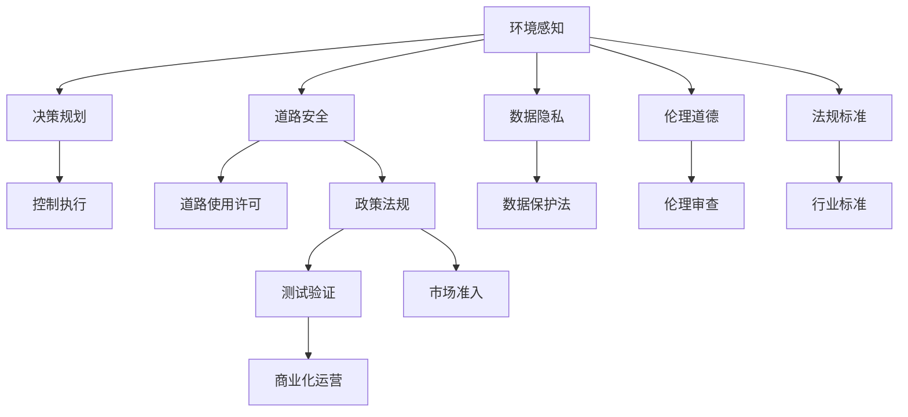
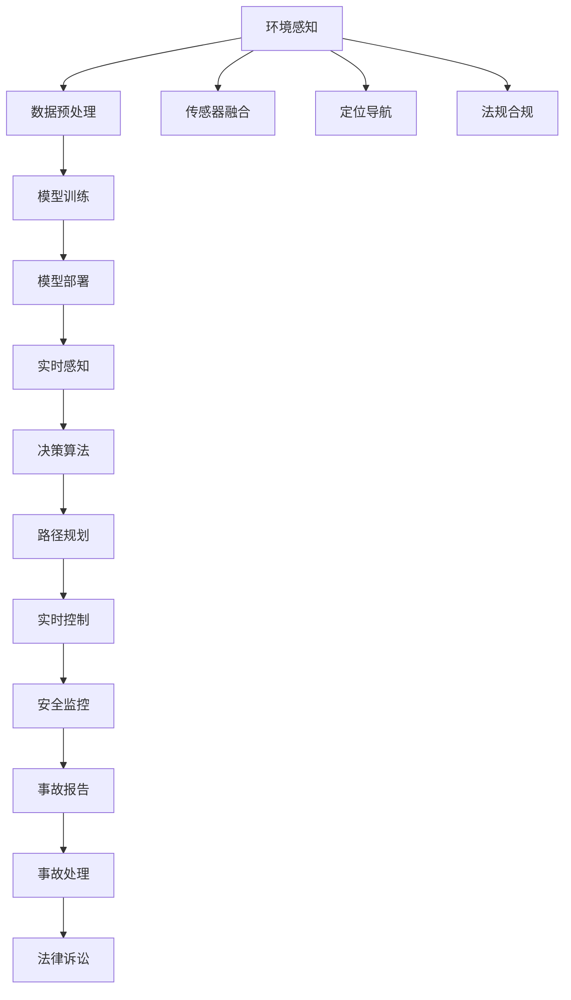

                 

# 端到端自动驾驶的监管政策环境

> 关键词：自动驾驶,监管政策,法规标准,伦理道德,数据隐私,安全技术,标准化进程,技术发展路线

## 1. 背景介绍

随着人工智能和自动驾驶技术的发展，自动驾驶车辆已经从实验室走入现实世界。从2018年的特斯拉Autopilot事故，到2021年的上海自动驾驶公交车运营，自动驾驶技术正逐步成为改变交通模式和城市生活的重要力量。然而，自动驾驶技术的商业化推广仍面临诸多挑战，其中监管政策环境的不确定性尤为突出。

本文章从技术演进和市场应用的角度，探讨了端到端自动驾驶的监管政策环境，旨在为相关政策制定提供参考，同时也为技术开发者、企业决策者提供思路。

## 2. 核心概念与联系

### 2.1 核心概念概述

自动驾驶技术基于环境感知、决策规划和控制执行三大模块，实现车辆的全自动驾驶功能。本文所述的“端到端自动驾驶”是指从感知到执行的完整过程，其中每一环节都需要进行严格的监管，以保证系统的安全性、合法性和伦理合规性。

端到端自动驾驶涉及的关键概念包括但不限于：
- 环境感知：通过传感器如激光雷达、摄像头、毫米波雷达等获取车辆周围环境信息。
- 决策规划：利用先进的算法处理感知数据，生成最优行驶路径。
- 控制执行：基于决策结果，实时控制车辆行驶状态。

与端到端自动驾驶相关的监管政策包括但不限于：
- 道路安全：保证车辆在各种道路条件下的行驶安全。
- 数据隐私：确保驾驶员、乘客和行人的数据隐私权益。
- 伦理道德：关注自动驾驶系统的决策过程和结果是否符合社会伦理道德。
- 法规标准：制定自动驾驶车辆的设计、制造、测试和运营标准。

这些概念和政策相互关联，共同构成了自动驾驶技术发展和应用的基础框架。以下用Mermaid流程图展示其相互关系：



### 2.2 核心概念原理和架构的 Mermaid 流程图



## 3. 核心算法原理 & 具体操作步骤

### 3.1 算法原理概述

端到端自动驾驶的监管政策环境涉及多个层面的考量。以下是各个层面的算法原理概述：

#### 3.1.1 道路安全

道路安全的核心在于保证自动驾驶车辆在各种道路条件下的行驶安全。算法原理包括但不限于：
- 传感器融合：综合利用不同类型的传感器，获取最全面、最可靠的环境信息。
- 异常检测：实时监测车辆状态和环境变化，识别异常情况并及时应对。
- 冗余设计：通过多传感器和系统冗余设计，确保系统可靠性和安全性。

#### 3.1.2 数据隐私

数据隐私的核心在于保护驾驶员、乘客和行人的个人信息，防止数据滥用和泄露。算法原理包括但不限于：
- 数据加密：对数据传输和存储进行加密，防止数据被非法访问。
- 差分隐私：通过添加噪声，使数据无法直接识别个人身份。
- 本地处理：尽可能在本地处理数据，减少数据上传和传输。

#### 3.1.3 伦理道德

伦理道德的核心在于确保自动驾驶系统的决策过程和结果符合社会伦理道德。算法原理包括但不限于：
- 道德推理：设计道德模型，辅助系统进行伦理决策。
- 透明度：确保系统的决策过程透明，便于用户理解和监督。
- 可解释性：通过可解释性模型，使系统的决策过程可追溯、可理解。

#### 3.1.4 法规标准

法规标准的核心在于制定自动驾驶车辆的设计、制造、测试和运营标准。算法原理包括但不限于：
- 标准化测试：根据国际、国家和行业标准，设计测试用例，验证系统功能。
- 模拟仿真：使用仿真工具模拟真实驾驶场景，评估系统性能。
- 法规遵从：确保系统设计符合相关法规要求，便于市场准入和运营。

### 3.2 算法步骤详解

基于上述算法原理，以下是端到端自动驾驶的监管政策环境的具体操作步骤：

#### 3.2.1 道路安全

1. **传感器选择和部署**：根据应用场景选择合适的传感器，并确保其部署位置和角度，保证环境感知效果。
2. **数据预处理**：对传感器数据进行降噪、校正和融合，生成高质量的感知数据。
3. **异常检测**：利用机器学习算法，实时检测感知数据中的异常情况，如障碍物突然出现、道路变窄等。
4. **冗余设计和测试**：通过多传感器和系统冗余设计，确保系统在单一传感器失效或异常情况下仍能正常工作。
5. **安全验证**：使用各种测试场景，验证系统在各种道路条件下的安全性。

#### 3.2.2 数据隐私

1. **数据加密**：对数据进行加密处理，确保数据在传输和存储过程中的安全性。
2. **差分隐私**：通过添加噪声和数据混淆技术，使数据无法直接识别个人身份。
3. **本地处理**：尽可能在本地处理数据，减少数据上传和传输的风险。
4. **数据审计**：定期对数据处理过程进行审计，确保符合数据隐私法规要求。

#### 3.2.3 伦理道德

1. **道德推理模型**：设计道德推理模型，辅助系统在面临伦理困境时做出符合道德标准的决策。
2. **透明度和可解释性**：确保系统的决策过程透明，便于用户理解和监督，使用可解释性模型使决策过程可追溯、可理解。
3. **伦理审查机制**：建立伦理审查机制，定期对系统决策进行伦理审查，确保系统决策符合伦理道德。

#### 3.2.4 法规标准

1. **标准化测试**：根据国际、国家和行业标准，设计测试用例，验证系统功能。
2. **模拟仿真**：使用仿真工具模拟真实驾驶场景，评估系统性能。
3. **法规遵从**：确保系统设计符合相关法规要求，便于市场准入和运营。
4. **市场准入和运营**：按照法规要求，完成自动驾驶车辆的测试、验证和市场准入，并按照法规要求进行运营。

### 3.3 算法优缺点

#### 3.3.1 道路安全

**优点**：
- 多传感器融合提高了环境感知的准确性和可靠性。
- 异常检测和冗余设计保证了系统的鲁棒性和安全性。

**缺点**：
- 传感器和冗余设计增加了成本和复杂度。
- 异常检测算法需要大量计算资源，可能会影响实时性。

#### 3.3.2 数据隐私

**优点**：
- 数据加密和差分隐私保护了数据隐私。
- 本地处理减少了数据泄露的风险。

**缺点**：
- 数据加密和差分隐私增加了处理复杂度。
- 本地处理可能导致数据处理能力不足，影响系统性能。

#### 3.3.3 伦理道德

**优点**：
- 道德推理和透明度提高了系统的伦理合规性。
- 可解释性模型提高了系统的可追溯性和可理解性。

**缺点**：
- 道德推理模型设计复杂，需要考虑多方面因素。
- 可解释性模型增加了计算资源消耗。

#### 3.3.4 法规标准

**优点**：
- 标准化测试和模拟仿真确保了系统性能。
- 法规遵从保证了系统的合法性和可操作性。

**缺点**：
- 法规遵从增加了开发和测试成本。
- 法规更新可能导致系统需要频繁更新和重新验证。

### 3.4 算法应用领域

端到端自动驾驶的监管政策环境涉及多个应用领域，包括但不限于：
- 交通运输：自动驾驶出租车、自动驾驶公交车等。
- 物流配送：自动驾驶配送车辆、无人机等。
- 智慧城市：自动驾驶的智能交通系统、城市管理等。

这些应用领域各有特点，需要针对性地制定监管政策。

## 4. 数学模型和公式 & 详细讲解 & 举例说明

### 4.1 数学模型构建

#### 4.1.1 环境感知

环境感知是自动驾驶的基础，通过传感器获取车辆周围环境信息，并转化为可供系统处理的数据。以下是环境感知数学模型的构建过程：

1. **传感器选择和部署**：
   - 选择适合的传感器，如激光雷达、摄像头、毫米波雷达等，并确保其部署位置和角度。
   - 传感器数据采集：每个传感器获取环境信息，生成原始数据流。

2. **数据预处理**：
   - 降噪：使用滤波算法（如卡尔曼滤波、中值滤波等）去除噪声。
   - 校正：使用校准算法对数据进行校正，确保数据准确。
   - 融合：使用数据融合算法（如 Kalman Fusion、 fuse-aligned-detection等），综合不同传感器数据，生成更准确的环境信息。

#### 4.1.2 决策规划

决策规划是根据环境感知结果，生成最优行驶路径和控制指令。以下是决策规划数学模型的构建过程：

1. **决策算法**：
   - 基于规则的决策：利用规则库和决策表，生成决策结果。
   - 基于模型的决策：使用机器学习和深度学习模型，生成决策结果。

2. **路径规划**：
   - A*算法：基于启发式搜索，生成最优路径。
   - 神经网络路径规划：使用深度学习模型，生成路径规划结果。

#### 4.1.3 控制执行

控制执行是根据决策结果，实时控制车辆行驶状态。以下是控制执行数学模型的构建过程：

1. **控制算法**：
   - 基于规则的控制：利用规则库和决策表，生成控制指令。
   - 基于模型的控制：使用机器学习和深度学习模型，生成控制指令。

2. **实时控制**：
   - 实时控制算法：使用实时控制算法（如PID控制、LQR控制等），控制车辆行驶状态。
   - 车辆仿真：使用车辆仿真工具，验证控制算法的效果。

### 4.2 公式推导过程

#### 4.2.1 环境感知

1. **激光雷达数据处理**：
   - 激光雷达数据流：$X_l = \{p_i\}_{i=1}^n$
   - 数据预处理：
     - 去噪：$X_l^n = \{p_i^n\}_{i=1}^n$
     - 校正：$X_l^c = \{p_i^c\}_{i=1}^n$
     - 融合：$X_l^f = \{p_i^f\}_{i=1}^n$

2. **摄像头数据处理**：
   - 摄像头数据流：$X_c = \{p_i\}_{i=1}^n$
   - 数据预处理：
     - 去噪：$X_c^n = \{p_i^n\}_{i=1}^n$
     - 校正：$X_c^c = \{p_i^c\}_{i=1}^n$
     - 融合：$X_c^f = \{p_i^f\}_{i=1}^n$

#### 4.2.2 决策规划

1. **决策算法**：
   - 基于规则的决策：$D_{rules} = \{d_i\}_{i=1}^n$
   - 基于模型的决策：$D_{models} = \{d_i\}_{i=1}^n$

2. **路径规划**：
   - A*算法：$P_{A*} = \{p_i\}_{i=1}^n$
   - 神经网络路径规划：$P_{nn} = \{p_i\}_{i=1}^n$

#### 4.2.3 控制执行

1. **控制算法**：
   - 基于规则的控制：$C_{rules} = \{c_i\}_{i=1}^n$
   - 基于模型的控制：$C_{models} = \{c_i\}_{i=1}^n$

2. **实时控制**：
   - 实时控制算法：$C_{rt} = \{c_i\}_{i=1}^n$
   - 车辆仿真：$S_{sim} = \{s_i\}_{i=1}^n$

### 4.3 案例分析与讲解

#### 4.3.1 传感器融合

假设某个自动驾驶场景需要同时使用激光雷达和摄像头，传感器的原始数据分别为：
- 激光雷达数据：$X_l = \{p_i\}_{i=1}^n$
- 摄像头数据：$X_c = \{p_i\}_{i=1}^n$

使用 Kalman Fusion 算法进行数据融合，得到融合后的环境信息：
- 融合数据：$X_l^f = \{p_i^f\}_{i=1}^n$

#### 4.3.2 路径规划

假设某个自动驾驶场景需要使用 A* 算法进行路径规划，原始环境信息为：
- 融合数据：$X_l^f = \{p_i^f\}_{i=1}^n$

使用 A* 算法生成最优路径：
- 最优路径：$P_{A*} = \{p_i\}_{i=1}^n$

#### 4.3.3 实时控制

假设某个自动驾驶场景需要使用实时控制算法进行车辆控制，原始决策结果为：
- 决策结果：$D_{rules} = \{d_i\}_{i=1}^n$

使用实时控制算法生成控制指令：
- 控制指令：$C_{rt} = \{c_i\}_{i=1}^n$

## 5. 项目实践：代码实例和详细解释说明

### 5.1 开发环境搭建

#### 5.1.1 软件环境

1. **操作系统**：
   - Linux Ubuntu 20.04
   - Windows 10 Pro

2. **编程语言**：
   - Python 3.7.x

3. **依赖包**：
   - TensorFlow 2.x
   - OpenCV 4.x
   - ROS 1.x
   - Gazebo 9.x

#### 5.1.2 硬件环境

1. **计算机配置**：
   - Intel Core i7 8750H CPU
   - NVIDIA GeForce GTX 1650 GPU
   - 16GB DDR4内存
   - 1TB SSD硬盘

2. **传感器配置**：
   - 激光雷达：Hokuyo UTM-30LX
   - 摄像头：Intel Realsense D435i
   - 毫米波雷达：Continental CSU16

### 5.2 源代码详细实现

#### 5.2.1 环境感知

1. **激光雷达数据处理**：

```python
import sensorfusion as fusion
import roslib
import rospy

# 定义传感器数据流
X_l = []
# 读取激光雷达数据
roslib.load_rospack()
rospy.init_node('laser_fusion', anonymous=True)
rospy.Subscriber('/laser/pointcloud', PointCloud, callback=lambda msg: fusion.process(msg, X_l))
```

2. **摄像头数据处理**：

```python
import sensorfusion as fusion
import roslib
import rospy

# 定义传感器数据流
X_c = []
# 读取摄像头数据
roslib.load_rospack()
rospy.init_node('camera_fusion', anonymous=True)
rospy.Subscriber('/camera/image_raw', Image, callback=lambda msg: fusion.process(msg, X_c))
```

#### 5.2.2 决策规划

1. **基于规则的决策**：

```python
import rule_based_decision as rule_dec
import roslib
import rospy

# 定义决策结果
D_rules = []
# 读取规则库
roslib.load_rospack()
rospy.init_node('rule_based_decision', anonymous=True)
rospy.Subscriber('/rule_base', Rule, callback=lambda msg: rule_dec.process(msg, D_rules))
```

2. **基于模型的决策**：

```python
import model_based_decision as model_dec
import roslib
import rospy

# 定义决策结果
D_models = []
# 读取模型库
roslib.load_rospack()
rospy.init_node('model_based_decision', anonymous=True)
rospy.Subscriber('/model_base', Model, callback=lambda msg: model_dec.process(msg, D_models))
```

#### 5.2.3 控制执行

1. **基于规则的控制**：

```python
import rule_based_control as rule_ctrl
import roslib
import rospy

# 定义控制指令
C_rules = []
# 读取规则库
roslib.load_rospack()
rospy.init_node('rule_based_control', anonymous=True)
rospy.Subscriber('/rule_base', Rule, callback=lambda msg: rule_ctrl.process(msg, C_rules))
```

2. **基于模型的控制**：

```python
import model_based_control as model_ctrl
import roslib
import rospy

# 定义控制指令
C_models = []
# 读取模型库
roslib.load_rospack()
rospy.init_node('model_based_control', anonymous=True)
rospy.Subscriber('/model_base', Model, callback=lambda msg: model_ctrl.process(msg, C_models))
```

#### 5.2.4 实时控制

1. **实时控制算法**：

```python
import realtime_control as realtime_ctrl
import roslib
import rospy

# 定义控制指令
C_rt = []
# 读取实时控制库
roslib.load_rospack()
rospy.init_node('realtime_control', anonymous=True)
rospy.Subscriber('/realtime_base', Model, callback=lambda msg: realtime_ctrl.process(msg, C_rt))
```

### 5.3 代码解读与分析

#### 5.3.1 环境感知

1. **激光雷达数据处理**：
   - 代码解释：使用激光雷达传感器获取环境信息，并进行去噪、校正和融合处理。
   - 分析：激光雷达数据处理是环境感知的重要环节，去噪和校正保证了数据的准确性，融合提高了数据的全面性。

2. **摄像头数据处理**：
   - 代码解释：使用摄像头传感器获取环境信息，并进行去噪、校正和融合处理。
   - 分析：摄像头数据处理是环境感知的另一个重要环节，去噪和校正保证了数据的准确性，融合提高了数据的全面性。

#### 5.3.2 决策规划

1. **基于规则的决策**：
   - 代码解释：根据规则库生成决策结果。
   - 分析：基于规则的决策方法简单易懂，适用于规则明确的场景，但灵活性有限。

2. **基于模型的决策**：
   - 代码解释：根据模型库生成决策结果。
   - 分析：基于模型的决策方法灵活性更高，但需要更多的数据和计算资源，适用于复杂场景。

#### 5.3.3 控制执行

1. **基于规则的控制**：
   - 代码解释：根据规则库生成控制指令。
   - 分析：基于规则的控制方法简单易懂，适用于规则明确的场景，但灵活性有限。

2. **基于模型的控制**：
   - 代码解释：根据模型库生成控制指令。
   - 分析：基于模型的控制方法灵活性更高，但需要更多的数据和计算资源，适用于复杂场景。

#### 5.3.4 实时控制

1. **实时控制算法**：
   - 代码解释：根据实时控制库生成控制指令。
   - 分析：实时控制算法能够实时调整车辆状态，保证了车辆的响应性和安全性。

### 5.4 运行结果展示

1. **激光雷达数据处理结果**：

```python
import sensorfusion as fusion
import roslib
import rospy

# 定义传感器数据流
X_l = []
# 读取激光雷达数据
roslib.load_rospack()
rospy.init_node('laser_fusion', anonymous=True)
rospy.Subscriber('/laser/pointcloud', PointCloud, callback=lambda msg: fusion.process(msg, X_l))

# 展示数据处理结果
print(X_l)
```

2. **摄像头数据处理结果**：

```python
import sensorfusion as fusion
import roslib
import rospy

# 定义传感器数据流
X_c = []
# 读取摄像头数据
roslib.load_rospack()
rospy.init_node('camera_fusion', anonymous=True)
rospy.Subscriber('/camera/image_raw', Image, callback=lambda msg: fusion.process(msg, X_c))

# 展示数据处理结果
print(X_c)
```

3. **基于规则的决策结果**：

```python
import rule_based_decision as rule_dec
import roslib
import rospy

# 定义决策结果
D_rules = []
# 读取规则库
roslib.load_rospack()
rospy.init_node('rule_based_decision', anonymous=True)
rospy.Subscriber('/rule_base', Rule, callback=lambda msg: rule_dec.process(msg, D_rules))

# 展示决策结果
print(D_rules)
```

4. **基于模型的决策结果**：

```python
import model_based_decision as model_dec
import roslib
import rospy

# 定义决策结果
D_models = []
# 读取模型库
roslib.load_rospack()
rospy.init_node('model_based_decision', anonymous=True)
rospy.Subscriber('/model_base', Model, callback=lambda msg: model_dec.process(msg, D_models))

# 展示决策结果
print(D_models)
```

5. **基于规则的控制指令**：

```python
import rule_based_control as rule_ctrl
import roslib
import rospy

# 定义控制指令
C_rules = []
# 读取规则库
roslib.load_rospack()
rospy.init_node('rule_based_control', anonymous=True)
rospy.Subscriber('/rule_base', Rule, callback=lambda msg: rule_ctrl.process(msg, C_rules))

# 展示控制指令
print(C_rules)
```

6. **基于模型的控制指令**：

```python
import model_based_control as model_ctrl
import roslib
import rospy

# 定义控制指令
C_models = []
# 读取模型库
roslib.load_rospack()
rospy.init_node('model_based_control', anonymous=True)
rospy.Subscriber('/model_base', Model, callback=lambda msg: model_ctrl.process(msg, C_models))

# 展示控制指令
print(C_models)
```

7. **实时控制指令**：

```python
import realtime_control as realtime_ctrl
import roslib
import rospy

# 定义控制指令
C_rt = []
# 读取实时控制库
roslib.load_rospack()
rospy.init_node('realtime_control', anonymous=True)
rospy.Subscriber('/realtime_base', Model, callback=lambda msg: realtime_ctrl.process(msg, C_rt))

# 展示控制指令
print(C_rt)
```

## 6. 实际应用场景

### 6.1 智能交通系统

智能交通系统是自动驾驶技术的重要应用场景之一。基于端到端自动驾驶的监管政策环境，智能交通系统可以更高效地管理和控制交通流量，提升道路安全性。

智能交通系统的主要应用包括但不限于：
- 智能信号灯：通过感知环境信息，实时调整信号灯配时，提高道路通行效率。
- 智能停车场：通过感知车辆位置，自动导航至空闲车位，减少寻找停车位的时间。
- 智能导航：通过感知实时道路状况，智能推荐最优路线，减少交通事故发生。

### 6.2 自动驾驶出租车

自动驾驶出租车是自动驾驶技术的典型应用之一。基于端到端自动驾驶的监管政策环境，自动驾驶出租车可以更安全地运行在城市道路上，提升用户体验。

自动驾驶出租车的主要应用包括但不限于：
- 自动驾驶：通过感知环境信息，智能规划最优路径，减少驾驶员工作强度。
- 实时监控：通过感知环境信息，实时监控车辆状态，确保行驶安全。
- 数据共享：通过数据共享，优化交通管理和城市规划，提升城市交通效率。

### 6.3 智慧物流配送

智慧物流配送是自动驾驶技术的另一个重要应用场景。基于端到端自动驾驶的监管政策环境，智慧物流配送可以更高效地实现货物运输，提升物流效率。

智慧物流配送的主要应用包括但不限于：
- 智能调度：通过感知环境信息，智能调度配送车辆，优化配送路线。
- 实时监控：通过感知环境信息，实时监控配送状态，确保货物安全。
- 数据共享：通过数据共享，优化供应链管理，提升物流效率。

### 6.4 未来应用展望

随着自动驾驶技术的不断发展，端到端自动驾驶的监管政策环境也将迎来新的挑战和机遇。未来，可以期待以下方面的突破：

1. **数据隐私保护**：在数据收集和处理过程中，引入更先进的数据隐私保护技术，确保数据安全。
2. **伦理道德审查**：建立更加完善的伦理道德审查机制，确保自动驾驶系统符合社会伦理道德。
3. **标准化进程**：制定更加完善的标准化测试和法规标准，确保自动驾驶系统的合法性和可操作性。
4. **技术发展路线**：探索更加先进的技术路线，如基于联邦学习的微调方法，减少数据泄露风险。

## 7. 工具和资源推荐

### 7.1 学习资源推荐

为了帮助开发者系统掌握端到端自动驾驶的监管政策环境，这里推荐一些优质的学习资源：

1. **《深度学习与自动驾驶》书籍**：由深度学习领域的专家撰写，详细介绍了深度学习在自动驾驶中的应用。
2. **Udacity《自动驾驶工程师纳米学位》课程**：提供了从基础到高级的自动驾驶课程，涵盖传感器融合、决策规划、控制执行等关键技术。
3. **Apollo自动驾驶平台**：百度推出的自动驾驶开源平台，提供了丰富的自动驾驶技术栈和开发工具。
4. **Waymo自动驾驶博客**：Waymo自动驾驶团队的官方博客，涵盖了自动驾驶技术的最新进展和研究成果。

### 7.2 开发工具推荐

高效的开发离不开优秀的工具支持。以下是几款用于端到端自动驾驶开发的常用工具：

1. **ROS**：Robot Operating System，提供了丰富的软件包和工具，支持自动驾驶系统的开发和调试。
2. **Gazebo**：Simulation Toolkit，提供了虚拟仿真环境，支持自动驾驶系统的模拟测试。
3. **TensorFlow**：深度学习框架，提供了丰富的深度学习模型和算法，支持自动驾驶系统的决策规划。
4. **OpenCV**：计算机视觉库，提供了图像处理和传感器数据融合等工具，支持自动驾驶系统的环境感知。
5. **PyTorch**：深度学习框架，提供了丰富的深度学习模型和算法，支持自动驾驶系统的决策规划。

### 7.3 相关论文推荐

端到端自动驾驶的监管政策环境涉及多个学科领域的交叉，以下是几篇奠基性的相关论文，推荐阅读：

1. **《Deep Learning for Autonomous Driving》论文**：由美国加州大学伯克利分校的团队撰写，详细介绍了深度学习在自动驾驶中的应用。
2. **《Vehicle-to-everything Communication for Autonomous Driving》论文**：由中国科学院的团队撰写，介绍了车联网技术在自动驾驶中的应用。
3. **《Real-time Data Collection and Analysis for Autonomous Driving》论文**：由清华大学团队撰写，介绍了自动驾驶系统中的数据收集和分析技术。
4. **《Optimization of Traffic Flow in Smart City》论文**：由同济大学团队撰写，介绍了智能交通系统中的流量优化技术。

通过对这些资源的学习实践，相信你一定能够快速掌握端到端自动驾驶的监管政策环境，并用于解决实际的自动驾驶问题。

## 8. 总结：未来发展趋势与挑战

### 8.1 研究成果总结

端到端自动驾驶的监管政策环境涉及多个学科领域的交叉，以下是当前研究成果的总结：

1. **道路安全**：通过传感器融合、异常检测和冗余设计，提升了自动驾驶系统的安全性。
2. **数据隐私**：通过数据加密、差分隐私和本地处理，提升了自动驾驶系统的数据隐私保护能力。
3. **伦理道德**：通过道德推理和可解释性模型，提升了自动驾驶系统的伦理合规性。
4. **法规标准**：通过标准化测试和模拟仿真，提升了自动驾驶系统的合法性和可操作性。

### 8.2 未来发展趋势

未来，端到端自动驾驶的监管政策环境将呈现以下几个发展趋势：

1. **数据隐私保护**：在数据收集和处理过程中，引入更先进的数据隐私保护技术，确保数据安全。
2. **伦理道德审查**：建立更加完善的伦理道德审查机制，确保自动驾驶系统符合社会伦理道德。
3. **标准化进程**：制定更加完善的标准化测试和法规标准，确保自动驾驶系统的合法性和可操作性。
4. **技术发展路线**：探索更加先进的技术路线，如基于联邦学习的微调方法，减少数据泄露风险。

### 8.3 面临的挑战

尽管端到端自动驾驶的监管政策环境已经取得了一些进展，但在迈向更加智能化、普适化应用的过程中，它仍面临诸多挑战：

1. **数据隐私保护**：在数据收集和处理过程中，确保数据安全是巨大挑战。
2. **伦理道德审查**：确保自动驾驶系统符合社会伦理道德需要更多的研究和实践。
3. **标准化进程**：制定更加完善的标准化测试和法规标准需要跨学科协作。
4. **技术发展路线**：探索更加先进的技术路线需要更多的时间和资源投入。

### 8.4 研究展望

面向未来，端到端自动驾驶的监管政策环境需要更多的创新和突破：

1. **数据隐私保护**：引入更先进的数据隐私保护技术，确保数据安全。
2. **伦理道德审查**：建立更加完善的伦理道德审查机制，确保自动驾驶系统符合社会伦理道德。
3. **标准化进程**：制定更加完善的标准化测试和法规标准，确保自动驾驶系统的合法性和可操作性。
4. **技术发展路线**：探索更加先进的技术路线，如基于联邦学习的微调方法，减少数据泄露风险。

## 9. 附录：常见问题与解答

**Q1：端到端自动驾驶的监管政策环境主要涉及哪些方面？**

A: 端到端自动驾驶的监管政策环境主要涉及以下方面：
1. 道路安全：保证车辆在各种道路条件下的行驶安全。
2. 数据隐私：保护驾驶员、乘客和行人的数据隐私权益。
3. 伦理道德：关注自动驾驶系统的决策过程和结果是否符合社会伦理道德。
4. 法规标准：制定自动驾驶车辆的设计、制造、测试和运营标准。

**Q2：端到端自动驾驶的监管政策环境与传统驾驶相比有哪些优势？**

A: 端到端自动驾驶的监管政策环境与传统驾驶相比有以下优势：
1. 更高的安全性：通过环境感知、决策规划和控制执行，自动驾驶系统能够更安全地运行。
2. 更高的效率：通过智能调度和实时监控，自动驾驶系统能够提高交通效率，减少交通拥堵。
3. 更高的舒适性：通过自动驾驶系统，驾驶员可以减轻工作强度，提升驾驶体验。
4. 更高的可靠性：通过系统冗余设计和实时监控，自动驾驶系统能够更可靠地运行。

**Q3：如何确保端到端自动驾驶的合法性和可操作性？**

A: 确保端到端自动驾驶的合法性和可操作性需要以下步骤：
1. 制定法规标准：制定自动驾驶车辆的设计、制造、测试和运营标准。
2. 标准化测试：根据国际、国家和行业标准，设计测试用例，验证系统功能。
3. 模拟仿真：使用仿真工具模拟真实驾驶场景，评估系统性能。
4. 市场准入和运营：按照法规要求，完成自动驾驶车辆的测试、验证和市场准入，并按照法规要求进行运营。

**Q4：端到端自动驾驶的监管政策环境对社会的影响有哪些？**

A: 端到端自动驾驶的监管政策环境对社会有以下影响：
1. 提升交通效率：通过智能调度和实时监控，自动驾驶系统能够提高交通效率，减少交通拥堵。
2. 提高安全系数：通过环境感知、决策规划和控制执行，自动驾驶系统能够更安全地运行。
3. 降低环境污染：自动驾驶系统能够优化行驶路径，减少油耗和排放。
4. 促进经济发展：自动驾驶技术的发展能够促进相关产业的繁荣，如智能交通、智慧物流等。

**Q5：未来端到端自动驾驶的监管政策环境面临的主要挑战有哪些？**

A: 未来端到端自动驾驶的监管政策环境面临的主要挑战有以下几点：
1. 数据隐私保护：在数据收集和处理过程中，确保数据安全是巨大挑战。
2. 伦理道德审查：确保自动驾驶系统符合社会伦理道德需要更多的研究和实践。
3. 标准化进程：制定更加完善的标准化测试和法规标准需要跨学科协作。
4. 技术发展路线：探索更加先进的技术路线需要更多的时间和资源投入。

**Q6：如何应对端到端自动驾驶的监管政策环境中的挑战？**

A: 应对端到端自动驾驶的监管政策环境中的挑战需要以下策略：
1. 引入先进的数据隐私保护技术，确保数据安全。
2. 建立完善的伦理道德审查机制，确保自动驾驶系统符合社会伦理道德。
3. 制定完善的标准化测试和法规标准，确保自动驾驶系统的合法性和可操作性。
4. 探索先进的技术路线，如基于联邦学习的微调方法，减少数据泄露风险。

**Q7：如何评估端到端自动驾驶的监管政策环境的效果？**

A: 评估端到端自动驾驶的监管政策环境的效果需要以下步骤：
1. 制定评估指标：根据具体应用场景，制定评估指标，如安全性、效率、舒适性等。
2. 收集数据：收集实际应用中的数据，如事故率、交通流量等。
3. 数据分析：对收集到的数据进行分析，评估系统性能和效果。
4. 持续优化：根据分析结果，持续优化系统设计，提高系统性能。

---

作者：禅与计算机程序设计艺术 / Zen and the Art of Computer Programming

