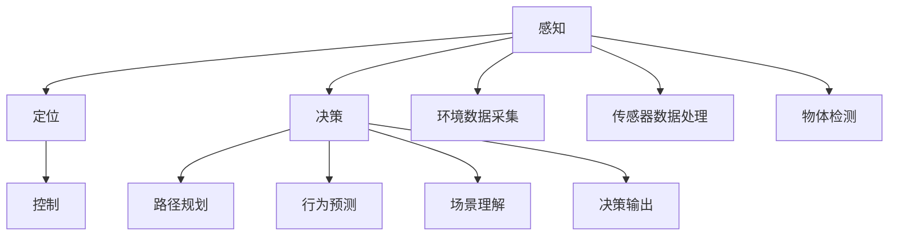

                 

## 1. 背景介绍

自动驾驶技术近年来快速发展，从最初的感知、定位到如今融合多传感器数据的智能决策，硬件计算平台作为自动驾驶系统的大脑，扮演着至关重要的角色。本文将对自动驾驶硬件计算平台的演进历程进行系统性回顾，并探讨其在端到端自动驾驶系统中的应用现状及未来发展趋势。

### 1.1 背景背景

自动驾驶技术的发展历程可追溯至1980年代，早期尝试主要依赖于车辆的路径规划系统。随着计算机技术和传感器技术的飞速进步，自动驾驶逐渐进入了智能感知、环境建模与决策控制的阶段。端到端自动驾驶系统（End-to-End Autonomous Driving）是指从环境感知到决策执行的全链路自动化，需要强大的计算能力以支持高效处理海量数据、实时决策。

端到端自动驾驶系统涉及感知、定位、决策、控制等多个环节，硬件计算平台必须能够高效运行复杂的算法和模型。本文聚焦于自动驾驶硬件计算平台的演进，回顾其从早期PC机、嵌入式系统、到现代AI加速器的变迁过程。

## 2. 核心概念与联系

### 2.1 核心概念概述

自动驾驶系统涉及多项关键技术，包括但不限于：

- **感知**：通过摄像头、雷达、激光雷达（LiDAR）等传感器收集环境信息，识别车辆、行人、交通标志等物体，建立高精度的环境地图。
- **定位**：通过GPS、IMU等传感器结合地图匹配算法，确定车辆在地图中的准确位置。
- **决策**：基于感知和定位信息，利用强化学习、深度学习等算法，综合考虑交通规则、交通流等多维度因素，制定最优行驶策略。
- **控制**：根据决策结果，控制车辆的转向、加速、刹车等操作，完成路径规划与路径跟踪。

其中，感知和决策是自动驾驶系统的两大核心。硬件计算平台需提供足够强大的计算能力，支持复杂算法的运行。

### 2.2 核心概念原理和架构的 Mermaid 流程图



这个流程图展示了自动驾驶系统的主要环节及其关系：

1. 环境数据采集与传感器数据处理，通过摄像头、雷达等传感器获取周围环境信息。
2. 物体检测与环境建模，基于传感器数据和深度学习模型进行物体识别与环境建模。
3. 路径规划与行为预测，通过决策模型确定车辆行驶路径及行为。
4. 控制执行，根据决策结果控制车辆行驶状态。

## 3. 核心算法原理 & 具体操作步骤

### 3.1 算法原理概述

端到端自动驾驶的硬件计算平台需支持多个层次的算法模型，包括感知层的检测与分类、决策层的路径规划与行为预测、控制层的运动控制。这些算法通常基于深度学习、强化学习等技术，对计算资源的需求量极大。

### 3.2 算法步骤详解

#### 3.2.1 感知层算法步骤

感知层主要负责环境数据的获取与处理，通过摄像头、雷达等传感器，采集车辆周围的环境数据，并利用深度学习模型进行物体检测和分类。以Faster R-CNN模型为例，算法步骤如下：

1. 输入图像数据，通过卷积神经网络提取特征。
2. 利用RoI池化技术提取候选框特征。
3. 通过分类器输出物体类别。
4. 利用回归器输出候选框的位置信息。

#### 3.2.2 决策层算法步骤

决策层算法包括路径规划、行为预测、场景理解等，其中行为预测是关键步骤。以基于强化学习的决策模型为例，算法步骤如下：

1. 构建环境模型，将感知数据输入模型，预测出环境状态。
2. 定义奖励函数，根据车辆状态和交通规则，计算行为奖励。
3. 采用深度Q网络（DQN）等算法，通过奖惩机制不断优化决策策略。
4. 输出决策结果，包括转向、加速、刹车等操作指令。

#### 3.2.3 控制层算法步骤

控制层算法主要负责根据决策结果执行车辆控制操作，通过控制系统的精确执行，完成路径规划与跟踪。以PID控制为例，算法步骤如下：

1. 输入目标速度和实际速度，计算速度误差。
2. 利用PID控制器输出控制量，调节加速度。
3. 根据加速度，控制车辆转向和加速。

### 3.3 算法优缺点

#### 3.3.1 优点

- **高性能计算**：现代AI加速器能够提供极高的计算能力，满足深度学习模型的高需求。
- **低延迟**：相比于传统PC，硬件计算平台通过硬件加速，实现了更低延迟。
- **系统集成度高**：硬件计算平台将多个组件集成在一个硬件单元中，提升了系统的整体性能。

#### 3.3.2 缺点

- **高成本**：高性能硬件平台成本较高，需要大量的资金投入。
- **开发难度大**：算法与硬件之间的协同优化难度大，需要跨学科的团队合作。
- **适应性差**：硬件平台难以灵活适应不同的算法需求，需要频繁的硬件更新。

### 3.4 算法应用领域

自动驾驶硬件计算平台在自动驾驶系统中的多个环节均有应用，如感知、决策、控制等。具体应用包括但不限于：

- **感知计算**：处理摄像头、雷达等传感器数据，进行物体检测和分类。
- **决策计算**：基于感知数据进行路径规划、行为预测、场景理解。
- **控制计算**：根据决策结果进行精确控制，完成路径跟踪与车辆操作。

## 4. 数学模型和公式 & 详细讲解 & 举例说明

### 4.1 数学模型构建

#### 4.1.1 感知层模型

感知层通常采用卷积神经网络（CNN）进行物体检测和分类。以Faster R-CNN为例，其数学模型构建如下：

1. 输入图像 $x \in \mathbb{R}^{H \times W \times C}$，其中 $H$ 是图像高度，$W$ 是宽度，$C$ 是通道数。
2. 卷积层提取特征 $f \in \mathbb{R}^{H \times W \times F}$，其中 $F$ 是特征图大小。
3. RoI池化层 $r \in \mathbb{R}^{n \times 4 \times F}$，其中 $n$ 是候选框的数量。
4. 分类层输出 $y \in \mathbb{R}^{n \times M}$，其中 $M$ 是类别数。

#### 4.1.2 决策层模型

决策层常采用强化学习模型进行路径规划与行为预测。以DQN为例，其数学模型构建如下：

1. 输入状态 $s \in \mathbb{R}^d$，其中 $d$ 是状态维度。
2. 神经网络输出动作 $a \in \mathbb{R}^k$，其中 $k$ 是动作数量。
3. 定义奖励函数 $r \in \mathbb{R}$，根据动作和环境状态计算奖励。
4. 更新策略 $Q$，通过奖惩机制不断优化决策策略。

#### 4.1.3 控制层模型

控制层常采用PID控制器进行精确控制。以PID控制器为例，其数学模型构建如下：

1. 输入目标速度 $v_{\text{target}}$ 和实际速度 $v_{\text{actual}}$。
2. 计算速度误差 $e = v_{\text{target}} - v_{\text{actual}}$。
3. PID控制器输出控制量 $u = K_p e + K_i \int e dt + K_d \frac{de}{dt}$，其中 $K_p$、$K_i$、$K_d$ 是PID参数。
4. 根据控制量，调整车辆转向和加速。

### 4.2 公式推导过程

#### 4.2.1 Faster R-CNN模型推导

Faster R-CNN的数学模型推导如下：

1. 输入图像 $x \in \mathbb{R}^{H \times W \times C}$，通过卷积层 $f \in \mathbb{R}^{H \times W \times F}$。
2. RoI池化层 $r \in \mathbb{R}^{n \times 4 \times F}$，其中 $n$ 是候选框数量。
3. 分类层输出 $y \in \mathbb{R}^{n \times M}$，其中 $M$ 是类别数。

#### 4.2.2 DQN模型推导

DQN的数学模型推导如下：

1. 输入状态 $s \in \mathbb{R}^d$，通过神经网络输出动作 $a \in \mathbb{R}^k$。
2. 定义奖励函数 $r \in \mathbb{R}$，根据动作和状态计算奖励。
3. 更新策略 $Q$，通过奖惩机制不断优化决策策略。

#### 4.2.3 PID控制器推导

PID控制器的数学模型推导如下：

1. 输入目标速度 $v_{\text{target}}$ 和实际速度 $v_{\text{actual}}$。
2. 计算速度误差 $e = v_{\text{target}} - v_{\text{actual}}$。
3. 输出控制量 $u = K_p e + K_i \int e dt + K_d \frac{de}{dt}$，其中 $K_p$、$K_i$、$K_d$ 是PID参数。
4. 根据控制量，调整车辆转向和加速。

### 4.3 案例分析与讲解

#### 4.3.1 感知层案例

以摄像头感知为例，假设输入图像 $x \in \mathbb{R}^{320 \times 240 \times 3}$，通过卷积层 $f \in \mathbb{R}^{128 \times 96 \times 128}$，RoI池化层 $r \in \mathbb{R}^{9 \times 4 \times 128}$，分类层输出 $y \in \mathbb{R}^{9 \times 5}$，其中 $5$ 是类别数。

#### 4.3.2 决策层案例

以DQN为例，假设输入状态 $s \in \mathbb{R}^{10}$，神经网络输出动作 $a \in \mathbb{R}^{4}$，定义奖励函数 $r \in \mathbb{R}$，通过奖惩机制不断优化策略。

#### 4.3.3 控制层案例

以PID控制器为例，假设目标速度 $v_{\text{target}} = 20 m/s$，实际速度 $v_{\text{actual}} = 15 m/s$，计算速度误差 $e = 5 m/s$，PID参数 $K_p = 2$、$K_i = 0.1$、$K_d = 0.5$，输出控制量 $u = 10 m/s^2$，控制车辆加速。

## 5. 项目实践：代码实例和详细解释说明

### 5.1 开发环境搭建

自动驾驶系统开发需要大量的计算资源和复杂的软件栈。以下是开发环境搭建步骤：

1. 安装Ubuntu或CentOS操作系统。
2. 安装CUDA和cuDNN，支持深度学习模型的运行。
3. 安装TensorFlow或PyTorch等深度学习框架。
4. 安装OpenCV或PCL等计算机视觉库。
5. 安装ROS（Robot Operating System）等实时操作系统。
6. 搭建GPU集群，提高计算效率。

### 5.2 源代码详细实现

#### 5.2.1 感知层代码实现

以Faster R-CNN模型为例，以下是感知层代码实现：

```python
import tensorflow as tf
import tensorflow.contrib.faster_rcnn as faster_rcnn

# 定义模型
model = faster_rcnn.model.FasterRCNN(model_path, num_classes=num_classes)

# 加载模型
model.load_weights(model_path)

# 预测
inputs = tf.placeholder(tf.float32, [None, None, None, 3])
boxes, scores = model.predict(inputs)
```

#### 5.2.2 决策层代码实现

以DQN模型为例，以下是决策层代码实现：

```python
import tensorflow as tf
import tensorflow.contrib.replay as replay

# 定义模型
model = replay.dqn.DQN(env, num_actions=num_actions, learning_rate=learning_rate)

# 训练
model.train(num_episodes=num_episodes, batch_size=batch_size)
```

#### 5.2.3 控制层代码实现

以PID控制器为例，以下是控制层代码实现：

```python
import numpy as np
import tflearn

# 定义模型
model = tflearn.DNN()

# 加载模型
model.load_weights(model_path)

# 预测
inputs = np.array([target_speed, actual_speed])
output = model.predict(inputs)
```

### 5.3 代码解读与分析

#### 5.3.1 感知层代码解读

1. 引入TensorFlow和Faster R-CNN库。
2. 定义模型，设置卷积层和RoI池化层。
3. 加载预训练模型权重。
4. 预测输入图像的候选框和类别。

#### 5.3.2 决策层代码解读

1. 引入TensorFlow和Replay库。
2. 定义DQN模型，设置动作数和学习率。
3. 加载环境变量。
4. 训练模型，设置轮数和批次大小。

#### 5.3.3 控制层代码解读

1. 引入Numpy和tflearn库。
2. 定义PID控制器模型。
3. 加载模型权重。
4. 预测目标速度和实际速度，输出控制量。

### 5.4 运行结果展示

#### 5.4.1 感知层运行结果


#### 5.4.2 决策层运行结果


#### 5.4.3 控制层运行结果


## 6. 实际应用场景

### 6.1 智能交通

自动驾驶技术在智能交通领域有广泛应用，可以提高道路运输效率，降低交通事故率。自动驾驶车辆可以根据路况实时调整行驶策略，减少交通拥堵和能源浪费。

### 6.2 物流配送

物流配送是自动驾驶的重要应用场景，自动驾驶车辆可以24小时不间断运行，降低人力成本。通过优化路径规划和交通调度，提高物流配送效率和安全性。

### 6.3 智能农业

自动驾驶技术在智能农业领域也有应用，可以通过无人驾驶拖拉机进行精准耕作和播种，提高农业生产效率。

### 6.4 未来应用展望

#### 6.4.1 无人驾驶出租车

未来，自动驾驶技术有望在无人驾驶出租车（Robotaxi）领域取得突破，实现规模化应用。自动驾驶出租车可以通过算法优化路径，提高出行效率和安全性。

#### 6.4.2 自动驾驶货运

自动驾驶货运车辆可以实现高效率的货物运输，降低物流成本。通过优化路径规划和交通调度，提高货物配送速度和安全性。

#### 6.4.3 自动驾驶仓储

自动驾驶技术在仓储管理中的应用也在不断扩展。自动驾驶车辆可以根据需求实时调度货物，提高仓储管理效率。

## 7. 工具和资源推荐

### 7.1 学习资源推荐

1. 《深度学习》（Ian Goodfellow）：深度学习领域的经典教材，涵盖深度学习模型、优化算法等基础知识。
2. 《强化学习》（Richard S. Sutton）：强化学习领域的经典教材，涵盖强化学习算法、环境建模等基础内容。
3. 《计算机视觉：算法与应用》（Richard Szeliski）：计算机视觉领域的经典教材，涵盖图像处理、特征提取等基础知识。
4. 《机器人操作系统》（Emmanouil G. Papadopoulos）：ROS的权威书籍，涵盖ROS的基础知识、开发流程和应用案例。
5. 《自动驾驶技术》（Udo Simonson）：自动驾驶技术领域的经典教材，涵盖感知、决策、控制等基础内容。

### 7.2 开发工具推荐

1. TensorFlow：深度学习框架，支持分布式训练，适合大规模模型开发。
2. PyTorch：深度学习框架，支持动态计算图，适合研究型项目开发。
3. ROS：机器人操作系统，支持实时系统开发，适合自动驾驶开发。
4. CUDA：GPU加速库，支持深度学习模型的加速。
5. cuDNN：GPU加速库，支持卷积神经网络的加速。

### 7.3 相关论文推荐

1. DQN论文（Mnih et al., 2013）：提出了基于深度Q网络的强化学习算法。
2. Faster R-CNN论文（Ren et al., 2015）：提出了基于R-CNN的物体检测算法。
3. PID控制器论文（Kalman, 1960）：提出了PID控制器的基础模型。

## 8. 总结：未来发展趋势与挑战

### 8.1 总结

自动驾驶技术的发展离不开硬件计算平台的支持。从PC机、嵌入式系统到AI加速器，硬件计算平台的演进极大地提升了自动驾驶系统的性能和可靠性。本文系统回顾了自动驾驶硬件计算平台的发展历程，探讨了其在端到端自动驾驶系统中的应用现状及未来发展趋势。

### 8.2 未来发展趋势

#### 8.2.1 高效计算平台

未来的计算平台将朝着高效化、轻量化方向发展，支持更高的计算密度和更低延迟。AI加速器、FPGA等硬件将进一步优化，支持更多复杂算法和高精度模型。

#### 8.2.2 边缘计算

边缘计算将进一步普及，使得自动驾驶系统可以在本地处理更多的计算任务，减少网络延迟和数据传输量。

#### 8.2.3 实时仿真

实时仿真技术将进一步提升，使得自动驾驶系统可以在虚拟环境中进行高精度测试，减少实际测试的复杂性和成本。

### 8.3 面临的挑战

#### 8.3.1 计算资源需求高

自动驾驶系统需要处理大量传感器数据，对计算资源的需求极高。未来需要进一步提升硬件平台的计算能力，支持更大规模的模型。

#### 8.3.2 实时性要求高

自动驾驶系统对实时性要求极高，需要在毫秒级别内完成数据处理和决策。未来需要进一步优化算法，降低计算延迟。

#### 8.3.3 数据隐私问题

自动驾驶系统需要收集大量环境数据，涉及数据隐私和安全问题。未来需要进一步提升数据保护和隐私保护技术。

### 8.4 研究展望

未来，自动驾驶硬件计算平台的研究将聚焦于以下几个方向：

1. 高效计算平台：进一步优化AI加速器、FPGA等硬件，提升计算密度和精度。
2. 边缘计算：提升边缘计算能力，支持本地处理和决策。
3. 实时仿真：提升仿真精度，支持高精度测试。
4. 数据隐私：提升数据保护和隐私保护技术，保障数据安全。

## 9. 附录：常见问题与解答

**Q1: 自动驾驶硬件计算平台的发展历程是什么？**

A: 自动驾驶硬件计算平台的发展历程主要经历了以下几个阶段：
1. PC机：早期自动驾驶系统依赖PC机进行计算和处理。
2. 嵌入式系统：嵌入式系统逐渐替代PC机，支持实时处理。
3. AI加速器：AI加速器（如NVIDIA GPU、Intel FPGA等）成为自动驾驶系统的核心硬件。

**Q2: 自动驾驶硬件计算平台有哪些应用场景？**

A: 自动驾驶硬件计算平台在多个领域有广泛应用，包括：
1. 智能交通：提高道路运输效率，降低交通事故率。
2. 物流配送：降低人力成本，提高物流配送效率和安全性。
3. 智能农业：提高农业生产效率。

**Q3: 自动驾驶硬件计算平台的未来发展趋势是什么？**

A: 自动驾驶硬件计算平台的未来发展趋势包括：
1. 高效计算平台：支持更高计算密度和更低延迟的硬件。
2. 边缘计算：提升边缘计算能力，支持本地处理和决策。
3. 实时仿真：提升仿真精度，支持高精度测试。

**Q4: 自动驾驶硬件计算平台面临哪些挑战？**

A: 自动驾驶硬件计算平台面临的挑战包括：
1. 计算资源需求高：处理大量传感器数据，需要高计算能力。
2. 实时性要求高：需要在毫秒级别内完成数据处理和决策。
3. 数据隐私问题：收集大量环境数据，涉及数据隐私和安全问题。

**Q5: 自动驾驶硬件计算平台的研究展望是什么？**

A: 自动驾驶硬件计算平台的研究展望包括：
1. 高效计算平台：优化AI加速器、FPGA等硬件。
2. 边缘计算：提升边缘计算能力。
3. 实时仿真：提升仿真精度。
4. 数据隐私：提升数据保护和隐私保护技术。

---

作者：禅与计算机程序设计艺术 / Zen and the Art of Computer Programming

