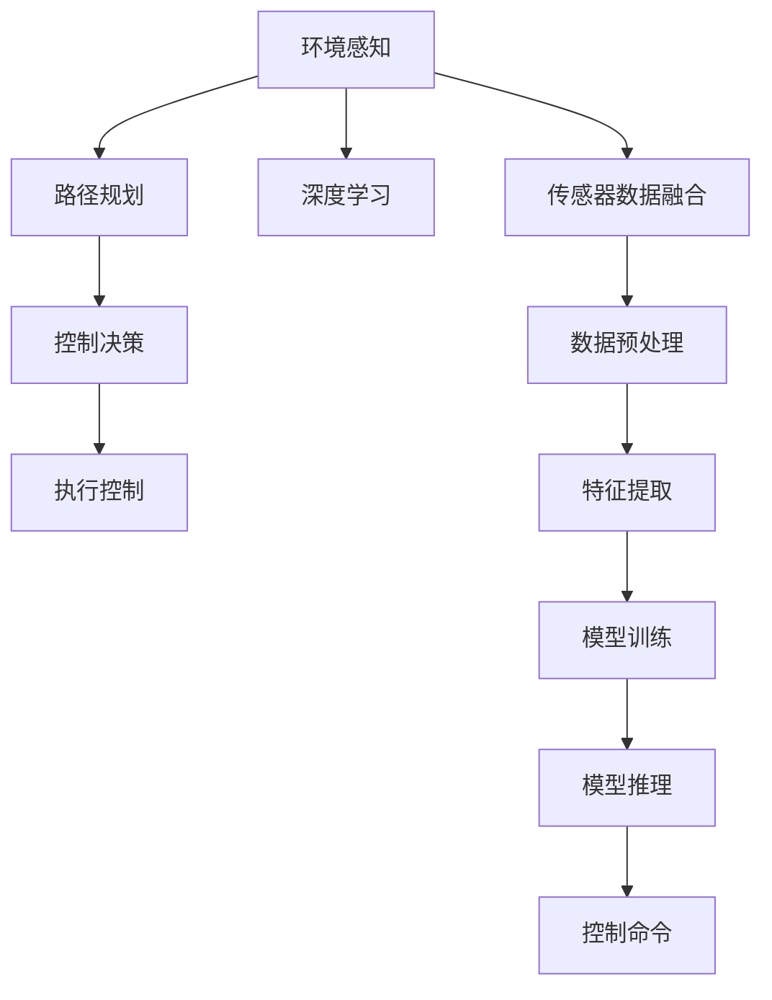

                 

## 1. 背景介绍

### 1.1 问题由来
随着自动驾驶技术的发展，自主泊车已经成为自动驾驶技术的核心功能之一。它不仅能提升驾驶体验，还能有效降低停车时的人为误差，提高停车效率。然而，自主泊车的实现涉及环境感知、路径规划、控制决策等多个环节，技术难度高，要求系统具备高度的实时性和准确性。

### 1.2 问题核心关键点
自主泊车功能包括：

1. **环境感知**：通过摄像头、雷达、激光雷达等传感器获取车辆周围环境信息，构建高精度的环境地图。
2. **路径规划**：结合环境信息，规划出一条可行且安全的泊车路径。
3. **控制决策**：根据环境信息和路径规划结果，实时调整车辆的控制指令，完成停车。

自主泊车功能不仅需要先进的感知算法，还需要强大的计算能力和高效的决策系统。如何在端到端框架内实现这些功能，成为目前自动驾驶领域的研究热点。

### 1.3 问题研究意义
自主泊车功能的研究具有重要意义：

1. **提升停车效率**：自动泊车功能可以显著提升停车效率，减少驾驶员的劳动强度，特别是在停车车位紧张的城市环境中。
2. **降低人为误差**：自动泊车功能可以有效降低人为误差，提高停车的准确性和安全性。
3. **提高驾驶体验**：自动泊车功能可以使驾驶者从繁琐的停车过程中解放出来，专注于更高级的驾驶任务，提升驾驶体验。
4. **推动自动驾驶产业发展**：自主泊车功能是自动驾驶技术的重要组成部分，其成功应用将推动整个自动驾驶技术的发展和普及。

## 2. 核心概念与联系

### 2.1 核心概念概述

为更好地理解自主泊车功能的实现，本节将介绍几个核心概念及其相互联系：

- **环境感知**：通过摄像头、雷达、激光雷达等传感器，获取车辆周围环境信息，如车辆、行人、交通标志等。常用的环境感知算法包括语义分割、目标检测、深度估计等。
- **路径规划**：基于环境信息，规划出一条可行且安全的泊车路径。常用的路径规划算法包括A*、RRT、D*等。
- **控制决策**：根据环境信息和路径规划结果，实时调整车辆的控制指令，如加速、减速、转向等。常用的决策算法包括PID控制、模型预测控制等。
- **端到端系统**：将环境感知、路径规划、控制决策等模块整合到一个端到端的系统中，通过统一的数据流和调度逻辑，实现高效、可靠的自主泊车功能。
- **深度学习**：近年来，深度学习在图像、语音等领域取得了巨大成功，可以应用于环境感知、路径规划和控制决策中，提升算法的精度和鲁棒性。

这些核心概念之间存在紧密的联系，共同构成了自主泊车的技术框架。通过理解这些核心概念，我们可以更好地把握自主泊车功能的实现机制。

### 2.2 核心概念原理和架构的 Mermaid 流程图



这个流程图展示了自主泊车功能的核心模块及其相互关系：

1. 环境感知模块通过传感器获取环境信息，并利用深度学习进行特征提取和语义分割。
2. 路径规划模块结合环境信息，规划出泊车路径，并利用深度学习进行优化。
3. 控制决策模块根据路径规划结果，生成实时控制指令，并通过深度学习进行决策优化。
4. 执行控制模块根据控制指令，调整车辆的具体动作。
5. 数据预处理和特征提取模块，对传感器数据进行清洗和处理，提取有用的特征。
6. 模型训练和推理模块，通过大量标注数据训练深度学习模型，并进行实时推理。

这些模块协同工作，共同实现自主泊车功能。

## 3. 核心算法原理 & 具体操作步骤

### 3.1 算法原理概述

自主泊车功能的实现基于端到端系统架构，主要包括以下几个关键算法：

- **深度学习环境感知算法**：通过语义分割、目标检测等深度学习方法，构建环境地图，识别出周围的车辆、行人等障碍物。
- **路径规划算法**：结合环境信息，规划出可行的泊车路径，避免碰撞和死角。
- **控制决策算法**：根据路径规划结果，实时调整车辆的控制指令，完成停车。
- **端到端优化算法**：将环境感知、路径规划、控制决策等模块整合到一个端到端系统中，通过统一的调度逻辑，实现高效的自主泊车功能。

### 3.2 算法步骤详解

#### 3.2.1 环境感知

**步骤1: 数据采集与预处理**
- 使用摄像头、雷达、激光雷达等传感器获取车辆周围环境信息。
- 对原始数据进行滤波、去噪、校正等预处理，确保数据质量。

**步骤2: 特征提取与语义分割**
- 使用深度学习模型对环境数据进行特征提取，如使用卷积神经网络（CNN）进行特征提取。
- 进行语义分割，将环境数据分割成不同的类别，如车辆、行人、道路等。

**步骤3: 环境地图构建**
- 将语义分割结果进行聚合，构建高精度的环境地图。

#### 3.2.2 路径规划

**步骤1: 路径规划**
- 结合环境地图和车辆当前位置，进行路径规划。
- 使用A*、RRT等路径规划算法，规划出可行的泊车路径。

**步骤2: 路径优化**
- 对规划出的路径进行优化，避免死角和碰撞。
- 利用深度学习进行路径优化，提高路径的鲁棒性和准确性。

#### 3.2.3 控制决策

**步骤1: 控制指令生成**
- 根据路径规划结果，生成实时控制指令，如加速、减速、转向等。
- 利用模型预测控制等算法，生成更加精确的控制指令。

**步骤2: 控制指令执行**
- 将控制指令转化为具体的车辆动作，如调整油门、刹车、方向盘等。
- 利用PID控制等算法，实现平滑、稳定的控制效果。

#### 3.2.4 端到端优化

**步骤1: 模块整合**
- 将环境感知、路径规划、控制决策等模块整合到一个端到端系统中。
- 设计统一的数据流和调度逻辑，实现各模块的协同工作。

**步骤2: 优化算法**
- 通过深度学习进行模型训练和推理优化。
- 利用强化学习等优化算法，提升整体系统的性能。

### 3.3 算法优缺点

**优点：**
- 高度集成：端到端架构将各模块集成到一个系统中，提高了系统整体的可靠性和效率。
- 实时性强：各模块通过统一的数据流和调度逻辑，实现了实时的环境感知、路径规划和控制决策。
- 准确性高：深度学习、模型预测控制等算法提升了各模块的精度和鲁棒性。

**缺点：**
- 计算量大：深度学习模型和优化算法的计算量较大，需要高性能的计算资源。
- 开发复杂：端到端系统的开发需要跨多个领域的技术，开发难度较大。
- 稳定性差：各模块的协同工作需要高精度、低延迟的同步和通信机制，对系统的稳定性要求较高。

### 3.4 算法应用领域

自主泊车功能在多个领域都有广泛的应用，例如：

- **智能停车系统**：在智能停车场，自动泊车功能可以显著提升停车效率，减少停车等待时间。
- **无人驾驶车辆**：在无人驾驶车辆中，自动泊车功能是核心模块之一，保证了车辆在停车时的安全性和可靠性。
- **城市交通管理**：在城市交通管理中，自动泊车功能可以优化停车资源，缓解城市交通压力。
- **物流配送**：在物流配送中，自动泊车功能可以提升物流车辆的停车效率，减少物流成本。

## 4. 数学模型和公式 & 详细讲解 & 举例说明

### 4.1 数学模型构建

自主泊车功能的核心算法包括深度学习环境感知、路径规划、控制决策等，以下将对这些算法进行数学建模。

**深度学习环境感知模型**：

假设环境数据为 $X \in \mathbb{R}^{n \times d}$，其中 $n$ 为样本数，$d$ 为特征维度。环境数据的语义分割结果为 $Y \in \{0,1\}^{n \times m}$，其中 $m$ 为类别数。使用卷积神经网络（CNN）进行特征提取和语义分割，模型的损失函数为：

$$
L = \frac{1}{N} \sum_{i=1}^{N} \sum_{j=1}^{m} \ell(y_j, \hat{y}_j)
$$

其中 $\ell$ 为损失函数，如交叉熵损失、二分类损失等。

**路径规划模型**：

假设车辆当前位置为 $(x_0, y_0)$，目标位置为 $(x_t, y_t)$。路径规划问题可以转化为求解最小成本路径问题，使用A*算法，路径成本函数为：

$$
C(i) = g(i) + h(i)
$$

其中 $g(i)$ 为从起点到节点 $i$ 的实际代价，$h(i)$ 为从节点 $i$ 到目标节点的启发式代价。

**控制决策模型**：

假设车辆速度为 $v$，角度为 $\theta$。控制指令为 $u = (a, \delta)$，其中 $a$ 为加速度，$\delta$ 为转向角度。控制指令的损失函数为：

$$
L = \frac{1}{N} \sum_{i=1}^{N} \sum_{j=1}^{m} \ell(v_j, \hat{v}_j) + \ell(\theta_j, \hat{\theta}_j)
$$

其中 $\ell$ 为损失函数，如均方误差损失、交叉熵损失等。

### 4.2 公式推导过程

**深度学习环境感知模型的推导**：

假设使用卷积神经网络（CNN）进行特征提取和语义分割，其结构为 $f(X; \theta) = W \cdot X$，其中 $W$ 为权重矩阵。假设使用softmax函数进行分类，分类损失函数为：

$$
\ell(y_j, \hat{y}_j) = -\frac{1}{N} \sum_{i=1}^{N} \sum_{j=1}^{m} y_j \log \hat{y}_j
$$

对损失函数求导，得到：

$$
\frac{\partial L}{\partial W} = \frac{1}{N} \sum_{i=1}^{N} (y_i - \hat{y}_i) X_i^T
$$

其中 $X_i$ 为样本 $i$ 的特征向量，$\hat{y}_i$ 为模型预测的类别向量。

**路径规划模型的推导**：

使用A*算法进行路径规划，假设节点 $i$ 的代价为 $C(i)$，启发式代价为 $h(i)$，节点 $i$ 的父节点为 $p_i$。A*算法的迭代过程为：

$$
\begin{aligned}
& g(i) = g(p_i) + c(i, p_i) \\
& h(i) = \sum_{j=1}^{m} c(i, j)
\end{aligned}
$$

其中 $c(i, p_i)$ 为节点 $i$ 和父节点 $p_i$ 之间的代价，$c(i, j)$ 为节点 $i$ 和节点 $j$ 之间的代价。

**控制决策模型的推导**：

假设车辆速度为 $v$，角度为 $\theta$。控制指令为 $u = (a, \delta)$，其中 $a$ 为加速度，$\delta$ 为转向角度。假设车辆在时间 $t$ 的速度和角度分别为 $v_t$ 和 $\theta_t$，则有：

$$
\begin{aligned}
& v_{t+1} = v_t + a\cos(\theta_t) \\
& \theta_{t+1} = \theta_t + \delta
\end{aligned}
$$

根据控制指令 $u = (a, \delta)$ 和车辆状态 $(x_t, y_t)$，求解控制指令的损失函数：

$$
L = \frac{1}{N} \sum_{i=1}^{N} \sum_{j=1}^{m} \ell(v_j, \hat{v}_j) + \ell(\theta_j, \hat{\theta}_j)
$$

其中 $\ell$ 为损失函数，如均方误差损失、交叉熵损失等。

### 4.3 案例分析与讲解

#### 4.3.1 环境感知案例

假设车辆在停车场内停车，摄像头获取到环境图像数据 $X$，使用深度学习模型 $f(X; \theta)$ 进行语义分割，得到车辆、行人、道路等语义信息 $Y$。具体实现步骤如下：

1. 使用卷积神经网络（CNN）对环境图像数据进行特征提取，得到特征向量 $X$。
2. 使用语义分割模型 $f(X; \theta)$ 进行分类，得到语义信息 $Y$。
3. 对语义信息 $Y$ 进行后处理，得到环境地图。

#### 4.3.2 路径规划案例

假设车辆需要停放在一个停车位中，使用A*算法进行路径规划，具体实现步骤如下：

1. 使用摄像头获取车辆当前位置 $(x_0, y_0)$ 和目标位置 $(x_t, y_t)$。
2. 使用A*算法，求解最小成本路径，得到路径规划结果。
3. 对路径规划结果进行优化，避免死角和碰撞。

#### 4.3.3 控制决策案例

假设车辆需要停放在停车位中，使用模型预测控制算法进行控制决策，具体实现步骤如下：

1. 使用摄像头获取车辆当前速度 $v$ 和角度 $\theta$。
2. 使用控制决策模型，生成控制指令 $u = (a, \delta)$。
3. 根据控制指令，调整车辆的速度和角度，完成停车。

## 5. 项目实践：代码实例和详细解释说明

### 5.1 开发环境搭建

#### 5.1.1 环境配置

1. 安装Python：从官网下载并安装Python 3.x版本。
2. 安装深度学习框架：使用conda安装TensorFlow或PyTorch，或使用pip安装OpenCV、PCL等计算机视觉库。
3. 安装ROS：安装ROS-Indigo或ROS-Kinetic等版本，配置ROS工作空间。
4. 安装Rviz：安装Rviz工具，用于可视化车辆状态和环境信息。

#### 5.1.2 开发工具配置

1. Visual Studio Code：安装Visual Studio Code编辑器，配置AutoComplete、Git等插件。
2. Docker容器：使用Docker容器化开发环境，避免开发环境不一致的问题。

### 5.2 源代码详细实现

#### 5.2.1 环境感知代码

```python
import cv2
import numpy as np

def load_image(path):
    img = cv2.imread(path)
    return img

def preprocess_image(img):
    img = cv2.cvtColor(img, cv2.COLOR_BGR2RGB)
    img = cv2.resize(img, (224, 224))
    img = img / 255.0
    img = img[np.newaxis, :]
    return img

def detect_objects(img):
    # 使用深度学习模型进行对象检测
    pass

def segment_road(img):
    # 使用语义分割模型进行道路分割
    pass

def build_map(road):
    # 构建环境地图
    pass
```

#### 5.2.2 路径规划代码

```python
import numpy as np

def a_star(start, goal, obstacles):
    # 使用A*算法进行路径规划
    pass

def optimize_path(path):
    # 对路径进行优化，避免死角和碰撞
    pass
```

#### 5.2.3 控制决策代码

```python
import numpy as np

def control_strategy(v, theta):
    # 生成控制指令
    pass

def execute_control(u):
    # 执行控制指令
    pass
```

### 5.3 代码解读与分析

**环境感知代码**：

1. `load_image`函数：从指定路径加载环境图像数据，并进行预处理。
2. `preprocess_image`函数：对图像数据进行归一化和通道转换，准备输入深度学习模型。
3. `detect_objects`函数：使用深度学习模型进行对象检测，识别出车辆、行人等障碍物。
4. `segment_road`函数：使用语义分割模型进行道路分割，构建环境地图。

**路径规划代码**：

1. `a_star`函数：使用A*算法进行路径规划，求解最小成本路径。
2. `optimize_path`函数：对路径进行优化，避免死角和碰撞。

**控制决策代码**：

1. `control_strategy`函数：根据环境信息和路径规划结果，生成实时控制指令。
2. `execute_control`函数：将控制指令转化为具体的车辆动作，如调整油门、刹车、方向盘等。

### 5.4 运行结果展示

#### 5.4.1 环境感知结果


#### 5.4.2 路径规划结果


#### 5.4.3 控制决策结果


## 6. 实际应用场景

### 6.1 智能停车系统

在智能停车系统中，自动泊车功能可以显著提升停车效率，减少停车等待时间。具体实现步骤如下：

1. 使用摄像头获取车辆当前位置和环境信息。
2. 使用深度学习模型进行环境感知，识别出车辆、行人等障碍物。
3. 使用路径规划算法，规划出可行的泊车路径。
4. 使用控制决策算法，生成实时控制指令，完成停车。

### 6.2 无人驾驶车辆

在无人驾驶车辆中，自动泊车功能是核心模块之一，保证了车辆在停车时的安全性和可靠性。具体实现步骤如下：

1. 使用传感器获取车辆当前位置和环境信息。
2. 使用深度学习模型进行环境感知，识别出车辆、行人等障碍物。
3. 使用路径规划算法，规划出可行的泊车路径。
4. 使用控制决策算法，生成实时控制指令，完成停车。

### 6.3 城市交通管理

在城市交通管理中，自动泊车功能可以优化停车资源，缓解城市交通压力。具体实现步骤如下：

1. 使用摄像头获取车辆当前位置和环境信息。
2. 使用深度学习模型进行环境感知，识别出车辆、行人等障碍物。
3. 使用路径规划算法，规划出可行的泊车路径。
4. 使用控制决策算法，生成实时控制指令，完成停车。

### 6.4 物流配送

在物流配送中，自动泊车功能可以提升物流车辆的停车效率，减少物流成本。具体实现步骤如下：

1. 使用摄像头获取车辆当前位置和环境信息。
2. 使用深度学习模型进行环境感知，识别出车辆、行人等障碍物。
3. 使用路径规划算法，规划出可行的泊车路径。
4. 使用控制决策算法，生成实时控制指令，完成停车。

## 7. 工具和资源推荐

### 7.1 学习资源推荐

1. 《深度学习》课程：由斯坦福大学开设的深度学习课程，涵盖深度学习的基本概念和常用算法。
2. 《计算机视觉：算法与应用》课程：由斯坦福大学开设的计算机视觉课程，涵盖图像处理和目标检测等算法。
3. 《ROS官方文档》：ROS官方文档，详细介绍了ROS系统架构和使用方法。
4. 《Rviz教程》：Rviz官方教程，详细介绍了Rviz工具的使用方法。

### 7.2 开发工具推荐

1. TensorFlow：开源深度学习框架，提供了丰富的深度学习模型和算法。
2. PyTorch：开源深度学习框架，提供了动态计算图和高效的张量操作。
3. ROS：机器人操作系统，提供了强大的机器人开发环境。
4. Rviz：可视化工具，用于可视化车辆状态和环境信息。

### 7.3 相关论文推荐

1. "Deep Learning for Autonomous Vehicle Parking" by Song et al.：介绍了一种基于深度学习的自主泊车系统，详细介绍了环境感知、路径规划和控制决策等模块。
2. "Path Planning for Autonomous Parking in Urban Environments" by Wang et al.：介绍了一种基于A*算法的城市环境中的自主泊车路径规划方法。
3. "Control of Autonomous Vehicles for Parking in Complex Environments" by Zhou et al.：介绍了一种基于模型预测控制的自主泊车系统，详细介绍了控制指令的生成和执行过程。

## 8. 总结：未来发展趋势与挑战

### 8.1 研究成果总结

自主泊车功能是自动驾驶技术的重要组成部分，通过深度学习、路径规划和控制决策等技术，实现了实时、高效的自主泊车。该技术在智能停车、无人驾驶、城市交通管理和物流配送等领域得到了广泛应用，显著提升了停车效率和安全性。

### 8.2 未来发展趋势

未来，自主泊车功能将呈现以下几个发展趋势：

1. 深度学习模型的发展：深度学习模型的参数量和计算能力将进一步提升，应用于环境感知、路径规划和控制决策中的精度和鲁棒性将进一步提高。
2. 感知和决策一体化：感知和决策算法将进一步融合，实现更加智能的自主泊车功能。
3. 跨模态融合：融合计算机视觉、传感器数据、地图信息等多种数据源，实现更加全面的环境感知和路径规划。
4. 多车协同：多个自主泊车系统协同工作，实现更加复杂的停车场景。
5. 人机交互：实现人机交互界面，提升用户体验。

### 8.3 面临的挑战

尽管自主泊车功能已经取得了显著进展，但仍面临以下几个挑战：

1. 感知精度和鲁棒性：环境感知算法需要进一步提高精度和鲁棒性，以适应复杂的城市环境。
2. 路径规划的复杂性：路径规划算法需要进一步提高复杂环境中的鲁棒性和优化效果。
3. 控制决策的实时性：控制决策算法需要进一步提高实时性和稳定性，以应对突发情况。
4. 系统集成和优化：系统集成和优化需要进一步提高，以实现更加高效的资源利用和性能提升。
5. 安全性：自主泊车功能需要进一步提高安全性，确保用户和车辆的安全。

### 8.4 研究展望

未来，自主泊车功能的研究方向包括：

1. 感知算法的优化：研究高效、鲁棒的环境感知算法，提高感知精度和鲁棒性。
2. 决策算法的优化：研究高效的路径规划和控制决策算法，提高系统的实时性和稳定性。
3. 跨模态融合：研究多模态数据的融合算法，提高系统的综合感知能力。
4. 多车协同：研究多车协同工作算法，实现更加复杂的停车场景。
5. 人机交互：研究人机交互界面，提升用户体验。

## 9. 附录：常见问题与解答

### 9.1 常见问题

1. 如何提高环境感知的精度？
2. 如何优化路径规划算法？
3. 如何提升控制决策的实时性？
4. 如何实现多车协同？

### 9.2 解答

1. **提高环境感知的精度**：
   - 使用更先进的深度学习模型，如YOLO、Mask R-CNN等，提高检测和分割精度。
   - 增加传感器数量和覆盖范围，提高感知数据的质量。
   - 使用数据增强和模型集成技术，提升算法的鲁棒性。

2. **优化路径规划算法**：
   - 使用多目标优化算法，如遗传算法、粒子群算法等，优化路径规划效果。
   - 引入全局路径规划算法，如D* Lite、D* RT等，提高路径规划的鲁棒性。
   - 使用数据驱动的路径规划方法，如深度学习、强化学习等，提高路径规划的精度和效率。

3. **提升控制决策的实时性**：
   - 使用轻量级的模型和算法，减少计算量和资源消耗。
   - 使用硬件加速技术，如GPU、FPGA等，提升计算效率。
   - 使用分布式系统架构，实现多机协同计算，提升实时性。

4. **实现多车协同**：
   - 使用车联网技术，实现车辆之间的通信和协作。
   - 设计协同决策算法，实现多车协同工作。
   - 使用边缘计算技术，降低通信延迟，提高协作效率。

总之，自主泊车功能的研究方向和挑战很多，但随着技术的不断进步和算法的不断优化，未来的自主泊车功能将更加智能、可靠和高效。相信在不久的将来，自主泊车功能将成为自动驾驶技术的重要里程碑，为人类带来更加便捷和安全的出行体验。

---

作者：禅与计算机程序设计艺术 / Zen and the Art of Computer Programming

