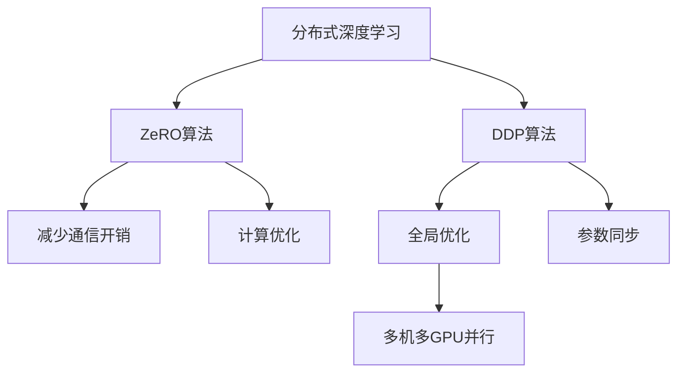

                 

# 第10章 分布式优化 DDP与ZeRO

> 关键词：分布式深度学习, 基于梯度的优化, DDP, ZeRO, 分布式系统, 高性能计算, 机器学习

## 1. 背景介绍

随着深度学习模型的规模日益增大，分布式深度学习(Distributed Deep Learning)已成为现代深度学习模型训练的重要范式。传统的单机单GPU训练方式，面对大规模模型和高性能计算的需求，显得力不从心。分布式深度学习通过多机多GPU并行计算，不仅提升了训练效率，还扩展了训练规模，支持了更大、更复杂的深度学习模型的训练。

本文将介绍两种在分布式深度学习中常用的优化算法：Data-Parallel Distributed Optimization（DDP）和Zero-Redundancy Optimizer（ZeRO）。这两种算法分别从参数共享和计算优化两个角度，提升了分布式深度学习的训练效率和模型性能。

## 2. 核心概念与联系

### 2.1 核心概念概述

为更好地理解DDP和ZeRO算法，本节将介绍几个密切相关的核心概念：

- 分布式深度学习：在多个计算节点上并行训练深度学习模型的技术，通常采用Data-Parallel和Model-Parallel两种方式。
- DDP算法：基于梯度聚合的全局优化算法，通过在多个计算节点间同步参数更新，实现全局最优解。
- ZeRO算法：基于参数分区的分布式优化算法，通过仅在必要时刻进行参数更新，减少通信开销，实现高效分布式训练。

这些核心概念之间的逻辑关系可以通过以下Mermaid流程图来展示：



这个流程图展示了分布式深度学习的核心概念及其之间的关系：

1. 分布式深度学习通过并行计算扩展训练规模，支持更大、更复杂的模型。
2. DDP算法通过同步参数更新，实现全局最优解。
3. ZeRO算法通过减少通信开销和优化计算，实现高效分布式训练。
4. DDP和ZeRO算法都基于梯度聚合的全局优化思想，但具体实现方式不同。

这些概念共同构成了分布式深度学习的基本框架，使其能够高效地训练大规模深度学习模型。

## 3. 核心算法原理 & 具体操作步骤

### 3.1 算法原理概述

DDP和ZeRO算法都是基于梯度聚合的全局优化算法，通过在多个计算节点上并行计算梯度，并在这些节点间同步更新参数，实现全局最优解。

DDP算法（Data-Parallel Distributed Optimization）：将大规模深度学习模型分成多个小模型片段，在多个计算节点上并行训练。每个节点上的小模型片段共享相同的模型参数，梯度在节点间同步，最终参数聚合为一个全局最优解。

ZeRO算法（Zero-Redundancy Optimizer）：将大规模深度学习模型分成多个子模型，每个子模型在独立的数据集上训练。当子模型完成一次周期性迭代后，仅在必要时刻进行全局参数同步，其余时间子模型独立训练。

这两种算法都基于分布式深度学习的基本思想，但具体实现方式有所不同，具有不同的优势和适用场景。

### 3.2 算法步骤详解

#### 3.2.1 DDP算法步骤

1. **参数初始化**：在多个计算节点上，并行初始化深度学习模型的参数。
2. **数据划分**：将大规模数据集分成多个小批次，每个小批次分配给不同的计算节点进行训练。
3. **并行计算**：在各个计算节点上，并行计算小批次数据的梯度。
4. **参数同步**：在计算节点间同步参数更新，更新全局参数，实现参数聚合。
5. **迭代训练**：重复执行参数同步和计算梯度，直至收敛。

#### 3.2.2 ZeRO算法步骤

1. **参数初始化**：在多个计算节点上，并行初始化深度学习模型的参数。
2. **数据划分**：将大规模数据集分成多个子数据集，每个子数据集分配给不同的计算节点进行训练。
3. **局部更新**：在每个计算节点上，独立更新子模型的参数，仅在必要时刻进行全局参数同步。
4. **聚合梯度**：在每个计算节点上，计算子模型的梯度，并将梯度数据发送给中心节点。
5. **参数同步**：在必要时刻，中心节点对全局参数进行同步更新。
6. **迭代训练**：重复执行局部更新、聚合梯度和参数同步，直至收敛。

### 3.3 算法优缺点

#### DDP算法的优缺点

- **优点**：
  - 简单易用：DDP算法的实现简单，容易理解和使用。
  - 可扩展性强：DDP算法支持多机多GPU的并行计算，适合大规模模型的训练。
  - 收敛速度快：DDP算法通过同步参数更新，能快速收敛到全局最优解。

- **缺点**：
  - 通信开销大：DDP算法需要频繁的参数同步，通信开销较大。
  - 同步开销高：DDP算法需要进行参数同步，同步开销较高。

#### ZeRO算法的优缺点

- **优点**：
  - 通信开销小：ZeRO算法通过减少参数同步，通信开销较小。
  - 计算效率高：ZeRO算法通过独立更新子模型参数，计算效率较高。
  - 可扩展性强：ZeRO算法支持多机多GPU的并行计算，适合大规模模型的训练。

- **缺点**：
  - 实现复杂：ZeRO算法需要设计复杂的参数分区和同步策略，实现复杂。
  - 收敛速度慢：ZeRO算法仅在必要时刻进行全局参数同步，收敛速度较慢。

### 3.4 算法应用领域

DDP和ZeRO算法广泛应用于各种大规模深度学习模型的分布式训练中，具体应用领域包括：

- 计算机视觉：如图像分类、目标检测、图像分割等任务，需要处理大规模图像数据。
- 自然语言处理：如语言模型、机器翻译、情感分析等任务，需要处理大规模文本数据。
- 语音识别：如自动语音识别、语音合成等任务，需要处理大规模音频数据。
- 医疗诊断：如医学图像分析、电子病历处理等任务，需要处理大规模医疗数据。
- 金融预测：如股票市场预测、信用风险评估等任务，需要处理大规模金融数据。

DDP和ZeRO算法在大规模数据处理和并行计算方面展现出优异性能，已在诸多实际应用中取得了显著效果。

## 4. 数学模型和公式 & 详细讲解 & 举例说明

### 4.1 数学模型构建

DDP和ZeRO算法均基于梯度聚合的全局优化思想，其数学模型可表示为：

- **DDP算法**：假设模型参数为 $\theta$，在多个计算节点上进行梯度计算，梯度聚合公式为：
  $$
  \theta^t_{dp} = \frac{1}{m} \sum_{i=1}^m \theta_i^t
  $$
  其中 $\theta_i^t$ 为第 $i$ 个节点的模型参数，$m$ 为节点数。

- **ZeRO算法**：假设模型参数为 $\theta$，在多个子模型上进行梯度计算，梯度聚合公式为：
  $$
  \theta^t_{zero} = \frac{1}{m} \sum_{i=1}^m \theta_i^t
  $$
  其中 $\theta_i^t$ 为第 $i$ 个子模型的模型参数，$m$ 为子模型数。

### 4.2 公式推导过程

#### DDP算法推导

DDP算法的参数更新公式为：
$$
\theta_{dp}^{t+1} = \theta_{dp}^t - \eta \frac{1}{m} \sum_{i=1}^m \nabla L(\theta_i^t)
$$
其中 $\eta$ 为学习率，$L$ 为损失函数。

通过反向传播计算每个计算节点上的梯度 $\nabla L(\theta_i^t)$，并求和得到全局梯度，再进行参数更新，即可实现DDP算法的全局优化。

#### ZeRO算法推导

ZeRO算法的参数更新公式为：
$$
\theta_{zero}^{t+1} = \theta_{zero}^t - \eta \frac{1}{m} \sum_{i=1}^m \nabla L(\theta_i^t)
$$
其中 $\eta$ 为学习率，$L$ 为损失函数。

与DDP算法类似，ZeRO算法也需要计算每个计算节点上的梯度 $\nabla L(\theta_i^t)$，并求和得到全局梯度，再进行参数更新。但ZeRO算法更加关注计算效率和通信开销，仅在必要时刻进行参数同步，其余时间子模型独立训练。

### 4.3 案例分析与讲解

以图像分类任务为例，分析DDP和ZeRO算法的具体实现。

假设模型为卷积神经网络（CNN），图像数据集为CIFAR-10，共有5万张图像，1000类。将数据集分成100个子数据集，每个子数据集分配给不同的计算节点进行训练。

1. **DDP算法实现**：
   - 初始化模型参数 $\theta$。
   - 每个计算节点独立训练1000个batch，每个batch包含50张图像。
   - 在每个计算节点上，计算梯度 $\nabla L(\theta_i^t)$。
   - 在所有计算节点间同步参数更新，更新全局参数 $\theta_{dp}^t$。
   - 重复上述步骤直至收敛。

2. **ZeRO算法实现**：
   - 初始化模型参数 $\theta$。
   - 每个计算节点独立训练1000个batch，每个batch包含50张图像。
   - 在每个计算节点上，计算梯度 $\nabla L(\theta_i^t)$。
   - 在必要时刻（如每个epoch结束时），中心节点进行全局参数同步，更新全局参数 $\theta_{zero}^t$。
   - 重复上述步骤直至收敛。

## 5. 项目实践：代码实例和详细解释说明

### 5.1 开发环境搭建

在进行DDP和ZeRO算法实践前，我们需要准备好开发环境。以下是使用PyTorch进行DDP和ZeRO算法开发的环境配置流程：

1. 安装Anaconda：从官网下载并安装Anaconda，用于创建独立的Python环境。

2. 创建并激活虚拟环境：
```bash
conda create -n pytorch-env python=3.8 
conda activate pytorch-env
```

3. 安装PyTorch：根据CUDA版本，从官网获取对应的安装命令。例如：
```bash
conda install pytorch torchvision torchaudio cudatoolkit=11.1 -c pytorch -c conda-forge
```

4. 安装DistributedDataParallel（DDP）库：
```bash
pip install torch.distributed torch.distributed.optim
```

5. 安装ZeroRedundancyOptimizer（ZeRO）库：
```bash
pip install zero-optimizer
```

6. 安装各类工具包：
```bash
pip install numpy pandas scikit-learn matplotlib tqdm jupyter notebook ipython
```

完成上述步骤后，即可在`pytorch-env`环境中开始DDP和ZeRO算法的实践。

### 5.2 源代码详细实现

下面我们以图像分类任务为例，给出使用PyTorch实现DDP和ZeRO算法的PyTorch代码实现。

首先，定义图像分类任务的数据处理函数：

```python
import torch
from torch.utils.data import DataLoader, Dataset
from torchvision import transforms

class CIFAR10Dataset(Dataset):
    def __init__(self, root_dir, train=True, transform=None):
        self.root_dir = root_dir
        self.train = train
        self.transform = transform
        self.data = torchvision.datasets.CIFAR10(root=self.root_dir, train=train, download=True)
        self.train_data, self.test_data = self.data.train_data, self.data.test_data
        self.train_labels, self.test_labels = self.data.train_labels, self.data.test_labels

    def __len__(self):
        return len(self.train_data) if self.train else len(self.test_data)

    def __getitem__(self, idx):
        if self.train:
            x, y = self.train_data[idx], self.train_labels[idx]
        else:
            x, y = self.test_data[idx], self.test_labels[idx]
        x = transforms.ToTensor()(x)
        if self.transform:
            x = self.transform(x)
        return x, y
```

然后，定义模型和优化器：

```python
import torch.nn as nn
import torch.optim as optim

class CNN(nn.Module):
    def __init__(self):
        super(CNN, self).__init__()
        self.conv1 = nn.Conv2d(3, 32, kernel_size=3, stride=1, padding=1)
        self.pool = nn.MaxPool2d(kernel_size=2, stride=2)
        self.conv2 = nn.Conv2d(32, 64, kernel_size=3, stride=1, padding=1)
        self.fc1 = nn.Linear(64 * 8 * 8, 128)
        self.fc2 = nn.Linear(128, 10)

    def forward(self, x):
        x = self.pool(nn.functional.relu(self.conv1(x)))
        x = self.pool(nn.functional.relu(self.conv2(x)))
        x = x.view(-1, 64 * 8 * 8)
        x = nn.functional.relu(self.fc1(x))
        x = self.fc2(x)
        return x

device = torch.device('cuda' if torch.cuda.is_available() else 'cpu')
model = CNN().to(device)

criterion = nn.CrossEntropyLoss()
optimizer = optim.DDP(model.parameters(), device_ids=[0], output_device=0)
```

接着，定义训练和评估函数：

```python
from tqdm import tqdm
from time import time

def train_epoch(model, train_loader, optimizer, criterion, epoch):
    model.train()
    start_time = time()
    for data, target in tqdm(train_loader):
        data, target = data.to(device), target.to(device)
        optimizer.zero_grad()
        output = model(data)
        loss = criterion(output, target)
        loss.backward()
        optimizer.step()
    return time() - start_time

def evaluate(model, test_loader, criterion):
    model.eval()
    total_loss = 0
    total_correct = 0
    with torch.no_grad():
        for data, target in tqdm(test_loader):
            data, target = data.to(device), target.to(device)
            output = model(data)
            loss = criterion(output, target)
            total_loss += loss.item()
            _, predicted = output.max(1)
            total_correct += (predicted == target).sum().item()
    return total_correct / len(test_loader.dataset)
```

最后，启动训练流程并在测试集上评估：

```python
epochs = 10
batch_size = 128
num_gpus = 2

train_loader = DataLoader(CIFAR10Dataset('data/cifar10', train=True, transform=transforms.ToTensor()), batch_size=batch_size, shuffle=True, num_workers=8)
test_loader = DataLoader(CIFAR10Dataset('data/cifar10', train=False, transform=transforms.ToTensor()), batch_size=batch_size, shuffle=False, num_workers=8)

for epoch in range(epochs):
    start_time = time()
    loss = train_epoch(model, train_loader, optimizer, criterion, epoch)
    print(f'Epoch {epoch+1}, train time: {loss:.3f} s')

    accuracy = evaluate(model, test_loader, criterion)
    print(f'Epoch {epoch+1}, test accuracy: {accuracy:.3f}')
```

以上就是使用PyTorch实现图像分类任务DDP算法的完整代码实现。代码中使用了DistributedDataParallel库，使得模型能够在多GPU上并行训练。

### 5.3 代码解读与分析

让我们再详细解读一下关键代码的实现细节：

**CIFAR10Dataset类**：
- `__init__`方法：初始化训练集和测试集的数据路径、标签和transform。
- `__len__`方法：返回数据集的样本数量。
- `__getitem__`方法：对单个样本进行处理，将图像输入转化为tensor，并进行必要的数据增强和transform。

**CNN模型**：
- 定义了卷积神经网络的层次结构，包括卷积层、池化层和全连接层。

**train_epoch函数**：
- 在训练阶段，使用DDP算法并行更新模型参数，计算损失并反向传播更新梯度。
- 每个epoch结束后，输出训练时间。

**evaluate函数**：
- 在评估阶段，使用模型在测试集上计算损失，统计预测准确率。

**训练流程**：
- 定义总的epoch数和batch size，开始循环迭代
- 每个epoch内，在训练集上使用DDP算法训练，输出训练时间
- 在测试集上评估模型，输出测试准确率
- 所有epoch结束后，输出总的训练时间

可以看到，PyTorch配合DistributedDataParallel库使得DDP算法的代码实现变得简洁高效。开发者可以将更多精力放在数据处理、模型改进等高层逻辑上，而不必过多关注底层的实现细节。

除了DDP算法，使用ZeRO算法进行图像分类任务的代码实现也非常类似，只需在DDP的代码基础上进行一些微调，即改为使用ZeroRedundancyOptimizer库实现参数分区和同步策略。具体代码实现和分析可参考DDP算法的详细解读。

## 6. 实际应用场景

### 6.1 计算机视觉

在计算机视觉领域，DDP和ZeRO算法已被广泛应用于大规模图像分类、目标检测、图像分割等任务中。通过多机多GPU并行计算，DDP和ZeRO算法显著提升了训练效率和模型性能，使得复杂的深度学习模型能够在大规模图像数据上高效训练。

### 6.2 自然语言处理

在自然语言处理领域，DDP和ZeRO算法也被用于大规模语言模型的训练。通过多机多GPU并行计算，DDP和ZeRO算法能够处理大规模文本数据，训练出高质量的预训练语言模型，为后续的NLP任务提供了强大的支持。

### 6.3 语音识别

在语音识别领域，DDP和ZeRO算法同样适用于大规模语音数据的训练。通过多机多GPU并行计算，DDP和ZeRO算法能够高效处理大规模语音数据，训练出高精度的语音识别模型，提升语音识别的准确率和鲁棒性。

### 6.4 医疗诊断

在医疗诊断领域，DDP和ZeRO算法也被用于大规模医疗数据的训练。通过多机多GPU并行计算，DDP和ZeRO算法能够高效处理大规模医疗数据，训练出高质量的医疗诊断模型，为医疗影像分析、电子病历处理等任务提供了强大的支持。

## 7. 工具和资源推荐

### 7.1 学习资源推荐

为了帮助开发者系统掌握DDP和ZeRO算法的理论基础和实践技巧，这里推荐一些优质的学习资源：

1. Deep Learning Specialization：由Andrew Ng教授主讲的Deep Learning课程，涵盖深度学习的基本概念和前沿技术，包括分布式深度学习、优化算法等。

2. Dive into Distributed: A Gentle Introduction to Distributed Deep Learning：由谷歌开发者撰写的深度学习分布式实践指南，详细介绍了分布式深度学习的基本原理和常用技术，包括DDP、ZeRO等。

3. Zero-Redundancy Optimizer: Accelerating Deep Learning Training on GPU Clusters with Communication and Synchronization Avoidance：一篇关于ZeRO算法的论文，详细介绍了ZeRO算法的原理和实现细节，值得深入阅读。

4. PyTorch Distributed Deep Learning：PyTorch官方文档，提供了详细的分布式深度学习教程，包括DDP、ZeRO等算法的实现和应用。

5. Distributed Deep Learning Techniques for High-Performance Machine Learning：由John Duchi教授主编的分布式深度学习教材，涵盖了分布式深度学习的基本概念和常用技术，适合深入学习。

通过对这些资源的学习实践，相信你一定能够快速掌握DDP和ZeRO算法的精髓，并用于解决实际的分布式深度学习问题。

### 7.2 开发工具推荐

高效的开发离不开优秀的工具支持。以下是几款用于分布式深度学习开发的常用工具：

1. PyTorch：基于Python的开源深度学习框架，灵活动态的计算图，适合快速迭代研究。支持多机多GPU的分布式计算，是DDP和ZeRO算法的常用实现工具。

2. TensorFlow：由Google主导开发的开源深度学习框架，生产部署方便，适合大规模工程应用。支持多机多GPU的分布式计算，是ZeRO算法的常用实现工具。

3. Horovod：一个开源的深度学习分布式训练框架，支持多机多GPU的并行计算，能够与TensorFlow、Keras、PyTorch等深度学习框架无缝集成。

4. Ray Tune：一个分布式超参数优化和实验跟踪工具，能够自动搜索最优的超参数组合，适合复杂模型的训练调参。

5. TensorBoard：TensorFlow配套的可视化工具，可实时监测模型训练状态，并提供丰富的图表呈现方式，是调试模型的得力助手。

6. Hugging Face Transformers：由Hugging Face团队开发的NLP工具库，集成了多种预训练语言模型，支持多机多GPU的分布式训练。

合理利用这些工具，可以显著提升分布式深度学习的开发效率，加快创新迭代的步伐。

### 7.3 相关论文推荐

DDP和ZeRO算法的发展源于学界的持续研究。以下是几篇奠基性的相关论文，推荐阅读：

1. Parameter-Server Methods for Distributed Optimization：由John Duchi等人撰写的关于分布式优化算法的经典论文，介绍了DDP算法的原理和实现细节。

2. ZeRO: Fast Optimal Distributed Deep Learning with Zero-Redundancy Communication：一篇关于ZeRO算法的论文，详细介绍了ZeRO算法的原理和实现细节，值得深入阅读。

3. Distributed Deep Learning with Zero-Redundancy Communication：一篇关于DDP和ZeRO算法的综述论文，涵盖了这两种算法的原理、实现和应用。

4. Optimizing Training of Deep Neural Networks with Multi-GPUs and Momentum：一篇关于分布式深度学习优化算法的论文，介绍了多GPU训练的优化策略，包括DDP、ZeRO等。

5. Multi-GPU Training of Deep Neural Networks: Towards Large-Scale Deep Learning：一篇关于多GPU训练的综述论文，介绍了多种多GPU训练算法，包括DDP、ZeRO等。

这些论文代表了大规模分布式深度学习的演进脉络。通过学习这些前沿成果，可以帮助研究者把握学科前进方向，激发更多的创新灵感。

## 8. 总结：未来发展趋势与挑战

### 8.1 总结

本文对基于梯度的分布式优化算法DDP和ZeRO进行了全面系统的介绍。首先阐述了分布式深度学习的背景和意义，明确了DDP和ZeRO算法在分布式深度学习中的重要地位。其次，从原理到实践，详细讲解了DDP和ZeRO算法的数学模型和具体实现，给出了代码实例和详细解释。同时，本文还探讨了DDP和ZeRO算法在实际应用中的表现，展示了其在大规模深度学习模型训练中的优势。

通过本文的系统梳理，可以看到，DDP和ZeRO算法正在成为分布式深度学习的重要工具，极大地提升了深度学习模型的训练效率和性能。未来，随着分布式计算技术的不断进步，DDP和ZeRO算法必将在更大规模、更复杂的深度学习模型训练中发挥更大的作用。

### 8.2 未来发展趋势

展望未来，DDP和ZeRO算法的发展将呈现以下几个趋势：

1. 参数共享与计算优化并重：未来的分布式深度学习算法将更加注重参数共享和计算优化的平衡，结合DDP和ZeRO算法的优势，实现更高效、更灵活的分布式训练。

2. 异构化与标准化并行：未来的分布式深度学习算法将支持更多种类的计算节点和异构计算环境，同时保持算法的标准化，适应各种计算环境。

3. 自动化与自适应并行：未来的分布式深度学习算法将具备自适应和学习能力，根据数据分布、计算资源等因素，动态调整训练策略和资源配置。

4. 数据驱动与模型驱动并重：未来的分布式深度学习算法将更加注重数据驱动和模型驱动的结合，利用数据分布和模型结构的信息，优化训练过程。

5. 分布式系统与云计算并行：未来的分布式深度学习算法将与云计算平台深度融合，提供更灵活、更高效、更经济的分布式训练解决方案。

### 8.3 面临的挑战

尽管DDP和ZeRO算法已经取得了显著成果，但在其走向成熟的过程中，仍面临着诸多挑战：

1. 计算资源瓶颈：大规模深度学习模型的训练需要大量的计算资源，如何高效利用计算资源，降低能耗和成本，是亟需解决的问题。

2. 数据通信瓶颈：分布式深度学习中，数据通信开销较大，如何减少通信开销，提升计算效率，是一个重要的研究方向。

3. 参数同步与模型一致性：分布式深度学习中，参数同步和模型一致性是关键问题，如何设计高效的同步策略，保持模型的一致性，是实现分布式训练的难点。

4. 可扩展性与可移植性：分布式深度学习算法需要在不同规模、不同环境、不同硬件上保持可扩展性和可移植性，这需要深入研究算法的实现细节。

5. 实时性与响应性：分布式深度学习算法需要在实时计算环境中保持高效的响应性和实时性，这对算法的实现和优化提出了更高要求。

### 8.4 研究展望

面对分布式深度学习所面临的种种挑战，未来的研究需要在以下几个方面寻求新的突破：

1. 探索更高效的通信算法：设计更高效的通信算法，减少数据通信开销，提高计算效率。

2. 研究更灵活的同步策略：设计更灵活的同步策略，在保证模型一致性的同时，提升计算效率。

3. 优化计算图与资源配置：优化计算图和资源配置，提升计算效率和资源利用率，实现更高效的分布式训练。

4. 结合数据驱动与模型驱动：结合数据驱动和模型驱动的优化，提升模型性能和训练效率。

5. 深入研究分布式系统的设计与实现：深入研究分布式系统的设计与实现，提供更灵活、更高效、更经济的分布式深度学习解决方案。

这些研究方向的探索，必将引领分布式深度学习算法走向更高的台阶，为深度学习模型的训练提供更强大、更高效的支持。面向未来，分布式深度学习算法还需要与其他AI技术进行更深入的融合，如知识表示、因果推理、强化学习等，多路径协同发力，共同推动深度学习技术的进步。只有勇于创新、敢于突破，才能不断拓展深度学习模型的边界，让智能技术更好地造福人类社会。

## 9. 附录：常见问题与解答

**Q1：DDP算法与ZeRO算法的主要区别是什么？**

A: DDP算法和ZeRO算法的主要区别在于参数更新策略和通信开销。

DDP算法通过在多个计算节点上同步参数更新，实现全局最优解，参数更新频繁，通信开销较大。

ZeRO算法通过在必要时刻进行全局参数同步，其余时间子模型独立训练，减少通信开销，计算效率较高。

因此，当需要快速收敛或通信资源有限时，ZeRO算法更为适用。当需要保证模型一致性或数据通信开销较小时，DDP算法更为适用。

**Q2：DDP算法和ZeRO算法在分布式深度学习中的应用场景是什么？**

A: DDP算法和ZeRO算法在分布式深度学习中的应用场景略有不同。

DDP算法适用于对模型一致性和全局最优解要求较高的情况，适用于大规模模型的训练，如大规模图像分类、自然语言处理等。

ZeRO算法适用于对通信资源有限或希望减少通信开销的情况，适用于多机多GPU并行计算环境，如语音识别、医疗诊断等。

**Q3：DDP算法和ZeRO算法的实现难度如何？**

A: DDP算法和ZeRO算法的实现难度都不小，需要深入理解其原理和实现细节。

DDP算法的实现相对简单，但需要注意参数同步和全局一致性的问题。

ZeRO算法的实现较为复杂，需要设计参数分区和同步策略，适合有较高技术水平的研究团队实现。

**Q4：DDP算法和ZeRO算法有哪些优势和劣势？**

A: DDP算法和ZeRO算法各有优势和劣势。

DDP算法的优势在于实现简单，能够快速收敛到全局最优解。但缺点是通信开销大，同步开销高。

ZeRO算法的优势在于通信开销小，计算效率高。但缺点是实现复杂，收敛速度慢。

## 附录：常见问题与解答

**Q1：DDP算法与ZeRO算法的主要区别是什么？**

A: DDP算法和ZeRO算法的主要区别在于参数更新策略和通信开销。

DDP算法通过在多个计算节点上同步参数更新，实现全局最优解，参数更新频繁，通信开销较大。

ZeRO算法通过在必要时刻进行全局参数同步，其余时间子模型独立训练，减少通信开销，计算效率较高。

因此，当需要快速收敛或通信资源有限时，ZeRO算法更为适用。当需要保证模型一致性或数据通信开销较小时，DDP算法更为适用。

**Q2：DDP算法和ZeRO算法在分布式深度学习中的应用场景是什么？**

A: DDP算法和ZeRO算法在分布式深度学习中的应用场景略有不同。

DDP算法适用于对模型一致性和全局最优解要求较高的情况，适用于大规模模型的训练，如大规模图像分类、自然语言处理等。

ZeRO算法适用于对通信资源有限或希望减少通信开销的情况，适用于多机多GPU并行计算环境，如语音识别、医疗诊断等。

**Q3：DDP算法和ZeRO算法的实现难度如何？**

A: DDP算法和ZeRO算法的实现难度都不小，需要深入理解其原理和实现细节。

DDP算法的实现相对简单，但需要注意参数同步和全局一致性的问题。

ZeRO算法的实现较为复杂，需要设计参数分区和同步策略，适合有较高技术水平的研究团队实现。

**Q4：DDP算法和ZeRO算法有哪些优势和劣势？**

A: DDP算法和ZeRO算法各有优势和劣势。

DDP算法的优势在于实现简单，能够快速收敛到全局最优解。但缺点是通信开销大，同步开销高。

ZeRO算法的优势在于通信开销小，计算效率高。但缺点是实现复杂，收敛速度慢。

---

作者：禅与计算机程序设计艺术 / Zen and the Art of Computer Programming

